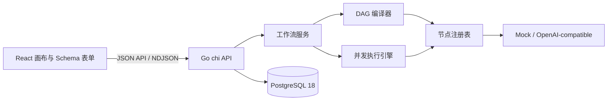

# Agent Studio

Agent Studio 是一套轻量化、本地优先的 Agent 开发系统：用低代码画布组合工作流，从开始节点参数自动生成聚焦式 Agent 页面，并通过后端节点注册表快速扩展能力。首版采用 Go 单体 API、React 画布和 Docker PostgreSQL，默认 Mock 模型即可跑通完整闭环。



## 开发者预览版本

当前准备发布的正式开发者预览版本为 `v0.3.0`，面向源码使用者、工作流模板作者和节点包开发者。它已包含本地工作流模板、节点包兼容检查与只读官方节点包索引，但仍不代表生产稳定性或 v1 兼容承诺。本次发布准备不预先声明远端标签或 GitHub Release 已存在；源码安装仅在远端标签存在后可用，附件下载仅在标签工作流成功公开 Release 后可用，使用时以远端状态为准。完整能力、安全边界、升级说明和已知限制见 [v0.3.0 Release Notes](docs/releases/v0.3.0.md)。

标签创建后的源码安装命令：

```bash
CGO_ENABLED=0 go install github.com/yyl1212/agent-studio/cmd/agent-studio@v0.3.0
agent-studio version
```

### 预编译 CLI 附件

`v0.3.0` 仅在标签工作流全部成功并公开 GitHub Release 后提供 Linux/macOS 的 amd64、arm64 CLI 归档、SHA-256 校验和与逐归档 SPDX JSON SBOM。下载示例：

```bash
VERSION=v0.3.0
OS=darwin
ARCH=arm64
ARCHIVE="agent-studio_${VERSION}_${OS}_${ARCH}.tar.gz"
BASE_URL="https://github.com/yyl1212/agent-studio/releases/download/${VERSION}"

curl -fLO "${BASE_URL}/${ARCHIVE}"
curl -fLO "${BASE_URL}/checksums.txt"
grep "  ${ARCHIVE}$" checksums.txt | shasum -a 256 -c -
tar -xzf "${ARCHIVE}"
./agent-studio version
```

Linux 使用 `sha256sum` 校验：

```bash
grep "  ${ARCHIVE}$" checksums.txt | sha256sum -c -
```

支持的预编译目标如下：

| 操作系统 | 架构 |
| --- | --- |
| Linux | amd64 |
| Linux | arm64 |
| macOS | amd64 |
| macOS | arm64 |

macOS 归档目前未签名，也未经过 Apple Developer ID 签名或公证。`checksums.txt` 中的 SHA-256 只能确认下载内容与发布附件一致，不能替代发布者签名验证。若目标 Release 没有预编译附件，请继续使用 `go install`；这也是当前更稳妥的安装方式。

## 环境要求

- Go 1.26（项目 toolchain 为 1.26.5）
- Node.js 24
- Corepack 与 pnpm 10.34.5
- Docker Desktop / Docker Compose

首次安装：

```bash
corepack enable
corepack pnpm@10.34.5 install
cp .env.example .env
```

## 本地启动

启动 PostgreSQL：

```bash
make db-up
```

终端一启动 API（启动时自动执行幂等 migration）：

```bash
make dev-api
```

`make dev-api` 会自动加载根目录 `.env`；修改模型或网络策略配置后重启 API 即可生效。

终端二启动 Web：

```bash
make dev-web
```

打开 `http://localhost:5173/workflows`。默认 `MODEL_PROVIDER=mock`，无需密钥：创建工作流，配置开始节点，添加“提示词模板”和“LLM”，连接到结束节点后即可测试、发布并运行 Agent。

顶部“节点包”导航提供只读的本地索引目录；使用与安全边界见[官方节点包索引](docs/node-index.md)。

健康检查：`GET http://localhost:8080/healthz`；就绪检查还会验证 PostgreSQL 与最新 migration：`GET http://localhost:8080/readyz`。

## Go 节点 SDK

第三方节点只需导入：

```go
import "github.com/yyl1212/agent-studio/sdk/go/agentnode"
```

公开 SDK 当前为 v0.3 / `agent-studio.dev/v1alpha1`。完整生命周期与可编译示例见 [Go 节点 SDK API](docs/sdk/api.md)，版本承诺见 [兼容性策略](docs/sdk/compatibility.md)，开发入口见 [节点扩展指南](docs/node-development.md)。

节点仍在 API 进程内运行。Capability 只用于展示和审计，不提供沙箱隔离；生产环境只应加载可信扩展，并用容器、系统权限和网络策略建立安全边界。

### 创建扩展节点

仓库内置低代码节点开发闭环：环境检查、脚手架、契约测试、确定性注册代码生成，以及无需前端专用组件的画布验证。

```bash
CGO_ENABLED=0 go run ./cmd/agent-studio doctor
CGO_ENABLED=0 go run ./cmd/agent-studio node init my-echo
CGO_ENABLED=0 go run ./cmd/agent-studio node test ./extensions/my-echo
CGO_ENABLED=0 go run ./cmd/agent-studio generate
```

查看当前应用构建、SDK/API 契约和提交信息：

```bash
CGO_ENABLED=0 go run ./cmd/agent-studio version
```

源码开发构建显示 `0.3.0-dev`；从版本标签安装时显示对应 tag。

完整步骤见 [30 分钟创建第一个扩展节点](docs/sdk/quickstart.md)，错误处理见 [节点开发排错](docs/sdk/debugging.md)。扩展与 API 同进程运行，只应加载可信源码。

### 官方扩展节点

根 manifest 默认登记三个可直接在通用画布使用的扩展：

- Echo：最小文本节点示例，为输入添加前缀。
- Retriever：基于本地 Jaccard 相似度的确定性演示，不使用向量数据库或 Embedding，也不作为生产知识库。
- Webhook：固定向运维指定的基地址发送 JSON `POST`；工作流只能保存受约束的相对 `path`。

使用 Webhook 前，在 `.env` 配置 API 进程环境：

```dotenv
AGENT_STUDIO_WEBHOOK_URL=https://hooks.example.com/agent-studio
AGENT_STUDIO_WEBHOOK_TOKEN=
```

Token 可选，只能由运维环境提供，不得写入工作流配置。修改这两个变量后需重启 API；URL 留空不影响启动，只会在执行 Webhook 时返回安全的缺少配置错误。

## 模型配置

默认配置：

```dotenv
MODEL_PROVIDER=mock
```

切换到 OpenAI-compatible Chat Completions 服务：

```dotenv
MODEL_PROVIDER=openai-compatible
OPENAI_BASE_URL=https://your-provider.example/v1
OPENAI_API_KEY=
OPENAI_DEFAULT_MODEL=your-model
```

密钥只通过环境变量传入，不进入工作流 JSON、API 响应或日志。

### LLM v2 结构化输出

节点库同时保留两个版本：`LLM`（`llm@1`）继续生成文本，`LLM · 结构化输出`（`llm@2`）可选择文本或严格结构化模式。最小画布如下：

```text
开始 → 提示词模板 → LLM · 结构化输出 → 结束
```

在 v2 节点把“输出模式”设为 `structured`，再用低代码字段列表声明 1–32 个输出字段。字段类型支持字符串、数字、整数、布尔值和字符串数组；取消“必填”的字段会按 nullable 字段处理。节点会提供完整 `json` 端口、每个已声明字段的动态端口，以及 `usage` 端口。修改或删除字段后，应重新连接画布上已经失效的动态端口。

默认 Mock Provider 可直接演示：字符串字段返回 `Mock 回复：<提示词>`，数字和整数返回 `0`，布尔值返回 `false`，字符串数组返回空数组。接入 OpenAI-compatible 服务时，服务必须原生支持 Chat Completions 的 strict JSON Schema `response_format`；Agent Studio 不会自动降级为提示词约束，也不会隐藏重试。模型拒绝结构化输出、上游失败或本地二次校验失败都会返回稳定的公开错误，原始上游响应与密钥不会进入工作流输出、API 错误或日志。

## HTTP 节点密钥与网络策略

HTTP 节点的敏感 Header 必须选择环境变量来源并填写变量名，例如 `UPSTREAM_API_KEY`；禁止把 Authorization/Cookie 直接写入配置。默认拒绝 loopback、私网、link-local 和解析后落入私网的地址，以降低 SSRF 风险。本地可信开发环境确需访问私网时才设置：

```dotenv
HTTP_NODE_ALLOW_PRIVATE=true
```

## 验证

不启动 Docker 的提交前快速检查：

```bash
make verify-quick
```

该命令运行 Go 生成物检查、单元测试、vet、发布脚本测试，以及前端
OpenAPI 生成物检查、lint、类型检查、组件测试和生产构建。

需要 Docker PostgreSQL 的完整回归：

```bash
make verify
make test-e2e
make test-sdk-e2e
```

`make verify` 会检查节点生成代码，启动数据库，运行全部 Go 测试、`go vet`、OpenAPI 类型再生成差异检查、前端类型检查、组件测试和生产构建。`make test-e2e` 使用真实浏览器验证创建、配置、连线、测试、发布、版本绑定和 Agent 运行；`make test-sdk-e2e` 额外验证临时 Module 的 CLI 黄金路径和通用画布 Echo 节点。

单独调试：

```bash
cd apps/api && CGO_ENABLED=0 go test ./... -count=1
corepack pnpm@10.34.5 test
corepack pnpm@10.34.5 build
```

## 项目结构

- `apps/api`：Go API、DAG 编译/执行、节点、PostgreSQL store 和 migration。
- `apps/web`：React 工作流列表、画布 Studio、通用 Schema 表单、Agent 页与运行记录。
- `sdk/go/agentnode`：公开节点协议；`sdk/go/agenttest`：第三方节点契约测试工具。
- `contracts/openapi.yaml`：前后端唯一 HTTP 契约来源。
- [工作流模板导入导出](docs/workflow-templates.md)：本地 JSON 模板的使用方法与安全边界。
- [节点包开发与兼容检查](docs/node-packages.md)：节点包清单、离线检查、手工安装和模板依赖提示。
- [官方节点包索引](docs/node-index.md)：离线搜索、显式刷新、缓存恢复和人工源码审核流程。
- `docs/node-development.md`：无需修改前端的节点扩展示例。
- `docs/sdk/quickstart.md`：仓库节点创建、测试、生成和画布验证的黄金路径。

## 首版边界

- 单租户、本地部署，不包含登录、RBAC、团队协作与审计后台。
- 工作流是无环图，不支持循环、人工审批、定时触发和分布式队列。
- 运行在 API 进程内执行；重启不会恢复正在运行的任务。
- 模型接入为 Mock 或 OpenAI-compatible Chat Completions，不含供应商专属高级能力。
- Code 节点使用受步数、时间和输出大小约束的 Starlark，不执行任意系统命令。

## 社区与安全

- 贡献流程：[CONTRIBUTING.md](CONTRIBUTING.md)
- 行为准则：[CODE_OF_CONDUCT.md](CODE_OF_CONDUCT.md)
- 安全报告：[SECURITY.md](SECURITY.md)
- 许可证：[Apache-2.0](LICENSE)
