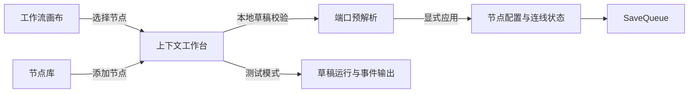

# Studio 聚焦工作台使用指南

Studio 采用“画布 + 单一上下文工作台”的交互：画布始终保留工作流全局结构，右侧工作台在节点配置与测试运行之间切换。窄屏时，同一个工作台会移到底部或覆盖为全高面板，不会同时叠加多个业务抽屉。

## 配置节点

1. 点击画布节点，或从“添加节点”中选择节点类型。新增节点会自动打开配置工作台。
2. 必填项默认展开；“可选配置”默认折叠，按需展开。
3. 输入内容先保存在浏览器内的节点草稿中，不会立即修改画布数据或写入服务端。
4. 表单有效后，Studio 只解析当前节点的动态端口，并显示新增、移除及可能失效的连线数量。
5. 点击“应用配置”，或按 `Cmd/Ctrl + Enter`，配置与端口才会作为一个整体写入画布并进入保存队列。

“应用配置”在表单无效、端口仍在解析或解析失败时不可用。修正错误后，Studio 会重新解析当前节点；旧节点或旧草稿返回的迟到结果会被忽略。

配置头部会持续显示当前状态，并同时使用图标和文字表达：

- “已应用”：当前表单与画布配置一致。
- “有未应用更改”：输入已改变，尚未完成端口解析。
- “正在解析端口”：正在根据通用 Schema 配置计算动态端口。
- “可以应用”：表单有效且端口预览已就绪。
- “需要处理”：表单校验或端口解析失败；错误摘要可定位首个字段，解析失败可原位重试。

底部操作区始终提供“重置”“应用配置”“应用并试运行”。重置只恢复当前节点最近一次已应用值；“应用并试运行”会先等待保存成功，再进入测试工作台。开始或结束节点没有配置字段时显示“此节点无需配置”，不会渲染空表单。

## 端口变化与失效连线

如果新配置会移除已被连线使用的端口，Studio 会在修改画布前显示“确认端口变化”，列出移除端口与每条受影响连线。取消不会修改本地图或触发保存；确认后配置会应用，但旧连线会保留为红色虚线，系统不会静默删除或猜测新的连接关系。

存在失效连线时，命令条会显示数量和修复提示，并在按钮与执行函数两层阻止测试和发布。可以删除失效连线、重新连接到有效端口，或恢复原端口；图重新有效后门禁自动解除。破坏性“应用并试运行”只应用配置，不会绕过门禁启动运行。

## 切换与草稿保护

节点配置有未应用更改时，关闭工作台、选择其他节点、打开节点库、测试、发布或导出都会先显示确认框：

- “应用并继续”：使用已校验且端口解析完成的草稿，然后执行原操作。
- “放弃更改”：恢复最近一次已应用配置，然后执行原操作。
- “取消”：保留草稿并继续编辑当前节点。

该确认只保护节点配置草稿。节点移动、连线和已应用配置仍由既有 SaveQueue 按顺序保存；测试、发布和导出会先等待保存队列完成。

“应用并继续”不会提前关闭配置工作台：只有完整图保存成功后，原来的测试、发布、版本历史或其他意图才会执行。网络失败时配置和后续意图都保留在当前页面，点击“重试保存”成功后继续；revision 冲突不会自动重放旧意图，应先“刷新工作流”取得服务端最新草稿。

## 测试与调试

点击“测试运行”后，工作台切换为输入表单和运行进度，不再弹出第二个抽屉。输入字段来自开始节点配置。关闭测试工作台不会删除已经产生的运行记录。

运行完成后可从“运行记录”进入调试回放。调试页复用同一工作台容器，显示事件时间线、节点详情和局部重跑表单；画布保持只读，选择节点不会重置当前缩放和位置。

## 开始与结束节点保护

每个工作流必须且只能有一个开始节点和一个结束节点。新建工作流会自动带上这两个边界节点；只有这两个节点时，画布中间会显示“在这里添加第一个节点”引导，点击后只打开节点库，不会创建临时节点或连线。

开始和结束节点不能通过 Delete、Backspace 或 React Flow 的批量删除操作移除。混合选择边界节点和普通节点时，Studio 会保留边界节点，删除普通节点及其关联连线，并用非阻塞提示说明被跳过的边界节点。复制或剪切边界节点也不会创建第二个边界节点。

## 历史异常草稿修复

旧版本数据若缺少或重复开始/结束节点，Studio 会把画布切换为只读并持续显示修复横幅。在修复完成前，添加、拖放、连线、配置应用、测试和发布均不可用。

- 缺失边界：确认后在现有图包围盒外的安全位置补充节点。
- 重复边界：必须为每种重复类型明确选择一个保留节点；对话框会预览要移除的重复节点和关联连线。
- 组合异常：缺失与重复问题会合并成一次完整图保存。

修复不会猜测业务语义，也不会自动重连被删除的关联边。保存成功后，页面才一次性替换为修复后的图；取消对话框不会改变任何节点、连线或 revision。

## 修复失败与冲突恢复

修复保存失败时，画布继续显示修复前的原图，对话框保留选择和错误信息，可直接再次确认重试。发生 revision 冲突时，保存队列停止后续写入，使用命令条中的“刷新工作流”重新加载服务端最新草稿，再决定如何修复；页面不会显示虚假成功，也不会用本地修复图覆盖服务端数据。

## 工作流管理

`/workflows` 是工作流管理入口。可以按名称或地址标识搜索，并在“活跃”“已归档”“全部”之间筛选。每行“操作”菜单提供复制、重命名和归档；复制时需要填写唯一的 Agent 地址标识，新副本从草稿 revision 1 开始且不会继承发布状态。

归档不会删除工作流，也不会自动取消已经创建的 Run。归档工作流仍可打开 Studio 和导出模板，但画布、节点配置、草稿测试和发布均为只读；从“已归档”筛选中执行“恢复”后才能继续编辑和运行。

## 全局运行管理

`/runs` 汇总所有工作流的运行记录，可以按工作流 ID、运行 ID、状态、模式和 RFC 3339 时间范围组合筛选。筛选条件保存在 URL 中，复制链接或刷新页面后会恢复；列表数据较多时使用“下一页”按游标继续查看。

点击“查看”会在聚焦工作台中加载完整 Run 输出和节点记录。终态 Run 提供“调试回放”入口；当前管理基础版本不会自动刷新运行状态，也不提供取消或重试，取消、重试和运行中状态刷新属于后续 PR 2。

## 尺寸与可访问操作

- 桌面宽度下，拖动工作台左边界可在 320–480px 之间调整；偏好保存在当前浏览器。
- 聚焦调整边界后，可用左右方向键每次改变 16px。
- 小于 1024px 时工作台位于底部；小于 640px 时使用接近全屏的面板。
- 配置头部和底部操作区在滚动时保持可见；按钮、菜单摘要与关闭按钮至少提供 44px 操作目标。
- 端口变化确认框在手机端使用近全宽布局，操作按钮纵向排列；桌面、平板、手机均不得产生页面级横向滚动。
- 错误摘要可直接聚焦到对应字段；端口、状态和问题数量均有文字，不只依赖颜色。
- 系统启用“减少动态效果”时，工作台、节点预览和其他位移/透明度过渡会被关闭。

## 当前边界

手机端适合查看和编辑配置，但复杂连线仍建议使用桌面；独立 Worker、浏览器断线续跑和本地 RAG 闭环不在本阶段范围。Retriever 仍是确定性演示节点，不是生产知识库。
