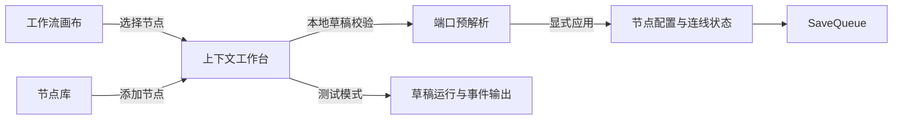

# Studio 聚焦工作台使用指南

Studio 采用“画布 + 单一上下文工作台”的交互：画布始终保留工作流全局结构，右侧工作台在节点配置与测试运行之间切换。窄屏时，同一个工作台会移到底部或覆盖为全高面板，不会同时叠加多个业务抽屉。

## 配置节点

1. 点击画布节点，或从“添加节点”中选择节点类型。新增节点会自动打开配置工作台。
2. 必填项默认展开；“可选配置”默认折叠，按需展开。
3. 输入内容先保存在浏览器内的节点草稿中，不会立即修改画布数据或写入服务端。
4. 表单有效后，Studio 只解析当前节点的动态端口，并显示新增、移除及可能失效的连线数量。
5. 点击“应用配置”，或按 `Cmd/Ctrl + Enter`，配置与端口才会作为一个整体写入画布并进入保存队列。

“应用配置”在表单无效、端口仍在解析或解析失败时不可用。修正错误后，Studio 会重新解析当前节点；旧节点或旧草稿返回的迟到结果会被忽略。

## 切换与草稿保护

节点配置有未应用更改时，关闭工作台、选择其他节点、打开节点库、测试、发布或导出都会先显示确认框：

- “应用并继续”：使用已校验且端口解析完成的草稿，然后执行原操作。
- “放弃更改”：恢复最近一次已应用配置，然后执行原操作。
- “取消”：保留草稿并继续编辑当前节点。

该确认只保护节点配置草稿。节点移动、连线和已应用配置仍由既有 SaveQueue 按顺序保存；测试、发布和导出会先等待保存队列完成。

## 测试与调试

点击“测试运行”后，工作台切换为输入表单和运行进度，不再弹出第二个抽屉。输入字段来自开始节点配置。关闭测试工作台不会删除已经产生的运行记录。

运行完成后可从“运行记录”进入调试回放。调试页复用同一工作台容器，显示事件时间线、节点详情和局部重跑表单；画布保持只读，选择节点不会重置当前缩放和位置。

## 工作流管理

`/workflows` 是工作流管理入口。可以按名称或地址标识搜索，并在“活跃”“已归档”“全部”之间筛选。每行“操作”菜单提供复制、重命名和归档；复制时需要填写唯一的 Agent 地址标识，新副本从草稿 revision 1 开始且不会继承发布状态。

归档不会删除工作流，也不会自动取消已经创建的 Run。归档工作流仍可打开 Studio 和导出模板，但画布、节点配置、草稿测试和发布均为只读；从“已归档”筛选中执行“恢复”后才能继续编辑和运行。

## 全局运行管理

`/runs` 汇总所有工作流的运行记录，可以按工作流 ID、运行 ID、状态、模式和 RFC 3339 时间范围组合筛选。筛选条件保存在 URL 中，复制链接或刷新页面后会恢复；列表数据较多时使用“下一页”按游标继续查看。

点击“查看”会在聚焦工作台中加载完整 Run 输出和节点记录。终态 Run 提供“调试回放”入口；当前管理基础版本不会自动刷新运行状态，也不提供取消或重试，取消、重试和运行中状态刷新属于后续 PR 2。

## 尺寸与可访问操作

- 桌面宽度下，拖动工作台左边界可在 320–480px 之间调整；偏好保存在当前浏览器。
- 聚焦调整边界后，可用左右方向键每次改变 16px。
- 小于 1024px 时工作台位于底部；小于 640px 时使用接近全屏的面板。
- 错误摘要可直接聚焦到对应字段；端口、状态和问题数量均有文字，不只依赖颜色。
- 系统启用“减少动态效果”时，工作台过渡会被关闭。

## 当前边界

手机端适合查看和编辑配置，但复杂连线仍建议使用桌面；独立 Worker、浏览器断线续跑和本地 RAG 闭环不在本阶段范围。Retriever 仍是确定性演示节点，不是生产知识库。
