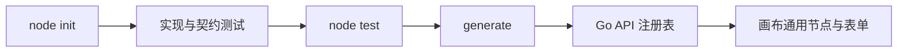

# 30 分钟创建第一个扩展节点

本指南从仓库根目录创建 `my-echo`，通过契约测试和确定性代码生成把它接入 API。画布从 `/api/node-types` 自动读取节点定义，因此不需要编写前端专用组件。



## 1. 检查环境

先安装仓库依赖并确认 Go、Node.js、Corepack、Docker、Compose、PostgreSQL 和端口状态：

```bash
corepack pnpm@10.34.5 install
CGO_ENABLED=0 go run ./cmd/agent-studio doctor
```

若检查失败，先按 [节点开发排错](debugging.md) 处理。

## 2. 创建并测试节点

```bash
CGO_ENABLED=0 go run ./cmd/agent-studio node init my-echo
CGO_ENABLED=0 go run ./cmd/agent-studio node test ./extensions/my-echo
CGO_ENABLED=0 go run ./cmd/agent-studio generate
```

`node init` 会创建 `extensions/my-echo`，生成节点实现、契约测试和包内 README，并把包登记到 `agent-studio.nodes.yaml`。目标目录非空时命令会停止，不会覆盖原文件。

`node test` 先以 `GOPROXY=off` 和只读 Module 模式检查包，再以 `CGO_ENABLED=0` 运行该节点包的测试。`generate` 校验 manifest 中的包，并确定性更新 `apps/api/internal/generated/nodes_gen.go`；生成文件应提交到 Git。

需要调整业务行为时，编辑 `extensions/my-echo/node.go`，同步更新 `node_test.go`，然后重复运行 `node test` 和 `generate`。

## 3. 启动系统

```bash
make db-up
make dev-api
make dev-web
```

`make dev-api` 和 `make dev-web` 分别占用一个终端。打开 `http://localhost:5173/workflows`，创建工作流后：

1. 配置开始节点的文本字段，例如 `topic`。
2. 点击“添加节点”，选择 `My Echo`，填写“前缀”。
3. 把开始节点的文本输出连接到 `My Echo.text`，再把 `My Echo.text` 连接到结束节点。
4. 点击“测试运行”，填写开始参数并确认结果。

## 4. 提交前验证

```bash
make check-generated
make verify-quick
make verify
make test-sdk-e2e
```

`verify-quick` 不启动 Docker，适合每次提交前运行；`verify` 和
`test-sdk-e2e` 使用 Docker PostgreSQL，作为合并前完整回归。

扩展节点与 API 在同一 Go 进程内运行，不存在第三方代码沙箱。只应登记和加载经过审查的可信源码；部署时仍需使用容器权限、文件权限和网络策略限制进程能力。
