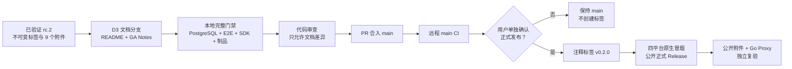

# Agent Studio v0.2.0 GA Release Implementation Plan

> **For agentic workers:** REQUIRED SUB-SKILL: Use superpowers:subagent-driven-development (recommended) or superpowers:executing-plans to implement this plan task-by-task. Steps use checkbox (`- [ ]`) syntax for tracking.

**Goal:** 在不修改产品代码、SDK 契约、节点协议或数据库的前提下，准备、验证并发布 Agent Studio `v0.2.0` 正式开发者预览版。

**Architecture:** D3 只把已验证的 `v0.2.0-rc.2` 发布材料提升为 GA 文档，并复用现有的版本前检、GoReleaser/Syft 制品链路和四平台原生冒烟。PR 只包含 README、正式 Release Notes 和本计划；合入 `main` 后先验证远程 CI，再以单独用户确认作为不可变正式标签和公开 Release 的最终授权。

**Tech Stack:** Markdown、POSIX shell、Go 1.26.5（`CGO_ENABLED=0`）、Node.js 24、Corepack、pnpm 10.34.5、Docker Compose PostgreSQL 18、GitHub Actions、GoReleaser v2.17.1、Syft v1.51.0。

**Spec:** `docs/superpowers/specs/2026-08-19-v0.2-ga-stabilization-design.md`

## Global Constraints

- 从 `origin/main` 创建并只在 `codex/v0.2-ga-release` 隔离工作树中修改。
- D3 不修改产品代码、公共 SDK、节点协议、官方节点、OpenAPI、前端行为、数据库迁移或工作流格式。
- 用户于 2026-08-19 明确要求提前启动 D3；这只豁免“创建 D3 分支和准备 GA 材料”的等待，不得声称 `v0.2.0-rc.2` 已完成 168 小时观察。
- `v0.2.0` 标签、推送和公开正式 Release 仍是独立外部状态变更，必须在执行前再次取得用户明确确认。
- 已有 `v0.2.0-rc.2` 标签不可移动、覆盖或删除。
- 所有 Go 调试、测试、构建和安装命令使用 `CGO_ENABLED=0`。
- 正式版本继续只发布 macOS/Linux 的 amd64、arm64 CLI，不发布 Windows、API/Web 容器镜像、安装器、签名或 macOS 公证。
- 正式 Release 必须是 `draft=false`、`prerelease=false`，且恰好包含四个归档、四份逐归档 SPDX JSON SBOM 和 `checksums.txt`。
- 合并、正式标签和公开 Release 必须保持可审计的独立门禁；任何失败不得通过移动或重建标签规避。

## 架构与文件边界



| 文件 | 动作 | 单一职责 |
|---|---|---|
| `docs/releases/v0.2.0.md` | 新增 | `v0.2.0` 唯一 Release 正文来源，记录能力、升级、安装、安全边界、限制与验证 |
| `README.md` | 修改 | 把默认安装和附件示例从 `v0.2.0-rc.2` 切换到 `v0.2.0`，明确正式开发者预览定位 |
| `docs/superpowers/plans/2026-08-19-v0.2-ga-release.md` | 新增 | 记录 D3 范围、时间门禁例外、验证和发布步骤 |

## 可行性与阻塞项审查

| 项目 | 级别 | 结论与处理 |
|---|---|---|
| 168 小时观察期尚未自然结束 | Governance | 用户已明确授权提前启动 D3；文档不得虚构观察期完成，正式标签仍需单独确认 |
| 正式标签和 Notes 前检 | Low | `scripts/check-version_test.sh` 已覆盖 `v0.2.0` 正式标签和 Notes 文件存在性 |
| 正式 Release 状态 | Low | `.github/workflows/release.yml` 已对非 RC 标签执行 `--prerelease=false --latest` 并复核状态 |
| 四平台制品与 SBOM | Low | `v0.2.0-rc.2` 的同一链路六个作业和 9 个公开附件已通过，D3 将完整重跑 |
| 文档误报生产稳定性 | Medium | README 和 Notes 统一使用“正式开发者预览”，保留单机、进程内节点、无签名/公证等限制 |
| D3 意外夹带产品改动 | High | PR 差异必须严格限制为上表三个文档文件；发现其他差异立即停止 |

技术实现没有 Critical 或 Important 阻塞项。唯一偏离原规格的是观察期时间门禁，已由用户明确授权提前启动 D3；该例外必须保留在本计划中，不能改写为观察期已经自然完成。

---

### Task 1: 编写正式版 Release Notes

**Files:**
- Create: `docs/releases/v0.2.0.md`
- Reference: `docs/releases/v0.2.0-rc.2.md`
- Reference: `docs/superpowers/specs/2026-08-19-v0.2-ga-stabilization-design.md`

**Interfaces:**
- Consumes: 已公开 `v0.2.0-rc.2` 的能力、安全边界、兼容性和制品格式。
- Produces: `.github/workflows/release.yml` 通过 `--notes-file docs/releases/v0.2.0.md` 消费的正式 Release 正文。

- [ ] **Step 1: 写出发布文档缺失断言并确认当前失败**

Run:

```bash
test -s docs/releases/v0.2.0.md
```

Expected: FAIL，因为正式版 Release Notes 尚不存在。

- [ ] **Step 2: 创建正式开发者预览 Release Notes**

以 `docs/releases/v0.2.0-rc.2.md` 为事实基础创建 `docs/releases/v0.2.0.md`，必须包含以下准确标题和命令：

```markdown
# Agent Studio v0.2.0

> 这是 Agent Studio Go Node SDK 的正式开发者预览版，不代表生产稳定版或 v1 兼容承诺。

## 正式开发者预览
## 从 rc.2 升级
## 预编译 CLI
## 从源码启动
## 官方扩展节点
## 安全边界
## 兼容性
## 已知限制
## 升级与反馈
## 发布验证
```

源码安装和下载示例中的版本必须统一为：

```bash
CGO_ENABLED=0 go install github.com/yyl1212/agent-studio/cmd/agent-studio@v0.2.0
agent-studio version
```

说明 `rc.2` 到 GA 没有公共契约迁移，不得声称已具备登录、RBAC、分布式队列、运行恢复、热加载、进程外沙箱、Windows 制品、容器镜像、签名或 macOS 公证。

- [ ] **Step 3: 验证 Notes 结构、版本和禁止用语**

Run:

```bash
test -s docs/releases/v0.2.0.md
test "$(head -n 1 docs/releases/v0.2.0.md)" = '# Agent Studio v0.2.0'
grep -F 'github.com/yyl1212/agent-studio/cmd/agent-studio@v0.2.0' docs/releases/v0.2.0.md
grep -F '正式开发者预览' docs/releases/v0.2.0.md
grep -F '未经过 Apple Developer ID 签名或公证' docs/releases/v0.2.0.md
test "$(rg -n 'v0\.2\.0-rc\.2' docs/releases/v0.2.0.md | wc -l | tr -d ' ')" = 1
! rg -n '这是生产稳定版|提供 v1 兼容承诺|观察期已完成|观察期通过' docs/releases/v0.2.0.md
! rg -n '\]\(\.\.?/' docs/releases/v0.2.0.md
```

Expected: PASS；`rc.2` 只在升级章节出现一次，Release 正文没有依赖仓库文件位置的相对链接。

- [ ] **Step 4: 提交 Release Notes**

```bash
git add docs/releases/v0.2.0.md
git commit -m "docs: add v0.2.0 release notes"
```

---

### Task 2: 把 README 默认版本切换到 GA

**Files:**
- Modify: `README.md:17-61`
- Test: shell 文本断言

**Interfaces:**
- Consumes: Task 1 的 `docs/releases/v0.2.0.md`。
- Produces: 新用户默认使用的 `go install`、附件下载、版本定位和 Notes 链接。

- [ ] **Step 1: 运行 GA README 断言并确认当前失败**

Run:

```bash
grep -F '当前准备发布的正式开发者预览版本为 `v0.2.0`' README.md
```

Expected: FAIL，README 当前仍指向 `v0.2.0-rc.2`。

- [ ] **Step 2: 最小修改 README 发布入口**

把 `## 开发者预览版本` 下的首段改为：

```markdown
当前准备发布的正式开发者预览版本为 `v0.2.0`，面向源码使用者和节点开发者。它已经完成公共 SDK、节点脚手架、官方扩展节点和多平台 CLI 制品链路，但仍不代表生产稳定性或 v1 兼容承诺。本次发布准备不预先声明远端标签或 GitHub Release 已存在；源码安装仅在远端标签存在后可用，附件下载仅在标签工作流成功公开 Release 后可用，使用时以远端状态为准。完整能力、安全边界、升级说明和已知限制见 [v0.2.0 Release Notes](docs/releases/v0.2.0.md)。
```

同时把该节中的安装命令、`VERSION` 和附件说明从 `v0.2.0-rc.2` 切换为 `v0.2.0`；保留四平台矩阵、SHA-256 边界以及 macOS 未签名/未公证说明。

- [ ] **Step 3: 验证 README 只有 GA 默认入口**

Run:

```bash
grep -F '当前准备发布的正式开发者预览版本为 `v0.2.0`' README.md
grep -F 'github.com/yyl1212/agent-studio/cmd/agent-studio@v0.2.0' README.md
grep -F 'VERSION=v0.2.0' README.md
grep -F '[v0.2.0 Release Notes](docs/releases/v0.2.0.md)' README.md
grep -F '源码安装仅在远端标签存在后可用' README.md
grep -F '仅在标签工作流全部成功并公开 GitHub Release 后提供' README.md
! sed -n '17,61p' README.md | rg 'v0\.2\.0-rc\.2|当前候选版本'
grep -F '未经过 Apple Developer ID 签名或公证' README.md
```

Expected: PASS。

- [ ] **Step 4: 提交 README 和实施计划**

```bash
git add README.md docs/superpowers/plans/2026-08-19-v0.2-ga-release.md
git commit -m "docs: prepare v0.2.0 ga release"
```

- [ ] **Step 5: 确认 D3 没有产品代码差异**

Run:

```bash
git diff --name-only origin/main...HEAD | sort
```

Expected: 只列出：

```text
README.md
docs/releases/v0.2.0.md
docs/superpowers/plans/2026-08-19-v0.2-ga-release.md
```

---

### Task 3: 执行 D3 本地完整门禁

**Files:**
- Verify only: repository-wide code, generated files, workflows and release configuration
- Evidence source: command output and Git commit SHA

**Interfaces:**
- Consumes: Task 1–2 的唯一文档差异。
- Produces: 允许进入独立审查和 PR 的本地验证证据。

- [ ] **Step 1: 运行快速门禁**

```bash
CGO_ENABLED=0 make verify-quick
```

Expected: Go 测试、vet、发布脚本测试、生成文件、Web lint/typecheck/test/build 全部成功。

- [ ] **Step 2: 使用 Docker PostgreSQL 18 运行完整回归**

```bash
make db-up
CGO_ENABLED=0 make verify
```

Expected: PostgreSQL 集成测试和所有快速门禁成功。数据库容器只用于本工作树验证。

- [ ] **Step 3: 运行产品和 SDK E2E**

```bash
CGO_ENABLED=0 make test-e2e
CGO_ENABLED=0 make test-sdk-e2e
```

Expected: 产品 E2E 5 个场景和 SDK E2E 3 个场景及生成节点黄金路径全部成功。

- [ ] **Step 4: 重复运行官方网络节点专项测试**

```bash
CGO_ENABLED=0 go test ./extensions/retriever -count=50
CGO_ENABLED=0 go test ./extensions/webhook -count=50
```

Expected: 两个包各连续 50 次成功。

- [ ] **Step 5: 验证发布制品与工作流**

```bash
CGO_ENABLED=0 make verify-release
CGO_ENABLED=0 make verify-workflows
```

Expected: 四目标 snapshot、9 件制品集合、SBOM、校验和、工作流固定 Action 和权限边界全部成功。

- [ ] **Step 6: 验证差异范围和仓库状态**

```bash
test -z "$(git status --porcelain)"
test "$(git diff --name-only origin/main...HEAD | sort)" = "$(printf '%s\n' README.md docs/releases/v0.2.0.md docs/superpowers/plans/2026-08-19-v0.2-ga-release.md | sort)"
git diff --check origin/main...HEAD
```

Expected: PASS，没有产品代码或生成文件差异。

---

### Task 4: 独立审查、PR 与 main 标签前门禁

**Files:**
- Review: `README.md`
- Review: `docs/releases/v0.2.0.md`
- Review: `docs/superpowers/plans/2026-08-19-v0.2-ga-release.md`

**Interfaces:**
- Consumes: Task 3 的完整验证证据。
- Produces: 合入 `main` 且远程 CI 成功的不可变 GA 候选提交。

- [ ] **Step 1: 按 Critical、Important、Minor 执行代码与发布文案审查**

审查必须确认：版本统一为 `v0.2.0`、Release Notes 可被工作流直接消费、安全与已知限制没有弱化、没有伪造观察期完成声明、差异没有越过 D3 文件边界。Critical 或 Important 未清零前不得推送。

- [ ] **Step 2: 修复审查问题并重跑受影响门禁**

每次修订使用独立提交；至少重新执行：

```bash
CGO_ENABLED=0 make verify-quick
CGO_ENABLED=0 make verify-release
CGO_ENABLED=0 make verify-workflows
git diff --check origin/main...HEAD
```

Expected: PASS，审查没有未解决 Critical 或 Important。

- [ ] **Step 3: 用户确认后推送分支并创建 PR**

```bash
git push -u origin codex/v0.2-ga-release
gh pr create --base main --head codex/v0.2-ga-release \
  --title 'docs: prepare v0.2.0 ga release' \
  --body '## 变更

- 新增 v0.2.0 正式开发者预览 Release Notes
- 把 README 默认安装入口切换到 v0.2.0
- 记录 D3 验证和正式发布门禁

## 验证

- CGO_ENABLED=0 make verify-quick
- CGO_ENABLED=0 make verify
- CGO_ENABLED=0 make test-e2e
- CGO_ENABLED=0 make test-sdk-e2e
- CGO_ENABLED=0 make verify-release
- CGO_ENABLED=0 make verify-workflows'
pr_number=$(gh pr list --repo yyl1212/agent-studio \
  --head codex/v0.2-ga-release --base main --state open \
  --json number --jq 'if length == 1 then .[0].number else error("expected exactly one open D3 PR") end')
gh pr view "$pr_number" --repo yyl1212/agent-studio --json number,url,headRefName,baseRefName,state
```

Expected: PR 仅含三个文档文件，CI 全部成功。推送和创建 PR 前必须取得用户确认。

- [ ] **Step 4: 用户确认后合并 PR 并验证 main CI**

合并是独立外部状态变更。合并后在主工作区运行：

```bash
pr_number=$(gh pr list --repo yyl1212/agent-studio \
  --head codex/v0.2-ga-release --base main --state merged --limit 1 \
  --json number --jq 'if length == 1 then .[0].number else error("expected exactly one merged D3 PR") end')
merge_commit=$(gh pr view "$pr_number" --repo yyl1212/agent-studio --json mergeCommit --jq '.mergeCommit.oid')
git pull --ff-only origin main
test "$(git rev-parse HEAD)" = "$merge_commit"
test "$(git rev-parse origin/main)" = "$merge_commit"
main_run_id=$(gh run list --repo yyl1212/agent-studio --workflow CI \
  --branch main --event push --commit "$merge_commit" --limit 1 \
  --json databaseId --jq 'if length == 1 then .[0].databaseId else error("expected one main CI run") end')
gh run watch "$main_run_id" --repo yyl1212/agent-studio --exit-status
test "$(gh run view "$main_run_id" --repo yyl1212/agent-studio --json status,conclusion --jq '[.status,.conclusion] | join(",")')" = 'completed,success'
```

Expected: PR merge commit 的 main push CI 为 `completed/success`。

- [ ] **Step 5: 在干净 main HEAD 上执行正式标签前检**

```bash
test -z "$(git status --porcelain)"
test "$(git rev-parse HEAD)" = "$(git rev-parse origin/main)"
CGO_ENABLED=0 sh scripts/check-version.sh v0.2.0
git ls-remote --exit-code --tags origin refs/tags/v0.2.0 && exit 1 || test "$?" = 2
```

Expected: 正式版本前检成功，远端 `v0.2.0` 标签不存在。

---

### Task 5: 经单独确认发布不可变 `v0.2.0`

**Files:**
- External state only: Git annotated tag、GitHub Actions、GitHub Release、Go Proxy

**Interfaces:**
- Consumes: Task 4 的远程 main 成功提交和正式标签前检。
- Produces: 可公开安装、可校验的 `v0.2.0` 正式开发者预览版。

- [ ] **Step 1: 披露观察时间状态并取得正式发布确认**

在请求确认时必须明确展示 `v0.2.0-rc.2` 的 `published_at`、当前时间、是否真正达到 168 小时，以及用户此前只授权提前启动 D3 的事实。没有新的明确确认，不创建标签。

- [ ] **Step 2: 创建并验证注释标签**

```bash
release_commit=$(git rev-parse origin/main)
git tag -a v0.2.0 -m 'Agent Studio v0.2.0' "$release_commit"
test "$(git cat-file -t v0.2.0)" = tag
test "$(git rev-list -n 1 v0.2.0)" = "$release_commit"
git tag -n1 v0.2.0
```

Expected: 标签对象类型为 `tag`，目标严格等于确认后的 `origin/main`。

- [ ] **Step 3: 只推送正式标签并监控六个任务**

```bash
git push origin refs/tags/v0.2.0
run_id=''
for attempt in 1 2 3 4 5 6 7 8 9 10 11 12; do
  run_json=$(gh run list --repo yyl1212/agent-studio --workflow Release \
    --event push --branch v0.2.0 --limit 5 \
    --json databaseId,headSha,status,conclusion,url)
  run_id=$(printf '%s' "$run_json" | jq -r --arg sha "$release_commit" \
    '[.[] | select(.headSha == $sha)] | if length == 1 then .[0].databaseId else empty end')
  test -z "$run_id" || break
  sleep 5
done
test -n "$run_id"
gh run watch "$run_id" --repo yyl1212/agent-studio --exit-status
run_file=$(mktemp)
gh run view "$run_id" --repo yyl1212/agent-studio \
  --json status,conclusion,headSha,jobs,url > "$run_file"
test "$(jq -r '.status' "$run_file")" = completed
test "$(jq -r '.conclusion' "$run_file")" = success
test "$(jq -r '.headSha' "$run_file")" = "$release_commit"
test "$(jq '.jobs | length' "$run_file")" = 6
expected_jobs='Build release artifacts
Publish verified release
Smoke darwin/amd64
Smoke darwin/arm64
Smoke linux/amd64
Smoke linux/arm64'
test "$(jq -r '.jobs | sort_by(.name) | map(.name) | join("\n")' "$run_file")" = "$expected_jobs"
test "$(jq '[.jobs[] | select(.status != "completed" or .conclusion != "success")] | length' "$run_file")" = 0
```

Expected: `Build release artifacts`、`Publish verified release` 和四个平台 Smoke 共六个任务全部为 `completed/success`。失败时保留不可变标签并停止，不移动或重建标签。

- [ ] **Step 4: 验证公开正式 Release 和 9 个附件**

```bash
release_json=$(gh release view v0.2.0 --repo yyl1212/agent-studio \
  --json tagName,isDraft,isPrerelease,assets,url)
test "$(printf '%s' "$release_json" | jq -r '.tagName')" = v0.2.0
test "$(printf '%s' "$release_json" | jq -r '.isDraft')" = false
test "$(printf '%s' "$release_json" | jq -r '.isPrerelease')" = false
test "$(printf '%s' "$release_json" | jq '.assets | length')" = 9
expected_assets=$(for target in darwin_amd64 darwin_arm64 linux_amd64 linux_arm64; do
  printf 'agent-studio_v0.2.0_%s.tar.gz\n' "$target"
  printf 'agent-studio_v0.2.0_%s.tar.gz.spdx.json\n' "$target"
done; printf 'checksums.txt\n')
actual_assets=$(printf '%s' "$release_json" | jq -r '.assets[].name' | sort)
test "$actual_assets" = "$(printf '%s' "$expected_assets" | sort)"
```

Expected: `tagName=v0.2.0`、`isDraft=false`、`isPrerelease=false`，附件恰好是四个 `.tar.gz`、四个 `.tar.gz.spdx.json` 和 `checksums.txt`。

- [ ] **Step 5: 下载公开附件并执行集合与当前平台验证**

```bash
ga_dist=$(mktemp -d)
gh release download v0.2.0 --dir "$ga_dist"
CGO_ENABLED=0 sh scripts/check-release-artifacts.sh collection "$ga_dist" v0.2.0
release_commit=$(git rev-list -n 1 v0.2.0)
host_goos=$(CGO_ENABLED=0 go env GOOS)
host_goarch=$(CGO_ENABLED=0 go env GOARCH)
CGO_ENABLED=0 sh scripts/check-release-artifacts.sh target "$ga_dist" v0.2.0 "$host_goos" "$host_goarch" "$release_commit"
```

Expected: 9 件公开附件集合和当前 macOS 原生 CLI 全部成功。

- [ ] **Step 6: 使用全新缓存验证公开 Go Proxy 安装**

```bash
ga_install_root=$(mktemp -d)
mkdir -p "$ga_install_root/mod" "$ga_install_root/build" "$ga_install_root/bin"
CGO_ENABLED=0 GOPRIVATE= GONOPROXY= GONOSUMDB= GOPROXY=https://proxy.golang.org GOSUMDB=sum.golang.org GOMODCACHE="$ga_install_root/mod" GOCACHE="$ga_install_root/build" GOBIN="$ga_install_root/bin" go install github.com/yyl1212/agent-studio/cmd/agent-studio@v0.2.0
"$ga_install_root/bin/agent-studio" version
```

Expected: 输出包含 `agent-studio v0.2.0`、SDK `0.2.0`、API `agent-studio.dev/v1alpha1` 和 `dirty false`。

## Completion Gate

- D3 Git 差异只包含 README、GA Release Notes 和本计划。
- 本地快速、PostgreSQL、产品 E2E、SDK E2E、节点重复测试、制品和工作流门禁全部通过。
- 独立审查没有未解决 Critical 或 Important。
- PR 合入 `main`，对应远程 main CI 成功。
- 正式标签前检在干净 `origin/main` HEAD 上通过。
- 正式发布前重新披露观察期事实并取得单独用户确认。
- `v0.2.0` 注释标签不可变且指向确认后的 main HEAD。
- 六个标签工作流任务成功，正式 Release 公开且非 Pre-release，并恰好包含 9 个正确附件。
- 公开附件集合、当前平台 CLI 和全新 Go Proxy 安装全部通过。
