# Agent Studio v0.2.0-rc.2 稳定化实施计划

> **For agentic workers:** REQUIRED SUB-SKILL: Use superpowers:subagent-driven-development (recommended) or superpowers:executing-plans to implement this plan task-by-task. Steps use checkbox (`- [ ]`) syntax for tracking.

**Goal:** 在不增加产品功能、不主动调整公共契约的前提下完成 `v0.2.0-rc.2` 稳定化、完整回归、四平台制品发布和公开安装验证，并进入至少 7 天观察期。

**Architecture:** 本阶段把 `main` 上已经通过 dry-run 的发布链路作为不可变基础，只新增 RC Release Notes 并切换 README 的当前候选版本。发布分支先完成反馈冻结、完整本地门禁和独立审查，再经 PR 合入 `main`；只有用户再次确认后才创建注释标签，由标签工作流构建唯一制品集合、执行四平台原生冒烟并公开 Pre-release。

**Tech Stack:** Go 1.26.5、CGO 禁用、React 19、Vite 8、pnpm 10.34.5、Docker PostgreSQL 18、GoReleaser 2.17.1、Syft 1.51.0、GitHub Actions、GitHub Release、Go Proxy。

**Spec:** `docs/superpowers/specs/2026-08-19-v0.2-ga-stabilization-design.md`

## Global Constraints

- 目标版本固定为 `v0.2.0-rc.2`；不得移动或覆盖 `v0.2.0-rc.1`。
- 本计划默认不修改 SDK、节点协议、运行引擎、官方节点、前端、OpenAPI 或数据库。
- 只接受 Critical、Important、安装阻塞或已经确认的兼容性缺陷进入 RC；Minor 进入 `v0.2.1` 或 v0.3。
- 若反馈审计或回归发现上述阻塞缺陷，立即停止本计划，不在发布文档分支内临时修代码；为每个缺陷单独设计、测试、审查并合入 `main` 后，再从 Task 1 重新执行。
- 所有 Go 调试、测试和安装命令使用 `CGO_ENABLED=0`。
- 依赖锁定为 Go 1.26.5、Node.js 24、pnpm 10.34.5、GoReleaser 2.17.1、Syft 1.51.0；不得在 D2 升级依赖。
- 制品只支持 `linux/amd64`、`linux/arm64`、`darwin/amd64`、`darwin/arm64`，不增加 Windows、镜像、安装器或包管理器。
- macOS 制品不签名、不公证；SHA-256 只用于完整性验证，不描述为发布者身份认证。
- 合并 PR、创建并推送标签、公开 Release 是独立外部状态；每一步分别取得用户明确确认。
- 标签只能指向当时的远程 `main` HEAD，且必须是注释标签。
- RC 公开后至少经过 7 个完整自然日且没有阻塞问题，才允许开始 D3。

---

## 架构与文件边界

```mermaid
flowchart LR
  MAIN["最新 main<br/>D1 证据已合入"] --> AUDIT["反馈与契约冻结审计"]
  AUDIT --> DOCS["rc.2 Notes + README"]
  DOCS --> LOCAL["完整本地门禁<br/>PostgreSQL + E2E + 制品"]
  LOCAL --> REVIEW["独立审查"]
  REVIEW --> PR["PR CI"]
  PR --> MERGE["用户确认合并 main"]
  MERGE --> PREFLIGHT["main HEAD 版本前检"]
  PREFLIGHT --> CONFIRM["用户确认注释标签"]
  CONFIRM --> TAG["v0.2.0-rc.2"]
  TAG --> BUILD["唯一制品集合"]
  BUILD --> SMOKE["四平台原生冒烟"]
  SMOKE --> RELEASE["Pre-release + 9 个附件"]
  RELEASE --> PROXY["GitHub 下载 + Go Proxy 验证"]
  PROXY --> SOAK["至少 7 天观察"]
```



| 文件 | 动作 | 单一职责 |
|---|---|---|
| `docs/releases/v0.2.0-rc.2.md` | 新增 | `rc.2` 的能力、安装、迁移、安全边界、限制和验证说明，也是 GitHub Release 正文唯一来源 |
| `README.md` | 修改 | 把当前候选版本、`go install` 和预编译附件示例切换到 `rc.2` |
| `docs/superpowers/specs/2026-08-19-v0.2-ga-stabilization-design.md` | 仅规划提交修改 | 记录 D2 实施计划已准备；发布实现阶段不再次修改 |

本计划不包含产品实现文件。任何要求修改以下路径的发现都触发停止门禁，而不是扩大本计划：

```text
sdk/go/agentnode/
sdk/go/agenttest/
agent-studio.nodes.yaml
extensions/
apps/api/
apps/web/
contracts/
```

## 可行性与阻塞项审查

- D1 已通过合并后的手动 dry-run，Linux/macOS 的 amd64、arm64 四个平台原生 Runner、四归档、四份 SPDX JSON、校验和与 Publish 跳过逻辑均已验证。
- 本计划建立时，最新 `main` 为 `f24e17174e6f2043fc135303fa657144c2c99198`，新 worktree 的 `make verify` 全部通过；Go、PostgreSQL、Web 12 个测试文件/30 个测试和生产构建无失败。
- GitHub 公开 Issue 当前为 0，`rc.1` 之后没有已知 Critical、Important、安装阻塞或兼容性反馈；Task 1 会在执行时重新读取实时状态。
- SSH 已验证可推送 Git，PR 与远程状态通过 GitHub 应用操作；本计划不依赖本地长期 Token。
- 既有 Vite 558.85 KB chunk 警告是非阻塞构建告警，不在功能冻结的 D2 中做代码拆分。
- 当前没有技术阻塞项。剩余硬门禁只有完整回归、独立审查、PR/main CI、用户外部状态确认，以及 Release 公开后的 168 小时观察期。

## 外部状态门禁

1. **发布分支推送与 Draft PR：** 执行 Task 4 前取得确认。
2. **PR 合并：** PR CI 和独立审查完成后再次取得确认。
3. **标签创建与推送：** `main` 前置检查全部成功后再次取得确认。
4. **公开 Release：** 标签推送会触发自动公开流程，因此第 3 项确认同时明确告知会创建公开 Pre-release；未取得确认不得推送标签。

---

### Task 1：冻结 RC 反馈与公共契约范围

**Files:**
- Create: `docs/releases/v0.2.0-rc.2.md`
- Reference: `docs/releases/v0.2.0-rc.1.md`
- Reference: `docs/superpowers/specs/2026-08-19-v0.2-ga-stabilization-design.md`

**Interfaces:**
- Consumes: `v0.2.0-rc.1` 不可变标签、远程公开 Issue、D1 dry-run 证据、现有 SDK/节点契约。
- Produces: 内容完整且不预先宣称远程发布成功的 `docs/releases/v0.2.0-rc.2.md`；Task 2 和标签工作流直接消费此文件。

- [ ] **Step 1: 验证分支、基线提交与干净工作区**

Run:

```bash
git branch --show-current
git merge-base --is-ancestor f24e17174e6f2043fc135303fa657144c2c99198 HEAD
git status --porcelain --untracked-files=normal
```

Expected:

```text
codex/v0.2-rc2-stabilization
```

后两条命令退出码为 0，`git status` 没有输出。

- [ ] **Step 2: 确认旧 RC 存在且新 RC 尚未占用**

Run:

```bash
git fetch origin main --tags
test "$(git cat-file -t v0.2.0-rc.1)" = tag
test -z "$(git ls-remote --tags origin 'refs/tags/v0.2.0-rc.2')"
test "$(curl -sS -o /dev/null -w '%{http_code}' https://api.github.com/repos/yyl1212/agent-studio/releases/tags/v0.2.0-rc.2)" = 404
```

Expected: 全部退出码为 0。若远端标签或 Release 已存在，停止执行；不得移动标签或覆盖 Release。

- [ ] **Step 3: 读取公开反馈并执行阻塞分级**

Run:

```bash
open_issue_count=$(curl -fsSL 'https://api.github.com/repos/yyl1212/agent-studio/issues?state=open&per_page=100' | jq '[.[] | select(has("pull_request") | not)] | length')
test "$open_issue_count" -eq 0
```

Expected: `open_issue_count=0`，断言通过。

如果 Issue 数量不是 0，逐项按规格第 9.3 节分级。任意 Critical、Important、安装阻塞、SDK 黄金路径回归、节点注册回归、既有工作流回归或安全边界不一致都停止本计划；Minor 只登记到后续版本，不修改本分支。

- [ ] **Step 4: 证明 rc.1 之后没有公共契约漂移**

Run:

```bash
git diff --exit-code v0.2.0-rc.1...HEAD -- \
  sdk/go/agentnode \
  sdk/go/agenttest \
  agent-studio.nodes.yaml \
  extensions \
  apps/api/internal/engine \
  apps/api/internal/nodes \
  contracts/openapi.yaml
```

Expected: 退出码为 0，没有差异。出现差异时停止执行并进行公共契约专项审查。

- [ ] **Step 5: 建立 Release Notes 缺失的失败基线**

Run:

```bash
test ! -e docs/releases/v0.2.0-rc.2.md
set +e
preflight_output=$(sh scripts/check-version.sh v0.2.0-rc.2 2>&1)
preflight_status=$?
set -e
test "$preflight_status" -eq 1
printf '%s\n' "$preflight_output" | grep -F 'missing release notes: docs/releases/v0.2.0-rc.2.md'
```

Expected: 最后一行匹配缺少 `rc.2` Release Notes，证明版本门禁先于发布可成功失败。

- [ ] **Step 6: 创建 rc.2 Release Notes**

使用 `apply_patch` 创建 `docs/releases/v0.2.0-rc.2.md`，内容必须完整写为：

````markdown
# Agent Studio v0.2.0-rc.2

> 这是面向源码使用者和节点开发者的候选版本，不是生产稳定版。接口、配置和运行行为在 v0.2.0 正式发布前仍可能因阻塞缺陷调整。

## 开发者预览

Agent Studio 是一套轻量化、本地优先的 Agent 开发系统：使用低代码画布组合工作流，根据开始节点参数生成聚焦式 Agent 页面，并通过公开 Go Node SDK 扩展节点类型。

`v0.2.0-rc.2` 是稳定化候选版，不增加产品功能。它延续 `rc.1` 的 SDK、节点协议、画布、运行时和官方节点行为。本候选版本的 GitHub Release 仅在标签工作流全部成功后公开；公开时包含 macOS/Linux 的 amd64、arm64 CLI 归档、SHA-256 校验和和逐归档 SPDX JSON SBOM。

## 本次变化

- GitHub Release 公开时包含 Linux amd64、Linux arm64、macOS Intel 和 macOS Apple Silicon 四种预编译 CLI 归档。
- 每个归档包含 `agent-studio`、`README.md` 和 `LICENSE`。
- `checksums.txt` 覆盖四个归档和四份 SBOM。
- 每个归档对应一份 SPDX 2.3 JSON SBOM。
- Release 仅在四个平台分别原生解压并执行同一制品集合中的 CLI 成功后公开。
- 未修改 Go Node SDK `0.2.0`、节点 API `agent-studio.dev/v1alpha1`、官方节点 `type + version`、数据库结构或工作流格式。

## 从 rc.1 升级

`rc.1` 到 `rc.2` 不包含公共契约迁移。现有工作流、扩展节点源码、manifest 和生成注册表可以继续使用。

远端标签创建后，如果使用源码安装，只需把版本替换为 `v0.2.0-rc.2`：

```bash
CGO_ENABLED=0 go install github.com/yyl1212/agent-studio/cmd/agent-studio@v0.2.0-rc.2
agent-studio version
```

版本输出应包含构建版本 `v0.2.0-rc.2`、SDK `0.2.0` 和 API `agent-studio.dev/v1alpha1`。

## 预编译 CLI

选择当前系统对应的目标：

| 操作系统 | 架构 | 归档目标 |
|---|---|---|
| Linux | amd64 | `linux_amd64` |
| Linux | arm64 | `linux_arm64` |
| macOS | Intel | `darwin_amd64` |
| macOS | Apple Silicon | `darwin_arm64` |

GitHub Release 公开后的下载和校验示例：

```bash
VERSION=v0.2.0-rc.2
OS=darwin
ARCH=arm64
ARCHIVE="agent-studio_${VERSION}_${OS}_${ARCH}.tar.gz"
BASE_URL="https://github.com/yyl1212/agent-studio/releases/download/${VERSION}"

curl -fLO "${BASE_URL}/${ARCHIVE}"
curl -fLO "${BASE_URL}/checksums.txt"
grep "  ${ARCHIVE}$" checksums.txt | shasum -a 256 -c -
tar -xzf "${ARCHIVE}"
./agent-studio version
```

Linux 使用：

```bash
grep "  ${ARCHIVE}$" checksums.txt | sha256sum -c -
```

SHA-256 只能证明下载内容与 Release 附件一致，不能证明发布者身份。macOS CLI 未经过 Apple Developer ID 签名或公证。

## 从源码启动

远端标签创建后，从源码启动需要 Go 1.26、Node.js 24、Corepack、pnpm 10.34.5 和 Docker Desktop / Docker Compose。

```bash
git clone https://github.com/yyl1212/agent-studio.git
cd agent-studio
git checkout v0.2.0-rc.2
corepack enable
corepack pnpm@10.34.5 install
cp .env.example .env
make db-up
```

分别启动 API 与 Web：

```bash
make dev-api
```

```bash
make dev-web
```

打开 `http://localhost:5173/workflows`。默认 `MODEL_PROVIDER=mock`，无需模型密钥。

## 官方扩展节点

| 节点 | 用途 | 边界 |
|---|---|---|
| Echo | 为输入文本添加前缀 | 最小 SDK 和画布接入示例 |
| Retriever | 对本地文档执行确定性 Jaccard 匹配 | 不使用向量数据库或 Embedding，不是生产知识库 |
| Webhook | 向运维指定基地址发送 JSON `POST` | 工作流只能配置严格相对 `path` 和超时，不能选择主机、请求头或凭据 |

Retriever 与 Webhook 的节点创建、连线和错误处理示例见[节点 SDK 快速开始](../sdk/quickstart.md)与[节点开发排错](../sdk/debugging.md)。

## 安全边界

- Webhook 主机和可选 Token 只能由 API 进程环境提供，Token 不进入工作流配置、节点输出或面向用户的错误。
- Webhook 阻止重定向，限制请求和响应大小，并对响应中的 Token 片段递归脱敏。
- 节点 Capability 只是展示与审计元数据，不是进程内安全沙箱。
- 通用 HTTP 节点默认拒绝 loopback、私网和 link-local 地址。
- 扩展节点只应加载可信源码，并通过容器、系统权限和网络策略隔离。
- 安全问题遵循[安全报告流程](../../SECURITY.md)，不得在公开 Issue 中披露漏洞或密钥。

## 兼容性

- Go：1.26，仓库 toolchain 为 1.26.5。
- Node.js：24。
- pnpm：10.34.5，通过 Corepack 调用。
- 数据库：Docker Compose 中的 PostgreSQL 18。
- Go Node SDK：`0.2.0`。
- 节点 API：`agent-studio.dev/v1alpha1`。

兼容性承诺和破坏性变更规则见[SDK 兼容性策略](../sdk/compatibility.md)。

## 已知限制

- 当前是单租户、本地部署，不包含登录、RBAC、团队协作或审计后台。
- 工作流只支持 DAG，不支持循环、人工审批、定时触发或分布式队列。
- 节点在 API 进程内运行，不支持热加载、远程插件、插件市场或进程外沙箱。
- Retriever 是本地确定性演示，不提供向量检索、Embedding 或生产知识库能力。
- Webhook 不支持任意 URL、自定义请求头或 OAuth。
- API 重启不会恢复正在运行的任务。
- 不提供 API/Web 容器镜像、Windows 二进制、安装器、签名或 macOS 公证。

## 升级与反馈

公开 RC 标签不可变。阻塞问题使用递增 RC 修复，不移动或覆盖已有标签。Minor 文档或体验问题进入 `v0.2.1` 或 v0.3。

- 使用问题和功能建议：[GitHub Issues](https://github.com/yyl1212/agent-studio/issues)
- 贡献流程：[CONTRIBUTING.md](../../CONTRIBUTING.md)
- 安全问题：[SECURITY.md](../../SECURITY.md)

## 发布验证

创建标签前必须通过快速验证、完整 Go/Web/PostgreSQL 回归、产品 E2E、SDK E2E、发布制品快照和独立审查。标签工作流负责验证 `main` HEAD、注释标签、四个平台原生执行、远端附件字节和 Pre-release 状态；只有全部门禁成功才会公开 Release。
````

- [ ] **Step 7: 验证 Release Notes 结构、链接与边界**

Run:

```bash
test -s docs/releases/v0.2.0-rc.2.md
rg -n '^## (开发者预览|本次变化|从 rc\.1 升级|预编译 CLI|从源码启动|官方扩展节点|安全边界|兼容性|已知限制|升级与反馈|发布验证)$' docs/releases/v0.2.0-rc.2.md
rg -n 'v0\.2\.0-rc\.2|agent-studio\.dev/v1alpha1|SDK `0\.2\.0`|macOS CLI 未经过 Apple Developer ID 签名或公证' docs/releases/v0.2.0-rc.2.md
test "$(rg -c '^## ' docs/releases/v0.2.0-rc.2.md)" -eq 11
git diff --check
```

Expected: 11 个二级标题全部匹配；版本、SDK/API 和未签名边界均存在；`git diff --check` 通过。

- [ ] **Step 8: 提交反馈冻结与 Release Notes**

```bash
git add docs/releases/v0.2.0-rc.2.md
git commit -m "docs: add v0.2.0-rc.2 release notes"
```

---

### Task 2：切换 README 当前候选版本

**Files:**
- Modify: `README.md:17-55`
- Test: `README.md` 文本断言

**Interfaces:**
- Consumes: Task 1 的 `docs/releases/v0.2.0-rc.2.md`。
- Produces: README 中唯一的当前候选版本入口、源码安装命令和四平台附件下载入口。

- [ ] **Step 1: 写出旧候选版本失败断言**

Run:

```bash
rg -n '当前候选版本为 `v0\.2\.0-rc\.1`' README.md
rg -n 'go install github\.com/yyl1212/agent-studio/cmd/agent-studio@v0\.2\.0-rc\.1' README.md
rg -n '`v0\.2\.0-rc\.1` 仍是只包含源码的版本' README.md
```

Expected: 三条命令均匹配，证明 README 尚未切换到 `rc.2`。

- [ ] **Step 2: 更新开发者预览入口**

使用 `apply_patch` 将 README 的版本入口改为：

````markdown
## 开发者预览版本

当前候选版本为 `v0.2.0-rc.2`，面向源码使用者和节点开发者试用，不代表生产稳定性。本次发布准备不预先声明远端标签或 GitHub Release 已存在；源码安装仅在远端标签存在后可用，附件下载仅在标签工作流成功公开 Release 后可用，使用时以远端状态为准。完整能力、安全边界、升级说明和已知限制见 [v0.2.0-rc.2 Release Notes](docs/releases/v0.2.0-rc.2.md)。

标签创建后的源码安装命令：

```bash
CGO_ENABLED=0 go install github.com/yyl1212/agent-studio/cmd/agent-studio@v0.2.0-rc.2
agent-studio version
```
````

- [ ] **Step 3: 更新预编译附件说明**

将“预编译 CLI 附件”标题后的说明替换为：

```markdown
`v0.2.0-rc.2` 仅在标签工作流全部成功并公开 GitHub Release 后提供 Linux/macOS 的 amd64、arm64 CLI 归档、SHA-256 校验和与逐归档 SPDX JSON SBOM。下载示例：
```

保留现有 `VERSION=v0.2.0-rc.2` 下载命令、四平台表格和未签名/未公证说明，不改变文件名规则。

- [ ] **Step 4: 验证 README 只把当前入口切换到 rc.2**

Run:

```bash
rg -n '当前候选版本为 `v0\.2\.0-rc\.2`' README.md
rg -n '本次发布准备不预先声明远端标签或 GitHub Release 已存在' README.md
rg -n 'docs/releases/v0\.2\.0-rc\.2\.md' README.md
rg -n 'go install github\.com/yyl1212/agent-studio/cmd/agent-studio@v0\.2\.0-rc\.2' README.md
rg -n '`v0\.2\.0-rc\.2` 仅在标签工作流全部成功并公开 GitHub Release 后提供 Linux/macOS 的 amd64、arm64 CLI 归档' README.md
rg -n 'macOS 归档目前未签名，也未经过 Apple Developer ID 签名或公证' README.md
! rg -n '当前候选版本为 `v0\.2\.0-rc\.1`|`v0\.2\.0-rc\.1` 仍是只包含源码的版本' README.md
git diff --check
```

Expected: 六项 `rc.2`、远端未发布状态与安全边界断言匹配，旧“当前版本”断言无匹配，差异检查通过。历史文档和兼容性示例中的 `rc.1` 不删除。

- [ ] **Step 5: 提交 README 切换**

```bash
git add README.md
git commit -m "docs: point preview users to v0.2.0-rc.2"
```

---

### Task 3：执行完整稳定化门禁与独立审查

**Files:**
- Modify: `docs/releases/v0.2.0-rc.2.md`
- Verify: 全仓库，不生成已跟踪文件差异

**Interfaces:**
- Consumes: Task 1–2 的文档提交、现有 Docker PostgreSQL、SDK/产品 E2E、制品快照与工作流检查。
- Produces: 可审查的本地验证证据，以及没有未解决 Critical/Important 的发布分支。

- [ ] **Step 1: 运行快速验证**

Run:

```bash
CGO_ENABLED=0 make verify-quick
```

Expected: Go 全量测试与 vet、版本脚本测试、制品校验脚本测试、Web 生成检查、lint、typecheck、单元测试和构建全部通过。

- [ ] **Step 2: 运行 PostgreSQL 与完整 Go/Web 回归**

Run:

```bash
COMPOSE_PROJECT_NAME=agent_improve CGO_ENABLED=0 make verify
```

Expected: Docker PostgreSQL 18 healthy；全部 Go 包、Go vet、Web 生成检查、12 个 Web 测试文件、lint 和生产构建通过。既有 Vite 大 chunk 警告不升级为 D2 阻塞项。

- [ ] **Step 3: 运行产品和 SDK 黄金路径 E2E**

Run:

```bash
COMPOSE_PROJECT_NAME=agent_improve CGO_ENABLED=0 make test-e2e
COMPOSE_PROJECT_NAME=agent_improve CGO_ENABLED=0 make test-sdk-e2e
```

Expected: 工作流画布、开始节点驱动 Agent 页面、保存/发布/运行链路和 SDK 扩展节点画布黄金路径全部通过。

- [ ] **Step 4: 重复验证官方节点确定性与安全行为**

Run:

```bash
CGO_ENABLED=0 go test ./extensions/retriever -count=50
CGO_ENABLED=0 go test ./extensions/webhook -count=50
```

Expected: 两个包各重复 50 次全部通过，没有取消分类、Token 脱敏、排序或容器隔离回归。

- [ ] **Step 5: 验证发布工具、快照与工作流**

Run:

```bash
CGO_ENABLED=0 make verify-release
CGO_ENABLED=0 make verify-workflows
```

Expected: GoReleaser 配置、固定版本 Syft、四目标 snapshot、四个 SPDX JSON、`checksums.txt`、制品集合校验和 actionlint 全部通过；不创建标签或 Release。

- [ ] **Step 6: 证明验证没有产生生成物漂移**

Run:

```bash
git status --porcelain --untracked-files=normal
git diff --check
git diff --exit-code v0.2.0-rc.1...HEAD -- \
  sdk/go/agentnode \
  sdk/go/agenttest \
  agent-studio.nodes.yaml \
  extensions \
  apps/api/internal/engine \
  apps/api/internal/nodes \
  contracts/openapi.yaml
```

Expected: 工作区干净、无空白错误、公共契约路径没有差异。

- [ ] **Step 7: 将本地门禁事实写入 Release Notes**

使用 `apply_patch` 把 `docs/releases/v0.2.0-rc.2.md` 的“发布验证”段落替换为：

```markdown
## 发布验证

创建标签前，本 RC 已通过 `make verify-quick`、完整 Go/Web/PostgreSQL 回归、产品 E2E、SDK E2E、Webhook 与 Retriever 各 50 次重复测试、发布制品快照和工作流静态检查。

标签工作流负责验证 `main` HEAD、注释标签、四个平台原生执行、远端附件字节和 Pre-release 状态；只有全部门禁成功才会公开 Release。
```

Run:

```bash
git diff --check
rg -n 'Webhook 与 Retriever 各 50 次重复测试|任一门禁失败都不会公开 Release' docs/releases/v0.2.0-rc.2.md
```

Expected: 两项验证陈述匹配，差异检查通过。

- [ ] **Step 8: 提交本地验证证据**

```bash
git add docs/releases/v0.2.0-rc.2.md
git commit -m "docs: record v0.2.0-rc.2 verification"
```

- [ ] **Step 9: 执行独立审查**

使用 `superpowers:requesting-code-review` 审查 `origin/main...HEAD`，审查者必须逐项确认：

```text
1. Release Notes 没有宣称未发生的标签、Release、附件或 Go Proxy 结果。
2. README 的当前候选版本、链接、go install 和附件示例一致为 v0.2.0-rc.2。
3. rc.1 的历史记录没有被改写。
4. SDK、节点协议、官方节点、前端、OpenAPI 和数据库没有差异。
5. 未签名、未公证、SHA-256 非身份认证边界准确。
6. 没有未解决 Critical 或 Important。
```

Expected: 审查结论为 Ready，且 Critical/Important 均为 0。任何发现都先修订文档并重跑受影响门禁；涉及产品实现则停止本计划并转入独立缺陷流程。

---

### Task 4：发布分支 PR、合并并在 main 执行标签前检

**Files:**
- Remote branch: `codex/v0.2-rc2-stabilization`
- Pull request base: `main`
- Release preflight input: `docs/releases/v0.2.0-rc.2.md`

**Interfaces:**
- Consumes: Task 3 的全绿门禁、独立审查和三个文档提交。
- Produces: 合入远程 `main` 的 Release Notes/README，以及在 `origin/main` HEAD 上通过的 `v0.2.0-rc.2` 前置检查。

- [ ] **Step 1: 再次确认推送范围**

Run:

```bash
git status -sb
git log --oneline origin/main..HEAD
git diff --stat origin/main...HEAD
git diff --name-only origin/main...HEAD
git diff --check origin/main...HEAD
```

Expected: 分支为 `codex/v0.2-rc2-stabilization`；仅列出：

```text
README.md
docs/releases/v0.2.0-rc.2.md
docs/superpowers/plans/2026-08-19-v0.2-rc2-stabilization.md
docs/superpowers/specs/2026-08-19-v0.2-ga-stabilization-design.md
```

如果出现产品实现文件，停止推送。

- [ ] **Step 2: 用户确认后推送并创建 Draft PR**

取得用户对“推送分支并创建 Draft PR”的明确确认，然后运行：

```bash
git push -u origin codex/v0.2-rc2-stabilization
```

通过 GitHub 应用创建 Draft PR：

```text
Title: docs: prepare v0.2.0-rc.2
Base: main
Head: codex/v0.2-rc2-stabilization
Draft: true
```

PR 正文必须写明：零产品代码变化、公共契约冻结、完整本地门禁、独立审查、macOS 未签名/未公证，以及“本 PR 不创建标签或 Release”。

使用以下正文：

```markdown
## 变更

- 新增 `v0.2.0-rc.2` Release Notes，并把 README 当前候选版本切换到 `rc.2`。
- 本 PR 不修改 SDK、节点协议、运行引擎、官方节点、前端、OpenAPI 或数据库。
- 本 PR 不创建标签或 Release；远程发布必须在合并后经过单独确认。

## 验证

- `CGO_ENABLED=0 make verify-quick`
- `COMPOSE_PROJECT_NAME=agent_improve CGO_ENABLED=0 make verify`
- `COMPOSE_PROJECT_NAME=agent_improve CGO_ENABLED=0 make test-e2e`
- `COMPOSE_PROJECT_NAME=agent_improve CGO_ENABLED=0 make test-sdk-e2e`
- Retriever 与 Webhook 各 50 次重复测试
- `CGO_ENABLED=0 make verify-release`
- `CGO_ENABLED=0 make verify-workflows`
- 独立审查无 Critical / Important

## 兼容与安全

- `rc.1` 到 `rc.2` 没有公共契约迁移。
- macOS 制品未签名、未公证；SHA-256 只证明完整性，不证明发布者身份。
- 公开标签与 Pre-release 仍受 main CI、版本前检、四平台原生冒烟和用户确认约束。
```

- [ ] **Step 3: 验证 PR CI 的三个作业**

Expected jobs:

```text
Go quick verification: success
Web quick verification: success
Release artifact snapshot: success
```

读取 PR head SHA 对应的 workflow run，确认 `status=completed`、`conclusion=success`，再读取 jobs 逐项匹配。失败时使用 `github:gh-fix-ci` 读取日志；不得跳过或直接合并。

- [ ] **Step 4: 用户确认后转 Ready 并合并**

向用户报告 PR URL、CI、独立审查和文件范围，并单独取得“转 Ready 并合并到 main”的明确确认。

确认后通过 GitHub 应用：

```text
1. Mark pull request ready for review
2. Merge method: merge
3. expected_head_sha: PR 当前 head SHA
```

Expected: PR `merged=true`，返回新的 merge commit SHA。

- [ ] **Step 5: 快进本地 main 并运行版本前置检查**

在主检出目录运行：

```bash
git checkout main
git pull --ff-only origin main
git fetch origin main --tags
test "$(git rev-parse HEAD)" = "$(git rev-parse origin/main)"
test -z "$(git status --porcelain --untracked-files=normal)"
sh scripts/check-version.sh v0.2.0-rc.2
```

Expected:

```text
release preflight ok: v0.2.0-rc.2
```

- [ ] **Step 6: 验证合并后 main CI**

读取 merge commit SHA 对应的 `push` 事件 CI，确认工作流和三个 jobs 均为 `completed/success`。标签门禁在 main CI 成功前保持关闭。

---

### Task 5：创建不可变 rc.2 标签并验证公开 Release

**Files:**
- Annotated tag: `v0.2.0-rc.2`
- GitHub Pre-release: `https://github.com/yyl1212/agent-studio/releases/tag/v0.2.0-rc.2`
- Release assets: 4 个 `tar.gz`、4 个 `.spdx.json`、1 个 `checksums.txt`

**Interfaces:**
- Consumes: Task 4 的远程 `main` merge commit、成功的 main CI 和版本前置检查。
- Produces: 不可变注释标签、公开 Pre-release、四平台已验证附件以及可从公开 Go Proxy 安装的 CLI。

- [ ] **Step 1: 执行标签创建前的只读断言**

Run from clean local `main`:

```bash
git fetch origin main --tags
release_commit=$(git rev-parse origin/main)
test "$(git rev-parse HEAD)" = "$release_commit"
test -z "$(git status --porcelain --untracked-files=normal)"
test -z "$(git tag --list v0.2.0-rc.2)"
test -z "$(git ls-remote --tags origin 'refs/tags/v0.2.0-rc.2')"
sh scripts/check-version.sh v0.2.0-rc.2
```

Expected: 全部断言通过，最后输出 `release preflight ok: v0.2.0-rc.2`。

- [ ] **Step 2: 取得标签与公开 Pre-release 的明确确认**

向用户完整说明：推送 `v0.2.0-rc.2` 会自动构建并在所有门禁成功后公开 GitHub Pre-release。只有用户明确确认“创建并推送 rc.2 标签，允许自动公开 Pre-release”后继续。

- [ ] **Step 3: 创建并验证本地注释标签**

Run:

```bash
release_commit=$(git rev-parse origin/main)
git tag -a v0.2.0-rc.2 -m 'Agent Studio v0.2.0-rc.2' "$release_commit"
test "$(git cat-file -t v0.2.0-rc.2)" = tag
test "$(git rev-list -n 1 v0.2.0-rc.2)" = "$release_commit"
git tag -n1 v0.2.0-rc.2
```

Expected: 类型为 `tag`、目标为 `release_commit`，消息为 `Agent Studio v0.2.0-rc.2`。

- [ ] **Step 4: 推送唯一标签**

Run:

```bash
git push origin refs/tags/v0.2.0-rc.2
```

Expected: 远程新增 `v0.2.0-rc.2`。推送失败时不得 force push，不得删除或重建本地/远程标签；先核对远程状态。

- [ ] **Step 5: 读取标签工作流并验证全部作业**

使用 GitHub Actions 公共 API 读取 `head_sha=$release_commit`、`event=push`、workflow name `Release` 的运行。每次轮询最多等待 30 秒并向用户更新状态，直到 completed。

Run after the workflow appears:

```bash
release_commit=$(git rev-list -n 1 v0.2.0-rc.2)
runs_json=$(curl -fsSL "https://api.github.com/repos/yyl1212/agent-studio/actions/runs?event=push&head_sha=$release_commit&per_page=100")
release_run_id=$(printf '%s' "$runs_json" | jq -r --arg sha "$release_commit" '[.workflow_runs[] | select(.name == "Release" and .head_sha == $sha)] | sort_by(.created_at) | last | .id // empty')
test -n "$release_run_id"
curl -fsSL "https://api.github.com/repos/yyl1212/agent-studio/actions/runs/$release_run_id" | jq -e '.status == "completed" and .conclusion == "success"'
jobs_json=$(curl -fsSL "https://api.github.com/repos/yyl1212/agent-studio/actions/runs/$release_run_id/jobs?per_page=100")
printf '%s' "$jobs_json" | jq -e '
  ([.jobs[].name] | sort) == ([
    "Build release artifacts",
    "Publish verified release",
    "Smoke darwin/amd64",
    "Smoke darwin/arm64",
    "Smoke linux/amd64",
    "Smoke linux/arm64"
  ] | sort) and
  ([.jobs[] | select(.status != "completed" or .conclusion != "success")] | length) == 0
'
```

Expected jobs:

```text
Build release artifacts: success
Smoke linux/amd64: success
Smoke linux/arm64: success
Smoke darwin/amd64: success
Smoke darwin/arm64: success
Publish verified release: success
```

任何业务门禁失败都停止并保留不可变标签；只有纯 Runner 或网络瞬时故障且没有公开错误 Release 时才允许重跑同一 workflow。

- [ ] **Step 6: 验证公开 Pre-release 元数据和附件集合**

Run:

```bash
release_json=$(curl -fsSL https://api.github.com/repos/yyl1212/agent-studio/releases/tags/v0.2.0-rc.2)
printf '%s' "$release_json" | jq -e '
  .tag_name == "v0.2.0-rc.2" and
  .draft == false and
  .prerelease == true and
  (.assets | length) == 9
'
printf '%s' "$release_json" | jq -r '.assets[].name' | sort
```

Expected sorted assets:

```text
agent-studio_v0.2.0-rc.2_darwin_amd64.tar.gz
agent-studio_v0.2.0-rc.2_darwin_amd64.tar.gz.spdx.json
agent-studio_v0.2.0-rc.2_darwin_arm64.tar.gz
agent-studio_v0.2.0-rc.2_darwin_arm64.tar.gz.spdx.json
agent-studio_v0.2.0-rc.2_linux_amd64.tar.gz
agent-studio_v0.2.0-rc.2_linux_amd64.tar.gz.spdx.json
agent-studio_v0.2.0-rc.2_linux_arm64.tar.gz
agent-studio_v0.2.0-rc.2_linux_arm64.tar.gz.spdx.json
checksums.txt
```

- [ ] **Step 7: 重新下载并验证公开附件集合**

Run:

```bash
release_json=$(curl -fsSL https://api.github.com/repos/yyl1212/agent-studio/releases/tags/v0.2.0-rc.2)
rc2_dist=$(mktemp -d)
trap 'rm -rf -- "$rc2_dist"' EXIT HUP INT TERM
printf '%s' "$release_json" | jq -r '.assets[].browser_download_url' | while IFS= read -r asset_url; do
  case "$asset_url" in
    https://github.com/yyl1212/agent-studio/releases/download/v0.2.0-rc.2/*) ;;
    *) printf 'unexpected asset URL: %s\n' "$asset_url" >&2; exit 1 ;;
  esac
  curl -fL --output "$rc2_dist/$(basename "$asset_url")" "$asset_url"
done
CGO_ENABLED=0 sh scripts/check-release-artifacts.sh collection "$rc2_dist" v0.2.0-rc.2
```

Expected: 集合验证通过，包含恰好 4 个归档、4 个有效 SPDX JSON 和 1 个校验和文件。

- [ ] **Step 8: 在当前宿主原生执行公开附件**

Run:

```bash
release_commit=$(git rev-list -n 1 v0.2.0-rc.2)
release_json=$(curl -fsSL https://api.github.com/repos/yyl1212/agent-studio/releases/tags/v0.2.0-rc.2)
rc2_dist=$(mktemp -d)
trap 'rm -rf -- "$rc2_dist"' EXIT HUP INT TERM
printf '%s' "$release_json" | jq -r '.assets[].browser_download_url' | while IFS= read -r asset_url; do
  case "$asset_url" in
    https://github.com/yyl1212/agent-studio/releases/download/v0.2.0-rc.2/*) ;;
    *) printf 'unexpected asset URL: %s\n' "$asset_url" >&2; exit 1 ;;
  esac
  curl -fL --output "$rc2_dist/$(basename "$asset_url")" "$asset_url"
done
host_goos=$(CGO_ENABLED=0 go env GOOS)
host_goarch=$(CGO_ENABLED=0 go env GOARCH)
CGO_ENABLED=0 sh scripts/check-release-artifacts.sh target "$rc2_dist" v0.2.0-rc.2 "$host_goos" "$host_goarch" "$release_commit"
```

Expected: 当前 macOS 目标的 CLI 可执行，输出包含 `v0.2.0-rc.2`、SDK `0.2.0`、API `agent-studio.dev/v1alpha1`、`release_commit` 和 `dirty false`。

- [ ] **Step 9: 使用全新缓存验证公开 Go Proxy 安装**

Run:

```bash
proxy_root=$(mktemp -d)
trap 'rm -rf -- "$proxy_root"' EXIT HUP INT TERM
mkdir -p "$proxy_root/mod" "$proxy_root/build" "$proxy_root/bin"
GOMODCACHE="$proxy_root/mod" \
GOCACHE="$proxy_root/build" \
GOBIN="$proxy_root/bin" \
GOPROXY=https://proxy.golang.org \
CGO_ENABLED=0 \
go install github.com/yyl1212/agent-studio/cmd/agent-studio@v0.2.0-rc.2
"$proxy_root/bin/agent-studio" version
```

Expected: 安装成功，版本输出包含 `v0.2.0-rc.2`、SDK `0.2.0`、API `agent-studio.dev/v1alpha1` 和 `dirty false`。若 Go Proxy 尚未同步，只等待传播并重试安装；不得移动标签或发布新 RC。

---

## 观察期门禁

`v0.2.0-rc.2` 的 GitHub Release `published_at` 是观察期起点。D3 最早开始时间为 `published_at + 168 小时`，并且必须同时满足：

```text
1. 没有 Critical 或 Important 缺陷。
2. 四个支持平台均可安装并运行 CLI。
3. SDK 黄金路径、画布节点注册和既有工作流没有兼容回归。
4. 标签、版本、校验和、SBOM 和附件集合保持正确。
5. 文档描述与实际安全边界一致。
```

观察期只处理发布阻塞，不增加功能。若出现阻塞问题，从最新 `main` 创建独立修复分支，发布 `v0.2.0-rc.3` 或更高递增 RC，并从新 RC 的 `published_at` 重新计算 168 小时。

## Completion Gate

D2 只有在以下条件全部成立后才算完成：

- `rc.1` 反馈已审计，没有未解决 Critical、Important、安装阻塞或兼容性缺陷；
- `origin/main...HEAD` 在 SDK、节点协议、官方节点、前端、OpenAPI 和数据库路径上没有差异；
- `docs/releases/v0.2.0-rc.2.md` 与 README 的版本、安装和安全边界一致；
- `make verify-quick`、`make verify`、`make test-e2e`、`make test-sdk-e2e` 全部通过；
- Retriever 与 Webhook 各重复 50 次通过；
- `make verify-release` 和 `make verify-workflows` 通过；
- 独立审查没有未解决 Critical 或 Important；
- PR 合入 `main` 且 merge commit 的 push CI 全部通过；
- `scripts/check-version.sh v0.2.0-rc.2` 在干净的远程 `main` HEAD 上通过；
- 用户明确确认后创建并推送了指向 `main` HEAD 的注释标签；
- 标签工作流六个作业全部成功；
- GitHub Pre-release 为公开、非 Draft，且恰好包含 9 个正确附件；
- 公开附件集合、当前宿主原生执行和全新 Go Proxy 安装全部通过；
- 已记录 Release `published_at`，并进入不少于 168 小时的观察期；
- 没有创建或开始 D3 分支。
