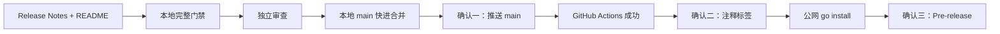

# Agent Studio v0.2 Stage C RC Release Implementation Plan

> **For agentic workers:** REQUIRED SUB-SKILL: Use superpowers:subagent-driven-development (recommended) or superpowers:executing-plans to implement this plan task-by-task. Steps use checkbox (`- [ ]`) syntax for tracking.

**Goal:** 将已经完成阶段 A、阶段 B 的 Agent Studio 验证并发布为源码型 `v0.2.0-rc.1`，包含中文 Release Notes、README 入口、注释标签和 GitHub Pre-release。

**Architecture:** Stage C 只修改发布文档，不改变产品代码；发布物依次通过本地完整门禁、独立审查、`main` CI、公开 tag 安装冒烟和 GitHub Release 复核。`main`、标签、Pre-release 是三个独立外部确认点，任何一步失败都停止后续状态创建。

**Tech Stack:** Markdown、Git、GitHub CLI、GitHub Actions、Go 1.26.5（`CGO_ENABLED=0`）、Node.js 24、pnpm 10.34.5、Docker Compose、PostgreSQL 18、Playwright。

**Spec:** `docs/superpowers/specs/2026-08-19-v0.2-stage-c-rc-release-design.md`

## Global Constraints

- 产品交付只创建 `docs/releases/v0.2.0-rc.1.md`、修改 `README.md`；本规格与本计划是治理文件，不得顺手修改后端、前端、数据库、节点协议、节点实现或 CI。
- Release Notes 使用中文，明确“源码开发者预览”，不得描述为生产就绪版本。
- 所有 Go 调试、测试、生成和安装命令显式使用 `CGO_ENABLED=0`。
- Go 版本为 1.26，项目 toolchain 为 1.26.5；Node.js 为 24；pnpm 固定为 10.34.5；数据库使用 Docker Compose 中的 PostgreSQL 18。
- 不发布二进制附件、容器镜像、GoReleaser 产物、SBOM、签名、校验和或自定义 Release 附件。
- `v0.2.0-rc.1` 必须是注释标签，指向包含最终 Release Notes 与 README 的已验证 `main` 提交。
- 推送 `main`、创建并推送标签、创建 GitHub Pre-release 前分别停止并取得用户确认。
- 已公开标签不可删除、覆盖或移动；标签后的冒烟失败时停止并改用下一 RC，不得重写 `v0.2.0-rc.1`。
- 禁止 force-push、历史重写、批量推送标签或自动生成额外发布附件。
- 每个验证命令必须检查退出码和实际输出；专项 `-run` 前先用 `-list` 证明不是空匹配。

---

## File Map

| 文件 | 状态 | 单一职责 |
|---|---|---|
| `docs/superpowers/specs/2026-08-19-v0.2-stage-c-rc-release-design.md` | 已存在，只读 | Stage C 范围、安全边界、发布架构和失败策略 |
| `docs/superpowers/plans/2026-08-19-v0.2-stage-c-rc-release.md` | 已存在，只读 | 本次实施步骤与验证命令 |
| `docs/releases/v0.2.0-rc.1.md` | 新增 | 仓库 Release Notes 与 GitHub Release 唯一正文来源 |
| `README.md` | 修改 | 当前 RC 状态、Release Notes 入口和公开 CLI 安装命令 |

发布状态流：



### Task 1: 执行前基线与发布身份检查

**Files:**
- Read: `docs/superpowers/specs/2026-08-19-v0.2-stage-c-rc-release-design.md`
- Read: `docs/superpowers/plans/2026-08-19-v0.2-stage-c-rc-release.md`
- No modifications

**Interfaces:**
- Consumes: 已确认设计、分支 `codex/v0.2-stage-c-rc-release`、远程 `origin/main`、GitHub 账号 `yyl1212`
- Produces: 干净且包含最新 `origin/main` 的实施基线；确认远程不存在目标标签和 Release

- [ ] **Step 1: 确认当前分支和工作区干净**

Run:

```bash
test "$(git branch --show-current)" = "codex/v0.2-stage-c-rc-release"
test -z "$(git status --porcelain --untracked-files=normal)"
```

Expected: 两条命令退出码均为 0。

- [ ] **Step 2: 获取远程主分支并确认实施分支没有落后**

Run:

```bash
git fetch origin main
git merge-base --is-ancestor origin/main HEAD
```

Expected: `origin/main` 是当前 HEAD 的祖先。若第二条命令失败，停止执行并重新评估远程新增提交，不能盲目合并。

- [ ] **Step 3: 确认 GitHub 身份、远程写入预检和目标对象不存在**

Run:

```bash
gh auth status
git push --dry-run origin main
test -z "$(git ls-remote --tags origin refs/tags/v0.2.0-rc.1)"
test -z "$(gh release list --limit 100 --json tagName --jq '.[] | select(.tagName == "v0.2.0-rc.1") | .tagName')"
```

Expected: 登录账号为 `yyl1212`；dry-run 成功；标签与 Release 检查均为空。

- [ ] **Step 4: 运行未改动基线的快速门禁**

Run:

```bash
make verify-quick
```

Expected: Go 生成、单测、vet、发布脚本测试，以及 Web 生成、lint、类型检查、组件测试和构建全部通过；只允许已有的非阻塞构建体积警告。

### Task 2: 新增中文 RC Release Notes

**Files:**
- Create: `docs/releases/v0.2.0-rc.1.md`

**Interfaces:**
- Consumes: README 中现有源码启动命令、SDK/API 版本、官方节点和安全边界
- Produces: GitHub Release 唯一正文来源；Task 5 在文件末尾追加实际验证证据

- [ ] **Step 1: 运行缺失文件检查，证明交付尚未实现**

Run:

```bash
test -s docs/releases/v0.2.0-rc.1.md
```

Expected: 退出码为 1，因为文件尚不存在。

- [ ] **Step 2: 创建 Release Notes 目录**

Run:

```bash
mkdir -p docs/releases
```

Expected: `docs/releases` 存在，不创建其他目录。

- [ ] **Step 3: 使用 apply_patch 创建 Release Notes**

Create `docs/releases/v0.2.0-rc.1.md` with exactly:

````markdown
# Agent Studio v0.2.0-rc.1

> 这是面向源码使用者和节点开发者的候选版本，不是生产稳定版。接口、配置和运行行为仍可能在后续 RC 中调整。

## 开发者预览

Agent Studio 是一套轻量化、本地优先的 Agent 开发系统：使用低代码画布组合工作流，根据开始节点参数生成聚焦式 Agent 页面，并通过公开 Go Node SDK 扩展节点类型。本 RC 以源码、Git 标签和 GitHub Pre-release 交付，不提供二进制附件或容器镜像。

## 本次亮点

- 使用 React 画布搭建、保存、测试和发布 DAG 工作流。
- 根据开始节点参数自动生成聚焦式单栏 Agent 运行页面。
- Go API、Docker PostgreSQL 和默认 Mock 模型可在本地完成完整闭环。
- 公开 Go Node SDK、契约测试工具及 `agent-studio` CLI 支持节点脚手架、测试和确定性注册代码生成。
- 默认提供 Echo、Retriever、Webhook 三个扩展节点，通用 JSON Schema 表单无需节点专用前端代码。

## 安装 CLI

安装当前 RC：

```bash
CGO_ENABLED=0 go install github.com/yyl1212/agent-studio/cmd/agent-studio@v0.2.0-rc.1
agent-studio version
```

版本输出应包含构建版本 `v0.2.0-rc.1`、SDK `0.2.0` 和 API `agent-studio.dev/v1alpha1`。

## 从源码启动

需要 Go 1.26、Node.js 24、Corepack、pnpm 10.34.5 和 Docker Desktop / Docker Compose。

```bash
git clone https://github.com/yyl1212/agent-studio.git
cd agent-studio
git checkout v0.2.0-rc.1
corepack enable
corepack pnpm@10.34.5 install
cp .env.example .env
make db-up
```

分别启动 API 和 Web：

```bash
make dev-api
```

```bash
make dev-web
```

打开 `http://localhost:5173/workflows`。默认 `MODEL_PROVIDER=mock`，无需模型密钥。API 健康检查为 `GET http://localhost:8080/healthz`，就绪检查为 `GET http://localhost:8080/readyz`。

## 官方扩展节点

| 节点 | 用途 | 边界 |
|---|---|---|
| Echo | 为输入文本添加前缀 | 最小 SDK 和画布接入示例 |
| Retriever | 对本地文档执行确定性 Jaccard 匹配 | 不使用向量数据库或 Embedding，不是生产知识库 |
| Webhook | 向运维指定基地址发送 JSON `POST` | 工作流只能配置严格相对 `path` 和超时，不能选择主机、请求头或凭据 |

Retriever 与 Webhook 的节点创建、连线和错误处理示例见[节点 SDK 快速开始](../sdk/quickstart.md)与[节点开发排错](../sdk/debugging.md)。

## 安全边界

Webhook 的主机和可选 Token 只能由 API 进程环境提供：

```dotenv
AGENT_STUDIO_WEBHOOK_URL=https://hooks.example.com/agent-studio
AGENT_STUDIO_WEBHOOK_TOKEN=
```

- Token 不进入工作流配置、节点输出或面向用户的错误。
- Webhook 阻止重定向，限制请求和响应大小，并对响应中的 Token 片段递归脱敏。
- 节点 Capability 只是展示与审计元数据，不是进程内安全沙箱；只应加载可信扩展，并通过容器、系统权限和网络策略建立隔离。
- 通用 HTTP 节点默认拒绝 loopback、私网和 link-local 地址；只有本地可信开发环境才应放宽网络策略。
- 安全问题请遵循[安全报告流程](../../SECURITY.md)，不要在公开 Issue 中披露漏洞或密钥。

## 兼容性

- Go：1.26，仓库 toolchain 为 1.26.5。
- Node.js：24。
- pnpm：10.34.5，通过 Corepack 调用。
- 数据库：Docker Compose 中的 PostgreSQL 18。
- Go Node SDK：`0.2.0`。
- 节点 API：`agent-studio.dev/v1alpha1`。

兼容性承诺和破坏性变更规则见[SDK 兼容性策略](../sdk/compatibility.md)。

## 已知限制

- 当前是单租户、本地部署，不包含登录、RBAC、团队协作或审计后台。
- 工作流只支持 DAG，不支持循环、人工审批、定时触发或分布式队列。
- 节点在 API 进程内运行，不支持热加载、远程插件、插件市场或进程外沙箱。
- Retriever 是本地确定性演示，不提供向量检索、Embedding 或生产知识库能力。
- Webhook 不支持任意 URL、自定义请求头或 OAuth。
- API 重启不会恢复正在运行的任务。
- 本 RC 不提供二进制附件、容器镜像、SBOM、签名或校验和。

## 升级与反馈

公开 RC 标签不可变。若 `v0.2.0-rc.1` 发布后发现问题，修复版本将使用递增 RC，不会移动或覆盖已有标签。

- 使用问题和功能建议：[GitHub Issues](https://github.com/yyl1212/agent-studio/issues)
- 贡献流程：[CONTRIBUTING.md](../../CONTRIBUTING.md)
- 安全问题：[SECURITY.md](../../SECURITY.md)
````

Expected: 文档没有发布日期占位、真实密钥、内网地址或生产就绪承诺。

- [ ] **Step 4: 验证结构、链接目标和秘密边界**

Run:

```bash
test -s docs/releases/v0.2.0-rc.1.md
rg -n '^## (开发者预览|本次亮点|安装 CLI|从源码启动|官方扩展节点|安全边界|兼容性|已知限制|升级与反馈)$' docs/releases/v0.2.0-rc.1.md
test -f docs/sdk/quickstart.md
test -f docs/sdk/debugging.md
test -f docs/sdk/compatibility.md
test -f SECURITY.md
test -f CONTRIBUTING.md
if rg -n '(gh[oprsu]_[A-Za-z0-9_]{20,}|Bearer[[:space:]]+[A-Za-z0-9._-]+|AGENT_STUDIO_WEBHOOK_TOKEN=.+)' docs/releases/v0.2.0-rc.1.md; then exit 1; fi
```

Expected: 九个标题全部命中；五个本地链接目标存在；秘密扫描无输出并退出 0。

- [ ] **Step 5: 检查并提交 Release Notes**

Run:

```bash
git diff --check
git add docs/releases/v0.2.0-rc.1.md
git commit -m "docs: add v0.2.0-rc.1 release notes"
```

Expected: 提交只包含新 Release Notes。

### Task 3: 增加 README RC 入口

**Files:**
- Modify: `README.md`，在开头架构图后、`## 环境要求` 前插入版本入口

**Interfaces:**
- Consumes: Task 2 的 `docs/releases/v0.2.0-rc.1.md`
- Produces: 根 README 中唯一的当前 RC 入口和公开 CLI 安装命令

- [ ] **Step 1: 运行 README 缺失检查**

Run:

```bash
rg -n 'v0\.2\.0-rc\.1' README.md
```

Expected: 退出码为 1，因为 README 尚未包含 RC 版本。

- [ ] **Step 2: 使用 apply_patch 插入 RC 入口**

在架构图结束的三反引号后、`## 环境要求` 前插入：

````markdown
## 开发者预览版本

当前候选版本为 `v0.2.0-rc.1`，面向源码使用者和节点开发者试用，不代表生产稳定性。完整能力、安全边界和已知限制见 [v0.2.0-rc.1 Release Notes](docs/releases/v0.2.0-rc.1.md)。

安装带版本信息的 CLI：

```bash
CGO_ENABLED=0 go install github.com/yyl1212/agent-studio/cmd/agent-studio@v0.2.0-rc.1
agent-studio version
```
````

Expected: 不复制源码启动、官方节点和已知限制的长篇内容，继续由现有 README 与 Release Notes 分工维护。

- [ ] **Step 3: 验证 README 入口和链接**

Run:

```bash
rg -n '^## 开发者预览版本$|v0\.2\.0-rc\.1|go install github\.com/yyl1212/agent-studio/cmd/agent-studio@v0\.2\.0-rc\.1' README.md
test -s docs/releases/v0.2.0-rc.1.md
git diff --check
```

Expected: 标题、版本、安装路径均命中；Release Notes 存在；diff 无空白错误。

- [ ] **Step 4: 提交 README 入口**

Run:

```bash
git add README.md
git commit -m "docs: add rc install entry"
```

Expected: 提交只修改 `README.md`。

### Task 4: 执行完整本地发布门禁

**Files:**
- Read: `Makefile`
- Read: `extensions/webhook/node_test.go`
- Read: `extensions/retriever/node_test.go`
- No modifications

**Interfaces:**
- Consumes: Task 2、Task 3 的完整发布文案和当前产品实现
- Produces: 可写入 Release Notes 的真实本地验证证据

- [ ] **Step 1: 证明 Webhook 专项正则匹配真实安全测试**

Run:

```bash
CGO_ENABLED=0 go test ./extensions/webhook -list 'Test.*(Secret|Redact|Error|Redirect|Size|Cancel|Timeout)'
```

Expected: 输出至少包含 `TestExecuteBlocksRedirectBeforeForwardingToken`、`TestRequestBodySizeBoundary`、`TestExecuteClassifiesCallerCancellationWhileReadingResponseBody`、`TestExecuteClassifiesNodeTimeoutWhileReadingResponseBody`、`TestExecuteDropsUnsafeTransportError` 和 `TestSuccessfulResponseRecursivelyRedactsTokenOccurrences`。

- [ ] **Step 2: 证明 Retriever 专项正则匹配真实确定性测试**

Run:

```bash
CGO_ENABLED=0 go test ./extensions/retriever -list 'Test.*(Deterministic|Ordering|Stable|Unicode|Independent)'
```

Expected: 输出至少包含 `TestDefinitionAndResolveReturnIndependentPorts`、`TestExecuteUsesRawScoreOrderingBeforeRounding`、`TestExecuteUsesUnicodeTokensAndStableTieOrder` 和 `TestExecuteIsByteDeterministicAndReturnsIndependentContainers`。

- [ ] **Step 3: 运行无 Docker 的快速门禁**

Run:

```bash
make verify-quick
```

Expected: 全部命令退出 0；只允许已有的 Vite 体积警告。

- [ ] **Step 4: 使用 Docker PostgreSQL 18 运行完整回归**

Run:

```bash
make verify
```

Expected: `db-up` 健康、Go 全量测试和 vet 通过、前端生成物无漂移、lint/测试/构建通过。

- [ ] **Step 5: 运行产品端到端测试**

Run:

```bash
make test-e2e
```

Expected: Playwright 产品 E2E 全部通过。

- [ ] **Step 6: 运行 SDK 黄金路径和节点 E2E**

Run:

```bash
make test-sdk-e2e
```

Expected: 临时 Go Module 黄金路径通过，SDK 画布 E2E 全部通过。

- [ ] **Step 7: 重复 Webhook 安全专项 50 次**

Run:

```bash
CGO_ENABLED=0 go test ./extensions/webhook -run 'Test.*(Secret|Redact|Error|Redirect|Size|Cancel|Timeout)' -count=50
```

Expected: 退出 0，无取消分类、超时分类、重定向、大小限制、错误脱敏或 Token 脱敏的偶发失败。

- [ ] **Step 8: 重复 Retriever 确定性专项 50 次**

Run:

```bash
CGO_ENABLED=0 go test ./extensions/retriever -run 'Test.*(Deterministic|Ordering|Stable|Unicode|Independent)' -count=50
```

Expected: 退出 0，无排序、Unicode、字节确定性或容器隔离的偶发失败。

- [ ] **Step 9: 确认门禁没有改写生成物或源码**

Run:

```bash
test -z "$(git status --porcelain --untracked-files=normal)"
```

Expected: 工作区干净。任一门禁失败时停止，修复后从 Task 4 Step 1 重新执行，不得继续发布。

### Task 5: 写入实际验证证据

**Files:**
- Modify: `docs/releases/v0.2.0-rc.1.md`，在文末新增发布验证章节

**Interfaces:**
- Consumes: Task 4 实际成功的六组门禁结果
- Produces: 不预先宣称 GitHub CI 或公开安装结果的本地验证记录

- [ ] **Step 1: 使用 apply_patch 在 Release Notes 文末追加实际证据**

Append exactly:

```markdown

## 发布验证

在创建标签前，本 RC 的代码与文档已通过以下本地门禁：

- `make verify-quick`
- `make verify`
- `make test-e2e`
- `make test-sdk-e2e`
- Webhook 安全专项重复 50 次
- Retriever 确定性专项重复 50 次

远程 `main` CI、公开 tag 安装和 GitHub Pre-release 元数据仍由发布流程逐级验证；本节不预先宣称尚未发生的远程结果。
```

Expected: 只记录 Task 4 已经取得的证据，没有日期占位、CI 成功预声明或公开安装成功预声明。

- [ ] **Step 2: 验证证据内容和文档安全边界**

Run:

```bash
rg -n '^## 发布验证$|make verify-quick|make verify|make test-e2e|make test-sdk-e2e|Webhook 安全专项重复 50 次|Retriever 确定性专项重复 50 次' docs/releases/v0.2.0-rc.1.md
if rg -n '(gh[oprsu]_[A-Za-z0-9_]{20,}|Bearer[[:space:]]+[A-Za-z0-9._-]+|AGENT_STUDIO_WEBHOOK_TOKEN=.+)' README.md docs/releases/v0.2.0-rc.1.md; then exit 1; fi
git diff --check
```

Expected: 七个证据项全部命中；秘密扫描无输出；diff 无空白错误。

- [ ] **Step 3: 提交验证证据**

Run:

```bash
git add docs/releases/v0.2.0-rc.1.md
git commit -m "docs: record rc verification evidence"
```

Expected: 提交只修改 Release Notes。

### Task 6: 最终本地审查与发布预检

**Files:**
- Review: `README.md`
- Review: `docs/releases/v0.2.0-rc.1.md`
- Review: `docs/superpowers/specs/2026-08-19-v0.2-stage-c-rc-release-design.md`
- Review: `docs/superpowers/plans/2026-08-19-v0.2-stage-c-rc-release.md`

**Interfaces:**
- Consumes: 最终 Stage C 分支 diff
- Produces: 无 Critical、Important 问题且能通过版本检查的候选提交

- [ ] **Step 1: 运行最终提交的快速门禁**

Run:

```bash
make verify-quick
```

Expected: 全部通过；这验证 Task 5 的最终文档提交没有引入生成物或构建漂移。

- [ ] **Step 2: 运行版本发布脚本**

Run:

```bash
scripts/check-version.sh v0.2.0-rc.1
```

Expected:

```text
release preflight ok: v0.2.0-rc.1
```

- [ ] **Step 3: 验证 Stage C 文件白名单**

Run:

```bash
stage_c_base=$(git merge-base main HEAD)
git diff --name-only "$stage_c_base"...HEAD
```

Expected: 只包含以下四个路径：

```text
README.md
docs/releases/v0.2.0-rc.1.md
docs/superpowers/plans/2026-08-19-v0.2-stage-c-rc-release.md
docs/superpowers/specs/2026-08-19-v0.2-stage-c-rc-release-design.md
```

- [ ] **Step 4: 使用 requesting-code-review 做独立审查**

审查必须逐项核对：Release Notes 事实准确性、README 链接、秘密泄漏、版本一致性、文件白名单、三个外部确认点、标签不可变策略，以及 GitHub Release 无自定义附件。结论必须明确列出 Critical、Important、Minor；Critical 和 Important 必须为零。

Expected: 审查无 Critical、Important。若出现任一 Critical 或 Important，停止发布；修复并提交后从 Task 4 Step 1 重新执行完整门禁和审查。

- [ ] **Step 5: 确认分支干净并记录候选提交**

Run:

```bash
git status --short --branch
git log -1 --format='%H%n%s'
```

Expected: 分支为 `codex/v0.2-stage-c-rc-release`，无未提交文件；记录的 HEAD 是后续本地 `main` 必须快进到的提交。

### Task 7: 快进合并到本地 main 并复验

**Files:**
- No new file modifications
- Git refs: local `main`

**Interfaces:**
- Consumes: Task 6 的干净候选提交
- Produces: 指向完全相同提交的本地 `main`，尚未推送远程

- [ ] **Step 1: 调用 finishing-a-development-branch 核对完成条件**

确认 Task 4、Task 6 的门禁和审查证据仍有效，且用户目标明确要求合并到 `main` 并继续 RC 发布；不删除开发分支。

- [ ] **Step 2: 确认远程 main 仍被候选分支包含**

Run:

```bash
git fetch origin main
git merge-base --is-ancestor origin/main codex/v0.2-stage-c-rc-release
```

Expected: 退出 0。若失败，停止并审查远程新增提交，不能强制合并或推送。

- [ ] **Step 3: 切换并同步本地 main**

Run:

```bash
git switch main
git pull --ff-only origin main
```

Expected: 位于本地 `main`，拉取不产生合并提交。

- [ ] **Step 4: 快进合并 Stage C 分支**

Run:

```bash
git merge --ff-only codex/v0.2-stage-c-rc-release
test "$(git rev-parse HEAD)" = "$(git rev-parse codex/v0.2-stage-c-rc-release)"
```

Expected: fast-forward 成功，两个 ref 指向同一提交。

- [ ] **Step 5: 在本地 main 上复验受影响门禁**

Run:

```bash
make verify-quick
scripts/check-version.sh v0.2.0-rc.1
test -z "$(git status --porcelain --untracked-files=normal)"
```

Expected: 快速门禁和版本检查通过，工作区干净。此时仍未向 GitHub 写入任何新状态。

### Task 8: 确认并推送 main，等待 GitHub CI

**Files:**
- No file modifications
- External state: `origin/main`

**Interfaces:**
- Consumes: Task 7 的本地 `main` HEAD
- Produces: 已同步且 GitHub Actions 成功的 `origin/main`

- [ ] **Step 1: 展示即将推送的精确范围**

Run:

```bash
git status --short --branch
git log --oneline origin/main..main
git diff --stat origin/main..main
git push --dry-run origin main
```

Expected: 工作区干净；输出只包含此前已审查的阶段 A、阶段 B、Stage C 提交；dry-run 是普通 fast-forward。

- [ ] **Step 2: 停止并取得远程确认点一**

向用户报告本地 HEAD、远程旧 SHA、提交数量、diff stat 和 dry-run 结果，明确询问是否推送 `main`。没有明确确认时不得继续。

- [ ] **Step 3: 仅推送 main**

Run after confirmation:

```bash
git push origin main
git fetch origin main
test "$(git rev-parse HEAD)" = "$(git rev-parse origin/main)"
```

Expected: fast-forward 推送成功，本地 HEAD 与 `origin/main` 一致；不推送开发分支或标签。

- [ ] **Step 4: 定位目标提交的 CI run**

Run；若首次为空，每 5 秒重试一次，最多 12 次，每次重试期间继续向用户报告状态：

```bash
release_sha=$(git rev-parse HEAD)
gh run list --workflow ci.yml --branch main --commit "$release_sha" --limit 1 --json databaseId,headSha,status,conclusion,url
```

Expected: 返回一条 `headSha` 等于 `release_sha` 的 push workflow run。60 秒内仍不存在时停止并检查 Actions 触发条件。

- [ ] **Step 5: 等待并验证 CI 成功**

Run:

```bash
release_sha=$(git rev-parse HEAD)
rc_run_id=$(gh run list --workflow ci.yml --branch main --commit "$release_sha" --limit 1 --json databaseId --jq '.[0].databaseId // empty')
test -n "$rc_run_id"
gh run watch "$rc_run_id" --compact --exit-status
gh run list --workflow ci.yml --branch main --commit "$release_sha" --limit 1 --json headSha,status,conclusion,url
```

Expected: 最终 `status` 为 `completed`、`conclusion` 为 `success`、`headSha` 等于本地 HEAD。失败时不创建标签，修复后返回 Task 4。

### Task 9: 确认、创建并推送注释标签

**Files:**
- No file modifications
- Git refs: local and remote `refs/tags/v0.2.0-rc.1`

**Interfaces:**
- Consumes: Task 8 已同步且 CI 成功的最终 `main` 提交
- Produces: 指向该提交的公开注释标签

- [ ] **Step 1: 执行标签前不可变性检查**

Run:

```bash
test "$(git branch --show-current)" = "main"
test -z "$(git status --porcelain --untracked-files=normal)"
test "$(git rev-parse HEAD)" = "$(git rev-parse origin/main)"
scripts/check-version.sh v0.2.0-rc.1
test -z "$(git tag --list v0.2.0-rc.1)"
test -z "$(git ls-remote --tags origin refs/tags/v0.2.0-rc.1)"
```

Expected: main 已同步、工作区干净、版本检查通过、本地和远程都没有同名标签。

- [ ] **Step 2: 展示标签目标和注释内容**

Run:

```bash
git log -1 --format='%H%n%s'
sed -n '1,80p' docs/releases/v0.2.0-rc.1.md
```

Tag annotation 将使用：

```text
Agent Studio v0.2.0-rc.1

Commit: 当前 main 的完整 SHA

Release notes: docs/releases/v0.2.0-rc.1.md
```

- [ ] **Step 3: 停止并取得远程确认点二**

向用户报告目标 SHA、CI URL、标签名和不可变失败策略，明确询问是否创建并推送注释标签。没有明确确认时不得创建本地标签。

- [ ] **Step 4: 创建并验证本地注释标签**

Run after confirmation:

```bash
release_sha=$(git rev-parse HEAD)
git tag -a v0.2.0-rc.1 -m "Agent Studio v0.2.0-rc.1" -m "Commit: $release_sha" -m "Release notes: docs/releases/v0.2.0-rc.1.md"
test "$(git cat-file -t v0.2.0-rc.1)" = "tag"
test "$(git rev-list -n 1 v0.2.0-rc.1)" = "$release_sha"
git for-each-ref --format='%(contents)' refs/tags/v0.2.0-rc.1
```

Expected: 对象类型为 `tag`，peeled commit 等于 main HEAD，注释包含版本、SHA 和 Release Notes 路径。

- [ ] **Step 5: 只推送目标标签并验证远程 peeled SHA**

Run:

```bash
git push origin refs/tags/v0.2.0-rc.1
release_sha=$(git rev-parse HEAD)
remote_tag_sha=$(git ls-remote origin 'refs/tags/v0.2.0-rc.1^{}' | awk '{print $1}')
test "$remote_tag_sha" = "$release_sha"
```

Expected: 只新增 `v0.2.0-rc.1`，远程注释标签 peeled SHA 等于最终 main SHA。

### Task 10: 从公开 tag 执行隔离安装冒烟

**Files:**
- No repository modifications
- Temporary directories only

**Interfaces:**
- Consumes: Task 9 已公开的 `v0.2.0-rc.1`
- Produces: 公网模块解析、CLI 构建版本和 SDK/API 版本证据

- [ ] **Step 1: 使用全新缓存和临时 GOBIN 安装公开 tag**

Run:

```bash
rc_install_root=$(mktemp -d "${TMPDIR:-/tmp}/agent-studio-rc-install.XXXXXX")
mkdir -p "$rc_install_root/bin" "$rc_install_root/modcache" "$rc_install_root/buildcache"
CGO_ENABLED=0 GOBIN="$rc_install_root/bin" GOMODCACHE="$rc_install_root/modcache" GOCACHE="$rc_install_root/buildcache" GOPROXY=https://proxy.golang.org,direct go install github.com/yyl1212/agent-studio/cmd/agent-studio@v0.2.0-rc.1
rc_version_output=$("$rc_install_root/bin/agent-studio" version)
printf '%s\n' "$rc_version_output"
printf '%s\n' "$rc_version_output" | grep -Eq '^agent-studio v0\.2\.0-rc\.1 \(sdk 0\.2\.0; api agent-studio\.dev/v1alpha1; commit [^;]+; dirty (true|false)\)$'
CGO_ENABLED=0 go version -m "$rc_install_root/bin/agent-studio"
```

Expected: 安装不使用仓库工作树或用户现有 `GOBIN`；CLI 输出匹配准确版本；`CGO_ENABLED=0 go version -m` 显示 module `github.com/yyl1212/agent-studio` 和版本 `v0.2.0-rc.1`。

- [ ] **Step 2: 确认仓库仍干净且标签未被改写**

Run:

```bash
test -z "$(git status --porcelain --untracked-files=normal)"
release_sha=$(git rev-parse HEAD)
remote_tag_sha=$(git ls-remote origin 'refs/tags/v0.2.0-rc.1^{}' | awk '{print $1}')
test "$remote_tag_sha" = "$release_sha"
```

Expected: 工作区干净，远程标签仍指向最终 main。若 Task 10 任一步失败，停止，不删除或移动标签，不创建 Release；修复必须使用下一 RC。

### Task 11: 确认并创建 GitHub Pre-release

**Files:**
- Read: `docs/releases/v0.2.0-rc.1.md`
- External state: GitHub Release `v0.2.0-rc.1`

**Interfaces:**
- Consumes: 已验证公开安装的注释标签和仓库 Release Notes
- Produces: 无自定义附件的 GitHub Pre-release

- [ ] **Step 1: 展示最终 Release 元数据和完整正文**

Run:

```bash
git log -1 --format='%H%n%s'
git show --no-patch --format=fuller v0.2.0-rc.1
sed -n '1,260p' docs/releases/v0.2.0-rc.1.md
gh release list --limit 100 --json tagName,name,isDraft,isPrerelease
```

Expected metadata:

```text
Tag: v0.2.0-rc.1
Title: Agent Studio v0.2.0-rc.1
Target: 当前 main 的完整 SHA
Draft: false
Prerelease: true
Latest: false
Custom assets: 0
Body: docs/releases/v0.2.0-rc.1.md 的完整内容
```

- [ ] **Step 2: 停止并取得远程确认点三**

向用户展示上一步元数据、安装冒烟输出和完整正文，明确询问是否创建 GitHub Pre-release。没有明确确认时不得调用 `gh release create`。

- [ ] **Step 3: 创建 Pre-release，不上传任何文件**

Run after confirmation:

```bash
release_sha=$(git rev-parse HEAD)
gh release create v0.2.0-rc.1 --verify-tag --target "$release_sha" --title "Agent Studio v0.2.0-rc.1" --notes-file docs/releases/v0.2.0-rc.1.md --prerelease --latest=false
```

Expected: 命令输出公开 Release URL；参数中没有附件路径、`--generate-notes` 或 `--notes-from-tag`。

- [ ] **Step 4: 只读验证 Release 元数据和附件**

Run:

```bash
gh release view v0.2.0-rc.1 --json tagName,name,isDraft,isPrerelease,isImmutable,targetCommitish,assets,url,zipballUrl,tarballUrl
test "$(gh release view v0.2.0-rc.1 --json tagName --jq .tagName)" = "v0.2.0-rc.1"
test "$(gh release view v0.2.0-rc.1 --json name --jq .name)" = "Agent Studio v0.2.0-rc.1"
test "$(gh release view v0.2.0-rc.1 --json isDraft --jq .isDraft)" = "false"
test "$(gh release view v0.2.0-rc.1 --json isPrerelease --jq .isPrerelease)" = "true"
test "$(gh release view v0.2.0-rc.1 --json assets --jq '.assets | length')" = "0"
test -n "$(gh release view v0.2.0-rc.1 --json zipballUrl --jq .zipballUrl)"
test -n "$(gh release view v0.2.0-rc.1 --json tarballUrl --jq .tarballUrl)"
```

Expected: 标签、标题、Draft、Prerelease 全部准确；自定义 assets 数量为 0；GitHub 自动源码归档 URL 存在。

- [ ] **Step 5: 验证 Release 正文与仓库文件一致**

Run:

```bash
remote_release_body=$(gh release view v0.2.0-rc.1 --json body --jq .body)
local_release_body=$(cat docs/releases/v0.2.0-rc.1.md)
test "$remote_release_body" = "$local_release_body"
```

Expected: 正文逐字一致；命令替换会同时忽略文件末尾换行，不影响内容比较。

### Task 12: 最终发布审计与交付报告

**Files:**
- No modifications

**Interfaces:**
- Consumes: `origin/main`、注释标签、公开安装结果、GitHub Pre-release
- Produces: 可复核的最终发布报告；保留开发分支，不做破坏性清理

- [ ] **Step 1: 复核四个提交身份一致**

Run:

```bash
release_sha=$(git rev-parse main)
test "$release_sha" = "$(git rev-parse origin/main)"
test "$release_sha" = "$(git rev-list -n 1 v0.2.0-rc.1)"
remote_tag_sha=$(git ls-remote origin 'refs/tags/v0.2.0-rc.1^{}' | awk '{print $1}')
test "$release_sha" = "$remote_tag_sha"
```

Expected: 本地 main、远程 main、本地 tag、远程 tag 全部指向同一提交。

- [ ] **Step 2: 复核最终 CI、Release 和工作区**

Run:

```bash
release_sha=$(git rev-parse main)
gh run list --workflow ci.yml --branch main --commit "$release_sha" --limit 1 --json headSha,status,conclusion,url
gh release view v0.2.0-rc.1 --json tagName,name,isDraft,isPrerelease,assets,url
git status --short --branch
```

Expected: CI 为 `completed/success`；Release 为非 Draft 的 Pre-release 且自定义附件为空；工作区干净。

- [ ] **Step 3: 向用户交付发布结果**

报告必须包含：

- 最终 main/tag SHA。
- GitHub Actions URL 与成功结论。
- 公开 `go install` 的实际版本输出。
- GitHub Pre-release URL。
- 自定义附件数量为 0。
- 本地分支和工作区状态。
- 明确说明没有 force-push、标签重写、二进制附件或容器镜像。

不删除 `codex/v0.2-stage-c-rc-release`，不移动标签，不修改 Release；后续清理由用户另行决定。
