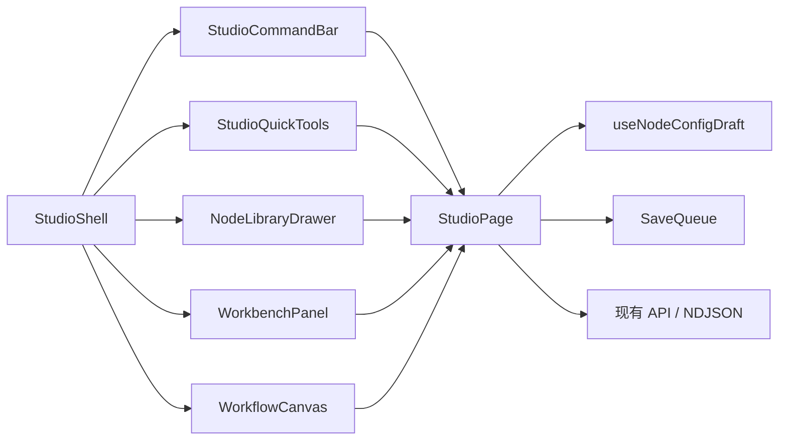

# Agent Studio 全画布体验实施计划

> **For agentic workers:** REQUIRED SUB-SKILL: Use superpowers:subagent-driven-development (recommended) or superpowers:executing-plans to implement this plan task-by-task. Steps use checkbox (`- [ ]`) syntax for tracking.

**Goal:** 在不修改后端和工作流格式的前提下，把 Studio 升级为全画布浮动工作台，并打通“添加节点 → 配置 → 应用并试运行 → 查看结果”的连续链路。

**Architecture:** `StudioPage` 保留工作流、图、保存队列和运行请求等领域编排；新增 `StudioShell`、`StudioCommandBar`、`StudioQuickTools` 和快捷键 Hook 负责 UI 编排。React Flow、`useStudioWorkbench`、`useNodeConfigDraft`、`SaveQueue` 和现有 API 保持稳定，只通过窄接口补充视口位置、最终拖拽提交和连续试运行能力。

**Tech Stack:** React 19.2.8、TypeScript 5.9.3、React Router 7.8.2、React Flow 12.11.2、Vitest 4.1.10、Testing Library、Playwright 1.62.1、pnpm 10.34.5、Go 后端与 Docker PostgreSQL 回归环境。

**Spec:** `docs/superpowers/specs/2026-08-27-studio-ux-design.md`



## Global Constraints

- 基线必须是 `origin/main` 的 `c0e5a04` 或其后续快进提交；开发分支使用 `codex/` 前缀。
- 不修改 Go 后端、OpenAPI、数据库迁移、工作流 JSON 和 NDJSON 事件协议。
- 不引入新的全局状态库、大型 UI 组件库或完整撤销/重做系统。
- 保留 React Flow、`SaveQueue`、`useStudioWorkbench` 和 `useNodeConfigDraft` 的职责边界。
- 鼠标用户无需快捷键；`Ctrl/Cmd + K` 只用于加速，输入控件和组合输入期间不得误触发。
- 桌面使用浮动工作台，平板使用最高 `60vh` 的底部面板，手机使用全屏面板；任何宽度不得产生页面横向滚动。
- 所有生产改动遵循 TDD：先看到目标测试失败，再写最小实现，再运行相关回归。
- Go 命令必须使用 `CGO_ENABLED=0`；完整回归使用 Docker PostgreSQL。
- 每个任务独立提交；任务完成后进行代码审查，全部回归通过后才推送并创建 PR。

实施 Task 1 前执行一次基线门禁；当前 `codex/studio-ux-design` 已从 `origin/main` 新建，若远端前进则先变基：

```bash
git fetch origin main
git rebase origin/main
git merge-base --is-ancestor origin/main HEAD
git status --short
```

Expected: merge-base 命令退出码为 0；工作树没有未提交业务代码。若 rebase 触及本计划列出的接口，先重新核对规格和文件图再继续。

---

## File Map

### 新增文件

| 文件 | 单一职责 |
|---|---|
| `apps/web/src/features/studio/StudioShell.tsx` | 组合全画布、命令条、快捷工具和浮层，并处理最上层关闭与焦点恢复 |
| `apps/web/src/features/studio/StudioShell.test.tsx` | 壳层层级、Escape 和焦点恢复测试 |
| `apps/web/src/features/studio/StudioCommandBar.tsx` | 工作流名称、保存状态、主操作和次级操作菜单 |
| `apps/web/src/features/studio/StudioCommandBar.test.tsx` | 状态文案、禁用规则和动作分发测试 |
| `apps/web/src/features/studio/StudioQuickTools.tsx` | 添加节点、适配图和快捷键帮助 |
| `apps/web/src/features/studio/StudioQuickTools.test.tsx` | 工具可发现性和动作测试 |
| `apps/web/src/features/studio/useStudioShortcuts.ts` | 全局快捷键及输入焦点/组合输入保护 |
| `apps/web/src/features/studio/useStudioShortcuts.test.ts` | 快捷键触发、守卫和清理测试 |

### 修改文件

| 文件 | 变化 |
|---|---|
| `apps/web/src/features/studio/WorkflowCanvas.tsx` | 暴露视口中心与适配图窄接口，报告无效连接结束状态 |
| `apps/web/src/features/studio/WorkflowCanvas.test.tsx` | 视口中心、手动适配与无效连接测试 |
| `apps/web/src/features/studio/StudioPage.tsx` | 接入新 UI 编排、视口放置、最终拖拽提交、连续试运行和错误反馈 |
| `apps/web/src/features/studio/StudioPage.test.tsx` | 页面主链路、保存失败和连接错误集成测试 |
| `apps/web/src/features/studio/WorkbenchPanel.tsx` | 非模态浮动工作台和焦点语义 |
| `apps/web/src/features/studio/WorkbenchPanel.test.tsx` | 调整宽度、关闭和焦点回归 |
| `apps/web/src/features/studio/NodeLibraryDrawer.tsx` | 自动聚焦、搜索优先和键盘选择 |
| `apps/web/src/features/studio/NodeLibraryDrawer.test.tsx` | 搜索焦点、上下键、回车和 Escape 测试 |
| `apps/web/src/components/schema-form/SchemaForm.tsx` | 可选第二提交动作及无效提交自动聚焦 |
| `apps/web/src/components/schema-form/SchemaForm.test.tsx` | 第二提交和首错聚焦测试 |
| `apps/web/src/features/studio/NodeConfigPanel.tsx` | 增加“应用并试运行”提交动作 |
| `apps/web/src/features/studio/NodeConfigPanel.test.tsx` | 连续动作和无效配置回归 |
| `apps/web/src/features/studio/useNodeConfigDraft.ts` | 为端口解析失败提供显式重试入口，保持 generation/Abort 防护 |
| `apps/web/src/features/studio/useNodeConfigDraft.test.ts` | 解析失败重试与迟到结果隔离回归 |
| `apps/web/src/features/studio/TestRunPanel.tsx` | 失败、取消、输出和重试反馈 |
| `apps/web/src/features/studio/TestRunPanel.test.tsx` | 输入保留、失败和重试测试 |
| `apps/web/src/features/studio/studio.css` | 全画布、命令条、浮层、响应式和 reduced-motion 样式 |
| `apps/web/e2e/agent-studio.spec.ts` | 真实核心链路和响应式回归 |
| `apps/web/e2e/helpers.ts` | 核心链路辅助函数改用新的稳定可访问入口 |

---

## Spec Coverage and Feasibility Gate

| 已批准要求 | 实施任务 | 自动化证据 |
|---|---|---|
| 全画布、分级命令条、浮动工作台 | Tasks 3–4 | Shell/CommandBar/Workbench 组件测试 + 响应式 E2E |
| 视口中心添加、自动配置、焦点恢复 | Tasks 1、3、5–6 | Canvas/Library/Config/Page 测试 |
| 应用、保存并试运行连续动作 | Task 6 | SchemaForm/Config/Page 测试 + 核心 E2E |
| 运行节点状态、输出、耗时、失败/取消重试 | Task 7 | Page/Canvas/TestRunPanel 测试 |
| 连接、解析、保存错误原位恢复 | Tasks 6–8 | 组件/页面测试 + 故障拦截 E2E |
| 最终拖拽持久化、快捷键守卫 | Tasks 1–2 | 纯函数和 Hook 测试 |
| 不改后端、协议和工作流格式 | 全部 | 生成物检查、`make verify`、diff 范围审查 |

可行性审查结论：无阻塞项。所有新增接口由现有 React Flow instance、`UseNodeConfigDraftResult`、`SaveQueue.flush()` 和 `RunEvent` 提供数据；连接与运行状态使用纯函数派生，运行态不进入持久化图；保存冲突明确采用刷新而非隐式合并；响应式不改变画布容器尺寸。若基线在实施前前进，先快进或变基到最新 `origin/main`，只在上述接口发生冲突时回到规格审查，不带冲突直接编码。

---

### Task 1: 画布视口接口与最终拖拽持久化

**Files:**
- Modify: `apps/web/src/features/studio/WorkflowCanvas.tsx`
- Test: `apps/web/src/features/studio/WorkflowCanvas.test.tsx`
- Modify: `apps/web/src/features/studio/StudioPage.tsx`（`isPersistentNodeChange`）
- Test: `apps/web/src/features/studio/StudioPage.test.tsx`（图变化分类用例）

**Interfaces:**
- Consumes: `ReactFlowInstance<StudioNode, StudioEdge>`、现有 `fitRequest`。
- Produces: `WorkflowCanvasHandle`，包含 `getViewportCenter(): XYPosition` 和 `fitView(): Promise<boolean>`；`onNodeClick(node, trigger)` 把原画布节点元素交回页面用于焦点恢复；`isPersistentNodeChange` 只持久化拖拽结束位置及 add/remove/replace。

- [ ] **Step 1: 为视口中心和手动适配写失败测试**

在 `WorkflowCanvas.test.tsx` 的 React Flow mock 中加入 `screenToFlowPosition`，并新增：

```tsx
const screenToFlowPosition = vi.hoisted(() => vi.fn(() => ({ x: 420, y: 260 })))
const baseProps = {
  edges: [],
  onNodesChange: vi.fn(),
  onEdgesChange: vi.fn(),
  onConnect: vi.fn(),
  isValidConnection: vi.fn(),
  onNodeClick: vi.fn(),
}

it('通过窄接口返回当前视口中心并允许手动适配', async () => {
  const ref = createRef<WorkflowCanvasHandle>()
  render(<WorkflowCanvas ref={ref} {...baseProps} nodes={[node('a')]} />)

  expect(ref.current?.getViewportCenter()).toEqual({ x: 420, y: 260 })
  await ref.current?.fitView()
  expect(fitView).toHaveBeenCalledTimes(2)
})
```

同一 mock 把节点渲染为 `.react-flow__node`，再断言画布点击回调的第二个参数就是被点击节点元素：

```tsx
it('把被点击的画布节点作为焦点回退目标上报', () => {
  const onNodeClick = vi.fn()
  render(<WorkflowCanvas {...baseProps} nodes={[node('a')]} onNodeClick={onNodeClick} />)
  const trigger = screen.getByTestId('flow-node-a')
  fireEvent.click(trigger)
  expect(onNodeClick).toHaveBeenCalledWith(expect.objectContaining({ id: 'a' }), trigger)
})
```

- [ ] **Step 2: 运行测试并确认接口尚不存在**

Run:

```bash
corepack pnpm@10.34.5 --filter @agent-studio/web test --run src/features/studio/WorkflowCanvas.test.tsx
```

Expected: FAIL，提示 `WorkflowCanvasHandle` 未导出或 `ref.current` 为空。

- [ ] **Step 3: 实现最小画布句柄**

在 `WorkflowCanvas.tsx` 使用 `forwardRef` 与 `useImperativeHandle`：

```tsx
export interface WorkflowCanvasHandle {
  getViewportCenter: () => XYPosition
  fitView: () => Promise<boolean>
}

interface WorkflowCanvasProps {
  nodes: StudioNode[]
  edges: StudioEdge[]
  onNodesChange: (changes: NodeChange<StudioNode>[]) => void
  onEdgesChange: (changes: EdgeChange<StudioEdge>[]) => void
  onConnect: (connection: Connection) => void
  isValidConnection: (connection: Connection | StudioEdge) => boolean
  onNodeClick: (node: StudioNode, trigger: HTMLElement) => void
  readOnly?: boolean
  fitRequest?: number
  currentNodeID?: string
  onViewportChange?: (viewport: Viewport) => void
}

export const WorkflowCanvas = forwardRef<WorkflowCanvasHandle, WorkflowCanvasProps>(function WorkflowCanvas(props, ref) {
  const containerRef = useRef<HTMLDivElement>(null)
  useImperativeHandle(ref, () => ({
    getViewportCenter: () => {
      const instance = instanceRef.current
      const rect = containerRef.current?.getBoundingClientRect()
      if (!instance || !rect) return { x: 320, y: 260 }
      return instance.screenToFlowPosition({ x: rect.left + rect.width / 2, y: rect.top + rect.height / 2 })
    },
    fitView: () => instanceRef.current?.fitView({ padding: 0.2, maxZoom: 1.2 }) ?? Promise.resolve(false),
  }), [])

  const handleNodeClick: NonNullable<ComponentProps<typeof ReactFlow>['onNodeClick']> = (event, node) => {
    if ((event.target as HTMLElement).closest('.react-flow__handle')) return
    const trigger = (event.target as HTMLElement).closest<HTMLElement>('.react-flow__node')
    if (trigger) props.onNodeClick(node, trigger)
  }

  // 将现有 ReactFlow 的 onNodeClick prop 替换为 handleNodeClick。
})
```

`DebugPage` 现有单参数回调无需改行为；TypeScript 允许它忽略新增的第二参数。

- [ ] **Step 4: 为拖拽中间帧写失败测试**

在 `StudioPage.test.tsx` 的图变化分类用例中加入：

```ts
expect(isPersistentNodeChange({ type: 'position', id: 'a', position: { x: 8, y: 9 }, dragging: true })).toBe(false)
expect(isPersistentNodeChange({ type: 'position', id: 'a', position: { x: 10, y: 20 }, dragging: false })).toBe(true)
```

- [ ] **Step 5: 只提交拖拽最终位置**

将判断改为：

```ts
export function isPersistentNodeChange(change: NodeChange<StudioNode>) {
  if (change.type === 'position') return change.dragging === false
  return change.type === 'add' || change.type === 'remove' || change.type === 'replace'
}
```

- [ ] **Step 6: 运行画布与页面相关测试**

Run:

```bash
corepack pnpm@10.34.5 --filter @agent-studio/web test --run src/features/studio/WorkflowCanvas.test.tsx src/features/studio/StudioPage.test.tsx
```

Expected: PASS。

- [ ] **Step 7: 提交**

```bash
git add apps/web/src/features/studio/WorkflowCanvas.tsx apps/web/src/features/studio/WorkflowCanvas.test.tsx apps/web/src/features/studio/StudioPage.tsx apps/web/src/features/studio/StudioPage.test.tsx
git commit -m "feat(web): expose stable studio canvas actions"
```

---

### Task 2: 受输入焦点保护的 Studio 快捷键

**Files:**
- Create: `apps/web/src/features/studio/useStudioShortcuts.ts`
- Create: `apps/web/src/features/studio/useStudioShortcuts.test.ts`

**Interfaces:**
- Consumes: 页面提供的 `onOpenNodeLibrary` 与 `onEscape` 回调。
- Produces: `useStudioShortcuts(options: { onOpenNodeLibrary: () => void; onEscape: () => void }): void` 和可单测的 `isEditableTarget(target: EventTarget | null): boolean`。

- [ ] **Step 1: 写快捷键失败测试**

```ts
it('Ctrl/Cmd+K 打开节点面板，Escape 关闭最上层', () => {
  const onOpenNodeLibrary = vi.fn()
  const onEscape = vi.fn()
  renderHook(() => useStudioShortcuts({ onOpenNodeLibrary, onEscape }))
  fireEvent.keyDown(window, { key: 'k', metaKey: true })
  fireEvent.keyDown(window, { key: 'Escape' })
  expect(onOpenNodeLibrary).toHaveBeenCalledOnce()
  expect(onEscape).toHaveBeenCalledOnce()
})

it('输入控件、contenteditable 和组合输入期间不触发', () => {
  const onOpenNodeLibrary = vi.fn()
  renderHook(() => useStudioShortcuts({ onOpenNodeLibrary, onEscape: vi.fn() }))
  const input = document.createElement('input')
  fireEvent.keyDown(input, { key: 'k', metaKey: true })
  fireEvent.keyDown(window, { key: 'k', metaKey: true, isComposing: true })
  expect(onOpenNodeLibrary).not.toHaveBeenCalled()
})

it('子组件已处理的按键不再触发全局动作', () => {
  const onEscape = vi.fn()
  renderHook(() => useStudioShortcuts({ onOpenNodeLibrary: vi.fn(), onEscape }))
  const event = new KeyboardEvent('keydown', { key: 'Escape', bubbles: true, cancelable: true })
  event.preventDefault()
  window.dispatchEvent(event)
  expect(onEscape).not.toHaveBeenCalled()
})
```

- [ ] **Step 2: 运行测试并确认失败**

```bash
corepack pnpm@10.34.5 --filter @agent-studio/web test --run src/features/studio/useStudioShortcuts.test.ts
```

Expected: FAIL，模块不存在。

- [ ] **Step 3: 实现 Hook 与守卫**

```ts
export function isEditableTarget(target: EventTarget | null) {
  return target instanceof HTMLElement && Boolean(target.closest('input, textarea, select, [contenteditable="true"]'))
}

export function useStudioShortcuts({ onOpenNodeLibrary, onEscape }: StudioShortcutOptions) {
  useEffect(() => {
    const onKeyDown = (event: KeyboardEvent) => {
      if (event.defaultPrevented || event.isComposing || isEditableTarget(event.target)) return
      if ((event.metaKey || event.ctrlKey) && event.key.toLowerCase() === 'k') {
        event.preventDefault()
        onOpenNodeLibrary()
      } else if (event.key === 'Escape') onEscape()
    }
    window.addEventListener('keydown', onKeyDown)
    return () => window.removeEventListener('keydown', onKeyDown)
  }, [onEscape, onOpenNodeLibrary])
}
```

- [ ] **Step 4: 运行测试并确认通过**

```bash
corepack pnpm@10.34.5 --filter @agent-studio/web test --run src/features/studio/useStudioShortcuts.test.ts
```

Expected: PASS。

- [ ] **Step 5: 提交**

```bash
git add apps/web/src/features/studio/useStudioShortcuts.ts apps/web/src/features/studio/useStudioShortcuts.test.ts
git commit -m "feat(web): add guarded studio shortcuts"
```

---

### Task 3: 全画布壳层与浮动工作台

**Files:**
- Create: `apps/web/src/features/studio/StudioShell.tsx`
- Create: `apps/web/src/features/studio/StudioShell.test.tsx`
- Modify: `apps/web/src/features/studio/WorkbenchPanel.tsx`
- Test: `apps/web/src/features/studio/WorkbenchPanel.test.tsx`
- Modify: `apps/web/src/features/studio/studio.css`

**Interfaces:**
- Consumes: Task 2 的 `useStudioShortcuts`。
- Produces: `StudioLayer = 'none' | 'library' | 'workbench'`；`StudioShellProps` 的五个槽位、`onOpenNodeLibrary`、`onRequestCloseTopLayer` 和 `returnFocusRef`。

`StudioShellProps` 使用以下完整签名，测试和页面不得各自复制另一份类型：

```tsx
export interface StudioShellProps {
  layer: StudioLayer
  commandBar: ReactNode
  quickTools: ReactNode
  canvas: ReactNode
  nodeLibrary?: ReactNode
  workbench?: ReactNode
  onOpenNodeLibrary: () => void
  onRequestCloseTopLayer: () => void
  returnFocusRef?: RefObject<HTMLElement | null>
}
```

- [ ] **Step 1: 写壳层层级与焦点失败测试**

```tsx
it('Escape 只关闭最上层浮窗并在关闭后恢复触发点焦点', async () => {
  const trigger = createRef<HTMLButtonElement>()
  const onClose = vi.fn()
  const { rerender } = render(
    <StudioShell layer="library" returnFocusRef={trigger} onOpenNodeLibrary={vi.fn()} onRequestCloseTopLayer={onClose}
      commandBar={<button ref={trigger}>命令条</button>} quickTools={<span>工具</span>} canvas={<span>画布</span>} nodeLibrary={<span>节点库</span>} />,
  )
  fireEvent.keyDown(window, { key: 'Escape' })
  expect(onClose).toHaveBeenCalledOnce()
  rerender(<StudioShell layer="none" returnFocusRef={trigger} onOpenNodeLibrary={vi.fn()} onRequestCloseTopLayer={onClose}
    commandBar={<button ref={trigger}>命令条</button>} quickTools={<span>工具</span>} canvas={<span>画布</span>} />)
  await waitFor(() => expect(trigger.current).toHaveFocus())
})
```

- [ ] **Step 2: 运行测试并确认组件不存在**

```bash
corepack pnpm@10.34.5 --filter @agent-studio/web test --run src/features/studio/StudioShell.test.tsx
```

Expected: FAIL，`StudioShell` 未定义。

- [ ] **Step 3: 实现结构化壳层**

```tsx
export type StudioLayer = 'none' | 'library' | 'workbench'

export function StudioShell(props: StudioShellProps) {
  const previousLayer = useRef(props.layer)
  useStudioShortcuts({
    onOpenNodeLibrary: props.onOpenNodeLibrary,
    onEscape: () => { if (props.layer !== 'none') props.onRequestCloseTopLayer() },
  })
  useEffect(() => {
    if (previousLayer.current !== 'none' && props.layer === 'none') props.returnFocusRef?.current?.focus()
    previousLayer.current = props.layer
  }, [props.layer, props.returnFocusRef])
  return <section className="studio-shell">
    <div className="studio-shell-canvas">{props.canvas}</div>
    <div className="studio-shell-command">{props.commandBar}</div>
    <div className="studio-shell-tools">{props.quickTools}</div>
    {props.nodeLibrary && <div className="studio-shell-library">{props.nodeLibrary}</div>}
    {props.workbench && <div className="studio-shell-workbench">{props.workbench}</div>}
  </section>
}
```

`StudioPage` 持有 `lastTriggerRef = useRef<HTMLElement | null>(null)`：快捷工具、命令条或 Task 1 的画布节点打开浮层前先写入触发元素；壳层只在 `library/workbench → none` 时恢复该元素，不自行猜测焦点来源。

- [ ] **Step 4: 更新工作台非模态语义并消除重复 Escape 触发**

`DebugPage` 仍直接复用 `WorkbenchPanel`，因此保留其 Escape effect；处理后必须 `preventDefault()`，Task 2 的全局守卫据此跳过 `StudioShell` 回调，保证壳层内一次按键只关闭一次，同时维持直接消费者的键盘行为。在 `WorkbenchPanel.test.tsx` 断言 `role="dialog"`、标题关联、宽度夹紧、关闭按钮和 resizer 键盘行为仍然可用；在 `StudioShell.test.tsx` 组合真实 `WorkbenchPanel`，断言 Escape 只调用一次关闭处理器。不要添加 `aria-modal="true"` 或焦点圈定。

```tsx
expect(screen.getByRole('dialog', { name: '节点配置' })).not.toHaveAttribute('aria-modal', 'true')
const separator = screen.getByRole('separator')
separator.focus()
await userEvent.keyboard('{ArrowLeft}')
expect(separator).toHaveAttribute('aria-valuenow', '384')
```

该用例开始前执行 `window.localStorage.setItem('agent-studio.workbench-width', '400')`，避免其他测试保存的宽度影响断言。

- [ ] **Step 5: 写全画布与响应式样式**

在 `studio.css` 中建立：

```css
.studio-shell { position: relative; width: 100%; height: 100%; overflow: hidden; background: var(--as-canvas); }
.studio-shell-canvas { position: absolute; inset: 0; }
.studio-shell-command { position: absolute; z-index: 10; top: 16px; right: 16px; left: 16px; }
.studio-shell-tools { position: absolute; z-index: 11; top: 90px; left: 16px; }
.studio-shell-library { position: absolute; z-index: 12; top: 90px; left: 64px; bottom: 16px; }
.studio-shell-workbench { position: absolute; z-index: 12; top: 90px; right: 16px; bottom: 16px; }

@media (max-width: 1023px) {
  .studio-shell-workbench { top: auto; right: 16px; bottom: 16px; left: 16px; max-height: 60vh; }
  .studio-shell-workbench .workbench-panel { width: 100%; }
}
@media (max-width: 639px) {
  .studio-shell-workbench { inset: 8px; max-height: none; }
}
@media (prefers-reduced-motion: reduce) {
  .workbench-panel { transition: none; }
}
```

把 `.workbench-panel` 的定位改为由壳层容器控制，组件本身使用 `position: relative; width: var(--as-workbench-width); height: 100%`。

- [ ] **Step 6: 运行壳层和工作台测试**

```bash
corepack pnpm@10.34.5 --filter @agent-studio/web test --run src/features/studio/StudioShell.test.tsx src/features/studio/WorkbenchPanel.test.tsx
```

Expected: PASS。

- [ ] **Step 7: 提交**

```bash
git add apps/web/src/features/studio/StudioShell.tsx apps/web/src/features/studio/StudioShell.test.tsx apps/web/src/features/studio/WorkbenchPanel.tsx apps/web/src/features/studio/WorkbenchPanel.test.tsx apps/web/src/features/studio/studio.css
git commit -m "feat(web): add full-canvas studio shell"
```

---

### Task 4: 分级命令条与可发现快捷工具

**Files:**
- Create: `apps/web/src/features/studio/StudioCommandBar.tsx`
- Create: `apps/web/src/features/studio/StudioCommandBar.test.tsx`
- Create: `apps/web/src/features/studio/StudioQuickTools.tsx`
- Create: `apps/web/src/features/studio/StudioQuickTools.test.tsx`
- Modify: `apps/web/src/features/studio/StudioPage.tsx`
- Modify: `apps/web/src/features/studio/studio.css`

**Interfaces:**
- Consumes: `SaveState`、Task 1 的 `WorkflowCanvasHandle.fitView()`、Task 3 的壳层槽位。
- Produces: 明确的 `StudioCommandBarProps` 和 `StudioQuickToolsProps`；保持可访问名称“添加节点”“测试运行”“发布”“版本历史”等不变。

```tsx
export interface StudioCommandBarProps {
  workflowName: string
  saveState: SaveState
  archived: boolean
  exporting: boolean
  runsHref: string
  actionError: string
  testLabel: string
  testDisabled: boolean
  onTest: () => void
  onPublish: () => void
  onAgentPresentation: () => void
  onVersionHistory: () => void
  onExport: () => void
  onRetrySave?: () => void
  onRefreshConflict?: () => void
  testButtonRef?: Ref<HTMLButtonElement>
  versionButtonRef?: Ref<HTMLButtonElement>
}

export interface StudioQuickToolsProps {
  disabled: boolean
  addButtonRef?: Ref<HTMLButtonElement>
  onAdd: () => void
  onFitView: () => void
}
```

- [ ] **Step 1: 写命令条失败测试**

```tsx
it('突出试运行和发布，并把低频动作放入更多操作', async () => {
  const onTest = vi.fn()
  render(<StudioCommandBar workflowName="演示助手" saveState="saved" archived={false} exporting={false}
    runsHref="/runs?workflowId=w1" actionError="" testLabel="测试运行" testDisabled={false}
    onTest={onTest} onPublish={vi.fn()} onAgentPresentation={vi.fn()} onVersionHistory={vi.fn()} onExport={vi.fn()} />)
  await userEvent.click(screen.getByRole('button', { name: '测试运行' }))
  expect(onTest).toHaveBeenCalledOnce()
  expect(screen.getByRole('button', { name: '发布' })).toBeVisible()
  expect(screen.getByText('已保存')).toBeVisible()
  await userEvent.click(screen.getByText('更多操作'))
  expect(screen.getByRole('button', { name: '版本历史' })).toBeVisible()
})
```

- [ ] **Step 2: 写快捷工具失败测试**

```tsx
it('提供可见的添加、适配和快捷键帮助', async () => {
  const onAdd = vi.fn()
  const onFitView = vi.fn()
  render(<StudioQuickTools disabled={false} onAdd={onAdd} onFitView={onFitView} />)
  await userEvent.click(screen.getByRole('button', { name: '添加节点' }))
  await userEvent.click(screen.getByRole('button', { name: '适配工作流' }))
  expect(onAdd).toHaveBeenCalledOnce()
  expect(onFitView).toHaveBeenCalledOnce()
  expect(screen.getByText('Ctrl/⌘ + K')).toBeInTheDocument()
})
```

- [ ] **Step 3: 运行测试并确认组件不存在**

```bash
corepack pnpm@10.34.5 --filter @agent-studio/web test --run src/features/studio/StudioCommandBar.test.tsx src/features/studio/StudioQuickTools.test.tsx
```

Expected: FAIL。

- [ ] **Step 4: 实现命令条与快捷工具**

命令条使用原生 `<details>` 承载次级菜单，避免新建菜单状态机：

```tsx
export function StudioCommandBar(props: StudioCommandBarProps) {
  return <header className="studio-command-bar">
    <div className="studio-title"><Link to="/workflows" aria-label="返回工作流列表">←</Link><div><strong>{props.workflowName}</strong><small>{saveLabel(props.saveState)}</small></div></div>
    <div className="studio-primary-actions">
      <Button onClick={props.onTest} disabled={props.testDisabled}>{props.testLabel}</Button>
      <Button variant="primary" onClick={props.onPublish} disabled={props.archived || props.testDisabled}>发布</Button>
      <details><summary>更多操作</summary><div className="studio-more-menu">
        <Link to={props.runsHref}>运行记录</Link>
        <Button type="button" onClick={props.onAgentPresentation} disabled={props.archived}>Agent 页面设置</Button>
        <Button ref={props.versionButtonRef} type="button" onClick={props.onVersionHistory}>版本历史</Button>
        <Button type="button" onClick={props.onExport} disabled={props.exporting}>{props.exporting ? '导出中…' : '导出模板'}</Button>
      </div></details>
    </div>
    {props.actionError && <p className="studio-command-error" role="alert">{props.actionError}</p>}
  </header>
}
```

快捷工具使用 `Button`，帮助使用原生 `<details>`；`onFitView` 调用 `canvasRef.current?.fitView()`。

- [ ] **Step 5: 在 StudioPage 接入 Task 3 壳层与新控件**

保持所有现有处理器不变，只替换返回 JSX 的编排：

```tsx
<StudioShell
  layer={libraryOpen ? 'library' : workbench.mode.kind !== 'closed' ? 'workbench' : 'none'}
  returnFocusRef={lastTriggerRef}
  onOpenNodeLibrary={() => {
    if (archived || versionLocked) return
    rememberTrigger(document.activeElement instanceof HTMLElement ? document.activeElement : addButtonRef.current)
    requestIntent({ kind: 'open-library' })
  }}
  onRequestCloseTopLayer={closeTopLayer}
  commandBar={<StudioCommandBar
    workflowName={workflow.name}
    saveState={saveState}
    archived={archived}
    exporting={exporting}
    runsHref={`/runs?workflowId=${encodeURIComponent(workflow.id)}`}
    actionError={exportError || versionError || (!agentSettingsOpen ? agentSettingsError : '')}
    testLabel="测试运行"
    testDisabled={archived || versionLocked}
    testButtonRef={testButtonRef}
    versionButtonRef={versionButtonRef}
    onTest={() => { rememberTrigger(testButtonRef.current); requestIntent({ kind: 'test' }) }}
    onPublish={() => requestIntent({ kind: 'publish' })}
    onAgentPresentation={() => requestIntent({ kind: 'agent-presentation' })}
    onVersionHistory={() => { rememberTrigger(versionButtonRef.current); requestIntent({ kind: 'version-history' }) }}
    onExport={() => requestIntent({ kind: 'export' })}
  />}
  quickTools={<StudioQuickTools disabled={archived || versionLocked} addButtonRef={addButtonRef} onAdd={openLibraryFromQuickTools} onFitView={() => void canvasRef.current?.fitView()} />}
  canvas={<WorkflowCanvas ref={canvasRef} readOnly={archived || versionLocked} fitRequest={fitRequest}
    nodes={nodes} edges={edges} onNodesChange={handleNodesChange} onEdgesChange={handleEdgesChange}
    onConnect={handleConnect} isValidConnection={isValidConnection}
    onNodeClick={(node, trigger) => {
      rememberTrigger(trigger)
      if (!archived && !versionLocked) requestIntent({ kind: 'config', nodeId: node.id })
    }} />}
  nodeLibrary={libraryOpen ? <NodeLibraryDrawer definitions={definitions} onAdd={addNode} onClose={() => setLibraryOpen(false)} /> : undefined}
  workbench={workbench.mode.kind !== 'closed' ? <WorkbenchPanel titleId="studio-workbench-title"
    closeDisabled={workbench.mode.kind === 'versions' && versionLocked} onRequestClose={() => requestIntent({ kind: 'close' })}>
    {workbench.mode.kind === 'config' && selectedNode && <NodeConfigPanel titleId="studio-workbench-title" node={selectedNode} draft={configDraft} onApply={applySelectedConfig} />}
    {workbench.mode.kind === 'test' && <><header className="workbench-heading"><span className="node-category">调试</span><h2 id="studio-workbench-title">测试运行</h2></header><TestRunPanel schema={startSchema} events={events} running={running} error={runError} onRun={runDraft} onCancel={() => runController.current?.abort()} /></>}
    {workbench.mode.kind === 'versions' && <VersionGovernancePanel titleId="studio-workbench-title" workflow={workflow} saveState={saveState} editSerial={draftEditSerial} archived={archived} onApplyWorkflow={applyVersionWorkflow} onLockChange={setVersionLocked} />}
  </WorkbenchPanel> : undefined}
/>
```

页面建立 `canvasRef`、`addButtonRef`、`testButtonRef`、沿用已有 `versionButtonRef`，并在打开对应浮层前把目标写入 `lastTriggerRef.current`。画布节点点击则使用 Task 1 上报的元素：

```tsx
const rememberTrigger = (trigger: HTMLElement | null) => { lastTriggerRef.current = trigger }
const closeTopLayer = () => {
  if (libraryOpen) setLibraryOpen(false)
  else if (workbench.mode.kind !== 'closed') requestIntent({ kind: 'close' })
}
const openLibraryFromQuickTools = () => {
  rememberTrigger(addButtonRef.current)
  requestIntent({ kind: 'open-library' })
}

<WorkflowCanvas onNodeClick={(node, trigger) => {
  rememberTrigger(trigger)
  if (!archived && !versionLocked) requestIntent({ kind: 'config', nodeId: node.id })
}} />
```

把现有 `saveLabel(state)` 从 `StudioPage.tsx` 移到 `StudioCommandBar.tsx` 并保持五种文案映射不变，避免命令条反向依赖页面实现。

- [ ] **Step 6: 运行组件与页面回归**

```bash
corepack pnpm@10.34.5 --filter @agent-studio/web test --run src/features/studio/StudioCommandBar.test.tsx src/features/studio/StudioQuickTools.test.tsx src/features/studio/StudioShell.test.tsx src/features/studio/StudioPage.test.tsx
```

Expected: PASS；旧的可访问名称仍能被页面测试找到。

- [ ] **Step 7: 提交**

```bash
git add apps/web/src/features/studio/StudioCommandBar.tsx apps/web/src/features/studio/StudioCommandBar.test.tsx apps/web/src/features/studio/StudioQuickTools.tsx apps/web/src/features/studio/StudioQuickTools.test.tsx apps/web/src/features/studio/StudioPage.tsx apps/web/src/features/studio/studio.css
git commit -m "feat(web): organize studio commands and tools"
```

---

### Task 5: 搜索优先节点面板与视口中心放置

**Files:**
- Modify: `apps/web/src/features/studio/NodeLibraryDrawer.tsx`
- Test: `apps/web/src/features/studio/NodeLibraryDrawer.test.tsx`
- Modify: `apps/web/src/features/studio/StudioPage.tsx`
- Test: `apps/web/src/features/studio/StudioPage.test.tsx`

**Interfaces:**
- Consumes: Task 1 的 `WorkflowCanvasHandle.getViewportCenter()`、Task 4 的添加节点触发器。
- Produces: `NodeLibraryDrawer` 保持 `definitions / onAdd / onClose` API；新增节点使用视口中心坐标，句柄不可用时回退 `{ x: 320, y: 260 }`。

- [ ] **Step 1: 写键盘选择失败测试**

```tsx
it('打开后聚焦搜索，并支持上下键、回车和 Escape', async () => {
  const onAdd = vi.fn()
  const onClose = vi.fn()
  render(<NodeLibraryDrawer definitions={[definition(), definition(undefined, { type: 'example.http', title: 'HTTP' })]} onAdd={onAdd} onClose={onClose} />)
  const search = screen.getByLabelText('搜索节点')
  expect(search).toHaveFocus()
  await userEvent.keyboard('{ArrowDown}{ArrowDown}{Enter}')
  expect(onAdd).toHaveBeenCalledWith(expect.objectContaining({ type: 'example.http' }))
  search.focus()
  await userEvent.keyboard('{Escape}')
  expect(onClose).toHaveBeenCalledOnce()
})
```

- [ ] **Step 2: 运行测试并确认失败**

```bash
corepack pnpm@10.34.5 --filter @agent-studio/web test --run src/features/studio/NodeLibraryDrawer.test.tsx
```

Expected: FAIL，搜索框未自动聚焦或按键没有选择节点。

- [ ] **Step 3: 实现焦点和键盘移动**

使用扁平 `visibleDefinitions` 与按钮 ref，不引入新的 selection store：

```tsx
const itemRefs = useRef<Array<HTMLButtonElement | null>>([])
const focusItem = (index: number) => itemRefs.current[(index + visibleDefinitions.length) % visibleDefinitions.length]?.focus()
const onItemKeyDown = (event: KeyboardEvent<HTMLButtonElement>, index: number, definition: NodeDefinition) => {
  if (event.key === 'ArrowDown') { event.preventDefault(); focusItem(index + 1) }
  else if (event.key === 'ArrowUp') { event.preventDefault(); focusItem(index - 1) }
  else if (event.key === 'Enter') { event.preventDefault(); onAdd(definition) }
  else if (event.key === 'Escape') { event.preventDefault(); onClose() }
}
```

搜索框添加 `autoFocus`，ArrowDown 聚焦第一个可见节点，Escape 关闭。

- [ ] **Step 4: 写视口中心放置失败测试**

在 `StudioPage.test.tsx` 的 React Flow mock 让 `screenToFlowPosition` 返回 `{ x: 640, y: 360 }`；添加节点并等待保存后断言：

```ts
expect(vi.mocked(api.saveWorkflow).mock.calls.at(-1)?.[1].graph.nodes.find((node) => node.type === 'template')?.position)
  .toEqual({ x: 640, y: 360 })
```

- [ ] **Step 5: 使用画布句柄放置节点**

```ts
const position = canvasRef.current?.getViewportCenter() ?? { x: 320, y: 260 }
const node: StudioNode = {
  id: createID(definition.type),
  type: 'studio',
  position,
  data: createNodeData(definition),
}
```

删除基于 `addedCount * 220` 的位置累加。添加后继续执行：关闭节点面板、选择节点、打开配置工作台。

- [ ] **Step 6: 运行节点面板和页面测试**

```bash
corepack pnpm@10.34.5 --filter @agent-studio/web test --run src/features/studio/NodeLibraryDrawer.test.tsx src/features/studio/StudioPage.test.tsx
```

Expected: PASS。

- [ ] **Step 7: 提交**

```bash
git add apps/web/src/features/studio/NodeLibraryDrawer.tsx apps/web/src/features/studio/NodeLibraryDrawer.test.tsx apps/web/src/features/studio/StudioPage.tsx apps/web/src/features/studio/StudioPage.test.tsx
git commit -m "feat(web): streamline studio node insertion"
```

---

### Task 6: “应用并试运行”连续提交动作

**Files:**
- Modify: `apps/web/src/components/schema-form/SchemaForm.tsx`
- Test: `apps/web/src/components/schema-form/SchemaForm.test.tsx`
- Modify: `apps/web/src/features/studio/NodeConfigPanel.tsx`
- Test: `apps/web/src/features/studio/NodeConfigPanel.test.tsx`
- Modify: `apps/web/src/features/studio/useNodeConfigDraft.ts`
- Test: `apps/web/src/features/studio/useNodeConfigDraft.test.ts`
- Modify: `apps/web/src/features/studio/StudioPage.tsx`
- Test: `apps/web/src/features/studio/StudioPage.test.tsx`

**Interfaces:**
- Consumes: `UseNodeConfigDraftResult.normalized / preview / status`、`SaveQueue.flush()`、`useStudioWorkbench.request({ kind: 'test' }, false)`。
- Produces: `SchemaFormSecondarySubmit`；`UseNodeConfigDraftResult.retry()`；`NodeConfigPanelProps.onApplyAndTest(config, ports)`；连续动作只在明确点击时应用草稿。

- [ ] **Step 1: 为 SchemaForm 第二提交和首错聚焦写失败测试**

```tsx
it('第二提交复用校验并调用独立处理器', async () => {
  const onSecondarySubmit = vi.fn()
  render(<SchemaForm schema={schema} value={{ topic: 'Agent' }} onChange={vi.fn()} onSubmit={vi.fn()} submitLabel="应用"
    secondarySubmit={{ label: '应用并试运行', onSubmit: onSecondarySubmit }} />)
  await userEvent.click(screen.getByRole('button', { name: '应用并试运行' }))
  expect(onSecondarySubmit).toHaveBeenCalledWith({ topic: 'Agent' })
})

it('无效提交展示错误并自动聚焦首个字段', async () => {
  render(<SchemaForm schema={schema} value={{ topic: '' }} onChange={vi.fn()} onSubmit={vi.fn()} submitLabel="应用" />)
  await userEvent.click(screen.getByRole('button', { name: '应用' }))
  await waitFor(() => expect(screen.getByLabelText('主题')).toHaveFocus())
})
```

- [ ] **Step 2: 运行测试并确认失败**

```bash
corepack pnpm@10.34.5 --filter @agent-studio/web test --run src/components/schema-form/SchemaForm.test.tsx
```

Expected: FAIL，`secondarySubmit` 不存在且无效提交不自动聚焦。

- [ ] **Step 3: 扩展 SchemaForm 提交意图**

```tsx
export interface SchemaFormSecondarySubmit {
  label: string
  onSubmit: (value: FormValue) => void | Promise<void>
  disabled?: boolean
}

interface SchemaFormProps {
  schema: JSONSchema
  value: FormValue
  onChange: (value: FormValue) => void
  onSubmit: (value: FormValue) => void | Promise<void>
  submitLabel: string
  secondarySubmit?: SchemaFormSecondarySubmit
  disabled?: boolean
  groupOptional?: boolean
  onValidationChange?: (validation: FormValidation) => void
  editablePaths?: ReadonlySet<string>
  requiredPaths?: ReadonlySet<string>
}

function fieldID(path: string) {
  return `field-${path.slice(1).replace(/[^a-zA-Z0-9_-]/g, '-')}`
}

const submit = async (event: FormEvent<HTMLFormElement>) => {
  event.preventDefault()
  if (!validation.valid) {
    setErrors(validation.errors)
    const first = Object.keys(validation.errors)[0]
    window.requestAnimationFrame(() => document.getElementById(fieldID(first))?.focus())
    return
  }
  const submitter = (event.nativeEvent as SubmitEvent).submitter as HTMLButtonElement | null
  const handler = submitter?.dataset.intent === 'secondary' ? secondarySubmit?.onSubmit : onSubmit
  setDraft(validation.normalized)
  setErrors({})
  onChange(validation.normalized)
  await handler?.(validation.normalized)
}
```

渲染第二个 `type="submit" data-intent="secondary"` 按钮；`secondarySubmit.disabled` 只控制第二按钮。`fieldID(path)` 与 `Field.tsx` 使用同一公式，避免错误摘要和自动聚焦定位到不同字段。

- [ ] **Step 4: 为节点面板连续动作写失败测试**

```tsx
const readyDraft: UseNodeConfigDraftResult = {
  nodeId: 'node-a',
  draft: { mode: 'new' },
  normalized: { mode: 'new' },
  dirty: true,
  status: 'ready',
  preview: { ports: { inputs: [], outputs: [] }, added: [], removed: [], invalidEdgeIds: [] },
  error: '',
  setDraft: vi.fn(),
  reset: vi.fn(),
  retry: vi.fn(),
  markApplied: vi.fn(),
}

it('就绪草稿提供应用并试运行动作', async () => {
  const onApplyAndTest = vi.fn()
  render(<NodeConfigPanel titleId="config-title" node={node} draft={readyDraft} onApply={vi.fn()} onApplyAndTest={onApplyAndTest} />)
  await userEvent.click(screen.getByRole('button', { name: '应用并试运行' }))
  expect(onApplyAndTest).toHaveBeenCalledWith({ mode: 'new' }, readyDraft.preview?.ports)
})

it('节点配置打开后聚焦首个可编辑字段', async () => {
  render(<NodeConfigPanel titleId="config-title" node={node} draft={readyDraft} onApply={vi.fn()} onApplyAndTest={vi.fn()} />)
  await waitFor(() => expect(screen.getByLabelText('模式')).toHaveFocus())
})
```

- [ ] **Step 5: 保留无效提交入口、聚焦字段并提供端口解析重试**

`NodeConfigPanel` 不能再用 `disabled={!canApply}`，否则无效草稿无法提交并触发首错聚焦。只在草稿未变化、初始态、解析中或解析失败时禁用，`invalid` 保持可点击但不会调用页面处理器：

```tsx
const canApply = draft.dirty && draft.status === 'ready' && Boolean(draft.normalized && draft.preview)
const submitDisabled = !draft.dirty || draft.status === 'idle' || draft.status === 'resolving' || draft.status === 'error'
const panelRef = useRef<HTMLDivElement>(null)

useEffect(() => {
  const frame = window.requestAnimationFrame(() => {
    panelRef.current?.querySelector<HTMLElement>('.schema-form input:not(:disabled), .schema-form textarea:not(:disabled), .schema-form select:not(:disabled), .schema-form button:not([type="submit"]):not(:disabled)')?.focus()
  })
  return () => window.cancelAnimationFrame(frame)
}, [node.id])
```

`useNodeConfigDraft` 增加独立 `retrySerial`，仅用于重新触发相同节点、相同草稿的解析 effect，并继续沿用现有 generation 和 AbortController。先在 `useNodeConfigDraft.test.ts` 写失败测试：第一次 `resolve` 拒绝后调用 `result.current.retry()`，第二次解析成功且旧 generation 不得覆盖结果。

```ts
it('端口解析失败后用同一草稿重试并进入 ready', async () => {
  const resolve: ResolveNodePorts = vi.fn()
    .mockRejectedValueOnce(new Error('解析服务暂不可用'))
    .mockResolvedValueOnce({ inputs: [], outputs: [] })
  const { result } = renderHook(() => useNodeConfigDraft({ node: makeNode('a'), edges: [], resolve, debounceMs: 0 }))
  act(() => result.current.setDraft({ model: 'valid' }))
  await waitFor(() => expect(result.current.status).toBe('error'))
  act(() => result.current.retry())
  await waitFor(() => expect(result.current.status).toBe('ready'))
  expect(resolve).toHaveBeenCalledTimes(2)
  expect(result.current.draft).toEqual({ model: 'valid' })
})
```

```ts
export interface UseNodeConfigDraftResult {
  nodeId?: string
  draft: Record<string, unknown>
  normalized?: Record<string, unknown>
  dirty: boolean
  status: 'idle' | 'invalid' | 'resolving' | 'ready' | 'error'
  preview?: PortPreview
  error: string
  setDraft: (config: Record<string, unknown>) => void
  reset: () => void
  retry: () => void
  markApplied: (config: Record<string, unknown>, ports: ResolvedPorts) => void
}

const [retrySerial, setRetrySerial] = useState(0)
// 把 retrySerial 加入现有解析 useEffect 的依赖数组。
const retry = useCallback(() => setRetrySerial((value) => value + 1), [])
return {
  nodeId: value.nodeId,
  draft: value.draft,
  normalized: validation?.valid ? validation.normalized : undefined,
  dirty,
  status,
  preview: resolution.preview,
  error: resolution.error,
  setDraft: (draft) => setValue((current) => ({ ...current, draft: structuredClone(draft) })),
  reset,
  retry,
  markApplied,
}
```

`NodeConfigPanel` 在 `draft.status === 'error'` 时原位显示“重试解析端口”按钮并调用 `draft.retry`；`SchemaForm` 的主、次提交按钮都使用 `submitDisabled`，但处理器内部仍以 `canApply` 为唯一应用门禁。

- [ ] **Step 6: 接入 NodeConfigPanel 与 StudioPage**

`NodeConfigPanel` 把第二动作传给 `SchemaForm`。`StudioPage` 提取可复用的原子应用函数并串联保存：

```ts
const applySelectedConfig = (config: Record<string, unknown>, ports: ResolvedPorts) => {
  if (archived || !selectedID) return false
  const applied = applyNodeConfig(nodes, edges, selectedID, config, ports)
  setNodes(applied.nodes)
  setEdges(applied.edges)
  commit(applied.nodes, applied.edges)
  configDraft.markApplied(config, ports)
  return true
}

const applyAndOpenTest = async (config: Record<string, unknown>, ports: ResolvedPorts) => {
  if (!applySelectedConfig(config, ports)) return
  try {
    await saveQueue.current?.flush()
    executeIntent({ kind: 'test' })
  } catch {
    // SaveQueue 已更新 saveState；保持配置工作台和草稿上下文。
  }
}
```

- [ ] **Step 7: 将页面测试改为无确认弹窗的连续动作**

替换旧的“脏配置进入测试前要求确认”主路径用例：

```tsx
await userEvent.click(screen.getByRole('button', { name: '应用并试运行' }))
expect(screen.queryByRole('dialog', { name: '保存节点配置更改？' })).not.toBeInTheDocument()
expect(await screen.findByRole('dialog', { name: '测试运行' })).toBeInTheDocument()
await userEvent.click(screen.getByRole('button', { name: '运行' }))
await vi.waitFor(() => expect(api.runDraft).toHaveBeenCalledWith('w1', { draftRevision: 2, input: {} }, expect.any(AbortSignal)))
```

保留现有确认对话框，用于切换节点、关闭、发布和其他可能丢弃草稿的动作。

- [ ] **Step 8: 运行表单、草稿、配置和页面测试**

```bash
corepack pnpm@10.34.5 --filter @agent-studio/web test --run src/components/schema-form/SchemaForm.test.tsx src/features/studio/useNodeConfigDraft.test.ts src/features/studio/NodeConfigPanel.test.tsx src/features/studio/StudioPage.test.tsx
```

Expected: PASS。

- [ ] **Step 9: 提交**

```bash
git add apps/web/src/components/schema-form/SchemaForm.tsx apps/web/src/components/schema-form/SchemaForm.test.tsx apps/web/src/features/studio/NodeConfigPanel.tsx apps/web/src/features/studio/NodeConfigPanel.test.tsx apps/web/src/features/studio/useNodeConfigDraft.ts apps/web/src/features/studio/useNodeConfigDraft.test.ts apps/web/src/features/studio/StudioPage.tsx apps/web/src/features/studio/StudioPage.test.tsx
git commit -m "feat(web): apply node config and open test run"
```

---

### Task 7: 原位错误反馈、保存恢复和运行重试

**Files:**
- Modify: `apps/web/src/features/studio/StudioPage.tsx`
- Test: `apps/web/src/features/studio/StudioPage.test.tsx`
- Modify: `apps/web/src/features/studio/WorkflowCanvas.tsx`
- Test: `apps/web/src/features/studio/WorkflowCanvas.test.tsx`
- Modify: `apps/web/src/features/studio/StudioCommandBar.tsx`
- Test: `apps/web/src/features/studio/StudioCommandBar.test.tsx`
- Modify: `apps/web/src/features/studio/TestRunPanel.tsx`
- Test: `apps/web/src/features/studio/TestRunPanel.test.tsx`
- Modify: `apps/web/src/features/studio/studio.css`

**Interfaces:**
- Consumes: 现有 `validateConnection`、`SaveState`、`TestRunPanel` 本地输入和运行事件。
- Produces: `connectionIssue(connection, nodes, edges): string | undefined`；`InvalidConnectionAttempt` 和 `WorkflowCanvasProps.onInvalidConnection`；`activeRunNodeID(events)`；命令条 `onRetrySave / onRefreshConflict`；运行面板原输入重试。

- [ ] **Step 1: 为连接失败原因写失败测试**

```ts
expect(connectionIssue(typeMismatch, nodes, edges)).toBe('端口类型不兼容：string 不能连接到 number')
expect(connectionIssue(secondSingleInput, nodes, edges)).toBe('目标端口只允许一条输入连线')
expect(connectionIssue(validConnection, nodes, edges)).toBeUndefined()
```

- [ ] **Step 2: 实现单一连接判定来源**

```ts
export function connectionIssue(connection: Connection | StudioEdge, nodes: StudioNode[], edges: StudioEdge[]) {
  if (!connection.source || !connection.target || !connection.sourceHandle || !connection.targetHandle) return '请连接有效的输入和输出端口'
  if (connection.source === connection.target) return '节点不能连接到自身'
  const source = nodes.find((node) => node.id === connection.source)
  const target = nodes.find((node) => node.id === connection.target)
  const output = source?.data.ports.outputs.find((port) => port.key === connection.sourceHandle)
  const input = target?.data.ports.inputs.find((port) => port.key === connection.targetHandle)
  if (!output || !input) return '端口不存在或已变化'
  if (output.type !== 'any' && input.type !== 'any' && output.type !== input.type) return `端口类型不兼容：${output.type} 不能连接到 ${input.type}`
  if (input.cardinality === 'one' && edges.some((edge) => edge.target === connection.target && edge.targetHandle === connection.targetHandle && edge.id !== ('id' in connection ? connection.id : undefined))) return '目标端口只允许一条输入连线'
  return undefined
}

export function validateConnection(connection: Connection | StudioEdge, nodes: StudioNode[], edges: StudioEdge[]) {
  return connectionIssue(connection, nodes, edges) === undefined
}
```

- [ ] **Step 3: 在连线结束时报告实际无效候选和落点**

为 `WorkflowCanvas` 添加以下接口。使用 React Flow 的 `onConnectEnd`；类型从组件 props 推导，避免复制第三方内部类型：

```tsx
export interface InvalidConnectionAttempt {
  connection: Connection
  clientX: number
  clientY: number
}

const onConnectEnd: NonNullable<ComponentProps<typeof ReactFlow>['onConnectEnd']> = (_event, state) => {
  if (state.isValid || !state.fromHandle || !state.toHandle) return
  const source = state.fromHandle.type === 'source' ? state.fromHandle : state.toHandle
  const target = state.fromHandle.type === 'target' ? state.fromHandle : state.toHandle
  const point = 'changedTouches' in _event ? _event.changedTouches[0] : _event
  props.onInvalidConnection?.({
    connection: { source: source.nodeId, sourceHandle: source.id, target: target.nodeId, targetHandle: target.id },
    clientX: point?.clientX ?? 0,
    clientY: point?.clientY ?? 0,
  })
}
```

`StudioPage` 保存 `{ message, clientX, clientY }`，将文案写入定位在失败落点附近的 `<output className="studio-canvas-status" aria-live="polite">`；成功连线时清空。CSS 使用 `position: fixed` 和 `transform: translate(12px, 12px)`，同时用 `max-width` 和视口边缘约束避免提示溢出。

- [ ] **Step 4: 为运行节点高亮写失败测试并实现纯函数**

在 `StudioPage.test.tsx` 覆盖运行开始、节点结束和运行终态：

```ts
const runEvent = (sequence: number, type: RunEvent['type'], nodeId?: string): RunEvent => ({
  sequence,
  type,
  runId: 'r1',
  ...(nodeId ? { nodeId } : {}),
  activePorts: [],
  inputRedactedPaths: [],
  outputRedactedPaths: [],
  timestamp: '2026-08-27T00:00:00Z',
})

it('只返回尚未结束的最新运行节点', () => {
  expect(activeRunNodeID([runEvent(1, 'node.started', 'a')])).toBe('a')
  expect(activeRunNodeID([runEvent(1, 'node.started', 'a'), runEvent(2, 'node.completed', 'a')])).toBeUndefined()
  expect(activeRunNodeID([runEvent(1, 'node.started', 'a'), runEvent(2, 'run.failed')])).toBeUndefined()
})
```

实现只读取现有事件协议，不增加运行状态模型：

```ts
export function activeRunNodeID(events: RunEvent[]) {
  const settled = new Set<string>()
  for (let index = events.length - 1; index >= 0; index -= 1) {
    const event = events[index]
    if (event.type === 'run.completed' || event.type === 'run.failed' || event.type === 'run.cancelled') return undefined
    if (!event.nodeId) continue
    if (event.type === 'node.completed' || event.type === 'node.failed' || event.type === 'node.skipped' || event.type === 'node.cancelled') settled.add(event.nodeId)
    else if (event.type === 'node.started' && !settled.has(event.nodeId)) return event.nodeId
  }
  return undefined
}
```

复用 `StudioNodeData.debugStatus / debugCurrent` 和 `GenericNode` 已有中文状态标签，构建仅用于渲染的节点数组，不把运行态写入 `SaveQueue`：

```ts
export function decorateRunNodes(nodes: StudioNode[], events: RunEvent[]) {
  const statuses = new Map<string, string>()
  for (const event of events) {
    if (!event.nodeId || !event.type.startsWith('node.')) continue
    statuses.set(event.nodeId, event.type.slice('node.'.length))
  }
  const currentNodeID = activeRunNodeID(events)
  return nodes.map((node) => ({
    ...node,
    data: {
      ...node.data,
      debugStatus: statuses.get(node.id),
      debugCurrent: node.id === currentNodeID,
    },
  }))
}
```

`StudioPage` 向画布传 `nodes={decorateRunNodes(nodes, events)}` 和 `currentNodeID={activeRunNodeID(events)}`。页面测试断言 `node.started / completed / failed / skipped / cancelled` 显示对应中文文字；`WorkflowCanvas.test.tsx` 断言当前 ID 对应节点获得 `selected: true`，终态返回 `undefined` 时保持节点原状态。

- [ ] **Step 5: 为保存错误和冲突命令写失败测试**

在 `StudioCommandBar.test.tsx` 顶部建立完整且可复用的 fixture，后续用例不引用未定义的 `props`：

```tsx
const commandProps: StudioCommandBarProps = {
  workflowName: '演示助手', saveState: 'saved', archived: false, exporting: false,
  runsHref: '/runs?workflowId=w1', actionError: '', testLabel: '测试运行', testDisabled: false,
  onTest: vi.fn(), onPublish: vi.fn(), onAgentPresentation: vi.fn(), onVersionHistory: vi.fn(), onExport: vi.fn(),
}
```

```tsx
it('保存失败提供重试，冲突只提供刷新', async () => {
  const onRetrySave = vi.fn()
  const { rerender } = render(<StudioCommandBar {...commandProps} saveState="error" onRetrySave={onRetrySave} />)
  await userEvent.click(screen.getByRole('button', { name: '重试保存' }))
  expect(onRetrySave).toHaveBeenCalledOnce()
  rerender(<StudioCommandBar {...commandProps} saveState="conflict" onRefreshConflict={vi.fn()} />)
  expect(screen.getByRole('button', { name: '刷新工作流' })).toBeVisible()
  expect(screen.getByRole('button', { name: '测试运行' })).toBeDisabled()
})
```

- [ ] **Step 6: 接入保存恢复动作**

```ts
const saveBlocked = saveState === 'error' || saveState === 'conflict'
const retrySave = () => {
  if (saveState !== 'error') return
  commit(nodes, edges)
}
```

页面传入 `testDisabled={archived || versionLocked || saveBlocked}`、`onRetrySave={retrySave}` 和 `onRefreshConflict={() => window.location.reload()}`。`StudioCommandBar` 在 `error` 时显示“重试保存”，在 `conflict` 时显示“刷新工作流”；两种状态都禁用试运行和发布。刷新动作使用 `window.location.reload()`，不在本阶段实现冲突合并。

- [ ] **Step 7: 为运行错误重试写失败测试**

```tsx
it('失败后保留输入并允许原位重试', async () => {
  const onRun = vi.fn()
  const { rerender } = render(<TestRunPanel schema={schema} events={[]} running={false} error="网络失败" onRun={onRun} onCancel={vi.fn()} />)
  await userEvent.type(screen.getByLabelText('主题'), '保留输入')
  rerender(<TestRunPanel schema={schema} events={[]} running={false} error="网络失败" onRun={onRun} onCancel={vi.fn()} />)
  await userEvent.click(screen.getByRole('button', { name: '重试运行' }))
  expect(onRun).toHaveBeenCalledWith({ topic: '保留输入' })
})

it('本地取消立即显示取消状态且保留已收到事件', () => {
  const nodeStarted: RunEvent = {
    sequence: 1, type: 'node.started', runId: 'r1', nodeId: 'template',
    activePorts: [], inputRedactedPaths: [], outputRedactedPaths: [], timestamp: '2026-08-27T00:00:00Z',
  }
  render(<TestRunPanel schema={schema} events={[nodeStarted]} running={false} cancelled error="" onRun={vi.fn()} onCancel={vi.fn()} />)
  expect(screen.getByRole('status')).toHaveTextContent('运行已取消')
  expect(screen.getByText('template：node.started')).toBeInTheDocument()
})
```

- [ ] **Step 8: 实现运行反馈层级**

在 `TestRunPanel` 中识别 `run.cancelled`、`run.failed` 和 `node.failed`，使用文字状态；`error` 或失败事件且未运行时显示：

```tsx
{canRetry && <Button type="button" onClick={() => onRun(input as Record<string, unknown>)}>重试运行</Button>}
{(cancelled || cancelledEvent) && <p role="status">运行已取消，已保留收到的事件。</p>}
```

给 `TestRunPanelProps` 增加 `cancelled?: boolean` 并默认 `false`，避免其他调用点被迫传入冗余值。`StudioPage` 新增 `runCancelled`，每次 `runDraft` 开始时清为 `false`；取消按钮调用 `cancelRun()`，先置 `true` 再 abort 当前 controller。若流中收到 `run.cancelled` 也置为 `true`。这样即使浏览器中止读取后收不到服务端终态，UI 仍立即、准确显示取消且不清空 `events`。

`canRetry` 定义为 `!running && Boolean(error || failed || cancelled || cancelledEvent)`；`failed` 同时接受 `node.failed` 和 `run.failed`，优先展示事件中的公开错误，未带公开错误时使用页面 `error`。输入 `input` 继续由 `TestRunPanel` 持有，重试不重新挂载面板。

同时从 `run.started` 与最后一个 `run.completed / run.failed / run.cancelled` 的 ISO 时间戳计算耗时；两个时间戳都能解析时显示 `耗时 1.2 秒`，否则不猜测。`TestRunPanel.test.tsx` 用固定时间戳断言输出、耗时、中文节点状态和取消状态，避免只用颜色表达结果。

- [ ] **Step 9: 运行错误反馈相关测试**

```bash
corepack pnpm@10.34.5 --filter @agent-studio/web test --run src/features/studio/WorkflowCanvas.test.tsx src/features/studio/StudioCommandBar.test.tsx src/features/studio/TestRunPanel.test.tsx src/features/studio/StudioPage.test.tsx
```

Expected: PASS。

- [ ] **Step 10: 提交**

```bash
git add apps/web/src/features/studio/StudioPage.tsx apps/web/src/features/studio/StudioPage.test.tsx apps/web/src/features/studio/WorkflowCanvas.tsx apps/web/src/features/studio/WorkflowCanvas.test.tsx apps/web/src/features/studio/StudioCommandBar.tsx apps/web/src/features/studio/StudioCommandBar.test.tsx apps/web/src/features/studio/TestRunPanel.tsx apps/web/src/features/studio/TestRunPanel.test.tsx apps/web/src/features/studio/studio.css
git commit -m "feat(web): surface recoverable studio failures"
```

---

### Task 8: 核心链路 E2E、响应式回归与最终收口

**Files:**
- Modify: `apps/web/e2e/agent-studio.spec.ts`
- Modify: `apps/web/e2e/helpers.ts`

**Interfaces:**
- Consumes: Tasks 1–7 的稳定可访问名称和核心链路。
- Produces: Playwright 主路径证据；全部现有前后端回归通过的 PR 候选提交。

- [ ] **Step 1: 写真实“应用并试运行”E2E**

先把 `helpers.ts` 的 `connectPorts` 从 React Flow 内置英文按钮改为本阶段新增的稳定入口：

```ts
await page.getByRole('button', { name: '适配工作流' }).click()
```

在 `agent-studio.spec.ts` 新增：

```ts
test('全画布内应用配置并试运行最新草稿', async ({ page }) => {
  const suffix = Date.now().toString(36)
  const workflowURL = await createWorkflow(page, `studio-ux-${suffix}`, `全画布助手 ${suffix}`)
  await configureStartTextField(page, 'topic', '主题')
  await page.getByRole('button', { name: '添加节点' }).click()
  await page.getByRole('button', { name: '提示词模板' }).click()
  await page.getByLabel('模板', { exact: true }).fill('初稿：{{topic}}')
  await applyNodeConfig(page)
  await page.getByRole('button', { name: '关闭工作台' }).click()
  await connectPorts(page, [['start', 'topic', 'template', 'topic'], ['template', 'text', 'end', 'result']])

  await page.getByTestId('node-template').click()
  await page.getByLabel('模板', { exact: true }).fill('最新：{{topic}}')
  await page.getByRole('button', { name: '应用并试运行' }).click()
  await expect(page).toHaveURL(workflowURL)
  await expect(page.getByRole('dialog', { name: '测试运行' })).toBeVisible()
  await page.getByLabel('主题', { exact: true }).fill('Agent Studio')
  await page.getByRole('button', { name: '运行', exact: true }).click()
  await expect(page.locator('.run-output')).toContainText('Mock 回复：最新：Agent Studio')
})
```

- [ ] **Step 2: 运行单个 E2E 并确认核心链路**

先启动数据库：

```bash
make db-up
```

再运行：

```bash
corepack pnpm@10.34.5 --filter @agent-studio/web exec playwright test e2e/agent-studio.spec.ts -g "全画布内应用配置并试运行最新草稿"
```

Expected: PASS；Tasks 1–7 已分别通过失败优先的单元/组件测试，本步骤作为真实服务与浏览器上的集成验收。

- [ ] **Step 3: 增加无效配置、快捷键守卫和可恢复故障 E2E**

新增一个配置/快捷键用例：打开开始节点，添加一个尚未填写的字段，点击“应用并试运行”后断言仍在配置工作台且“字段标识”获得焦点；焦点位于输入框时按 `Control+K` 不打开节点库，关闭工作台后按 `Control+K` 才打开节点库。

新增端口解析恢复用例，使用 Playwright 只拦截一次模板解析请求：

```ts
test('端口解析失败后保留配置并可重试', async ({ page }) => {
  const suffix = Date.now().toString(36)
  await createWorkflow(page, `resolve-retry-${suffix}`, `解析恢复 ${suffix}`)
  let failResolve = true
  await page.route('**/api/node-types/template/1/resolve', async (route) => {
    if (failResolve) {
      failResolve = false
      await route.fulfill({ status: 503, contentType: 'application/json', body: '{"code":"TEMPORARY_UNAVAILABLE","message":"解析服务暂不可用"}' })
      return
    }
    await route.continue()
  })
  await page.getByRole('button', { name: '添加节点' }).click()
  await page.getByRole('button', { name: '提示词模板' }).click()
  await page.getByLabel('模板', { exact: true }).fill('回答：{{topic}}')
  await expect(page.getByRole('button', { name: '重试解析端口' })).toBeVisible()
  await page.getByRole('button', { name: '重试解析端口' }).click()
  await expect(page.getByRole('button', { name: '应用并试运行' })).toBeEnabled()
  await expect(page.getByLabel('模板', { exact: true })).toHaveValue('回答：{{topic}}')
})
```

再新增一次保存失败恢复：对当前工作流的 `PUT /api/workflows/:id` 仅返回一次 503，添加节点触发保存失败，断言“重试保存”可见且测试/发布禁用；点击重试后等待“已保存”，草稿节点仍在画布。拦截器第二次必须 `route.continue()`，不得伪造成功 revision：

```ts
const workflowID = new URL(workflowURL).pathname.split('/').at(-1)
if (!workflowID) throw new Error('创建后未获得工作流 ID')
let failSave = true
await page.route(`**/api/workflows/${workflowID}`, async (route) => {
  if (route.request().method() === 'PUT' && failSave) {
    failSave = false
    await route.fulfill({ status: 503, contentType: 'application/json', body: '{"code":"TEMPORARY_UNAVAILABLE","message":"保存服务暂不可用"}' })
    return
  }
  await route.continue()
})
```

- [ ] **Step 4: 增加响应式和横向滚动断言**

在同一 E2E 完成运行后依次设置：

```ts
for (const viewport of [{ width: 1440, height: 900 }, { width: 1024, height: 768 }, { width: 390, height: 844 }]) {
  await page.setViewportSize(viewport)
  expect(await page.evaluate(() => document.documentElement.scrollWidth <= window.innerWidth)).toBe(true)
}
```

手机宽度下断言工作台仍可关闭，关闭后画布重新可交互。

- [ ] **Step 5: 运行本文件 E2E 验证新增场景**

```bash
corepack pnpm@10.34.5 --filter @agent-studio/web exec playwright test e2e/agent-studio.spec.ts
```

Expected: `agent-studio.spec.ts` 全部 PASS；故障拦截只影响各自用例且不会泄漏到后续用例。

- [ ] **Step 6: 提交 E2E**

```bash
git add apps/web/e2e/agent-studio.spec.ts apps/web/e2e/helpers.ts
git commit -m "test(web): cover full-canvas studio workflow"
```

- [ ] **Step 7: 先做代码审查并修复问题**

按 `superpowers:requesting-code-review` 审查 `origin/main...HEAD`。修复所有 P0/P1/P2 问题；每项修复先补失败测试，运行受影响测试，再按实际修改文件暂存并提交：

```bash
git commit -m "fix(web): address studio ux review"
```

若审查没有问题，不创建空提交。审查修复完成后才能开始全量回归。

- [ ] **Step 8: 运行 Web 快速验证**

```bash
make verify-web-quick
```

Expected: API 生成文件无变化，lint、typecheck、Vitest 和 build 全部 PASS。

- [ ] **Step 9: 运行完整 E2E**

```bash
make test-e2e
```

Expected: 所有 Playwright 测试 PASS；失败时保留 trace 和截图，修复后重新执行完整命令。

- [ ] **Step 10: 运行全仓库回归并检查范围**

```bash
make verify
git diff --check
git status --short
git diff --stat origin/main...HEAD
```

Expected: `CGO_ENABLED=0 go test ./...`、`go vet`、生成物检查、前端 lint/test/build 全部 PASS；无空白错误；只有设计、计划、Studio 前端和对应测试变更；没有 `.superpowers/`、构建产物、trace 或本地环境文件。

- [ ] **Step 11: 推送并创建 PR**

确认 Step 10 后没有新的业务修改；然后：

```bash
git push -u origin codex/studio-ux-design
gh pr create --base main --head codex/studio-ux-design --title "feat: optimize full-canvas Studio UX" --body "## Summary
- 将 Studio 升级为全画布浮动工作台
- 打通添加、配置、保存与试运行连续链路
- 补齐连接、保存、端口解析和运行失败恢复

## Architecture
- 保持 Go API、工作流格式、React Flow、SaveQueue 和现有领域 Hook 边界不变
- UI 编排收敛到 StudioShell、StudioCommandBar 和 StudioQuickTools

## Verification
- make verify-web-quick
- make test-e2e
- make verify

## Out of scope
- 不修改后端、数据库、协议、完整撤销重做和其他管理页面"
```

PR 正文中的三个验证命令必须对应本次实际通过的终端输出，不得写入未执行的结果。视觉验收截图只使用本项目本地页面自行生成，并作为本地审查证据，不提交 Playwright 临时产物。PR 检查全部通过后再请求合并。
