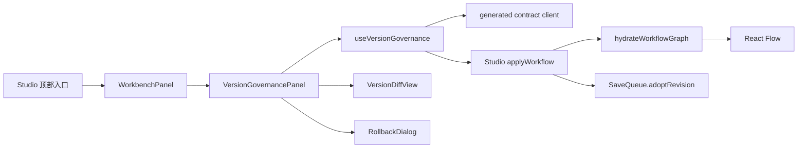

# Agent Studio v0.4-D Studio 版本治理 UI Implementation Plan

> **For agentic workers:** REQUIRED SUB-SKILL: Use superpowers:subagent-driven-development (recommended) or superpowers:executing-plans to implement this plan task-by-task. Steps use checkbox (`- [ ]`) syntax for tracking.

**Goal:** 在 Studio 聚焦式单栏工作台中交付版本历史、任意快照比较、恢复为草稿、回滚撤销和完整交互保护。

**Architecture:** 版本治理 API 状态集中在 `useVersionGovernance`，结构化差异和确认框使用纯展示组件；`StudioPage` 只负责工作台意图、保存队列边界和把服务端 Workflow 重新装载为 React Flow。画布装载抽取为独立辅助函数，回滚期间通过交互锁阻止新的草稿保存与 revision 竞争。

**Tech Stack:** React 19、TypeScript、React Router、React Flow、Vitest、Testing Library、Playwright、OpenAPI 生成类型。

**Spec:** `docs/superpowers/specs/2026-08-27-v0.4-d-version-governance-design.md`

## Global Constraints

- 本计划只能在后端/API PR 合并后执行；先 `git fetch origin --prune`，从最新 `origin/main` 创建 `codex/v0.4-d-version-governance-ui`。
- PR 2 不修改后端版本治理语义、数据库迁移或 OpenAPI；`generate:api` 必须产生零差异。
- Studio 保持画布优先和单一 `WorkbenchPanel`；不新增独立版本路由、双栏比较器或原始 JSON diff。
- 打开版本面板前必须处理未应用节点配置并 flush 保存队列。
- 回滚/撤销成功必须采用服务端返回的 revision；不得伪造或本地递增 revision。
- 回滚确认打开或提交期间画布只读，禁止产生新的 SaveQueue 请求。
- 归档工作流允许查看版本和差异，但禁止回滚和撤销。
- 秘密、定义缺失、值过大和截断状态只按 API 标志渲染，不尝试恢复隐藏值。
- 不新增 Web 依赖；复用现有 UI Token、Button、WorkbenchPanel 和测试工具。
- 每个任务遵循 RED → 最小实现 → GREEN → 小提交；PR 前执行完整回归和代码审查。

## Architecture Flow



## File Map

| 文件 | 动作 | 单一职责 |
|---|---|---|
| `apps/web/src/lib/api/client.ts` | 修改 | 导出类型和四个版本治理请求 |
| `apps/web/src/lib/api/client.test.ts` | 修改 | URL、严格请求体和 signal 契约 |
| `apps/web/src/features/studio/VersionDiffView.tsx` | 新增 | 五组差异的纯展示 |
| `apps/web/src/features/studio/VersionDiffView.test.tsx` | 新增 | 值、省略、截断、折叠和 aria |
| `apps/web/src/features/studio/useVersionGovernance.ts` | 新增 | 列表、选择、diff、rollback、undo 状态机 |
| `apps/web/src/features/studio/useVersionGovernance.test.tsx` | 新增 | 请求取消、默认选择、并发和恢复协调 |
| `apps/web/src/features/studio/RollbackDialog.tsx` | 新增 | 回滚确认、焦点和提交保护 |
| `apps/web/src/features/studio/RollbackDialog.test.tsx` | 新增 | 文案、Escape、禁用和焦点恢复 |
| `apps/web/src/features/studio/VersionGovernancePanel.tsx` | 新增 | 单栏版本列表、选择、动作和组件组合 |
| `apps/web/src/features/studio/VersionGovernancePanel.test.tsx` | 新增 | 分页、归档、动作可用性和状态提示 |
| `apps/web/src/features/studio/hydrateWorkflowGraph.ts` | 新增 | 工作流图异步解析为 React Flow |
| `apps/web/src/features/studio/hydrateWorkflowGraph.test.ts` | 新增 | 动态端口和缺失定义安全回退 |
| `apps/web/src/features/studio/useStudioWorkbench.ts` | 修改 | versions 模式和 version-history 意图 |
| `apps/web/src/features/studio/WorkbenchPanel.tsx` | 修改 | 模态期间禁止关闭 |
| `apps/web/src/features/studio/WorkbenchPanel.test.tsx` | 修改 | closeDisabled 键盘和按钮行为 |
| `apps/web/src/features/studio/WorkflowCanvas.tsx` | 修改 | 外部 fitRequest 重新适配视口 |
| `apps/web/src/features/studio/WorkflowCanvas.test.tsx` | 新增 | 回滚后 fitView 请求 |
| `apps/web/src/features/studio/StudioPage.tsx` | 修改 | 入口、保存保护、应用结果和交互锁 |
| `apps/web/src/features/studio/StudioPage.test.tsx` | 修改 | 端到端组件协作和 revision 接纳 |
| `apps/web/src/features/studio/studio.css` | 修改 | 单栏版本、差异、截断和响应式样式 |
| `apps/web/e2e/agent-studio.spec.ts` | 修改 | v1/v2/草稿、回滚、线上不变和撤销黄金路径 |
| `docs/workflow-versions.md` | 修改 | 增加 Studio 页面操作说明 |
| `README.md` | 修改 | 宣布版本治理入口已可用 |

---

### Task 1: API 类型导出和版本治理客户端

**Files:**
- Modify: `apps/web/src/lib/api/client.ts`
- Modify: `apps/web/src/lib/api/client.test.ts`

**Interfaces:**
- Consumes: 后端 PR 已生成的 `components['schemas']` 类型。
- Produces: `api.listWorkflowVersions`、`api.diffWorkflowVersions`、`api.rollbackWorkflow`、`api.undoWorkflowRollback`。

- [ ] **Step 1: 写 client RED**

增加测试：

```ts
it('版本治理客户端编码分页和严格 mutation 请求', async () => {
  fetchMock
    .mockResolvedValueOnce(jsonResponse({ items: [], nextCursor: null, rollbackCheckpoint: null }))
    .mockResolvedValueOnce(jsonResponse(emptyWorkflowDiff))
    .mockResolvedValueOnce(jsonResponse({ workflow, rollbackCheckpoint }))
    .mockResolvedValueOnce(jsonResponse(workflow))
  const controller = new AbortController()

  await api.listWorkflowVersions('w/1', { limit: 20, cursor: 'next cursor' }, controller.signal)
  await api.diffWorkflowVersions('w/1', {
    base: { kind: 'version', version: 1 },
    compare: { kind: 'draft', draftRevision: 7 },
  }, controller.signal)
  await api.rollbackWorkflow('w/1', { targetVersion: 1, expectedDraftRevision: 7 }, controller.signal)
  await api.undoWorkflowRollback('w/1', { expectedDraftRevision: 8 }, controller.signal)

  expect(fetchMock).toHaveBeenNthCalledWith(1, '/api/workflows/w%2F1/versions?limit=20&cursor=next+cursor', expect.objectContaining({ signal: controller.signal }))
  expect(fetchMock).toHaveBeenNthCalledWith(2, '/api/workflows/w%2F1/version-diffs', expect.objectContaining({ method: 'POST', body: JSON.stringify({ base: { kind: 'version', version: 1 }, compare: { kind: 'draft', draftRevision: 7 } }) }))
  expect(fetchMock).toHaveBeenNthCalledWith(3, '/api/workflows/w%2F1/rollbacks', expect.objectContaining({ method: 'POST' }))
  expect(fetchMock).toHaveBeenNthCalledWith(4, '/api/workflows/w%2F1/rollback-undo', expect.objectContaining({ method: 'POST' }))
})
```

- [ ] **Step 2: 运行 client RED**

Run:

```bash
corepack pnpm@10.34.5 --filter @agent-studio/web test --run src/lib/api/client.test.ts
```

Expected: FAIL，方法和尚未导出的类型不存在。

- [ ] **Step 3: 导出生成类型**

在 client 顶部增加：

```ts
export type WorkflowSnapshotRef = components['schemas']['WorkflowSnapshotRef']
export type WorkflowVersionSummary = components['schemas']['WorkflowVersionSummary']
export type RollbackCheckpointSummary = components['schemas']['RollbackCheckpointSummary']
export type WorkflowVersionPage = components['schemas']['WorkflowVersionPage']
export type WorkflowDiff = components['schemas']['WorkflowDiff']
export type WorkflowDiffRequest = components['schemas']['WorkflowDiffRequest']
export type WorkflowRollbackRequest = components['schemas']['WorkflowRollbackRequest']
export type WorkflowRollbackResult = components['schemas']['WorkflowRollbackResult']
export type WorkflowRollbackUndoRequest = components['schemas']['WorkflowRollbackUndoRequest']

export type WorkflowVersionQuery = { limit: number; cursor?: string }
```

- [ ] **Step 4: 实现四个客户端方法**

```ts
listWorkflowVersions: (id: string, query: WorkflowVersionQuery, signal?: AbortSignal) => {
  const params = new URLSearchParams({ limit: String(query.limit) })
  if (query.cursor) params.set('cursor', query.cursor)
  return request<WorkflowVersionPage>(`/api/workflows/${encodeURIComponent(id)}/versions?${params}`, { signal })
},
diffWorkflowVersions: (id: string, body: WorkflowDiffRequest, signal?: AbortSignal) =>
  request<WorkflowDiff>(`/api/workflows/${encodeURIComponent(id)}/version-diffs`, { method: 'POST', body: jsonBody(body), signal }),
rollbackWorkflow: (id: string, body: WorkflowRollbackRequest, signal?: AbortSignal) =>
  request<WorkflowRollbackResult>(`/api/workflows/${encodeURIComponent(id)}/rollbacks`, { method: 'POST', body: jsonBody(body), signal }),
undoWorkflowRollback: (id: string, body: WorkflowRollbackUndoRequest, signal?: AbortSignal) =>
  request<Workflow>(`/api/workflows/${encodeURIComponent(id)}/rollback-undo`, { method: 'POST', body: jsonBody(body), signal }),
```

- [ ] **Step 5: 运行 client 和 typecheck**

Run:

```bash
corepack pnpm@10.34.5 --filter @agent-studio/web test --run src/lib/api/client.test.ts
corepack pnpm@10.34.5 --filter @agent-studio/web typecheck
```

Expected: PASS。

- [ ] **Step 6: 提交 Task 1**

```bash
git add apps/web/src/lib/api/client.ts apps/web/src/lib/api/client.test.ts
git commit -m "feat: add workflow version governance client"
```

---

### Task 2: 结构化差异纯展示组件

**Files:**
- Create: `apps/web/src/features/studio/VersionDiffView.tsx`
- Create: `apps/web/src/features/studio/VersionDiffView.test.tsx`

**Interfaces:**
- Consumes: `WorkflowDiff`。
- Produces: 五个可折叠、可访问的差异分组。
- Does not: 发请求、管理版本选择或执行 mutation。

- [ ] **Step 1: 写展示 RED**

fixture 包含普通值、实际 null、secret、definition_unavailable、too_large 和 truncated。测试：

```tsx
it('按五组展示差异并且不渲染被省略的值', async () => {
  render(<VersionDiffView diff={fixtureDiff} />)
  expect(screen.getByRole('button', { name: '节点 · 2 项变化' })).toHaveAttribute('aria-expanded', 'true')
  expect(screen.getByText('模板')).toBeInTheDocument()
  expect(screen.getByText('值已变化，内容不可查看')).toBeInTheDocument()
  expect(screen.getByText('节点定义不可用，仅展示变化摘要')).toBeInTheDocument()
  expect(screen.getByText('值过大，已省略前后内容')).toBeInTheDocument()
  expect(screen.getByRole('status')).toHaveTextContent('仅展示前 500 项详细差异')
  expect(screen.queryByText('before-secret')).not.toBeInTheDocument()
  await userEvent.click(screen.getByRole('button', { name: '节点 · 2 项变化' }))
  expect(screen.getByRole('button', { name: '节点 · 2 项变化' })).toHaveAttribute('aria-expanded', 'false')
})
```

另测 added/removed、开始字段 reordered、连接四元组、页面字段中文标签、布局坐标和无差异状态。

- [ ] **Step 2: 运行展示 RED**

Run:

```bash
corepack pnpm@10.34.5 --filter @agent-studio/web test --run src/features/studio/VersionDiffView.test.tsx
```

Expected: FAIL，组件不存在。

- [ ] **Step 3: 实现固定分组和省略文案**

组件接口：

```ts
interface VersionDiffViewProps {
  diff: WorkflowDiff
}

export function VersionDiffView({ diff }: VersionDiffViewProps)
```

固定分组元数据：

```ts
const groups = [
  ['nodes', '节点'],
  ['startParameters', '开始参数'],
  ['connections', '连线'],
  ['agentPresentation', 'Agent 页面'],
  ['layout', '画布布局'],
] as const
```

默认展开有变化的第一组，其余折叠。每组 button 使用 `aria-expanded` 和 `aria-controls`。值格式化规则：字符串直接显示，其他值 `JSON.stringify(value, null, 2)`；使用 `Object.prototype.hasOwnProperty.call(change, 'before')` 和 `Object.prototype.hasOwnProperty.call(change, 'after')` 判断字段是否存在，字段缺席与实际 null 分别显示“未设置”和 `null`，不得用 `value === undefined` 猜测。

省略文案固定映射：

```ts
const omissionMessage = {
  secret: '值已变化，内容不可查看',
  definition_unavailable: '节点定义不可用，仅展示变化摘要',
  too_large: '值过大，已省略前后内容',
} as const
```

- [ ] **Step 4: 运行展示测试**

Run:

```bash
corepack pnpm@10.34.5 --filter @agent-studio/web test --run src/features/studio/VersionDiffView.test.tsx
```

Expected: PASS。

- [ ] **Step 5: 提交 Task 2**

```bash
git add apps/web/src/features/studio/VersionDiffView.tsx apps/web/src/features/studio/VersionDiffView.test.tsx
git commit -m "feat: render semantic workflow diffs"
```

---

### Task 3: 版本列表、选择、分页和过期请求状态机

**Files:**
- Create: `apps/web/src/features/studio/useVersionGovernance.ts`
- Create: `apps/web/src/features/studio/useVersionGovernance.test.tsx`

**Interfaces:**
- Produces: `useVersionGovernance(options): VersionGovernanceModel`。
- Consumes: Task 1 API client。
- Defers: rollback/undo mutation 在 Task 6 接入，但接口本任务一次定义完整。

- [ ] **Step 1: 写默认加载和选择 RED**

使用 `renderHook`：

```tsx
it('默认比较当前发布版本和精确草稿 revision', async () => {
  vi.mocked(api.listWorkflowVersions).mockResolvedValue(versionPage)
  vi.mocked(api.diffWorkflowVersions).mockResolvedValue(emptyDiff)
  const { result } = renderHook(() => useVersionGovernance({
    workflow: { ...workflow, publishedVersion: 2, draftRevision: 8 },
    saveState: 'saved', editSerial: 0, archived: false,
    onApplyWorkflow: vi.fn(), onLockChange: vi.fn(),
  }))
  await waitFor(() => expect(result.current.loading).toBe(false))
  expect(api.diffWorkflowVersions).toHaveBeenCalledWith('w1', {
    base: { kind: 'version', version: 2 },
    compare: { kind: 'draft', draftRevision: 8 },
  }, expect.any(AbortSignal))
})
```

另测未发布工作流不请求 diff、版本/版本选择、草稿 revision 更新后重取、加载更多追加且不重复。基础 mutation 测试必须证明回滚成功调用 `onApplyWorkflow` 并保存检查点、撤销成功再次应用服务端 Workflow 并清除检查点。

- [ ] **Step 2: 写取消和陈旧响应 RED**

让第一次 diff Promise 延迟，切换版本后发第二次；断言第一 signal aborted，第一响应晚到不会覆盖第二结果。unmount 时列表和 diff signal 均 aborted。

- [ ] **Step 3: 运行 hook RED**

Run:

```bash
corepack pnpm@10.34.5 --filter @agent-studio/web test --run src/features/studio/useVersionGovernance.test.tsx
```

Expected: FAIL，hook 不存在。

- [ ] **Step 4: 定义完整 hook 接口**

```ts
interface UseVersionGovernanceOptions {
  workflow: Workflow
  saveState: SaveState
  editSerial: number
  archived: boolean
  onApplyWorkflow: (workflow: Workflow) => Promise<void>
  onLockChange: (locked: boolean) => void
}

export interface VersionGovernanceModel {
  versions: WorkflowVersionSummary[]
  nextCursor?: string
  checkpoint?: RollbackCheckpointSummary
  base?: WorkflowSnapshotRef
  compare?: WorkflowSnapshotRef
  diff?: WorkflowDiff
  loading: boolean
  loadingMore: boolean
  diffLoading: boolean
  mutating: boolean
  locked: boolean
  error: string
  notice: string
  rollbackTarget?: number
  setBase: (ref: WorkflowSnapshotRef) => void
  setCompare: (ref: WorkflowSnapshotRef) => void
  loadMore: () => Promise<void>
  refresh: () => Promise<void>
  openRollback: (version: number) => void
  closeRollback: () => void
  confirmRollback: () => Promise<void>
  undoRollback: () => Promise<void>
}
```

- [ ] **Step 5: 实现只读状态流和基础 mutation**

实现初始列表、分页、默认 refs、选择和 diff。`openRollback` 设置目标并锁定交互，`closeRollback` 仅在非提交状态清除目标；`confirmRollback` 调用 `rollbackWorkflow`、等待 `onApplyWorkflow`、保存检查点和成功通知，再刷新差异；`undoRollback` 调用 Undo API、应用服务端 Workflow、清除检查点并刷新差异。mutation 必须使用当前服务端 revision，finally 中解除交互锁。

请求控制器分为 list 和 diff 两个 ref；新请求先 abort 旧请求。真实错误用 `APIError.message`，AbortError 不写 error。分页合并按版本 ID 去重并保持 version DESC。通过 effect 把 `locked` 同步给 `onLockChange`，并在 unmount 时同步 `false`，避免面板卸载后 Studio 残留只读锁。

- [ ] **Step 6: 运行 hook 测试**

Run:

```bash
corepack pnpm@10.34.5 --filter @agent-studio/web test --run src/features/studio/useVersionGovernance.test.tsx
```

Expected: PASS。

- [ ] **Step 7: 提交 Task 3**

```bash
git add apps/web/src/features/studio/useVersionGovernance.ts apps/web/src/features/studio/useVersionGovernance.test.tsx
git commit -m "feat: manage workflow version comparison state"
```

---

### Task 4: 回滚确认框和模态关闭保护

**Files:**
- Create: `apps/web/src/features/studio/RollbackDialog.tsx`
- Create: `apps/web/src/features/studio/RollbackDialog.test.tsx`
- Modify: `apps/web/src/features/studio/WorkbenchPanel.tsx`
- Modify: `apps/web/src/features/studio/WorkbenchPanel.test.tsx`

**Interfaces:**
- Produces: `RollbackDialog`。
- Changes: `WorkbenchPanel` 新增 `closeDisabled?: boolean`。
- Consumes: `WorkflowDiffSummary`。

- [ ] **Step 1: 写 RollbackDialog RED**

```tsx
it('展示目标、revision、差异计数和不影响线上说明', async () => {
  const onCancel = vi.fn()
  render(<RollbackDialog open targetVersion={1} draftRevision={8} summary={summary} submitting={false} error="" onConfirm={vi.fn()} onCancel={onCancel} />)
  const dialog = screen.getByRole('dialog', { name: '恢复 v1 为草稿？' })
  expect(dialog).toHaveTextContent('当前草稿 r8')
  expect(dialog).toHaveTextContent('自动保存一个回滚前草稿检查点')
  expect(dialog).toHaveTextContent('不会改变线上 Agent、历史版本或历史运行')
  await userEvent.keyboard('{Escape}')
  expect(onCancel).toHaveBeenCalledTimes(1)
})
```

另测 submitting 时按钮禁用、Escape 无效、取消焦点返回触发按钮、错误 role=alert。

- [ ] **Step 2: 写 Workbench closeDisabled RED**

rerender `closeDisabled=true`，断言关闭按钮 disabled，Escape 不触发 `onRequestClose`；恢复 false 后 Escape 正常关闭。

- [ ] **Step 3: 运行 RED**

Run:

```bash
corepack pnpm@10.34.5 --filter @agent-studio/web test --run src/features/studio/RollbackDialog.test.tsx src/features/studio/WorkbenchPanel.test.tsx
```

Expected: FAIL，新组件和 prop 不存在。

- [ ] **Step 4: 实现 RollbackDialog**

接口：

```ts
interface RollbackDialogProps {
  open: boolean
  targetVersion: number
  draftRevision: number
  summary: WorkflowDiffSummary
  submitting: boolean
  error: string
  onConfirm: () => void
  onCancel: () => void
}
```

使用现有 `.dialog-backdrop` 和原生 `<dialog open>`。打开时记录 activeElement 并聚焦确认按钮；关闭后恢复焦点。document capture 阶段监听 Escape：submitting 时 `preventDefault/stopPropagation`；否则调用 onCancel 并阻止事件继续到 WorkbenchPanel。

- [ ] **Step 5: 实现 Workbench closeDisabled**

```ts
interface WorkbenchPanelProps {
  titleId: string
  onRequestClose: () => void
  closeDisabled?: boolean
  children: ReactNode
}
```

关闭按钮设置 disabled；Escape effect 在 `closeDisabled` 时不调用 onRequestClose。现有调用方不传 prop，行为不变。

- [ ] **Step 6: 运行组件测试**

Run:

```bash
corepack pnpm@10.34.5 --filter @agent-studio/web test --run src/features/studio/RollbackDialog.test.tsx src/features/studio/WorkbenchPanel.test.tsx
```

Expected: PASS。

- [ ] **Step 7: 提交 Task 4**

```bash
git add apps/web/src/features/studio/RollbackDialog.tsx apps/web/src/features/studio/RollbackDialog.test.tsx apps/web/src/features/studio/WorkbenchPanel.tsx apps/web/src/features/studio/WorkbenchPanel.test.tsx
git commit -m "feat: protect workflow rollback confirmation"
```

---

### Task 5: 单栏版本治理面板组合

**Files:**
- Create: `apps/web/src/features/studio/VersionGovernancePanel.tsx`
- Create: `apps/web/src/features/studio/VersionGovernancePanel.test.tsx`

**Interfaces:**
- Consumes: Task 2 `VersionDiffView`、Task 3 hook、Task 4 `RollbackDialog`。
- Produces: Studio 可直接挂载的版本治理面板。

- [ ] **Step 1: 写面板 RED**

Mock hook 后覆盖：

```tsx
it('展示当前版本、草稿比较、分页和恢复动作', async () => {
  render(<VersionGovernancePanel {...props} />)
  expect(screen.getByRole('heading', { name: '版本历史' })).toBeInTheDocument()
  expect(screen.getByRole('option', { name: 'v2 · 当前发布' })).toBeInTheDocument()
  expect(screen.getByRole('option', { name: '当前草稿 r8' })).toBeInTheDocument()
  await userEvent.click(screen.getByRole('button', { name: '加载更多版本' }))
  expect(model.loadMore).toHaveBeenCalled()
  await userEvent.click(screen.getByRole('button', { name: '恢复 v1 为草稿' }))
  expect(model.openRollback).toHaveBeenCalledWith(1)
})
```

另测：未发布空状态、loading/error/retry、diff loading、归档提示替代恢复按钮、saveState 非 saved 时禁用恢复、无差异时禁用恢复、truncated 交给 DiffView。

- [ ] **Step 2: 运行面板 RED**

Run:

```bash
corepack pnpm@10.34.5 --filter @agent-studio/web test --run src/features/studio/VersionGovernancePanel.test.tsx
```

Expected: FAIL，面板不存在。

- [ ] **Step 3: 实现面板接口和布局**

```ts
interface VersionGovernancePanelProps extends UseVersionGovernanceOptions {
  titleId: string
}
```

渲染顺序固定为：标题/状态 → 版本时间线 → base/compare 两个 select → diff 状态/内容 → rollback/undo actions → RollbackDialog。

恢复按钮只有在以下条件同时满足时可用：

```ts
const rollbackEnabled = !archived && saveState === 'saved' && !model.diffLoading &&
  model.diff !== undefined && model.diff.summary.total > 0 &&
  model.base?.kind === 'version' && model.compare?.kind === 'draft' && !model.mutating
```

归档显示“请先恢复工作流”；检查点存在且未失效时显示“撤销回滚”。

- [ ] **Step 4: 接入 RollbackDialog**

target 只来自 `model.rollbackTarget`。传当前 workflow.draftRevision 和当前 diff.summary。confirm 调 `void model.confirmRollback()`；cancel 调 close。提交时 dialog 和面板 controls 均 disabled。

- [ ] **Step 5: 运行面板与子组件测试**

Run:

```bash
corepack pnpm@10.34.5 --filter @agent-studio/web test --run src/features/studio/VersionGovernancePanel.test.tsx src/features/studio/VersionDiffView.test.tsx src/features/studio/RollbackDialog.test.tsx
```

Expected: PASS。

- [ ] **Step 6: 提交 Task 5**

```bash
git add apps/web/src/features/studio/VersionGovernancePanel.tsx apps/web/src/features/studio/VersionGovernancePanel.test.tsx
git commit -m "feat: compose workflow version panel"
```

---

### Task 6: 网络响应恢复和编辑后撤销失效

**Files:**
- Modify: `apps/web/src/features/studio/useVersionGovernance.ts`
- Modify: `apps/web/src/features/studio/useVersionGovernance.test.tsx`

**Interfaces:**
- Enhances: Task 3 已实现的回滚与撤销 mutation。
- Calls: `onApplyWorkflow` 后才提交成功 UI 状态。
- Produces: `locked` 和 `onLockChange`，供 Studio 禁止画布编辑与关闭工作台。

- [ ] **Step 1: 写丢失响应协调 RED**

`rollbackWorkflow` 抛 TypeError；随后 `getWorkflow` 返回 revision 9，`listWorkflowVersions` 返回 checkpoint `{restoredRevision:9,restoredFromVersion:1}`。断言视为成功并调用 `onApplyWorkflow`。若 revision/checkpoint 不匹配，保留原 TypeError 对应失败消息，不猜测成功。

- [ ] **Step 2: 写撤销和编辑失效 RED**

撤销成功调用 `undoWorkflowRollback`、应用 revision 10、删除 checkpoint、notice 为“已撤销回滚”。rerender 时 `editSerial` 从 0 变 1，必须立即清除 checkpoint、隐藏 undo，并显示“草稿已修改，回滚撤销已失效”；不得自动调用 Undo API。

- [ ] **Step 3: 运行恢复与失效 RED**

Run:

```bash
corepack pnpm@10.34.5 --filter @agent-studio/web test --run src/features/studio/useVersionGovernance.test.tsx
```

Expected: FAIL，基础 mutation 尚未协调丢失响应，也没有依据 editSerial 立即失效检查点。

- [ ] **Step 4: 实现回滚响应协调**

`confirmRollback` 固定顺序：lock → POST → `onApplyWorkflow(result.workflow)` → 替换 checkpoint/notice → 更新 refs 为目标 version→新 draft revision → reload diff → unlock。

网络错误协调仅对非 `APIError`、非 AbortError 执行：

```ts
const [freshWorkflow, freshPage] = await Promise.all([
  api.getWorkflow(workflow.id, signal),
  api.listWorkflowVersions(workflow.id, { limit: 20 }, signal),
])
const accepted = freshWorkflow.draftRevision > submittedRevision &&
  freshPage.rollbackCheckpoint?.restoredRevision === freshWorkflow.draftRevision &&
  freshPage.rollbackCheckpoint.restoredFromVersion === targetVersion
```

只有 `accepted` 为 true 才应用结果。

- [ ] **Step 5: 实现撤销失效**

Undo 请求使用当前 workflow.draftRevision。成功后 apply workflow、清 checkpoint、刷新版本和 diff。记录 checkpoint 建立时的 `editSerial`；只要 prop 改变且 checkpoint 存在，立即清除本地 checkpoint。所有 mutation controller 在 unmount abort。

- [ ] **Step 6: 运行 hook 全量测试**

Run:

```bash
corepack pnpm@10.34.5 --filter @agent-studio/web test --run src/features/studio/useVersionGovernance.test.tsx
```

Expected: PASS。

- [ ] **Step 7: 提交 Task 6**

```bash
git add apps/web/src/features/studio/useVersionGovernance.ts apps/web/src/features/studio/useVersionGovernance.test.tsx
git commit -m "feat: coordinate workflow rollback and undo"
```

---

### Task 7: Studio 工作台、图装载和 revision 接纳

**Files:**
- Create: `apps/web/src/features/studio/hydrateWorkflowGraph.ts`
- Create: `apps/web/src/features/studio/hydrateWorkflowGraph.test.ts`
- Modify: `apps/web/src/features/studio/useStudioWorkbench.ts`
- Modify: `apps/web/src/features/studio/useStudioWorkbench.test.ts`
- Modify: `apps/web/src/features/studio/WorkflowCanvas.tsx`
- Create: `apps/web/src/features/studio/WorkflowCanvas.test.tsx`
- Modify: `apps/web/src/features/studio/StudioPage.tsx`
- Modify: `apps/web/src/features/studio/StudioPage.test.tsx`

**Interfaces:**
- Produces: `hydrateWorkflowGraph(workflow, definitions, resolve, signal): Promise<FlowGraph>`。
- Adds: `WorkbenchMode.kind='versions'`、`WorkbenchIntent.kind='version-history'`。
- Adds: `WorkflowCanvas.fitRequest?: number`。
- Mounts: `VersionGovernancePanel`。

- [ ] **Step 1: 写图装载 RED**

```ts
it('解析动态端口并在定义缺失时安全回退', async () => {
  const resolve = vi.fn()
    .mockResolvedValueOnce({ inputs: [{ key: 'in', title: '输入', type: 'string', cardinality: 'one' }], outputs: [] })
    .mockRejectedValueOnce(new APIError(404, 'NOT_FOUND', 'missing'))
  const flow = await hydrateWorkflowGraph(workflow, definitions, resolve, new AbortController().signal)
  expect(flow.nodes[0].data.ports.inputs[0].key).toBe('in')
  expect(flow.nodes[1].data.ports).toEqual(portsFromDefinition(flow.nodes[1].data.definition))
})
```

Helper 必须并行解析每个节点，单节点失败回退，不让整个回滚应用失败。

- [ ] **Step 2: 写 workbench 和 canvas RED**

- `request({kind:'version-history'}, false)` 进入 `{kind:'versions'}`。
- 脏 config 时 pendingIntent 保存 version-history。
- WorkflowCanvas rerender `fitRequest` 从 0 到 1 后再次调用 mock ReactFlow instance `fitView`。

- [ ] **Step 3: 写 Studio 协作 RED**

覆盖：

```tsx
it('打开版本历史前处理脏配置并等待保存队列', async () => {
  // 创建未应用节点配置，点击版本历史，先出现脏配置确认；应用后保存完成才加载版本列表。
})

it('回滚结果接纳服务端 revision 并一次性替换画布', async () => {
  // rollback 返回 r3/v1 graph；断言 SaveQueue 后续保存使用 r3、旧节点选择清除、fitRequest 推进。
})

it('回滚确认打开时画布只读且工作台不能关闭', async () => {
  // 打开确认框后拖拽/删除不触发 saveWorkflow，关闭按钮 disabled。
})
```

归档工作流的“版本历史”按钮保持可用，面板没有恢复按钮。

- [ ] **Step 4: 运行 RED**

Run:

```bash
corepack pnpm@10.34.5 --filter @agent-studio/web test --run src/features/studio/hydrateWorkflowGraph.test.ts src/features/studio/useStudioWorkbench.test.ts src/features/studio/WorkflowCanvas.test.tsx src/features/studio/StudioPage.test.tsx
```

Expected: FAIL，helper、mode、prop 和入口不存在。

- [ ] **Step 5: 实现 hydrateWorkflowGraph**

```ts
export type ResolveNodePorts = (
  type: string,
  version: string,
  config: Record<string, unknown>,
  signal: AbortSignal,
) => Promise<ResolvedPorts>

export async function hydrateWorkflowGraph(
  workflow: Workflow,
  definitions: NodeDefinition[],
  resolve: ResolveNodePorts,
  signal: AbortSignal,
): Promise<FlowGraph>
```

把 Studio 初次加载中的 `Promise.all + toFlowGraph` 移到此函数；初次加载和回滚结果都调用同一 helper。

- [ ] **Step 6: 实现工作台模式和画布重新 fit**

`WorkbenchMode` 增加 `{kind:'versions'}`，Intent 增加 `{kind:'version-history'}`，`modeForIntent` 映射到 versions。

WorkflowCanvas 保存 instance ref；`fitRequest` 改变时调用：

```ts
void instance.fitView({ padding: 0.2, maxZoom: 1.2 })
```

初次 onInit 仍只 fit 一次。

- [ ] **Step 7: 集成 StudioPage**

新增状态：

```ts
const [draftEditSerial, setDraftEditSerial] = useState(0)
const [versionLocked, setVersionLocked] = useState(false)
const [fitRequest, setFitRequest] = useState(0)
const versionButtonRef = useRef<HTMLButtonElement>(null)
```

- `commit` 在 enqueue 前推进 editSerial。
- Agent 页面配置保存成功后推进 editSerial。
- 版本入口 intent 在非归档时先 `saveQueue.flush()`，成功后进入 versions；失败显示 toolbar error。
- 离开 test 工作台时 abort run。
- versions WorkbenchPanel 传 `closeDisabled={versionLocked}` 并挂载 VersionGovernancePanel。
- `WorkflowCanvas.readOnly={archived || versionLocked}`。
- 回滚应用 callback 先 hydrate，确保 saveQueue idle 后 `adoptRevision(updated.draftRevision)`，再 setWorkflow/nodes/edges，清 events/runError，推进 fitRequest。
- 关闭 versions 后在下一 animation frame 聚焦 versionButtonRef。

- [ ] **Step 8: 运行 Studio 定向测试**

Run:

```bash
corepack pnpm@10.34.5 --filter @agent-studio/web test --run src/features/studio/hydrateWorkflowGraph.test.ts src/features/studio/useStudioWorkbench.test.ts src/features/studio/WorkflowCanvas.test.tsx src/features/studio/StudioPage.test.tsx
```

Expected: PASS。

- [ ] **Step 9: 提交 Task 7**

```bash
git add apps/web/src/features/studio/hydrateWorkflowGraph.ts apps/web/src/features/studio/hydrateWorkflowGraph.test.ts apps/web/src/features/studio/useStudioWorkbench.ts apps/web/src/features/studio/useStudioWorkbench.test.ts apps/web/src/features/studio/WorkflowCanvas.tsx apps/web/src/features/studio/WorkflowCanvas.test.tsx apps/web/src/features/studio/StudioPage.tsx apps/web/src/features/studio/StudioPage.test.tsx
git commit -m "feat: integrate version governance into studio"
```

---

### Task 8: 样式、Playwright、文档、全量验证和 PR

**Files:**
- Modify: `apps/web/src/features/studio/studio.css`
- Modify: `apps/web/e2e/agent-studio.spec.ts`
- Modify: `docs/workflow-versions.md`
- Modify: `README.md`
- Review: all files changed from `origin/main`

**Interfaces:**
- Produces: 三档响应式版本面板和完整用户黄金路径。
- Documents: 页面点击方式、撤销失效和线上不变语义。

- [ ] **Step 1: 添加单栏样式和静态规则**

样式必须覆盖：

```text
.version-governance
.version-list
.version-current-badge
.version-compare-controls
.version-diff-group
.version-diff-entry
.version-diff-values
.version-diff-omitted
.version-diff-truncated
.version-governance-actions
```

要求：320–480 px 工作台内长 path、代码和值使用 `overflow-wrap:anywhere`；diff values 使用可滚动 pre，不扩大页面；768 px 及以下沿用工作台全屏规则；颜色只使用现有 CSS variables。

- [ ] **Step 2: 扩展响应式组件测试**

在 VersionGovernancePanel 测试确认所有折叠按钮、select 和 action 有可访问名称；在 StudioPage 测试确认打开/关闭焦点返回、dialog 期间 Escape 只取消 dialog 不关闭工作台、状态/错误 role 正确。

- [ ] **Step 3: 写 Playwright 版本治理黄金路径**

新增测试 `版本比较、恢复草稿和撤销保持线上版本不变`：

1. 创建并发布 v1，模板为 `V1：{{topic}}`。
2. 修改开始字段标题、模板、Agent 页面标题并发布 v2。
3. 启动一次 v2 Agent Run，保存 runId。
4. 再把草稿模板改为 `Draft：{{topic}}` 并等待“已保存”。
5. 打开版本历史，比较 v1→v2，再比较 v1→当前草稿。
6. 断言节点、开始参数、Agent 页面分组出现变化。
7. 恢复 v1 为草稿，确认成功和撤销按钮。
8. 请求公开 Agent manifest，断言仍为 version 2；读取历史 run，断言 workflowVersionId 未变。
9. 打开模板节点，断言草稿为 v1；返回版本面板撤销，断言恢复 `Draft：{{topic}}`。
10. 再恢复 v1，修改并应用模板，断言撤销入口立即消失。

同一测试最后循环 1440、1024、768 宽度打开版本面板，断言 dialog 在 viewport 内且 `document.documentElement.scrollWidth <= window.innerWidth`。

- [ ] **Step 4: 运行 Playwright RED/GREEN**

Run:

```bash
make db-up
corepack pnpm@10.34.5 --filter @agent-studio/web exec playwright test e2e/agent-studio.spec.ts --grep '版本比较、恢复草稿和撤销'
```

Expected: PASS；失败 trace 或 screenshot 不包含秘密 fixture 值。

- [ ] **Step 5: 更新中文文档**

`docs/workflow-versions.md` 增加页面操作：顶部“版本历史” → 选择比较对象 → 展开分组 → 恢复为草稿 → 撤销。README 去掉“UI 后续交付”提示，改为已可用入口；继续明确公开 Agent 不被草稿回滚改变。

- [ ] **Step 6: 运行 Web 快速门禁**

Run:

```bash
make verify-web-quick
```

Expected: lint、typecheck、Vitest、build PASS，OpenAPI 生成零差异。

- [ ] **Step 7: 运行全量回归**

Run:

```bash
CGO_ENABLED=0 make verify
CGO_ENABLED=0 make test-e2e
CGO_ENABLED=0 make verify-release
```

Expected: 全部 PASS。

- [ ] **Step 8: 做差异与交互审查**

Run:

```bash
git diff --check origin/main...HEAD
git diff --stat origin/main...HEAD
git status --short
```

逐项确认：

- 没有修改 migration、Go API 或 OpenAPI。
- Studio 同时只打开一个 WorkbenchPanel。
- 回滚 modal 或 mutation 时画布只读。
- `SaveQueue.adoptRevision` 只接纳服务端更大 revision。
- AbortError 不显示失败，过期响应不覆盖新选择。
- 归档工作流无回滚/撤销动作。
- 没有原始 JSON diff、独立版本路由、第二批节点或 RAG。
- Critical/Important 审查问题为零。

- [ ] **Step 9: 提交样式、E2E 和文档**

```bash
git add apps/web/src/features/studio/studio.css apps/web/e2e/agent-studio.spec.ts docs/workflow-versions.md README.md
git commit -m "test: verify workflow version governance UI"
```

验证修正使用独立提交，并附对应测试。

- [ ] **Step 10: 推送并创建 PR**

```bash
git push -u origin codex/v0.4-d-version-governance-ui
gh pr create --base main --head codex/v0.4-d-version-governance-ui --title "feat: add Studio workflow version governance" --body "## Summary
- add focused version history and semantic comparison in Studio
- add guarded draft rollback, lost-response recovery, and safe undo
- preserve save queue, accessibility, responsive layout, and published Agent semantics

## Verification
- CGO_ENABLED=0 make verify
- CGO_ENABLED=0 make test-e2e
- CGO_ENABLED=0 make verify-release

## Scope
- consumes the merged version governance API
- no API, migration, raw JSON diff, published pointer switch, or local RAG changes"
```

- [ ] **Step 11: 等待 CI 和代码审查**

Run:

```bash
gh pr checks --watch
```

Expected: 全部 required checks PASS。处理审查反馈后重新运行受影响测试和完整门禁；只有用户明确同意后合并。
