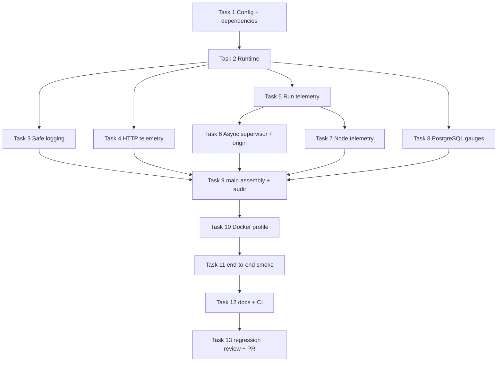

# Agent Studio v0.5-A 可观测性基线 Implementation Plan

> **For agentic workers:** REQUIRED SUB-SKILL: Use superpowers:subagent-driven-development (recommended) or superpowers:executing-plans to implement this plan task-by-task. Steps use checkbox (`- [ ]`) syntax for tracking.

**Goal:** 为 Agent Studio 建立默认关闭、可安全启用的 Metrics、Traces 与 JSON 日志关联基线，并交付可选的 Collector、Prometheus、Jaeger 本地验证栈。

**Architecture:** `main` 创建 `internal/observability.Runtime` 并把 OTel API Provider 注入 HTTP、Workflow、Supervisor、Engine 与 PostgreSQL；同步运行沿请求 Context 建立父子 Span，异步 Agent Run 从进程 Context 建立新根 Span并 Link 原请求，Node 在引擎唯一执行入口建立子 Span。应用只以 OTLP/HTTP 输出 Metrics 和 Traces，Collector 再分别路由到 Prometheus 与 Jaeger；JSON 日志保持 stdout。Endpoint 为空时使用官方 No-op Provider，不创建 Exporter 或后台任务。

**Tech Stack:** Go 1.26、Chi 5、pgxpool 5、OpenTelemetry Go API/SDK/OTLP HTTP Exporter 1.46.0、OpenTelemetry Collector Contrib 0.159.0、Prometheus 3.14.0、Jaeger 2.20.0、Docker Compose、Go testing、OTel SDK in-memory/manual test components、Shell、GitHub Actions。

**Spec:** `docs/superpowers/specs/2026-08-27-v0.5-a-observability-design.md`

## 全局约束

- 实施开始前在独立 worktree 中确认分支 `codex/v0.5-a-observability`，拉取并 rebase 最新 `origin/main`；不得在 `main` 直接开发。
- 不修改数据库结构、迁移、OpenAPI、公开 Node SDK、工作流 JSON、节点包清单或前端页面。
- 应用只导出 Metrics 与 Traces；日志继续以 JSON 写 stdout，不增加 OTLP Logs pipeline。
- `OTEL_EXPORTER_OTLP_ENDPOINT` 为空时必须是真正 No-op：不创建 exporter、不探测网络、不启动导出 goroutine。
- `OTEL_EXPORTER_OTLP_ENDPOINT` 非空但 Collector 暂时不可达时允许 API 启动；后台导出错误不得改变 HTTP、Run、Node 或持久化结果。
- 绝不把 workflow input/output、Prompt、Node config、secret、HTTP path/query/body/header、SQL、`err.Error()`、NodeError details 或 panic value写入日志、Span、Event、Metric 或 Resource。
- Metric 标签只能使用设计文档第 8 节白名单；requestId、runId、nodeId、workflowId、slug 与错误码不得成为 Metric Attribute。
- W3C 传播只启用 Trace Context，不启用 Baggage；异步 Agent Run 只复制有效 SpanContext 和 requestId，不复制请求 Context 的取消信号或业务值。
- 所有 Go 命令带 `CGO_ENABLED=0`；涉及 PostgreSQL 的回归使用 Docker 中的 PostgreSQL。
- 每项业务改动遵循红灯测试、最小实现、绿灯测试、提交的顺序；最终需代码审查、完整回归、GitHub PR，不自动合并。

## 架构与任务依赖



## 固定公共接口

后续任务必须使用以下名字，若实现中发现需要改变签名，先回到设计审查，不得在任务间各自发明替代接口。

```go
package observability

type Options struct {
	Endpoint            string
	ServiceName         string
	ServiceVersion      string
	ResourceAttributes  string
	ExportTimeout       time.Duration
	Compression         string
	MetricExportInterval time.Duration
}

type Providers struct {
	TracerProvider    trace.TracerProvider
	MeterProvider     metric.MeterProvider
	TextMapPropagator propagation.TextMapPropagator
}

var ErrInitialization = errors.New("observability initialization failed")
var ErrShutdown = errors.New("observability shutdown failed")

func New(context.Context, Options, *slog.Logger) (*Runtime, error)
func NewNoop() *Runtime
func (r *Runtime) Providers() Providers
func (r *Runtime) Shutdown(context.Context) error
func (p Providers) Tracer(string) trace.Tracer
func (p Providers) Meter(string) metric.Meter
func (p Providers) Propagator() propagation.TextMapPropagator
```

```go
package observability

type IDs struct {
	RequestID string
	RunID     string
	NodeID    string
}

type ErrorCategory string

func Log(context.Context, *slog.Logger, slog.Level, string, IDs, ...slog.Attr)
func ContextErrorCategory(error) ErrorCategory
func ContextWithRequestID(context.Context, string) context.Context
func RequestIDFromContext(context.Context) string
```

---

### Task 1: 固定 OTel 依赖并完成配置边界

**Files:**
- Modify: `go.mod`
- Modify: `go.sum`
- Modify: `apps/api/internal/config/config.go`（`Config` 与 `Load`）
- Test: `apps/api/internal/config/config_test.go`

**Interfaces:**
- `config.Config` 新增 `OTelEndpoint`、`OTelServiceName`、`OTelResourceAttributes`、`OTelExportTimeout`、`OTelCompression`、`OTelMetricExportInterval`。
- Timeout 与 Interval 的环境变量使用毫秒正整数；Endpoint 是无 userinfo/query/fragment 的 HTTP(S) base URL。

- [ ] **Step 1: 同步主线并确认隔离分支**

Run:

```bash
git status --short --branch
git fetch origin main
git rebase origin/main
git branch --show-current
```

Expected: 工作区清洁，当前分支为 `codex/v0.5-a-observability`，设计和计划提交位于最新 `origin/main` 之上。

- [ ] **Step 2: 先写配置默认值与拒绝规则测试**

在 `config_test.go` 增加 table tests，并使用 `t.Setenv` 隔离环境：

```go
func TestLoadOTelDefaults(t *testing.T) {
	t.Setenv("OTEL_EXPORTER_OTLP_ENDPOINT", "")
	t.Setenv("OTEL_SERVICE_NAME", "")
	t.Setenv("OTEL_RESOURCE_ATTRIBUTES", "")
	t.Setenv("OTEL_EXPORTER_OTLP_TIMEOUT", "")
	t.Setenv("OTEL_EXPORTER_OTLP_COMPRESSION", "")
	t.Setenv("OTEL_METRIC_EXPORT_INTERVAL", "")

	cfg, err := Load()
	if err != nil {
		t.Fatalf("Load() error = %v", err)
	}
	if cfg.OTelEndpoint != "" || cfg.OTelServiceName != "agent-studio-api" {
		t.Fatalf("unexpected OTel defaults: %#v", cfg)
	}
	if cfg.OTelExportTimeout != 5*time.Second || cfg.OTelMetricExportInterval != 10*time.Second {
		t.Fatalf("unexpected OTel durations: %#v", cfg)
	}
	if cfg.OTelCompression != "gzip" {
		t.Fatalf("OTelCompression = %q", cfg.OTelCompression)
	}
}
```

覆盖合法 path prefix、HTTP/HTTPS、`none`/`gzip`，并拒绝相对 URL、无 host、userinfo、query、fragment、不支持的 compression、零值、负值、非数字 timeout/interval。错误消息只允许包含环境变量名和规则，不允许回显环境变量值。

- [ ] **Step 3: 运行测试确认红灯**

Run:

```bash
CGO_ENABLED=0 go test ./apps/api/internal/config -run 'TestLoadOTel' -count=1
```

Expected: FAIL，原因是 `Config` 尚无 OTel 字段或非法配置未被拒绝。

- [ ] **Step 4: 实现解析和验证**

在 `config.go` 增加常量与 helper：

```go
const (
	defaultOTelServiceName          = "agent-studio-api"
	defaultOTelExportTimeoutMS      = 5000
	defaultOTelMetricIntervalMS     = 10000
	maxOTelResourceAttributeCount   = 32
	maxOTelResourceAttributeLength  = 256
)

func millisecondsEnv(key string, fallback int) (time.Duration, error) {
	value := os.Getenv(key)
	if value == "" {
		return time.Duration(fallback) * time.Millisecond, nil
	}
	parsed, err := strconv.Atoi(value)
	if err != nil || parsed <= 0 {
		return 0, fmt.Errorf("%s must be a positive integer in milliseconds", key)
	}
	return time.Duration(parsed) * time.Millisecond, nil
}
```

用 `url.ParseRequestURI` 后显式检查 `Scheme`、`Host`、`User`、`RawQuery`、`Fragment`；资源属性按逗号分项限制最多 32 项、每项最多 256 字符。Runtime 使用 `resource.WithFromEnv()` 读取同一个标准 `OTEL_RESOURCE_ATTRIBUTES`，再用 `resource.WithAttributes` 明确覆盖 `service.name` 和 `service.version`，不自行扩展资源属性语法。

- [ ] **Step 5: 固定官方依赖版本并整理模块**

Run:

```bash
go get go.opentelemetry.io/otel@v1.46.0 go.opentelemetry.io/otel/sdk@v1.46.0 go.opentelemetry.io/otel/sdk/metric@v1.46.0 go.opentelemetry.io/otel/exporters/otlp/otlptrace/otlptracehttp@v1.46.0 go.opentelemetry.io/otel/exporters/otlp/otlpmetric/otlpmetrichttp@v1.46.0
go mod tidy
CGO_ENABLED=0 go test ./apps/api/internal/config -count=1
git diff --check
```

Expected: 配置测试通过，`go.mod` 的 OTel 直接依赖均为 `v1.46.0`，无格式问题。

- [ ] **Step 6: 提交配置任务**

```bash
git add go.mod go.sum apps/api/internal/config/config.go apps/api/internal/config/config_test.go
git commit -m "feat: add observability configuration"
```

---

### Task 2: 实现 No-op 与 OTLP/HTTP Runtime 生命周期

**Files:**
- Create: `apps/api/internal/observability/runtime.go`
- Test: `apps/api/internal/observability/runtime_test.go`

**Interfaces:** 使用“固定公共接口”中的 `Options`、`Providers`、`Runtime`；内部 signal URL helper 必须为 base path 追加 `v1/traces` 或 `v1/metrics`。

- [ ] **Step 1: 写 No-op、signal URL、resource 与 Shutdown 红灯测试**

测试必须覆盖：

```go
func TestSignalURLPreservesBasePath(t *testing.T) {
	got, err := signalURL("https://collector.example/otel", "v1/traces")
	if err != nil {
		t.Fatalf("signalURL() error = %v", err)
	}
	if want := "https://collector.example/otel/v1/traces"; got != want {
		t.Fatalf("signalURL() = %q, want %q", got, want)
	}
}

func TestNewNoopProvidesSafeProviders(t *testing.T) {
	runtime := NewNoop()
	providers := runtime.Providers()
	ctx, span := providers.Tracer("test").Start(context.Background(), "noop")
	defer span.End()
	if span.SpanContext().IsValid() {
		t.Fatal("noop span must be invalid")
	}
	providers.Meter("test").Int64Counter("test.counter")
	if got := providers.Propagator().Fields(); !slices.Equal(got, []string{"traceparent", "tracestate"}) {
		t.Fatalf("propagator fields = %v", got)
	}
	if err := runtime.Shutdown(ctx); err != nil {
		t.Fatalf("Shutdown() error = %v", err)
	}
}
```

另用 injectable shutdown functions 验证并发调用 `Shutdown` 只执行一次；用 `httptest.Server` 接收 Protobuf POST，分别断言 path 为 `/base/v1/traces` 和 `/base/v1/metrics`，并确认 gzip 配置生效。测试请求内容只需确认非空，不解码业务数据。

再让测试 exporter 返回包含 endpoint、certificate path 和唯一 sentinel 的 error，断言 `New`/`Shutdown` 只返回 `ErrInitialization`/`ErrShutdown`，logger 输出不含三类敏感值。

- [ ] **Step 2: 运行测试确认红灯**

```bash
CGO_ENABLED=0 go test ./apps/api/internal/observability -count=1
```

Expected: FAIL，包或 Runtime 接口尚不存在。

- [ ] **Step 3: 实现 Provider 默认值和显式 signal URL**

`Providers` 的方法对零值接口自动回退到官方 no-op：

```go
func (p Providers) Tracer(name string) trace.Tracer {
	if p.TracerProvider == nil {
		return tracenoop.NewTracerProvider().Tracer(name)
	}
	return p.TracerProvider.Tracer(name)
}

func (p Providers) Meter(name string) metric.Meter {
	if p.MeterProvider == nil {
		return metricnoop.NewMeterProvider().Meter(name)
	}
	return p.MeterProvider.Meter(name)
}

func (p Providers) Propagator() propagation.TextMapPropagator {
	if p.TextMapPropagator == nil {
		return propagation.TraceContext{}
	}
	return p.TextMapPropagator
}
```

`signalURL` 用 `path.Join(strings.TrimSuffix(parsed.Path, "/"), signalPath)`，再把 leading slash 补回；不得依赖 `WithEndpointURL` 自动追加 signal path。

- [ ] **Step 4: 实现启用模式**

`New` 的关键顺序固定为：验证 Options → 解析 resource → 创建 trace exporter → 创建 metric exporter → 组装 Provider → 安装安全 ErrorHandler。任一中途失败必须关闭已经创建的组件。

```go
traceExporter, err := otlptracehttp.New(ctx, traceExporterOptions(options)...)
if err != nil {
	return nil, fmt.Errorf("%w: trace exporter", ErrInitialization)
}
metricExporter, err := otlpmetrichttp.New(ctx, metricExporterOptions(options)...)
if err != nil {
	_ = traceExporter.Shutdown(ctx)
	return nil, fmt.Errorf("%w: metric exporter", ErrInitialization)
}
tracerProvider := sdktrace.NewTracerProvider(
	sdktrace.WithResource(resourceValue),
	sdktrace.WithBatcher(traceExporter,
		sdktrace.WithMaxQueueSize(2048),
		sdktrace.WithBatchTimeout(5*time.Second),
		sdktrace.WithExportTimeout(options.ExportTimeout),
	),
)
reader := sdkmetric.NewPeriodicReader(metricExporter,
	sdkmetric.WithInterval(options.MetricExportInterval),
	sdkmetric.WithTimeout(options.ExportTimeout),
)
meterProvider := sdkmetric.NewMeterProvider(
	sdkmetric.WithResource(resourceValue),
	sdkmetric.WithReader(reader),
)
```

Compression 为 `gzip` 时分别追加两个 exporter 包的 `WithCompression(GzipCompression)`；`none` 不追加。TLS、headers、certificate 继续由 exporter 的标准环境变量读取，不能复制进 Options 或日志。

- [ ] **Step 5: 实现限频安全 ErrorHandler 与幂等关闭**

Handler 只按固定 reason 做进程内原子计数，并且相同 reason 每分钟最多写一条 `slog.Warn`；日志不得带原始 error，export failure 不写回同一个 MeterProvider，避免递归失败。Runtime 保存原 global handler，关闭时按 `MeterProvider → TracerProvider → restore handler` 执行一次；Provider 已拥有 exporter，正常关闭不能再直接关闭 exporter。任一步失败只返回固定 `ErrShutdown`，不得用 `errors.Join` 暴露底层错误；只有初始化中途失败才直接关闭尚未交给 Provider 的 exporter。

- [ ] **Step 6: 运行 Runtime 测试与 race 检查**

```bash
CGO_ENABLED=0 go test ./apps/api/internal/observability -count=1
CGO_ENABLED=0 go test -race ./apps/api/internal/observability -count=1
git diff --check
```

Expected: 所有测试通过，No-op 不产生 HTTP 请求，启用模式发往两个显式 signal URL，Shutdown 并发安全且只执行一次。

- [ ] **Step 7: 提交 Runtime**

```bash
git add apps/api/internal/observability/runtime.go apps/api/internal/observability/runtime_test.go
git commit -m "feat: add OpenTelemetry runtime"
```

---

### Task 3: 建立日志关联与安全错误分类

**Files:**
- Create: `apps/api/internal/observability/logging.go`
- Test: `apps/api/internal/observability/logging_test.go`

**Interfaces:** `IDs`、`ErrorCategory`、`Log`、`ContextErrorCategory` 使用固定接口；类别只允许 `validation`、`conflict`、`capacity`、`cancelled`、`timeout`、`node_execution`、`persistence`、`panic`、`internal`。

- [ ] **Step 1: 写字段省略、Trace 关联和哨兵保护红灯测试**

```go
func TestLogAddsOnlyPresentCorrelationFields(t *testing.T) {
	var output bytes.Buffer
	logger := slog.New(slog.NewJSONHandler(&output, nil))
	spanContext := trace.NewSpanContext(trace.SpanContextConfig{
		TraceID: trace.TraceID{1},
		SpanID:  trace.SpanID{2},
	})
	ctx := trace.ContextWithSpanContext(context.Background(), spanContext)
	Log(ctx, logger, slog.LevelInfo, "run completed", IDs{RequestID: "request-1", RunID: "run-1"})

	line := output.String()
	for _, required := range []string{"requestId", "traceId", "spanId", "run_id"} {
		if !strings.Contains(line, required) {
			t.Fatalf("log missing %q: %s", required, line)
		}
	}
	if strings.Contains(line, "node_id") {
		t.Fatalf("empty node ID must be omitted: %s", line)
	}
}
```

另测无效 SpanContext 不写全零 ID；`ContextWithRequestID`/`RequestIDFromContext` 只复制非空 request ID；`ContextErrorCategory` 对 `context.Canceled`、`context.DeadlineExceeded` 和未知错误分别返回 `cancelled`、`timeout`、`internal`。validation/conflict/capacity 等领域错误由所属包映射，避免 observability 反向引用 workflow 产生包循环。传入哨兵错误时输出中不得出现哨兵。

- [ ] **Step 2: 运行测试确认红灯**

```bash
CGO_ENABLED=0 go test ./apps/api/internal/observability -run 'TestLog|TestContextErrorCategory' -count=1
```

Expected: FAIL，日志 helper 尚不存在。

- [ ] **Step 3: 实现只接受结构化安全属性的 Log**

```go
func Log(ctx context.Context, logger *slog.Logger, level slog.Level, message string, ids IDs, attrs ...slog.Attr) {
	if logger == nil {
		return
	}
	fields := make([]slog.Attr, 0, len(attrs)+5)
	if ids.RequestID == "" {
		ids.RequestID = RequestIDFromContext(ctx)
	}
	if ids.RequestID != "" {
		fields = append(fields, slog.String("requestId", ids.RequestID))
	}
	if spanContext := trace.SpanContextFromContext(ctx); spanContext.IsValid() {
		fields = append(fields,
			slog.String("traceId", spanContext.TraceID().String()),
			slog.String("spanId", spanContext.SpanID().String()),
		)
	}
	if ids.RunID != "" {
		fields = append(fields, slog.String("run_id", ids.RunID))
	}
	if ids.NodeID != "" {
		fields = append(fields, slog.String("node_id", ids.NodeID))
	}
	fields = append(fields, attrs...)
	logger.LogAttrs(ctx, level, message, fields...)
}
```

调用方只能传固定枚举、布尔、数值、路由模板或已允许 ID；本 helper 不提供接收 `error` 的重载。

- [ ] **Step 4: 运行测试并提交**

```bash
CGO_ENABLED=0 go test ./apps/api/internal/observability -count=1
git diff --check
git add apps/api/internal/observability/logging.go apps/api/internal/observability/logging_test.go
git commit -m "feat: add safe telemetry logging helpers"
```

---

### Task 4: 接入 HTTP Span、Metric 与安全路由日志

**Files:**
- Create: `apps/api/internal/httpapi/telemetry.go`
- Modify: `apps/api/internal/httpapi/router.go`（`Dependencies` 与 middleware 顺序）
- Modify: `apps/api/internal/httpapi/middleware.go`（复用 response recorder 与路由模板）
- Test: `apps/api/internal/httpapi/router_test.go`
- Test: `apps/api/internal/httpapi/middleware_test.go`

**Interfaces:** `Dependencies.Telemetry observability.Providers`；middleware 顺序固定为 RequestID → Telemetry → Recover → AccessLog → CORS。

- [ ] **Step 1: 写 HTTP 父级 Span、指标标签与敏感载荷红灯测试**

用 `sdktrace.NewSimpleSpanProcessor(tracetest.NewInMemoryExporter())` 和 `sdkmetric.NewManualReader()` 构造测试 Provider。发送：

```go
request := httptest.NewRequest(http.MethodGet, "/api/workflows/secret-workflow?sentinel=query", nil)
request.Header.Set("traceparent", "00-4bf92f3577b34da6a3ce929d0e0e4736-00f067aa0ba902b7-01")
response := httptest.NewRecorder()
router.ServeHTTP(response, request)
```

断言：server span 名为 `HTTP GET /api/workflows/{id}`；parent span ID 为 header 中 ID；attributes 只有 method、route、status code；日志和 metric attributes 不含 `secret-workflow`、`sentinel`、raw path、query。另测 404 route=`unmatched`、5xx span status=Error、panic active requests 回零。

- [ ] **Step 2: 运行测试确认红灯**

```bash
CGO_ENABLED=0 go test ./apps/api/internal/httpapi -run 'TestHTTP.*Telemetry|TestAccessLog.*Route' -count=1
```

Expected: FAIL，当前 Router 没有 Telemetry，access log 仍使用 raw path。

- [ ] **Step 3: 实现单一 response recorder 与 HTTP instruments**

`telemetry.go` 定义私有 `httpTelemetry`，初始化：

```go
requests, err := meter.Int64Counter("agent_studio.http.server.requests")
duration, err := meter.Float64Histogram("agent_studio.http.server.duration", metric.WithUnit("s"))
active, err := meter.Int64UpDownCounter("agent_studio.http.server.active_requests")
```

Histogram 使用固定秒边界 `0.005, 0.01, 0.025, 0.05, 0.1, 0.25, 0.5, 1, 2.5, 5, 10, 30, 60, 120`。`status_class` 通过整数除法转换为 `2xx` 至 `5xx`，异常范围统一为 `5xx`。

- [ ] **Step 4: 实现 middleware 和传播**

Telemetry middleware 先用 `providers.Propagator().Extract` 读取 HeaderCarrier，再把 Chi RequestID 通过 `observability.ContextWithRequestID` 写入通用 Context，并以 `trace.WithSpanKind(trace.SpanKindServer)` 建 Span；handler 完成后读取 `chi.RouteContext(request.Context()).RoutePattern()`，空值设为 `unmatched`，重命名 Span并记录 Metric。Span 的 HTTP 属性固定使用 `go.opentelemetry.io/otel/semconv/v1.43.0` 中的 `HTTPRequestMethodKey`、`HTTPRouteKey`、`HTTPResponseStatusCodeKey`，不得手写过时字段。response recorder 必须由外层 Telemetry 创建并写入 Context，access log 复用同一实例，避免重复包裹破坏 `Flusher`、`Hijacker` 和 status 捕获。

- [ ] **Step 5: 治理 access log 并固定中间件顺序**

access log 用 defer 保证 panic 后仍执行，并通过 `observability.Log` 记录；字段仅含 `method`、`route`、`status`、`duration_ms`，删除 raw `path`。panic recovery 只写 `error_category=panic`，不得写 recovered value。

- [ ] **Step 6: 运行定向测试、全包测试并提交**

```bash
CGO_ENABLED=0 go test ./apps/api/internal/httpapi -count=1
CGO_ENABLED=0 go test ./apps/api/internal/httpapi -race -count=1
git diff --check
git add apps/api/internal/httpapi/telemetry.go apps/api/internal/httpapi/router.go apps/api/internal/httpapi/middleware.go apps/api/internal/httpapi/router_test.go apps/api/internal/httpapi/middleware_test.go
git commit -m "feat: instrument HTTP requests"
```

---

### Task 5: 接入同步 Workflow Run 遥测

**Files:**
- Create: `apps/api/internal/workflow/telemetry.go`
- Modify: `apps/api/internal/workflow/run_service.go`（`PreparedRun`、option、`Execute`、`logRunError`）
- Test: `apps/api/internal/workflow/run_service_test.go`

**Interfaces:** `WithRunTelemetry(observability.Providers) RunOption`；`PreparedRun` 新增三个不导出的瞬态字段 `sourceRunID`、`sourceNodeID`、`retryOfRunID`。

- [ ] **Step 1: 写同步 Parent、Run Metric 和安全错误红灯测试**

测试从有效父 Span Context 调用 `RunService.Execute`，使用最小成功图，断言 `workflow.run` span 的 Parent 等于请求 Span，属性包含 run ID/mode/status，指标只含 mode/status。再使用返回 `NodeError{Details: sentinel}` 的测试节点，断言所有 span、metric 和日志序列化结果不含 sentinel，active 回零。

Metric 读取必须按名称建立白名单：

```go
allowed := map[string]map[string]struct{}{
	"agent_studio.workflow.runs":        {"mode": {}, "status": {}},
	"agent_studio.workflow.run.duration": {"mode": {}, "status": {}},
	"agent_studio.workflow.run.active":   {"mode": {}},
}
assertMetricAttributeWhitelist(t, resourceMetrics, allowed)
```

- [ ] **Step 2: 运行测试确认红灯**

```bash
CGO_ENABLED=0 go test ./apps/api/internal/workflow -run 'TestRunService.*Telemetry|TestRunService.*Sentinel' -count=1
```

Expected: FAIL，RunService 尚未创建 Span/Metric，错误日志仍可能包含 details。

- [ ] **Step 3: 实现 runTelemetry**

创建 `workflow.runs` Counter、`workflow.run.duration` Histogram 和 `workflow.run.active` UpDownCounter；run histogram 使用 HTTP 相同边界。`start` 返回带 Span 的 context 和只执行一次的 finish closure：

```go
runContext, span := telemetry.tracer.Start(ctx, "workflow.run")
telemetry.active.Add(runContext, 1, metric.WithAttributes(modeAttribute))
startedAt := time.Now()
var once sync.Once
finish := func(status string, category observability.ErrorCategory) {
	once.Do(func() {
		attributes := []attribute.KeyValue{modeAttribute, attribute.String("status", status)}
		telemetry.active.Add(runContext, -1, metric.WithAttributes(modeAttribute))
		telemetry.runs.Add(runContext, 1, metric.WithAttributes(attributes...))
		telemetry.duration.Record(runContext, time.Since(startedAt).Seconds(), metric.WithAttributes(attributes...))
		if category != "" {
			span.SetStatus(codes.Error, string(category))
		}
		span.End()
	})
}
```

Run ID、mode 与 retry/rerun 来源的 Span attribute key 固定为 `agent_studio.run.id`、`agent_studio.run.mode`、`agent_studio.run.retry_of_id`、`agent_studio.run.source_id`、`agent_studio.run.source_node_id`；这些 ID 不放 Metric。

- [ ] **Step 4: 在 Execute 最外层平衡完成路径并治理日志**

Run Span 包住持久化、引擎执行和终态写入；所有 return 通过命名结果或统一 defer 确定 status/category。`logRunError` 改为接受 Context，使用 `observability.Log`，删除 `error_details`、raw cause 和 `err.Error()`，只保留 run/node ID、error code 的安全映射类别。

- [ ] **Step 5: 运行回归并提交**

```bash
CGO_ENABLED=0 go test ./apps/api/internal/workflow -run 'TestRunService' -count=1
CGO_ENABLED=0 go test ./apps/api/internal/workflow -count=1
git diff --check
git add apps/api/internal/workflow/telemetry.go apps/api/internal/workflow/run_service.go apps/api/internal/workflow/run_service_test.go
git commit -m "feat: instrument workflow runs"
```

---

### Task 6: 实现异步新根 Span、Link、准入与来源 ID

**Files:**
- Modify: `apps/api/internal/workflow/agent_runs.go`（Reservation 接口和 Launch 调用）
- Modify: `apps/api/internal/workflow/agent_runs_test.go`
- Modify: `apps/api/internal/workflow/agent_run_supervisor.go`
- Modify: `apps/api/internal/workflow/agent_run_supervisor_test.go`
- Modify: `apps/api/internal/workflow/run_management.go`
- Modify: `apps/api/internal/workflow/run_management_test.go`
- Modify: `apps/api/internal/workflow/debug_rerun.go`
- Modify: `apps/api/internal/workflow/debug_rerun_test.go`

**Interfaces:** `AgentRunReservation.Launch(context.Context, *PreparedRun)`；Supervisor option `WithAgentRunSupervisorTelemetry(observability.Providers)`。

- [ ] **Step 1: 写异步 root/link 与 Context 隔离红灯测试**

从带父 Span、requestId、业务 sentinel value 和可取消 Context 调用 `AgentRunService.Start`。捕获 executor 收到的 Context，断言：

- Run span Parent 为空；
- 恰有一个 Link，Link SpanContext 等于请求 Span；
- executor Context 不含 sentinel value，取消 HTTP Context 不会取消 Run；
- `BeginShutdown` 会取消 Run；
- 日志仍可关联复制的 requestId，但不含 sentinel。

- [ ] **Step 2: 写准入、active 与 panic 平衡红灯测试**

分别覆盖 accepted、capacity、unavailable；accepted 时 active 加一，在成功、executor error、panic 和显式 `Release` 后减一。panic 日志只出现 `error_category=panic`，不出现 panic sentinel。

- [ ] **Step 3: 写 retry/rerun 瞬态来源红灯测试**

`PrepareRetry` 断言 `prepared.retryOfRunID` 等于原 run ID；`PrepareRerun` 断言 `sourceRunID` 和 `sourceNodeID` 正确；序列化 `PreparedRun` 的现有持久化载荷时不出现这些瞬态字段。

- [ ] **Step 4: 运行测试确认红灯**

```bash
CGO_ENABLED=0 go test ./apps/api/internal/workflow -run 'TestAgentRun.*Telemetry|TestAgentRun.*Panic|TestPrepareRetry.*Source|TestPrepareRerun.*Source' -count=1
```

Expected: FAIL，Launch 签名、Link、准入指标和瞬态来源尚未实现。

- [ ] **Step 5: 实现私有 origin 与 Launch 隔离**

`workflow/telemetry.go` 增加私有 Context value：

```go
type runOrigin struct {
	spanContext trace.SpanContext
	requestID   string
}

type runOriginContextKey struct{}

func contextWithRunOrigin(ctx context.Context, origin runOrigin) context.Context {
	return context.WithValue(ctx, runOriginContextKey{}, origin)
}
```

`Launch(requestContext, prepared)` 在启动 goroutine 前只用 OTel API 提取有效 SpanContext，并通过 `observability.RequestIDFromContext` 提取通用 request ID；Workflow/Supervisor 包不得导入 Chi。goroutine 从 `supervisor.context` 派生 origin context，并用 `observability.ContextWithRequestID` 恢复复制的 request ID 后再写入私有 origin。Run telemetry 发现 origin 后用 `trace.WithNewRoot()` 和单个 `trace.WithLinks(trace.Link{SpanContext: origin.spanContext})`；无 origin 时保持现有同步 parent 规则。

- [ ] **Step 6: 实现准入与 panic 指标平衡**

`Reserve` 在锁内记录 `agent_studio.agent_run.admissions`，result 只允许 accepted/capacity/unavailable；只有 accepted 才给 `agent_studio.agent_run.active` 加一。`release` 通过 reservation `sync.Once` 保证 active -1、channel receive、WaitGroup Done 各执行一次。panic defer 最先安装，只给 `agent_studio.runtime.events` 记录 `component=agent_run,reason=panic` 和安全日志，不写 recovered value。

- [ ] **Step 7: 填充 retry/rerun 来源并跑完整 workflow 测试**

`PrepareRetry`、`PrepareRerun` 在返回前赋值三个私有字段；不修改 domain struct、API response 或 store 参数。

```bash
CGO_ENABLED=0 go test ./apps/api/internal/workflow -count=1
CGO_ENABLED=0 go test -race ./apps/api/internal/workflow -count=1
git diff --check
git add apps/api/internal/workflow/agent_runs.go apps/api/internal/workflow/agent_runs_test.go apps/api/internal/workflow/agent_run_supervisor.go apps/api/internal/workflow/agent_run_supervisor_test.go apps/api/internal/workflow/run_management.go apps/api/internal/workflow/run_management_test.go apps/api/internal/workflow/debug_rerun.go apps/api/internal/workflow/debug_rerun_test.go apps/api/internal/workflow/telemetry.go
git commit -m "feat: trace asynchronous agent runs"
```

---

### Task 7: 在引擎唯一执行入口接入 Node 遥测

**Files:**
- Create: `apps/api/internal/engine/telemetry.go`
- Modify: `apps/api/internal/engine/engine.go`（`Options.Telemetry` 与字段）
- Modify: `apps/api/internal/engine/plan.go`（缓存 `ExecutionSafety`）
- Modify: `apps/api/internal/engine/compiler.go`（从 normalized definition 填充）
- Modify: `apps/api/internal/engine/scheduler.go`（`executeNode`）
- Modify: `apps/api/internal/engine/engine_test.go`
- Modify: `apps/api/internal/engine/scheduler_test.go`
- Modify: `apps/api/internal/engine/compiler_test.go`

**Interfaces:** `engine.Options.Telemetry observability.Providers`；`CompiledNode.ExecutionSafety agentnode.ExecutionSafety`。

- [ ] **Step 1: 写编译缓存、父子关系、白名单和 active 平衡红灯测试**

编译测试断言 `CompiledNode.ExecutionSafety` 来自 `executor.Definition().ExecutionSafety`。执行测试从 run span 调用 Engine，断言每个节点产生一个 `workflow.node` child span；span 包含 node ID/type/version/safety/status，metric 只包含 node_type/status/execution_safety/error_category 白名单。成功、失败、timeout、cancel、panic 路径都不泄漏输入、配置、错误详情或 panic sentinel。

- [ ] **Step 2: 运行测试确认红灯**

```bash
CGO_ENABLED=0 go test ./apps/api/internal/engine -run 'TestCompiler.*ExecutionSafety|TestEngine.*Telemetry|TestExecuteNode.*Telemetry' -count=1
```

Expected: FAIL，CompiledNode 和 Engine 尚无 Telemetry。

- [ ] **Step 3: 缓存低基数定义并初始化 instruments**

Compiler 在 executor/config/ports 验证成功后取一次 normalized definition：

```go
definition := executor.Definition()
compiledNodes[nodeID] = CompiledNode{
	Node:            node,
	Executor:        executor,
	Ports:           ports,
	ExecutionSafety: definition.ExecutionSafety,
}
```

创建 `agent_studio.workflow.node.executions` Counter、`agent_studio.workflow.node.duration` Histogram、`agent_studio.workflow.node.failures` Counter；duration 边界与 Run 相同。

- [ ] **Step 4: 在 executeNode 唯一入口开始和结束 Span**

保持公开 Node SDK 不变。执行器收到的是由 `tracer.Start(runContext, "workflow.node")` 返回的 Context。失败只设置安全 `codes.Error` 和固定类别；禁止调用 `span.RecordError(err)`。Metric 的 `node_type` 只来自注册表 definition，version 与 node ID 只进入 Span。

- [ ] **Step 5: 运行引擎测试与提交**

```bash
CGO_ENABLED=0 go test ./apps/api/internal/engine -count=1
CGO_ENABLED=0 go test -race ./apps/api/internal/engine -count=1
git diff --check
git add apps/api/internal/engine/telemetry.go apps/api/internal/engine/engine.go apps/api/internal/engine/plan.go apps/api/internal/engine/compiler.go apps/api/internal/engine/scheduler.go apps/api/internal/engine/engine_test.go apps/api/internal/engine/scheduler_test.go apps/api/internal/engine/compiler_test.go
git commit -m "feat: instrument workflow nodes"
```

---

### Task 8: 导出 PostgreSQL 连接池 Gauge

**Files:**
- Create: `apps/api/internal/store/postgres/metrics.go`
- Create: `apps/api/internal/store/postgres/metrics_test.go`
- Modify: `apps/api/internal/store/postgres/store.go`（注册入口或 pool source 暴露）

**Interfaces:** `func (store *Store) RegisterPoolMetrics(observability.Providers) (metric.Registration, error)`；私有 `poolSnapshot` 接口只暴露 `MaxConns()`、`AcquiredConns()`、`IdleConns()`，私有 `poolStatsSource.Snapshot()` 通过 adapter 包装 `pgxpool.Pool.Stat()`。

- [ ] **Step 1: 写三状态映射、注销和标签白名单红灯测试**

使用固定 fake source 返回 max=12、acquired=3、idle=7，通过 ManualReader 收集后断言单一 metric `agent_studio.postgres.pool.connections` 有 `state=max/acquired/idle` 三个点和值。调用 Registration.Unregister 后再次 collect，不再产生该 callback 的点。

- [ ] **Step 2: 运行测试确认红灯**

```bash
CGO_ENABLED=0 go test ./apps/api/internal/store/postgres -run 'TestRegisterPoolMetrics' -count=1
```

Expected: FAIL，metrics 文件和注册接口不存在。

- [ ] **Step 3: 实现 callback gauge**

```go
meter := providers.Meter("agent-studio/postgres")
gauge, err := meter.Int64ObservableGauge("agent_studio.postgres.pool.connections")
if err != nil {
	return nil, fmt.Errorf("create postgres pool gauge: %w", err)
}
return meter.RegisterCallback(func(_ context.Context, observer metric.Observer) error {
	stats := source.Snapshot()
	observer.ObserveInt64(gauge, int64(stats.MaxConns()), metric.WithAttributes(attribute.String("state", "max")))
	observer.ObserveInt64(gauge, int64(stats.AcquiredConns()), metric.WithAttributes(attribute.String("state", "acquired")))
	observer.ObserveInt64(gauge, int64(stats.IdleConns()), metric.WithAttributes(attribute.String("state", "idle")))
	return nil
}, gauge)
```

实现 `pgxPoolStatsSource{pool *pgxpool.Pool}` adapter，其 `Snapshot() poolSnapshot` 返回 `pool.Stat()`；测试 fake 直接实现 `Snapshot()`。不得把 `*pgxpool.Stat` 暴露到其他包。

- [ ] **Step 4: 运行测试并提交**

```bash
CGO_ENABLED=0 go test ./apps/api/internal/store/postgres -count=1
git diff --check
git add apps/api/internal/store/postgres/metrics.go apps/api/internal/store/postgres/metrics_test.go apps/api/internal/store/postgres/store.go
git commit -m "feat: expose postgres pool metrics"
```

---

### Task 9: 完成 main 装配、关闭边界与剩余日志审计

**Files:**
- Modify: `apps/api/cmd/server/main.go`
- Modify: `apps/api/cmd/server/main_test.go`
- Modify: `apps/api/internal/workflow/run_coordinator.go`
- Modify: `apps/api/internal/workflow/run_coordinator_test.go`

**Interfaces:** Runtime 在 Config 之后、Store 之前创建；Telemetry shutdown 在业务关闭和 pool metric 注销之后、Store Close 之前执行，独立 5 秒 Context。

- [ ] **Step 1: 写装配注入和关闭顺序红灯测试**

把 `shutdownRuntime` 依赖抽成最小私有接口和可注入时钟/context factory。记录调用序列并断言：

```go
want := []string{
	"agent-runs-begin-shutdown",
	"coordinator-stop",
	"http-shutdown",
	"agent-runs-wait",
	"pool-metrics-unregister",
	"telemetry-shutdown",
	"store-close",
}
```

另测 telemetry shutdown 卡住时最多使用独立 5 秒 Context，返回只记 `component=telemetry,reason=shutdown`，不回显底层 sentinel error。启动在 Store 创建失败时仍会关闭 Runtime 一次。

- [ ] **Step 2: 写 Coordinator 日志安全红灯测试**

让 store 返回包含数据库 URL、SQL 和 sentinel 的 error，断言 JSON 日志只含 `error_category=persistence` 与允许 ID，不含原始 error。

- [ ] **Step 3: 运行测试确认红灯**

```bash
CGO_ENABLED=0 go test ./apps/api/cmd/server ./apps/api/internal/workflow -run 'Test.*Shutdown|Test.*Assembly|TestRunCoordinator.*Log' -count=1
```

Expected: FAIL，Runtime 尚未装配，关闭序列和 Coordinator 日志不满足规则。

- [ ] **Step 4: 装配 Runtime 与所有 Provider**

`main` 顺序：Load Config → `observability.New` → store.New → RegisterPoolMetrics → registry → engine → services/supervisor → router。Options 中 `ServiceVersion` 使用现有构建版本变量；不得把 DatabaseURL、OpenAI key 或标准 OTel header 传入 Runtime。

把同一个 `providers := runtime.Providers()` 注入：

- `engine.Options.Telemetry`；
- `workflow.WithRunTelemetry`；
- `workflow.WithAgentRunSupervisorTelemetry`；
- `httpapi.Dependencies.Telemetry`；
- `store.RegisterPoolMetrics`。

- [ ] **Step 5: 实现幂等 fallback defer 与正式关闭**

Runtime 创建成功后立即 defer 一个 5 秒 fallback shutdown；正常路径在业务 shutdown 后显式调用相同 Runtime。Runtime 自身 `sync.Once` 保证只执行一次，因此启动中途失败和正常退出都覆盖。Pool Registration 在 Store Close 前注销。

- [ ] **Step 6: 审计本阶段所有日志调用点**

Run:

```bash
rg -n 'logger\.(Debug|Info|Warn|Error)|slog\.(Debug|Info|Warn|Error)' apps/api/cmd/server apps/api/internal/httpapi apps/api/internal/workflow apps/api/internal/engine apps/api/internal/store/postgres
rg -n 'error_details|"panic"|request\.URL\.Path|err\.Error\(\)' apps/api/cmd/server apps/api/internal/httpapi apps/api/internal/workflow apps/api/internal/engine apps/api/internal/store/postgres
```

Expected: 每个命中都人工判定；业务日志不得输出禁止字段，剩余 `err.Error()` 只能用于内部 error return 或测试断言，不能作为 slog attr/message。

- [ ] **Step 7: 运行 Go 快速回归并提交**

```bash
CGO_ENABLED=0 make verify-go-quick
git diff --check
git add apps/api/cmd/server/main.go apps/api/cmd/server/main_test.go apps/api/internal/workflow/run_coordinator.go apps/api/internal/workflow/run_coordinator_test.go
git commit -m "feat: wire observability runtime"
```

---

### Task 10: 建立可选 Docker Observability Profile

**Files:**
- Create: `deploy/observability/otel-collector.yaml`
- Create: `deploy/observability/prometheus.yaml`
- Create: `scripts/check-observability-compose.sh`
- Create: `scripts/wait-observability.sh`
- Modify: `compose.yaml`
- Modify: `Makefile`

**Interfaces:** 服务名固定为 `otel-collector`、`prometheus`、`jaeger`；Profile 固定 `observability`；localhost 端口固定 4318、13133、9090、16686。

- [ ] **Step 1: 先写静态 Compose 契约脚本**

`scripts/check-observability-compose.sh` 使用 `docker compose --profile observability config --format json` 与 Ruby JSON parser 断言：

- 三个服务存在且都有 `observability` profile；
- 三个镜像精确为 `otel/opentelemetry-collector-contrib:0.159.0`、`prom/prometheus:v3.14.0`、`cr.jaegertracing.io/jaegertracing/jaeger:2.20.0`；
- host published address 都是 `127.0.0.1`；
- `db` 不在三个服务的 `depends_on` 中，三个服务也不挂载 `agent_pg_data`；
- Collector 配置不存在 `logs` pipeline；
- Collector 镜像执行 `validate --config=/etc/otelcol-contrib/config.yaml` 成功。

- [ ] **Step 2: 运行契约脚本确认红灯**

```bash
sh scripts/check-observability-compose.sh
```

Expected: FAIL，服务和配置尚不存在。

- [ ] **Step 3: 写 Collector、Prometheus 配置与宿主机健康等待**

Collector pipeline 固定为：

```yaml
extensions:
  health_check:
    endpoint: 0.0.0.0:13133
receivers:
  otlp:
    protocols:
      http:
        endpoint: 0.0.0.0:4318
processors:
  memory_limiter:
    check_interval: 1s
    limit_mib: 128
    spike_limit_mib: 32
  batch:
    send_batch_size: 512
    timeout: 1s
exporters:
  prometheus:
    endpoint: 0.0.0.0:8889
    enable_open_metrics: true
  otlp/jaeger:
    endpoint: jaeger:4317
    tls:
      insecure: true
service:
  extensions: [health_check]
  pipelines:
    metrics:
      receivers: [otlp]
      processors: [memory_limiter, batch]
      exporters: [prometheus]
    traces:
      receivers: [otlp]
      processors: [memory_limiter, batch]
      exporters: [otlp/jaeger]
```

Prometheus 只抓 `otel-collector:8889`，scrape interval 为 5 秒。`scripts/wait-observability.sh` 在宿主机分别轮询 Collector `http://127.0.0.1:13133/`、Prometheus `http://127.0.0.1:9090/-/ready`、Jaeger `http://127.0.0.1:16686/api/services`，每个服务最长等待 60 秒。等待不依赖镜像内是否携带 curl/wget，超时只输出服务名和固定 reason，再打印对应容器最近 100 行日志供本地诊断。

- [ ] **Step 4: 修改 Compose 与 Makefile**

三服务都设置 `profiles: [observability]`、只读 config mount、restart policy `unless-stopped` 和明确 healthcheck。Make targets：

```make
observability-up:
	docker compose --profile observability up -d otel-collector prometheus jaeger
	sh scripts/wait-observability.sh

observability-down:
	docker compose --profile observability stop otel-collector prometheus jaeger

observability-check:
	sh scripts/check-observability-compose.sh
```

`observability-down` 禁止使用 `docker compose down`，保证 db 与 volume 不受影响。

- [ ] **Step 5: 运行静态验证并提交**

```bash
sh scripts/check-observability-compose.sh
sh -n scripts/wait-observability.sh
docker compose config --quiet
git diff --check
git add deploy/observability/otel-collector.yaml deploy/observability/prometheus.yaml scripts/check-observability-compose.sh scripts/wait-observability.sh compose.yaml Makefile
git commit -m "feat: add local observability stack"
```

---

### Task 11: 实现真实 API、Prometheus、Jaeger 冒烟

**Files:**
- Create: `scripts/verify-observability.sh`
- Modify: `Makefile`

**Interfaces:** `make observability-verify` 负责临时启动 API 并查询两类后端；退出时停止 API 和三个 observability 服务，但保持 db 运行。

- [ ] **Step 1: 写冒烟脚本的失败断言和清理框架**

脚本使用 `set -eu`、`mktemp -d`、显式 PID 和 trap。所有 JSON 构造/解析使用 `ruby -rjson`，不引入 jq。trap 只执行：终止本脚本启动的 API、删除临时目录、`make observability-down`；不得执行 `db-down` 或删除 volume。

- [ ] **Step 2: 运行目标确认红灯**

```bash
make observability-verify
```

Expected: FAIL，验证脚本或 Make target 尚未完整实现。

- [ ] **Step 3: 实现成功与失败 Run 数据准备**

脚本先 `make db-up`、`make observability-up`，然后用这些环境变量启动 API：

```bash
HTTP_ADDR=127.0.0.1:18080 \
OTEL_EXPORTER_OTLP_ENDPOINT=http://127.0.0.1:4318 \
OTEL_SERVICE_NAME=agent-studio-observability-smoke \
OTEL_METRIC_EXPORT_INTERVAL=1000 \
OTEL_EXPORTER_OTLP_TIMEOUT=1000 \
CGO_ENABLED=0 go run ./apps/api/cmd/server
```

通过现有 `/api/workflows`、保存草稿、`/test-runs` API 创建并运行 start→code→end 图。成功图 code 返回固定非敏感结果；失败图执行 Starlark `fail("observability-sensitive-sentinel")`。脚本必须从 API response 取 workflow/run ID，不能假设数据库 ID。

- [ ] **Step 4: 查询 Prometheus 与 Jaeger 并做哨兵断言**

轮询最长 60 秒：

- Prometheus `/api/v1/query` 查询 `agent_studio_workflow_runs_total` 与 `agent_studio_http_server_requests_total`；
- Jaeger `/api/services` 找到 `agent-studio-observability-smoke`，再从 `/api/traces?service=...` 检查 `HTTP POST`、`workflow.run`、`workflow.node`；
- API JSON log、Prometheus response、Jaeger response 都不得包含 `observability-sensitive-sentinel`。

随后停止 Collector，再执行一次成功 test run，HTTP 仍必须成功；最后运行 `docker compose ps --status running db` 确认 db 仍运行。

- [ ] **Step 5: 连续运行两次验证清理幂等性**

```bash
make observability-verify
make observability-verify
docker compose ps --status running db
git diff --check
```

Expected: 两次均通过，第二次不受残留进程/容器影响，db 持续运行。

- [ ] **Step 6: 提交冒烟脚本**

```bash
git add scripts/verify-observability.sh Makefile
git commit -m "test: add observability smoke verification"
```

---

### Task 12: 完成环境示例、中文文档与 CI 配置门禁

**Files:**
- Modify: `.env.example`
- Modify: `README.md`
- Create: `docs/observability.md`
- Modify: `.github/workflows/ci.yml`

**Interfaces:** CI 只做 Compose 展开和 Collector `validate`，不在共享 runner 启动完整观测栈；真实冒烟保留为本地/发布前门禁。

- [ ] **Step 1: 写文档验收清单**

文档必须包含：默认关闭、六个基础环境变量、标准 header/certificate 环境变量边界、`make observability-up/down/verify`、Prometheus/Jaeger 地址、无业务载荷规则、Collector 不可达语义、5 秒关闭语义、生产 TLS/认证/HA/保留期责任、采样后续项。

- [ ] **Step 2: 更新 `.env.example`**

追加并保持默认禁用：

```dotenv
OTEL_EXPORTER_OTLP_ENDPOINT=
OTEL_SERVICE_NAME=agent-studio-api
OTEL_RESOURCE_ATTRIBUTES=deployment.environment=local
OTEL_EXPORTER_OTLP_TIMEOUT=5000
OTEL_EXPORTER_OTLP_COMPRESSION=gzip
OTEL_METRIC_EXPORT_INTERVAL=10000
```

- [ ] **Step 3: 编写中文运行手册和 README 入口**

手册给出本机查询步骤和故障矩阵。不得把示例 token、header 或数据库凭据写入命令；认证示例只写环境变量名，不写值。README 只保留简短启用入口并链接手册。

- [ ] **Step 4: 增加 CI 静态配置 Job**

在 `.github/workflows/ci.yml` 增加独立 `observability-config` job，checkout 后运行：

```bash
sh scripts/check-observability-compose.sh
```

该 job 不依赖 db、不运行 API、不 publish image。

- [ ] **Step 5: 验证文档与 CI 并提交**

```bash
sh scripts/check-observability-compose.sh
CGO_ENABLED=0 go run github.com/rhysd/actionlint/cmd/actionlint@v1.7.12
rg -n 'OTEL_EXPORTER_OTLP_ENDPOINT|observability-verify|127\.0\.0\.1:16686|127\.0\.0\.1:9090' .env.example README.md docs/observability.md Makefile
git diff --check
git add .env.example README.md docs/observability.md .github/workflows/ci.yml
git commit -m "docs: add observability operations guide"
```

---

### Task 13: 规格覆盖、全量回归、独立审查与 PR

**Files:**
- Review: 本分支相对 `origin/main` 的全部文件
- Update only if findings require: 本计划列出的已有文件

- [ ] **Step 1: 做禁止范围与敏感字段静态审计**

```bash
git diff --name-only origin/main...HEAD
git diff --stat origin/main...HEAD
rg -n 'error_details|RecordError\(|request\.URL\.(Path|RawQuery)|"panic"\s*,|OTEL_EXPORTER_OTLP_HEADERS|DATABASE_URL' apps/api/internal/observability apps/api/internal/httpapi apps/api/internal/workflow apps/api/internal/engine apps/api/internal/store/postgres apps/api/cmd/server
```

Expected: diff 不含 migrations、contracts、Node SDK、前端文件；每个搜索命中都有明确安全理由，日志/Span/Metric 不含禁止数据。

- [ ] **Step 2: 运行 Go 与 Web 完整回归**

```bash
CGO_ENABLED=0 make verify
CGO_ENABLED=0 make test-sdk-e2e
make test-e2e
make observability-verify
```

Expected: Docker PostgreSQL 启动，Go test/vet、生成物检查、49 个 Web test files、281 项 Web tests、生产 build、SDK E2E、Playwright E2E 与 observability smoke 全部通过。若主线测试数量已增长，以零失败为准并在 PR 写实际数量。

- [ ] **Step 3: 按验证技能保存新鲜证据**

```bash
git status --short
git diff --check origin/main...HEAD
git log --oneline origin/main..HEAD
```

Expected: 仅有预期提交，工作区清洁，无 whitespace error。

- [ ] **Step 4: 使用代码审查技能做独立审查**

必须调用 `superpowers:requesting-code-review`。审查范围：spec 全覆盖、Context 生命周期、active 指标平衡、Metric 基数、隐私哨兵、Exporter 故障隔离、Shutdown 顺序、Compose 不影响 db。Critical 和 Important 发现全部修复后，重新运行相关定向测试及 Step 2 全量命令。

- [ ] **Step 5: 推送并创建 GitHub PR**

```bash
git push -u origin codex/v0.5-a-observability
gh pr create --base main --head codex/v0.5-a-observability --title "feat: add v0.5-a observability baseline" --body-file /tmp/agent-studio-v0.5-a-pr.md
gh pr checks --watch
```

PR 描述必须列出：架构边界、配置开关、指标/链路、数据安全、Docker Profile、实际验证命令与结果、Collector 不可达测试、无 schema/API/frontend 变更。创建 PR 后等待用户批准，不自动合并。

## 规格覆盖自检表

| 设计要求 | 实施任务 | 验收证据 |
|---|---|---|
| Config、No-op、OTLP/HTTP、Resource、ErrorHandler、Shutdown | Tasks 1–2 | config/runtime 单测与 httptest exporter |
| W3C Trace Context、HTTP route template、HTTP Metrics | Task 4 | in-memory span、manual metric、404/panic tests |
| 同步 Run Parent、错误安全、Run Metrics | Task 5 | RunService 成功/失败/取消 tests |
| 异步新 Root + Link、准入、panic、来源 ID | Task 6 | supervisor/context/retry/rerun tests |
| Node child Span、低基数 safety、失败保护 | Task 7 | compiler/engine/scheduler tests |
| pgxpool max/acquired/idle | Task 8 | callback + unregister tests |
| 初始化和 5 秒关闭、全域日志治理 | Task 9 | main sequence、sentinel log tests |
| 可选 Profile、固定镜像、无 Logs pipeline | Task 10 | compose JSON + collector validate |
| Prometheus/Jaeger 真实查询、Collector 故障隔离 | Task 11 | `make observability-verify` 两次 |
| 中文文档、默认关闭、CI 门禁 | Task 12 | docs grep + actionlint + config check |
| 全量回归、代码审查、PR | Task 13 | verify/E2E/smoke/review/PR checks |

## 官方版本依据

- [OpenTelemetry Go Releases](https://github.com/open-telemetry/opentelemetry-go/releases)
- [OpenTelemetry Collector Release Schedule](https://github.com/open-telemetry/opentelemetry-collector/blob/main/docs/release.md)
- [Prometheus Releases](https://github.com/prometheus/prometheus/releases)
- [Jaeger 2.20 Getting Started](https://www.jaegertracing.io/docs/2.20/getting-started/)

实施锁定版本是在 2026-08-27 核验到的稳定发布版本。依赖升级属于单独变更，不能在本阶段开发中漂移。
