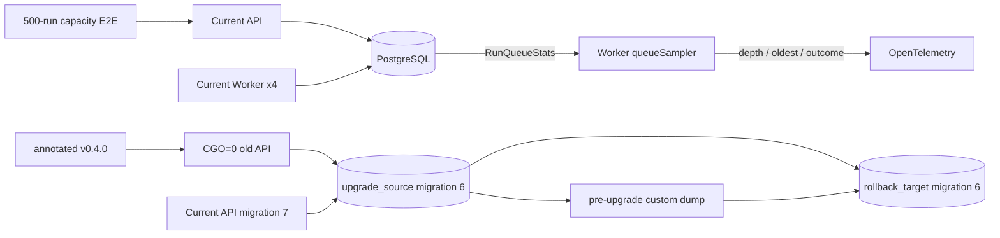

# v0.5.0-rc.1 PR1 稳定性加固实施计划

> **For agentic workers:** REQUIRED SUB-SKILL: Use superpowers:subagent-driven-development (recommended) or superpowers:executing-plans to implement this plan task-by-task. Steps use checkbox (`- [ ]`) syntax for tracking.

**Goal:** 为 `v0.5.0-rc.1` 建立独立队列指标采样、500 次 Mock 运行的 10 分钟轻量容量基线，以及从 annotated `v0.4.0` 到 migration 7 再恢复旧环境的自动升级/回滚演练。

**Architecture:** Worker 启动一个与领取循环解耦的只读采样协程，按固定周期从 PostgreSQL 读取队列统计；两个隔离 E2E 分别使用独立 Compose project、tmpfs PostgreSQL、受控端口和临时目录，容量测试只验证当前版本，升级测试则从可信 Tag 构建旧 API、保留升级前 dump、迁移当前版本并在第二个空数据库恢复旧环境。

**Tech Stack:** Go 1.26、PostgreSQL 18、pgx/v5、OpenTelemetry、POSIX shell、Ruby、curl、jq、Docker Compose、GitHub Actions。

**Spec:** `docs/superpowers/specs/2026-09-01-v0.5.0-rc.1-closeout-design.md`

## Global Constraints

- 设计与计划文档先单独合并到 `main`；实现不得直接追加在设计分支。
- 开发前切回 `main`、执行 `git pull --ff-only origin main`，从精确最新提交创建 `codex/v0.5.0-rc.1-pr1-stability`。
- 所有 Go 调试、测试、生成和构建命令显式使用 `CGO_ENABLED=0`。
- 单个本地命令或 CI 测试步骤不得超过 10 分钟；CI 容量主步骤固定 `timeout 10m`，脚本内部业务截止线固定 9 分 30 秒；macOS 本地命令由执行器设置 600 秒硬上限，不依赖 GNU `timeout`。
- 容量与升级演练只操作脚本创建的 Compose project、tmpfs 数据库和临时目录；禁止 `docker compose down -v`、全局 volume 清理和未限定目标的删除。
- `RUN_PAYLOAD_ENCRYPTION_KEY` 只从环境传入；日志、摘要、测试失败输出和制品不得包含密钥、密文或原始敏感输入。
- 每个任务执行红—绿—重构：先提交契约测试，确认它因目标能力缺失而失败，再实现最小代码并执行聚焦回归。
- 每个审查门完成后检查 `git diff --check`、变更范围和敏感信息；PR 前执行完整快速回归与两项 E2E。

## 交付架构与审查门



| 审查门 | Tasks | 必须可验证的交付物 |
|---|---:|---|
| A：采样生命周期 | 1–3 | 配置有界、满载仍采样、错误不覆盖 gauge、退出等待协程 |
| B：容量基线 | 4–5 | 500 个唯一运行全部完成、无重复终态/残留 lease/队列、JSON 摘要 |
| C：升级回滚 | 6–7 | v0.4 数据迁移语义、当前冒烟、第二数据库旧版恢复、无逆迁移 |
| D：收口 | 8 | 快速回归、两项 E2E、代码审查、PR |

## 开发启动前置

- [ ] 设计与计划 PR 合并后，在主工作树执行：

  ```bash
  git status --short
  git switch main
  git pull --ff-only origin main
  git switch -c codex/v0.5.0-rc.1-pr1-stability
  git rev-parse HEAD
  test -f docs/superpowers/plans/2026-09-01-v0.5.0-rc.1-pr1-stability.md
  ```

- [ ] 记录基线 SHA；确认 Docker Engine、`docker compose`、Go、curl、jq、Ruby 可用，并运行不超过 10 分钟的基线：

  ```bash
  CGO_ENABLED=0 make verify-quick
  ```

  预期：Go 测试/vet、生成检查、Web lint/typecheck/test/build 全部通过。若基线失败，先记录并修复基线，不在本 PR 隐藏失败。

## Task 1：增加队列采样配置并贯通 Worker 装配

**Files:**
- Modify: `apps/api/internal/config/config.go`
- Modify: `apps/api/internal/config/config_test.go`
- Modify: `apps/api/internal/bootstrap/components.go`
- Modify: `apps/api/internal/bootstrap/components_test.go`
- Modify: `.env.example`
- Modify: `compose.yaml`

**Interfaces:**
- Produces: `config.Config.WorkerQueueSampleInterval time.Duration`。
- Produces: `worker.Config.QueueSampleInterval time.Duration`。
- Environment: `WORKER_QUEUE_SAMPLE_INTERVAL`，默认 `5s`，允许范围 `[1s, 1m]`。

- [ ] 在 `clearOTelEnv` 中清空 `WORKER_QUEUE_SAMPLE_INTERVAL`；扩展默认值、越界表和边界接受测试。默认测试必须断言 `5*time.Second`，越界测试加入 `999ms`、`1m1s`，边界测试加入 `1m`。

- [ ] 在 `components.go` 提取可直接单测的纯函数并先写测试：

  ```go
  func durableWorkerConfig(cfg config.Config, ownerID string) workerprocess.Config {
      return workerprocess.Config{
          OwnerID: ownerID,
          MaxActiveRuns: cfg.WorkerMaxActiveRuns,
          LeaseDuration: cfg.WorkerLeaseDuration,
          HeartbeatInterval: cfg.WorkerHeartbeatInterval,
          ClaimInterval: cfg.WorkerClaimInterval,
          QueueSampleInterval: cfg.WorkerQueueSampleInterval,
          ShutdownTimeout: cfg.WorkerShutdownTimeout,
      }
  }
  ```

  `components_test.go` 用各不相同的 duration 构造 `config.Config`，逐字段断言纯函数没有漏传或错传。

- [ ] 运行红灯：

  ```bash
  CGO_ENABLED=0 go test ./apps/api/internal/config ./apps/api/internal/bootstrap -count=1
  ```

  预期失败：缺少 `WorkerQueueSampleInterval`、`QueueSampleInterval` 或 `durableWorkerConfig`。

- [ ] 在 `Load` 中调用：

  ```go
  workerQueueSampleInterval, err := boundedDurationEnv(
      "WORKER_QUEUE_SAMPLE_INTERVAL", 5*time.Second, time.Second, time.Minute,
  )
  ```

  将结果写入 `Config`，让 `BuildWorker` 只通过 `durableWorkerConfig` 构造 Worker 配置。

- [ ] 在 `.env.example` 增加 `WORKER_QUEUE_SAMPLE_INTERVAL=5s`；在 `compose.yaml` 的 Worker 环境增加：

  ```yaml
  WORKER_QUEUE_SAMPLE_INTERVAL: ${WORKER_QUEUE_SAMPLE_INTERVAL:-5s}
  ```

- [ ] 运行绿灯并提交：

  ```bash
  CGO_ENABLED=0 go test ./apps/api/internal/config ./apps/api/internal/bootstrap -count=1
  git diff --check
  git add apps/api/internal/config apps/api/internal/bootstrap .env.example compose.yaml
  git commit -m "feat: configure worker queue sampling"
  ```

## Task 2：以测试驱动实现独立 `queueSampler`

**Files:**
- Create: `apps/api/internal/worker/queue_sampler.go`
- Create: `apps/api/internal/worker/queue_sampler_test.go`
- Modify: `apps/api/internal/worker/worker.go`
- Modify: `apps/api/internal/worker/worker_test.go`

**Interfaces:**
- Consumes: 已存在的 `queueStatsSource.RunQueueStats(context.Context) (int64, time.Duration, error)`。
- Produces: `queueSampler.Run(ctx, interval)`；启动后立即采样，此后按 tick 采样，`ctx.Done()` 后退出。
- Lifecycle: `Worker.Run` 创建 sampler context，并在任何返回路径取消且等待 sampler 完成。

- [ ] 新建测试 fake：按调用顺序返回统计值或错误，并用 channel 记录采样次数。覆盖四项：立即采样；手工 tick 触发周期采样；源错误后下一 tick 仍继续；取消后 `run` 返回且不再调用源。

- [ ] 为无真实时间等待的测试定义内部循环接口，目标结构固定为：

  ```go
  type queueSampler struct {
      source    queueStatsSource
      telemetry *Telemetry
  }

  func newQueueSampler(store any, telemetry *Telemetry) queueSampler {
      source, _ := store.(queueStatsSource)
      return queueSampler{source: source, telemetry: telemetry}
  }

  func (sampler queueSampler) Run(ctx context.Context, interval time.Duration) {
      if sampler.source == nil {
          return
      }
      ticker := time.NewTicker(interval)
      defer ticker.Stop()
      sampler.run(ctx, ticker.C)
  }

  func (sampler queueSampler) run(ctx context.Context, ticks <-chan time.Time) {
      sampler.sample(ctx)
      for {
          select {
          case <-ctx.Done():
              return
          case <-ticks:
              sampler.sample(ctx)
          }
      }
  }
  ```

- [ ] 先运行红灯：

  ```bash
  CGO_ENABLED=0 go test ./apps/api/internal/worker -run 'QueueSampler|WorkerSamplesQueue' -count=1
  ```

  预期失败：`queueSampler` 尚不存在，或满载 Worker 仍没有独立采样。

- [ ] 在 `Worker.Run` 通过一个与领取容量无关的协程启动采样器，并保证 defer 的等待顺序固定：

  ```go
  samplerCtx, stopSampler := context.WithCancel(ctx)
  samplerDone := make(chan struct{})
  sampler := newQueueSampler(worker.store, worker.telemetry)
  go func() {
      defer close(samplerDone)
      sampler.Run(samplerCtx, worker.config.QueueSampleInterval)
  }()
  defer func() {
      stopSampler()
      <-samplerDone
  }()
  ```

  在 `New` 中将非正 `QueueSampleInterval` 回退到 `5*time.Second`。删除 claim error/claimed/empty 三条路径的 `worker.sampleQueue(ctx)` 以及旧方法。

- [ ] 在 `workerStore` 增加线程安全的 `RunQueueStats` fake；增加 `TestWorkerSamplesQueueWhileAtCapacity`：用阻塞 executor 占满唯一槽位，等待至少两次采样，再取消并断言 Worker 正常退出。测试用 `QueueSampleInterval: time.Millisecond`，总等待必须有明确 timeout。

- [ ] 运行绿灯与竞态回归：

  ```bash
  CGO_ENABLED=0 go test ./apps/api/internal/worker -count=1
  CGO_ENABLED=0 go test -race ./apps/api/internal/worker -run 'QueueSampler|WorkerSamplesQueue' -count=1
  ```

- [ ] 提交：

  ```bash
  git diff --check
  git add apps/api/internal/worker
  git commit -m "feat: sample worker queue independently"
  ```

## Task 3：补齐采样结果指标与运行手册

**Files:**
- Modify: `apps/api/internal/worker/telemetry.go`
- Modify: `apps/api/internal/worker/telemetry_test.go`
- Modify: `apps/api/internal/worker/queue_sampler.go`
- Modify: `apps/api/internal/worker/queue_sampler_test.go`
- Modify: `docs/observability.md`

**Metric contract:**
- `agent_studio.worker.queue_sample_total{outcome="success|error"}`。
- 只允许 `success`、`error` 两个标签值；未知值归一为 `error`。
- 成功时先记录 queue gauges，再增加 success；错误时只增加 error，保留上次成功 gauge，且不逐次写日志。

- [ ] 扩展 `TestWorkerTelemetryUsesOnlyBoundedLabels`：调用 `telemetry.queueSample(ctx, "sentinel-private-value")`，断言新 metric 存在且 sentinel 不出现在收集结果中。

- [ ] 在 sampler 测试中先成功返回 `depth=7/oldest=3s`，随后返回含 sentinel 的错误；通过 ManualReader 断言 gauge 仍为 7/3，success/error 各 1，导出内容不含错误文本。

- [ ] 运行红灯：

  ```bash
  CGO_ENABLED=0 go test ./apps/api/internal/worker -run 'Telemetry|QueueSampler' -count=1
  ```

- [ ] 在 `Telemetry` 增加 counter 和有界方法：

  ```go
  queueSamples metric.Int64Counter

  func (telemetry *Telemetry) queueSample(ctx context.Context, outcome string) {
      if outcome != "success" {
          outcome = "error"
      }
      telemetry.queueSamples.Add(ctx, 1,
          metric.WithAttributes(attribute.String("outcome", outcome)))
  }
  ```

  `newTelemetry` 注册 `agent_studio.worker.queue_sample_total`。`queueSampler.sample` 的实现固定为：

  ```go
  func (sampler queueSampler) sample(ctx context.Context) {
      depth, oldest, err := sampler.source.RunQueueStats(ctx)
      if err != nil {
          sampler.telemetry.queueSample(ctx, "error")
          return
      }
      sampler.telemetry.queue(ctx, depth, oldest)
      sampler.telemetry.queueSample(ctx, "success")
  }
  ```

- [ ] 更新 `docs/observability.md` 的环境变量表、Worker 指标清单和故障表，说明 `WORKER_QUEUE_SAMPLE_INTERVAL`、独立采样、不覆盖最后一次成功值及 error counter 排障方式。

- [ ] 运行并提交审查门 A：

  ```bash
  CGO_ENABLED=0 go test ./apps/api/internal/config ./apps/api/internal/bootstrap ./apps/api/internal/worker -count=1
  CGO_ENABLED=0 go vet ./apps/api/internal/config ./apps/api/internal/bootstrap ./apps/api/internal/worker
  git diff --check
  git add apps/api/internal/worker docs/observability.md
  git commit -m "feat: observe queue sampler outcomes"
  ```

## Task 4：先定义 500-run 容量脚本静态契约

**Files:**
- Create: `scripts/test-rc-capacity-e2e_test.sh`
- Modify: `Makefile`

**Contract:**
- 固定 1 API、1 Worker、`WORKER_MAX_ACTIVE_RUNS=4`、500 个 Mock 异步运行。
- 独立 `COMPOSE_PROJECT_NAME`、独立临时 Compose、tmpfs PostgreSQL、回环端口、退出 trap。
- `RC_CAPACITY_DEADLINE_SECONDS` 默认 `570` 且只允许 `60..570`。
- 摘要 JSON 精确包含：`submitted`、`completed`、`nonCompleted`、`duplicateTerminalEvents`、`remainingLeases`、`remainingQueueDepth`、`elapsedMs`、`throughputPerSecond`、`queueWaitP95Ms`。

- [ ] 创建契约测试，逐项检查以下 marker，并用 Ruby/YAML 检查 CI（Task 5 加入后才转绿）：

  ```text
  COMPOSE_PROJECT_NAME
  tmpfs:
  WORKER_MAX_ACTIVE_RUNS: "4"
  RUN_COUNT=${RUN_COUNT:-500}
  RC_CAPACITY_DEADLINE_SECONDS=${RC_CAPACITY_DEADLINE_SECONDS:-570}
  trap cleanup EXIT HUP INT TERM
  duplicateTerminalEvents
  remainingLeases
  remainingQueueDepth
  queueWaitP95Ms
  ```

  同时拒绝 `docker compose down -v`、`docker volume rm`、`while true`、明文 `RUN_PAYLOAD_ENCRYPTION_KEY=` 和未限定的 `rm -rf`。

- [ ] Makefile 增加 phony 目标和命令：

  ```make
  test-rc-capacity-e2e:
	sh scripts/test-rc-capacity-e2e.sh
  ```

- [ ] 运行并确认目标性红灯：

  ```bash
  sh scripts/test-rc-capacity-e2e_test.sh
  ```

  预期失败：容量脚本或 CI job 尚不存在；不得因 Ruby/YAML 语法错误失败。

- [ ] 提交红灯契约：

  ```bash
  git add scripts/test-rc-capacity-e2e_test.sh Makefile
  git commit -m "test: define rc capacity contract"
  ```

## Task 5：实现容量脚本和有界 CI job

**Files:**
- Create: `scripts/test-rc-capacity-e2e.sh`
- Modify: `.github/workflows/ci.yml`
- Modify: `Makefile`

**Implementation details:**
- 脚本前置只接受 `docker`、`curl`、`jq`、`ruby`、`go`；校验 `RUN_COUNT` 为 `500`，校验 deadline 为整数 `60..570`。
- 临时 Compose 只声明 `db`；API 与 Worker 使用 `CGO_ENABLED=0 go build` 到临时目录后作为宿主进程启动，避免污染根目录。
- API 使用 `HTTP_ADDR=127.0.0.1:$api_port`，Worker 使用相同 `DATABASE_URL` 和密钥；两个进程日志写入 artifact 目录，只在失败时输出末 300 行。
- 创建一个 `start → end` 的已发布 Mock 工作流；为 500 次提交生成 UUID idempotency key，收集唯一 `runId`。

- [ ] 容量脚本必须用 deadline helper 替代无界等待：

  ```sh
  deadline_epoch=$(( $(date +%s) + RC_CAPACITY_DEADLINE_SECONDS ))

  before_deadline() {
    [ "$(date +%s)" -lt "$deadline_epoch" ]
  }

  wait_for_completion() {
    while before_deadline; do
      completed=$(db_scalar "SELECT count(*) FROM runs WHERE id = ANY(ARRAY[$run_ids_sql]::uuid[]) AND status='completed'")
      [ "$completed" -eq "$RUN_COUNT" ] && return 0
      sleep 1
    done
    return 1
  }
  ```

- [ ] 完成后从 PostgreSQL 和 `run_events` 计算硬断言：

  ```sql
  -- 非 completed 数量
  SELECT count(*) FROM runs
  WHERE id = ANY($1::uuid[]) AND status <> 'completed';

  -- 每个运行必须恰好一个终态事件；返回异常运行数
  SELECT count(*) FROM (
    SELECT r.id
    FROM runs r LEFT JOIN run_events e ON e.run_id=r.id
      AND e.type IN ('run.completed','run.failed','run.cancelled')
    WHERE r.id = ANY($1::uuid[])
    GROUP BY r.id HAVING count(e.*) <> 1
  ) invalid;

  -- 残留 lease 与当前协议队列
  SELECT count(*) FROM runs WHERE id = ANY($1::uuid[]) AND lease_owner IS NOT NULL;
  SELECT count(*) FROM runs WHERE status='queued' AND execution_protocol=1;

  -- queue wait p95：run.started - run.queued
  SELECT COALESCE(percentile_cont(0.95) WITHIN GROUP (ORDER BY
    EXTRACT(EPOCH FROM (started.timestamp-queued.timestamp))*1000),0)
  FROM run_events queued JOIN run_events started USING(run_id)
  WHERE queued.type='run.queued' AND started.type='run.started'
    AND queued.run_id = ANY($1::uuid[]);
  ```

  另断言 500 个响应 run ID 唯一、无 `failed/cancelled/recovery_required`、运行总数精确 500。任何断言失败均非零退出。

- [ ] 用 `jq -n` 生成单行 JSON 摘要，所有数值用 `--argjson` 注入；`throughputPerSecond=completed/(elapsedMs/1000)`，不得把数据库地址、密钥、输入或日志嵌入摘要。

- [ ] 在 `.github/workflows/ci.yml` 增加 `rc-capacity`：job `timeout-minutes: 12`，测试步骤命令精确为：

  ```yaml
  - name: Verify capacity contract
    run: sh scripts/test-rc-capacity-e2e_test.sh
  - name: Exercise 500-run capacity baseline
    timeout-minutes: 10
    run: timeout 10m make test-rc-capacity-e2e
  ```

  job 环境设置 `CGO_ENABLED: "0"`、固定测试密钥和 `RC_CAPACITY_ARTIFACT_DIR: artifacts/rc-capacity`；失败日志使用固定 SHA 的 `actions/upload-artifact`，保留 7 天。

- [ ] 运行静态绿灯和小规模本地冒烟。脚本在正常生产运行仍强制 500；为了测试脚本结构，增加显式 `RC_CAPACITY_CONTRACT_ONLY=1` 路径只做依赖、Compose config 和参数校验，不提交业务运行：

  ```bash
  sh scripts/test-rc-capacity-e2e_test.sh
  RC_CAPACITY_CONTRACT_ONLY=1 RUN_PAYLOAD_ENCRYPTION_KEY="$RUN_PAYLOAD_ENCRYPTION_KEY" \
    sh scripts/test-rc-capacity-e2e.sh
  ```

- [ ] 在具备 Docker 的审查门 B 运行真实基线；为执行器设置 600 秒硬上限，命令本身保持跨平台：

  ```bash
  make test-rc-capacity-e2e
  ```

  预期：输出一行 JSON；`submitted=completed=500`，三个残留/异常字段均为 0，elapsed 不超过 570000ms。

- [ ] 提交：

  ```bash
  git diff --check
  git add scripts/test-rc-capacity-e2e.sh .github/workflows/ci.yml Makefile
  git commit -m "test: add rc capacity baseline"
  ```

## Task 6：先定义 v0.4 升级/回滚静态契约

**Files:**
- Create: `scripts/test-v05-upgrade-rollback-e2e_test.sh`
- Modify: `Makefile`

**Contract:**
- 只接受 `v0.4.0`，并同时验证 `git cat-file -t v0.4.0 == tag` 和 peeled commit。
- `git archive v0.4.0` 解压到 `0700` 临时目录，以 `CGO_ENABLED=0` 构建旧 API。
- PostgreSQL 内使用两个互不相同的数据库：`upgrade_source`、`rollback_target`。
- 升级前使用 `pg_dump --format=custom`；回滚只向空 `rollback_target` 执行 `pg_restore`。
- 禁止 migration 7 逆迁移，禁止旧 API 连接 `upgrade_source` 的 migration 7 schema。

- [ ] 静态测试要求以下 marker：

  ```text
  git cat-file -t v0.4.0
  git archive v0.4.0
  CGO_ENABLED=0 go build
  upgrade_source
  rollback_target
  pg_dump --format=custom
  pg_restore --exit-on-error
  legacy_active_run
  recovery_required
  cancelling
  cancelled
  ```

  Ruby 解析脚本阶段顺序，必须满足：旧 API 停止 < dump < 当前 API 启动 < migration 7 断言 < Worker 取消收敛 < 当前新运行冒烟 < restore < 旧 API 指向 rollback_target。测试拒绝 `down.sql`、`DROP COLUMN`、`DELETE FROM schema_migrations`、`UPDATE schema_migrations` 和旧 API URL 中的 `upgrade_source`（升级阶段首次旧 API 初始化除外，由函数参数审计）。

- [ ] Makefile 增加：

  ```make
  test-v05-upgrade-rollback-e2e:
	sh scripts/test-v05-upgrade-rollback-e2e.sh
  ```

- [ ] 运行红灯并提交：

  ```bash
  sh scripts/test-v05-upgrade-rollback-e2e_test.sh
  git add scripts/test-v05-upgrade-rollback-e2e_test.sh Makefile
  git commit -m "test: define v04 upgrade rollback contract"
  ```

  预期仅因实现脚本/CI job 缺失失败。

## Task 7：实现旧版数据演练、当前冒烟和第二库回滚

**Files:**
- Create: `scripts/test-v05-upgrade-rollback-e2e.sh`
- Modify: `.github/workflows/ci.yml`
- Modify: `docs/upgrades/v0.5-d.md`

**Fixed seed IDs:**
- Workflow: `50000000-0000-4000-8000-000000000001`
- Version: `50000000-0000-4000-8000-000000000002`
- Completed run: `50000000-0000-4000-8000-000000000003`
- Running run: `50000000-0000-4000-8000-000000000004`
- Cancelling run: `50000000-0000-4000-8000-000000000005`

- [ ] 实现隔离启动框架：临时 Compose 只运行 `postgres:18`，`POSTGRES_DB=postgres`、tmpfs 数据目录、回环随机/可配置端口。trap 只停止本 project、终止脚本启动的 PID、保存失败日志并删除 `$run_root`。

- [ ] 校验 Tag 后执行：

  ```sh
  [ "$(git cat-file -t v0.4.0)" = tag ]
  old_commit=$(git rev-parse 'v0.4.0^{}')
  mkdir -m 700 "$run_root/v040"
  git archive v0.4.0 | tar -x -C "$run_root/v040"
  (cd "$run_root/v040" && CGO_ENABLED=0 go build -trimpath -o "$run_root/agent-studio-api-v040" ./apps/api/cmd/server)
  CGO_ENABLED=0 go build -trimpath -o "$run_root/agent-studio-api-current" ./apps/api/cmd/server
  CGO_ENABLED=0 go build -trimpath -o "$run_root/agent-studio-worker-current" ./apps/api/cmd/worker
  ```

- [ ] 创建 `upgrade_source`，用旧 API 自动迁移到 6；停止旧 API后，用事务插入固定 workflow/version 和三类 run。图使用合法的 `start → end` published graph；completed run 有 `run.started`、`run.completed`，running/cancelling 各只有 `run.started`，cancelling 同时写 `cancel_requested_at`。

- [ ] 在旧 API 仍连接 migration 6 时检查 `/readyz`、`/api/workflows/<id>`、三个 `/api/runs/<id>`；随后停止旧 API并执行：

  ```sh
  pg_dump --format=custom --no-owner --no-privileges \
    --dbname="$upgrade_source_url" --file="$run_root/v040-before-upgrade.dump"
  ```

  断言 dump 非空并计算 SHA-256，只把摘要写日志。

- [ ] 启动当前 API指向 `upgrade_source` 并传入固定测试密钥，等待 `/readyz`。通过 SQL 与 HTTP 断言：schema version=7；running 精确变为 `recovery_required` 且 reason=`legacy_active_run`；cancelling 与 cancel_requested_at 保留；completed 内容不变；旧公开输入仍可读，但不存在伪造的 `run_payloads`。

- [ ] 启动当前 Worker。等待 fixed cancelling run 变为 `cancelled`，断言它只追加一个 `run.cancelled` 终态事件，`node_runs` 为 0，证明未执行节点。running legacy run 必须继续是人工恢复，不能被 Worker 领取。

- [ ] 使用当前 API 创建、保存、发布一个 `start → end` 工作流，以 `Prefer: respond-async` 提交 Mock 运行，等待 `completed`；断言 execution protocol=1、一个 terminal event、lease 清空，且测试密钥和请求值不出现在 API/Worker 日志。

- [ ] 停止当前 API/Worker；创建空 `rollback_target` 并执行：

  ```sh
  pg_restore --exit-on-error --no-owner --no-privileges \
    --dbname="$rollback_target_url" "$run_root/v040-before-upgrade.dump"
  ```

  断言 rollback_target schema version=6 且没有 `run_payloads` 表。只让同一个 v0.4.0 二进制连接 rollback_target，等待 `/readyz`，验证固定 workflow、completed/running/cancelling 三个旧记录可访问；断言当前版本新运行不在恢复库中。

- [ ] CI 增加 `v04-upgrade-rollback` job：`timeout-minutes: 10`、checkout `fetch-depth: 0`、Go setup、固定测试密钥、失败日志上传；步骤命令：

  ```yaml
  - name: Verify upgrade contract
    run: sh scripts/test-v05-upgrade-rollback-e2e_test.sh
  - name: Exercise v0.4 upgrade and rollback
    timeout-minutes: 10
    run: timeout 10m make test-v05-upgrade-rollback-e2e
  ```

- [ ] 更新 `docs/upgrades/v0.5-d.md`：增加自动演练命令、明确 `v0.4.0` annotated Tag 来源、第二空库恢复语义、10 分钟测试边界，并重申不支持旧二进制连接 migration 7 或逆迁移。

- [ ] 运行审查门 C；第二条命令由执行器设置 600 秒硬上限：

  ```bash
  sh scripts/test-v05-upgrade-rollback-e2e_test.sh
  make test-v05-upgrade-rollback-e2e
  ```

  预期：脚本输出旧 Tag peeled SHA、dump SHA 和最终通过摘要，不输出数据库凭据、密钥或业务输入。

- [ ] 提交：

  ```bash
  git diff --check
  git add scripts/test-v05-upgrade-rollback-e2e.sh .github/workflows/ci.yml docs/upgrades/v0.5-d.md
  git commit -m "test: automate v04 upgrade rollback drill"
  ```

## Task 8：PR1 全量回归、代码审查与 PR

**Files:**
- Review: PR1 全部变更
- No product feature expansion

- [ ] 运行完整回归；每条命令单独执行并由执行器设置 600 秒硬上限：

  ```bash
  CGO_ENABLED=0 make verify
  make test-e2e
  make test-sdk-e2e
  make test-durable-runs-e2e
  make test-backup-e2e
  sh scripts/test-rc-capacity-e2e_test.sh
  sh scripts/test-v05-upgrade-rollback-e2e_test.sh
  make verify-workflows
  ```

- [ ] 运行两项真实 E2E，仍由执行器分别设置 600 秒硬上限：

  ```bash
  make test-rc-capacity-e2e
  make test-v05-upgrade-rollback-e2e
  ```

- [ ] 做代码审查并记录结果：

  ```bash
  git diff --check origin/main...HEAD
  git diff --stat origin/main...HEAD
  git log --oneline origin/main..HEAD
  git status --short
  ```

  审查重点：sampler goroutine 无泄漏；错误不会覆盖 gauge 或泄密；所有 wait 有 deadline；cleanup 只针对本 project；旧 API 从 annotated Tag 构建；回滚只恢复旧 dump；CI 步骤与 job 均不超过约定时限。

- [ ] 使用 `superpowers:requesting-code-review` 做独立代码审查；Critical/Important 问题必须修复并重跑对应门，Minor 问题需明确处理或记录。

- [ ] 若审查产生修订，单独提交，不改写已审核历史：

  ```bash
  git add --update
  git commit -m "fix: address rc stability review"
  ```

- [ ] 推送并用 GitHub CLI 创建 PR（外部写入需用户授权）：

  ```bash
  git push -u origin codex/v0.5.0-rc.1-pr1-stability
  gh pr create --base main --head codex/v0.5.0-rc.1-pr1-stability \
    --title "test: harden v0.5 rc stability gates" \
    --body-file /tmp/agent-studio-v05-pr1-body.md
  ```

  PR body 必须列出容量 JSON、升级/回滚结果、完整验证命令和风险边界。只创建 PR，不自动合并。

## 完成定义

- 独立 sampler 在 Worker 满载和 claim 错误时仍按周期运行，并在 shutdown 时被等待。
- 配置默认/边界、success/error counter、last-success gauge 语义均有自动测试和中文文档。
- 500 个 Mock 异步运行在 10 分钟步骤内全部完成，唯一终态、无 lease/队列残留，并输出规定 JSON。
- annotated v0.4.0 数据完成 migration 7 语义验证，当前新运行可执行；升级前 dump 能在第二空库恢复并由旧 API读取。
- PR1 快速回归、两项 E2E、workflow lint 和代码审查全部通过；PR 已创建但未越权合并。
