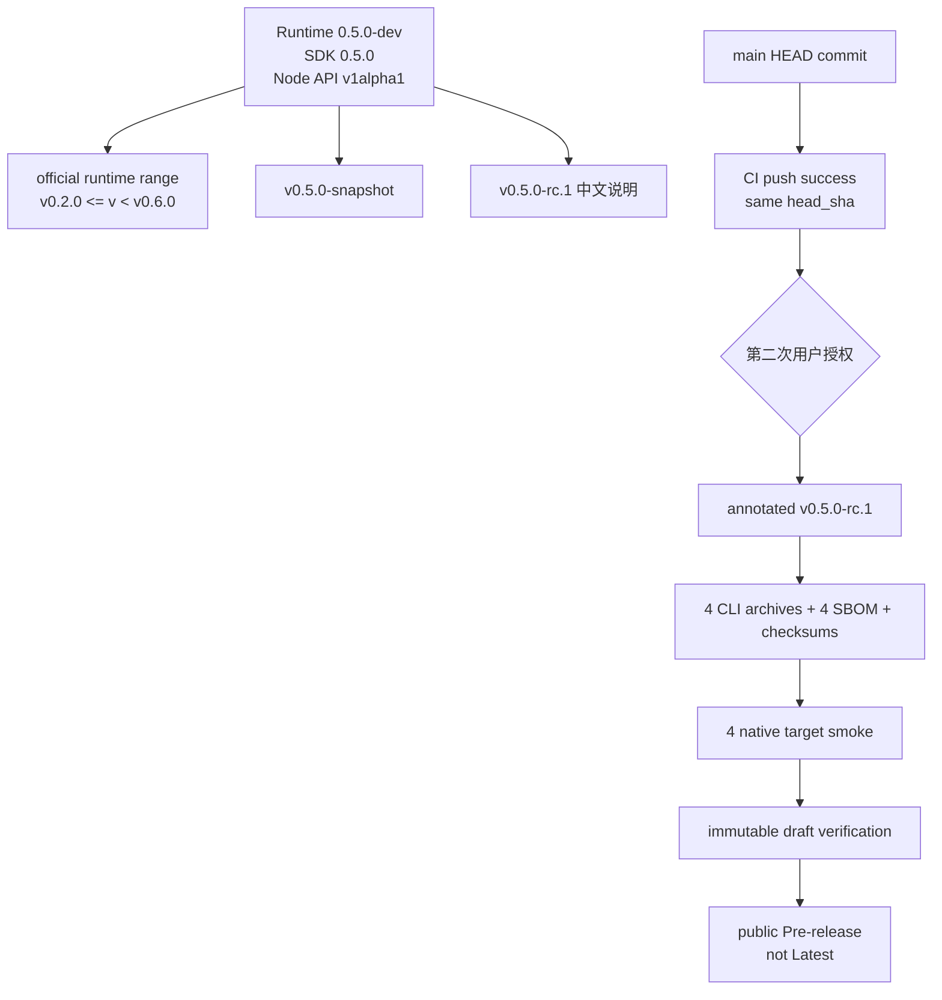

# v0.5.0-rc.1 PR2 发布准备实施计划

> **For agentic workers:** REQUIRED SUB-SKILL: Use superpowers:subagent-driven-development (recommended) or superpowers:executing-plans to implement this plan task-by-task. Steps use checkbox (`- [ ]`) syntax for tracking.

**Goal:** 在 PR1 稳定性门禁合并后，冻结 `v0.5.0-rc.1` 的 Runtime/SDK/节点兼容矩阵、9 个 CLI 制品、中文发布说明与 GitHub Release 工作流，并在不创建 Tag 的前提下让主分支具备可审核的 RC 发布条件。

**Architecture:** 源码中的 Runtime、SDK、官方 manifest、节点索引夹具和 snapshot 版本形成单一矩阵；发布工作流只接受 main HEAD 的 annotated Tag，并在构建前通过 GitHub Actions API确认同一 commit 已有成功的 `CI` main push run；四个平台制品通过构建、原生 smoke、checksum/SBOM 和远端逐字节复核后，RC 才从 draft 提升为公开 Pre-release。

**Tech Stack:** Go 1.26、GoReleaser 2.17、Syft 1.51、POSIX shell、Ruby/YAML、jq、GitHub Actions、GitHub CLI、Playwright。

**Spec:** `docs/superpowers/specs/2026-09-01-v0.5.0-rc.1-closeout-design.md`

## Global Constraints

- PR2 只能在 PR1 已合并且最新 `main` CI 通过后开始；从最新 `origin/main` 创建 `codex/v0.5.0-rc.1-pr2-release`。
- PR2 不修改 OpenAPI、数据库 migration、运行状态机、节点定义契约或前端产品交互。
- Node API 保持 `agent-studio.dev/v1alpha1`；备份当前格式保持 `agent-studio.dev/backup/v1alpha2` 并继续导入 v1alpha1；数据库保持 migration 7。
- Runtime 开发版本固定 `0.5.0-dev`，Go Node SDK 固定 `0.5.0`，Release Tag 固定 `v0.5.0-rc.1`，snapshot 固定 `v0.5.0-snapshot`。
- 只发布四个平台 CLI archive、四个逐归档 SPDX JSON SBOM 和一个 checksums，共 9 个附件；不新增容器镜像、Windows、安装器、签名或公证。
- 所有 Go 命令使用 `CGO_ENABLED=0`；单次测试命令最多 10 分钟。`release-snapshot` 是制品构建，沿用现有 30 分钟发布 job 上限。
- PR2 合并不授权创建/推送 Tag，也不授权公开 Release；合并并确认 main 精确 SHA 的 CI 全绿后，必须再次向用户请求外部状态授权。
- 每个任务红—绿—重构，提交前 `git diff --check`；PR 前执行代码审查与全量回归。

## 版本与发布数据流



| 审查门 | Tasks | 必须可验证的交付物 |
|---|---:|---|
| A：版本矩阵 | 1–2 | Runtime/SDK/snapshot/manifest/浏览器兼容性一致 |
| B：发布安全 | 3–4 | 9 资产契约、最小权限、精确 main push CI、annotated Tag |
| C：说明收口 | 5 | 中文 RC 边界、升级回滚、安装验证、已知限制 |
| D：PR 收口 | 6 | 完整回归、snapshot、审查、PR；不创建 Tag |

## 开发启动前置

- [ ] 确认 PR1 已合并，切回主工作树并创建新分支：

  ```bash
  git status --short
  git switch main
  git pull --ff-only origin main
  git switch -c codex/v0.5.0-rc.1-pr2-release
  git rev-parse HEAD
  test -f docs/superpowers/plans/2026-09-01-v0.5.0-rc.1-pr2-release.md
  ```

- [ ] 通过只读检查确认基线包含 PR1：

  ```bash
  git log -1 --oneline
  test -f scripts/test-rc-capacity-e2e.sh
  test -f scripts/test-v05-upgrade-rollback-e2e.sh
  CGO_ENABLED=0 make verify-quick
  ```

  若 PR1 未合并或快速基线失败，停止 PR2，不复制未合并提交。

## Task 1：冻结 Runtime、SDK 与 snapshot 版本

**Files:**
- Modify: `internal/buildinfo/buildinfo.go`
- Modify: `internal/buildinfo/buildinfo_test.go`
- Modify: `sdk/go/agentnode/node.go`
- Modify: `sdk/go/agentnode/node_test.go`
- Modify: `.goreleaser.yaml`
- Modify: `Makefile`
- Modify: `scripts/check-version_test.sh`
- Modify: `scripts/check-release-version_test.sh`

**Version matrix:**

| Source | Exact value |
|---|---|
| `buildinfo.developmentVersion` | `0.5.0-dev` |
| `agentnode.Version` | `0.5.0` |
| `agentnode.APIVersion` | `agent-studio.dev/v1alpha1` |
| GoReleaser `snapshot.version_template` | `0.5.0-snapshot` |
| rendered archive/snapshot version | `v0.5.0-snapshot` |
| target tag | `v0.5.0-rc.1` |

- [ ] 先把版本测试期望推进到 v0.5：重命名 `TestPublicVersionsForV040`/`TestVersionForV040` 为 V050，并把 buildinfo 表中所有开发 fallback/SDK 期望分别改为 `0.5.0-dev`/`0.5.0`；API Version 不变。

- [ ] 把 `scripts/check-version_test.sh` 夹具推进到 SDK `0.5.0`、Tag `v0.5.0-rc.1`/`v0.5.0`，继续覆盖非法 Tag、缺失 origin/main、版本不匹配、dirty/untracked 和 ignored cache。

- [ ] 把 `scripts/check-release-version_test.sh` 的 `expected_version` 改为 `v0.5.0-snapshot`，并同步有效/陈旧/双 `v` 三组夹具。

- [ ] 运行红灯：

  ```bash
  CGO_ENABLED=0 go test ./internal/buildinfo ./sdk/go/agentnode -count=1
  sh scripts/check-version_test.sh
  sh scripts/check-release-version_test.sh
  ```

  预期失败：生产常量、GoReleaser/Makefile/workflow snapshot 仍为 v0.4。

- [ ] 最小实现：

  ```go
  // internal/buildinfo/buildinfo.go
  const developmentVersion = "0.5.0-dev"

  // sdk/go/agentnode/node.go
  const APIVersion = "agent-studio.dev/v1alpha1"
  const Version = "0.5.0"
  ```

  `.goreleaser.yaml` 使用 `version_template: "0.5.0-snapshot"`；Makefile 的 `release-snapshot` collection 版本改为 `v0.5.0-snapshot`；release workflow 的 dry version 在 Task 4 同步。

- [ ] 运行绿灯并检查 CLI 输出：

  ```bash
  CGO_ENABLED=0 go test ./internal/buildinfo ./sdk/go/agentnode -count=1
  CGO_ENABLED=0 go run ./cmd/agent-studio version
  sh scripts/check-version_test.sh
  ```

  预期 CLI 前缀为 `agent-studio 0.5.0-dev (sdk 0.5.0; api agent-studio.dev/v1alpha1;`。

- [ ] 提交：

  ```bash
  git diff --check
  git add internal/buildinfo sdk/go/agentnode .goreleaser.yaml Makefile scripts/check-version_test.sh scripts/check-release-version_test.sh
  git commit -m "chore: align v05 release versions"
  ```

## Task 2：推进官方节点兼容范围和 v0.5 浏览器夹具

**Files:**
- Modify: `agent-studio.node-package.json`
- Modify: `internal/generatedtest/golden_path_test.go`
- Modify: `internal/generatedtest/repository_release_contract_test.go`
- Modify: `apps/web/e2e/fixtures/node-index/index.json`
- Modify: `apps/web/e2e/node-packages.spec.ts`

**Compatibility matrix:**
- 官方根 manifest：`[v0.2.0, v0.6.0)`。
- generated golden path 默认参数：`--runtime-min v0.2.0 --runtime-max-exclusive v0.6.0`。
- repository contract 使用 Runtime `0.5.0-dev`、SDK `0.5.0`、tag context `v0.5.0`。
- E2E future package 改为 `[v0.6.0, v0.7.0)`，在 v0.5 仍明确“不兼容：当前运行时版本过低”。
- E2E search package 两个版本均改为 `[v0.2.0, v0.6.0)`，在 v0.5 兼容。
- Node index 自身的 fixture release 保持 `v0.4.0`，因为它表示独立索引资产版本，不冒充 Runtime Release。

- [ ] 先修改 Go 契约测试：

  ```go
  func TestRepositoryManifestSupportsV050Runtime(t *testing.T) {
      // parse root manifest
      // min == v0.2.0; maxExclusive == v0.6.0
      diagnostics := nodepackage.CheckCompatibility(
          manifest, "0.5.0-dev", "0.5.0", agentnode.APIVersion, "v0.5.0",
      )
      // diagnostics has no errors
  }
  ```

  `golden_path_test.go` 的 CLI 参数和生成 manifest 字符串断言必须包含 `"maxVersionExclusive": "v0.6.0"`。

- [ ] 修改 Playwright 期望，除现有“不兼容”文案外，明确断言 Future 详情展示 `运行时 v0.6.0 至 v0.7.0（不含）`；保留无 GitHub/远端请求断言。

- [ ] 运行红灯：

  ```bash
  CGO_ENABLED=0 go test ./internal/generatedtest -run 'GoldenPath|RepositoryManifest' -count=1
  corepack pnpm@10.34.5 --filter @agent-studio/web exec playwright test e2e/node-packages.spec.ts
  ```

- [ ] 更新根 manifest 和 fixture 的精确区间，不改变 `nodeAPI`、registration、commit/digest、index release 或节点版本。

- [ ] 运行绿灯：

  ```bash
  CGO_ENABLED=0 go test ./internal/generatedtest -run 'GoldenPath|RepositoryManifest' -count=1
  CGO_ENABLED=0 go run ./cmd/agent-studio node inspect .
  corepack pnpm@10.34.5 --filter @agent-studio/web exec playwright test e2e/node-packages.spec.ts
  ```

- [ ] 提交审查门 A：

  ```bash
  git diff --check
  git add agent-studio.node-package.json internal/generatedtest apps/web/e2e/fixtures/node-index/index.json apps/web/e2e/node-packages.spec.ts
  git commit -m "chore: support v05 node packages"
  ```

## Task 3：固定 9 个 CLI Release 附件契约

**Files:**
- Modify: `scripts/check-release-artifacts_test.sh`
- Verify: `internal/releaseartifact/check.go`
- Verify: `.goreleaser.yaml`

**Exact artifact set:**

```text
agent-studio_v0.5.0-rc.1_darwin_amd64.tar.gz
agent-studio_v0.5.0-rc.1_darwin_amd64.tar.gz.spdx.json
agent-studio_v0.5.0-rc.1_darwin_arm64.tar.gz
agent-studio_v0.5.0-rc.1_darwin_arm64.tar.gz.spdx.json
agent-studio_v0.5.0-rc.1_linux_amd64.tar.gz
agent-studio_v0.5.0-rc.1_linux_amd64.tar.gz.spdx.json
agent-studio_v0.5.0-rc.1_linux_arm64.tar.gz
agent-studio_v0.5.0-rc.1_linux_arm64.tar.gz.spdx.json
checksums.txt
```

- [ ] 将 wrapper test 的版本输入推进为 `v0.5.0-rc.1`，增加静态断言：GoReleaser 只列 `linux/darwin` 与 `amd64/arm64`；`source.enabled=false`、`release.disable=true`；SBOM 只针对 archive；不包含 Docker、Windows、sign/notarize 配置。

- [ ] 在 shell test 内生成上面的排序 expected list，并从 `.github/workflows/release.yml` 的 draft verification block 提取 `target in ...` 与 `checksums.txt`，断言渲染集合完全一致；Task 4 修改 workflow 前应能显示目标性差异而非脚本语法失败。

- [ ] 运行红灯/现状检查：

  ```bash
  sh scripts/check-release-artifacts_test.sh
  CGO_ENABLED=0 go test ./internal/releaseartifact -count=1
  ```

- [ ] 若现有 `internal/releaseartifact` 已完整覆盖四目标、checksum、SPDX、归档路径、CLI version/help，则不改生产 Go 代码；只补缺少的测试。禁止为了产生 diff 重写已正确实现。

- [ ] 运行绿灯并提交：

  ```bash
  sh scripts/check-release-artifacts_test.sh
  CGO_ENABLED=0 go test ./internal/releaseartifact -count=1
  git diff --check
  git add scripts/check-release-artifacts_test.sh internal/releaseartifact
  git commit -m "test: freeze v05 release artifact set"
  ```

## Task 4：发布工作流增加精确 main push CI 门禁

**Files:**
- Modify: `scripts/check-release-workflow_test.sh`
- Modify: `.github/workflows/release.yml`
- Modify: `scripts/check-release-version_test.sh`

**Security contract:**
- workflow 顶层权限保持 `contents: read`。
- build job 权限精确为 `contents: read` + `actions: read`。
- publish job 权限仍精确为 `contents: write`；不得给 publish 添加 `actions: read`。
- 只使用 `${{ github.token }}`，不出现 `secrets.` 或 `pull_request_target`。
- `Verify successful main CI` 必须在 source verification 和 GoReleaser 之前完成。
- 被接受的 run 必须 `head_sha == git rev-parse HEAD`、`head_branch == main`、`event == push`、`status == completed`、`conclusion == success`。

- [ ] 扩展 Ruby workflow contract test，增加纯函数 `verify_main_ci_gate(workflow)`，检查 build permissions、步骤存在和顺序，并要求 run 文本同时包含：

  ```text
  actions/workflows/ci.yml/runs
  --method GET
  branch=main
  event=push
  status=completed
  .head_sha == $sha
  .head_branch == "main"
  .conclusion == "success"
  ```

  对深拷贝 workflow 构造至少五个负例：删除 `actions: read`、把权限扩大为 contents write、删除精确 SHA 条件、把 event 改成 pull_request、把 conclusion 改成非 success。每个 fixture 必须因对应单一原因失败。

- [ ] 先运行红灯：

  ```bash
  sh scripts/check-release-workflow_test.sh
  ```

  预期失败：build job 尚无 actions read 或 CI gate step。

- [ ] 在 build job 添加最小权限：

  ```yaml
  permissions:
    contents: read
    actions: read
  ```

- [ ] 在 `Verify main head` 之后加入精确实现：

  ```yaml
  - name: Verify successful main CI
    env:
      GH_TOKEN: ${{ github.token }}
    run: |
      head_sha=$(git rev-parse HEAD)
      ci_runs=$(mktemp)
      trap 'rm -f "$ci_runs"' EXIT HUP INT TERM
      gh api --method GET \
        "repos/$GITHUB_REPOSITORY/actions/workflows/ci.yml/runs" \
        -f branch=main -f event=push -f status=completed -f per_page=100 >"$ci_runs"
      jq -e --arg sha "$head_sha" '
        .workflow_runs | any(
          .head_sha == $sha and
          .head_branch == "main" and
          .event == "push" and
          .status == "completed" and
          .conclusion == "success"
        )
      ' "$ci_runs" >/dev/null
  ```

  该门禁对 Tag push 和 `workflow_dispatch` 都生效；main 未保护时仍不可绕过成功 push CI。

- [ ] 将 dry-run step 改为：

  ```yaml
  run: echo "value=v0.5.0-snapshot" >> "$GITHUB_OUTPUT"
  ```

  保持 tagged GoReleaser 只在对应 step 设置 `GORELEASER_CURRENT_TAG`，dry run 不能继承 Tag。

- [ ] 扩展发布状态测试：RC promotion 必须包含 `--draft=false --prerelease` 且不得 `--latest`；正式版分支仍可 `--latest`。draft 资产验证必须精确 9 个并验证 annotated Tag object 最终指向 HEAD。

- [ ] 运行审查门 B：

  ```bash
  sh scripts/check-release-workflow_test.sh
  sh scripts/check-release-version_test.sh
  sh scripts/check-release-artifacts_test.sh
  make verify-workflows
  ```

- [ ] 提交：

  ```bash
  git diff --check
  git add scripts/check-release-workflow_test.sh scripts/check-release-version_test.sh .github/workflows/release.yml
  git commit -m "ci: require successful main run for release"
  ```

## Task 5：编写 v0.5.0-rc.1 中文发布说明并同步使用入口

**Files:**
- Create: `docs/releases/v0.5.0-rc.1.md`
- Modify: `README.md`
- Modify: `docs/sdk/compatibility.md`
- Modify: `docs/upgrades/v0.5-d.md`

**Required release note sections:**
- RC 身份、非生产稳定版、不提供 v1 兼容承诺。
- v0.5-A 可观测性、v0.5-B 画布体验、v0.5-C 备份恢复、v0.5-D 持久运行。
- API/Worker 同版本、同数据库、同密钥和固定维护窗口。
- migration 7、backup v1alpha2/v1alpha1 import、错误密钥与人工恢复。
- 1 API + 1 Worker(concurrency 4) + 500 Mock runs + 10 分钟上限的轻量 RC 基线；明确不是 SLA。
- CLI 安装、四 archive、checksum、SPDX SBOM 验证。
- 已知限制：单租户、本地优先、无容器制品、无本地 RAG、无自动业务重试、无签名/公证。
- 回滚只恢复升级前备份和旧制品；禁止逆迁移或旧/新进程混跑。

- [ ] 扩展已有 `scripts/check-durable-run-docs_test.sh`，要求上述关键词和四个精确版本值存在，且拒绝“已发布/已公开/Latest”这类在 Tag 前声称远端状态已发生的文案。

- [ ] 运行红灯：

  ```bash
  sh scripts/check-durable-run-docs_test.sh
  ```

  预期失败：v0.5.0-rc.1 文档缺失或 README 仍是 v0.4。

- [ ] 创建 `docs/releases/v0.5.0-rc.1.md`。安装示例只使用条件语气：

  ```bash
  CGO_ENABLED=0 go install github.com/yyl1212/agent-studio/cmd/agent-studio@v0.5.0-rc.1
  agent-studio version
  ```

  附件示例使用 `VERSION=v0.5.0-rc.1`，说明只有标签工作流成功后远端附件才可用。

- [ ] 更新 README：开发者预览改为目标 `v0.5.0-rc.1`，源码开发输出 `0.5.0-dev`，SDK `0.5.0`/API v1alpha1，补充 API+Worker 启动、队列 sampler、升级/回滚和容量基线；不得写成生产 SLA 或已完成远端发布。

- [ ] 更新 `docs/sdk/compatibility.md`：标题/正文推进到 SDK v0.5；Node API 保持 v1alpha1；官方 manifest 改为 `[v0.2.0,v0.6.0)`；说明 v0.5 的 durable execution、backup schema 或 runtime 状态不自动改变第三方 Node API 生命周期。

- [ ] 更新 `docs/upgrades/v0.5-d.md`：引用 RC notes；保留 migration 7 与备份恢复顺序；加入版本矩阵和 10 分钟自动演练命令；说明备份 v1alpha2 继续接受 v1alpha1，而数据库回滚仍必须用升级前 dump。

- [ ] 运行绿灯和链接检查：

  ```bash
  sh scripts/check-durable-run-docs_test.sh
  rg -n '0\.4\.0-dev|SDK 当前为 v0\.4|\[v0\.2\.0, v0\.5\.0\)' README.md docs/sdk/compatibility.md docs/upgrades/v0.5-d.md docs/releases/v0.5.0-rc.1.md
  ```

  最后一个 `rg` 预期无输出；历史 release notes 不在扫描范围内，不能回写历史。

- [ ] 提交审查门 C：

  ```bash
  git diff --check
  git add docs/releases/v0.5.0-rc.1.md README.md docs/sdk/compatibility.md docs/upgrades/v0.5-d.md scripts/check-durable-run-docs_test.sh
  git commit -m "docs: prepare v050 rc1 release"
  ```

## Task 6：PR2 全量回归、制品快照、代码审查与 PR

**Files:**
- Review: PR2 全部变更
- No Tag or Release mutation

- [ ] 按单次不超过 10 分钟执行源代码、工作流和现有 E2E；macOS 本地由执行器为每条命令设置 600 秒硬上限，CI 使用 `timeout-minutes`，不依赖 GNU `timeout`：

  ```bash
  CGO_ENABLED=0 make verify
  make test-e2e
  make test-sdk-e2e
  make test-durable-runs-e2e
  make test-backup-e2e
  make verify-workflows
  ```

- [ ] 重跑 PR1 新门禁，防止发布准备破坏稳定性；两条命令分别使用 600 秒执行器上限：

  ```bash
  make test-rc-capacity-e2e
  make test-v05-upgrade-rollback-e2e
  ```

- [ ] 安装固定 release tools，并生成本地 snapshot。该命令是制品构建而非测试，允许使用现有 30 分钟边界：

  ```bash
  make release-tools
  make release-check
  make release-snapshot
  ```

  预期 `dist/` 中正好是四个 `agent-studio_v0.5.0-snapshot_*` archive、四个对应 SBOM 和 checksums；每个原生 target 的 `agent-studio version` 报 SDK 0.5.0/API v1alpha1。

- [ ] 做最终静态审查：

  ```bash
  git diff --check origin/main...HEAD
  git diff --stat origin/main...HEAD
  git log --oneline origin/main..HEAD
  git status --short
  rg -n 'v0\.4\.0-snapshot|0\.4\.0-dev|maxVersionExclusive.*v0\.5\.0' \
    internal sdk agent-studio.node-package.json .goreleaser.yaml Makefile scripts .github README.md docs/sdk/compatibility.md
  ```

  历史 release/spec/plan 不得批量替换；扫描命中只允许测试中的“陈旧 fixture”负例，并须逐条确认。

- [ ] 使用 `superpowers:requesting-code-review` 做独立审查。重点：版本矩阵没有分叉；CI 查询精确 SHA/main/push/success；权限最小；RC 不设置 Latest；附件精确 9 个；文档不提前声明远端发布。

- [ ] 修复 Critical/Important 并重跑对应回归；修订单独提交：

  ```bash
  git add --update
  git commit -m "fix: address v05 release review"
  ```

- [ ] 推送并创建 PR（需要用户授权外部写入）：

  ```bash
  git push -u origin codex/v0.5.0-rc.1-pr2-release
  gh pr create --base main --head codex/v0.5.0-rc.1-pr2-release \
    --title "chore: prepare v0.5.0-rc.1 release" \
    --body-file /tmp/agent-studio-v05-pr2-body.md
  ```

  PR body列出：版本矩阵、9 个附件、main CI gate、snapshot 结果、全部验证命令和“本 PR 不创建 Tag/Release”。只创建 PR，不自动合并。

## PR2 合并后的授权边界

- [ ] PR2 经用户同意合并后，拉取最新 `main` 并只读确认：工作树干净、HEAD=origin/main、该 SHA 有成功的 `CI` push run、Tag 本地/远端均不存在、immutable releases 已启用、`make release-preflight TAG=v0.5.0-rc.1` 通过。
- [ ] 将精确 main SHA、CI run URL、preflight 输出和待创建的 annotated Tag/公开 Pre-release 动作报告给用户。
- [ ] 明确询问第二次授权。未收到“创建并推送 v0.5.0-rc.1 标签，允许自动公开 Pre-release”同等明确指令前，不执行 `git tag`、`git push origin refs/tags/...` 或 `gh release`。
- [ ] 获得授权后的 Tag/Release 执行应进入单独发布步骤并使用 `superpowers:verification-before-completion`；若工作流失败，不移动 Tag、不替换已公开资产，修复后发布 `v0.5.0-rc.2`。

## 完成定义

- Runtime/SDK/API/snapshot/manifest/fixture 全部匹配确定的 v0.5 矩阵。
- Release workflow 使用 build job 的最小 `actions: read` 查询精确 main HEAD 的成功 push CI，保留 annotated Tag、不可变 draft 和 RC Pre-release 语义。
- 四个平台 archive、四个 SPDX SBOM 和 checksums 的 9 资产集合由自动测试和 snapshot 验证。
- 中文 RC notes、README、SDK 兼容策略和升级手册准确描述能力、容量基线、已知限制与回滚边界。
- PR2 全量回归、PR1 门禁、workflow lint、snapshot 和代码审查通过，PR 已创建；未越权创建 Tag 或公开 Release。
