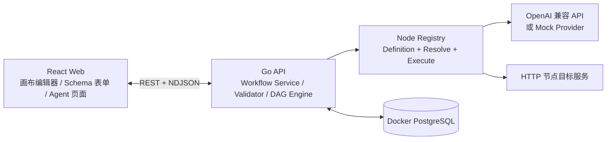

# 轻量化 Agent Studio 设计规格

**日期：** 2026-08-17

**状态：** 阻塞项已修订并确认，可实施

**目标版本：** 单用户本地 MVP

## 1. 背景与目标

本项目从空仓库搭建一套轻量化 Agent 开发系统，解决三个核心问题：

1. 用户可以在低代码画布上拖拽节点、连线并配置工作流，以构建 Agent。
2. 系统可以根据开始节点的参数定义，自动生成可运行的 Agent 前端页面。
3. 开发者可以通过统一节点接口快速扩展节点类型，普通节点无需修改前端代码。

首版交付可在本地完整演示“创建工作流 → 配置节点 → 测试运行 → 发布版本 → 打开 Agent 页面 → 提交参数并查看结果”的闭环。

## 2. 范围

### 2.1 首版范围

- 单用户本地运行，不包含登录和权限系统。
- 工作流采用有向无环图，支持串行、并行和条件路由。
- 内置开始、提示词模板、LLM、条件、HTTP、代码、结束七类节点。
- 开始节点支持单行文本、多行文本、数字、布尔值、单选和 JSON 字段。
- 字段支持标题、说明、必填、默认值、占位符和选项。
- OpenAI 兼容模型接口通过环境变量配置 `baseUrl` 和 `apiKey`，LLM 节点配置 `model`。
- 未提供模型密钥时使用内置 Mock 模型，保证零配置演示。
- PostgreSQL 通过 Docker Compose 启动；应用前后端在本地进程运行。
- 草稿、发布快照、运行记录和节点运行记录持久化到 PostgreSQL。

### 2.2 首版不包含

- 登录、多人协作、RBAC 和租户隔离。
- 循环、子工作流和人工审批节点。
- 文件上传、知识库、向量检索和 RAG。
- 外部插件进程、节点热加载和插件市场。
- 分布式 Worker、消息队列和自动重试。
- 完整应用容器化、云部署和高可用方案。

## 3. 技术方案决策

### 3.1 采用方案

采用“元数据驱动的模块化单体”：

- React Web 负责画布、通用 Schema 表单和 Agent 页面。
- Go API 负责草稿、校验、发布、执行和持久化。
- Go Node Registry 统一注册节点定义、动态端口和执行器。
- 前端从 API 获取节点元数据，根据 JSON Schema 自动生成配置界面。
- 普通节点扩展只需新增 Go 节点包并注册；后端重新编译后节点自动出现在前端。

### 3.2 备选方案与取舍

1. **完全声明式节点：** YAML/JSON 即可增加节点，但复杂节点仍需扩展执行器，声明系统本身会演变为新的编程语言，首版成本过高。
2. **外部节点插件进程：** 可独立部署和隔离，但需要发现、鉴权、版本协商、健康检查和分布式追踪，不符合轻量化目标。

当前方案保留稳定的 `Executor` 边界，将来可在不修改 DAG 引擎的前提下增加外部执行器适配器。

## 4. 技术栈与全局约束

- Go 1.26。
- 后端路由：`net/http` + `github.com/go-chi/chi/v5`。
- PostgreSQL 驱动：`github.com/jackc/pgx/v5`，不使用重量级 ORM。
- 代码节点：`go.starlark.net/starlark`。
- Node.js 24 LTS。
- pnpm 10。
- React + TypeScript + Vite。
- 画布：`@xyflow/react`。
- 前端测试：Vitest + React Testing Library + Playwright。
- PostgreSQL 18 Docker 官方镜像。
- OpenAPI 3.1 作为前后端 HTTP 契约来源。
- 所有 Go 调试、构建和测试命令使用 `CGO_ENABLED=0`。
- 所有用户可见文档与核心界面文案使用中文。
- 不使用来源不明的图片、视频或其他素材；首版 UI 使用代码绘制图标和开源图标库。

### 4.1 实施前置条件

- `apps/api/go.mod` 使用 `go 1.26.0`，并以 `toolchain` 指令锁定实施时验证通过的 Go 1.26 补丁版本；当前主机的 `GOTOOLCHAIN=auto` 负责按需下载该工具链。
- 根 `package.json` 使用 `packageManager` 字段锁定实施时验证通过的 pnpm 10 补丁版本；当前主机通过已有 Corepack 安装和激活该版本。
- 首次依赖与工具链下载需要网络权限，下载后使用 lockfile 和 Go checksum 保证可复现。
- 当前仓库没有远程地址；用户已明确批准以本地 `master` 提交 `655e5d2` 为基线继续实施。

## 5. 总体架构



### 5.1 边界

- Web 不执行节点，只维护交互状态、渲染 Schema、消费 API 和运行事件。
- API 不依赖 React Flow 数据结构以外的前端实现细节；工作流通过稳定 JSON 契约传输。
- Engine 只依赖编译后的执行计划和 Node Registry，不直接访问 HTTP Handler。
- Node Executor 不访问画布和仓储；依赖通过构造函数注入。
- Store 只负责 PostgreSQL 数据访问，不包含工作流业务规则。
- 模型密钥仅从环境变量读取，不进入工作流 JSON、API 响应或运行日志。

## 6. 计划新增文件

```text
.
├── .env.example
├── .gitignore
├── Makefile
├── README.md
├── compose.yaml
├── contracts/
│   └── openapi.yaml
├── docs/
│   ├── node-development.md
│   └── superpowers/
│       ├── plans/
│       └── specs/
├── apps/
│   ├── api/
│   │   ├── cmd/server/main.go
│   │   ├── go.mod
│   │   ├── go.sum
│   │   ├── internal/config/
│   │   ├── internal/httpapi/
│   │   ├── internal/workflow/
│   │   ├── internal/engine/
│   │   ├── internal/nodes/
│   │   ├── internal/modelprovider/
│   │   ├── internal/store/postgres/
│   │   └── migrations/
│   └── web/
│       ├── package.json
│       ├── vite.config.ts
│       ├── playwright.config.ts
│       └── src/
│           ├── app/
│           ├── features/studio/
│           ├── features/agent/
│           ├── features/runs/
│           ├── components/schema-form/
│           └── lib/api/
├── package.json
├── pnpm-lock.yaml
└── pnpm-workspace.yaml
```

职责说明：

- `contracts/openapi.yaml`：接口、错误和运行事件的唯一 HTTP 契约。
- `internal/workflow/`：工作流草稿、校验、发布和查询用例。
- `internal/engine/`：图编译、拓扑调度、条件路由和事件发送。
- `internal/nodes/`：节点接口、注册表与七类内置节点。
- `internal/modelprovider/`：OpenAI 兼容与 Mock 模型适配器。
- `internal/store/postgres/`：迁移执行和 pgx 仓储实现。
- `features/studio/`：画布优先编辑器及抽屉交互。
- `features/agent/`：根据发布 Schema 生成聚焦式单栏页面。
- `components/schema-form/`：编辑器配置和发布页共用的 Schema 表单。
- `docs/node-development.md`：新增节点的最小步骤、接口示例和测试要求。

## 7. 工作流数据契约

工作流图采用以下结构：

```json
{
  "schemaVersion": 1,
  "nodes": [
    {
      "id": "llm-1",
      "type": "llm",
      "typeVersion": "1",
      "position": { "x": 420, "y": 180 },
      "config": {}
    }
  ],
  "edges": [
    {
      "id": "edge-1",
      "source": "prompt-1",
      "sourcePort": "text",
      "target": "llm-1",
      "targetPort": "prompt"
    }
  ]
}
```

### 7.1 端口规则

- 端口类型为 `string`、`number`、`boolean`、`json` 或 `any`。
- 一个输出端口可以连接多个下游。
- 输入端口声明 `cardinality`，首版支持 `one` 和 `single-active`。
- 普通输入端口使用 `one`，最多接受一条边，防止非确定性覆盖。
- 结束节点的 `result` 使用 `single-active`，允许多条条件分支入边，但一次运行必须恰有一条活跃入边。
- `any` 可以连接任意端口；其他类型必须一致。
- 节点在所有必需输入就绪后执行，因此独立分支可以并行。
- 条件节点仅激活 `true` 或 `false` 出边，并沿选中端口传递原始输入。
- 当节点的全部上游已进入终态，而任一必需 `one` 端口仍没有活跃值时，该节点标记为 `skipped`，并向下游继续传播终态，调度器不得继续等待。
- 工作流必须恰有一个开始节点和一个结束节点。
- 所有节点必须从开始节点可达，每条可能执行路径必须能够到达结束节点。
- 工作流禁止循环边和自连接。

### 7.2 动态端口

- 开始节点的字段 key 派生为输出端口。
- 提示词模板使用严格的 `{{name}}` 占位符；每个唯一变量派生为同名输入端口。
- 前端对节点配置变化进行 250ms 防抖，然后调用节点解析 API 获取权威端口。
- 动态端口删除后，与其相连的边在编辑器中标记为无效，保存仍允许，发布必须修复。

## 8. 节点扩展接口

概念接口如下，实施时以同等语义的 Go 类型为准：

```go
type NodeType interface {
    Definition() Definition
    Resolve(config json.RawMessage) (ResolvedNode, error)
    Execute(ctx context.Context, request NodeRequest) (NodeResult, error)
}
```

- `Definition` 返回类型、版本、名称、分类、说明、配置 JSON Schema，以及包含类型、必填性和 cardinality 的静态端口。
- `Resolve` 校验配置并计算最终端口。
- `Execute` 接收解析后的输入和配置，返回端口输出及被激活的控制端口。
- Registry 使用 `type + version` 作为唯一键，重复注册立即失败。
- 发布快照保留 `typeVersion`；已有节点版本不得改变既有行为。
- 大多数新节点使用通用前端节点外观和 Schema 表单，无需增加 React 组件。

### 8.1 内置节点

| 节点 | 输入 | 输出 | 主要配置 |
|---|---|---|---|
| 开始 | 运行参数 | 每个字段一个动态端口 | 字段定义 |
| 提示词模板 | 模板变量动态端口 | `text` | 严格模板 |
| LLM | `prompt` | `text`、`usage` | 模型、系统提示词、温度、最大 token |
| 条件 | `value` | `true` 或 `false` | 运算符、比较值 |
| HTTP | 可选 `body` | `status`、`headers`、`body` | URL、方法、Header、超时 |
| 代码 | `input` | `result` | Starlark `main(input)` |
| 结束 | `result`（`single-active`） | 最终结果 | 文本或 JSON 模式 |

条件节点首版支持 `equals`、`notEquals`、`contains`、`greaterThan`、`lessThan` 和 `isEmpty`。类型不适用时返回稳定的节点配置或执行错误。

## 9. PostgreSQL 模型

### 9.1 `workflows`

- `id uuid primary key`
- `name text not null`
- `slug text not null unique`
- `description text not null default ''`
- `draft_graph jsonb not null`
- `draft_revision bigint not null`
- `published_version_id uuid null`
- `created_at timestamptz not null`
- `updated_at timestamptz not null`

### 9.2 `workflow_versions`

- `id uuid primary key`
- `workflow_id uuid not null references workflows(id)`
- `version integer not null`
- `graph jsonb not null`
- `input_schema jsonb not null`
- `created_at timestamptz not null`
- 唯一约束：`workflow_id, version`
- 唯一约束：`workflow_id, id`，用于运行记录的组合外键

创建 `workflow_versions` 后，迁移通过 `ALTER TABLE` 为 `workflows(id, published_version_id)` 增加指向 `workflow_versions(workflow_id, id)` 的组合外键，确保当前发布版本属于同一工作流。

### 9.3 `runs`

- `id uuid primary key`
- `workflow_id uuid not null references workflows(id)`
- `workflow_version_id uuid null`
- `draft_revision bigint null`
- `graph_snapshot jsonb null`
- `mode text not null`，值为 `test` 或 `published`
- `status text not null`
- `input jsonb not null`
- `output jsonb null`
- `error jsonb null`
- `started_at timestamptz not null`
- `ended_at timestamptz null`

正式运行通过组合外键 `(workflow_id, workflow_version_id)` 引用 `workflow_versions(workflow_id, id)`。测试运行保存 `draft_revision` 和当次执行的 `graph_snapshot`，使草稿继续修改后仍能复现历史测试。

数据库检查约束：

- `mode = 'published'` 时，`workflow_version_id` 非空，`draft_revision` 与 `graph_snapshot` 为空。
- `mode = 'test'` 时，`workflow_version_id` 为空，`draft_revision` 与 `graph_snapshot` 非空。

### 9.4 `node_runs`

- `id uuid primary key`
- `run_id uuid not null references runs(id)`
- `node_id text not null`
- `node_type text not null`
- `status text not null`
- `input jsonb null`
- `output jsonb null`
- `error jsonb null`
- `started_at timestamptz null`
- `ended_at timestamptz null`
- 唯一约束：`run_id, node_id`

## 10. 草稿与发布语义

- 新建工作流时放置未连接的开始和结束节点。
- 不完整草稿可以保存，但不能发布或测试运行。
- 更新草稿必须携带客户端持有的 `draftRevision`。
- revision 不一致时返回 `409 WORKFLOW_REVISION_CONFLICT`，前端提示重新加载，不静默覆盖。
- 前端自动保存采用单飞队列：同一时刻只允许一个保存请求，期间产生的修改合并为下一次请求，禁止旧响应覆盖新 revision。
- 发布在一个数据库事务内完成：加载最新草稿、完整校验、派生输入 Schema、创建递增版本、更新当前发布版本。
- 发布操作必须等待自动保存队列清空，并携带最终 `draftRevision`；服务端只发布完全一致的 revision。
- 发布版本不可修改；修改草稿不会影响 `/agents/{slug}`。
- 再次发布创建新版本，历史运行继续引用原版本。
- 首版不提供删除历史版本和回滚按钮；旧版本保留用于审计和复现。
- 首版不提供删除工作流 API，避免草稿、发布版本和历史运行的级联删除语义进入 MVP。
- Agent manifest 返回 `workflowVersionId` 和显示版本号。Agent 运行请求必须回传 `workflowVersionId`，服务端验证该版本属于当前 slug 对应的工作流，并执行该不可变版本；即使期间已发布新版本，本次提交仍使用页面加载时的版本。

## 11. DAG 编译与执行

### 11.1 编译阶段

按顺序执行：

1. 验证工作流 JSON schema。
2. 通过 Registry 解析每个 `type + version`。
3. 验证节点配置和动态端口。
4. 验证节点、边、端口引用和端口类型。
5. 验证唯一开始节点、唯一结束节点、可达性和终止性。
6. 使用拓扑排序检测环路并生成执行计划。

失败返回 `422 WORKFLOW_INVALID`，错误项包含可选的 `nodeId`、`edgeId` 和字段 `path`。

### 11.2 执行阶段

- 测试与正式运行共用引擎，分别加载草稿 revision 和发布版本。
- 引擎维护节点依赖计数和活跃边集合。
- 输入就绪的节点进入执行队列，默认最大并发数为 4。
- 条件节点完成后只激活一个控制输出端口。
- 全部上游进入终态后，缺少必需活跃输入的普通节点立即标记为 `skipped`，并触发下游重新判定，确保条件分支不会造成调度死锁。
- 结束节点等待其所有潜在上游进入终态：没有活跃结果时运行失败并返回 `END_RESULT_MISSING`；存在多个活跃结果时运行失败并返回 `END_MULTIPLE_RESULTS`；恰有一个时产生最终输出。
- 任一节点失败后取消其依赖链，未开始节点标记为 `skipped` 或 `cancelled`。
- 已完成节点记录保留，运行整体标记为 `failed`，不生成部分最终输出。
- 首版不自动重试，避免 HTTP 节点重复产生副作用。
- 客户端中断连接或超过全局超时会取消运行并持久化最终状态。

### 11.3 事件流

测试和正式运行接口使用 `application/x-ndjson`，每行一个事件：

```json
{"sequence":1,"type":"run.started","runId":"...","timestamp":"..."}
{"sequence":2,"type":"node.started","runId":"...","nodeId":"prompt-1","timestamp":"..."}
{"sequence":3,"type":"node.completed","runId":"...","nodeId":"prompt-1","timestamp":"..."}
{"sequence":4,"type":"run.completed","runId":"...","output":"...","timestamp":"..."}
```

事件类型为 `run.started`、`node.started`、`node.completed`、`node.failed`、`node.skipped`、`run.completed` 和 `run.failed`。`sequence` 在单次运行内严格递增。

## 12. 模型与受控外部能力

### 12.1 模型 Provider

环境变量：

- `MODEL_PROVIDER=mock|openai-compatible`
- `OPENAI_BASE_URL`
- `OPENAI_API_KEY`
- `OPENAI_DEFAULT_MODEL`

Mock Provider 返回确定性结果，供本地演示和自动化测试使用。OpenAI 兼容 Provider 使用 Chat Completions 风格接口，并允许 LLM 节点覆盖模型名称，不允许节点配置覆盖 API Key。`OPENAI_BASE_URL` 定义为包含版本前缀的 API 根地址，例如 `https://api.openai.com/v1`；客户端去除末尾 `/` 后固定追加 `/chat/completions`。

### 12.2 资源限制

- 单次工作流最长 120 秒。
- LLM 节点最长 60 秒。
- HTTP 节点最长 30 秒、最大响应 1 MiB、最多三次重定向。
- HTTP URL 只允许 HTTP(S)，禁止 URL 内嵌用户名和密码。
- HTTP 节点默认阻止环回、链路本地和私网地址；执行器在自定义 Dialer 中检查 DNS 解析得到的每个地址，并对每次重定向重新解析和检查。`HTTP_NODE_ALLOW_PRIVATE_NETWORK=true` 可为本地开发显式开启。
- Starlark 源码最大 64 KiB、最多 100,000 执行步、最长 2 秒、输出最大 1 MiB。
- Starlark 不提供文件、网络、Shell、模块加载或宿主对象访问。
- Starlark 节点是面向单用户可信代码的受限解释器，不是进程级安全边界；输出大小限制不等于内存上限。未来接收不可信用户代码时必须迁移到独立进程或容器沙箱。

### 12.3 HTTP 密钥引用

- HTTP Header 配置由 `name`、`valueSource`、`value` 和 `envName` 组成，`valueSource` 只能为 `literal` 或 `env`。
- `env` 模式只持久化环境变量名称，执行时读取实际值；API 和运行记录不返回解析后的密钥。
- `authorization`、`proxy-authorization`、`cookie`、`x-api-key` 和 `api-key` 等敏感 Header 禁止使用 `literal`，必须使用 `env`。
- 首版 Schema 表单不提供持久化密码控件，不建设数据库密钥存储。

### 12.4 脱敏

API、结构化日志和运行记录递归脱敏大小写不敏感的 `authorization`、`proxy-authorization`、`cookie`、`set-cookie`、`api-key`、`apikey`、`token` 和 `secret` 字段。错误响应不包含堆栈和底层连接字符串。

## 13. 产品与交互设计

### 13.1 路由

- `/workflows`：工作流列表。
- `/workflows/{id}`：画布优先编辑器。
- `/workflows/{id}/runs`：运行记录。
- `/agents/{slug}`：发布后的聚焦式 Agent 页面。

### 13.2 画布编辑器

- 顶栏显示工作流名称、保存状态、添加节点、测试运行和发布。
- 节点库使用左侧抽屉，按分类展示并支持搜索。
- 节点配置使用右侧抽屉，由通用 JSON Schema 表单生成。
- 测试事件和结果使用底部抽屉。
- 未操作时三个抽屉均收起，最大化画布区域。
- 画布提供缩放、适应视图、缩略图、拖拽、连线和删除能力。
- 草稿变化 800ms 后进入串行自动保存队列；发布会等待队列清空并校验最终 revision。
- 连线时前端即时检查类型，后端仍执行权威校验。
- 校验错误可以点击并聚焦对应节点或边。

### 13.3 通用 Schema 表单

支持以下 JSON Schema 子集：

- `object` 和 `properties`
- `string`、`number`、`integer`、`boolean`
- `enum`
- 对象数组和标量数组
- `required`、`default`、`title`、`description`
- `minimum`、`maximum`、`minLength`、`maxLength`、`pattern`
- `x-ui-widget`：`text`、`textarea`、`select`、`code`、`json`
- `x-ui-placeholder` 和 `x-ui-order`

编辑器节点配置和 Agent 开始表单复用同一渲染核心，仅使用不同布局样式。

### 13.4 Agent 页面

- 标题、说明和输入字段来自当前发布版本。
- 使用聚焦式单栏布局，表单在上、结果在下。
- 运行时显示节点进度和可取消状态。
- 字符串结果以纯文本显示，不解释 HTML 或 Markdown；JSON 使用格式化代码块显示。
- 页面适配移动端；画布编辑器以桌面端为主，窄屏抽屉覆盖画布。

## 14. HTTP API

```text
GET    /api/node-types
POST   /api/node-types/{type}/{version}/resolve

GET    /api/workflows
POST   /api/workflows
GET    /api/workflows/{id}
PUT    /api/workflows/{id}
POST   /api/workflows/{id}/validate
POST   /api/workflows/{id}/test-runs
POST   /api/workflows/{id}/publish
GET    /api/workflows/{id}/runs

GET    /api/agents/{slug}
POST   /api/agents/{slug}/runs
GET    /api/runs/{id}

GET    /healthz
GET    /readyz
```

除运行接口外均返回 JSON。统一错误结构：

- `GET /api/agents/{slug}` 的成功响应包含 `workflowVersionId`、版本号、页面元数据和输入 Schema。
- `POST /api/agents/{slug}/runs` 的请求体包含 `workflowVersionId` 与 `input`；服务端执行请求指定的不可变版本，不隐式切换到最新版本。

```json
{
  "error": {
    "code": "WORKFLOW_INVALID",
    "message": "工作流校验失败",
    "details": [
      {"nodeId":"llm-1","path":"config.model","message":"模型不能为空"}
    ],
    "requestId": "..."
  }
}
```

## 15. 可观测性

- 使用 Go `log/slog` 输出 JSON 日志。
- 每个请求包含 `requestId`，每次运行包含 `runId`，节点日志包含 `nodeId`。
- `/healthz` 仅表示进程存活。
- `/readyz` 检查 PostgreSQL 可连接且迁移版本正确。
- 首版不引入指标系统和分布式追踪，但日志字段保持稳定，方便后续接入。

## 16. 测试策略

### 16.1 Go

- Registry：重复注册、未知版本、动态端口和配置错误。
- Validator：环路、自连接、悬空边、类型错误、不可达节点、多个结束节点和缺失结束节点。
- Engine：串行、并行、条件路由、缺失活跃输入的跳过传播、结束节点零个/多个活跃结果、失败传播、取消和超时。
- Nodes：七种节点正常路径、边界值和错误路径。
- Store：迁移、创建、读取、更新、revision 冲突、事务发布、组合外键、测试图快照和版本隔离。
- HTTP API：状态码、错误结构、NDJSON 顺序和脱敏。

### 16.2 Web

- Schema 表单字段、约束、数组和错误显示。
- 画布加载、节点添加、配置抽屉、连线类型检查和保存状态。
- NDJSON 分块解析，包括一行跨多个网络 chunk 的情况。
- Agent 页面参数校验、运行进度、文本结果和 JSON 结果。
- Agent 页面在新版本发布后仍使用页面已加载的 `workflowVersionId` 完成本次运行。

### 16.3 端到端

Playwright 覆盖：

1. 创建工作流。
2. 配置开始、提示词、LLM 和结束节点。
3. 连线并保存。
4. 使用 Mock Provider 测试运行。
5. 发布并打开 `/agents/{slug}`。
6. 提交参数并看到确定性结果。
7. 修改草稿后验证已发布页面仍使用旧版本。
8. 页面加载后发布新版本，验证原页面提交仍执行其携带的旧 `workflowVersionId`。

### 16.4 扩展性证明

测试代码注册一个自定义节点，验证：

- 节点通过 `/api/node-types` 自动出现。
- 配置 Schema 可由通用前端渲染。
- Resolve 返回正确端口。
- Engine 无需修改即可执行该节点。

## 17. 开发与质量命令

```bash
make db-up
make dev-api
make dev-web
make verify
make test-e2e
```

`make verify` 至少执行：

```bash
CGO_ENABLED=0 go test ./...
CGO_ENABLED=0 go vet ./...
pnpm lint
pnpm test
pnpm build
```

数据库集成测试使用 Docker PostgreSQL。端到端测试在迁移完成、API 与 Web 就绪后运行。

## 18. 验收标准

1. 用户能通过拖拽和连线搭建包含七类节点的 DAG。
2. 开始节点六类字段能生成发布页表单并执行必填与类型校验。
3. Mock 模型能在无密钥环境完整跑通测试和发布链路。
4. 配置 OpenAI 兼容参数后无需改代码即可调用真实模型。
5. 修改草稿不影响已发布 Agent，再次发布生成新版本。
6. 环路、悬空边、类型错误和不可达节点能定位到画布元素。
7. 条件路由、并行分支、失败取消和运行记录行为确定。
8. 新增普通节点只需实现并注册 Go 节点包，前端无需新增节点组件。
9. 历史正式运行通过版本外键、历史测试运行通过图快照可复现其执行定义。
10. Agent 页面提交始终执行其加载时绑定的不可变版本，不受并发发布影响。
11. `make verify` 与 Playwright 核心链路测试通过。
12. README 能让新开发者从空环境启动 PostgreSQL、API 和 Web。

## 19. 可行性与风险审查

### 19.1 已验证可行性

- React Flow 支持自定义节点、动态 Handle、拖拽、缩放、连接和缩略图。
- chi 与标准库 `net/http` 兼容，适合拆分小型 Handler。
- pgx 是纯 Go PostgreSQL 驱动，满足 `CGO_ENABLED=0`。
- Starlark Go 提供执行步数限制和主动取消能力。
- PostgreSQL `jsonb` 适合保存有版本的工作流图和运行数据。

### 19.2 主要风险与缓解措施

- **动态端口导致边失效：** 配置变更后立即重新解析，失效边可视化标记，发布前强制修复。
- **条件分支调度复杂：** 编译计划区分数据依赖与活跃控制边，并以独立单元测试覆盖跳过传播。
- **条件分支汇聚结果不确定：** 唯一结束节点使用 `single-active` 端口，零个或多个活跃结果均显式失败。
- **发布页与运行版本竞态：** 页面携带 `workflowVersionId`，运行指定不可变版本。
- **历史测试无法复现：** 测试运行持久化完整 `graph_snapshot`。
- **HTTP SSRF：** 默认阻止私网与环回地址，限制协议、重定向、超时和响应大小。
- **HTTP 密钥进入草稿：** 敏感 Header 强制使用环境变量引用，数据库只保存变量名。
- **代码节点资源滥用：** 不执行宿主语言，限制 Starlark 步数、时间、源码和输出，并明确它不是不可信多租户代码的进程级隔离方案。
- **历史节点行为漂移：** 发布图固定 `typeVersion`，旧版本实现不可破坏性修改。
- **前后端契约漂移：** OpenAPI 生成 TypeScript 类型，并在质量门检查生成差异。
- **工具链与当前主机不一致：** Go 使用自动工具链下载，pnpm 使用 Corepack 按仓库锁定版本激活。
- **空仓库无远程：** 已建立本地 `master` 基线和 `codex/agent-studio` 分支，且用户已明确批准以该本地基线实施。

审查结论：结束节点、条件跳过、版本竞态、运行引用和密钥持久化等技术阻塞项已在规格中消除；本地 `master` 基线实施授权已经取得，没有阻塞编写和执行实施计划的问题。

## 20. 参考资料

- [React Flow 官方文档](https://reactflow.dev/)
- [chi 官方仓库](https://github.com/go-chi/chi)
- [pgx 官方仓库](https://github.com/jackc/pgx)
- [Starlark Go API](https://pkg.go.dev/go.starlark.net/starlark)
- [PostgreSQL JSON 类型](https://www.postgresql.org/docs/current/datatype-json.html)
- [Go 1.26 发布公告](https://go.dev/blog/go1.26)
- [Node.js 发布计划](https://nodejs.org/en/about/previous-releases)
- [PostgreSQL Docker 官方镜像](https://hub.docker.com/_/postgres)
