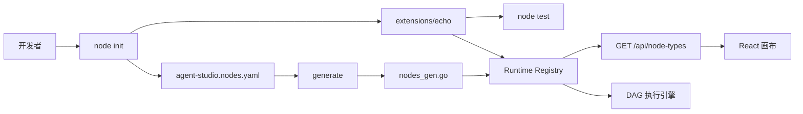
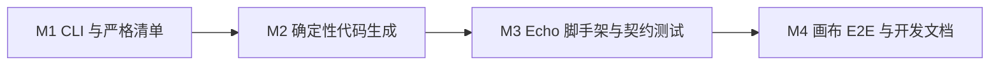

# Agent Studio 节点开发闭环设计

**日期：** 2026-08-18  
**状态：** 已确认设计，待实施计划  
**目标版本：** v0.2 开发者预览版

## 1. 背景与目标

Agent Studio 已具备公开 Go Node SDK、契约测试基础、Runtime Adapter、画布节点定义接口和进程内节点执行能力。下一阶段聚焦仓库内扩展节点的开发闭环，使一名熟悉 Go 的开发者能在 30 分钟内完成节点创建、测试、注册并在画布中运行。

首个里程碑只使用 Echo 节点验证完整链路，不同期建设 Retriever、Webhook、远程插件加载或发布流水线。CLI 首期以源码内运行为主，文档统一使用 `CGO_ENABLED=0 go run ./cmd/agent-studio ...`，同时保持未来 `go install` 的包结构兼容。

## 2. 已确认的产品决策

- 优先支持仓库内 `extensions/` 扩展，不把独立 Go Module 作为首期黄金路径。
- CLI 使用显式分步流程，不在 `node init` 后自动测试或生成。
- 首个闭环示例只包含 Echo，Retriever 和 Webhook 后续追加。
- CLI 先通过源码运行，跨平台二进制随开源发布工程交付。
- 节点发现采用编译期清单和代码生成，不引入热加载。
- 前端继续从 `/api/node-types` 获取节点定义，不增加 Echo 专用组件。

黄金路径固定为：

```text
node init → node test → generate → 启动 API → 画布运行
```

## 3. 范围与非目标

### 3.1 本阶段范围

- 可测试的 `agent-studio` CLI 外壳和稳定退出码。
- `doctor`、`node init`、`node test`、`generate` 四个命令。
- 严格的 `agent-studio.nodes.yaml` 清单。
- 确定性、原子性的节点注册代码生成。
- Server 接入生成的扩展节点注册入口。
- Echo 节点脚手架、契约测试和仓库内示例。
- 生成差异检查、SDK 节点 E2E 和中文快速开始。

### 3.2 明确延后

- 独立 Go Module 的完整脚手架和发布说明。
- Retriever、Webhook 和更多官方示例节点。
- 运行时下载、热加载、Go plugin 或进程外插件。
- 远程模板、节点市场和包索引。
- GoReleaser、GitHub Release 和跨平台二进制发布。
- Capability 沙箱执行与第三方不可信代码隔离。

## 4. 总体架构



架构约束：

- `agent-studio.nodes.yaml` 是扩展节点的唯一声明来源。
- `generate` 只读取清单和 Go 包元数据，不执行节点代码，也不自动下载依赖。
- 生成代码只导入清单包并调用统一的 `Register` 入口。
- 内置节点保留现有注册流程，生成节点作为额外扩展接入同一个 Registry。
- 扩展节点只依赖 `sdk/go/agentnode`；测试可额外依赖 `sdk/go/agenttest`。
- Server 先注册内置节点，再注册清单扩展；任一扩展注册失败时启动失败。

## 5. 命令与组件边界

### 5.1 CLI

CLI 固定提供：

```text
agent-studio doctor
agent-studio node init <name>
agent-studio node test <package>
agent-studio generate
```

`internal/cli` 只负责参数解析、输出和退出码。参数错误返回 2，执行失败返回 1，成功返回 0。所有外部进程均通过参数数组调用，不通过 shell 拼接。

`doctor` 是只读命令，检查 Go 1.26、Node.js 24、Corepack、Docker daemon、Docker Compose v2、当前 manifest 兼容性，以及 5432、8080、5173 端口状态。缺少必备工具或 manifest 不兼容为失败；端口已占用和 PostgreSQL 尚未启动为警告。`doctor` 不启动容器、不安装工具，也不修改文件。

### 5.2 Manifest

`internal/nodemanifest` 严格解析 `agent-studio.nodes.yaml`，拒绝未知字段、未知 API 版本、重复包、非法 Go import path、空节点项和 YAML 多文档输入。首期清单只保存包路径：

```yaml
apiVersion: agent-studio.dev/v1alpha1
nodes:
  - package: github.com/yyl1212/agent-studio/extensions/echo
```

### 5.3 代码生成

`internal/nodegen` 使用 `GOPROXY=off go list -mod=readonly` 确认包已在当前 Module 依赖图和本地模块缓存中可见，按 import path 排序并生成字节级稳定的注册代码。内容不变时不改写文件；内容变化时使用同目录临时文件和原子 rename。所有包验证成功后才触碰目标文件。

生成入口固定为：

```go
func RegisterNodes(registrar agentnode.Registrar) error
```

### 5.4 脚手架

`internal/scaffold` 生成节点实现、契约测试和 README。名称只接受小写 kebab-case，目标固定为 `extensions/<name>`，不得覆盖已有文件或非空目录。节点类型采用 `extension.<name>`，Go 包名通过删除连字符得到；生成前同时校验目录名、节点类型和 Go 包名，拒绝任何不合法结果。

`node init` 完成目录创建和 manifest 登记，但不自动运行 `node test` 或 `generate`。

### 5.5 Echo 扩展

`extensions/echo` 只依赖公开 SDK，提供：

```go
func Register(registrar agentnode.Registrar) error
```

Echo 接收文本与可选前缀，返回拼接结果。契约测试覆盖 Definition、配置、Resolve、Execute、输出 JSON、错误分类和取消行为。

## 6. 数据流与失败策略

### 6.1 正常数据流

1. `node init echo` 创建 `extensions/echo` 并登记 manifest。
2. 开发者实现或修改节点。
3. `node test ./extensions/echo` 执行包测试和 SDK 契约测试。
4. `generate` 校验清单和包路径，生成注册代码。
5. API 编译启动，生成入口把 Echo 注册到 Runtime Registry。
6. `/api/node-types` 返回 Echo Definition，画布自动展示节点。
7. 工作流编译和执行继续经过现有 Runtime Adapter、DAG 编译器和执行引擎。

### 6.2 `node init` 失败策略

- 名称非法、目标不在 `extensions/`、目录非空或 manifest 已包含该包时立即失败。
- 在任何写入前校验名称、目标、模板和 manifest 当前内容。
- manifest 使用原子替换；若更新 manifest 失败，删除本次创建的目录。
- 回滚只删除本次创建的文件，不修改或删除预先存在的内容。
- 操作系统或进程被强制终止时，可能留下完整但未登记的新目录；manifest 仍保持旧的完整版本，重新运行命令会明确报告目录冲突，不会自动删除现场。

### 6.3 `node test` 失败策略

- 只接受当前 Module 内可由 `GOPROXY=off go list -mod=readonly` 解析的包。
- 执行 `CGO_ENABLED=0 go test <package> -count=1`。
- 保留测试进程的原始标准输出和标准错误，失败时返回退出码 1。

### 6.4 `generate` 失败策略

- Manifest 或 `go list` 失败时不修改已有生成文件。
- 不执行 `go get`，不联网下载依赖，不运行节点包的 `init` 或 `Register`。
- 临时文件写入、格式化或 rename 任一步失败时保留旧文件。

### 6.5 Runtime 失败策略

- 重复节点类型、非法 Definition、未知枚举、Schema、端口或版本错误直接阻止 Server 启动。
- 节点运行错误继续使用现有稳定错误分类、公开安全消息和脱敏结构化日志。

## 7. 安全边界

- 扩展节点与 API 同进程、同权限，只允许加载可信源码。
- CLI 不执行 shell 字符串，不接收远程模板 URL，也不隐式下载代码。
- 脚手架不生成明文密钥配置字段。
- Manifest 不声明二进制路径、启动命令、网络地址或密钥。
- 本阶段不把 Capability 描述为强制权限或沙箱。

## 8. 文件地图

### 8.1 新增文件

```text
cmd/agent-studio/main.go
internal/cli/*.go
internal/nodemanifest/*.go
internal/nodegen/*.go
internal/scaffold/*.go
agent-studio.nodes.yaml
apps/api/internal/generated/nodes_gen.go
extensions/echo/*.go
apps/web/e2e/sdk-node.spec.ts
docs/sdk/quickstart.md
docs/sdk/debugging.md
```

### 8.2 修改文件

```text
go.mod
go.sum
apps/api/cmd/server/main.go
Makefile
README.md
docs/node-development.md
apps/web/playwright.config.ts
```

CLI 解析依赖固定使用 `go.yaml.in/yaml/v3` v3.0.4，Go import path 校验使用 `golang.org/x/mod` v0.38.0；这些依赖仅进入 CLI/生成工具，不进入 `sdk/go/agentnode` 的依赖闭包。

每个包保持单一职责：CLI 不包含生成算法，Manifest 不执行文件写入，生成器不解析命令行，脚手架不启动测试或 Server。

## 9. 里程碑



### M1：CLI 与严格清单

交付 CLI 外壳、稳定退出码、基础 `doctor`、manifest 严格解析和对应单元测试。非法清单不得进入生成阶段。

### M2：确定性代码生成

交付 `go list` 包验证、原子生成、Server 注册入口、`make generate` 和 `make check-generated`。相同清单重复生成不得产生 Git 差异。

### M3：Echo 脚手架与契约测试

交付 `node init`、`node test`、Echo 标准模板、契约测试、非空目录保护和失败回滚测试。删除 Echo 后，仅通过 CLI 黄金路径可重新创建、测试和注册它。

### M4：画布闭环与文档

交付节点类型 API 回归、画布自动展示 Echo、Playwright SDK 节点 E2E、中文快速开始和故障排查。目标用户在 30 分钟内完成新节点首次运行。

## 10. 测试与质量门

测试分层：

- CLI 表驱动测试：参数、输出、退出码和子进程错误传播。
- Manifest 单元测试：未知字段、版本、路径、重复项和多文档。
- Generator 单元测试：排序、别名、原子写入、mtime 和失败不覆盖。
- Scaffold 快照与文件系统测试：模板、非空目录、manifest 更新和回滚。
- Echo 契约测试：公开 SDK 行为。
- Runtime 集成测试：生成入口注册后完成编译和执行。
- 前端与 Playwright：无需专用组件即可展示并运行 Echo。

最终质量门：

```bash
CGO_ENABLED=0 go test ./... -count=1
CGO_ENABLED=0 go vet ./...
make check-generated
make verify
make test-e2e
make test-sdk-e2e
git diff --check
```

## 11. 可行性与风险审查

### 11.1 已确认无阻塞的基础

- `agentnode.Registrar` 已存在，Runtime Registry 已实现该接口。
- 根 Go Module 已完成迁移，`extensions/*` 可直接参与同模块构建。
- 前端节点定义来自 API，不需要 Echo 专用 UI。
- `apps/api/internal/generated` 可被 Server 导入，也可导入根 Module 下的扩展包，不违反 Go `internal` 可见性。
- 扩展包只依赖公开 SDK，因此不会与 Server 或生成包形成导入循环。

### 11.2 需要控制的风险

- 脚手架跨目录和 manifest 写入的一致性：通过全量预校验、manifest 原子替换和仅删除本次创建内容的回滚处理。
- 生成器误执行或下载第三方代码：使用 `GOPROXY=off go list -mod=readonly` 获取包元数据，生成期不导入或运行 Register；生产启动时才执行已编译、受信任的注册代码。
- 生成漂移：把 `make check-generated` 纳入 `make verify` 和 CI。
- CLI 依赖膨胀：仅新增严格 YAML 解析与 Go import path 校验依赖，不把它们暴露到公共节点 SDK。
- 文档与真实命令漂移：快速开始的黄金路径由 `make test-sdk-e2e` 在临时目录中真实执行。

审查结论：本设计不存在尚未解决的实现阻塞。进程内扩展的权限边界已明确延后到进程外插件阶段，不影响本阶段可信源码开发闭环。

## 12. 成功标准

- 新开发者按中文快速开始，在 30 分钟内让新节点首次出现在画布并成功运行。
- `node init` 不覆盖用户文件，失败不会留下半更新 manifest。
- `node test` 对契约失败返回非零退出码并保留完整测试输出。
- `generate` 对同一输入字节级稳定，失败时不破坏旧生成文件。
- Echo 不依赖 Runtime internal 包，也不需要前端专用组件。
- 所有质量门稳定通过，无已知 P0、P1、P2 阻塞项。
