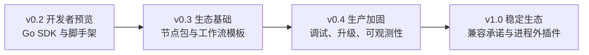
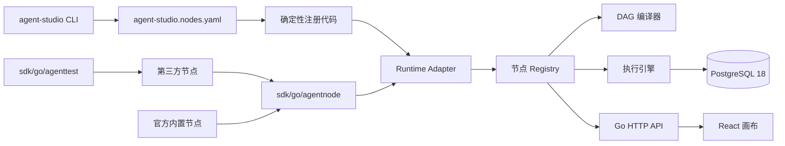

# Agent Studio 开源 SDK 路线设计

**日期：** 2026-08-18  
**仓库：** `https://github.com/yyl1212/agent-studio`  
**状态：** 已完成需求确认，待实施计划  
**目标版本：** `v0.2.0` 开发者预览版

## 1. 背景与目标

Agent Studio 当前已经完成单机 MVP：用户可以在 React Flow 画布中配置工作流，由开始节点参数生成聚焦式 Agent 页面，通过 Go DAG 引擎执行并把工作流、版本和运行记录保存到 Docker PostgreSQL。

下一阶段不以堆叠业务节点为主要目标，而是把现有节点扩展机制建设为公开、可测试、可发布的 Go SDK。产品同时服务两类用户：低代码用户通过画布使用 Agent，Go 开发者通过 SDK 扩展节点能力。

`v0.2.0` 的成功标准是：一名熟悉 Go 的新开发者仅依赖公开文档，能在 30 分钟内创建、测试、注册并在画布中运行一个节点。

## 2. 已确认的产品决策

- 产品路线：开源 Agent 开发框架。
- 核心用户：低代码用户和 Go 开发者兼顾，首期资源向 Go SDK 倾斜。
- 扩展边界：先提供进程内源码 SDK，同时为未来进程外插件保留稳定的数据协议。
- 发布目标：4–6 周内发布开发者预览版。
- 开源许可证：Apache-2.0。
- 实施策略：SDK 优先，不在首期建设插件市场后台、热加载和插件进程管理。
- 公开模块：`github.com/yyl1212/agent-studio`。

## 3. 范围与非目标

### 3.1 v0.2 范围

- 公开 Go Node SDK。
- SDK 契约测试工具。
- 节点脚手架、测试、生成和环境诊断 CLI。
- 声明式节点清单与确定性注册代码生成。
- Echo、Retriever、Webhook 三类示例节点。
- 本地节点调试日志和稳定错误分类。
- SDK 快速开始、API 文档、兼容策略和贡献文档。
- GitHub Actions、GoReleaser、Docker 镜像、SBOM 和校验和。
- Apache-2.0 许可证和安全问题报告流程。

### 3.2 明确延后

- 运行时下载或热加载任意节点代码。
- Go `plugin`、动态链接库或跨平台动态库扫描。
- 进程外插件生命周期管理和沙箱执行。
- 插件市场服务端、评分、支付和审核系统。
- 多租户、团队权限、计费和配额。
- 分布式执行队列和运行恢复。
- 完整知识库产品能力。

## 4. 版本路线



### 4.1 v0.2：开发者预览

建立公共 SDK、契约测试、CLI、节点清单、示例和发布工程。该版本允许遵循迁移说明的小范围 API 调整，不承诺 v1 级别的长期兼容。

### 4.2 v0.3：生态基础

定义节点包的分发元数据和兼容检查，支持工作流模板导入导出，建设基于 Git 仓库索引的轻量插件目录，并扩展模型、向量库、搜索和文件处理类官方节点。

### 4.3 v0.4：生产加固

增加单步调试、节点数据查看、失败重试、工作流版本差异与回滚、OpenTelemetry、备份恢复、密钥引用管理以及运行资源配额。

### 4.4 v1.0：稳定生态

冻结 Node SDK v1 兼容承诺，引入进程外插件协议、插件签名、权限声明、能力隔离和从进程内节点迁移到进程外插件的适配层。

## 5. 总体架构



普通节点只依赖公共 SDK。Runtime Adapter 负责把 SDK 类型接入现有 Registry、编译器和执行引擎。前端继续从 `/api/node-types` 读取节点定义，新增普通节点不维护前端映射。

## 6. Go 模块与代码布局

现有 Go Module 从 `apps/api` 提升到仓库根目录，模块路径改为：

```text
github.com/yyl1212/agent-studio
```

公开 SDK 使用：

```go
import "github.com/yyl1212/agent-studio/sdk/go/agentnode"
```

CLI 使用：

```bash
go install github.com/yyl1212/agent-studio/cmd/agent-studio@v0.2.0
```

计划新增或调整的核心文件：

```text
go.mod
go.sum
LICENSE
SECURITY.md
CONTRIBUTING.md
CODE_OF_CONDUCT.md
agent-studio.nodes.yaml

sdk/go/agentnode/
  node.go
  definition.go
  errors.go
  schema.go
  capability.go
  compatibility.go

sdk/go/agenttest/
  contract.go
  execute.go
  cancellation.go

cmd/agent-studio/
  main.go
  node_init.go
  node_test_cmd.go
  generate.go
  doctor.go
  version.go

apps/api/internal/nodes/
  adapter.go

apps/api/internal/generated/
  nodes_gen.go

apps/api/cmd/server/main.go                 # 接入生成的节点注册入口
apps/api/internal/nodes/builtin/*.go        # 逐步迁移到公共 SDK

examples/nodes/
  echo/
  retriever/
  webhook/

docs/sdk/
  quickstart.md
  api.md
  compatibility.md
  debugging.md
```

Go Module 提升是一次机械迁移：将内部导入从 `agentstudio.local/api/internal/...` 更新为 `github.com/yyl1212/agent-studio/apps/api/internal/...`。`apps/api/internal` 的 Go internal 可见性规则仍然有效，公共 SDK 不依赖内部包。

## 7. SDK 公共契约

### 7.1 核心接口

公共 SDK 提供下列稳定概念：

- `Node`：组合 Definition、Resolve 和 Execute 行为。
- `Definition`：类型、版本、标题、分类、说明、配置 JSON Schema、静态端口和能力声明。
- `Resolve`：根据节点配置解析动态输入输出端口。
- `Execute`：接收 `context.Context`、配置、运行输入和上游端口输入，返回输出及激活端口。
- `Registrar`：向 Runtime 注册节点的最小接口。
- `DataType`、`Cardinality`、`Port`：稳定的数据和端口模型。
- `Capability`：声明网络、密钥、文件读取或文件写入能力。

能力声明在 v0.2 中属于可校验元数据，进程内执行无法形成强安全边界；该字段用于文档提示、审查和未来进程外插件的权限模型，不能被描述为沙箱。

### 7.2 不公开的内部结构

- PostgreSQL Store 与 migration。
- HTTP handler 和传输层模型。
- DAG 调度器内部状态。
- React Flow 节点与边类型。
- 运行记录持久化观察器。

### 7.3 版本规则

- SDK 和 Runtime 均报告语义化版本。
- `v0.x` 的破坏性变更必须提供迁移说明并限制在次版本发布。
- 节点 `type + version` 唯一；行为或端口不兼容时增加节点版本。
- `v1.0` 后公共 SDK 遵循 Go 语义化导入版本规则。
- 清单 API 在 v0.2 使用 `agent-studio.dev/v1alpha1`，稳定前允许显式升级。

## 8. 节点发现与代码生成

首期只支持编译期发现。根目录节点清单使用明确的 Go 包导入路径：

```yaml
apiVersion: agent-studio.dev/v1alpha1
nodes:
  - package: github.com/yyl1212/agent-studio/extensions/echo
  - package: github.com/example/agent-nodes/retriever
```

每个节点包提供统一入口：

```go
func Register(registrar agentnode.Registrar) error
```

`agent-studio generate` 执行以下步骤：

1. 严格解析并校验清单版本、重复项和包路径。
2. 使用 `go list` 确认包已经存在于当前 Module 依赖图。
3. 为每个包分配确定性导入别名。
4. 原子生成 `apps/api/internal/generated/nodes_gen.go`。
5. 格式化生成代码，并在内容不变时不改写文件。

生成文件只导入节点包并调用其 `Register`。外部节点需先通过 `go get` 或 `go mod replace` 加入依赖图。CLI 不隐式下载或执行未声明的远程代码。

## 9. 开发者工作流

```text
克隆仓库
  → agent-studio node init
  → 编写节点
  → agent-studio node test
  → agent-studio generate
  → make dev
  → 在画布中配置并运行
```

命令职责：

- `agent-studio node init extensions/my-node`：生成节点实现、Schema、单元测试和 README，并可选择写入节点清单。
- `agent-studio node test ./extensions/my-node`：运行包测试和 SDK 契约测试。
- `agent-studio generate`：生成节点注册代码。
- `agent-studio doctor`：检查 Go 1.26、Node.js 24、Corepack、Docker、PostgreSQL、SDK/Runtime 兼容性和本地端口。

`node init` 默认生成仓库内扩展；外部 Go Module 使用相同接口和测试工具。修改节点清单后必须重新生成并编译服务。

## 10. 错误、安全与资源约束

### 10.1 错误分类

SDK 提供稳定分类：配置错误、输入错误、临时故障、取消和内部失败。第三方节点的底层错误不会直接返回 Agent 页面。

- Agent 页面只接收稳定错误码和安全中文消息。
- 本地开发日志记录 `runId`、`nodeId`、节点类型和底层错误。
- `agent-studio node test` 显示完整开发错误。
- Runtime 继续通过请求 ID 关联公开错误和服务端日志。

### 10.2 安全规则

- 节点必须尊重 `context.Context` 取消和超时。
- 输出必须能被 JSON 序列化，并接受大小限制。
- 节点配置不能保存明文密钥，只保存密钥引用。
- Authorization、Cookie、API Key、Token 和 Secret 统一脱敏。
- 网络节点继续执行 DNS 解析后地址校验、同源重定向限制和响应大小限制。
- 进程内第三方节点与 API 进程具有同等权限；README 和安全文档必须明确该信任边界。

## 11. 测试与质量门

### 11.1 测试分层

- SDK 单元测试：公共类型、Schema、能力和版本兼容。
- 节点契约测试：端口唯一、配置校验、取消响应、输出序列化、输出大小和错误分类。
- Runtime 集成测试：第三方示例节点通过 Registry 完成编译与执行。
- CLI 快照测试：脚手架和生成代码保持确定性。
- 前端测试：节点定义和动态端口无需前端专用组件即可渲染。
- E2E：脚手架生成 Echo 节点后，在真实画布中配置、连线和运行。
- 发布冒烟：全新 clone、空 PostgreSQL、Mock 模型完成启动、测试、发布和 Agent 运行。

### 11.2 发布质量门

- `CGO_ENABLED=0 go test ./... -count=1`
- `CGO_ENABLED=0 go vet ./...`
- 代码生成后 `git diff --exit-code`
- 前端 typecheck、组件测试和生产构建
- PostgreSQL 集成测试
- Playwright 双版本绑定回归和 SDK 节点回归
- `git diff --check`
- 依赖漏洞和许可证检查
- Docker 镜像启动与 `/readyz` 检查

## 12. 发布与社区基础

- GitHub Actions 使用 Go 1.26、Node.js 24 和 PostgreSQL 18。
- GoReleaser 构建 macOS/Linux、amd64/arm64 CLI 二进制及校验和。
- Docker 镜像发布到 `ghcr.io/yyl1212/agent-studio`。
- Release 同时提供 SBOM、依赖许可证清单和中文变更日志。
- 许可证为 Apache-2.0。
- 建立贡献指南、行为准则、安全报告流程和 Issue/PR 模板。
- README、SDK 快速开始和贡献入口提供中英文版本；深入设计文档可以中文优先。

## 13. 4–6 周实施节奏

### 第 1 周：模块与契约

提升 Go Module，建立公共 SDK 和 Runtime Adapter，迁移至少一个官方节点，同时保持现有回归全部通过。

### 第 2 周：契约测试与官方节点迁移

建立 `agenttest`，迁移全部官方节点，补充结构化开发日志，删除旧内部节点接口。

### 第 3 周：CLI 与代码生成

实现 `node init`、`node test`、`generate`、`doctor`，建立节点清单和 Echo 示例。

### 第 4 周：示例和文档

补充 Retriever、Webhook、SDK API、调试、兼容策略、贡献和安全文档。

### 第 5 周：发布工程

建立 CI、GoReleaser、Docker 多架构镜像、SBOM 和 `v0.2.0-rc.1` 发布流程。

### 第 6 周：外部试用与修订

邀请少量开发者完成节点开发任务，只修复阻塞问题，发布 `v0.2.0`。

## 14. 成功指标

- 新节点首次运行中位时间不超过 30 分钟。
- 至少 3 个仓库外示例节点通过 SDK 契约测试。
- 全新环境按照文档启动成功率达到 90% 以上。
- SDK API 文档覆盖全部公开类型。
- 发布产物在支持的平台上通过空库 Mock 冒烟。
- 无已知高危安全问题。
- 发布分支全部质量门稳定通过。

## 15. 可行性与阻塞项审查

### 15.1 已验证可行

- 当前 Registry、Definition、Resolve、Execute 已形成清晰边界，可以平移为公共 SDK。
- 前端由服务端节点定义和 JSON Schema 驱动，普通节点迁移不会要求建立前端类型映射。
- Go Module 提升不会破坏 `apps/api/internal` 可见性，只需要机械更新导入路径和构建命令。
- 编译期清单与代码生成符合 Go 的静态链接模型，可跨 macOS/Linux 使用，规避 Go `plugin` 的平台限制。
- 现有 Mock 模型、Docker PostgreSQL 和 E2E 可以直接复用为 SDK 发布冒烟底座。

### 15.2 主要风险与缓解

| 风险 | 影响 | 缓解措施 |
|---|---|---|
| 过早冻结错误的 SDK | 第三方节点迁移成本高 | v0.2 标记开发者预览；先迁移全部官方节点和 3 类示例，再发布 RC |
| 根 Module 迁移造成大面积导入变化 | 回归范围扩大 | 独立提交机械迁移；生成前后运行完整 Go、Web、E2E 回归 |
| 第三方进程内节点拥有宿主权限 | 安全边界弱 | 明确信任模型；能力声明只作元数据；未知节点默认不进入官方镜像 |
| 代码生成文件漂移 | 构建不可复现 | 确定性排序、原子写入、格式化、CI 差异检查 |
| CLI 范围失控 | 延误开发者预览 | v0.2 只实现四个命令；打包、搜索和安装留到 v0.3 |
| 双语文档维护成本 | 文档不一致 | 只要求 README、快速开始和贡献入口双语；中文为设计文档主语言 |

### 15.3 审查结论

方案没有阻塞性技术问题。最高风险是公共 SDK 边界过早固化，因此实施顺序必须坚持“公共契约 → 官方节点迁移 → 外部示例 → RC 反馈 → 正式预览”，不能先发布 SDK 再验证。进程外插件、热加载和市场后台均已移出 v0.2，4–6 周开发者预览目标具备可行性。

## 16. 实施门禁

本设计获最终复核后，下一步只编写详细实施计划，不直接修改 SDK 代码。实施计划必须：

1. 先由用户选择当前 `codex/agent-studio` 的集成方式，确保本地 `master` 已包含完整 MVP 基线。
2. 从该本地 `master` 创建新的 `codex/` SDK 功能分支，不直接在当前 MVP 收尾分支继续开发。
3. 将 Module 迁移、SDK 契约、官方节点迁移、CLI、示例、文档和发布工程拆成可独立验证的任务。
4. 每个功能遵循测试先行，并在阶段边界执行代码审查。
5. 所有 Go 调试和测试使用 `CGO_ENABLED=0`。
6. 完成后重新运行全量质量门、真实浏览器回归和空库发布冒烟。
