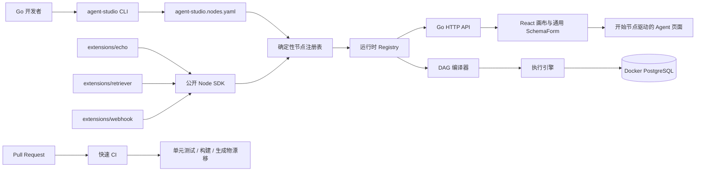
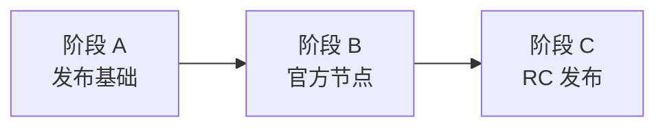
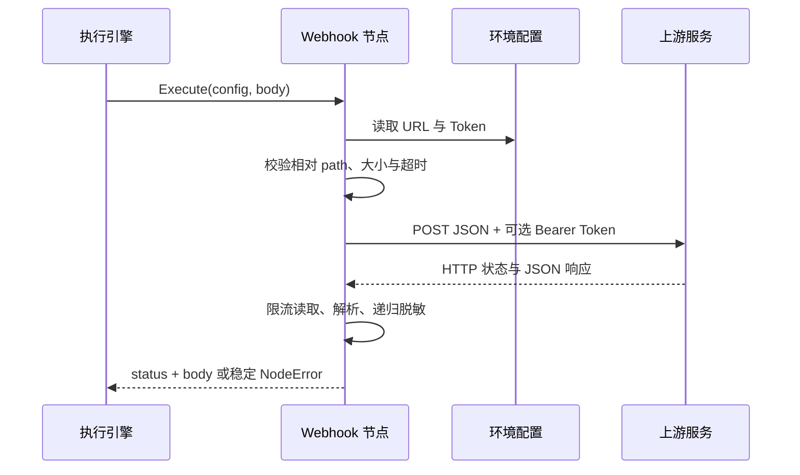

# Agent Studio v0.2 源码开发者预览设计

- **日期：** 2026-08-18
- **仓库：** `https://github.com/yyl1212/agent-studio`
- **目标版本：** `v0.2.0-rc.1`
- **状态：** 设计已确认，待书面审阅
- **实施方式：** 三阶段小步交付，每阶段独立计划、审查和回归

## 1. 背景

Agent Studio 已具备 Go API、React 画布、Docker PostgreSQL、DAG 编译与执行、由开始节点参数生成 Agent 页面、公开 Go Node SDK、节点脚手架与代码生成 CLI，以及默认注册的 Echo 扩展节点。

下一步不是扩大平台边界，而是把现有能力整理为可公开试用的源码开发者预览版，并用两个有代表性的官方扩展验证节点 SDK：

- Retriever 验证纯本地、可重复的数据处理节点。
- Webhook 验证受约束的网络与密钥节点。
- 快速 CI、版本信息和社区治理文件验证仓库可以接受外部开发者试用与贡献。

本规格在 `v0.2.0-rc.1` 的发布形态、官方节点位置和 CI 范围方面取代 `2026-08-18-open-source-sdk-roadmap-design.md` 中对应的旧设想。旧文档仍作为长期路线背景，但其 GoReleaser、镜像、SBOM、外部 manifest 包和 `examples/nodes` 方案不属于本次实施依据。既有 `2026-08-18-open-source-release-engineering.md` 以及 `2026-08-18-open-source-sdk-tooling.md` 中尚未执行的 Retriever、Webhook 和发布任务同样不得继续直接执行，必须由本规格的阶段计划替代。

## 2. 目标与成功标准

本轮目标是发布一个以源码为中心的 `v0.2.0-rc.1` 开发者预览版。

发布成功必须同时满足：

1. 新开发者可从源码启动 Docker PostgreSQL、Go API 和 React 前端。
2. Echo、Retriever、Webhook 默认出现在画布节点列表中，无需修改前端节点映射。
3. Retriever 的相同配置和输入始终得到相同结果。
4. Webhook 只能访问运维人员通过环境变量指定的基地址，用户配置不能覆盖主机。
5. Pull Request 自动执行不依赖 Docker 的快速验证。
6. 发布前在本地执行 PostgreSQL、API、SDK 和 Playwright 完整门禁。
7. `go install github.com/yyl1212/agent-studio/cmd/agent-studio@v0.2.0-rc.1` 可安装 CLI，且 `agent-studio version` 报告该 RC 版本。
8. 仓库具备 Apache-2.0 许可证、贡献、安全和行为准则等基础治理文件。

## 3. 已确认的产品决策

- 发布形态：源码与 GitHub CI，不发布二进制附件或容器镜像。
- CI 强度：Go 和前端的单元测试、静态检查、类型检查、构建与生成物漂移检查。
- 发布载体：带注释 Git 标签与 GitHub Pre-release。
- 主分支：仓库实际使用 `main`；项目规范中的“拉取 master”按“拉取当前主分支”执行，即同步 `origin/main`。
- 官方扩展：Retriever、Webhook 位于 `extensions/retriever` 和 `extensions/webhook`，通过根 manifest 默认注册。
- 节点边界：两个扩展只能依赖公开 `sdk/go/agentnode` 和 Go 标准库，不导入 `apps/api/internal`。
- 开发策略：测试驱动，小提交；阶段完成后先审查和回归，再进入下一阶段。
- 许可证：Apache-2.0。

## 4. 范围与非目标

### 4.1 本轮范围

- Retriever 与 Webhook 两个官方扩展节点。
- manifest、生成注册表、节点类型 API 和通用 Schema 表单的必要适配与回归。
- 构建版本、提交号和 CLI/API 启动日志中的版本信息。
- 不依赖 Docker 的 `make verify-quick` 与 GitHub Actions。
- Apache-2.0、NOTICE、贡献、安全、行为准则、Issue 和 PR 模板。
- 中文 SDK 使用文档与 `v0.2.0-rc.1` Release Notes。
- RC 前完整人工发布门禁和 RC 后安装冒烟验证。

### 4.2 明确不做

- 二进制附件、GitHub Container Registry、生产镜像和 GoReleaser。
- SBOM、校验和、签名、漏洞扫描和许可证扫描自动化。
- Docker、PostgreSQL 或 Playwright GitHub Actions。
- 运行时热加载、远程下载、进程外插件、插件市场和沙箱。
- 向量数据库、Embedding、语义检索或完整知识库产品。
- 通用任意 URL Webhook、动态请求头编辑器或 OAuth。
- 数据库迁移、分布式执行、重试队列和运行恢复。

## 5. 总体架构



新增节点继续沿用单一路径：Definition 经 Registry 暴露到 `/api/node-types`，画布根据 JSON Schema 渲染配置；保存的图由编译器固化端口，再由调度器执行。节点执行结果必须使用编译期端口快照规范化，执行期不得再次解析端口。

## 6. 交付分解



本轮横跨发布工程、节点实现和外部发布三个边界，不合并成一个大型实施计划：

- 阶段 A：治理、版本、快速 CI，预计 3–4 个净开发日。
- 阶段 B：Retriever、Webhook、默认注册与画布回归，预计 4–6 个净开发日。
- 阶段 C：完整验证、Release Notes、标签和 GitHub Pre-release，预计 2–3 个净开发日。

总开发量预计 9–13 个净开发日，不包含外部评审等待。任何阶段未通过自身门禁时，下一阶段不得开始。

## 7. Retriever 节点

### 7.1 公共定义

| 字段 | 约定 |
|---|---|
| 类型 | `extension.retriever` |
| 版本 | `1.0.0` |
| 分类 | `扩展` |
| 配置 | `documents: [{id, text}]`、`topK` |
| 输入 | `query: string`，必填、单值 |
| 输出 | `matches: json`，单值 |
| 能力 | 无 |

`documents` 和 `topK` 都是必填配置。配置约束：

- `documents` 至少 1 项、最多 1000 项。
- `id` 去除首尾空白后不能为空，长度不超过 128，并且在配置中唯一。
- `text` 去除首尾空白后不能为空，长度不超过 65536，并且分词后至少包含一个 token。
- `topK` 为 1–100 的整数；返回数量为 `min(topK, len(documents))`。
- 未知配置字段被拒绝。

`Resolve` 负责解码和校验配置，并返回 Definition 中的静态端口。无效配置统一返回 `config/invalid_config`。

### 7.2 检索算法

Retriever 是确定性的本地演示实现，不连接外部服务：

1. 对 query 和 document text 做 Unicode 小写转换。
2. 以“非 Unicode 字母且非 Unicode 数字”的字符作为分隔符。
3. 去除空 token，并将 token 列表转换为集合。
4. 计算 Jaccard 分数：`|query ∩ document| / |query ∪ document|`。
5. 使用未舍入分数降序稳定排序；分数相同时保持 documents 原始顺序。
6. 输出分数四舍五入到小数点后 6 位。

空白 query 或分词后没有 token 的 query 返回 `input/invalid_query`。即使全部文档得分为 0，也按原始顺序返回前 `topK` 项。输出结构固定为：

```json
{
  "matches": [
    {"id": "doc-1", "text": "...", "score": 0.5}
  ]
}
```

文档配置只用于 SDK 和画布演示；README 必须明确它不是向量检索、Embedding 或生产知识库。

## 8. Webhook 节点

### 8.1 公共定义

| 字段 | 约定 |
|---|---|
| 类型 | `extension.webhook` |
| 版本 | `1.0.0` |
| 分类 | `扩展` |
| 配置 | `path`、`timeoutMs` |
| 输入 | `body: json`，必填、单值 |
| 输出 | `status: number`、`body: json` |
| 能力 | `network`、`secrets` |
| 方法 | 固定 `POST` |

运行配置来自环境变量：

- `AGENT_STUDIO_WEBHOOK_URL`：必填的基地址。
- `AGENT_STUDIO_WEBHOOK_TOKEN`：可选；非空时设置 `Authorization: Bearer <token>`。

节点配置不得包含主机、Token 或任意请求头。`path` 是必填配置，必须是非空相对路径，不允许 scheme、host、userinfo、query、fragment、绝对路径、反斜杠或 `..` 路径段；URL 解码后重新执行同样的路径检查。基地址必须是带 host 的 `http` 或 `https` URL，且不允许 userinfo、query 或 fragment；使用 URL path join 将相对 path 附加到基地址已有路径。基地址由服务运维人员控制，因此允许指向其明确配置的内网服务。

`timeoutMs` 默认 5000，范围 1–30000。序列化后的请求体和读取的响应体分别限制为 1 MiB。客户端禁止自动跟随重定向。

### 8.2 数据流



### 8.3 响应和错误

- 2xx 且响应为合法 JSON：返回 `status` 和解析后的 `body`。
- 204 或空的 2xx 响应：返回 `status` 和 `body: null`。
- 普通 4xx：返回 `input/webhook_rejected`。
- 408、429、5xx、网络错误、超时、重定向、响应超限或非法 JSON：返回 `temporary/upstream_failed`。
- 调用上下文取消：返回 `canceled/run_canceled`。
- 缺少或非法基地址：返回 `internal/missing_webhook_configuration`。
- 非法 path 或 timeout：返回 `config/invalid_config`。
- 输入类型、输入基数或序列化请求体超过 1 MiB：返回 `input/invalid_body`。

取消、超时和安全哨兵错误必须保留可供 `errors.Is` / `errors.As` 使用的安全原因链。包含目标 URL 的 `url.Error`、原始响应正文或其他敏感传输错误不得直接进入 NodeError；节点将其转换为不含目标和正文的安全哨兵原因。公开 `Error()`、Details、运行事件、持久化错误和日志字段中不得出现 Token、完整目标 URL 或未筛选的响应正文。

对成功 JSON 响应进行递归脱敏：任何字符串值中出现的 Token 都替换为 `[REDACTED]`。响应头不作为节点输出，避免 Cookie、认证头等旁路泄漏。

## 9. 画布与注册集成

根 manifest 调整为：

```yaml
apiVersion: agent-studio.dev/v1alpha1
nodes:
  - package: github.com/yyl1212/agent-studio/extensions/echo
  - package: github.com/yyl1212/agent-studio/extensions/retriever
  - package: github.com/yyl1212/agent-studio/extensions/webhook
```

生成器继续只接受当前 module 下的 `extensions/<single-kebab-name>` 包。本轮不恢复旧设计中的任意外部包导入，也不绕开 generator 手工编辑 `apps/api/internal/generated/nodes_gen.go`。

前端不新增 RetrieverForm 或 WebhookForm。现有通用 SchemaForm 继续负责配置渲染，只做对所有节点都适用的增强：

- 数组新增对象项时根据 item schema 产生对象默认值，而不是空字符串。
- 支持并测试 `minItems`、`maxItems` 的交互与校验提示。
- 回归数组对象的新增、编辑、删除、保存和重新加载。

节点能力元数据仍通过 NodeDefinition API 返回。本轮不新增能力授权 UI；能力字段是审查和未来隔离机制的元数据，不构成进程内安全沙箱。

## 10. 版本设计

新增 `internal/buildinfo`，分离 SDK 契约版本与应用构建版本：

- `agentnode.Version = 0.2.0` 保持为公开 SDK/API 契约版本。
- 源码开发构建显示 `0.2.0-dev`。
- `go install ...@v0.2.0-rc.1` 构建显示 `v0.2.0-rc.1`。

解析顺序：

1. 测试或特殊构建显式注入的版本覆盖值。
2. `runtime/debug.ReadBuildInfo().Main.Version` 中非 `(devel)` 的模块版本。
3. 回退到 `0.2.0-dev`。

提交号优先读取 Go 构建设置 `vcs.revision`，缺失时显示 `unknown`；`vcs.modified` 始终解析为布尔值。CLI `version` 使用稳定格式：

```text
agent-studio <buildVersion> (sdk <sdkVersion>; api <apiVersion>; commit <revision>; dirty <true|false>)
```

API 服务启动日志使用同一 buildinfo，分别写入 `version`、`sdk_version`、`api_version`、`commit` 和 `dirty` 字段，不各自维护常量。

`scripts/check-version.sh <tag>` 校验：

- tag 满足 `v<major>.<minor>.<patch>-rc.<number>`。
- tag 基础版本与 `agentnode.Version` 一致。
- 对应 `docs/releases/<tag>.md` 存在。
- Git 工作区没有未提交或未跟踪的非忽略文件。

当前本地 pnpm store 位于仓库根目录，因此 `.gitignore` 增加 `/.pnpm-store/`，避免依赖缓存永久阻塞发布检查；不删除或改写已有缓存内容。

## 11. 快速 CI

新增 `.github/workflows/ci.yml`，触发条件是 Pull Request 和 push 到 `main`，默认权限仅为 `contents: read`。工作流使用 `go.mod`/toolchain 指定的 Go 1.26、Node.js 24、Corepack 和锁定的 pnpm 版本。

两个 Job 并行执行：

### 11.1 Go Job

1. Checkout。
2. Setup Go 并启用模块缓存。
3. `CGO_ENABLED=0 go run ./cmd/agent-studio generate`。
4. 检查 `apps/api/internal/generated/nodes_gen.go` 无漂移。
5. `CGO_ENABLED=0 go test ./... -count=1`。
6. `CGO_ENABLED=0 go vet ./...`。

不提供 `TEST_DATABASE_URL`，数据库集成测试必须按现有约定跳过，不能尝试连接 CI 中不存在的 PostgreSQL。

### 11.2 Web Job

1. Checkout。
2. Setup Node.js 24 与 pnpm 缓存。
3. 使用 frozen lockfile 安装依赖。
4. 生成前端 OpenAPI 客户端并检查 `apps/web/src/lib/api/generated.ts` 无漂移。
5. 执行 lint、单元测试、显式类型检查和生产构建。

Makefile 新增 `verify-quick`，在本地复现上述 Go 与 Web 检查，但不调用 `db-up`。CI 不运行 Docker、PostgreSQL、Playwright、漏洞扫描或许可证扫描。

## 12. 完整发布门禁

创建标签前必须在本地 Docker PostgreSQL 环境依次通过：

```bash
make verify
make test-e2e
make test-sdk-e2e
```

同时满足：

- `make verify-quick` 通过。
- 生成文件无漂移。
- 计划内代码审查无 P0、P1、P2。
- 治理文档和 Release Notes 无占位内容。
- `scripts/check-version.sh v0.2.0-rc.1` 通过。
- 当前提交位于已同步的 `origin/main`。
- 工作区干净。

标签推送后、创建 GitHub Release 前，在新临时目录执行：

```bash
go install github.com/yyl1212/agent-studio/cmd/agent-studio@v0.2.0-rc.1
agent-studio version
```

安装命令必须从公开 tag 解析成功且输出 `v0.2.0-rc.1`。若该步骤失败，不改写标签；修复后使用下一个 RC。

## 13. 开源治理与发布

新增：

```text
LICENSE
NOTICE
CONTRIBUTING.md
SECURITY.md
CODE_OF_CONDUCT.md
.github/
├── ISSUE_TEMPLATE/
│   ├── bug_report.yml
│   ├── feature_request.yml
│   └── config.yml
└── pull_request_template.md
```

- `LICENSE` 使用完整 Apache License 2.0 文本。
- `NOTICE` 标明 Agent Studio 及 2026 年项目贡献者，不声明未拥有的第三方版权。
- `CONTRIBUTING.md` 说明 `main`、`codex/*`、TDD、生成文件和本地验证流程。
- `SECURITY.md` 说明支持的预览版本，并引导通过 GitHub Security Advisory 私密报告漏洞。
- `CODE_OF_CONDUCT.md` 使用 Contributor Covenant 2.1，并提供项目维护者可执行的联系渠道。
- Issue/PR 模板要求复现、环境、测试和安全信息，避免在公开 Issue 粘贴密钥。

`docs/releases/v0.2.0-rc.1.md` 是 Release 正文的版本库来源。发布步骤为：

1. 在已通过门禁的 `main` 提交上创建带注释标签。
2. 推送不可变标签 `v0.2.0-rc.1`。
3. 完成公开 tag 的安装冒烟验证。
4. 创建标记为 Pre-release 的 GitHub Release。
5. 只使用 GitHub 自动提供的源码归档，不上传二进制、镜像、SBOM 或其他附件。

## 14. 测试矩阵

### 14.1 Retriever

- Definition、Resolve 与 SDK contract。
- 空 documents、重复 ID、空文本、未知字段和 `topK` 上下界。
- 空 query、错误输入类型和错误基数。
- Unicode 小写、分词、Jaccard 交并集。
- 分数降序、同分稳定顺序、零分结果和 `topK > documents`。
- 分数六位小数与多次执行的字节级确定性。
- 输入配置、Result map 和返回切片不共享可变顶层容器。

### 14.2 Webhook

- Definition、能力、Resolve 与 SDK contract。
- 基地址缺失/非法、path 穿越、绝对地址、query、fragment 和 timeout 边界。
- 使用 `httptest.Server` 覆盖 2xx、204、普通 4xx、408、429、5xx。
- 请求方法、Content-Type、JSON body 和可选 Authorization。
- 上下文取消、客户端超时、连接错误和禁止重定向。
- 请求/响应 1 MiB 边界、非法 JSON 和空响应。
- Token 在嵌套对象、数组、字符串、错误与日志字段中的脱敏。
- ErrorKind、Code 和底层错误链。

### 14.3 集成与前端

- 生成注册表顺序固定且包含三个扩展。
- `/api/node-types` 返回 Retriever、Webhook Definition 与能力。
- 编译和执行只使用编译期 ResolvedPorts。
- SchemaForm 数组对象默认值、限制、编辑、删除和校验。
- Studio 保存、重新加载两个节点的配置。
- Playwright 覆盖节点可选、连线、草稿运行和安全错误展示。

### 14.4 发布工程

- buildinfo 的 override、module version、devel、revision 与 dirty 分支。
- CLI 和 API 日志消费同一 buildinfo。
- 标签格式、SDK 基础版本、Release Notes 和工作区状态检查。
- GitHub Actions 使用的命令可由 `make verify-quick` 本地复现。

## 15. 失败处理与回滚

- CI 失败直接阻止合并，不在工作流中自动改写代码或生成物。
- 阶段 A/B 合并后出现回归，使用独立 revert 提交恢复，不改写 `main` 历史。
- Webhook 未配置环境变量时只使该节点运行失败，不影响服务启动和其他节点。
- 官方扩展需临时下线时，从 manifest 移除并重新生成注册表。
- 已推送的 RC 标签不可移动、覆盖或删除；问题通过 `v0.2.0-rc.2` 修复。
- 本轮没有数据库迁移，因此回滚不涉及 PostgreSQL 数据变更。

## 16. 文件影响

### 16.1 阶段 A：发布基础

新增：

```text
LICENSE
NOTICE
CONTRIBUTING.md
SECURITY.md
CODE_OF_CONDUCT.md
.github/workflows/ci.yml
.github/ISSUE_TEMPLATE/bug_report.yml
.github/ISSUE_TEMPLATE/feature_request.yml
.github/ISSUE_TEMPLATE/config.yml
.github/pull_request_template.md
internal/buildinfo/buildinfo.go
internal/buildinfo/buildinfo_test.go
scripts/check-version.sh
```

修改：

```text
.gitignore
Makefile
internal/cli/app.go
internal/cli/app_test.go
apps/api/cmd/server/main.go
apps/api/cmd/server/main_test.go
README.md
docs/sdk/*
```

### 16.2 阶段 B：官方节点

新增：

```text
extensions/retriever/node.go
extensions/retriever/node_test.go
extensions/retriever/README.md
extensions/webhook/node.go
extensions/webhook/node_test.go
extensions/webhook/README.md
```

修改或生成：

```text
agent-studio.nodes.yaml
apps/api/internal/generated/nodes_gen.go
apps/api/internal/httpapi/*_test.go
apps/web/src/components/schema-form/ArrayField.tsx
apps/web/src/components/schema-form/types.ts
apps/web/src/components/schema-form/SchemaForm.test.tsx
apps/web/src/features/studio/*_test.tsx
apps/web/e2e/*
docs/sdk/*
README.md
```

### 16.3 阶段 C：RC 发布

新增或修改：

```text
docs/releases/v0.2.0-rc.1.md
README.md
```

标签与 GitHub Release 是通过人工发布步骤产生的仓库外状态，不由普通 CI 自动创建。

## 17. 可行性与阻塞项审查

### 17.1 已验证可行

- 根 Go module 已是 `github.com/yyl1212/agent-studio`，CLI 位于 `cmd/agent-studio`，支持目标 `go install` 路径。
- 公开 SDK 已包含 Node、Definition、Resolve、Execute、Capability 和稳定 ErrorKind。
- Runtime 已通过生成 Registry 接入扩展，并在调度路径使用编译期端口快照。
- 当前 manifest 与 generator 支持仓库内 `extensions/<name>`，两个官方节点符合约束。
- 通用 SchemaForm 已递归支持对象和数组；只需做通用增强和回归，不需要节点专用 UI。
- Webhook 可完全基于标准库 `net/http`、`net/url`、`encoding/json` 实现，无需新增生产依赖。
- Retriever 可完全基于标准库实现，算法无外部状态。
- 数据模型不变，不需要 PostgreSQL migration。

### 17.2 已消除的阻塞风险

| 风险 | 处理 |
|---|---|
| 旧方案允许任意外部 manifest 包，但当前 generator 拒绝 | 官方节点固定放入仓库内 `extensions/*`，外部包延后 |
| 执行期 Resolve 与编译端口可能漂移 | 调度器只使用编译期端口快照规范化结果，并保留对应回归测试 |
| Webhook 用户可构造任意主机形成 SSRF 面 | 主机只来自运维环境变量，节点配置只接受严格相对 path |
| Token 进入响应或错误 | 递归脱敏，禁止输出响应头，错误不包含 URL/正文 |
| 快速 CI 被 PostgreSQL/Docker 拖慢 | `verify-quick` 明确无数据库依赖，完整门禁留在发布前本地执行 |
| 本地 `.pnpm-store/` 使发布检查永远脏 | 将根缓存目录加入 `.gitignore`，不删除用户缓存 |
| RC 后发现问题导致重写标签 | 标签不可变，后续修复使用递增 RC |

本次审查未发现阻止阶段 A 开始的 Critical 或 Important 问题。

## 18. 验收清单

- [ ] `make verify-quick` 在无 Docker 的环境通过。
- [ ] `make verify`、`make test-e2e`、`make test-sdk-e2e` 在本地通过。
- [ ] Retriever 与 Webhook 默认出现在画布并可保存、恢复、执行。
- [ ] Retriever 结果确定，Webhook 网络边界和脱敏测试通过。
- [ ] CI、治理文件和版本检查没有占位内容。
- [ ] 代码审查无 P0、P1、P2。
- [ ] `v0.2.0-rc.1` 标签与 SDK 基础版本、Release Notes 一致。
- [ ] 公开 tag 的 `go install` 和 `agent-studio version` 冒烟验证通过。
- [ ] GitHub Release 标记为 Pre-release，且不含额外制品。

## 19. 后续实施顺序

本规格通过书面审阅后，先使用 writing-plans 为阶段 A 编写逐文件、逐测试的实施计划。阶段 A 完成审查与回归后，再分别为阶段 B 和阶段 C 编写计划。任何计划不得扩大本规格的发布形态或安全边界；需要扩大范围时，必须先修订本规格并重新确认。
