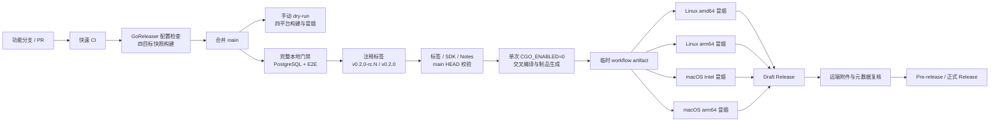
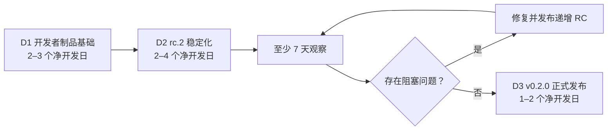
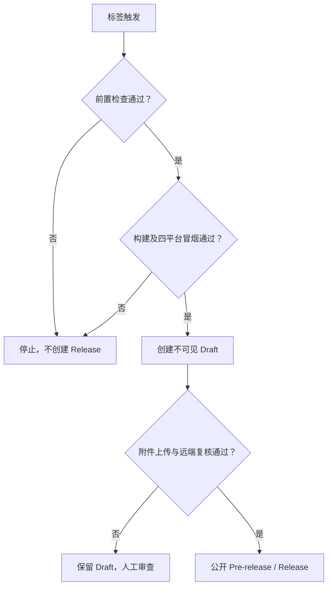
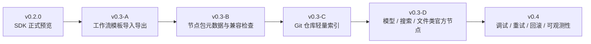

# Agent Studio v0.2 正式版稳定化设计

**日期：** 2026-08-19

**仓库：** `https://github.com/yyl1212/agent-studio`

**状态：** D1 已完成并验证；D2 的执行进度以及标签和 Release 门禁由逐文件实施计划记录

**目标版本：** `v0.2.0-rc.2`、`v0.2.0`

**D1 实施计划：** `docs/superpowers/plans/2026-08-19-v0.2-release-artifacts.md`

**D2 实施计划：** `docs/superpowers/plans/2026-08-19-v0.2-rc2-stabilization.md`

## 1. 背景

Agent Studio 已发布源码型开发者候选版 `v0.2.0-rc.1`。当前版本已经具备低代码工作流画布、开始节点驱动的聚焦式 Agent 页面、Go DAG 运行时、Docker PostgreSQL 持久化、公开 Go Node SDK、节点脚手架、契约测试，以及 Echo、Retriever、Webhook 三类官方扩展节点。

`v0.2.0-rc.1` 只通过源码标签、公开 Go Module 和 GitHub Pre-release 分发，不提供预编译二进制、校验和或 SBOM。下一阶段不继续扩展产品功能，而是稳定公共契约、建立可重复的开发者制品链路，并经过递增 RC 观察后发布 `v0.2.0` 正式开发者预览版。

本规格取代长期路线文档中关于 `v0.2.0` GoReleaser、容器镜像和 SBOM 的旧设想。`v0.2.0` 只增加 CLI 开发者制品，不发布 API/Web 容器镜像。

## 2. 已确认决策

- 下一里程碑优先稳定并发布 `v0.2.0`，不直接进入 v0.3。
- 发布形态为开发者分发：源码标签、`go install`、CLI 多平台二进制、SHA-256 校验和与 SBOM。
- 所有代码或公共契约调整先进入递增 RC；首个目标为 `v0.2.0-rc.2`。
- RC 至少观察 7 天；出现阻塞问题时发布递增 RC 并重新开始观察。
- 公共 SDK 与节点协议采用条件冻结，不主动进行破坏性整理。
- 自动化与干净环境验证是硬门槛，外部开发者试用是软门槛。
- 首版二进制支持 macOS、Linux 的 amd64、arm64，不支持 Windows。
- macOS 二进制本阶段不做 Developer ID 签名或公证。
- 实施采用发布工程先行、小步稳定化方式。

## 3. 目标与成功标准

### 3.1 目标

1. 建立可由 PR 快照验证、由手动 dry-run 验证原生矩阵、由不可变标签触发发布的 CLI 制品流水线。
2. 为 macOS/Linux 的 amd64/arm64 发布 `tar.gz` 归档。
3. 为最终归档生成 SHA-256 校验和和逐归档 SPDX JSON SBOM。
4. 在目标操作系统和目标架构上真实解压并运行每个 CLI。
5. 修复 RC 阶段发现的 Critical、Important、安装阻塞和兼容性缺陷。
6. 发布 `v0.2.0-rc.2`，完成观察后发布 `v0.2.0`。

### 3.2 成功标准

- 四个平台制品均可下载、解压并执行 `agent-studio version`。
- 制品版本与标签完全一致，提交号指向标签提交，`dirty=false`。
- `checksums.txt` 能验证所有最终归档，所有 SBOM 均为有效 SPDX JSON 并对应正确归档。
- `go install github.com/yyl1212/agent-studio/cmd/agent-studio@v0.2.0` 在干净环境通过。
- `make verify-quick`、`make verify`、`make test-e2e` 和 `make test-sdk-e2e` 全部通过。
- 标签流水线校验标签、SDK 版本、Release Notes、干净提交和 `origin/main` HEAD。
- 没有已知 Critical 或 Important 问题。
- 所有公共契约破坏性变化都有迁移说明与专项契约测试。
- RC 观察期至少 7 天，且期间未出现新的阻塞问题。

## 4. 范围与非目标

### 4.1 范围

- GoReleaser OSS 构建、归档、校验和和 SBOM 配置。
- Syft 生成逐归档 SPDX JSON SBOM。
- PR 中的发布配置检查和不发布快照构建。
- 标签触发的构建、四平台冒烟和 Draft Release 提升流程。
- RC 与正式 SemVer 标签的版本前置检查。
- 二进制安装、校验、升级、兼容性和已知限制文档。
- RC 阻塞缺陷与必要的兼容性修复。
- `v0.2.0-rc.2` 和 `v0.2.0` Release Notes。

### 4.2 非目标

- API、Web 或一体化应用容器镜像。
- Windows 二进制、安装器、Homebrew Tap 或系统包仓库。
- macOS Developer ID 签名、公证或任意平台的安装包签名。
- 新业务节点、画布能力、Agent 页面功能或数据库迁移。
- 运行时热加载、远程节点下载、插件市场、进程外插件或沙箱。
- 登录、RBAC、多租户、审计、分布式队列和运行恢复。
- 主动重构 `agentnode`、`agenttest` 或 `agent-studio.dev/v1alpha1`。
- 自动漏洞扫描、许可证扫描、容器扫描或生产部署认证。

## 5. 总体架构



发布链路分成三种不同信任边界：

1. PR 快照只验证配置和交叉编译，不拥有发布权限。
2. 标签构建生成唯一一份制品集合，并把它作为临时 workflow artifact 传递给四个平台冒烟任务。
3. 手动 dry-run 复用标签链路的构建和四平台冒烟，但永远跳过 Draft 与公开步骤。
4. 只有标签运行的四个平台全部成功后，最终任务才把同一份制品上传到不可见 Draft；远端复核通过后再公开。

## 6. 制品设计

### 6.1 构建目标

| GOOS | GOARCH | 归档格式 | 冒烟环境 |
|---|---|---|---|
| `linux` | `amd64` | `tar.gz` | `ubuntu-24.04` |
| `linux` | `arm64` | `tar.gz` | `ubuntu-24.04-arm` |
| `darwin` | `amd64` | `tar.gz` | `macos-15-intel` |
| `darwin` | `arm64` | `tar.gz` | `macos-15` |

归档命名使用：

```text
agent-studio_<tag>_<goos>_<goarch>.tar.gz
```

归档只包含 `agent-studio` CLI、`README.md` 和 `LICENSE`。本阶段不把服务端、前端静态文件或示例工程打入 CLI 归档。

### 6.2 版本信息

构建命令统一使用 `CGO_ENABLED=0`，并通过 Go linker flag 把完整标签写入：

```text
github.com/yyl1212/agent-studio/internal/buildinfo.versionOverride
```

标签值保留 `v` 前缀和 RC 后缀。提交号与 dirty 状态继续由 Go VCS build settings 提供。制品冒烟必须断言：

```text
agent-studio <tag> (sdk 0.2.0; api agent-studio.dev/v1alpha1; commit <tag-commit>; dirty false)
```

### 6.3 完整性与 SBOM

- `checksums.txt` 使用 SHA-256，覆盖四个最终 `tar.gz` 归档和对应的四个 SPDX JSON。
- 每个归档生成一个 SPDX JSON SBOM，文件名包含对应归档名。
- SBOM 生成工具 Syft 与 GoReleaser 一样固定版本，不在标签工作流中浮动升级。
- 制品检查脚本验证归档数量、文件名、八项校验和、SPDX 2.3 核心文档字段和目标映射，并限制输入文件大小、总解压量、CLI 执行时间与输出大小。
- 本阶段不生成签名，因此文档不得把校验和描述成发布者身份认证。

## 7. CI 与发布流程

### 7.1 PR 快照

现有 `.github/workflows/ci.yml` 增加独立发布配置检查：

1. 校验 GoReleaser 配置。
2. 安装固定版本 Syft。
3. 执行不发布的 snapshot release。
4. 使用制品检查脚本验证四个归档、校验和和 SBOM。
5. 不创建 GitHub Release，不请求写权限。

该任务只验证交叉构建和制品结构；目标二进制执行由标签工作流的原生矩阵完成。

### 7.2 标签前门禁

创建任何 RC 或正式标签前必须在最新 `main` 执行：

```bash
make verify-quick
make verify
make test-e2e
make test-sdk-e2e
scripts/check-version.sh <tag>
```

所有 Go 调试和测试通过 `CGO_ENABLED=0` 执行。标签只允许指向验证时的远程 `main` HEAD。创建与推送标签前仍需取得用户明确确认。

### 7.3 dry-run 与标签流水线

`.github/workflows/release.yml` 响应手动 `workflow_dispatch` 和下列标签：

```text
v<major>.<minor>.<patch>-rc.<positive integer>
v<major>.<minor>.<patch>
```

手动 dry-run 使用 snapshot 版本执行构建和四平台原生冒烟，所有发布任务通过事件条件跳过。它不需要 `contents: write`，也不创建标签、Draft 或 Release。D1 合并后必须先成功执行一次 dry-run，才能开始 D2。

标签流水线顺序固定为：

1. 检出完整 Git 历史和标签。
2. 断言标签提交等于 `origin/main` HEAD。
3. 运行版本前置检查和 `make verify-quick`。
4. 使用 GoReleaser `--skip=publish` 生成唯一一份完整制品集合。
5. 将制品集合上传为临时 workflow artifact。
6. 四个原生 Runner 分别下载同一集合，只校验并执行自己的目标归档。
7. 所有冒烟成功后创建不可见 Draft Release。
8. 上传归档、校验和和 SBOM，正文读取 `docs/releases/<tag>.md`。
9. 重新读取远端 Release，核对标签、提交、附件集合、附件大小和 Draft 状态。
10. RC 转为 Pre-release；无后缀版本转为正式 Release。

### 7.4 权限

- workflow 默认权限为 `contents: read`。
- 构建与冒烟任务不拥有写权限。
- 只有最终发布任务拥有 `contents: write`。
- 最终发布任务必须同时要求事件类型为标签 `push`；手动运行即使选择标签 ref 也只能 dry-run。
- PR 流程不使用发布密钥或长期个人 Token。
- 第三方 Action 固定完整 commit SHA，并在注释中记录可读版本。

## 8. 公共契约稳定策略

### 8.1 条件冻结

下列公共面不主动进行破坏性调整：

- `sdk/go/agentnode`
- `sdk/go/agenttest`
- `agent-studio.dev/v1alpha1`
- manifest 与生成注册表约定
- 已发布官方节点的 `type + version`、端口和错误语义

普通缺陷必须通过兼容方式修复。只有已经确认会长期阻塞 SDK 使用的严重设计缺陷，才允许在正式版前调整公共契约。

### 8.2 破坏性调整门槛

每项破坏性调整必须同时包含：

1. 书面说明现有设计为何不可兼容修复。
2. 旧行为回归测试和新行为契约测试。
3. `v0.2.0-rc.1` 到新 RC 的迁移说明。
4. 官方节点、仓库外 fixture 和画布注册黄金路径验证。
5. 递增 RC，不修改已有标签。

官方节点自身的端口或行为不兼容时增加节点版本，不覆盖既有 `type + version`。

## 9. 交付阶段



### 9.1 D1：开发者制品基础

- 从最新 `main` 创建 `codex/v0.2-release-artifacts`。
- 建立 GoReleaser、Syft、校验和、SBOM 和四平台冒烟链路。
- 扩展标签前置检查并增加发布脚本测试。
- 把 snapshot 构建纳入 PR CI。
- 更新二进制安装与校验文档。
- 完成代码审查、快速与完整回归后合并 `main`。
- 从 `main` 手动执行一次不发布 dry-run，确认四种 Runner 和真实制品冒烟全部通过。

D1 不修改 SDK、节点协议、运行引擎、前端或数据库。

**完成证据（2026-08-19）：**

- D1 通过 [PR #1](https://github.com/yyl1212/agent-studio/pull/1) 合并到 `main`，合并提交为 `b3874c857460e2f565396fe260ad1aa3790e0e81`。
- 合并前完整回归、独立代码审查和 PR CI 均通过，没有未解决的 Critical 或 Important 问题。
- `main` 上的 [Release dry-run #1](https://github.com/yyl1212/agent-studio/actions/runs/32179208184) 以 `workflow_dispatch` 执行成功，构建版本为 `v0.2.1-snapshot`。
- Linux/macOS 的 amd64、arm64 四个平台原生冒烟全部通过；发布任务为 `skipped`。
- 工作流生成四个归档、四份 SPDX JSON 和 `checksums.txt`，`release-dist` 制品集合校验通过。
- dry-run 没有创建或移动标签，也没有创建 Draft、Pre-release 或正式 Release。

### 9.2 D2：`v0.2.0-rc.2` 稳定化

- 从最新 `main` 创建 `codex/v0.2-rc2-stabilization`。
- 汇总 `rc.1` 反馈并按 Critical、Important、Minor 分级。
- 只修复 Critical、Important、安装阻塞和确认的兼容性缺陷。
- 必要的公共契约调整必须满足第 8 节门槛。
- 编写 `docs/releases/v0.2.0-rc.2.md`。
- 完成完整门禁、独立代码审查和回归后合并。
- 用户确认后创建并推送 `v0.2.0-rc.2` 注释标签。
- 验证 GitHub Pre-release、四平台附件和公开 Go Proxy。

### 9.3 观察期

观察期至少 7 个完整自然日。期间只处理发布阻塞，不添加功能。

下列情况阻止进入正式版：

- 任意 Critical 或 Important 缺陷。
- 任一支持平台无法安装或运行 CLI。
- SDK 黄金路径、画布节点注册或既有工作流兼容回归。
- 标签、版本、校验和、SBOM 或附件集合错误。
- 实际安全边界与公开文档不一致。

出现阻塞问题时，从最新 `main` 创建修复分支，发布递增 RC，并重新开始 7 天观察。Minor 文档或体验问题进入 `v0.2.1` 或 v0.3，不无限延迟正式版。外部开发者反馈是重要信号，但不作为不可控硬门槛。

### 9.4 D3：`v0.2.0` 正式发布

- 从最新 `main` 创建 `codex/v0.2-ga-release`。
- 不修改产品代码，只准备正式 Release Notes、README 和发布证据。
- 重跑完整验证矩阵和四平台制品验证。
- 独立审查后合并，并确认远程 `main` CI 成功。
- 用户确认后创建不可变注释标签 `v0.2.0`。
- 验证正式 GitHub Release、公开 Go Proxy、附件、校验和和 SBOM。

## 10. 文件影响

### 10.1 D1

| 文件 | 动作 | 职责 |
|---|---|---|
| `.goreleaser.yaml` | 新增 | 四目标构建、版本注入、归档、校验和、SBOM |
| `.github/workflows/release.yml` | 新增 | 标签构建、四平台冒烟、Draft 与公开 Release |
| `.github/workflows/ci.yml` | 修改 | 发布配置检查和 snapshot 构建 |
| `scripts/check-version.sh` | 修改 | 同时接受 RC 与正式 SemVer |
| `scripts/check-version_test.sh` | 修改 | 覆盖正式版和 RC 成功/失败路径 |
| `internal/releaseartifact/check.go` | 新增 | 跨平台验证制品、归档安全、SHA-256、SPDX 和 CLI 输出 |
| `internal/releaseartifact/check_test.go` | 新增 | 生成内存 fixture 覆盖制品校验成功和失败路径 |
| `internal/releaseartifact/cmd/main.go` | 新增 | 暴露 collection 和 target 两种验证模式 |
| `scripts/check-release-artifacts.sh` | 新增 | 制品集合和目标平台冒烟检查 |
| `scripts/install-release-tools.sh` | 新增 | 安装固定版本 GoReleaser 和 Syft 到仓库私有目录 |
| `scripts/check-release-artifacts_test.sh` | 新增 | 覆盖跨目录调用、退出码和临时工具清理 |
| `Makefile` | 修改 | 发布配置、snapshot 和制品验证目标 |
| `.gitignore` | 修改 | 忽略本地 `dist/` 和 `/.release-tools/` |
| `README.md` | 修改 | 二进制安装、校验与平台说明 |
| `docs/sdk/quickstart.md` | 修改 | 预编译 CLI 使用路径 |
| `.github/pull_request_template.md` | 修改 | 增加发布配置变更验证项 |

`internal/buildinfo/buildinfo.go` 预计不修改。现有 `versionOverride` 已提供所需链接注入点；如果 D1 测试先证明该路径不能稳定输出标签，才允许最小修改并补专项测试。

### 10.2 D2

| 文件 | 动作 | 职责 |
|---|---|---|
| `docs/releases/v0.2.0-rc.2.md` | 新增 | RC 正文、迁移、限制和验证证据 |
| `README.md` | 修改 | 当前候选版本入口 |
| 缺陷相关实现与测试 | 条件修改 | 只处理符合 D2 门槛的问题 |

### 10.3 D3

| 文件 | 动作 | 职责 |
|---|---|---|
| `docs/releases/v0.2.0.md` | 新增 | 正式版唯一 Release 正文来源 |
| `README.md` | 修改 | 正式版安装和稳定性说明 |

## 11. 测试矩阵

### 11.1 脚本与配置

- RC 标签、正式标签、非法前缀、非法 RC 编号、额外后缀。
- SDK 基础版本不一致、缺少 Release Notes、脏工作树、标签不在 `main` HEAD。
- 制品缺失、重复目标、错误文件名、错误校验和、无效 SBOM、SBOM 目标错配。
- 归档缺少 CLI、CLI 不可执行、版本输出与标签或提交不一致。
- GoReleaser 配置检查和 snapshot 构建。

### 11.2 原生平台冒烟

四个平台分别执行：

1. 下载唯一的临时制品集合。
2. 校验 `checksums.txt`。
3. 选择当前 `GOOS/GOARCH` 对应归档。
4. 解压并检查归档只包含允许文件。
5. 执行 `agent-studio version`。
6. 断言标签、SDK 版本、API 版本、提交号和 dirty 状态。

Linux arm64 Runner 当前由 GitHub 以 Public Preview 提供。D1 合并后、D2 开始前必须通过手动 dry-run 验证本仓库能调度该 Runner；若不可用，必须先修订实施计划为 QEMU 执行方案并明确记录“模拟执行”，不得静默降低门禁。

### 11.3 产品回归

```bash
make verify-quick
make verify
make test-e2e
make test-sdk-e2e
```

涉及 Webhook、Retriever 或公共契约的修复继续执行对应的专项重复测试。所有 Go 命令使用 `CGO_ENABLED=0`。

### 11.4 发布后冒烟

- 从 GitHub Release 重新下载四个归档、校验和和 SBOM。
- 复算 SHA-256 并比对公开文件。
- 在至少当前宿主平台解压并执行公开附件。
- 使用全新 `GOMODCACHE`、`GOCACHE` 和 `GOBIN` 从公开 Go Proxy 安装标签版本。
- 运行 `agent-studio version`，确认公开 Module 与附件报告同一版本。
- 复核 RC 的 `isPrerelease=true`；正式版的 `isPrerelease=false`、`isDraft=false`。

## 12. 安全与失败处理

### 12.1 供应链边界

- 第三方 Action 固定完整 commit SHA。
- GoReleaser 与 Syft 固定明确版本。
- 构建只使用已提交的 `go.sum` 和 `pnpm-lock.yaml`，标签任务不得修改依赖。
- 最终上传的附件必须与四平台冒烟读取的 workflow artifact 完全相同。
- 日常 CI 和冒烟任务只读；只有最终发布任务可写 Release。
- SHA-256 只证明完整性，未签名制品不提供发布者身份认证。
- macOS 未签名和未公证限制写入 README 与 Release Notes。

### 12.2 失败状态



- 标签一旦推送不移动、不覆盖。
- 代码、文档或制品内容错误通过新提交和递增 RC 修复。
- 纯 Runner 或网络瞬时故障，且没有公开 Release 时，可以重跑同一工作流。
- 上传失败只保留不可见 Draft，工作流不自动删除 Draft、标签或 Release。
- 正式版公开后不重写 `v0.2.0`；普通修复进入 `v0.2.1`，安全问题走 `SECURITY.md`。

## 13. 可行性与阻塞项审查

| 风险 | 等级 | 缓解 |
|---|---|---|
| Linux arm64 Runner 仍为预览 | Medium | D1 先做可用性探针；不可用时显式修订为 QEMU 方案 |
| macOS 附件未签名、公证 | Medium | 公开限制并保留 `go install` 安装路径 |
| GoReleaser 或 Syft 配置漂移 | Medium | 固定版本；PR 强制配置检查和 snapshot 构建 |
| 标签与 SDK 版本不一致 | High | 扩展版本脚本并在标签流水线重复校验 |
| 发布中途失败暴露半成品 | High | 所有冒烟后才创建 Draft，远端复核后才公开 |
| RC 反馈无限拖延 GA | Medium | Critical/Important 为硬门槛，Minor 转入补丁版或 v0.3 |
| 公共契约临时重构 | High | 条件冻结、迁移说明、契约测试和递增 RC |
| 标签工作流不运行数据库 E2E | Medium | 标签前完整门禁与发布证据为硬门槛，标签任务重复快速验证 |

已验证的基础条件：

- 仓库已有链接期版本覆盖、VCS revision 与 dirty 解析。
- `scripts/check-version.sh` 已覆盖 RC 标签、SDK 版本、Notes 与干净工作树，可增量扩展。
- `make verify-quick`、Docker PostgreSQL 回归、产品 E2E 和 SDK E2E 已存在。
- Go 项目在 `CGO_ENABLED=0` 下可以交叉编译。
- GitHub 官方托管 Runner 当前覆盖 Linux amd64/arm64 与 macOS Intel/arm64。
- GoReleaser OSS 支持 `tar.gz`、SHA-256 和基于 Syft 的逐归档 SBOM。

审查与执行结论：方案没有 Critical 或 Important 级阻塞项。D1 已在 PR 中验证 GoReleaser/Syft 固定版本和交叉构建，并通过合并后的只读 dry-run 验证四种 Runner。D1 的 D2 前置门禁已经满足；D2 完成独立审查和完整回归前，仍不得创建 RC 标签或启用公开发布动作。

## 14. v0.2.0 之后的路线



v0.3 仍采用源码依赖、确定性生成和兼容检查，不执行任意远程代码。进程外插件、签名、权限声明和沙箱继续留到后续稳定生态阶段。

## 15. 实施门禁

1. 本规格确认后，先编写 D1 的逐文件、逐测试实施计划，不直接实施 D2/D3。
2. 每个阶段开始前拉取最新 `main`，从 `origin/main` 创建新的 `codex/` 分支或隔离 worktree。
3. 任何实现先写失败测试，再写最小实现。
4. 每个阶段完成后执行代码审查、快速验证和与风险相称的完整回归。
5. 合并、推送标签、公开 Release 都是独立外部状态变更，分别取得用户确认。
6. 所有 Go 调试和测试使用 `CGO_ENABLED=0`。
7. D1 未合并并验证前，不为 D2 创建 RC 标签；D2 观察期完成前，不开始 D3 发布。

## 16. 参考资料

- GitHub-hosted runners reference: `https://docs.github.com/en/enterprise-cloud@latest/actions/reference/runners/github-hosted-runners`
- GoReleaser archives: `https://goreleaser.com/customization/package/archives/`
- GoReleaser checksums: `https://goreleaser.com/customization/package/checksum/`
- GoReleaser SBOMs: `https://goreleaser.com/customization/sbom/`
- GoReleaser dry run: `https://goreleaser.com/getting-started/quick-start/`
