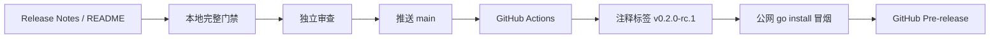

# Agent Studio v0.2 Stage C RC 发布设计

- **日期：** 2026-08-19
- **仓库：** `https://github.com/yyl1212/agent-studio`
- **目标版本：** `v0.2.0-rc.1`
- **状态：** 设计内容已确认，待规格文档复审
- **上游规格：** `docs/superpowers/specs/2026-08-18-v0.2-source-preview-design.md`

## 1. 背景

v0.2 源码开发者预览的阶段 A、阶段 B 已完成：仓库具备治理文件、版本信息、快速 CI、公开 Go Node SDK、CLI、Echo、Retriever、Webhook，以及画布和端到端回归。Stage C 不再扩展产品能力，只负责把当前主分支整理、验证并发布为第一个源码型 RC。

当前本地 `main` 位于 `cab8423ae1d3c9830108d6687671d47b0ec48c5a`，比 `origin/main` 领先 11 个提交。该提交只是 Stage C 的起点；最终标签必须指向包含 Release Notes 和 README RC 入口、已经推送并通过 CI 的最终 `main` 提交，不能提前固定为当前提交。

## 2. 目标与成功标准

Stage C 的目标是发布带注释标签 `v0.2.0-rc.1` 和 GitHub Pre-release，使外部开发者可以从公开源码安装 CLI、启动系统并试用官方节点。

发布成功必须同时满足：

1. Release Notes 和 README 准确说明安装、启动、官方节点、安全边界、兼容性、已知限制与升级方式。
2. 本地快速门禁、完整门禁、两套 E2E 和专项重复回归全部通过。
3. 独立审查没有 Critical 或 Important 问题，工作区与生成物干净。
4. 最终 `main` 已推送，目标提交的 GitHub Actions 成功。
5. 注释标签指向该提交，公开 tag 可通过 `go install` 安装并报告 `v0.2.0-rc.1`。
6. GitHub Release 标记为 Pre-release，发布说明与仓库 Release Notes 一致，只有 GitHub 自动生成的源码归档。

## 3. 范围与非目标

### 3.1 实施文件

| 文件 | 变更 | 作用 |
|---|---|---|
| `docs/releases/v0.2.0-rc.1.md` | 新增 | RC 发布说明，也是 GitHub Release 正文的唯一内容源 |
| `README.md` | 修改 | 增加 RC 状态、发布说明入口和公开安装入口 |
| `docs/superpowers/specs/2026-08-19-v0.2-stage-c-rc-release-design.md` | 新增 | 固化本设计与发布边界 |
| `docs/superpowers/plans/2026-08-19-v0.2-stage-c-rc-release.md` | 后续新增 | 固化逐步实施、验证和远程确认点 |

设计与计划文档是过程治理产物；产品交付仍严格限定为 Release Notes 和 README。除非实施中发现会阻止发布的事实错误，否则不得修改数据库、运行时、节点协议、后端、前端或 CI 行为。发现阻塞时先停止、修订方案并重新确认，不能借发布任务扩大范围。

### 3.2 明确不做

- 不发布二进制附件、容器镜像、GoReleaser 产物、校验和或安装脚本。
- 不增加 SBOM、签名、漏洞扫描、许可证扫描或供应链服务。
- 不修改 API、数据库 migration、工作流语义、节点实现或画布交互。
- 不自动创建标签或 Release，不建立长期发布工作流。
- 不将开发者预览描述为生产就绪版本。

## 4. 发布架构



门禁严格单向推进。任何阶段失败都停留在当前阶段，不得以“稍后补验证”为由继续创建后续外部状态。

## 5. 发布内容设计

### 5.1 Release Notes

`docs/releases/v0.2.0-rc.1.md` 采用中文，至少包含：

1. **开发者预览声明：** 这是源码型 RC，不承诺生产稳定性。
2. **本次亮点：** 画布工作流、开始节点驱动的 Agent 页面、Go Node SDK/CLI、Echo、Retriever、Webhook。
3. **安装与启动：** 公网 `go install`、源码克隆、Docker PostgreSQL、Go API、React 前端的最短可执行步骤。
4. **官方节点：** 三个节点的用途、输入输出与 Retriever/Webhook 的关键边界。
5. **安全说明：** Webhook 主机只来自 `AGENT_STUDIO_WEBHOOK_URL`，Token 只来自 `AGENT_STUDIO_WEBHOOK_TOKEN`；Capability 是元数据而不是沙箱。
6. **兼容性：** Go、Node.js、pnpm、Docker 的版本要求，以及 SDK `0.2.0`、API `agent-studio.dev/v1alpha1`。
7. **已知限制：** 无热加载、插件市场、向量检索、任意 URL Webhook、发布二进制和生产级恢复能力。
8. **升级与反馈：** RC 标签不可变，后续修复使用递增 RC；问题通过 GitHub Issues 报告。
9. **验证证据：** 列出本次实际通过的门禁，不填写尚未执行的结论。

Release Notes 不包含真实 Token、内网地址、临时测试凭据、未确认日期、占位链接或“生产可用”等过度承诺。

### 5.2 README

README 只增加简短的 RC 入口，不复制整份 Release Notes：

- 标明当前开发者预览版本 `v0.2.0-rc.1`。
- 链接到仓库内 Release Notes。
- 给出 `go install github.com/yyl1212/agent-studio/cmd/agent-studio@v0.2.0-rc.1` 与 `agent-studio version`。
- 保留现有源码启动说明为权威启动路径，避免两套说明漂移。

### 5.3 GitHub Release 元数据

- **Tag：** `v0.2.0-rc.1`
- **标题：** `Agent Studio v0.2.0-rc.1`
- **Target：** 最终已验证的 `main` 提交
- **状态：** Pre-release，非 Draft
- **正文：** 原样读取 `docs/releases/v0.2.0-rc.1.md`
- **附件：** 不上传自定义附件，仅保留 GitHub 自动生成的源码归档

## 6. 本地发布门禁

在创建任何远程状态前，按以下顺序执行：

```bash
make verify-quick
make verify
make test-e2e
make test-sdk-e2e
CGO_ENABLED=0 go test ./extensions/webhook -run 'Test.*(Secret|Redact|Error|Redirect|Size|Cancel|Timeout)' -count=50
CGO_ENABLED=0 go test ./extensions/retriever -run 'Test.*(Deterministic|Ordering|Stable|Unicode|Independent)' -count=50
```

专项测试前先用 `CGO_ENABLED=0 go test <package> -list .` 核对匹配到实际测试，禁止空匹配假通过。随后必须完成：

- 检查生成文件无漂移。
- 检查 Release Notes、README 无占位文本、秘密和失效的仓库内链接。
- 执行 `scripts/check-version.sh v0.2.0-rc.1`。
- 独立审查当前 Stage C diff，结论无 Critical、Important。
- 合并发布分支到本地 `main` 后重新执行受影响检查。
- 确认工作区干净。

所有 Go 调试、测试和检查命令显式使用 `CGO_ENABLED=0`；Make 目标内部的 Go 命令必须遵循仓库已有约定。

## 7. 远程发布流程与权限边界

远程流程设置三个独立的用户确认点：

### 7.1 确认点一：推送 `main`

确认后将最终本地 `main` 快进推送到 `origin/main`。推送后读取 GitHub Actions 状态，必须确认目标提交的全部必需检查成功。CI 失败时停止，修复后从本地完整门禁重新开始。

### 7.2 确认点二：创建并推送标签

CI 成功且再次确认后，在最终提交创建注释标签。标签消息至少包含版本、目标提交和 Release Notes 路径，再推送唯一标签 `v0.2.0-rc.1`。不使用轻量标签，不批量推送其他本地标签。

标签推送后，在新的临时目录和公开网络解析路径执行：

```bash
rc_bin_dir="$(mktemp -d)"
GOBIN="$rc_bin_dir" go install github.com/yyl1212/agent-studio/cmd/agent-studio@v0.2.0-rc.1
"$rc_bin_dir/agent-studio" version
```

输出必须包含构建版本 `v0.2.0-rc.1`、SDK `0.2.0` 和 API `agent-studio.dev/v1alpha1`。临时 `GOBIN` 避免覆盖用户现有 CLI。

### 7.3 确认点三：创建 GitHub Pre-release

公开安装冒烟成功、发布正文再次展示给用户确认后，使用已验证的标签和仓库 Release Notes 创建 Pre-release。创建后只读复查标签、target、标题、Pre-release 标志、正文和附件列表。

## 8. 失败处理与不可变性

| 失败位置 | 处理 |
|---|---|
| 本地门禁或审查失败 | 不推送，修复后重新执行全部本地门禁 |
| `main` CI 失败 | 不创建标签，修复并重新推送，通过完整门禁后再观察 CI |
| 标签创建前检查失败 | 不创建标签，继续在发布分支修复 |
| 标签推送后公开安装失败 | 不移动、不删除、不覆盖标签；修复后发布 `v0.2.0-rc.2` |
| GitHub Release 创建失败 | 保留已验证标签，修正认证或元数据后重试创建 Release |
| Release 元数据错误 | 仅更正 Release 元数据；不得移动对应标签 |

整个流程禁止 force-push、历史重写、强制移动标签和用同名标签替换已公开对象。

## 9. 可行性与阻塞项审查

### 9.1 已验证可行

- 根 module 是 `github.com/yyl1212/agent-studio`，CLI 路径与公开安装命令一致。
- buildinfo 已支持从 tagged module version 输出 `v0.2.0-rc.1`。
- `scripts/check-version.sh` 已校验 RC 格式、SDK 基础版本、Release Notes 存在和干净工作区。
- 目标官方节点测试已存在，专项重复命令能够匹配真实测试。
- 远程 `origin/main` 可访问，`git push --dry-run origin main` 成功。
- `gh` 已重新认证为 `yyl1212`，具备 `repo` 和 `workflow` scope。
- `v0.2.0*` 标签当前不存在，不存在同名冲突。

### 9.2 已消除的阻塞风险

| 风险 | 处理 |
|---|---|
| 当前提交不是最终发布提交 | 标签只在 Stage C 文档合并、推送和 CI 成功后创建 |
| `gh` 凭据失效导致无法创建 Release | 设计落盘前已重新认证并复核 scope |
| 远程动作连续执行导致无法中止 | main、标签、Release 分成三个独立确认点 |
| tag 后才发现安装失败并尝试重写 | 先公开安装冒烟；失败时保留标签并递增 RC |
| Release Notes 与 GitHub 正文漂移 | 仓库 Release Notes 是唯一正文来源 |
| 冒烟覆盖用户已有 CLI | 使用临时目录和临时 `GOBIN` |
| 发布任务顺手修改产品功能 | 文件白名单和“阻塞先修订方案”约束范围 |

截至本设计完成，未发现阻止 Stage C 编写实施计划的 Critical 或 Important 问题。

## 10. 验收清单

- [ ] Release Notes 和 README 符合内容设计，无占位、秘密或失效仓库内链接。
- [ ] `make verify-quick`、`make verify`、`make test-e2e`、`make test-sdk-e2e` 通过。
- [ ] Webhook 安全专项与 Retriever 确定性专项各重复 50 次通过。
- [ ] Stage C 独立审查无 Critical、Important。
- [ ] `scripts/check-version.sh v0.2.0-rc.1` 通过，工作区干净。
- [ ] 最终 `main` 已同步到远程，目标提交 GitHub Actions 成功。
- [ ] 注释标签 `v0.2.0-rc.1` 指向最终 `main` 提交。
- [ ] 公开 `go install` 成功，CLI 报告准确版本和协议版本。
- [ ] GitHub Release 为 Pre-release，正文一致且无自定义附件。

## 11. 后续实施顺序

本设计通过书面审阅后，使用 writing-plans 编写逐文件、逐命令、带三个远程确认点的 Stage C 实施计划。计划评审通过后才能修改 Release Notes 或 README；所有远程操作仍必须在执行当时单独确认。
