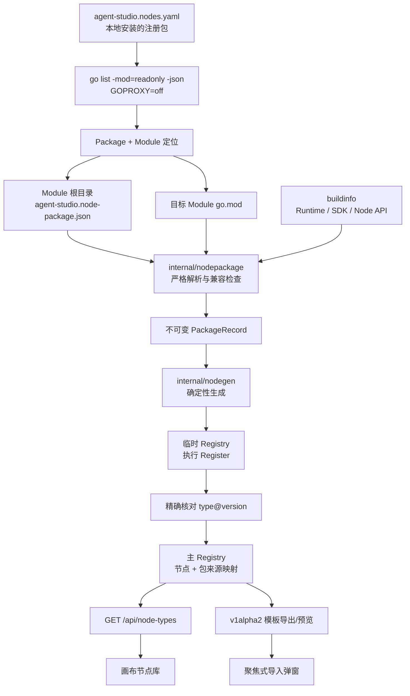
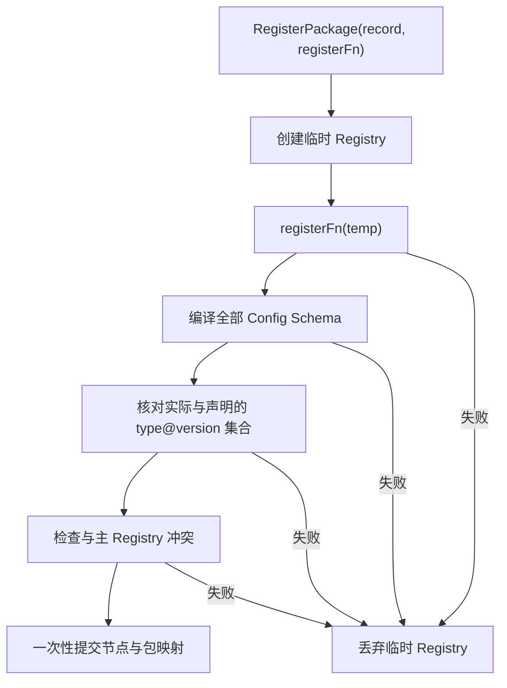

# Agent Studio v0.3-B 节点包元数据与兼容检查设计

- **目标版本：** v0.3-B
- **状态：** 已完成方案讨论，等待书面规格确认
- **设计日期：** 2026-08-19
- **基线提交：** `398553c210180fff333d66ff1af10cb9309d34b5`
- **设计分支：** `codex/v0.3-node-packages-design`
- **前置能力：** v0.2.0 SDK/CLI、v0.3-A 工作流模板导入导出

## 1. 背景

Agent Studio 已具备公开 Go Node SDK、节点脚手架、契约测试、确定性注册代码生成、进程内 Runtime Adapter，以及 v0.3-A 版本化工作流模板。当前根清单 `agent-studio.nodes.yaml` 只记录 Go 注册包 import path：

```yaml
apiVersion: agent-studio.dev/v1alpha1
nodes:
  - package: github.com/yyl1212/agent-studio/extensions/echo
```

这足以编译仓库内扩展，但不能回答以下问题：

- 一个注册包属于哪个可发布 Go Module；
- Module 的许可证、源码地址、说明和发布版本是什么；
- 它支持哪个 Node API 和哪个 Agent Studio Runtime 范围；
- 清单声明的节点是否与运行时实际注册的 `type@version` 一致；
- 工作流模板缺失节点时，用户应寻找哪个节点包；
- 本地 `replace`、开发版本和正式发布版本如何安全展示。

此外，当前 `internal/nodegen` 明确限制注册包必须是本仓库 `extensions/` 的直接子包。v0.3-B 需要在不增加隐式下载和远程代码执行的前提下，允许已经加入本地 Go Module 依赖图的第三方节点包。

本阶段建立“发布元数据、构建期检查、启动期真实性、模板诊断提示”闭环，不建设远程市场或自动安装。

## 2. 已确认的产品与技术决策

1. 每个节点 Go Module 根目录携带独立静态清单 `agent-studio.node-package.json`。
2. 一个 Go Module 是一个发布单元；一份清单可声明多个注册包和多个节点。
3. 现有 `agent-studio.nodes.yaml` 继续只描述当前项目安装的 Go 注册包，不重复包的发布元数据。
4. 兼容性由精确 Node API 版本和 Runtime SemVer 半开区间共同表达。
5. SDK 依赖版本从目标 Module 的 `go.mod` 读取，不在节点包清单中重复手填。
6. v0.3-B 只检查已存在于本地依赖图的包；开发者自行执行 `go get`，CLI 不隐式下载。
7. 工作流模板携带可选节点包依赖提示；提示只改善诊断，不是安装指令、签名或执行依据。
8. 工作流模板格式升级为 `agent-studio.dev/v1alpha2`；继续兼容导入 v1alpha1，新导出统一为 v1alpha2。
9. 图中的精确 `type@version` 始终是编译和执行权威；包提示不能覆盖 Registry 或 Compiler 结论。
10. 保持画布优先、聚焦式单栏；本阶段不增加节点包管理页面。
11. 新增 `node package init` 显式初始化 Module 清单；`node init` 不推测许可证或仓库地址，只向已存在的包清单追加节点声明。

## 3. 目标与非目标

### 3.1 目标

1. 第三方节点 Module 能用一份严格、可版本化、可被 Git 索引读取的 JSON 清单描述自身。
2. `agent-studio generate` 在改写生成文件前完成 Module、清单、Node API、Runtime 和 SDK 兼容性检查。
3. 生成器允许已在本地依赖图中的外部 Module，同时保持 `GOPROXY=off` 和 `-mod=readonly`。
4. 服务启动时核对清单声明与实际注册节点集合；任何漂移都阻止启动。
5. 包级注册失败不向主 Registry 留下部分节点。
6. 节点定义 API 和画布能显示安全的包名、版本、许可证和来源摘要。
7. v1alpha2 模板能记录实际使用的扩展节点包提示；缺失节点时展示包名和导出环境版本。
8. v1alpha1 模板仍能严格导入，并在再次导出时显式升级为 v1alpha2。
9. CLI 能检查单个本地注册包，并由 `doctor` 汇总所有已安装包的兼容状态。
10. API、模板和 CLI JSON 输出不泄漏本地绝对路径、`replace` 目标或命令环境。

### 3.2 非目标

- 自动执行 `go get`、`go install` 或修改 `go.mod`、`go.sum`。
- 远程 Git 仓库搜索、索引同步、模板 URL 导入或节点市场。
- 在模板导入期间自动安装、升级或降级节点包。
- 插件签名、作者身份认证、可信发布背书或供应链扫描。
- 进程外插件、沙箱、权限授权或 capability 强制隔离。
- 热加载、运行中卸载节点或重启无感升级。
- 服务端节点包表、租户权限、收藏、评分和审核流。
- 强制现有节点版本字符串改为 SemVer；内置节点仍允许版本 `"1"`。
- 数据库迁移或工作流运行表结构调整。

## 4. 方案比较

| 方案 | 优点 | 主要问题 | 结论 |
|---|---|---|---|
| 静态 Module 清单 + 构建期校验 | 检查前不执行第三方探测代码；与 Go Module、Git Tag 和未来索引一致 | 第三方 Module 需维护一份清单 | **采用** |
| 从 Go 代码动态导出元数据 | 元数据与 Definition 同处代码 | 读取元数据前就要编译或执行第三方代码；交叉平台和构建标签复杂 | 不采用 |
| Agent Studio 中央清单 | 审核集中、实现简单 | 第三方包不能独立发布；每次更新都要修改主仓库 | 不采用 |

静态清单是唯一能同时满足“编译前兼容检查、未来 Git 索引、不隐式执行远程代码”的方案。

## 5. 总体架构



### 5.1 组件边界

- `internal/nodepackage`：清单模型、严格解析、Module 定位、`go.mod` 解析、兼容算法和诊断。不得依赖 HTTP、Registry、前端或数据库。
- `internal/nodegen`：消费已经验证的 PackageRecord，生成 import、注册包装和静态快照。不得自行重新解释兼容规则。
- `apps/api/internal/nodes`：用临时 Registry 执行包注册，核对实际节点集合，成功后一次性提交主 Registry，并维护节点到包的映射。
- `apps/api/internal/workflowtemplate`：从已验证的 Registry 包映射生成提示；导入时只把提示用于安全诊断。
- HTTP 层：将公共 Node Definition 与安全 PackageSummary 组合为响应 DTO，不修改第三方节点自身返回的 Definition。
- Web：只展示包摘要和缺失依赖提示，不提供安装动作。

## 6. 节点包清单契约

### 6.1 文件名与定位

文件名固定为：

```text
agent-studio.node-package.json
```

定位规则固定为：

1. 对 `agent-studio.nodes.yaml` 中的注册包运行 `go list -mod=readonly -json <import-path>`。
2. 使用结果中的 `Module.Dir` 作为 Module 根目录。
3. 只读取 `<Module.Dir>/agent-studio.node-package.json`。
4. 不向父目录、Git 仓库根目录或网络猜测其他位置。
5. 同一 Module 的多个注册包共享一次解析和兼容检查结果。

### 6.2 JSON 示例

```json
{
  "apiVersion": "agent-studio.dev/v1alpha1",
  "kind": "NodePackage",
  "metadata": {
    "name": "github.com/yyl1212/agent-studio",
    "displayName": "Agent Studio 官方扩展节点",
    "description": "官方 Echo、Retriever 与 Webhook 节点",
    "license": "Apache-2.0",
    "repository": "https://github.com/yyl1212/agent-studio"
  },
  "compatibility": {
    "nodeAPI": "agent-studio.dev/v1alpha1",
    "runtime": {
      "minVersion": "v0.2.0",
      "maxVersionExclusive": "v0.4.0"
    }
  },
  "registrations": [
    {
      "package": "github.com/yyl1212/agent-studio/extensions/echo",
      "nodes": [
        {
          "type": "extension.echo",
          "version": "1.0.0"
        }
      ]
    }
  ]
}
```

### 6.3 字段语义

| 字段 | 必填 | 规则 |
|---|---:|---|
| `apiVersion` | 是 | v0.3-B 仅接受 `agent-studio.dev/v1alpha1` 节点包清单 |
| `kind` | 是 | 固定为 `NodePackage` |
| `metadata.name` | 是 | 必须等于 `go list` 返回的 Module path |
| `metadata.displayName` | 是 | 面向用户显示的非空名称 |
| `metadata.description` | 是 | 可为空字符串，但字段必须存在 |
| `metadata.license` | 是 | 非空、长度受限；本阶段不联网校验 SPDX 数据库 |
| `metadata.repository` | 是 | HTTPS URL；禁止 userinfo、query、fragment；本阶段不访问 |
| `compatibility.nodeAPI` | 是 | 必须与当前 `agentnode.APIVersion` 精确相等 |
| `runtime.minVersion` | 是 | 标准 Go SemVer，包含边界 |
| `runtime.maxVersionExclusive` | 是 | 标准 Go SemVer，排除边界，且必须大于 min |
| `registrations` | 是 | 可为空数组，按 package 唯一；空数组只表示尚未创建节点的合法作者状态 |
| `registrations[].package` | 是 | 合法 Go import path，必须属于 metadata.name 对应 Module |
| `registrations[].nodes` | 是 | 非空，`type@version` 在整份清单中唯一 |
| `nodes[].type` | 是 | 非空稳定节点类型 |
| `nodes[].version` | 是 | 非空精确字符串；本阶段不强制 SemVer |

发布版本不进入清单。正式安装版本以 `go list` 的 `Module.Version` 为权威；Git 索引阶段以被索引的 Git Tag/Go Module 版本为权威。

capability 不进入清单，避免和运行时 Node Definition 重复。包的 capability 摘要由成功注册后的实际 Definition 聚合。

### 6.4 资源和解析限制

- 单份清单最大 256 KiB。
- 最多 128 个注册包；解析允许空数组，但 Inspector 检查已安装 import path 时必须找到对应非空 registration。
- 最多 512 个节点声明。
- 字符串字段设置固定长度上限；description 最大 2048 字符，URL 最大 2048 字符。
- 使用严格 JSON Decoder，拒绝未知字段、尾随值和多个 JSON 值。
- 拒绝非法 UTF-8、重复注册包、重复节点和空节点集合。
- 解析错误只报告安全字段路径，不回显整份文件。

## 7. Module 定位与兼容算法

### 7.1 Go 命令边界

检查命令固定为：

```text
CGO_ENABLED=0 GOPROXY=off go list -mod=readonly -json <import-path>
```

约束：

- 不调用 `go get`、`go mod tidy` 或任何会修改依赖的命令。
- 运行前后测试 `go.mod` 和 `go.sum` 内容不变。
- 命令失败时只保留长度受限的安全诊断，不把完整环境输出进入 HTTP。
- 生成器不再要求包位于当前 Module 的 `extensions/`，但必须通过节点包清单和依赖图检查。
- 本地缓存缺少依赖时检查失败，并提示开发者先手工获取依赖；CLI 不切换 GOPROXY 重试。

### 7.2 检查顺序

```text
Package 存在
  → Module 信息完整
  → Module 根清单存在
  → 清单严格合法
  → metadata.name == Module.Path
  → 注册包属于 Module 且被清单声明
  → Node API 精确匹配
  → Runtime 位于半开区间
  → 解析 Module go.mod
  → 检查 Agent Studio SDK 直接依赖
  → 构造 PackageRecord
```

顺序固定，避免后续错误覆盖更根本的问题，也避免在清单非法时继续处理不可信内容。

### 7.3 Runtime 版本

- 当前版本来自 `internal/buildinfo.Current()`，不接受环境变量覆盖。
- 正式版本和普通预发布版本使用 `golang.org/x/mod/semver` 比较。
- Agent Studio 自身的 `x.y.z-dev` 开发版本使用其基础版本 `vx.y.z` 参与范围检查，并产生开发版本提示；不得完全跳过范围检查。
- 不可解析的 Runtime 版本使兼容检查失败，不做字符串比较。

### 7.4 SDK 依赖

- 第三方 Module 的 `go.mod` 必须直接 require `github.com/yyl1212/agent-studio`，因为公开 SDK 位于该 Module。
- require 版本高于当前 Runtime 内置的 `buildinfo.Info.SDKVersion` 时返回 `NODE_PACKAGE_SDK_TOO_NEW`；SDK 比较不错误复用 Runtime 范围版本。
- require 版本较旧时，只要 Node API 精确相同且 Runtime 范围允许，就可继续加载。
- Agent Studio 自身 Module 不 require 自己，使用明确的 same-module 分支。
- `replace` 允许本地开发，但只产生来源提示；公开 DTO 和模板绝不包含替换目录。

`SDKVersion` 当前不带 Go SemVer 的 `v` 前缀，比较前只做一次受测的规范化；无法规范化时失败，不退化为词典序比较。

## 8. PackageRecord 与原子注册

### 8.1 内部记录

PackageRecord 至少包含：

- Module path；
- 安装版本或开发状态；
- 是否存在 replace；
- 公开 metadata；
- Node API 和 Runtime 范围；
- 当前被安装的注册包；
- 每个注册包预期的节点集合；
- 用于诊断的内部来源信息。

内部来源路径与公开 PackageSummary 分离，禁止直接 JSON 序列化 PackageRecord 到 HTTP 或模板。

### 8.2 原子注册流程



任何失败都不得改变主 Registry。启动期当前是单线程注册，但原子语义仍由测试锁定，避免未来热加载复用不安全实现。

### 8.3 内置节点

核心 start、end、template、condition、llm、http、code 使用合成包：

```text
name: agent-studio.dev/core
source: builtin
version: 当前 Runtime 版本
```

合成包不声称来自第三方清单，不进入工作流模板的外部节点包提示。服务将现有多个核心注册函数包在一次受控 RegisterPackage 调用中。

官方 Echo、Retriever、Webhook 继续通过生成代码注册，并由仓库根 `agent-studio.node-package.json` 声明。

## 9. 工作流模板 v1alpha2

### 9.1 格式

v1alpha2 在 `spec` 中增加可选依赖提示：

```json
{
  "apiVersion": "agent-studio.dev/v1alpha2",
  "kind": "WorkflowTemplate",
  "metadata": {
    "name": "知识助手",
    "description": "示例工作流"
  },
  "spec": {
    "nodePackages": [
      {
        "name": "github.com/example/agent-nodes",
        "version": "v0.3.2",
        "nodes": [
          {
            "type": "example.search",
            "version": "1.0.0"
          }
        ]
      }
    ],
    "graph": {
      "schemaVersion": 1,
      "nodes": [],
      "edges": []
    }
  }
}
```

### 9.2 导出规则

- 只记录图中实际使用的扩展节点包和节点。
- 内置核心包不写入 `nodePackages`。
- 正式 Module 版本存在时写入 `version`；开发或 replace 来源省略该字段。
- 不写 repository、本地路径、replace 目标、SDK 路径或安装命令。
- 按包名、节点 type、节点 version 稳定排序。
- 同一节点包在模板中只出现一次。

### 9.3 导入与迁移

- 按 `apiVersion` 使用两个独立严格 wire model 解码，不先解到宽松通用 map。
- v1alpha1 解码后迁移到内部最新模型，`nodePackages` 为空。
- v1alpha2 严格检查依赖提示的数量、字符串长度、重复项和版本格式。
- 导入落库仍只保存 Graph 和工作流身份；依赖提示不新增数据库列。
- v1alpha1 导入成功后再次导出固定为 v1alpha2，这是显式格式升级，不承诺跨版本字节相同。
- v1alpha2 在相同环境、相同名称和说明下继续保持规范化字节往返稳定。

### 9.4 诊断权威

- Compiler 仍按图中的精确 `type@version` 判断节点是否可用。
- 包提示不能使缺失节点变为可用，也不能阻止本地精确同型实现运行。
- `NODE_TYPE_NOT_FOUND` 可增加 `packageName` 和 `packageVersion`，但保留原 code。
- 提示中的包名只用于 UI 文本，不拼接命令、不打开 URL、不访问网络。
- 缺少提示的 v1alpha1 模板继续返回原有节点缺失诊断。

## 10. OpenAPI、CLI 与画布

### 10.1 节点类型 API

`GET /api/node-types` 中每个 NodeDefinition 增加必填 PackageSummary：

```json
{
  "package": {
    "name": "github.com/example/agent-nodes",
    "displayName": "Example Nodes",
    "version": "v0.3.2",
    "license": "Apache-2.0",
    "repository": "https://github.com/example/agent-nodes",
    "source": "module"
  }
}
```

source 枚举：

- `builtin`
- `module`
- `development`
- `replacement`

`replacement` 只表达状态，不包含路径。HTTP 层使用专用 DTO 组合 Definition 与 PackageSummary，不把包来源字段加入公共 `agentnode.Definition`。

NodeDefinition 中的 `package` 必填；PackageSummary 的 `version` 可选。正式 Module 和内置核心包提供版本，无法证明正式版本的 development/replace 来源省略该字段，不使用 `"devel"` 等伪 SemVer 占位值。

### 10.2 ValidationIssue

增加两个可选安全字段：

- `packageName`
- `packageVersion`

它们只在能够由模板提示安全补充时出现，不改变现有 issue code、nodeId、edgeId 和 path 语义。

### 10.3 CLI

新增：

```text
agent-studio node package init \
  --display-name <name> \
  --license <license> \
  --repository <https-url> \
  --runtime-min <version> \
  --runtime-max-exclusive <version> \
  [--description <text>]
agent-studio node inspect <import-path>
agent-studio node inspect --json <import-path>
```

行为：

- `node package init` 从当前 `go.mod` 读取 Module path，使用当前 Node API，严格校验所有 flag，并以 `registrations: []` 原子创建清单；文件已存在时拒绝覆盖。
- `node init <name>` 要求 Module 清单已存在，把生成的 `extension.<name>@1.0.0` 与注册包 import path 同时加入节点包清单和 `agent-studio.nodes.yaml`。
- `node init` 在写入前完成两个清单和全部节点文件的规划；任一写入失败时清理新文件并尽力恢复两个清单，测试锁定常规错误路径不留下单边更新。
- 只检查本地依赖图中的一个注册包。
- 默认输出适合开发者阅读的包摘要和诊断。
- `--json` 输出规范化 PackageSummary、注册包、节点和安全诊断。
- 错误时非零退出，不修改仓库文件。

`agent-studio doctor` 增加全部已安装节点包检查；`agent-studio generate` 在渲染前复用同一 Inspector。

### 10.4 画布与模板导入

- 节点库卡片在说明下显示“包显示名 · 版本”。
- 搜索覆盖节点标题、说明、类型和包名。
- capability 继续来自实际 Node Definition。
- 不增加包详情页、安装按钮、版本切换或市场入口。
- 模板导入弹窗在缺失节点下显示“需要节点包 X，导出环境版本 Y”。
- v1alpha1 模板显示非阻塞提示“旧版模板，导入后将升级为 v1alpha2”。
- 所有包名和提示都以 React 文本节点渲染，不使用 HTML 注入。

## 11. B0：模板 required 字段债务

v0.3-A 的 OpenAPI 把 position、position.x/y、metadata.description 等字段声明为 required，但当前 Go 值类型解码会把缺失字段静默补为零值。v0.3-B 实现前先关闭该已知 Minor：

- 为 v1alpha1 和 v1alpha2 建立模板专用 wire model，required 字段使用指针或显式字段存在集合。
- 严格区分“字段缺失”和“字段存在但值为零或空字符串”。
- metadata 内容不合法继续返回 `TEMPLATE_METADATA_INVALID`；任一 OpenAPI required 字段缺失返回新增的 `TEMPLATE_FIELD_REQUIRED` 并携带安全字段 path，不静默补字段。
- 补充 OpenAPI/Go 解码一致性回归测试。
- 不修改数据库 domain.Graph 的值类型，也不影响普通工作流存储格式。

## 12. 错误模型与安全边界

### 12.1 诊断结构

内部诊断字段：

```text
severity + code + package + path + safe message
```

阻塞 code：

- `NODE_PACKAGE_MANIFEST_NOT_FOUND`
- `NODE_PACKAGE_MANIFEST_INVALID`
- `NODE_PACKAGE_ID_MISMATCH`
- `NODE_PACKAGE_API_INCOMPATIBLE`
- `NODE_PACKAGE_RUNTIME_INCOMPATIBLE`
- `NODE_PACKAGE_SDK_REQUIREMENT_MISSING`
- `NODE_PACKAGE_SDK_TOO_NEW`
- `NODE_PACKAGE_REGISTRATION_NOT_DECLARED`
- `NODE_PACKAGE_NODE_SET_MISMATCH`
- `NODE_PACKAGE_NODE_DUPLICATE`

非阻塞提示：

- `NODE_PACKAGE_DEVELOPMENT_VERSION`
- `NODE_PACKAGE_LOCAL_REPLACE`

CLI 可显示本地文件位置，但 `--json`、HTTP 和模板只能使用安全公开 DTO。底层 `go list` 输出需要长度限制和路径清理。

模板格式问题继续使用 workflowtemplate 的 ValidationIssue；本阶段只新增 `TEMPLATE_FIELD_REQUIRED`，它不属于节点包 Inspector 诊断，也不由 `node inspect` 输出。

### 12.2 失败行为

- Inspector 失败：generate 非零退出，生成文件保持原字节。
- 生成中断：继续使用同目录临时文件和原子 rename。
- Register 或节点集合核对失败：丢弃临时 Registry，服务启动失败。
- 模板解析、迁移、提示或 Compiler 失败：零数据库写入。
- 前端节点类型响应结构非法：请求失败，不使用半结构回退。
- 本地依赖缺失：提示开发者手工准备依赖，不切换到联网模式。

### 12.3 信任边界

- 静态元数据不是签名、审核或安全背书。
- 第三方节点仍与 API 进程拥有相同系统权限。
- capability 仍是审查提示，不是沙箱授权。
- 模板中的包提示永远不触发安装、下载、URL 打开或版本解析执行。
- `repository` 只来自已安装包清单并通过 HTTPS/凭据过滤；模板不携带它。

## 13. 文件影响

### 13.1 新增文件

| 文件 | 职责 |
|---|---|
| `agent-studio.node-package.json` | Agent Studio 根 Module 的官方扩展包清单 |
| `contracts/node-package.schema.json` | 可供作者和 CI 使用的节点包 JSON Schema |
| `internal/nodepackage/model.go` | Manifest、PackageRecord、PackageSummary 与常量 |
| `internal/nodepackage/parse.go` | 严格 JSON 解析、规范化和预算校验 |
| `internal/nodepackage/inspect.go` | go list、Module 定位和 go.mod 读取 |
| `internal/nodepackage/compatibility.go` | Node API、Runtime、SDK 兼容算法 |
| `internal/nodepackage/diagnostic.go` | 稳定诊断类型和 code |
| `internal/nodepackage/*_test.go` | 解析、兼容、路径清理和命令边界测试 |
| `apps/api/internal/nodes/package_registry.go` | 临时 Registry、集合核对和原子提交 |
| `docs/node-packages.md` | 中文节点包作者和使用文档 |

### 13.2 重点修改文件

| 文件/目录 | 修改目的 |
|---|---|
| `internal/nodemanifest/manifest.go` | 保持现有格式并为 Inspector 提供稳定输入 |
| `internal/nodegen/generate.go` | 解除仓库内直接子包限制，接入 Inspector 和包记录生成 |
| `internal/nodegen/generate_test.go` | 外部 Module、无联网和确定性快照测试 |
| `internal/generatedtest/` | 锁定生成注册包装和 PackageRecord |
| `internal/cli/app.go` | 增加 node inspect 命令路由 |
| `internal/cli/node_init.go` | 增加 node package init，并让 node init 读取包清单 |
| `internal/scaffold/scaffold.go` | 同时规划和写入安装清单、包清单及节点声明 |
| `internal/cli/generate.go` | 生成前执行兼容检查 |
| `internal/cli/doctor.go` | 汇总所有已安装节点包状态 |
| `apps/api/internal/generated/nodes_gen.go` | 由生成器产生包级注册快照 |
| `apps/api/internal/nodes/registry.go` | 支持临时注册和节点到包查询 |
| `apps/api/internal/nodes/registry_test.go` | 原子性、冲突和集合漂移测试 |
| `apps/api/cmd/server/main.go` | 核心合成包和生成扩展包注册 |
| `apps/api/internal/workflowtemplate/` | v1alpha1/v1alpha2 wire model、迁移、提示和规范化 |
| `apps/api/internal/domain/errors.go` | ValidationIssue 可选包字段 |
| `apps/api/internal/httpapi/` | NodeDefinition 响应 DTO 和模板版本处理 |
| `contracts/openapi.yaml` | PackageSummary、v1alpha2 模板和 issue 字段 |
| `apps/web/src/lib/api/generated.ts` | 重新生成 TypeScript 契约 |
| `apps/web/src/features/studio/NodeLibraryDrawer.tsx` | 包摘要与搜索 |
| `apps/web/src/features/workflows/ImportWorkflowTemplateDialog.tsx` | 旧模板升级和缺失包提示 |
| `README.md` | 节点包文档入口 |

最终逐文件列表由实施计划在代码检查后收敛；不得借本阶段重构无关 Registry、画布或发布代码。

## 14. 测试策略

### 14.1 单元测试

- 清单：未知字段、尾随值、多值、大小预算、数量预算、重复项、URL 凭据、SemVer 边界。
- JSON Schema 与 Go Parser 共用有效/无效 fixture，防止 `contracts/node-package.schema.json` 和实际实现漂移。
- 兼容矩阵：上下边界、普通预发布、Agent Studio `-dev`、SDK 过新、SDK 缺失、same-module、replace。
- Inspector：注入命令执行接口，不依赖测试机真实 Module 缓存；确认 GOPROXY、CGO 和 mod 参数。
- CLI/脚手架：package init 参数、拒绝覆盖、空清单、node init 双清单更新，以及注入写入失败后的清理与恢复。
- 生成器：外部 Module fixture、稳定排序、别名、PackageRecord、重复执行不改文件。
- Registry：少注册、多注册、错误版本、Schema 失败、全局冲突、Register 错误和零部分提交。
- 模板：required 字段存在性、v1alpha1 迁移、v1alpha2 稳定往返、提示预算和非权威语义。
- HTTP：PackageSummary 完整、核心合成包、绝对路径和 replace 路径不泄漏。
- Web：包名搜索、版本显示、旧模板升级、缺失包提示和文本注入安全。

### 14.2 集成与 E2E

- 使用 testdata 中的独立 Go Module 和本地 replace，验证外部包检查与生成。
- 官方 Echo、Retriever、Webhook 使用根节点包清单完成真实注册。
- Docker PostgreSQL 环境验证模板 v1alpha1/v1alpha2 导入原子性。
- Playwright 验证兼容包正常加入画布并运行。
- Playwright 验证带缺失包提示的模板只能预览，不能导入。

### 14.3 完整门禁

```text
CGO_ENABLED=0 make verify-quick
COMPOSE_PROJECT_NAME=agent_improve make verify
COMPOSE_PROJECT_NAME=agent_improve make test-e2e
git diff --check
```

还必须执行敏感信息和本地绝对路径扫描。既有 Vite 大 chunk 告警单独记录，不因本阶段新增重量级依赖而恶化。

## 15. 实施里程碑

| 阶段 | 内容 | 预计净开发量 | 退出条件 |
|---|---|---:|---|
| B0 | required 字段债务 | 1 天 | 缺失与零值严格区分，回归通过 |
| B1 | 清单 Schema、解析与 package init | 2–3 天 | 格式、预算、规范化和显式初始化测试通过 |
| B2 | Module 与兼容检查 | 2–3 天 | 外部 Module、SDK、Runtime 矩阵通过 |
| B3 | 生成器与原子注册 | 2–3 天 | 外部包可生成，集合漂移和部分提交被阻止 |
| B4 | 模板 v1alpha2 | 2 天 | v1alpha1 迁移和 v1alpha2 往返通过 |
| B5 | CLI、API 和 Web | 2–3 天 | inspect/doctor、包摘要和导入提示可用 |
| B6 | 文档、E2E 与审查 | 1–2 天 | 全部门禁与独立审查通过 |

总量预计 13–17 个净开发日，不包含外部评审等待。每阶段未通过自身退出条件时，不开始依赖它的下一阶段。

## 16. 风险审查

| 风险 | 初始级别 | 设计处理 | 剩余级别 |
|---|---|---|---|
| go list 意外联网或修改依赖 | Critical | GOPROXY=off、-mod=readonly、前后文件不变测试 | Low |
| 模板提示被当成安装来源 | Critical | 不含 URL/命令；Analyzer 永不联网或安装 | Low |
| 第三方 Register 部分污染 Registry | Important | 临时 Registry 完整核对后一次性提交 | Low |
| 清单冒充其他 Module | Important | metadata.name 必须等于 go list Module.Path | Low |
| 清单与实际节点集合漂移 | Important | 启动期精确集合核对 | Low |
| v1alpha1/v1alpha2 宽松解析混淆 | Important | 独立严格 wire model，按 apiVersion 分派 | Low |
| replace 泄漏本地路径 | Important | 内部记录与公开 DTO 分离，泄漏回归测试 | Low |
| 解除仓库内扩展限制扩大供应链边界 | Important | 只允许本地依赖图、静态清单、无隐式下载 | Medium |
| 包版本和 SDK 版本重复漂移 | Medium | Module/go.mod 为唯一版本来源 | Low |
| 包信息挤压画布主任务 | Medium | 只增加一行摘要，无包管理页 | Low |
| 现有 Vite chunk 告警 | Minor | 不增加重量级前端依赖，单独记录 | Minor |

方案审查结论：所有 Critical 和 Important 风险均有可测试的控制点，没有尚未解决的阻塞性问题。剩余供应链风险来自进程内第三方代码的既有信任模型，已明确记录且不被本阶段错误描述为沙箱。

## 17. 完成标准

v0.3-B 只有同时满足以下条件才完成：

1. 官方 Echo、Retriever、Webhook 全部通过根节点包清单和包级注册。
2. 独立测试 Module 能通过本地 replace 完成 inspect、generate、启动和画布运行。
3. 不兼容 Runtime、过新 SDK、缺失 SDK、伪造 Module、未声明注册包和节点集合漂移均稳定失败。
4. 任一包注册失败后主 Registry 保持原状。
5. 现有 `agent-studio.nodes.yaml` 保持兼容，空列表生成行为不退化。
6. 全新 Module 可先执行 `node package init`，再执行 `node init`、`node test` 和 `generate` 完成开发闭环；许可证和仓库地址均来自显式输入。
7. v1alpha1 模板可导入；v1alpha2 模板在相同环境下规范化字节往返稳定。
8. 缺失节点可展示包名和导出版本，但不能自动安装或绕过 Compiler。
9. API、CLI JSON、模板、日志公开字段中不出现本地绝对路径或 replace 目标。
10. Node Definition 的 capability、Schema 和端口仍来自实际注册节点，不被静态清单覆盖。
11. Go 全量、vet、Web 测试、Docker PostgreSQL 集成和 Playwright 全部通过。
12. 独立代码审查无 Critical 或 Important。
13. 实施分支从最新 `origin/main` 创建，不复用已合并的 v0.3-A 分支。

## 18. 实施门禁

1. 本规格经用户书面确认后，才编写逐文件、逐测试实施计划。
2. 实施前再次拉取最新 `origin/main`，从其创建独立实现分支或 worktree。
3. 每个行为变更先写失败测试，再写最小实现。
4. B0–B6 按顺序执行；隐藏复杂度导致范围扩大时停止并修订规格。
5. 任何远程写入、PR、合并或发布都需要用户明确授权。
6. 本阶段不创建 v0.3.0 标签，不公开 Release，也不提前实施 v0.3-C Git 索引。
