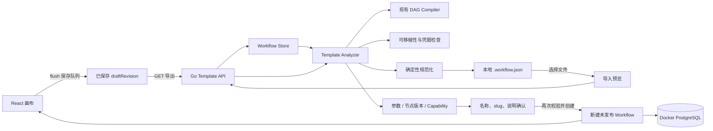
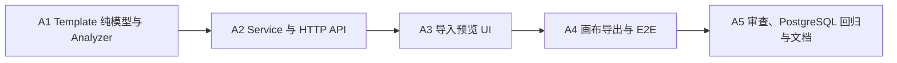

# Agent Studio v0.3-A 版本化 JSON 工作流模板设计

- **日期：** 2026-08-19
- **目标版本：** v0.3-A
- **状态：** 待规格审阅
- **主分支：** `main`
- **设计分支：** `codex/v0.3-workflow-templates-design`

## 1. 背景

Agent Studio v0.2.0 已具备画布优先的工作流编辑器、开始节点驱动的 Agent 页面、草稿 revision、不可变发布版本、Docker PostgreSQL、DAG 编译执行、公开 Go Node SDK，以及 Echo、Retriever、Webhook 等扩展节点。

当前工作流只能保存在单个 Agent Studio 实例的 PostgreSQL 中。用户不能把一套节点、连线、开始参数和布局保存为可审查的本地文件，也不能在另一实例快速创建相同结构的未发布工作流。v0.3-A 先补齐最小可用的模板闭环，不提前建设服务端模板库、市场或远程分享。

本阶段把模板定义为“可移植的工作流结构”，而不是数据库备份：模板保留创建 Agent 所需的业务配置和画布布局，但不携带实例身份、运行历史、发布状态或运行期密钥。

## 2. 已确认的产品决策

- 模板载体使用本地、版本化 JSON 文件。
- 格式版本独立于应用版本和工作流图版本，首版为 `agent-studio.dev/v1alpha1`。
- 导出对象固定为当前已保存的草稿，不隐式导出已发布版本。
- 导入前必须展示预览和兼容性结果；最终导入时服务端再次执行同一套校验。
- 导入总是创建新的、未发布的工作流，不覆盖已有工作流，也不继承数据库 ID、revision 或版本号。
- 工作流名称、slug 和说明在导入确认页填写；模板元数据仅用于预填，slug 不属于可移植模板。
- 节点类型按 `type@typeVersion` 精确匹配；本阶段不自动升级、降级、下载或安装缺失节点。
- 文件只在用户浏览器与本地 API 之间传输；不建设模板市场、分享链接、远程 URL 导入或 Git 自动同步。
- UI 继续遵循“画布优先、聚焦式单栏”：列表页负责导入，画布工具栏负责导出当前草稿。

## 3. 目标、成功标准与非目标

### 3.1 目标与成功标准

1. 用户可从画布导出字节级稳定的 `.workflow.json` 文件。
2. 用户选择本地 JSON 后，能在创建前看到名称、说明、节点/连线数量、开始参数、节点版本兼容性和 capability 提示。
3. 合法模板导入后生成 `draftRevision=1`、未发布的新工作流，并直接进入画布。
4. `导出 → 导入 → 再导出` 在使用相同名称和说明时得到语义相同、规范化后字节相同的模板。
5. 缺失节点、错误版本、非法配置、错误端口、断边、环、开始/结束节点数量错误都必须显式返回稳定 issue，不得静默丢弃或修复。
6. 模板不包含工作流/版本/运行数据库 ID、revision、发布时间、运行记录、持久化输出、环境变量值、模型凭据或 Webhook Token。
7. 发现已知明文凭据配置时拒绝导出和导入，错误只暴露节点 ID 与配置路径，不回显值。
8. Echo、Retriever、Webhook 和核心节点图可完成模板往返；缺失扩展节点的环境只能预览问题，不能落库。
9. 任一校验或 slug 冲突失败时不创建半成品工作流。

### 3.2 明确不做

- 服务端模板表、收藏、分类、搜索、权限、租户或审计日志。
- 模板市场、远程分享、URL 导入、Git 仓库同步和云存储。
- 工作流合并、覆盖导入、局部节点复制或跨画布粘贴。
- 缺失节点自动安装、远程代码加载、版本迁移器或兼容版本猜测。
- 导出运行记录、发布版本历史、测试结果、环境变量或任何运行快照。
- 加密模板、签名、来源信任、恶意第三方节点沙箱和 capability 授权。
- YAML、ZIP、图片、二进制附件和节点包随模板分发。

## 4. 方案比较

| 方案 | 优点 | 主要问题 | 结论 |
|---|---|---|---|
| 本地版本化 JSON | 最轻量、可 diff、可进入 Git、无需迁移、符合本地优先 | 需要用户自行管理文件 | **采用** |
| PostgreSQL 模板库 | 可集中管理、可搜索 | 需要新表、CRUD、权限和模板生命周期，超出最小闭环 | 延后至 v0.3-B 之后评估 |
| Git 原生 YAML | 人工编辑友好 | YAML 严格解析、类型歧义、注释/顺序规范化成本更高 | 不采用 |
| 远程市场/分享链接 | 分发体验好 | 引入身份、信任、审核、依赖解析和远程代码安全边界 | 明确延后 |

JSON 与现有 OpenAPI、Go `domain.Graph` 和前端类型链路一致，可以直接复用严格 JSON 解码、编译器和通用配置对象，是本阶段唯一没有基础设施前置依赖的方案。

## 5. 总体架构



核心约束：

- `workflowtemplate` 是纯格式、分析、安全检查和规范化包，不访问数据库、不处理 HTTP，也不执行节点。
- `workflow.Service` 负责编排读取、revision 检查、分析和创建；现有 `Store.CreateWorkflow` 仍是唯一写入口。
- 模板分析复用现有 DAG 编译器，因此画布发布与模板导入不会形成两套图合法性规则。
- Analyzer 只调用当前进程已注册节点的 `Resolve`；模板本身不能声明包路径、入口函数或远程代码。
- 预览不保留服务端临时状态；浏览器在最终导入时重发同一对象，服务端重新分析后才写入。

`workflowtemplate` 在自身包内声明最小 `Compiler` 和 `NodeCatalog` 接口；现有 `engine.Compiler` 与 `nodes.Registry` 直接满足接口。`workflow.Service` 只注入这两个抽象，不允许 Analyzer 反向依赖 HTTP、PostgreSQL 或 `workflow.Service`，从而避免导入环。

## 6. 模板格式

### 6.1 顶层结构

首版文件固定为：

```json
{
  "apiVersion": "agent-studio.dev/v1alpha1",
  "kind": "WorkflowTemplate",
  "metadata": {
    "name": "知识助手",
    "description": "使用 Retriever 检索并生成回答"
  },
  "spec": {
    "graph": {
      "schemaVersion": 1,
      "nodes": [],
      "edges": []
    }
  }
}
```

字段约束：

| 字段 | 约束 |
|---|---|
| `apiVersion` | 必须精确等于 `agent-studio.dev/v1alpha1` |
| `kind` | 必须精确等于 `WorkflowTemplate` |
| `metadata.name` | 去除首尾空白后非空，最多 128 个 Unicode 字符 |
| `metadata.description` | 最多 2048 个 Unicode 字符 |
| `spec.graph` | 复用现有 `Graph`，首版 `schemaVersion` 必须为 1 |
| 未知字段 | 顶层、metadata、spec、graph、node 和 edge 均拒绝；节点 `config` 仍由对应节点 JSON Schema 决定 |

模板格式版本和图版本分离：`apiVersion` 控制模板包络及导入语义，`graph.schemaVersion` 控制工作流图。未来新增格式时通过显式 converter 支持旧版本；当前 API 对未知版本返回 issue，不尝试猜测或降级。

### 6.2 保留和排除字段

保留：

- 模板名称和说明。
- 节点 ID、类型、精确版本、位置和配置。
- 边 ID、源/目标节点及端口。
- 开始节点字段配置，因此 Agent 前端参数可在导入后重新推导。

排除：

- workflow ID、slug、draft revision、published version ID/number、创建和更新时间。
- workflow version ID、发布序号和派生 `inputSchema`。
- run、node run、输入输出、错误、事件和图快照。
- 环境变量内容、模型 Provider 配置、Webhook 基地址和 Token。

内部节点和边 ID 是图内引用，不是数据库身份，因此原样保留。不同工作流可以安全复用相同图内 ID。

### 6.3 确定性输出

Analyzer 生成新对象，不直接透传数据库中的 `json.RawMessage`：

1. 节点按 `id` 升序排序，边按 `id` 升序排序。
2. 每个 `config` 解码为 JSON 值后重新编码；对象键使用 Go `encoding/json` 的稳定排序。
3. `nodes`、`edges` 和所有响应列表为空时输出 `[]`，不得输出 `null`。
4. 顶层使用固定 struct 字段顺序、两个空格缩进，并以单个换行结尾。
5. 不加入时间戳、导出者、应用构建号、随机 ID 或文件系统路径。

位置和数组型业务配置的顺序属于模板语义，不重排；只重排图的节点集合和边集合。

## 7. 导出流程

### 7.1 API

```http
GET /api/workflows/{id}/template?draftRevision={revision}
Accept: application/json
```

成功返回：

- `200 OK`
- `Content-Type: application/json; charset=utf-8`
- `Content-Disposition: attachment; filename="<safe-slug>.workflow.json"`
- `Cache-Control: no-store`
- `X-Content-Type-Options: nosniff`
- 规范化的 `WorkflowTemplate` 正文

`draftRevision` 必填。画布先 `SaveQueue.flush()`，再传入队列中的最新 revision；服务端读取工作流后再次比较。这样不会把用户看到的新图误导出为旧草稿。列表或后续其他入口同样必须传入列表数据中的 revision。

### 7.2 服务端顺序

1. 读取工作流；不存在返回 `404 NOT_FOUND`。
2. 比较 `draftRevision`；不一致返回 `409 WORKFLOW_REVISION_CONFLICT`。
3. 将名称、说明和草稿图构造成模板。
4. 执行格式预算、安全检查和现有 Compiler 校验。
5. 校验通过后规范化并输出；任何 issue 都返回 `422 WORKFLOW_TEMPLATE_INVALID`。

Service 返回 Analyzer 已编码的字节和安全 slug；HTTP Handler 直接写这些字节，不再把对象交给 `writeJSON` 二次编码，确保测试覆盖的缩进、字段顺序和尾部换行就是用户下载到的内容。

导出仅面向“可再次导入并使用”的模板，不承担未完成草稿备份职责。因此不完整、缺节点或已经失去节点依赖的草稿必须先修复，不能生成一个已知不可导入的文件。

## 8. 导入预览与创建

### 8.1 预览 API

```http
POST /api/workflow-templates/preview
Content-Type: application/json

{"template": { ... }}
```

语法正确的请求始终返回 `200` 和：

```json
{
  "valid": true,
  "metadata": {
    "name": "知识助手",
    "description": "使用 Retriever 检索并生成回答"
  },
  "summary": {
    "nodeCount": 4,
    "edgeCount": 3,
    "inputSchema": {"type": "object", "properties": {}},
    "nodeTypes": [
      {
        "type": "extension.retriever",
        "version": "1.0.0",
        "title": "Retriever",
        "count": 1,
        "available": true,
        "capabilities": []
      }
    ]
  },
  "issues": []
}
```

`nodeTypes` 按 `type@version` 排序并聚合计数。缺失节点仍出现在列表中，`available=false`，并同时产生 `NODE_TYPE_NOT_FOUND` issue。`inputSchema` 从开始节点配置重新推导，前端只展示字段名、标题、类型和必填状态，不把它当作模板持久化数据。

即使图无效，Analyzer 仍可用 Graph 和 NodeCatalog 生成节点数量、边数量及可识别的节点摘要；只有开始节点可以安全解析并派生时才返回其 `inputSchema`，否则返回空 object 并依靠 issues 解释原因。预览不得为了生成摘要调用未通过预算或凭据检查的节点 `Resolve`。

capability 只是已安装节点声明的审查信息。前端对 `network`、`secrets`、`filesystem-read`、`filesystem-write` 显示提示，但不得将其描述为已经强制执行的沙箱权限。

### 8.2 导入 API

```http
POST /api/workflow-templates/import
Content-Type: application/json

{
  "template": { ... },
  "name": "知识助手副本",
  "slug": "knowledge-helper-copy",
  "description": "从本地模板导入"
}
```

服务端处理顺序：

1. 严格解码请求和模板包络。
2. 对最终 `name`、`slug`、`description` 使用与普通创建一致的身份校验。
3. 重新执行完整 Analyzer，不信任此前的预览结果。
4. 使用规范化 Graph 调用现有 `Store.CreateWorkflow`，revision 固定为 1，published version 为空。
5. 返回 `201 Created` 和新 Workflow；前端跳转 `/workflows/{newID}`。

模板元数据不覆盖用户确认的身份字段。slug 不进入模板，避免不同实例间的自然冲突被误认为模板损坏。

### 8.3 原子性

所有可能失败的解析、预算、安全和编译检查都发生在写数据库之前。最终写入仍是现有 `CreateWorkflow` 的单条 `INSERT`：

- 校验失败：零写入。
- slug 唯一约束竞争：整个 INSERT 失败并映射为 409，零半成品。
- 成功：一次产生完整的新草稿工作流。

本阶段不需要新表、迁移、跨语句事务或补偿删除。

## 9. Analyzer 与兼容性规则

Analyzer 固定执行以下顺序，并返回排序稳定的 `ValidationIssue`：

1. 校验 `apiVersion`、`kind`、metadata 和资源预算。
2. 校验凭据和不可移植配置，不修改原值。
3. 调用现有 Compiler 完成节点 ID、节点版本、Config Schema、动态端口、连线、基数、开始/结束节点、可达性和 DAG 校验。
4. 编译成功后派生开始节点 `inputSchema` 和节点类型摘要。
5. 生成规范化模板与 Graph。

新增模板 issue code：

| code | 含义 |
|---|---|
| `TEMPLATE_API_VERSION_UNSUPPORTED` | 模板版本不受支持 |
| `TEMPLATE_KIND_INVALID` | kind 不正确 |
| `TEMPLATE_METADATA_INVALID` | 名称或说明不符合约束 |
| `TEMPLATE_LIMIT_EXCEEDED` | 文件、节点、边或嵌套深度超过预算 |
| `TEMPLATE_SECRET_CONFIG_FOUND` | 检测到禁止进入模板的已知凭据配置 |
| `TEMPLATE_CONFIG_JSON_INVALID` | 节点 config 不是合法 JSON 值 |

图问题继续复用 Compiler 的既有 code，例如 `NODE_TYPE_NOT_FOUND`、`NODE_CONFIG_INVALID`、`EDGE_NODE_NOT_FOUND`、`SOURCE_PORT_NOT_FOUND`、`WORKFLOW_CYCLE`。不得为了模板另建一套含义不同的 code。

资源预算固定为：

- HTTP JSON 正文最大 2 MiB，复用现有 `maxJSONBodyBytes`。
- 最多 500 个节点、2000 条边。
- 节点 config JSON 最大嵌套深度 64。
- 前端在读取文件前先检查 2 MiB，服务端仍是最终权威。

这些限制避免小型本地服务在预览阶段被超大图、排序或深层 JSON 消耗过多资源。现有画布如果已经保存了超过预算的图，导出会明确失败，不自动截断。

## 10. 安全与信任边界

### 10.1 不读取运行期密钥

模板生成只读取 Workflow 行和注册节点 Definition。它不会读取进程环境变量、模型 Provider、Webhook URL/Token、run 表或日志，因此环境注入的密钥不会被物化进模板。

### 10.2 已知明文凭据检查

Analyzer 对导出、预览和最终导入使用同一检查：

- 若节点 Config Schema 中 `writeOnly: true` 或 `x-agent-studio-secret: true` 的属性有值，拒绝并报告路径。
- 若 config 中出现明确凭据字段名（如 `apiKey`、`password`、`authorization`、`cookie`、`secret`、独立的 `token` 及 access/refresh/bearer token 变体），拒绝；`maxTokens` 等普通业务字段不得误判。
- 对内置 `http` 节点，敏感 Header 使用非空 `literal` 值时拒绝；改为 `valueSource=env` 后只导出环境变量名。
- 对内置 `http` 节点，URL query 中敏感参数携带非空值时拒绝。
- issue 只包含 code、nodeId 和路径，不包含配置值、Header 值或完整 URL。

检查采用“拒绝”而不是写入 `[REDACTED]`，因为静默改写会产生无法运行或语义不同的模板。

Node SDK 的后续节点可通过标准 JSON Schema `writeOnly` 声明不可移植配置；`x-agent-studio-secret` 仅为兼容需要的扩展提示。本阶段不修改 Node 接口，也不为每个扩展增加中央模板适配器。

Schema 标记解析覆盖 `properties`、`items`、`allOf`、`anyOf`、`oneOf` 以及同一文档内的 `#/$defs/...` JSON Pointer；循环本地引用使用已访问集合终止。当前 Registry 不为 Config Schema 提供外部文档资源，Analyzer 同样不访问网络或解析外部 `$ref`。如果未来 Registry 支持外部资源，模板安全策略必须先扩展后才能接受其中的不可移植字段标记。

### 10.3 不能自动识别的内容

系统无法判断用户是否把凭据粘贴进 `systemPrompt`、Retriever 文档或其他普通自由文本。UI 必须提示“模板包含节点业务配置，请勿在自由文本中保存密钥”。本设计保证不主动读取运行期密钥，并阻断已知配置通道，但不宣称能证明任意文本不含秘密。

### 10.4 本地可信代码边界

- 模板不能携带 Go 包、二进制、脚本入口或下载地址。
- 缺失节点只报告，不加载远程代码。
- 对已安装节点执行 `Resolve` 与现有发布编译行为一致；这些节点本来就是 API 进程内受信任代码。
- capability 仅用于预览和审查，不是权限隔离。
- 本地 JSON 仍是不可信输入，必须经过大小、严格字段、Schema、Compiler 和深度限制后才落库。

## 11. HTTP 错误语义

| 场景 | HTTP | code | 说明 |
|---|---:|---|---|
| JSON 非法、未知字段、尾随值、缺少必填 query | 400 | `REQUEST_INVALID` | 不回显解析正文 |
| 工作流不存在 | 404 | `NOT_FOUND` | 沿用现有错误 |
| 导出 revision 已变化 | 409 | `WORKFLOW_REVISION_CONFLICT` | 画布提示刷新或重试 |
| 导入 slug 冲突 | 409 | `WORKFLOW_SLUG_CONFLICT` | 用户修改 slug 后重试 |
| 导出或最终导入模板不合法 | 422 | `WORKFLOW_TEMPLATE_INVALID` | `issues` 返回稳定、安全问题列表 |
| 预览发现语义问题 | 200 | 无顶层错误 | `valid=false` 并返回 issues |
| 未预期内部错误 | 500 | `INTERNAL_ERROR` | 不暴露底层文本 |

预览的语义错误使用 200，便于 UI 一次展示所有兼容性问题；最终导入和导出必须阻止不合法模板，因此使用 422。

## 12. 前端交互

### 12.1 导入

工作流列表页标题区域增加次按钮“导入模板”，主按钮“新建工作流”保持不变。弹窗为单栏聚焦流程：

1. 选择 `.json` 文件；只允许单文件，客户端先检查 2 MiB。
2. 解析 JSON 并调用 preview；解析失败显示“模板 JSON 无效”，不发送 import。
3. 展示模板名称/说明、节点/连线数量、开始参数、按版本聚合的节点兼容性和 capability 提示。
4. 展示可编辑的名称、slug、说明；名称和说明由 metadata 预填，slug 根据名称生成建议但必须由用户确认。
5. `valid=false` 时禁用“导入并打开”，issue 可按节点定位阅读；不提供“忽略并导入”。
6. 成功后关闭弹窗并进入新工作流画布。

更换文件会清空旧预览、身份表单、提交错误和进行中状态。关闭弹窗不会在服务端留下临时模板。

名称、说明、issue 和节点标题都以 React 文本节点呈现，不使用 `dangerouslySetInnerHTML`。前端不把模板对象合并进全局配置，也不执行模板中的字符串。

### 12.2 导出

画布工具栏增加“导出模板”：

1. 点击后禁用按钮并等待保存队列 flush。
2. 使用最新 revision 请求导出 Blob。
3. 成功下载 `<slug>.workflow.json` 并释放 Object URL。
4. revision 冲突、模板无效或网络失败时在工具栏附近显示可访问错误，不生成空文件。

导出不会打开额外多步页面，保持画布主任务聚焦。按钮文案和帮助文字明确其导出的是“当前已保存草稿模板”，不是运行数据备份。

## 13. 文件影响

### 13.1 新增文件

| 文件 | 职责 |
|---|---|
| `apps/api/internal/workflowtemplate/model.go` | 模板、metadata、preview 和 summary 类型及常量 |
| `apps/api/internal/workflowtemplate/analyzer.go` | 预算、Compiler 复用、inputSchema 和节点摘要 |
| `apps/api/internal/workflowtemplate/canonical.go` | Graph/config 规范化与确定性编码 |
| `apps/api/internal/workflowtemplate/security.go` | Schema 标记、凭据字段、HTTP Header/URL 检查 |
| `apps/api/internal/workflowtemplate/*_test.go` | 格式、兼容性、安全和往返单元测试 |
| `apps/web/src/features/workflows/ImportWorkflowTemplateDialog.tsx` | 单栏选择、预览、身份确认和导入 |
| `apps/web/src/features/workflows/ImportWorkflowTemplateDialog.test.tsx` | 导入交互与可访问性回归 |
| `apps/web/e2e/workflow-template.spec.ts` | 浏览器下载、上传、预览和新草稿闭环 |

### 13.2 修改文件

| 文件 | 修改 |
|---|---|
| `apps/api/internal/workflow/service.go` | 增加 Export/Preview/Import 编排并复用创建身份校验 |
| `apps/api/internal/workflow/service_test.go` | 新草稿、revision、失败零写入和语义往返测试 |
| `apps/api/cmd/server/main.go` | 将现有 Registry 作为 NodeCatalog 注入 Workflow Service |
| `apps/api/internal/httpapi/workflows.go` | 模板 export/preview/import handlers 和 attachment headers |
| `apps/api/internal/httpapi/router.go` | 注册三条模板路由并扩展 WorkflowService 接口 |
| `apps/api/internal/httpapi/errors.go` | 映射 `WORKFLOW_TEMPLATE_INVALID` |
| `apps/api/internal/httpapi/router_test.go` | 严格请求、状态码、响应头和无敏感值测试 |
| `contracts/openapi.yaml` | 增加模板 endpoints、schemas、requests 和 responses |
| `apps/web/src/lib/api/generated.ts` | 由 OpenAPI 命令重新生成，不手工编辑 |
| `apps/web/src/lib/api/client.ts` | preview/import 与 Blob 下载客户端 |
| `apps/web/src/features/workflows/WorkflowListPage.tsx` | 增加导入入口和成功导航 |
| `apps/web/src/features/workflows/WorkflowListPage.test.tsx` | 导入入口集成回归 |
| `apps/web/src/features/studio/StudioPage.tsx` | flush 后导出、状态与错误提示 |
| `apps/web/src/features/studio/StudioPage.test.tsx` | revision 一致性、下载和失败回归 |
| `apps/web/src/styles.css`、`apps/web/src/features/studio/studio.css` | 最小导入预览和工具栏状态样式 |

明确不修改：

- `apps/api/migrations/*`
- PostgreSQL Store 实现与表结构
- `apps/api/internal/workflow/ports.go` 中的 Store 接口
- `sdk/go/agentnode` 接口
- 节点 manifest、生成注册表和执行引擎

## 14. 测试矩阵

### 14.1 Go 单元测试

- 顶层版本、kind、metadata、未知字段和边界长度。
- 空切片输出 `[]`，config 对象键、节点和边排序稳定。
- 同一输入重复导出字节一致；导入后再导出一致。
- 文件、节点、边和 config 深度超限。
- 缺失/错误节点版本、Config Schema、动态端口、断边、基数、环、开始/结束数量。
- Echo、Retriever、Webhook、核心节点配置和位置往返。
- Schema `writeOnly`/扩展 secret 标记、敏感字段、HTTP 明文敏感 Header 与 URL query 拒绝。
- `maxTokens`、普通 `authorship` 等相似字段不误判。
- issue 和公开错误正文不包含测试密钥、Header 值或完整 URL。
- export revision 冲突；import 身份非法、slug 冲突；所有失败都不调用 Create。

### 14.2 HTTP 测试

- 三条路由的方法、请求/响应 Schema 和 attachment filename。
- malformed、unknown、trailing、多值 JSON、超限正文均为 400。
- preview invalid 返回 200/`valid=false`，import invalid 返回 422。
- 404、409 和 500 保持安全稳定形状。
- Content-Disposition 只使用已验证 slug，不接受模板提供的文件名。

### 14.3 PostgreSQL 与服务回归

- 复用 Docker PostgreSQL 执行完整 `make verify`。
- 导入成功后的行只有新 workflow，revision=1、published_version_id=NULL。
- slug 并发冲突不会增加 workflow 数量。
- 不产生 workflow_versions、runs 或 node_runs。

### 14.4 前端与 E2E

- 文件大小、非法 JSON、重选和关闭弹窗状态清理。
- preview loading、invalid issues、缺失节点和 capability 展示。
- 名称/slug 校验、slug 冲突、重复提交禁用和成功导航。
- 画布导出先等待 save，再使用新 revision；失败不触发下载。
- Playwright 捕获下载，重新上传，核对开始参数和节点摘要，并确认导入后未发布。

最终实施门禁：

```bash
CGO_ENABLED=0 make verify-quick
make verify
make test-e2e
git diff --check
```

Go 命令始终显式或通过 Makefile 使用 `CGO_ENABLED=0`。

## 15. 交付顺序



每个阶段使用测试驱动的小提交；后一阶段不绕过前一阶段的接口。实现完成后必须先进行代码审查和回归验证，再合并主分支。

## 16. 可行性与阻塞项审查

### 16.1 已确认可复用的基础

- `domain.Graph` 已包含模板所需节点、版本、布局、配置和边，不需要新持久化模型。
- 现有 Compiler 已覆盖节点兼容性、配置、动态端口、结构和 DAG 校验。
- `builtin.DeriveInputSchema` 已能从开始节点生成 Agent 前端 Schema，模板不必复制派生数据。
- `Store.CreateWorkflow` 是单条 INSERT，天然满足导入原子性并映射 slug 唯一冲突。
- Workflow 草稿已经有 revision，可在导出前后建立明确的一致性检查。
- OpenAPI 生成链和通用前端错误类型已经存在。
- 当前所有官方节点的运行期 Token/Provider 密钥来自环境，不在普通工作流字段中；HTTP 节点的明文敏感 Header 和 URL query 已由本设计显式阻断。

### 16.2 已消除的阻塞候选

| 候选问题 | 处理方式 | 结论 |
|---|---|---|
| 预览通过后节点状态漂移 | 最终 import 重新编译，不使用预览缓存 | 无阻塞 |
| 导出时自动保存尚未完成 | 前端 flush，服务端强制匹配 revision | 无阻塞 |
| 导入创建一半后失败 | 所有分析先于单条 INSERT | 无阻塞 |
| 缺失扩展节点 | 精确版本 issue，禁止落库，不自动下载代码 | 无阻塞 |
| 模板携带环境密钥 | 生成路径不读环境；已知明文配置拒绝 | 无阻塞 |
| 凭据静默脱敏破坏语义 | 改为拒绝并给安全路径 | 无阻塞 |
| 确定性被 RawMessage 键顺序破坏 | config 解码后规范化编码 | 无阻塞 |
| 需要数据库迁移 | 复用现有 workflows 表和 CreateWorkflow | 无阻塞 |
| 文件或深层 JSON 造成资源耗尽 | 2 MiB、500 节点、2000 边、64 层限制 | 无阻塞 |
| capability 被误当沙箱 | UI 和文档明确它只是声明元数据 | 无阻塞 |

### 16.3 剩余非阻塞风险

- 普通自由文本可能被用户主动写入秘密：通过明确警示和已知通道拦截降低风险，无法对任意文本做可靠秘密判定。
- `Resolve` 属于已安装受信任节点代码，可能昂贵或依赖外部状态：复用现有编译语义并在预览/导入分别执行；未来可增加纯度契约或超时，不阻塞本阶段。
- alpha 模板格式未来可能演进：独立 `apiVersion` 和严格拒绝未知版本可避免静默不兼容。
- 500/2000 预算可能需要实际使用数据校准：错误是显式的，不会截断或污染数据，可在后续兼容调整。

审查结论：当前设计没有 Critical 或 Important 级未解决阻塞。功能可以在不迁移数据库、不改变 Node SDK、不引入远程信任边界的前提下实施。

## 17. 验收清单

- [ ] 未保存修改不会被误导出；导出使用最新 revision。
- [ ] 同一草稿重复导出字节一致。
- [ ] 模板不含实例 ID、revision、版本历史、运行数据或环境密钥。
- [ ] 已知明文敏感配置被拒绝且错误不回显值。
- [ ] 导入预览展示开始参数、节点精确版本、计数和 capability。
- [ ] 缺失节点、非法配置和图错误不能导入。
- [ ] 导入只创建 revision 1 的未发布新工作流。
- [ ] 失败路径零半成品、零运行和零发布版本。
- [ ] Echo、Retriever、Webhook 与核心节点模板往返通过。
- [ ] OpenAPI 生成物无漂移，Go/Web/Playwright/PostgreSQL 门禁通过。
- [ ] 代码审查无 Critical/Important，文档说明本地文件和自由文本密钥边界。
