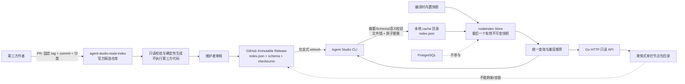

# Agent Studio v0.3-C Git 节点包索引设计

- **目标版本：** v0.3-C
- **状态：** 方案已确认，待实施计划
- **设计日期：** 2026-08-20
- **基线提交：** `835aeebd543d7447527d2eb5ebe296e77f110081`
- **设计分支：** `codex/v0.3-git-index-design`
- **前置能力：** v0.3-A 工作流模板、v0.3-B 节点包元数据与兼容检查
- **官方索引仓库：** `github.com/yyl1212/agent-studio-node-index`（待实施阶段创建）

## 1. 背景

v0.3-B 已让一个 Go Module 用 `agent-studio.node-package.json` 声明节点包元数据、Runtime 兼容范围和注册节点，并在构建期及启动期校验声明与实际注册结果。当前缺少的是“发现”能力：维护者仍要先知道包的仓库和版本，才能手工加入依赖图。

v0.3-C 建设一套轻量、可审查、无需数据库的官方节点包目录：第三方作者通过 Pull Request 向独立 Git 仓库提交固定版本；仓库生成严格 JSON 快照并以 GitHub 不可变 Release 发布；Agent Studio CLI 只在用户显式执行刷新时联网，把已校验快照原子写入本地文件；API 和 Web 只读取本地或内置快照。

本阶段解决“在哪里找到兼容节点包、它来自哪个固定版本、当前审核和弃用状态是什么”，不解决“自动安装或执行第三方代码”。

## 2. 已确认的产品与技术决策

1. 首个版本同时提供 CLI 搜索/详情和 Web 只读目录。
2. 使用单一官方精选索引；第三方作者通过 PR 投稿，不接受运行时自定义索引源。
3. 官方索引位于独立仓库 `yyl1212/agent-studio-node-index`，与 Agent Studio 产品仓库分离治理。
4. 索引以 GitHub 不可变 Release 的 `index.json` 资产分发，不读取 `main` 分支 raw 文件，也不在客户端执行 `git clone`。
5. 产品携带内置快照；只有 `agent-studio node index refresh` 显式联网刷新。
6. 刷新结果保存在本地文件中；容器通过挂载目录型 Docker volume 复用同一机制；不新增 PostgreSQL 表或迁移。
7. API 和 Web 永不触发远程刷新；当前没有登录与 RBAC，因而不增加匿名联网写入口。
8. 清单中的包名、展示信息、许可证、仓库、兼容范围和节点注册是作者元数据的权威来源；索引只增加分类、关键词、审核、生命周期和固定 Git 来源。
9. 一个包保留所有仍受支持的已审核历史版本；默认推荐当前 Runtime 可兼容的最高稳定 active 版本。
10. 发布来源固定到 Git tag、Git commit OID 和原始清单 SHA-256，不跟随可移动分支。
11. 初版只索引公开 GitHub 仓库中的 Go 节点包；其他 Git 托管平台留待后续版本。
12. 目录保持“画布优先、聚焦式单栏”：新增独立节点包页，不把市场交互塞进工作流画布。

## 3. 目标与非目标

### 3.1 目标

1. 建立可由代码审查和 CI 共同维护的官方节点包提交格式。
2. 生成确定性、严格、带资源预算的版本化 `index.json`。
3. 通过 GitHub 不可变 Release 发布不可修改的索引快照。
4. CLI 能查看快照状态、显式刷新、搜索包和查看精确版本详情。
5. Web 能按文本、分类、兼容性浏览包，并明确显示索引来源与新鲜度。
6. 离线、GitHub 故障、限流、坏资产或缓存损坏时，搜索仍能使用最后一个有效快照或内置快照。
7. 远程内容在进入缓存前完成来源、大小、摘要、Schema、语义和兼容字段校验。
8. CLI、API 与 Web 对推荐版本使用同一算法，结果稳定可测试。
9. 服务无需访问 GitHub、无需 GitHub Token、无需数据库，即可启动并提供目录读取。
10. 后续增加自动安装、签名或多索引时，不需要推翻快照和 Store 边界。

### 3.2 非目标

- 自动运行 `go get`、修改 `go.mod/go.sum`、更新 `agent-studio.nodes.yaml` 或重新生成注册代码。
- 从 Web 或 API 刷新索引、安装节点、执行第三方代码或写入远程仓库。
- 用户自定义索引 URL、企业私有索引、多源合并或镜像优先级。
- 包评分、下载量、收藏、评论、作者账号体系或后台审核系统。
- 对第三方代码做安全审计、恶意软件扫描、作者身份担保或运行时沙箱。
- 在 v0.3-C 客户端验证 GitHub Release attestation；首版信任边界见第 9.2 节。
- 自动删除已撤回版本或隐藏其历史记录；withdrawn 版本需要可追溯。
- 为目录数据增加数据库持久化、全文检索服务或独立搜索引擎。
- 支持非 GitHub 源、私有仓库、需要认证的 Release 或 GitHub Enterprise。
- 改变现有工作流编译、节点 Registry 或运行生命周期。

## 4. 方案比较

| 方案 | 优点 | 主要问题 | 结论 |
|---|---|---|---|
| GitHub 不可变 Release 快照 | 资产和 Tag 发布后不可修改；客户端只下载一个有限 JSON；可离线缓存 | 需要独立发布流程；仍需明确信任边界 | **采用** |
| 读取索引仓库 `main` raw 文件 | 实现最少、更新立即生效 | 内容可被覆盖，无法稳定复现，缓存回滚检测困难 | 不采用 |
| 客户端 `git clone/pull` 索引仓库 | 完整保留历史 | 依赖 Git、下载更重、目录状态和凭据复杂 | 不采用 |
| PostgreSQL 节点市场 | 查询和运营能力强 | 引入迁移、后台、同步服务与运维，超出轻量目标 | 不采用 |
| Web/API 自动定时刷新 | 用户无须操作 | 当前无鉴权；服务启动和可用性被外部网络耦合 | 不采用 |

GitHub 官方文档说明，不可变 Release 发布后会锁定关联 Tag 和资产，并为 Release 生成 attestation；推荐流程是先创建草稿、附加全部资产，再发布。v0.3-C 使用前两项不可变保护，attestation 验证留到后续版本。

参考：

- [GitHub Immutable releases](https://docs.github.com/en/code-security/concepts/supply-chain-security/immutable-releases)
- [GitHub REST API - Releases](https://docs.github.com/en/rest/releases/releases?apiVersion=2026-03-10)
- [GitHub REST API rate limits](https://docs.github.com/en/rest/using-the-rest-api/rate-limits-for-the-rest-api?apiVersion=2026-03-10)

## 5. 总体架构



### 5.1 组件边界

- **官方索引仓库：** 接收投稿、读取固定 commit 的清单、验证、生成和发布快照。CI 不编译、不测试、不执行第三方仓库代码。
- **`internal/nodeindex`：** 索引模型、严格解析、语义校验、缓存、GitHub Release 客户端、兼容推荐和搜索。不得依赖 HTTP handler、React、工作流或数据库。
- **CLI：** 唯一远程刷新入口；搜索和详情直接消费 `internal/nodeindex`。
- **API：** 只读消费 Snapshot Store，暴露安全 DTO；不得持有远程 Client 或刷新方法。
- **Web：** 只调用本地 API；不得直连 GitHub API，不保存索引副本，不展示自动安装按钮。
- **PostgreSQL：** 不保存索引、搜索结果、刷新状态或用户偏好。

### 5.2 两个不可混淆的版本域

- **索引发布版本：** 官方索引仓库 Release Tag，例如 `v0.2.0`，表示快照本身的单调版本。
- **节点包版本：** Go Module SemVer，例如 `v1.4.2`，表示被索引包的发布版本。

两者独立。客户端防止索引缓存降级时比较前者；选择推荐节点包时比较后者。

## 6. 官方索引仓库设计

### 6.1 预期文件

```text
agent-studio-node-index/
├── .github/
│   ├── CODEOWNERS
│   ├── PULL_REQUEST_TEMPLATE.md
│   └── workflows/
│       ├── ci.yml
│       └── release.yml
├── cmd/indexgen/
│   └── main.go
├── internal/indexgen/
│   ├── generate.go
│   ├── fetch.go
│   └── *_test.go
├── packages/
│   └── <sha256(module-path + "\n" + version)>.json
├── schema/
│   ├── submission.schema.json
│   └── node-index-v1alpha1.schema.json
├── testdata/
│   ├── valid/
│   └── invalid/
├── CONTRIBUTING.md
├── SECURITY.md
├── go.mod
└── README.md
```

`dist/` 是 Release 构建产物，不作为人工编辑源。发布资产固定为：

```text
index.json
node-index-v1alpha1.schema.json
checksums.txt
```

### 6.2 投稿记录

每个 `packages/*.json` 投稿文件只描述精选层信息和固定来源：

```json
{
  "apiVersion": "agent-studio.dev/v1alpha1",
  "kind": "NodePackageSubmission",
  "name": "github.com/example/agent-nodes",
  "version": "v1.2.3",
  "source": {
    "repository": "https://github.com/example/agent-nodes",
    "moduleDir": ".",
    "tag": "v1.2.3",
    "commit": "0123456789abcdef0123456789abcdef01234567",
    "manifestDigest": "sha256:89abcdef89abcdef89abcdef89abcdef89abcdef89abcdef89abcdef89abcdef"
  },
  "categories": ["integration", "search"],
  "keywords": ["http", "search"],
  "lifecycle": {
    "status": "active",
    "message": ""
  },
  "manifest": {
    "apiVersion": "agent-studio.dev/v1alpha1",
    "kind": "NodePackage",
    "metadata": {
      "name": "github.com/example/agent-nodes",
      "displayName": "Example Agent Nodes",
      "description": "Example search integration nodes",
      "license": "Apache-2.0",
      "repository": "https://github.com/example/agent-nodes"
    },
    "compatibility": {
      "nodeAPI": "agent-studio.dev/v1alpha1",
      "runtime": {
        "minVersion": "v0.3.0",
        "maxVersionExclusive": "v0.4.0"
      }
    },
    "registrations": [
      {
        "package": "github.com/example/agent-nodes/search",
        "nodes": [{"type": "example.search", "version": "1"}]
      }
    ]
  }
}
```

约束：

1. 文件名是 `sha256(name + "\n" + version)` 的小写十六进制，避免 Module path 中斜杠形成不受控目录层级，并允许同一包保留多个版本。
2. `(name, version)` 全局唯一；同一包的多个版本用多个投稿文件，生成时合并。
3. `version` 必须是有效 Go SemVer；默认目录只推荐无 prerelease 的稳定版本。
4. `source.repository` 必须是无 userinfo、query、fragment 的公开 `https://github.com/<owner>/<repo>` URL。
5. `source.moduleDir` 是仓库内 Go Module 根目录，默认 `.`；必须是正斜杠分隔的 clean 相对路径，禁止空段、`.` 之外的点段、`..`、反斜杠和绝对路径。
6. `source.tag` 必须解析到提交的 `source.commit`；commit OID 接受 40 或 64 位小写十六进制。monorepo 可使用 Go 约定的 `<moduleDir>/<version>` Tag。
7. 投稿文件携带 `manifest` 的规范化副本和原始文件 `manifestDigest`；CI 从精确 commit 的 `<moduleDir>/agent-studio.node-package.json` 获取原文，要求摘要及规范化语义逐字段一致。
8. CI 同时读取 `<moduleDir>/go.mod`，静态解析后要求 module path 等于 `name`，并校验 major version 规则；不读取分支最新版。
9. `source.repository` 必须与作者清单中的规范化 repository 一致，避免目录链接和实际取证来源分叉。
10. CI 不运行仓库脚本、Action、构建、测试、`go list` 或 `go generate`。
11. 分类和关键词来自投稿；其他展示及兼容字段必须来自已核验清单副本。
12. `review` 字段由生成器在进入 main 后写入快照，投稿者不能自行声明“已审核”。

把清单副本纳入投稿，使正式 Release 只依赖已经合并的索引仓库内容：即使第三方仓库稍后删除或临时不可访问，旧版本元数据仍可重现。外部网络取证发生在 PR 校验阶段，不发生在 Release 生成阶段。

首版推荐分类是 `model`、`search`、`retrieval`、`vector`、`file`、`integration`、`data`、`utility`。Schema 不把分类写成封闭 enum，而是要求小写 ASCII slug；新增分类需维护者审核和文档更新，但不迫使旧客户端升级 apiVersion。关键词允许 Unicode，规范化为 lowercase、trim 后的非空文本并拒绝控制字符。

### 6.3 审核含义

`review.status = approved` 只表示：来源固定、清单和索引契约有效、分类与描述经维护者审阅。它不表示 Agent Studio 对代码安全性、维护质量、许可有效性或作者身份作担保。Web 和文档必须使用“已收录/已审核元数据”，不得使用“安全、可信、认证插件”等措辞。

### 6.4 CI 与发布

PR CI：

1. 外部投稿 PR 只允许修改 `packages/`；修改 workflow、Schema、生成器或治理文件必须由维护者分支提出并经过 CODEOWNERS 审核。
2. workflow 从默认分支 checkout 可信 validator，把 PR 中 `packages/` 文件复制到独立数据目录后再校验；不得 `go run`、source 或执行 PR 分支中的工具代码。
3. 严格解析全部投稿和 Schema。
4. 对新增或修改投稿，只通过 GitHub API 获取固定 commit 的清单和 go.mod，限制单响应大小和总耗时，并与投稿内副本比较。
5. 校验 tag → commit、Module 名、版本、兼容范围和注册节点预算。
6. 生成两次 `index.json` 并逐字节比较，保证确定性。
7. 检查排序、重复、Schema、语义和资源上限。
8. 使用 `pull_request` 和只读 `contents` 权限，不使用 `pull_request_target`，不加载自定义 Secret。自动 `GITHUB_TOKEN` 只可由可信 validator 发给 `api.github.com`，不得进入 PR 数据、日志或第三方进程。

Release 工作流：

1. 只接受维护者创建的稳定 SemVer Tag；版本必须高于上一个索引 Release，前一 Release Tag commit 必须是新 Tag commit 的祖先，且新 Tag 位于 main。
2. 从该 Tag checkout（完整历史），只使用仓库内已核验投稿生成三个 Release 资产，发布阶段不重新依赖第三方仓库。
3. 先创建 draft Release，再上传全部资产，核对 SHA-256 后发布，并显式设为 latest。
4. 仓库必须提前启用 immutable releases；发布后校验 API 返回 `immutable=true`。
5. Release 必须是非 draft、非 prerelease，确保 latest Release API 能发现。
6. 发布失败时保留可诊断日志，不改写或复用已经发布的 Tag。

## 7. `index.json` 契约

### 7.1 顶层示例

```json
{
  "apiVersion": "agent-studio.dev/v1alpha1",
  "kind": "NodePackageIndex",
  "metadata": {
    "release": "v0.2.0",
    "generatedAt": "2026-08-20T08:00:00Z",
    "sourceCommit": "0123456789abcdef0123456789abcdef01234567"
  },
  "packages": []
}
```

远程资产中 `metadata.release` 必须精确等于 GitHub Release Tag。产品内置空快照使用保留版本 `v0.0.0-bootstrap`，它不是远程 Release，只作为无网络时的合法基线。

### 7.2 版本记录

`packages[].versions[]` 包含：

```json
{
  "version": "v1.2.3",
  "source": {
    "repository": "https://github.com/example/agent-nodes",
    "moduleDir": ".",
    "tag": "v1.2.3",
    "commit": "0123456789abcdef0123456789abcdef01234567",
    "manifestDigest": "sha256:89abcdef89abcdef89abcdef89abcdef89abcdef89abcdef89abcdef89abcdef"
  },
  "review": {
    "status": "approved",
    "reviewedAt": "2026-08-20T07:30:00Z",
    "indexCommit": "89abcdef0123456789abcdef0123456789abcdef"
  },
  "lifecycle": {
    "status": "active",
    "message": ""
  },
  "manifest": {
    "apiVersion": "agent-studio.dev/v1alpha1",
    "kind": "NodePackage",
    "metadata": {
      "name": "github.com/example/agent-nodes",
      "displayName": "Example Agent Nodes",
      "description": "Example search integration nodes",
      "license": "Apache-2.0",
      "repository": "https://github.com/example/agent-nodes"
    },
    "compatibility": {
      "nodeAPI": "agent-studio.dev/v1alpha1",
      "runtime": {
        "minVersion": "v0.3.0",
        "maxVersionExclusive": "v0.4.0"
      }
    },
    "registrations": [
      {
        "package": "github.com/example/agent-nodes/search",
        "nodes": [{"type": "example.search", "version": "1"}]
      }
    ]
  }
}
```

语义规则：

- `manifest` 是固定 commit 中原始节点包清单的规范化副本，复用 v0.3-B 的字段和预算。
- `name` 必须等于所有版本 `manifest.metadata.name`。
- `version` 表示 Go Module 发布版本，不写入作者清单。
- `manifestDigest` 是原始清单字节的 SHA-256；规范化副本和摘要用途不同。
- `review.status` 首版只允许 `approved`；未批准记录不得进入发布资产。
- `review.indexCommit` 是索引仓库中最后一次修改该投稿文件的 commit；`reviewedAt` 从该 commit 的 committer time 派生，不能使用生成时钟，因此相同 commit 可重复生成相同字节。
- `lifecycle.status` 允许 `active`、`deprecated`、`withdrawn`。
- `deprecated` 仍可精确查询但不参与默认推荐；`withdrawn` 默认搜索隐藏，精确版本详情仍返回并显示原因。
- `lifecycle.message` 在非 active 时必填，内容受长度限制，不允许 HTML。

### 7.3 确定性排序

- packages 按 `name` 字节升序。
- categories、keywords 按规范化后字节升序并去重。
- versions 按 Go SemVer 升序；客户端不能依赖数组顺序选择推荐版本。
- registrations 按 package 升序，nodes 按 `type`、`version` 升序。
- JSON 使用 UTF-8、LF、两个空格缩进、文件末尾一个换行，不做 HTML 转义。
- 时间统一 UTC RFC3339 秒精度。
- 生成器使用索引 Tag 指向 commit 的 committer time 作为 `metadata.generatedAt`，不读取墙上时钟；`metadata.sourceCommit` 精确等于该 Tag commit。

### 7.4 资源上限

- `index.json` 最大 4 MiB，下载前检查 Release asset `size`，下载时再用 `LimitReader` 硬限制。
- 最多 1,000 个包、每包 20 个版本、每版本 128 个 registrations、512 个节点。
- categories 最多 8 个，每项 32 code points；keywords 最多 16 个，每项 64 code points。
- 包名、URL、展示名、描述和版本字段沿用或收紧 v0.3-B 上限。
- 使用严格 JSON Decoder：拒绝未知字段、非法 UTF-8、重复语义键、尾随值和多个 JSON 值。
- JSON Schema 和 Go 语义校验必须覆盖相同的结构上限；跨字段条件由 Go 校验补足。
- Web 把所有第三方文字作为纯文本渲染，禁止 `dangerouslySetInnerHTML`；URL 通过结构校验后才进入链接属性。

## 8. 客户端 Store 与缓存

### 8.1 读取优先级

```text
有效本地缓存
  → 使用缓存
缓存不存在或无效
  → 使用编译时内置快照 v0.0.0-bootstrap
内置快照无效
  → 构建/测试失败；运行时不得出现该状态
```

缓存无效不会阻止 API readiness。Store 保留安全状态码供 CLI/API 展示，但不得回显原始坏 JSON 或本地绝对路径。

### 8.2 目录契约

- 环境变量 `AGENT_STUDIO_NODE_INDEX_CACHE_DIR` 可设置缓存目录；必须是绝对路径。
- 未设置时使用 `os.UserCacheDir()/agent-studio/node-index`。
- 索引文件固定为 `<cache-dir>/index.json`，锁文件固定为 `<cache-dir>/refresh.lock`。
- 新建目录权限 0700、文件 0600；现有更宽权限只产生本地 CLI 警告，不进入 Web API。
- 容器部署把一个 Docker named volume 挂载到 `/var/lib/agent-studio/node-index`，并设置同名环境变量。
- 当前仓库 `compose.yaml` 仅运行 PostgreSQL；v0.3-C 不为实现缓存而扩大范围去新增 API 镜像。容器镜像接入该目录契约时再补 compose 服务。

### 8.3 API 热读取

API Store 在每次查询前比较缓存文件身份、mtime 和 size：

- 未变化时直接返回内存中的不可变 Snapshot。
- 变化时加进程内互斥锁，只解析一次。
- 新文件有效时原子替换内存 Snapshot。
- 新文件无效时保留上一个有效 Snapshot，并记住失败文件身份；文件再次变化前不重复解析。
- 缓存被删除时回退内置快照。

服务端只打开本地文件，不创建 cache 目录，不获取跨进程刷新锁，不访问网络。

### 8.4 原子刷新

CLI 刷新顺序固定：

```text
获取 refresh.lock 的 advisory lock
  → 请求 latest full Release
  → 校验仓库、Release、immutable、Tag 和唯一 index.json asset
  → 限量下载到内存
  → 校验 GitHub asset digest
  → 严格解析、Schema/语义校验
  → 比较本地索引 Release，拒绝降级
  → 在同目录写唯一临时文件
  → chmod 0600、fsync、close
  → rename 替换 index.json
  → 尽力 fsync 目录
  → 释放锁
```

Release 请求使用 `GET /repos/yyl1212/agent-studio-node-index/releases/latest`。GitHub 定义 latest 为最新的非 draft、非 prerelease Release；客户端仍显式复核这些字段及 `immutable=true`。

跨进程锁使用 `golang.org/x/sys/unix.Flock`，覆盖当前支持的 macOS/Linux 发布目标；进程崩溃后内核自动释放锁，不需要危险的“删除陈旧锁”推断。其他平台编译时返回明确 unsupported，不静默无锁刷新。

临时文件和目标位于同一目录以保证 rename 原子性。锁覆盖“获取 Release 到 rename”的整个周期，消除两个 CLI 进程交错导致新快照被旧快照覆盖的问题。

## 9. GitHub Release 客户端

### 9.1 请求边界

- 固定 API 根 `https://api.github.com` 和固定仓库，不接受 CLI flag、环境变量或 API 参数覆盖。
- Header 固定 `Accept: application/vnd.github+json` 和 `X-GitHub-Api-Version: 2026-03-10`。
- 不读取或发送 `GITHUB_TOKEN`、用户曾配置的 Git 凭据、Cookie 或其他 Authorization。
- 总请求超时 30 秒；响应头和正文都有大小限制。
- 资产通过 Release API 返回的 asset API URL 下载，并要求名称精确为 `index.json`、状态 uploaded、size 合法、digest 为 `sha256:<64 hex>`。
- 自动重定向只允许 HTTPS，且目标 host 在编译时白名单 `api.github.com`、`github.com`、`release-assets.githubusercontent.com`、`objects.githubusercontent.com` 中；其他目标 fail closed。
- 不自动重试。用户显式刷新可再次执行，避免在匿名限流时放大请求。

GitHub 公开资源允许无认证读取，但匿名请求受共享来源 IP 的速率限制。收到 403/429 时，CLI 返回稳定的 `INDEX_RATE_LIMITED`，展示 GitHub 提供的非敏感重试时间（如有），并继续保留旧缓存。

### 9.2 摘要与信任

客户端校验 Release API asset 的 `digest` 与下载字节 SHA-256 一致；`checksums.txt` 供人工和发布流水线复核，不作为第二个独立信任根。

这能检测传输或资产错配，但 API 元数据和资产都来自同一 GitHub 信任域。v0.3-C 的安全声明限定为：固定官方仓库、HTTPS、GitHub 不可变 Release、固定 Release 资产摘要、严格内容校验。本阶段不声称抵御 GitHub 平台或官方索引维护者密钥失陷；独立签名和 attestation 验证进入后续路线。

## 10. 搜索与兼容推荐

### 10.1 推荐算法

对每个包：

1. 只考虑 `review.status=approved`。
2. 只考虑 `lifecycle.status=active`。
3. 只考虑无 SemVer prerelease 的稳定版本。
4. `manifest.compatibility.nodeAPI` 必须与当前 `agentnode.APIVersion` 精确相等。
5. 当前 Runtime 必须落在 `[minVersion, maxVersionExclusive)`。
6. 取 Go SemVer 最大版本。

当前 Runtime 开发版本沿用 v0.3-B 规则：`x.y.z-dev` 以基础版本参与范围比较并在状态中标注开发构建。没有兼容稳定版本时，不产生 recommendation，但详情仍可展示历史版本及不兼容原因。

### 10.2 搜索规则

- 默认只返回至少有一个推荐版本的包，并隐藏 withdrawn 版本。
- `--all` 或 API `compatible=false` 可查看无兼容推荐的包；withdrawn 仍只在精确详情中展示。
- 查询字符串最大 128 code points，按 Unicode lowercase、trim 和空白分词。
- 匹配字段：Module name、推荐版本 displayName、description、categories、keywords、registration node type。
- 排名依次为：Module 精确、Module/展示名前缀、关键词精确、其他字段包含。
- 同分按 Module name 字节升序；相同输入和快照必须返回相同顺序。
- 初版不做拼写纠正、编辑距离、语言分词或服务端全文索引。

## 11. CLI 设计

新增命令：

```text
agent-studio node index status [--json]
agent-studio node index refresh [--json]
agent-studio node search [--category NAME] [--all] [--json] [QUERY]
agent-studio node info [--version VERSION] [--json] <module-path>
```

行为：

- `status` 只读本地状态，不联网；显示 embedded/cache、Release、生成时间、包数、兼容包数和最近警告。
- `refresh` 是唯一联网命令；成功时报告 updated/already-current，不执行安装。
- `search` 默认使用兼容过滤和推荐版本；空查询列出兼容包。
- `info` 精确显示版本历史、来源 commit、manifest digest、审核含义、生命周期和兼容原因。
- `--json` 输出稳定 DTO 与稳定错误 code；不输出 cache 绝对路径、原始 GitHub body 或本机凭据。
- 人类可读 `status` 可显示 cache 目录，便于本机排障；该路径不进入 JSON、API 或 Web。
- CLI 不输出可直接执行的安装命令，避免把“已收录”等同于“可安全执行”；安装继续由节点包文档解释为人工审查步骤。

主要错误 code：

| Code | 含义 | 缓存处理 |
|---|---|---|
| `INDEX_REFRESH_IN_PROGRESS` | 另一个进程持有刷新锁 | 保留 |
| `INDEX_RATE_LIMITED` | GitHub 匿名限流 | 保留 |
| `INDEX_RELEASE_NOT_FOUND` | 尚无完整公开 Release | 保留 |
| `INDEX_RELEASE_INVALID` | draft/prerelease/mutable/Tag 非法 | 保留 |
| `INDEX_ASSET_INVALID` | 资产缺失、重复、状态或大小非法 | 保留 |
| `INDEX_DIGEST_MISMATCH` | 下载摘要不匹配 | 保留 |
| `INDEX_SCHEMA_UNSUPPORTED` | apiVersion/kind 不支持 | 保留 |
| `INDEX_CONTENT_INVALID` | JSON、Schema 或语义无效 | 保留 |
| `INDEX_RELEASE_DOWNGRADE` | 远程 Release 低于有效缓存 | 保留 |
| `INDEX_CACHE_WRITE_FAILED` | 本地原子写失败 | 保留 |

## 12. HTTP API 设计

新增只读接口：

```text
GET /api/node-index/status
GET /api/node-packages?q=&category=&compatible=&limit=&offset=
GET /api/node-package?name=<module-path>
```

### 12.1 状态

`GET /api/node-index/status` 返回：

```json
{
  "source": "embedded",
  "release": "v0.0.0-bootstrap",
  "generatedAt": "2026-08-20T00:00:00Z",
  "packageCount": 0,
  "compatiblePackageCount": 0,
  "runtimeVersion": "0.3.0-dev",
  "nodeAPI": "agent-studio.dev/v1alpha1",
  "stale": true,
  "warningCode": "INDEX_BOOTSTRAP_ONLY"
}
```

`stale` 不是通过后台联网得出，只表示当前为 bootstrap 或存在本地加载警告。API 不承诺知道远程是否已有更新。

### 12.2 列表

- `q` 可选，最大 128 code points。
- `category` 可重复，使用 AND 还是 OR 必须固定；初版使用 OR。
- `compatible` 默认 true。
- `limit` 默认 50，范围 1..100；`offset` 默认 0，最大 10,000。
- 响应包含 total、offset、limit、items 和当前索引 release。
- Item 只带推荐版本摘要；无推荐版本时带 `recommendedVersion: null` 和原因。

### 12.3 详情

Module path 包含 `/`，因此不把它塞入普通 URL path segment。`GET /api/node-package?name=` 精确查询，避免 `%2F` 被代理或路由器提前解码。详情返回全部已收录版本和规范化 manifest，但不返回投稿内部字段、cache 路径或 GitHub API 原始响应。

### 12.4 权限与错误

- 三个接口均为 GET，不新增 refresh/install POST。
- 参数错误返回 400 稳定 ErrorResponse；未知包返回 404 `NODE_PACKAGE_NOT_FOUND`。
- 本地缓存错误但 embedded 可用时返回 200，并在 status/warning 字段体现降级。
- 索引不可用不影响 `/readyz`；编译时嵌入快照保证正常构建不会完全不可用。

## 13. Web 交互设计

新增主导航“节点包”和路由 `/node-packages`。页面保持聚焦式单栏：

```text
顶部导航
  └─ 节点包
      ├─ 来源/新鲜度提示
      ├─ 搜索框
      ├─ 分类筛选 + 仅兼容当前版本
      ├─ 结果数量
      └─ 单栏 Package Card 列表
          ├─ 名称、推荐版本、分类
          ├─ 描述、许可证、兼容范围
          ├─ 审核/弃用说明
          └─ 展开详情：版本历史、固定 tag/commit、节点类型
```

交互约束：

- 初次进入请求 status 和第一页列表，不向 GitHub 发请求。
- 输入搜索使用短 debounce；每次新请求取消上一个请求，避免旧响应覆盖。
- URL query 保存 `q`、category、compatible 和 offset，刷新页面可复现。
- bootstrap 或缓存警告时显示说明和 CLI 命令 `agent-studio node index refresh`，不显示“立即刷新”按钮。
- 外部仓库链接打开新窗口，使用 `rel="noreferrer noopener"`，显示完整 host。
- deprecated/withdrawn 使用文字和图标双重提示，不只依赖颜色。
- 空态区分“索引尚无包”“筛选无结果”“当前版本无兼容包”。
- 不提供安装、启用、信任、评分或提交 PR 的写操作；可链接中文投稿文档。

## 14. 失败模式与恢复

| 故障 | CLI refresh | CLI search / API / Web |
|---|---|---|
| GitHub 断网/超时 | 失败并保留缓存 | 使用缓存或 embedded |
| GitHub 403/429 | `INDEX_RATE_LIMITED` | 不受影响 |
| 尚无 Release | `INDEX_RELEASE_NOT_FOUND` | embedded 可用 |
| Release 不是 immutable | 拒绝 | 保留旧快照 |
| asset 缺失/重复/过大 | 拒绝 | 保留旧快照 |
| SHA-256 不匹配 | 拒绝 | 保留旧快照 |
| 新 Schema 不支持 | 拒绝并提示升级 Agent Studio | 保留旧快照 |
| JSON/语义非法 | 拒绝 | 保留旧快照 |
| 远程版本低于缓存 | 拒绝降级 | 继续旧缓存 |
| 进程中途退出 | 临时文件可能残留，不影响 index.json | 旧快照有效 |
| 两个 CLI 同时刷新 | 后到者得到 in-progress | 查询不中断 |
| cache 被手工破坏 | status 告警 | Store 回退 embedded/上个内存快照 |
| cache 被删除 | 下次查询回退 embedded | 服务不中断 |

启动时不清理任意临时文件；CLI 成功获取锁后只清理符合固定前缀、位于同一 cache 目录、超过安全时间阈值的自身临时文件。清理失败不影响刷新，绝不递归删除目录。

## 15. 测试与验证

### 15.1 官方索引仓库

- JSON Schema valid/invalid fixtures。
- tag 与 commit 不匹配、Module 名不匹配、移动 tag、非法 GitHub URL。
- 第三方响应超时、过大、重定向到非允许 host。
- 相同输入生成两次字节完全一致。
- 重复包/版本/节点、超预算、非法 SemVer、非法时间和状态转换。
- PR workflow 最小权限静态检查；禁止 `pull_request_target` 和第三方代码执行。
- Release 资产、checksums、Tag 和 index metadata 一致性测试。

### 15.2 Agent Studio Go

- 严格解析、未知字段、尾随 JSON、非法 UTF-8、大指数 number 和全部预算边界。
- 推荐算法覆盖 Runtime 边界、Node API 不匹配、prerelease、deprecated、withdrawn 和 dev Runtime。
- 搜索排名、大小写、Unicode、稳定排序、过滤和分页。
- embedded → cache → invalid cache → embedded 的 Store 转换。
- 文件身份不变不重复解析；文件变化只发布完整有效 Snapshot。
- `Flock` 并发、临时文件、fsync/rename 错误和旧快照不丢失。
- mock GitHub 覆盖 latest、immutable=false、asset 重复、摘要错、限流、超时、非法重定向和降级。
- CLI 文本与 JSON golden，确保错误不泄漏响应 body、cache path 和 Authorization。
- HTTP handler 参数、404、分页、降级状态与“不存在刷新路由”。
- `CGO_ENABLED=0 go test ./...`、`go vet ./...` 和 race 聚焦测试。

### 15.3 Web

- API client 类型与 OpenAPI 生成漂移检查。
- 搜索 debounce、请求取消、筛选、URL query、分页和详情展开。
- bootstrap/缓存告警、三类空态、deprecated/withdrawn 可访问性。
- 断言页面没有 refresh/install 控件，浏览器没有 GitHub API 请求。
- E2E 使用本地 API fixture，覆盖搜索到详情的完整只读路径。
- `pnpm lint`、`pnpm typecheck`、`pnpm test`、`pnpm build`。

### 15.4 集成验收

1. 全新环境无 cache、无网络时，CLI/API/Web 使用内置 bootstrap，不阻止服务启动。
2. 对 mock 或正式 immutable Release 执行 refresh 后，API 无需重启即可看到新快照。
3. 刷新下载到 50% 时终止进程，原 `index.json` 仍逐字节不变。
4. 两个刷新进程并发，只有一个写入且不会发生版本降级。
5. 模拟坏摘要、坏 Schema 和 GitHub 限流，旧目录仍可搜索。
6. Web 只能读本地 API；关闭外网后页面功能不变。
7. PostgreSQL schema diff 为空。

## 16. 预期文件变更

### 16.1 Agent Studio 新增文件

- `internal/nodeindex/model.go`：快照、Package、Version、Source、Review、Lifecycle 模型。
- `internal/nodeindex/parse.go`：严格解析、Schema/语义和资源预算。
- `internal/nodeindex/recommend.go`：兼容推荐。
- `internal/nodeindex/search.go`：确定性搜索、过滤和分页。
- `internal/nodeindex/store.go`：embedded/cache 读取与热切换。
- `internal/nodeindex/refresh.go`：Release 校验、锁和原子替换编排。
- `internal/nodeindex/github.go`：固定 GitHub Release 只读 Client。
- `internal/nodeindex/lock_unix.go`、`lock_unsupported.go`：跨进程刷新锁。
- `internal/nodeindex/assets/index.json`：`v0.0.0-bootstrap` 内置快照。
- `internal/nodeindex/*_test.go`：上述单元与故障测试。
- `internal/cli/node_index.go`、`node_index_test.go`：status/refresh。
- `internal/cli/node_search.go`、`node_search_test.go`：search/info。
- `apps/api/internal/httpapi/node_index.go`、`node_index_test.go`：只读 API。
- `apps/web/src/features/node-packages/NodePackageDirectoryPage.tsx` 及测试：目录页面。
- `apps/web/e2e/node-packages.spec.ts`：目录 E2E。
- `contracts/node-index-v1alpha1.schema.json`：从官方索引 Release 固定导入的消费者契约副本。
- `contracts/node-index-source.json`：Schema 来源 Release 与 SHA-256。
- `docs/node-index.md`：中文刷新、搜索、投稿和故障恢复文档。

### 16.2 Agent Studio 修改文件

- `go.mod`、`go.sum`：把已间接使用的 `golang.org/x/sys` 升为直接依赖。
- `internal/cli/app.go`：新命令路由与帮助。
- `apps/api/internal/config/config.go` 及测试：`AGENT_STUDIO_NODE_INDEX_CACHE_DIR`。
- `apps/api/cmd/server/main.go` 及测试：构造只读 Snapshot Store 并注入 Router。
- `apps/api/internal/httpapi/router.go`、`router_test.go`：三个 GET 路由和接口依赖。
- `contracts/openapi.yaml`、`apps/web/src/lib/api/generated.ts`：Node Index API 契约。
- `apps/web/src/lib/api/client.ts` 及测试：status/list/detail Client。
- `apps/web/src/app/router.tsx` 及测试：主导航和 `/node-packages`。
- `apps/web/src/styles.css`：聚焦式单栏目录样式。
- `README.md`、`Makefile`：文档入口和契约/测试门禁。

### 16.3 官方索引仓库

该仓库当前尚不存在。文件见第 6.1 节；创建仓库、设置分支保护、启用 immutable releases 和公开首个 Release 都是外部状态变更，必须在实施阶段获得用户明确授权后执行。

## 17. 分阶段交付顺序

### C1：索引契约与官方仓库

- 创建独立仓库、Schema、投稿格式、生成器、只读 PR CI、发布工作流。
- 启用 immutable releases，发布合法空索引 `v0.1.0`。
- 结果：远程分发链路独立可验证；尚不改产品运行时。

### C2：本地核心与 CLI

- 在 Agent Studio 固定导入 C1 Schema。
- 实现 parse/recommend/search/store/GitHub refresh/锁/原子缓存。
- 实现 status/refresh/search/info。
- 结果：命令行完成离线目录闭环。

### C3：只读 API 与 Web

- 注入 Snapshot Store，新增 OpenAPI 和三个 GET 接口。
- 实现 `/node-packages` 聚焦式单栏目录。
- 结果：浏览器完成只读发现闭环，仍无远程刷新权限。

### C4：集成、文档与发布门禁

- 跨进程、故障、离线、E2E 和全量回归。
- 完善中文投稿/使用文档和 Release runbook。
- Agent Studio `v0.3.0` 发布后，向索引提交其稳定节点包版本并发布新索引；已有客户端通过显式 refresh 获得。

每阶段使用独立 PR 和 merge gate。C1 的外部仓库创建与发布不与 Agent Studio 代码 PR 混成一个不可审查提交。

## 18. 可行性与阻塞项审查

### 18.1 已消除的问题

| 候选阻塞 | 处理 |
|---|---|
| `main` raw 内容可变 | 改为 immutable Release 资产 |
| Web 无鉴权却能触发联网写缓存 | 刷新只保留在本机 CLI |
| API 启动依赖 GitHub | embedded/cache only，服务永不自动联网 |
| 并发刷新可能把新索引覆盖成旧版本 | advisory file lock 覆盖完整刷新周期，并做 SemVer 降级检查 |
| 多文件缓存无法原子提交 | 运行时只持久化一个 `index.json`；Release 信息写在其 metadata 内 |
| Module path 含 `/` 无法安全做详情 path | 详情使用 `?name=` 查询参数 |
| Producer/consumer Schema 漂移 | 官方索引仓库为权威；Agent Studio 固定导入带来源摘要的版本，破坏性变更升级 apiVersion |
| 第三方 PR 在 CI 执行恶意代码 | 只读取固定 commit JSON；不构建、不测试、不运行第三方内容 |
| 首个 Agent Studio 稳定包尚未发布 | C1 先发布合法空索引；v0.3.0 GA 后发布增量索引，不阻塞产品能力 |
| Docker cache 与当前 compose 只有 PG 冲突 | 定义目录型 volume 契约，不在本阶段强行新增 API 容器 |
| GitHub 匿名限流 | 只显式刷新、不重试，失败保留快照；不引入 Token |
| 摘要被误当独立签名 | 文档明确 SHA-256 与 API 同信任域，签名/attestation 验证延期 |

### 18.2 实施前置条件

1. 用户授权创建公开仓库 `yyl1212/agent-studio-node-index`。
2. GitHub 仓库设置中可启用 immutable releases；若该功能对目标仓库不可用，C1 发布必须暂停，不能静默降级到 mutable Release 或 raw main。
3. 用户授权 C1 首次创建并公开稳定 Release。
4. C2 开始前必须拿到 C1 的正式 Schema Release 和 SHA-256，不能用未发布 `main` 文件冒充固定契约。

以上是外部状态前置，不是架构缺陷。除这些授权与平台能力检查外，当前设计没有已知 Critical/Important 级技术阻塞。

## 19. 后续路线

v0.3-C 之后按风险递增推进：

1. **v0.3-D 官方节点扩展：** 模型、向量、搜索、文件处理等包，并通过官方索引发布稳定版本。
2. **v0.4 安装辅助：** 先做“生成变更预览”，仍需用户确认后才修改 Go Module 和安装清单。
3. **v0.4 供应链增强：** 验证 GitHub Release attestation，评估 Sigstore/独立签名和来源保留。
4. **v0.5 企业能力：** 私有索引、镜像、多源策略和 RBAC；届时才允许受控服务端刷新。
5. **更长期：** 进程外插件、权限声明、隔离执行、撤回策略和自动兼容测试。

## 20. 验收定义

v0.3-C 只有同时满足以下条件才算完成：

- 官方索引仓库能从 PR 源生成确定性快照，并通过 immutable Release 发布。
- Agent Studio 在无网络和无 cache 时可启动、搜索合法 bootstrap 空索引。
- 显式刷新能校验 immutable Release、asset digest 和内容，并原子更新 cache。
- 刷新失败或中断不会破坏最后一个有效快照。
- CLI status/refresh/search/info 的文本和 JSON 行为有测试锁定。
- API 只有三个只读 GET；不存在 refresh/install 路由。
- Web 目录能搜索、筛选、查看版本和降级状态，且不会请求 GitHub。
- 推荐结果在 CLI/API/Web 完全一致。
- 没有数据库迁移，没有自动安装，没有 GitHub Token 依赖。
- 全量 Go、Web、OpenAPI、E2E、race 聚焦测试和代码审查无 Critical/Important 阻塞。
