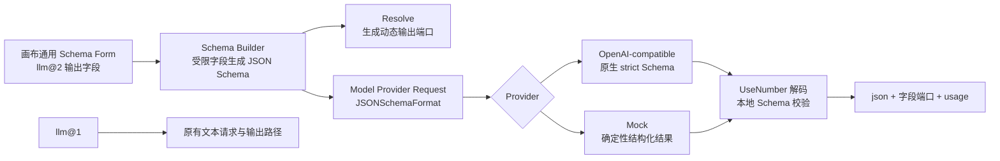

# Agent Studio v0.3-D LLM v2 结构化输出设计

**日期：** 2026-08-21

**状态：** 已确认，可进入实施计划

**目标版本：** v0.3-D

**基线：** `v0.3.0-rc.2` / Node API `agent-studio.dev/v1alpha1` / Go Node SDK `0.3.0`

## 1. 背景

Agent Studio 当前内置 `llm@1`，通过 Mock 或 OpenAI-compatible Chat Completions 服务生成文本，并输出 `text` 与 `usage`。工作流若需要结构化数据，只能依赖提示词约束，再由下游代码节点自行解析；模型输出 Markdown、解释文字或非法 JSON 时，失败点不稳定，也无法在画布编译期获得字段端口。

v0.3-D 的第一批官方节点能力聚焦模型编排增强。首个交付不建设本地 RAG、知识库、Embedding、pgvector、联网搜索、工具调用或多模型降级，而是在保持 `llm@1` 完全兼容的前提下新增 `llm@2`，为低代码用户提供受限字段设计器、供应商原生严格 JSON Schema 输出、本地二次校验和动态字段端口。

## 2. 目标与非目标

### 2.1 目标

1. 新增 `llm@2`，支持原有文本模式和新的结构化输出模式。
2. 通过低代码字段数组配置结构化输出，不要求用户编写 JSON Schema。
3. 使用 OpenAI-compatible 原生 `response_format=json_schema`、`strict=true`，不使用提示词模拟。
4. 对模型响应执行本地严格 JSON 解码和同 Schema 二次校验。
5. 在结构化模式下提供完整 `json`、逐字段动态端口和 `usage`。
6. 默认 Mock 模式仍无需密钥即可完成创建、测试、发布和 Agent 运行闭环。
7. 保持 `llm@1`、公共 Go Node SDK、Node API、OpenAPI、数据库和工作流图格式兼容。

### 2.2 非目标

- 不修改或自动迁移 `llm@1`。
- 不接受任意 JSON Schema、任意嵌套对象、远程 `$ref`、正则或组合 Schema。
- 不实现工具调用、模型调用循环、多模型降级、自动修复或隐藏重试。
- 不实现知识库、文件上传、Embedding、向量存储或联网搜索。
- 不新增专用 React 节点配置组件。
- 不修改模型密钥的环境变量管理方式。
- 不创建 Tag、GitHub Release 或正式版发布动作。

## 3. 已确认方案与替代方案

### 3.1 版本策略

采用新增 `llm@2`、保留 `llm@1` 的策略。节点库将两个版本分别展示，v2 标题为“LLM · 结构化输出”；历史图继续通过精确的 `type + typeVersion` 加载 v1。模板导入导出保持精确版本，不做静默升级或降级。

未采用直接修改 `llm@1`，因为它会改变已经发布的配置、端口和运行语义。未采用多个专用结构化节点，因为首版会造成节点库膨胀，并重复模型配置与请求逻辑。

### 3.2 结构化输出路径

采用供应商原生严格 JSON Schema。OpenAI-compatible 请求显式发送 `response_format.type=json_schema` 和 `json_schema.strict=true`。供应商不支持或拒绝时明确失败，不自动退回提示词约束，也不发起第二次模型调用。

未采用提示词约束，因为它不能保证返回内容满足 Schema。未采用自动降级，因为它会让同一工作流在不同供应商上产生不同语义、隐藏调用次数和额外费用。

### 3.3 配置体验

采用低代码字段设计器。配置继续由通用 Schema Form 渲染数组对象，用户填写字段 key、标题、说明、类型和必填状态；后端从受限字段生成 JSON Schema。

原讨论中的“任意 JSON”字段在可行性审查后被移除。原生严格模式只支持 JSON Schema 子集，首版只提供可确定生成、可本地验证且容易被 OpenAI-compatible 服务实现的字段类型。

## 4. 总体架构



`llm@2` 仍是 Agent Studio Core 内置节点，而不是公共 SDK 扩展包。原因是它需要注入 API 进程统一配置的模型 Provider；公共 Node SDK 当前没有运行时服务注入协议，本阶段不扩大 SDK 契约。

## 5. 节点配置契约

### 5.1 配置结构

```json
{
  "model": "gpt-compatible-model",
  "systemPrompt": "提取用户信息",
  "temperature": 0.2,
  "maxTokens": 1024,
  "outputMode": "structured",
  "fields": [
    {
      "key": "name",
      "label": "姓名",
      "description": "用户姓名",
      "type": "string",
      "required": true
    },
    {
      "key": "age",
      "label": "年龄",
      "type": "integer",
      "required": false
    }
  ]
}
```

### 5.2 通用模型参数

- `model`：可选；空值使用 API 环境中的默认模型，二者都为空时配置无效。
- `systemPrompt`：可选字符串。
- `temperature`：可选，默认 `0.7`，范围 `0–2`。
- `maxTokens`：可选，默认 `1024`，范围 `1–32768`。
- `outputMode`：必填枚举 `text | structured`，默认值为 `text`。

### 5.3 字段约束

- `structured` 模式要求 `fields` 为 1–32 项。
- `text` 模式允许保留 `fields`，但解析端口和执行请求时忽略它们，方便用户切换模式后恢复原配置。
- `key` 匹配 `^[A-Za-z][A-Za-z0-9_]{0,63}$`。
- `key` 在大小写敏感语义下唯一，不得为 `text`、`json` 或 `usage`。
- `label` 为 1–80 个 Unicode code point；Go 实现使用 `utf8.RuneCountInString`，不按字节计数。
- `description` 可选，最多 500 个 Unicode code point，使用同一计数规则。
- `type` 为 `string | number | integer | boolean | string_array`。
- `required` 默认为 `true`。
- 配置拒绝未知字段，所有语义约束由后端再次执行。

## 6. Schema 生成规则

结构化模式固定生成根对象：

```json
{
  "type": "object",
  "properties": {},
  "required": [],
  "additionalProperties": false
}
```

字段按配置顺序生成属性。为了适配严格结构化输出，所有属性 key 都进入根对象的 `required` 数组；用户配置的 `required=false` 表示该字段值允许为 `null`，而不是允许模型省略字段。

| 字段类型 | 必填 Schema | 非必填 Schema |
| --- | --- | --- |
| `string` | `{"type":"string"}` | `{"type":["string","null"]}` |
| `number` | `{"type":"number"}` | `{"type":["number","null"]}` |
| `integer` | `{"type":"integer"}` | `{"type":["integer","null"]}` |
| `boolean` | `{"type":"boolean"}` | `{"type":["boolean","null"]}` |
| `string_array` | `{"type":"array","items":{"type":"string"}}` | `{"type":["array","null"],"items":{"type":"string"}}` |

`description` 写入属性 Schema；`label` 只用于画布和端口标题。Schema 由单一纯函数生成，`Resolve`、Provider 请求、本地响应校验和测试 fixture 必须复用该函数，禁止复制四套规则。

响应格式名称为 `agent_studio_<digest>`，其中 digest 是规范化 Schema 的 SHA-256 前 16 个十六进制字符。名称只包含允许字符且不超过 64 字符，同一 Schema 得到稳定名称。

## 7. 端口契约

### 7.1 固定输入

两种模式均只有一个输入：

| key | 标题 | 类型 | 必填 | 基数 |
| --- | --- | --- | --- | --- |
| `prompt` | 提示词 | string | 是 | one |

### 7.2 文本模式输出

| key | 标题 | 类型 |
| --- | --- | --- |
| `text` | 文本 | string |
| `usage` | 用量 | json |

### 7.3 结构化模式输出

输出顺序固定为 `json`、配置字段顺序、`usage`：

| key | 标题 | 类型 |
| --- | --- | --- |
| `json` | 结构化结果 | json |
| 每个字段 key | 字段 label | 按下表映射 |
| `usage` | 用量 | json |

必填字段端口类型映射：`string → string`、`number/integer → number`、`boolean → boolean`、`string_array → json`。非必填字段可能为 `nil`，因此其独立端口统一声明为 `any`，不能伪装成始终存在的标量类型；输出 map 中仍必须存在该 key。完整 `json` 输出必须包含每个配置字段且没有额外属性。

字段配置变化后，Studio 重新调用 resolve。删除或改名字段会使旧连线失效；前端标记无效边，发布校验阻止包含无效边的工作流。执行结果仍由调度器使用编译期端口快照规范化，不能在执行期重新解释出额外端口。

## 8. Provider 内部契约

公共 Go Node SDK 不变。内部 `modelprovider.Request` 增加可选结构化格式：

```text
JSONSchemaFormat
  Name        string
  Description string
  Schema      json.RawMessage
  Strict      bool

Request
  现有字段...
  ResponseFormat *JSONSchemaFormat
```

`ResponseFormat=nil` 时，OpenAI-compatible 请求必须与 `llm@1` 当前请求逐字段一致，不发送 `response_format`。非空时发送：

```json
{
  "response_format": {
    "type": "json_schema",
    "json_schema": {
      "name": "agent_studio_<digest>",
      "description": "Agent Studio structured output",
      "schema": {},
      "strict": true
    }
  }
}
```

Provider 继续限制响应正文为 1 MiB，不把非 2xx 响应正文写入错误、日志或 NodeError details。取消和 deadline 必须原样保留 cause，供节点分类。

Mock 文本模式保持现有输出不变。结构化模式按 Schema 字段生成并由 `encoding/json` 确定性编码：必填 string 为 `Mock 回复：<prompt>`，number/integer 为 `0`，boolean 为 `false`，string_array 为 `[]`；非必填字段为 `null`。结果必须经过与真实 Provider 相同的本地解码与 Schema 校验路径。

## 9. 执行与校验

1. `Resolve` 解析配置并在 structured 模式生成 Schema 和动态端口。
2. 编译器把端口写入执行计划。
3. `Execute` 校验 prompt 恰好一个且为字符串。
4. 使用确定性 Builder 从同一配置重新生成 Schema。
5. 在 60 秒节点 deadline 内发起一次模型请求。
6. 使用 `json.Decoder.UseNumber()` 解码结构化内容，并要求第一个 JSON 值之后立即 EOF。
7. 使用项目现有 JSON Schema v6 编译器校验结果。
8. 拒绝空内容、`null` 根、数组根、额外字段、缺失字段、类型错误、尾随 JSON 和超大内容。
9. 输出完整对象、逐字段值和 usage。
10. Scheduler 使用编译期端口调用 `nodes.NormalizeResult`。

结构化输出不做修复、不剥离 Markdown fenced code、不接受“最接近”的结果，也不发起第二次调用。

## 10. 错误与用户提示

| 场景 | NodeError kind/code | 安全用户提示 |
| --- | --- | --- |
| 配置非法 | `config/invalid_config` | 节点配置无效 |
| prompt 缺失 | `input/missing_input` | 节点输入无效 |
| prompt 类型或基数错误 | `input/invalid_input` | 节点输入无效 |
| 请求取消 | `canceled/run_canceled` | 节点执行已取消 |
| timeout、429、5xx | `temporary/upstream_timeout` 或 `temporary/upstream_unavailable` | 节点暂时不可用 |
| 结构化请求被 400/404/422 拒绝 | `internal/model_structured_output_rejected` | 模型不支持或拒绝结构化输出 |
| Provider 返回 401/403 | `internal/model_provider_auth_failed` | 模型服务认证配置无效 |
| 模型明确拒绝生成 | `internal/model_refused` | 模型拒绝生成此内容 |
| 非法 JSON、超限、Schema 不匹配 | `internal/model_output_invalid` | 模型返回结果不符合输出结构 |

`domain.NewPublicNodeError` 只在节点精确为 `llm@2` 时对上述四个模型专用 code 使用固定 allowlist 文案；其他节点、其他 LLM 版本或未知 code 仍使用现有按 kind 的通用文案。Engine 和 RunService 必须把编译计划中的 type/version 传入映射函数，不能只信任节点返回的 code。任何 Provider 原始正文、Schema 内容、prompt 或模型返回片段都不得进入公开错误。

## 11. 安全与隐私边界

- API Key 只从环境变量读取；v2 Config Schema 明确拒绝 `apiKey`、Header、Token 等未知配置。
- Authorization、Cookie 和完整请求不写日志。
- 模型返回内容是用户明确要求的工作流数据，可以在工作流内部流转；持久化节点输出、实时事件和最终输出继续经过 `workflow.Redact`。
- 字段 key 包含 `token`、`secret`、`password`、`authorization`、`cookie` 或 `apikey` 等标记时，持久化和页面展示值变为 `[REDACTED]`；工作流内部下游节点仍接收原值。
- Schema 只能由受限字段生成，因此不存在远程引用获取、Schema 正则拒绝服务或任意深度递归。
- 32 字段、名称和说明长度预算同时限制配置、Schema 和输出投影成本。
- 不将 capability 声明误述为沙箱；节点仍具有 `network` 和 `secrets` capability，并在 API 进程内执行。

## 12. 前端与低代码交互

节点配置继续使用现有 `ConfigDrawer + SchemaForm + ArrayField`：

- `outputMode` 使用下拉框。
- `fields` 使用数组对象编辑，每项展示 key、label、description、type、required。
- 不根据 outputMode 动态隐藏 fields；text 模式保留字段但忽略，减少来回切换时的数据丢失。
- 保存队列仍保存整个节点 config；resolve debounce 后刷新端口。
- 节点库同时显示“LLM”和“LLM · 结构化输出”，描述和版本明确区分。
- 不增加新的 HTTP endpoint 或手写前端 API 类型。

## 13. 文件影响

### 13.1 新增

| 文件 | 用途 |
| --- | --- |
| `apps/api/internal/nodes/builtin/llm_v2.go` | v2 配置、Schema Builder、Resolve 和 Execute |
| `apps/api/internal/nodes/builtin/llm_v2_test.go` | v2 单元、边界和错误测试 |

### 13.2 修改

| 文件 | 用途 |
| --- | --- |
| `apps/api/internal/modelprovider/provider.go` | 内部结构化格式与错误契约 |
| `apps/api/internal/modelprovider/openai.go` | 原生 response_format、拒绝和响应校验 |
| `apps/api/internal/modelprovider/openai_test.go` | 精确请求和异常矩阵 |
| `apps/api/internal/modelprovider/mock.go` | 确定性结构化结果 |
| `apps/api/internal/modelprovider/mock_test.go` | Mock 文本兼容和结构化结果 |
| `apps/api/internal/nodes/builtin/register.go` | 同时登记 `llm@1`、`llm@2` 与 RuntimeRecord |
| `apps/api/internal/nodes/builtin/end_test.go` | 内置节点精确集合、数量和原子注册回归 |
| `apps/api/internal/nodes/builtin/contract_test.go` | 公共节点安全与契约矩阵 |
| `apps/api/internal/domain/errors.go` | 模型专用公开错误 allowlist |
| `apps/api/internal/domain/errors_test.go` | 安全文案和未知 code 回退测试 |
| `apps/api/internal/engine/engine.go` | 为实时失败事件传入编译期节点 type/version |
| `apps/api/internal/engine/engine_test.go` | 事件错误映射使用编译期节点身份的回归测试 |
| `apps/api/internal/workflow/run_service.go` | 为最终运行错误传入编译期节点 type/version |
| `apps/api/internal/workflow/run_service_test.go` | 最终错误映射使用编译计划节点身份的回归测试 |
| `apps/api/internal/httpapi/router_test.go` | 两版本发现和 resolve 回归 |
| `apps/api/internal/workflowtemplate/analyzer_test.go` | `llm@2` 模板规范化往返 |
| `apps/web/src/features/studio/NodeLibraryDrawer.test.tsx` | 双版本展示 |
| `apps/web/src/features/studio/StudioPage.test.tsx` | fields 保存、动态端口和无效边 |
| `apps/web/e2e/agent-studio.spec.ts` | Mock 结构化输出完整闭环 |
| `apps/web/e2e/workflow-template.spec.ts` | 模板导出、导入精确版本回归 |
| `README.md`、`docs/sdk/compatibility.md` | 使用方式、兼容边界和限制 |

前端生产组件保持不变。若实现中发现通用 Schema Form 无法正确表达已确认字段模型，必须暂停并升级设计，不得静默添加 llm 专用组件。

## 14. 测试与验证

### 14.1 Go 单元与契约测试

- Schema Builder：五类字段、nullable、顺序、稳定 digest、重复 key、保留字、空字段和 32/33 项边界。
- 配置：默认值、未知字段、模型缺失、temperature/maxTokens 边界。
- Resolve：text 固定端口、structured 动态端口、字段变更和切换模式。
- OpenAI-compatible：文本请求逐字段兼容、结构化精确 JSON、strict、取消、deadline、4xx、429、5xx、超大正文、空 content、拒绝和非法响应。
- Mock：文本结果逐字节不变，五类结构化字段确定性结果。
- Execute：UseNumber、尾随 JSON、额外/缺失字段、类型错误、nullable、字段投影、usage 和输出大小。
- Scheduler：只接受编译期端口，不因执行期配置漂移接受额外端口。
- 公共错误：只有 `llm@2` 的专用 code 使用固定文案，其他 type/version 的未知或伪造 code 回退通用文案，无 cause 泄露。
- 错误归属：Engine 与 RunService 都从编译计划传递节点 type/version；节点 details 不能伪造专用错误身份。

### 14.2 前端和 E2E

- 通用 ArrayField 完成 fields 的添加、编辑、删除和 32 项上限。
- 节点库能区分 v1/v2。
- Studio 保存 structured 配置并刷新动态端口。
- 删除字段后旧边无效，发布被阻止。
- Mock 模式完成创建、配置、连线、草稿测试、发布、Agent 运行、结果展示和运行记录。
- 模板导出、预览、导入精确保留 `llm@2` 和 fields，不影响 `llm@1` 模板。

### 14.3 完整门禁

```bash
make verify-quick
make verify
make test-e2e
make test-sdk-e2e
```

所有 Go 调试和测试必须使用 `CGO_ENABLED=0`。完成后执行 `go vet`、前端 lint/typecheck/test/build、OpenAPI 生成物差异检查和 `git diff --check`。代码审查发现的 Critical/Important 必须清零后才能请求合并。

## 15. 实施阶段

1. **D1 Provider 契约：** 先写失败测试，再扩展内部 Request、OpenAI-compatible 和 Mock；锁死 v1 文本请求不变。
2. **D2 LLM v2：** 实现 Builder、Resolve、Execute、错误 allowlist 和单元测试。
3. **D3 集成：** 补 HTTP、画布、模板、Playwright 和中文文档回归。
4. **D4 稳定化：** 完整 PostgreSQL 回归、双仓/独立代码审查、修复 Critical/Important、创建 PR。

每个阶段开始前必须从最新 `origin/main` 创建或更新 `codex/` 分支；阶段提交保持可独立审查。合并、Tag 和 Release 均需用户单独授权。

## 16. 风险与可行性审查

| 风险 | 等级 | 控制措施 | 残余风险 |
| --- | --- | --- | --- |
| OpenAI-compatible 服务不支持 strict Schema | Important | 原生能力必需、4xx 显式失败、无隐式降级 | 用户需要选择支持该能力的模型服务 |
| 修改内部 Request 影响 llm@1 | Important | ResponseFormat 可选；文本请求精确 fixture；v1 回归 | 低 |
| 动态字段导致旧边漂移 | Important | 编译期端口快照、Studio 无效边、发布阻止 | 用户需手工修复连线 |
| 模型输出虽声称 strict 但实际非法 | Important | UseNumber 严格解码和本地同 Schema 校验 | 本次运行明确失败 |
| Provider 错误或内容泄密 | Important | 不保留错误正文；公开 code allowlist；现有递归脱敏 | 模型业务输出仍应由用户按敏感数据管理 |
| 任意 Schema 扩大资源和兼容边界 | Important | 仅允许五种低代码字段，32 项硬限制 | 高级结构需后续版本 |
| Mock 与真实 Provider 行为偏差 | Minor | 共享 Builder、解码和校验路径；真实 HTTP fixture | Mock 不代表模型质量 |

当前设计复用 Registry、动态端口、Compiler、Scheduler、通用 Schema Form、Provider 注入和运行脱敏机制，不需要数据库迁移、公共 SDK 或 OpenAPI 变更。所有 Important 风险都有可测试的失败关闭策略；没有已知 Critical 或未缓解 Important 阻塞项。

## 17. 验收定义

v0.3-D `llm@2` 只有同时满足以下条件才算完成：

1. `llm@1` 的定义、请求 JSON、输出和现有工作流 E2E 全部保持兼容。
2. `llm@2` text 与 structured 两种模式能通过画布配置和运行。
3. structured 请求只使用供应商原生 strict JSON Schema，无提示词或自动降级路径。
4. 非法、超限、拒绝或不匹配响应全部失败关闭，且公开错误不泄露原始内容。
5. 完整 json、逐字段端口和 usage 与编译期端口一致。
6. Mock 无密钥闭环、OpenAI-compatible HTTP fixture、模板往返和运行记录均通过。
7. `make verify`、产品 E2E、SDK E2E、vet、前端构建和差异检查全部通过。
8. 独立代码审查无 Critical/Important，PR 仅在用户确认后合并。

## 18. 后续路线

`llm@2` 稳定后分别设计，不在本规格中预实现：

1. 嵌套对象和更完整的严格 Schema 兼容矩阵。
2. 工具调用协议、调用循环、权限和预算。
3. 多模型降级、重试次数、费用与错误语义。
4. 联网搜索、文件处理和其他官方节点包。
5. 调试、重试、版本差异、回滚和 OpenTelemetry 等 v0.4 生产加固能力。

## 19. 参考资料

- OpenAI API `response_format` 与 JSON Schema strict 契约：<https://platform.openai.com/docs/api-reference/evals/deleteRun?lang=python>
- JSON Schema Draft 2020-12：<https://json-schema.org/draft/2020-12>
