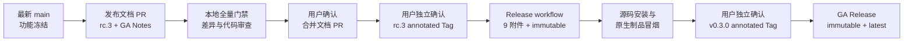

# Agent Studio v0.3.0-rc.3 与 GA 收口设计

**日期：** 2026-08-22

**状态：** 已确认，实施计划已编制

**目标版本：** `v0.3.0-rc.3`，随后在独立确认后发布 `v0.3.0`
**基线：** `main` 合并提交 `0de1d2c` 及其后仅限本设计要求的发布文档提交

## 1. 背景

Agent Studio 已公开 `v0.3.0-rc.1` 与 `v0.3.0-rc.2` Pre-release。`rc.2` 验证了四平台制品、SPDX SBOM、远端附件复核与 GitHub Immutable Releases 双门禁。此后 `main` 合入 `llm@2` 严格结构化输出，因此 `rc.2` 不再覆盖当前准备进入 `v0.3.0` GA 的完整产品行为。

本阶段不继续增加业务节点，也不建设本地 RAG。先以 `v0.3.0-rc.3` 冻结并验证当前 `main`，再在 rc.3 技术门禁全部通过后请求一次独立的 GA 授权。

用户于 2026-08-22 明确确认：

1. 进入 `v0.3.0-rc.3` 收口。
2. 不设置 rc.3 公开后的时间观察窗口。
3. rc.3 与 GA 标签仍必须分别取得独立确认。
4. rc.3 内容冻结为当前 `main`；除门禁发现的阻塞修复外，不加入新功能。

取消的是等待时间，不是技术、安全、制品或不可变性门禁。

## 2. 目标

1. 为当前 `main` 编写完整中文 rc.3 Release Notes。
2. 更新既有 GA Release Notes，纳入 v0.3-D `llm@2` 能力与边界。
3. 在产品代码、SDK、协议、数据库和发布工作流零变更的前提下完成全量回归。
4. 通过 annotated Tag 触发现有 Release workflow，产生可复核、不可变的 rc.3 Pre-release。
5. 完成源码安装、四平台制品、SBOM、checksum 和当前平台原生运行验证。
6. 在 rc.3 全部技术门禁通过后，重新请求用户确认；只有得到确认才创建 `v0.3.0` GA Tag。

## 3. 非目标

- 不增加或修改产品功能。
- 不修改 `llm@1`、`llm@2`、官方扩展节点或节点索引内容。
- 不修改 Go SDK `0.3.0` 或 Node API `agent-studio.dev/v1alpha1`。
- 不修改工作流模板 API、OpenAPI、数据库 migration 或前端生产行为。
- 不修改 Release workflow、GoReleaser、Syft、Action 版本或不可变发布脚本。
- 不发布容器镜像、Windows 制品、安装器、代码签名或 macOS 公证。
- 不自动向官方节点索引投稿。
- 不建设本地 RAG、文件上传、Embedding、工具调用、多模型降级或隐藏重试。
- 不以本设计授权创建任何 Tag、Release 或 GA；每个外部状态仍有独立确认门禁。

## 4. 方案选择

### 4.1 采用：递增 RC 后立即具备 GA 资格

发布文档 PR 合入后，先创建 `v0.3.0-rc.3`。rc.3 的 CI、制品、不可变状态、安装和原生冒烟全部通过，即具备请求 GA 确认的资格，不再额外等待固定天数。

优点是当前新增的 `llm@2` 获得真实标签与制品验证，同时不伪造观察期。风险由完整技术门禁、两次独立确认和递增 RC 失败策略控制。

### 4.2 未采用：直接发布 GA

直接 GA 缺少覆盖 `llm@2` 的公开候选制品证据，也把候选验证和正式不可变发布合并为一次不可逆操作，因此拒绝。

### 4.3 未采用：继续固定时间观察

固定七天观察可以获得更多自然使用时间，但用户已明确取消该时间门禁。本设计保留所有技术门禁，并在回报中明确没有自然观察期，不把技术冒烟表述为长期稳定性证据。

## 5. 总体流程

流程严格单向推进。后一步授权不反向授权前一步未完成的操作，也不能用于修改既有不可变 Tag 或 Release。

## 6. 文件范围

| 文件 | 操作 | 内容 |
|---|---|---|
| `docs/releases/v0.3.0-rc.3.md` | 新增 | 完整 rc.3 中文 Release Notes、安装、升级、回滚、安全与制品验证 |
| `docs/releases/v0.3.0.md` | 修改 | 增加 v0.3-D `llm@2`，保持 GA 安装命令与正式版语义 |
| `docs/superpowers/specs/2026-08-22-v0.3.0-rc.3-release-design.md` | 新增 | 本设计与治理边界 |
| `docs/superpowers/plans/2026-08-22-v0.3.0-rc.3-release.md` | 新增 | 逐命令、逐门禁实施计划 |

README 当前已经使用不预先宣称远端 Release 的通用 `v0.3.0` 准备文案，并已说明 `llm@2`，本阶段不修改。禁止修改产品代码、测试实现、依赖锁、SDK、OpenAPI、migration、`.github/workflows/release.yml`、`.goreleaser.yaml` 或发布脚本。若门禁暴露阻塞缺陷，需要停止本发布分支，另开修复设计与代码 PR；修复合并后重新评估文件范围。

## 7. Release Notes 内容

### 7.1 rc.3 相对 rc.2

rc.3 必须把 v0.3-D 作为主要增量：

- 节点库同时保留 `llm@1` 与 `llm@2`，已有工作流继续精确加载 v1。
- `llm@2` 支持 text 与 structured 两种模式。
- structured 模式通过通用低代码字段数组配置 `string`、`number`、`integer`、`boolean`、`string_array`。
- 非必填字段使用 nullable 语义，完整 `json`、逐字段动态端口和 `usage` 与编译期端口快照一致。
- OpenAI-compatible Provider 只使用原生 strict JSON Schema；不使用提示词降级、隐藏重试或第二次模型调用。
- Mock Provider 无需密钥即可完成确定性结构化输出演示。
- 模型结果经过 1 MiB 限制、`UseNumber` 解码、尾随 JSON 检查和本地 JSON Schema 二次校验。
- 模型拒绝、Provider 认证失败、不支持结构化输出和输出不合法使用固定公开错误；原始 Provider 正文、模型输出、Schema、Prompt 和密钥不进入公开错误。

### 7.2 累计 v0.3 能力

rc.3 和 GA Notes 继续完整描述：

- v0.3-A 工作流模板导入导出与安全预览。
- v0.3-B 节点包 manifest、兼容检查、CLI 和手工安装边界。
- v0.3-C 只读官方节点索引、显式刷新、缓存回退和不自动安装。
- v0.3-D `llm@2` 严格结构化输出。
- 从 `v0.2.0` 升级、备份与回滚。
- 单租户、DAG、同进程节点、无沙箱、无自动安装等已知限制。

### 7.3 不得夸大的声明

- rc.3 是候选版本，不是生产稳定版。
- GA 是正式开发者预览版，不是 v1 稳定承诺。
- 不得声称 rc.3 经历了固定时间观察。
- 不得在远端 Tag/Release 实际存在前写成“已发布”。
- checksum 与 SBOM 不等于发布者身份签名或依赖安全认证。
- Immutable Release 不抵御 GitHub 平台或仓库管理员凭据失陷。

## 8. 发布前本地门禁

在文档 PR 合并前执行：

1. 从最新 `origin/main` 创建隔离 `codex/` 分支。
2. `CGO_ENABLED=0 make verify-quick`。
3. 使用 Docker PostgreSQL 执行 `CGO_ENABLED=0 make verify`。
4. `make test-e2e`。
5. `make test-sdk-e2e`。
6. `make verify-workflows`。
7. `make verify-release`，包含 GoReleaser snapshot、Syft、Actionlint 与发布行为夹具。
8. 对 `v0.3.0-rc.3` 与 `v0.3.0` 分别运行版本/Release Notes 检查。
9. `git diff --check`、范围审查、提交序列审查和工作树洁净检查。
10. 代码审查必须确认无 Critical/Important，且差异只包含第 6 节文件。
11. PR CI 全部成功并取得用户合并确认。

既有 Vite chunk 大小提示可以如实记录为 Minor warning，但任何命令非零退出、测试失败或生成物差异都不是 warning。

## 9. rc.3 发布门禁

### 9.1 标签前

1. 重新 fetch `origin/main`，确认本地 `main`、`origin/main` 和准备打标签的 HEAD 完全一致。
2. 确认工作树干净。
3. 确认本地与远端均不存在 `v0.3.0-rc.3`。
4. 确认远端不存在同名 Release。
5. `make release-preflight TAG=v0.3.0-rc.3` 必须成功，并确认仓库 Immutable Releases 已启用。
6. 展示精确 commit、命令和不可逆影响，取得用户单独确认。
7. 创建 annotated Tag 并普通 push；禁止 lightweight Tag 与 force push。

### 9.2 Workflow

现有 Release workflow 必须：

- 验证 Tag 指向最新 `origin/main`。
- 运行 `make verify-quick`。
- 使用 GoReleaser 2.17.1 与 Syft 1.51.0。
- 构建 Linux/macOS 的 amd64/arm64 四个原生归档。
- 生成四份 SPDX JSON SBOM 与一个 `checksums.txt`，总计九个非空附件。
- 在四个匹配 runner 上验证归档内 commit、版本和原生运行。
- 创建 Draft、上传附件、重新下载并逐字节比较。
- 验证 annotated Tag 最终指向工作流 commit。
- 将 rc.3 转为 Pre-release。
- 通过 GitHub Release API 验证 `immutable=true`。

### 9.3 Workflow 后复核

自动流程成功后仍需只读复核：

- Release 为 `draft=false`、`prerelease=true`、`immutable=true`。
- Tag 为 annotated Tag 且 commit 等于当时 `origin/main`。
- 资产名、数量、大小和 API digest 完整。
- 下载到全新临时目录后通过 collection 校验。
- `CGO_ENABLED=0 go install github.com/yyl1212/agent-studio/cmd/agent-studio@v0.3.0-rc.3` 输出精确版本。
- 在当前 macOS 架构下载归档、校验 checksum、解压并运行 `agent-studio version`。
- 记录 workflow URL、Release URL、commit、附件摘要和冒烟输出。

## 10. GA 门禁

rc.3 第 9 节全部通过后，不等待固定时间，但必须再次向用户展示证据并取得独立确认。

GA 标签前重复以下检查：

1. `main == origin/main == rc.3 已验证 commit`；若出现任何新提交，先重新执行全部本地门禁并重新评估是否需要 rc.4。
2. 工作树干净，本地/远端不存在 `v0.3.0` Tag，远端不存在同名 Release。
3. `make release-preflight TAG=v0.3.0` 成功。
4. `docs/releases/v0.3.0.md` 与当前功能完全一致。
5. 用户明确确认创建 GA annotated Tag。

GA workflow 与 rc.3 使用同一构建、四平台 smoke、Draft 上传、九附件和 immutable 复核链路；区别是 Release 必须为 `draft=false`、`prerelease=false` 并标记为 Latest。

GA 成功后再次验证源码安装、当前平台归档、SBOM、checksum、commit、`immutable=true` 和 Latest 状态。本设计不自动继续节点索引投稿；那是新的外部状态项目。

## 11. 错误处理与恢复

| 失败点 | 行为 |
|---|---|
| 标签推送前任一门禁失败 | 不创建 Tag；修正文档或环境后从头验证 |
| 本地或远端 Tag 已存在 | 停止；不得删除、覆盖、移动或 force-push |
| Release 已存在 | 停止；不得复用或编辑已公开不可变 Release |
| Tag 已推送、Workflow 构建失败 | 保留 Tag 和失败记录；修复走新 PR，并发布递增 rc.4 |
| Draft 创建后附件/复核失败 | 不公开 Draft；保留现场供精确审计，不执行模糊清理 |
| 公开 Release 返回 `immutable=false` | 判定该 RC 失败并保留审计；不得进入 GA |
| rc.3 冒烟失败 | 停止 GA；修复 PR 后使用 rc.4 |
| rc.3 后 `main` 出现新提交 | 原 rc.3 证据不再覆盖 GA；重新验证并决定是否增加 RC |
| GA Workflow 失败 | 保留不可变外部状态和记录，停止后续动作，单独设计修复版本 |
| GitHub API、runner 或网络临时失败 | 失败关闭；不把未知状态当成功，不创建后续外部状态 |

发布脚本当前已经对 Tag 冲突、main HEAD、Immutable Releases、附件集合和远端状态失败关闭；本阶段不另写清理或恢复脚本。

## 12. 权限与确认矩阵

| 操作 | 是否改变外部状态 | 所需确认 |
|---|---:|---|
| 创建本地设计/发布分支 | 否，仅本地 Git | 已由本设计确认覆盖 |
| 推送并创建发布文档 PR | 是 | 实施计划执行到该步时单独确认 |
| 合并发布文档 PR | 是 | 单独确认 |
| 创建并推送 rc.3 Tag | 是、不可变发布入口 | 单独确认 |
| 公开 rc.3 Release | 由已审核 workflow 自动完成 | rc.3 Tag 确认覆盖该预期结果 |
| 创建并推送 GA Tag | 是、正式不可变发布入口 | rc.3 全部门禁后再次单独确认 |
| 修改仓库设置、分支保护或 Immutable Releases | 是 | 不在范围内，不执行 |
| 节点索引投稿或 Release | 是 | 不在范围内，另行设计与确认 |

任何“继续”“确认”只授权当时明确展示的下一项操作，不能预授权后续 GA 或其他仓库变更。

## 13. 可行性审查

### 13.1 已具备能力

- Release workflow 已验证最新 main、annotated Tag、四平台构建与 smoke。
- GoReleaser/Syft 可生成四归档、四 SBOM 和 checksum。
- 发布步骤采用 Draft → 上传 → 远端下载比对 → 公开 → immutable 验证。
- `scripts/check-version.sh` 接受任意合法递增 RC，并要求精确 Release Notes。
- `scripts/release-preflight.sh` 检查 Tag 冲突、origin、main HEAD 和 Immutable Releases。
- SDK `0.3.0` 与 `v0.3.0-rc.3`、`v0.3.0` 的 base version 一致。
- rc.2 已证明目标仓库支持并启用了 Immutable Releases。

### 13.2 风险与缓解

| 风险 | 级别 | 缓解 |
|---|---|---|
| 无时间观察导致自然使用证据不足 | Governance | 明确记录豁免；保留 rc.3 全技术验证和 GA 独立确认，不宣称长期稳定 |
| rc.3 后 main 漂移 | Important | GA 前要求 commit 精确相等；漂移则重跑并评估递增 RC |
| 发布后发现阻塞缺陷 | Important | 不修改不可变 Tag/Release；修复 PR + rc.4 |
| 资产或 Tag 与受测 commit 错配 | Critical | main HEAD、annotated Tag、制品内 commit、远端 Tag API 四重核验 |
| Draft 附件不完整却公开 | Important | 精确九附件、非空、重新下载逐字节比较后才转正 |
| Release 非 immutable | Important | 标签前设置检查、公开后 API 复核；失败即停止 |
| 凭据或敏感内容进入发布材料 | Important | 差异仅文档；Release Notes 不含 token、日志、用户数据或 Provider 正文 |
| GitHub 外部状态不确定 | Important | 超时和 API 错误失败关闭；后续状态不继续 |

除用户明确接受的“无固定观察期”治理偏离外，技术设计没有已知 Critical 或未缓解 Important 阻塞项。

## 14. 验收标准

### 14.1 设计与文档阶段

- 完整设计与逐步实施计划已提交到独立分支。
- rc.3 Notes 和 GA Notes 准确覆盖 v0.3-A/B/C/D。
- 差异范围没有产品、协议、数据库、依赖或 workflow 变化。
- 本地完整门禁、发布门禁夹具、snapshot、审查和 PR CI 全绿。
- 发布文档 PR 仅在用户确认后合并。

### 14.2 rc.3 阶段

- annotated `v0.3.0-rc.3` 精确指向最新 main。
- Workflow 所有 build/smoke/publish 作业成功。
- 公开 Release 为 Pre-release 且 `immutable=true`。
- 九个附件完整、非空、摘要与本地受测制品一致。
- 源码安装和当前平台原生归档输出 `v0.3.0-rc.3`。
- 没有 Critical/Important、安装阻塞或安全边界不一致。

### 14.3 GA 阶段

- 用户在查看 rc.3 完整证据后单独确认 GA。
- GA Tag 前 main 没有未经 rc.3 覆盖的漂移。
- annotated `v0.3.0`、九附件、四平台 smoke、SBOM、checksum 和 immutable 验证全部成功。
- GA Release 为非 Pre-release、`immutable=true` 且标记 Latest。
- 源码安装和当前平台制品输出 `v0.3.0`。
- 回报明确没有固定时间观察，不声称生产稳定或 v1 兼容。

## 15. 后续路线

`v0.3.0` GA 成功后，另行设计 v0.4-A 节点调试与运行重放，再推进显式重试、配额、OpenTelemetry 和备份恢复。联网搜索、文件处理、工具调用和本地 RAG 不由本发布设计预实现。
