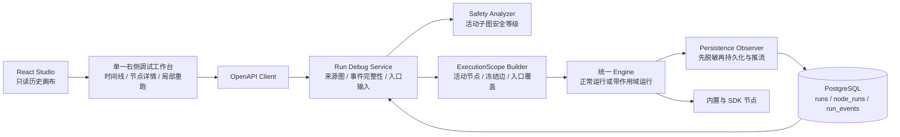

# Agent Studio v0.4-A 节点调试与运行回放设计

**日期：** 2026-08-25

**状态：** 已完成书面审阅，可进入实施计划

**目标版本：** v0.4-A

**基线：** `v0.3.1` / Node API `agent-studio.dev/v1alpha1` / Go Node SDK `0.3.1`

## 1. 背景

Agent Studio 已具备画布编排、草稿测试、发布版本运行、NDJSON 实时事件和运行摘要。当前事件只在执行期间向客户端流式发送，数据库仅保存 `runs` 与每节点一行的 `node_runs` 最终摘要。页面刷新后无法恢复精确时间线，也无法判断条件节点哪些输出端口曾激活；排查中间节点时只能重跑整个工作流。

v0.4-A 建设“节点调试与运行回放”闭环：用户从一次历史运行进入只读回放，在画布右侧的单一调试工作台查看事件和节点快照，并可从一个已经执行过的节点发起显式的局部重跑。局部重跑复用原运行的图，冻结执行范围外的历史边值，只执行选中节点及其下游。

本阶段继续坚持轻量化单体架构，不引入消息队列、独立 Worker、分布式追踪或新的基础设施。

## 2. 目标与非目标

### 2.1 目标

1. 持久化经过脱敏的、顺序稳定的完整运行事件，刷新页面后可精确回放。
2. 在只读历史画布上，以单一右侧工作台展示时间线、节点详情和局部重跑表单。
3. 从选中节点创建关联的 `debug` 运行，只执行该节点及其下游。
4. 对不在执行子图内、但进入下游节点的边复用原运行历史状态和值，支持 fork/join 图。
5. 由公共 Go Node SDK 声明执行安全等级；未知声明保守视为有副作用。
6. 在服务端重新计算执行范围与安全等级，不信任客户端预览结果。
7. 保持现有完整测试运行、已发布 Agent、Node API 和历史运行数据兼容。

### 2.2 非目标

- 回放不会再次调用 LLM、HTTP、Webhook 或任何节点；它只读取持久化数据。
- 不实现逐步执行、断点、变量监视表达式、事件自动播放或时间旅行修改。
- 不实现任意子图选择；首版入口固定为一个节点，范围固定为该节点及全部后代。
- 不恢复已经脱敏且不可重建的历史秘密值，不新增明文或可逆秘密存储。
- 不实现后台任务、断线续跑、页面关闭后由 Worker 接管或跨实例事件总线。
- 不建设本地 RAG、知识库、Embedding、pgvector 或文件索引。
- 不修改不可变的 `v0.3.1` Release、Tag 或历史发布资产。

## 3. 已确认方案与替代方案

### 3.1 回放与重跑分离

“回放”采用纯读取语义，只展示源运行已经持久化的图、事件、输入、输出、状态和耗时，不执行节点。用户点击“从此节点重新运行”后进入独立预览和确认流程，并创建新的 `debug` 运行；新运行通过 `sourceRunId`、`sourceNodeId` 保留来源关系。

不采用“拖动时间线即重新执行”，因为它会把只读观察和外部副作用混在一起，也无法给出明确的成本与确认边界。

### 3.2 统一 Engine 的执行作用域

采用在现有 Engine 中增加 `ExecutionScope` 的方案。正常运行不传作用域，行为保持不变；局部重跑传入入口节点、活动节点集合、入口输入和冻结边。调度、并发、条件端口、取消和错误传播仍只有一套实现。

未采用重写临时图，因为删改节点和边会破坏原图身份，且容易在 fork/join 处错误改变就绪语义。未采用第二套 Debug Runner 调度器，因为两套状态机会长期漂移。

### 3.3 追加事件与节点摘要并存

新增 append-only `run_events`，以 `(run_id, sequence)` 唯一标识事件；`node_runs` 继续承担列表和概览查询。每次节点事件必须在同一 PostgreSQL 事务中写入事件并更新节点摘要，避免两份视图分叉。

未采用只扩充 `node_runs`，因为单行摘要无法表示开始、结束、跳过、取消及跨节点的严格顺序。未引入事件消息队列，因为当前 Engine 的 Observer 已串行产生全序事件，PostgreSQL 足以承担首版规模。

### 3.4 安全等级保守默认

Go Node SDK 的 `Definition` 增加可选 `executionSafety`：`pure | read_only | side_effect`。缺失、空值和未来未知值统一按 `side_effect` 处理。安全等级是节点类型/版本级声明；像 HTTP 这类配置可改变方法语义的节点整体按最危险能力标注，不在首版增加动态安全解析协议。

首批内置与官方扩展节点采用以下声明：

| 等级 | 节点 |
| --- | --- |
| `pure` | `start@1`、`template@1`、`condition@1`、`end@1`、`code@1`、`extension.echo@1.0.0`、`extension.retriever@1.0.0` |
| `read_only` | `llm@1`、`llm@2` |
| `side_effect` | `http@1`、`extension.webhook@1.0.0`、所有缺失或未知声明的节点 |

`read_only` 仍可能产生费用或读取外部状态，页面必须提示，但不强制二次勾选；作用域内存在 `side_effect` 时必须显式二次确认。

## 4. 总体架构



数据流分为两条：

1. **只读回放：** Debug Service 读取源图、`node_runs` 和完整 `run_events`，直接返回页面；不会调用 Engine。
2. **局部重跑：** Debug Service 对源图重新编译，验证历史证据，生成 `ExecutionScope` 并创建 `debug` 运行；现有 Engine 执行活动子图，新事件按原 NDJSON 方式推送并持久化。

## 5. 领域模型与数据库

### 5.1 Run 来源关系

`RunMode` 增加 `debug`。`runs` 增加：

- `source_run_id uuid NULL REFERENCES runs(id)`
- `source_node_id text NULL`

来源约束调整为：

- `published`：`workflow_version_id` 非空；`draft_revision`、`graph_snapshot`、来源字段为空。
- `test`：`draft_revision`、`graph_snapshot` 非空；版本和来源字段为空。
- `debug`：`graph_snapshot`、`source_run_id`、`source_node_id` 非空；版本和草稿修订为空。

`debug.workflow_id` 必须与直接源运行相同；迁移通过 `runs(id, workflow_id)` 唯一键及 `(source_run_id, workflow_id)` 复合外键在数据库中强制该约束。创建 debug run 时复制本次实际编译的源图到 `graph_snapshot`，后续再从 debug run 重跑时仍以该快照为准。来源链最多返回 32 层并检测环；超过上限或出现环按 `RUN_SNAPSHOT_UNSUPPORTED` 拒绝，数据库外键只表达直接来源。

源图的解析规则：`test/debug` 读取自身 `graph_snapshot`；`published` 读取其不可变 `workflow_version_id` 对应的版本图。局部重跑不读取当前草稿，不受后来编辑影响。

### 5.2 RunEvent

新增领域对象 `RunEvent` 与表 `run_events`：

| 字段 | 约束与语义 |
| --- | --- |
| `run_id` | 非空，引用 `runs(id)` |
| `sequence` | 正整数，与 `run_id` 组成主键 |
| `type` | 现有 Engine 事件类型 |
| `node_id` | 节点事件非空，运行事件为空 |
| `status` | 节点状态；无状态的运行事件为空 |
| `input` / `output` | 脱敏后的 JSONB，可空 |
| `active_ports` | 文本数组；`node.completed` 保存节点返回的精确 `ActivePorts`，其他事件为空数组 |
| `error` | 仅保存公开错误，可空 |
| `input_redacted_paths` / `output_redacted_paths` | 被替换字段的 JSON Pointer 数组，不含原值 |
| `data_bytes` | 本事件全部可变载荷规范 JSON 编码后的总字节数 |
| `timestamp` | Engine 生成的 UTC 时间 |

事件类型仍为 `run.started`、`node.started`、`node.completed`、`node.failed`、`node.skipped`、`node.cancelled`、`run.completed`、`run.failed`、`run.cancelled`。同一运行的序号必须从 1 开始连续递增，不接受覆盖或补洞。

### 5.3 ActivePorts 的精确语义

现有 `node.completed` 只传 `Outputs`，无法区分“输出 map 中存在但端口未激活”。这是局部重跑在条件分支和 join 场景中的阻塞项，因此 `engine.Event`、OpenAPI 与 `run_events` 必须新增 `activePorts`。

持久化的是节点规范化结果中的原始 `ActivePorts`：

- 非空时，只有同时出现在 `activePorts` 和 `output` key 中的端口历史上激活。
- 空数组时，沿用现有 Engine 契约：所有存在于 `output` 的 key 激活。
- 端口被声明激活但缺少对应输出值时，该边仍视为未激活；若历史事件违反当前规范化契约，则拒绝局部重跑。

新事件的 `activePorts` 必须显式编码为 JSON 数组，不能用缺失字段表示空数组。旧运行没有 `run_events`，不会通过猜测 `node_runs.output` 伪造端口状态。

### 5.4 事务与预算

Observer 先执行一次带路径报告的脱敏，再把相同安全值交给数据库与 NDJSON 下游。Store 提供单一事务操作：锁定目标 run，验证下一序号和预算，插入 `run_events`，并在节点事件下 upsert 对应 `node_runs`；任一步失败则整项事件回滚。

预算固定为：

- 事件数量结构上限：`2 × 图节点数 + 2`。
- 每个事件的 `input` 与 `output` 各不超过 1 MiB。
- 公开 `error` 不超过 64 KiB。
- 单次运行全部事件的 `data_bytes` 总和不超过 16 MiB。

`data_bytes` 包含 `input`、`output`、`error`、`activePorts` 及两组脱敏路径的规范 JSON 字节数；空值按零计。事务在 run 行锁内核对当前事件数和 `SUM(data_bytes)`，因此即使未来出现并发 Observer 也不会越限。超限返回稳定的 `RUN_EVENT_BUDGET_EXCEEDED`，不写入半条事件、不更新对应节点摘要；此前已提交的事件保留，run 最终标记失败。

### 5.5 脱敏值与可重跑性

事件只保存脱敏值，绝不为了重跑增加明文秘密副本。`RedactWithReport` 在保持现有 `Redact` 结果兼容的同时返回被替换值的 JSON Pointer：

- 只读详情显示脱敏值，并标记“需要重新输入”的路径。
- 入口输入存在脱敏路径时，用户必须删除该可选值或替换占位值后才能提交；服务端再次检查历史路径和入口输入。
- 活动冻结边的值只要包含任何脱敏路径，就无法可靠重建，预览和提交均以 `RUN_FROZEN_EDGE_UNAVAILABLE` 拒绝。
- JSON Pointer 只描述路径，不保存原值；路径本身按数量和字节计入事件预算。

该策略接受“部分历史运行不能局部重跑”的安全限制，避免引入加密密钥轮换、秘密保留期限和额外攻击面。

## 6. 执行作用域与冻结边

### 6.1 ExecutionScope

Engine 增加可选配置：

```text
ExecutionScope
  EntryNodeID       string
  ActiveNodeIDs     set<string>
  EntryRunInput     map<string, any>       // 入口是 start 时使用
  EntryNodeInputs   map<string, []any>     // 入口是普通节点时使用
  FrozenEdges       map<edgeID, FrozenEdge>

FrozenEdge
  State             active | inactive
  Value             any                    // 仅 active 时存在
```

正常测试和发布运行不传 `ExecutionScope`，必须逐事件、逐状态保持现有行为。局部重跑的 `ActiveNodeIDs` 等于入口节点加其全部结构后代。入口节点不等待原入边：`start` 使用可编辑的历史 run input，普通节点使用可编辑的历史 `node.started.input`。

### 6.2 边分类

编译后对每条进入活动节点的边分类：

1. 来源与目标都在活动子图：由本次执行产生状态和值。
2. 目标是入口节点：忽略该边，由入口输入整体覆盖。
3. 来源在活动子图外、目标是其他活动节点：必须从源运行冻结。
4. 目标在活动子图外：本次不调度、不写新节点事件。

冻结证据按源节点终态解释：

- `node.completed`：用 `activePorts` 规则和输出 key 判断边是否激活；激活边必须有完整、未脱敏的值。
- `node.skipped`、`node.failed`、`node.cancelled`：该节点所有原出边均冻结为 inactive。
- 缺事件、序号不连续、没有终态、激活端口缺值或值被脱敏：证据不足，返回 `RUN_FROZEN_EDGE_UNAVAILABLE`。

调度器只遍历活动节点；外部 frozen active 边像已经完成的入边一样参与输入收集，frozen inactive 边只参与就绪判定。这样 join 节点能够同时接收本次上游的新值和未执行分支的历史值，并在页面上分别标记“本次”与“历史冻结”。

### 6.3 入口输入校验

选中节点必须在源运行中存在且拥有唯一的 `node.started` 事件；从未启动的 skipped/cancelled 节点不能作为首版重跑入口。

- `start` 入口按源图推导的开始参数 JSON Schema 校验。
- 普通节点输入必须是对象，key 只能是编译期输入端口，value 必须是数组；服务端校验必填、`one`/`single-active` 基数和可静态判断的数据类型。
- 输入编辑只影响新 debug run，不修改源事件。
- 校验失败返回 `RUN_ENTRY_INPUT_INVALID`，尚未创建新 run。

### 6.4 取消和错误传播

局部重跑沿用 Engine 的全局 timeout、节点错误映射、并发上限和取消语义。客户端断开或点击取消时，请求 context 取消，尚未执行的活动节点转为 cancelled，run 写入 `run.cancelled` 并最终标记 cancelled。已经发生的 HTTP、Webhook 或其他外部副作用无法撤销，确认文案必须明确说明这一点。

只有新 debug run 产生新事件；源运行保持不可变。

## 7. 调试服务与 API

### 7.1 调试概览

`GET /api/runs/{runId}/debug`

返回 run、解析后的只读图、`nodeRuns` 摘要、直接来源与有界来源链，以及：

- `replayAvailable`
- `rerunAvailable`
- `unavailableReason`

新运行只有在状态为 `completed | failed | cancelled`，事件序号连续，首事件为 `run.started`，末事件与 run 终态匹配，且源图可解析时才可精确回放。历史运行仍返回图和 `nodeRuns` 摘要，但 `replayAvailable=false`、`rerunAvailable=false`，页面不得伪造时间线。

### 7.2 事件分页

`GET /api/runs/{runId}/events?afterSequence={n}`

按 sequence 升序返回 `sequence > n` 的事件，单页最多 200 条并返回 `nextAfterSequence`。首版历史运行已经终止，不轮询、不自动播放；游标用于有界响应和未来兼容。事件不可用时返回 `RUN_REPLAY_UNAVAILABLE`。

### 7.3 局部重跑预览

`GET /api/runs/{runId}/nodes/{nodeId}/rerun-preview`

服务端重新加载并编译源图，返回：

- `sourceRunId`、`sourceNodeId` 与源终态。
- 脱敏后的 `entryInput`、`entryInputRedactedPaths`。
- `activeNodeIds` 和每个活动节点的 type/version/title/safety。
- frozen edge 的 edge id、来源/目标端口、active/inactive、脱敏展示值和来源标记。
- `effectiveSafety`、`requiresConfirmation` 与警告文案标识。

预览是说明性结果，不是执行授权，也不把安全计算结果回传给 POST 复用。

### 7.4 创建局部重跑

`POST /api/runs/{runId}/nodes/{nodeId}/reruns`

请求体：

```json
{
  "entryInput": {},
  "confirmSideEffects": false
}
```

服务端从头执行与预览相同的源运行、事件完整性、编译、作用域、冻结边、脱敏路径、入口输入和安全检查。存在 `side_effect` 或未知等级而 `confirmSideEffects` 不为 `true` 时返回 `RUN_SIDE_EFFECT_CONFIRMATION_REQUIRED`，且不创建 run、不执行节点。

预检通过后创建 `mode=debug` 的 run，再以 `application/x-ndjson` 流式输出新运行事件。响应事件包含新 run id；收到 `run.completed` 后页面切换到新 debug run，并通过来源链返回源运行。`run.failed` 或 `run.cancelled` 时保留当前输入与预览，同时提供打开新 debug run 的链接。开始流式响应前的错误使用普通 JSON 错误响应；流开始后的节点失败和取消通过事件表达。

### 7.5 稳定错误码

| 错误码 | 场景 |
| --- | --- |
| `RUN_REPLAY_UNAVAILABLE` | 运行未终止、事件缺失或事件不完整 |
| `RUN_SNAPSHOT_UNSUPPORTED` | 源图不可解析、编译失败或旧节点 type/version 已不可用 |
| `RUN_FROZEN_EDGE_UNAVAILABLE` | 外部入边历史证据、值或脱敏状态不可重建 |
| `RUN_SIDE_EFFECT_CONFIRMATION_REQUIRED` | 作用域包含有副作用/未知节点但未确认 |
| `RUN_ENTRY_INPUT_INVALID` | 编辑后的入口输入形状、基数或类型无效 |
| `RUN_EVENT_BUDGET_EXCEEDED` | 单事件、事件数量或运行累计载荷超限 |

节点执行错误继续使用现有脱敏后的 `PublicError` 分类，不把节点原始错误、秘密、HTTP 正文或模型内容放入稳定错误详情。

## 8. SDK 与节点契约

公共 Go SDK 增加：

```go
type ExecutionSafety string

const (
    ExecutionSafetyPure       ExecutionSafety = "pure"
    ExecutionSafetyReadOnly   ExecutionSafety = "read_only"
    ExecutionSafetySideEffect ExecutionSafety = "side_effect"
)

type Definition struct {
    // 现有字段不变
    ExecutionSafety ExecutionSafety `json:"executionSafety,omitempty"`
}
```

Definition 规范化先深拷贝，再通过单一 `EffectiveExecutionSafety` 函数把空值和未知值替换为 `side_effect`。因此 Node API 只输出三个规范枚举值；旧 SDK 节点二进制无需重新编译即可加载，缺失字段自然走保守默认。Node API 与前端生成类型同步增加该枚举。

执行安全只是交互与确认策略，不是沙箱、权限控制或副作用保证。节点作者必须按最危险可能行为声明；平台仍执行现有网络、秘密和配置安全策略。

## 9. 前端交互

### 9.1 路由与画布

新增路由 `/workflows/{workflowId}/runs/{runId}/debug`。页面以源图快照渲染只读画布：禁止拖拽、连线、添加/删除节点、编辑配置和保存。顶部工具条显示“只读回放”、源运行状态、来源链入口和“退出调试”。

节点使用完成、失败、跳过、取消状态色；当前时间线事件额外高亮。历史冻结输入与本次新值使用文字徽标和图标，不只依赖颜色。

### 9.2 单一右侧调试工作台

右侧保持一个工作台容器，在三个视图间切换：

1. **时间线：** 严格按 sequence 排列；点击事件或使用上一项/下一项按钮定位，不做实时自动播放。
2. **节点详情：** 展示 type/version、状态、开始/结束/耗时、脱敏 input/output、`activePorts` 和公开错误；JSON 以文本查看和复制，不渲染用户 HTML。
3. **从此节点重跑：** 展示活动子图、冻结边、入口 JSON 编辑器、安全汇总与确认控件。

执行时同一工作台切换为实时 NDJSON 进度和取消按钮。收到 `run.completed` 后自动打开新 debug run；失败或取消则保留已编辑输入与预览上下文并提供新运行链接，不伪造成功状态。

### 9.3 安全提示

- 全部 `pure`：允许直接执行。
- 包含 `read_only`：展示“可能访问外部服务并产生费用”的警告，不强制勾选。
- 包含 `side_effect`/未知：展示具体节点列表和“已发生的外部操作无法撤销”，必须勾选确认。

即使前端状态被篡改，POST 的服务端复算仍是最终门禁。

### 9.4 可访问性与响应式

窄屏时工作台覆盖为全屏面板，画布状态保留。Tab 顺序覆盖时间线、详情、输入和确认控件；当前事件变化通过 `aria-live` 简短播报；状态同时提供文字；键盘可以切换前后事件、关闭工作台和取消运行。错误后焦点移到摘要，并保持用户输入。

## 10. 文件变更

### 10.1 新增文件

| 文件 | 职责 |
| --- | --- |
| `apps/api/migrations/000002_run_debug.sql` | debug run 来源字段、约束和 `run_events` 表 |
| `apps/api/internal/engine/execution_scope.go` | 作用域、冻结边模型与校验 |
| `apps/api/internal/workflow/debug_types.go` | 调试服务的稳定类型和错误 |
| `apps/api/internal/workflow/debug_history.go` | 回放完整性、来源图和事件读取 |
| `apps/api/internal/workflow/debug_rerun.go` | 预览、冻结证据、输入校验和安全分析 |
| `apps/api/internal/httpapi/debug_runs.go` | 四个调试/重跑 HTTP handler |
| `apps/web/src/features/studio/DebugPage.tsx` | 只读历史画布与调试数据编排 |
| `apps/web/src/features/studio/DebugWorkbench.tsx` | 单一右侧调试工作台壳层 |
| `apps/web/src/features/studio/RunTimeline.tsx` | 顺序事件列表和定位 |
| `apps/web/src/features/studio/NodeRunDetail.tsx` | 节点历史详情 |
| `apps/web/src/features/studio/PartialRerunForm.tsx` | 预览、输入、安全确认和 NDJSON 进度 |

相应 Go、React 与 Playwright 测试优先与实现同目录新增，具体拆分由实施计划列出。

### 10.2 修改文件

| 文件/目录 | 修改 |
| --- | --- |
| `apps/api/internal/domain/run.go` | `debug` mode、来源字段、RunEvent 模型 |
| `apps/api/internal/engine/event.go` | Event 增加 `activePorts` |
| `apps/api/internal/engine/engine.go`、`scheduler.go` | 可选 ExecutionScope、活动节点调度和冻结边初始化 |
| `apps/api/internal/workflow/run_service.go`、`ports.go` | 事件脱敏报告、事务持久化、debug run 执行 |
| `apps/api/internal/workflow/redact.go` | 增加不泄密的脱敏路径报告，保留现有 API |
| `apps/api/internal/store/postgres/runs.go` | run 来源读写、事件事务与分页读取 |
| `apps/api/internal/httpapi/router.go`、`runs.go` | 路由和 RunReader/Runner 端口扩展 |
| `apps/api/contracts/openapi.yaml` | 新端点、模型、枚举、错误和 NDJSON 事件字段 |
| `sdk/go/agentnode/definition.go`、`apps/api/internal/nodes/adapter.go` | ExecutionSafety 声明与保守规范化 |
| `apps/api/internal/nodes/builtin/`、`extensions/` | 官方节点安全等级 |
| `apps/web/src/lib/api/generated.ts` | 由 OpenAPI 重新生成客户端类型 |
| `apps/web/src/features/studio/StudioPage.tsx`、`WorkflowCanvas.tsx` | 调试路由、只读画布、事件选择和状态标记 |

禁止手工编辑生成客户端；必须修改 OpenAPI 后使用项目生成命令更新并通过生成物一致性检查。

## 11. 测试与验收

### 11.1 Engine

- 无 scope 的完整运行事件、输出、跳过和错误行为保持不变。
- 入口节点直接就绪，只有活动节点执行，范围外 executor 调用次数为零。
- active/inactive 冻结边参与就绪和输入收集正确。
- fork/join 同时使用本次新值与历史冻结值，条件 `ActivePorts` 不串支路。
- 并发上限、timeout、节点失败后代取消、请求取消与死锁检测保持有效。

### 11.2 事件与 PostgreSQL

- sequence 从 1 连续递增；重复、跳号和跨 run 写入被拒绝。
- `node.completed` 精确保留空/非空 `activePorts`。
- 事件与 `node_runs` 在注入失败时共同回滚。
- input/output/error/累计/事件数的边界值和超一字节值均覆盖。
- 脱敏值、JSON Pointer 和深度截断不泄露原值，预算按实际编码计算。
- 迁移、约束、排序、分页、回滚及旧数据读取通过 Docker PostgreSQL 集成测试。

### 11.3 Debug Service 与 HTTP

- completed/failed/cancelled、test/published/debug 来源图均可正确加载。
- running、legacy、事件断档、终态不匹配、来源环、缺节点版本安全拒绝。
- skipped 入口、被脱敏 frozen edge、激活端口缺值安全拒绝。
- 编辑入口的结构、必填、基数、类型和脱敏占位检查准确。
- preview 与 POST 都独立重算 scope/safety；伪造客户端确认结果无效。
- NDJSON headers、事件顺序、新 run id、流前 JSON 错误、客户端取消符合契约。

### 11.4 前端与 E2E

- 历史画布所有编辑入口均不可用，来源导航和 legacy 降级正确。
- 时间线点击/键盘导航、节点详情、空数组 `activePorts`、错误和 JSON 文本安全渲染正确。
- 历史冻结/本次值标识、编辑输入保留、三档安全提示和强制确认正确。
- XSS 载荷不执行，焦点、`aria-live`、非颜色状态和窄屏全屏工作台通过。
- Playwright 建立 fork/join 工作流：完整运行 → 回放 → 从中间节点重跑；断言外部分支未再次执行、join 收到历史冻结值、新 debug run 可继续回放。

### 11.5 完成门禁

实施完成后至少执行：

```text
CGO_ENABLED=0 make verify
corepack pnpm@10.34.5 --filter @agent-studio/web exec playwright test
CGO_ENABLED=0 make sdk-e2e
CGO_ENABLED=0 make verify-release
```

同时执行 `go vet`、OpenAPI 生成物检查、迁移集成测试、`git diff --check`，再进行独立代码审查和完整回归。任何 Critical/Important 问题必须修复并复审后才能创建 PR。

## 12. 可行性结论与范围边界

现有 Compiler 已固定节点与解析端口，Engine Observer 已串行产生全序事件，Scheduler 已显式维护 edge active/inactive/value，PostgreSQL 也已有 run/node summary 模型。因此本方案可以在单体 Go API 与现有 React Studio 中增量实现，不需要更换调度架构。

可行性审查关闭了两个关键风险：

1. 条件分支不能只靠 output 推断，必须持久化 `ActivePorts`，并按现有“空数组代表全部 output key 激活”的契约重建。
2. 全量事件必须脱敏，因而秘密值不能自动用于冻结边；通过脱敏路径报告、入口人工重填和冻结边安全拒绝保持数据安全，而不是暗中保存可逆副本。

首版范围是一个可单独实施、验证和发布的子系统。逐步执行、后台续跑、任意子图、本地 RAG 和秘密回放均留待后续独立设计，不得在实施中顺带加入。
