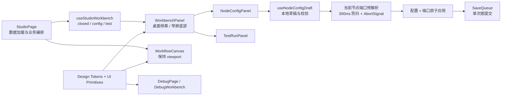

# Agent Studio v0.4-UI-A 核心工作台前端优化设计

**状态：** 已批准，待实施计划

**日期：** 2026-08-25

**目标版本：** v0.4-UI-A

## 1. 背景

v0.4-A 已完成节点调试回放和局部重跑，但 Studio 的交互仍沿用早期最小实现：节点库、节点配置和测试运行分别维护开关，右侧面板可能互相叠加；节点配置表单每次输入都会立即更新整张图、进入保存队列，并触发全部节点的端口重新解析；“应用配置”按钮没有形成真实提交边界。画布、表单和运行状态因此产生不必要的请求、重渲染和上下文切换。

本阶段在 v0.4-B 显式重试之前插入前端优化，优先解决两类问题：

1. **节点配置：** 配置层级清楚，校验就近，动态端口变化可预览，应用与放弃语义真实。
2. **操作顺滑度：** 工作台互斥且可预测，画布视口稳定，切换不会丢失草稿，运行使用用户看到的最新有效版本。

本设计采用渐进式重构，继续使用 React、React Flow、现有 Schema Form、SaveQueue 和 HTTP API，不引入大型 UI 组件库或全局状态库。

## 2. 范围

### 2.1 本阶段交付

- 建立“温暖创作台”设计 Token 和少量通用基础控件。
- 将节点配置和测试运行收敛到单一、自适应的上下文工作台。
- 将独立布尔开关改为明确的工作台状态模型。
- 将节点配置输入改为本地草稿，显式应用后才原子更新图并进入 SaveQueue。
- 只对当前配置节点进行可取消的动态端口预解析。
- 优化画布节点卡片、工具栏、配置表单、测试运行和调试回放的视觉一致性。
- 保持工作台开合前后的 React Flow 视口中心与缩放。
- 建立桌面、平板宽度、键盘、焦点和 reduced-motion 回归。

### 2.2 后续独立阶段

v0.4-UI-B 在本阶段合并后单独设计和实施，复用 UI-A 的 Token 与基础控件改造：

- 工作流列表；
- 运行记录；
- 节点包目录；
- Agent 运行页。

UI-A 与 UI-B 分别创建 PR，不在同一分支混合开发。UI-B 完成后再进入 v0.4-B 显式重试与运行策略。

### 2.3 明确不做

- 不修改 Go 后端、OpenAPI、数据库迁移或公共 Node SDK。
- 不修改工作流图格式，不新增节点自定义显示名称。
- 不建设本地 RAG、Worker、断线续跑、重试或配额。
- 不引入 Ant Design、MUI、Tailwind 或新的全局 Store。
- 不承诺手机端复杂工作流连线效率。
- 不以全局 Loading、隐藏错误或跳过持久化掩盖交互问题。

## 3. 体验原则

### 3.1 单一上下文工作台

全局导航保持轻量，画布内保留一条任务工具栏。右侧同一时间只允许节点配置或测试运行一种模式；调试路由复用相同的工作台视觉和响应式容器，但保持既有只读回放数据流。节点库是短暂选择层，不与右侧工作台共同承担长期状态。

### 3.2 温暖创作台

视觉使用米白画布、暖灰边界和陶土色主操作。深褐用于正文；成功、警告、失败继续使用语义明确且满足对比度的绿色、琥珀色和红色。陶土色不是错误色，错误状态不得只靠颜色区分。

### 3.3 结构清晰节点

节点卡片按以下层级展示：

1. 节点定义标题；
2. `type · version` 与节点 ID；
3. 输入、输出端口名称；
4. 选中、运行和问题状态。

当前图格式没有节点显示名称，本阶段不伪造或仅在浏览器保存自定义名称。节点不常驻展示大段配置摘要，避免复杂图过度增高。

### 3.4 顺滑来自状态边界

动效只用于表达连续性，不能替代请求取消、局部更新和视口保持。一次用户操作只改变必要状态；旧异步结果不得覆盖新选择；关闭、切换、运行和发布不得静默丢失配置草稿。

## 4. 总体架构



`StudioPage` 继续拥有工作流、节点、连线、SaveQueue 和运行请求，但不再直接维护多个面板布尔状态或配置表单草稿。工作台 Hook 管理互斥模式和选择意图；配置 Hook 管理单个节点的草稿、校验、解析和脏状态；自适应工作台只负责布局、宽度、焦点和关闭请求。

## 5. 工作台状态模型

工作台模式只有：

- `closed`：未显示右侧工作台；
- `config(nodeId)`：编辑一个确定节点；
- `test`：配置输入并运行当前草稿。

调试页拥有独立路由状态，但复用 `WorkbenchPanel` 的视觉容器，不并入 Studio 编辑状态机。

状态转换遵循以下规则：

| 当前状态 | 用户动作 | 结果 |
|---|---|---|
| closed | 点击节点 | 打开 config(nodeId)，焦点进入标题 |
| config 且干净 | 点击另一节点 | 直接切换节点，不关闭工作台 |
| config 且脏 | 点击另一节点、测试、添加节点或关闭 | 显示“应用 / 放弃 / 取消”确认 |
| config 且脏 | 测试或发布 | 不执行，提示先应用配置 |
| config 且干净 | 测试 | 切换 test，先 flush SaveQueue |
| test | 选择节点 | 取消仍在运行的可取消请求后进入 config |
| 任意模式 | Escape | 请求关闭；脏配置仍走确认流程 |

确认对话框不能通过点击遮罩默认放弃草稿。应用失败时保持工作台和草稿，不继续原始切换意图。关闭后焦点返回触发按钮或原画布节点。

## 6. 节点配置数据流

### 6.1 本地草稿

打开节点时，以当前节点配置建立深复制草稿。字段输入只更新草稿：

- 不更新 Studio 节点数组；
- 不调用 `commit`；
- 不进入 SaveQueue；
- 不触发其他节点的端口解析。

Hook 暴露 `clean | dirty | resolving | valid | invalid` 等可组合状态。切换到不同节点时，旧草稿和旧请求必须被明确结束，不能由延迟回调写入新节点。

### 6.2 校验

- 字段失焦后校验当前字段，并在字段下方显示错误。
- 点击“应用配置”时执行完整 JSON 组件归一化和 AJV 校验。
- 顶部问题摘要显示错误数量，并提供定位到首个错误字段的操作。
- JSON 文本解析错误、Schema 错误和工作流验证 Issue 使用相同的错误层级，但保留各自来源。
- 解析中或存在错误时禁用应用按钮，不清空用户输入。

### 6.3 必要与可选分组

字段顺序继续由 `x-ui-order` 决定；未列出的字段保持 Schema 属性顺序。本阶段不新增私有分组协议：

- `required` 字段进入“必要配置”，默认展开；
- 其余字段进入“可选配置”，默认折叠；
- 对象和数组继续由现有 Schema Form 递归渲染；
- 没有可选字段时不渲染空分组。

### 6.4 动态端口预解析

草稿通过本地字段校验后，以 300ms 防抖调用现有 `resolveNodeType(type, version, draft, signal)`：

- 只解析当前节点；
- 新解析开始前取消旧 AbortController；
- 只有请求仍属于当前 `nodeId + draftGeneration` 时才能写回预览；
- 解析错误显示安全公开消息并禁止应用；
- 预览比较当前端口与解析端口，列出新增、删除端口以及将失效的现有连线；
- 预览不修改节点、连线或保存队列。

### 6.5 原子应用

用户应用时，前端以同一次状态更新写入当前节点的配置和已解析端口，再用新节点集合标记失效连线，并只调用一次 `commit(nextNodes, nextEdges)`。成功后草稿成为干净状态；SaveQueue 的 pending/saving/saved 状态继续显示在工具栏。

应用不等待 800ms 的持久化完成才能继续编辑，但测试、发布、导出等读取 revision 的操作必须先 `flush()`。不存在有效端口解析结果时不得使用旧端口提交新配置。

## 7. 画布与操作行为

### 7.1 视口保持

`WorkflowCanvas` 的 React Flow Provider 和实例在工作台开合时保持挂载。工作台使用页面 Grid 或等价布局改变画布容器宽度；尺寸变化后只触发 React Flow 容器测量，不调用 `fitView`，不重建节点，不改变用户中心点和缩放。

首次加载仍允许一次 `fitView`。调试页首次载入同样允许一次适配，但时间线选择和工作台内容切换不能再次适配画布。

### 7.2 添加节点

节点库保持短暂选择层。添加节点后：

1. 关闭节点库；
2. 将新节点加入画布并进入一次 SaveQueue 提交；
3. 选中新节点；
4. 打开其配置工作台；
5. 聚焦第一个可配置字段。

若已有脏配置，打开节点库或添加节点前必须先处理草稿。

### 7.3 测试与发布

存在脏配置时，测试和发布按钮保持可发现，但不可直接执行；点击后进入草稿处理流程。配置应用成功后：

1. `SaveQueue.flush()`；
2. 使用最新 revision；
3. 执行既有验证、测试或发布；
4. 运行事件继续按 NDJSON 流展示。

切换离开 test 模式时取消浏览器侧仍在进行的请求；已有外部副作用和模型费用边界保持 README 当前说明，不声称取消可回滚。

## 8. 自适应布局与动效

- 宽度 `>= 1024px`：右侧停靠，宽度可在 `320–480px` 调整；合法宽度保存在本地展示偏好中。
- 宽度 `640–1023px`：底部工作台，最高 `60vh`，画布保留可见区域。
- 宽度 `< 640px`：工作台占据可用高度；允许查看和基础配置，但不承诺复杂连线效率。
- 调整手柄具备键盘操作和可访问名称；本地存储值必须校验和夹紧，非法值回退默认宽度。
- 仅对工作台尺寸、位移和透明度使用 `160–200ms` 过渡。
- `prefers-reduced-motion: reduce` 时关闭非必要过渡。
- 页面不得产生横向滚动条，安全区域和虚拟键盘不能遮挡底部操作区。

## 9. 视觉系统

### 9.1 Token

新增 `tokens.css`，至少定义：

- 画布、表面、浮层和边界颜色；
- 正文、次要文字和禁用文字；
- 主操作陶土色及 hover/active/focus 状态；
- 成功、警告、失败、信息语义色；
- 间距、圆角、阴影、焦点环和动效时长；
- 工作台宽度与层级变量。

组件 CSS 必须引用语义 Token，不再散落新增十六进制颜色。现有颜色在所修改区域内逐步迁移，不要求一期机械重写所有页面。

### 9.2 基础控件

只抽取本阶段至少被两个场景使用的控件：

- `Button`：primary、secondary、ghost、danger；
- `StatusBadge`：保存、运行、问题状态；
- `ConfirmDialog`：脏草稿保护；
- `WorkbenchPanel`：自适应容器。

不预建完整组件库，也不把单次使用结构过早抽象。

## 10. 错误、并发与可访问性

- 所有异步请求按拥有者保存 AbortController，并在节点、工作流或模式变化时取消。
- AbortError 不显示为失败；真实失败保留草稿并显示可重试消息。
- 延迟请求必须同时校验工作流 ID、节点 ID 和 generation，避免旧结果覆盖新上下文。
- SaveQueue 冲突和错误继续显示在工具栏，不被面板局部成功覆盖。
- 对话框使用正确的 dialog 语义、标题关联、焦点圈定和焦点恢复。
- 表单标签、必填状态、帮助文本和错误通过可访问属性关联。
- 状态不能仅通过颜色表达；节点和徽标同时提供文字或图形标记。
- Tab 顺序与视觉顺序一致，画布快捷键不得在表单输入聚焦时误触发。

## 11. 文件边界

### 11.1 预计新增

| 文件 | 职责 |
|---|---|
| `apps/web/src/app/tokens.css` | 温暖创作台语义 Token |
| `apps/web/src/components/ui/Button.tsx` | 通用按钮语义 |
| `apps/web/src/components/ui/StatusBadge.tsx` | 保存、运行与问题状态 |
| `apps/web/src/components/ui/ConfirmDialog.tsx` | 脏草稿确认与焦点管理 |
| `apps/web/src/features/studio/WorkbenchPanel.tsx` | 自适应停靠/底部工作台 |
| `apps/web/src/features/studio/useStudioWorkbench.ts` | 互斥模式、延迟意图和焦点恢复 |
| `apps/web/src/features/studio/useNodeConfigDraft.ts` | 草稿、校验、端口预解析和取消 |
| `apps/web/src/features/studio/NodeConfigPanel.tsx` | 新节点配置工作台内容 |

每个 Hook 和基础控件均配同目录测试；若实现证明某个基础控件只有单一调用方，应内联而不是保留无价值抽象。

### 11.2 预计修改或替换

| 文件 | 变化 |
|---|---|
| `apps/web/src/app/styles.css` | 应用 Token，统一页面基础样式 |
| `apps/web/src/features/studio/StudioPage.tsx` | 降为数据编排层，接入工作台和原子应用 |
| `apps/web/src/features/studio/ConfigDrawer.tsx` | 由 `NodeConfigPanel` 替换后删除 |
| `apps/web/src/features/studio/TestRunDrawer.tsx` | 改为可嵌入工作台的测试内容 |
| `apps/web/src/features/studio/WorkflowCanvas.tsx` | 暴露稳定视口与容器测量接缝 |
| `apps/web/src/features/studio/GenericNode.tsx` | 使用结构清晰节点层级和语义状态 |
| `apps/web/src/features/studio/DebugPage.tsx` | 复用 Token 与工作台容器，不改数据语义 |
| `apps/web/src/features/studio/DebugWorkbench.tsx` | 适配统一工作台视觉 |
| `apps/web/src/features/studio/studio.css` | Grid、响应式、节点和工作台样式 |
| `apps/web/src/components/schema-form/SchemaForm.tsx` | 支持必要/可选分组、提交级校验和错误定位 |
| `apps/web/src/components/schema-form/Field.tsx` | 失焦校验与无障碍关联 |
| `apps/web/e2e/agent-studio.spec.ts` | 主编辑路径、脏草稿和稳定视口 |
| `apps/web/e2e/debug-replay.spec.ts` | 调试视觉复用和响应式回归 |

实际实施若需要拆分大文件，可以按上述职责增加小文件，但不得扩大产品范围。

## 12. 测试与验收

### 12.1 单元与组件测试

- 工作台状态转换、延迟意图、取消和焦点目标。
- 配置草稿初始化、dirty 判定、节点切换和 generation 隔离。
- 300ms 防抖只解析当前节点，旧请求被取消且旧响应被忽略。
- 必要/可选字段顺序、JSON 归一化、字段错误和错误摘要跳转。
- 应用一次只产生一次配置/端口更新和一次图提交。
- 非法本地宽度回退，键盘调整被夹紧到 `320–480px`。
- reduced-motion、状态文字和可访问名称。

### 12.2 Playwright

建立稳定的主路径：

1. 创建工作流并添加节点；
2. 新节点自动打开配置；
3. 输入期间图未提交，应用后只提交一次；
4. 动态端口预览与连线失效提示准确；
5. 切换节点或测试时脏草稿受到保护；
6. 工作台开合前后 viewport 中心与 zoom 保持；
7. 测试运行使用最新 revision 并展示事件；
8. 进入调试回放，视觉容器一致且只读语义不变。

在 `1440px`、`1024px`、`768px` 三档验证无横向溢出、工作台位置和主要操作可见。截图只作为布局证据，行为断言不得依赖像素级全页快照。

### 12.3 门禁

实施遵循 TDD 和小提交。完成后至少运行：

```text
CGO_ENABLED=0 make verify
corepack pnpm@10.34.5 --filter @agent-studio/web exec playwright test
CGO_ENABLED=0 make test-sdk-e2e
CGO_ENABLED=0 make verify-release
git diff --check
```

同时进行完整差异代码审查。任何 Critical/Important 必须修复并复审后才能创建 PR。

## 13. 可行性审查

现有组件能够支持渐进式实现：SaveQueue 已提供显式 `flush()`；节点端口解析 API 已支持 AbortSignal；React Flow 可在 Provider 保持挂载时响应容器尺寸；调试页已有独立工作台边界。因此无需修改后端或替换画布库。

已关闭的主要风险：

| 风险 | 处理 |
|---|---|
| 每次输入保存整图并解析所有节点 | 本地草稿，只解析当前节点，应用时单次提交 |
| 旧解析覆盖新节点 | AbortController + nodeId + generation 三重归属校验 |
| 配置改变动态端口后连线失效 | 应用前比较端口并明确预览失效连线 |
| 右栏开合重置画布 | Provider 保持挂载，只重新测量容器，不调用 fitView |
| 节点切换吞掉草稿 | 统一延迟意图和三选项确认流程 |
| “应用配置”与自动保存语义冲突 | 输入不再提交；应用成为唯一配置提交点 |
| 前端优化意外修改公共协议 | 不改图格式、API、数据库或 SDK；不新增节点显示名称 |
| 一次改造全部页面难以审查 | UI-A 与 UI-B 拆分为两个独立阶段和 PR |

当前没有阻塞 UI-A 实施的架构问题。既有 Vite 单块大于 500KB 警告不由本阶段隐藏；若新基础代码使生产包显著增长，必须在审查中分级并决定是否拆包。

## 14. 交付顺序

1. v0.4-UI-A：本规格的核心工作台优化。
2. v0.4-UI-B：复用设计基础改造管理页面，另行设计。
3. v0.4-B：显式重试与运行策略，在新工作台内提供配置和 Attempt 回放。

UI-A 完成代码审查、全量回归并通过 PR 合并后，才开始 UI-B。两个 UI 阶段均不得预实现重试、本地 RAG 或 Worker。
