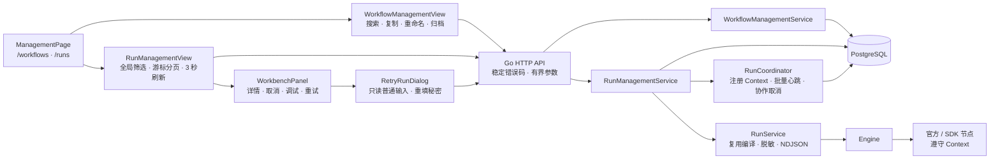

# Agent Studio v0.4-UI-B 工作流与运行管理台设计

**状态：** 已完成对话设计，待书面复核

**日期：** 2026-08-25

**目标版本：** v0.4-UI-B

## 1. 背景

v0.4-UI-A 已统一 Studio 的设计 Token、基础控件、Schema Form 和自适应 `WorkbenchPanel`，解决了节点配置提交边界、动态端口预览、画布视口和脏草稿保护问题。管理页面仍停留在早期最小实现：工作流以卡片平铺，缺少搜索和生命周期操作；运行记录只能从单个工作流进入，列表没有全局筛选、自动刷新、跨页面取消或完整失败重试。

本阶段继续优化前端页面，但范围只聚焦：

1. **工作流列表：** 搜索、状态筛选、新建、复制、重命名、归档和进入编辑器。
2. **运行管理：** 全局列表、组合筛选、详情、取消、调试入口和安全的完整重试。

Agent 公开运行页和本地 RAG 闭环不在本阶段。节点包目录保持现状，后续另行规划。失败重试必须由用户显式触发，不增加隐藏自动重试。

## 2. 已确认的产品决策

| 主题 | 决策 |
|---|---|
| 页面范围 | 工作流列表 + 全局运行管理；不修改 Agent 页面 |
| 工作流操作 | 搜索、状态筛选、新建、复制、重命名、归档、进入编辑器 |
| 运行操作 | 列表、筛选、状态、详情、取消、失败重试、调试回放 |
| 页面结构 | 聚焦式单栏；详情按需进入复用的 `WorkbenchPanel` |
| 运行范围 | 跨工作流全局列表，按工作流、状态、模式和时间筛选 |
| 刷新策略 | 有活跃运行时每 3 秒刷新；页面隐藏后暂停；操作成功立即刷新 |
| 取消语义 | 协作式取消，运行先进入 `cancelling`，最终进入 `cancelled` |
| 重试语义 | 从原运行创建一次完整新运行；原运行不可变并保留来源关联 |
| 秘密输入 | 普通输入只读回填；秘密路径必须重新输入，不保存原始秘密 |
| 基础设施 | 继续使用 React、Go、PostgreSQL 和现有 Engine；不引入 Redis、队列或 SSE |

## 3. 范围

### 3.1 本阶段交付

- 将 `/workflows` 升级为可搜索、可筛选的工作流管理视图。
- 新增 `/runs` 全局运行管理视图。
- 保留 `/workflows/:id` Studio 路由，并将旧的 `/workflows/:id/runs` 导向带 `workflowId` 筛选的全局运行页。
- 新增工作流元数据修改、复制、归档和恢复能力。
- 新增全局运行游标分页、组合筛选和详情工作台。
- 新增跨页面、跨客户端、可由数据库协调的协作式取消。
- 新增失败/取消运行的安全完整重试和幂等保护。
- 复用 UI-A 的 Token、`Button`、`StatusBadge`、`ConfirmDialog`、`SchemaForm` 和 `WorkbenchPanel`。
- 建立桌面、平板、窄屏、键盘、焦点、轮询和竞态回归。

### 3.2 明确不做

- 不修改 Agent 公开运行页和节点包目录。
- 不开发本地 RAG、向量存储、文档摄取或召回节点。
- 不增加定时重试、指数退避、自动恢复、重试策略 DSL 或批量运行操作。
- 不支持从失败节点继续；局部重跑继续使用现有调试回放能力。
- 不提供永久删除工作流或运行记录。
- 不加密保存原始秘密输入，也不允许重试接口返回秘密原值。
- 不增加独立 Worker、任务队列、Redis、WebSocket 或 SSE 管理事件流。
- 不承诺撤销已经发生的模型调用、HTTP 请求或其他外部副作用。

## 4. 总体架构



`ManagementPage` 是共享布局边界，不持有后端业务规则。工作流和运行视图分别管理自己的 URL 查询、加载和操作状态；详情和重试复用 UI-A 工作台与表单能力。Go 端将元数据操作和运行控制从 HTTP Handler 中分离，存储层负责原子状态转换，Engine 继续负责图执行。

PostgreSQL 是运行取消、心跳和幂等关联的事实源。`RunCoordinator` 只保存本实例正在执行的 `runID -> cancel function`，每秒以一次批量查询更新心跳并读取取消请求。多个 API 实例不共享内存，但都能从数据库观察自己正在执行的 Run；不为每个 Run 启动独立数据库轮询。

## 5. 数据模型与迁移

新增 `apps/api/migrations/000003_management.sql` 与 `000004_run_recovery.sql`，只做向前迁移，不重写历史迁移。前者只包含工作流归档和只读管理查询所需索引；后者在基础管理 PR 合并后增加 Run 取消、重试和心跳字段。

### 5.1 workflows

新增：

- `archived_at timestamptz NULL`。

规则：

- `archived_at IS NULL` 表示活跃，非空表示已归档。
- 归档不删除草稿、版本、Run 或 slug。
- slug 在归档期间继续受唯一约束，避免公开 Agent 地址被其他工作流接管。
- 既有工作流列表默认不返回已归档；管理页改用支持 `state` 的摘要分页接口。

### 5.2 runs

新增：

- `retry_of_run_id uuid NULL`：完整重试的直接来源；不复用 Debug 的 `source_run_id`。
- `retry_key uuid NULL`：由客户端生成的请求幂等键。
- `input_redacted_paths text[] NOT NULL DEFAULT '{}'`：创建 Run 时记录输入脱敏 JSON Pointer。
- `cancel_requested_at timestamptz NULL`：用户提交取消请求的时间。
- `heartbeat_at timestamptz NULL`：执行协调器最后确认仍持有运行 Context 的时间。

约束与索引：

- Run 状态集合增加 `cancelling`。
- `retry_of_run_id` 必须引用同一工作流内的 Run。
- `(retry_of_run_id, retry_key)` 建立非空唯一约束，阻止同一次重试重复创建。
- 工作流摘要列表使用 `(archived_at, updated_at DESC, id DESC)` 游标索引。
- 全局 Run 列表使用 `(started_at DESC, id DESC)` 游标索引。
- 为常用组合建立以 `workflow_id`、`status`、`mode` 为前导条件并以 `started_at, id` 收尾的有界索引；实施时以 PostgreSQL `EXPLAIN (FORMAT JSON)` 证明目标查询不对 10 万行夹具执行全表扫描。

历史 Run 的 `input_redacted_paths` 默认空数组。重试预览还必须递归扫描持久化输入中的字面量 `[REDACTED]`，将其路径并入需要重填列表；合法用户值恰好等于该字符串时宁可要求重新输入，也不能把占位符当成秘密原值执行。

### 5.3 终态一致性

当前 Engine 先通过 Observer 持久化 `run.completed/run.failed/run.cancelled` 事件，随后 `RunService` 再更新 `runs.status`，两步之间存在取消竞态。本阶段将 Run 终态统一交给一个数据库事务裁决：

1. 非终态节点事件仍由持久化 Observer 立即写入。
2. Observer 捕获 Engine 的 Run 终态事件，但不提前写入或下发。
3. Engine 返回后，`FinalizeRun` 锁定 Run 行，读取取消状态，决定唯一终态。
4. 同一事务更新 `runs`、必要的未终态 `node_runs`，并追加唯一 Run 终态事件。
5. Engine 因非终态持久化错误而没有产出 Run 终态时，`FinalizeRun` 根据真实错误合成安全的 `run.failed/run.cancelled`。
6. 提交成功后才把裁决后的终态事件发送给 NDJSON 下游。

若取消请求先获得行锁并进入 `cancelling`，终态强制为 `cancelled`；若终态事务先提交，后续取消返回 `RUN_NOT_CANCELLABLE`。这样不会出现 Run 显示 cancelled、事件却显示 completed 的分裂状态。

## 6. HTTP API 契约

所有新请求继续使用现有错误信封和 Request ID。路径 ID 必须严格解析 UUID；查询和正文必须有数量、长度和字节预算。

### 6.1 工作流管理

#### `GET /api/workflow-summaries`

新增不包含 `draftGraph` 的游标分页摘要资源，避免管理列表下载完整图或无界加载。查询参数：

- `q`：名称或 slug 的大小写不敏感包含搜索，UTF-8 最多 100 字节；
- `state`：`active | archived | all`，默认 `active`；
- `cursor`：绑定搜索与状态筛选的不透明 Base64URL 游标；
- `limit`：默认 50，范围 1–100。

响应为 `{items, nextCursor}`，顺序固定为 `updated_at DESC, id DESC`。摘要只包含 ID、名称、slug、说明、草稿 revision、发布版本、归档时间及创建/更新时间。现有 `GET /api/workflows` 数组响应保持原样，避免破坏既有调用方；管理页不再使用它加载完整工作流图。

#### `PATCH /api/workflows/{id}`

正文：

```json
{"name":"新的显示名称","description":"新的说明"}
```

只修改名称和说明。slug 是已发布 Agent 地址的一部分，本阶段不提供重命名。

#### `POST /api/workflows/{id}/copies`

正文：

```json
{"name":"副本名称","slug":"copy-slug"}
```

复制源工作流当前草稿图和说明，创建 revision 1 的新工作流；不复制发布版本、Run、归档状态或版本号。源工作流可以已归档。slug 冲突返回 `WORKFLOW_SLUG_CONFLICT`。

#### `POST /api/workflows/{id}/archive`

仅活跃工作流可归档。归档后允许读取、导出、复制、查看版本、查看运行和调试回放；禁止保存草稿、验证、发布、测试、Agent 运行和完整重试。重复归档返回当前资源，不产生第二次状态变化。

归档不会取消已经开始的 Run；既有运行继续由原图快照或发布版本完成。若需要停止，用户必须在运行管理页显式取消。

#### `POST /api/workflows/{id}/restore`

恢复已归档工作流。重复恢复返回当前资源。

### 6.2 全局运行列表

#### `GET /api/runs`

查询参数：

- `workflowId`：单个工作流 UUID；
- `status`：可重复，最多 5 个；
- `mode`：可重复，最多 3 个；
- `startedAfter`、`startedBefore`：RFC 3339，时间跨度最多 90 天；
- `runId`：完整 UUID 精确定位，不提供低效模糊搜索；
- `cursor`：不透明 Base64URL 游标；
- `limit`：默认 50，范围 1–100。

响应：

```json
{
  "items": [],
  "nextCursor": null
}
```

顺序固定为 `started_at DESC, id DESC`。游标包含格式版本、最后一条记录的时间与 ID，并绑定筛选指纹；不能把一个筛选条件生成的游标用于另一组条件。非法、格式版本不支持或筛选不匹配的游标返回 `CURSOR_INVALID`。

现有 `GET /api/workflows/{id}/runs` 暂时保留兼容性，但前端不再作为主入口。

### 6.3 运行详情与取消

现有 `GET /api/runs/{id}` 保持响应兼容，并补充 Run 新字段。

#### `POST /api/runs/{id}/cancel`

- `running` 原子进入 `cancelling` 并记录 `cancel_requested_at`；
- `cancelling` 重复调用返回当前状态；
- 终态返回 `409 RUN_NOT_CANCELLABLE`；
- Debug、草稿和发布 Run 均可取消；
- 响应为最新 Run 摘要，不等待节点完全结束。

取消只表示请求执行端在安全检查点停止，不回滚已经产生的外部副作用。忽略 Context 的第三方节点可能长时间保持 `cancelling`，界面必须展示该限制，不能谎报已取消。

### 6.4 安全完整重试

#### `GET /api/runs/{id}/retry-preview`

仅 `failed` 或 `cancelled` 的 `test/published` Run 可预览。响应包含：

- 来源 Run 摘要和 `retryOfRunId`；
- 脱敏后的普通输入；
- 合并后的 `inputRedactedPaths`；
- 从原草稿图快照或发布版本派生的输入 Schema；

Debug Run 返回 `RUN_NOT_RETRYABLE` 并指引使用调试回放；已归档工作流返回 `WORKFLOW_ARCHIVED`。不符合条件时不返回部分预览，避免前端误用不完整输入。

#### `POST /api/runs/{id}/retries`

请求必须携带规范 UUID 格式的 `Idempotency-Key`。正文只提交需要重新输入的路径和值：

```json
{
  "secretValues": {
    "/webhookToken": "重新输入的值"
  }
}
```

服务端从持久化的脱敏输入建立副本，只允许把 `secretValues` 精确应用到预览返回的脱敏路径。普通字段根本不由客户端提交，因此不能借“重试”修改历史输入。服务端必须重新执行：

1. 来源状态和模式校验；
2. 工作流归档校验；
3. `secretValues` 与历史脱敏路径精确一致、无缺失或额外路径，且替换后不保留占位符；
4. 输入 Schema 校验和输入预算；
5. 原图快照或原发布版本编译；
6. `(sourceRun, idempotencyKey)` 原子幂等创建。

新 Run 保持来源的 `test` 或 `published` 模式：测试 Run 使用原 `graph_snapshot`，不读取已经变化的当前草稿；发布 Run 使用原 `workflow_version_id`。新 Run 记录 `retry_of_run_id`，但不修改来源 Run。响应继续使用 `application/x-ndjson`；重复幂等键不再次执行，而返回 `RUN_RETRY_ALREADY_CREATED` 并在错误详情中提供已创建 Run ID。

## 7. 工作流生命周期规则

工作流状态只有：

```text
active ──archive──> archived
   ^                  |
   └────restore───────┘
```

“已发布/未发布”是版本信息，不与活跃/归档混为一个状态枚举。列表默认按 `updatedAt DESC`，支持：

- 服务端名称或 slug 的大小写不敏感包含搜索；
- 全部、活跃、已归档筛选；
- 最近更新排序；
- 每一行的编辑、复制、重命名、归档/恢复菜单。

新建和复制均使用对话框。复制对话框默认名称为“源名称 副本”，slug 必须由用户确认，不能在冲突后静默改写。归档使用 `ConfirmDialog`，明确说明 Agent 将不能发起新运行，历史不会删除。

## 8. 运行状态与协调器

### 8.1 状态机

```text
running ───────────────────────> completed
   ├───────────────────────────> failed
   ├── cancel request ─> cancelling ─> cancelled
   └── request/context closed ───────> cancelled
```

`completed`、`failed`、`cancelled` 是不可变终态。取消与终态通过第 5.3 节的同一行锁事务确定先后顺序。

### 8.2 RunCoordinator

`RunCoordinator` 的职责严格限定为：

- 在 `RunService.Execute` 开始时注册派生 Context 与 cancel function；
- 在结束时注销，不保留输入、输出或节点配置；
- 同一实例收到取消请求时立即取消对应 Context；
- 每 1 秒把本实例活跃 Run ID 作为一个有界批次提交给 Store；
- 单次 Store 调用更新心跳，并返回其中已请求取消的 ID；
- 关闭服务时取消全部本地活跃 Context，并等待正常终态持久化。

批次默认最多 500 个 ID，超出时稳定分片；空集合不访问数据库。Store 只接受状态仍为 `running/cancelling` 的 Run。取消正常观察延迟目标小于 2 秒。

### 8.3 心跳失效收敛

执行 Context 与 HTTP 请求同生命周期，API 进程退出后运行不能继续。后台收敛器每 10 秒查找 `heartbeat_at` 超过 15 秒未更新的 `running/cancelling` Run，以终态事务标记 `cancelled`、写入公开错误 `RUN_INTERRUPTED`、取消未终态 NodeRun 并补齐唯一 `run.cancelled` 事件。

心跳阈值、数据库时间和批量上限是服务端常量，不开放为本阶段配置项。测试使用可注入 Clock/Ticker，不依赖真实 sleep。

## 9. 前端信息架构与交互

### 9.1 路由与布局

- `/workflows`：共享管理布局，工作流标签激活；
- `/runs`：共享管理布局，运行记录标签激活；
- `/runs?workflowId=<id>`：从 Studio 或旧运行历史入口进入的预筛选页面；
- `/workflows/:id/runs`：兼容跳转到上述全局页面；
- `/workflows/:id/runs/:runId/debug`：现有调试回放保持不变。

管理页采用聚焦式单栏。宽度大于等于 1024px 时，详情 `WorkbenchPanel` 从右侧停靠；更窄宽度沿用 UI-A 的覆盖/底部行为。列表保持主视觉焦点，不建设常驻双栏和指标仪表盘。

### 9.2 URL 状态

工作流搜索、工作流状态、运行筛选、时间范围和游标都由 URLSearchParams 表达。浏览器刷新、前进/后退和复制 URL 必须恢复同一视图。无效 URL 参数显示安全提示并规范化移除，不能发出无界请求。

筛选变化时：

1. 取消旧 AbortController；
2. 清除旧游标和选择；
3. 发出新请求；
4. 只有仍匹配当前查询 generation 的响应才能更新页面。

### 9.3 智能刷新

- 只有当前页包含 `running` 或 `cancelling` 时才每 3 秒重新请求当前筛选的第一页；
- `document.visibilityState !== 'visible'` 时暂停；恢复可见后立即刷新一次；
- 页面卸载、筛选变化和手工操作会取消旧刷新请求；
- 手工取消、归档、恢复和重试创建成功后立即刷新；
- 不在轮询失败时指数制造并发请求；上一请求未完成时跳过本次 tick。

轮询更新不抢走焦点、不关闭工作台；已选 Run 仍存在时刷新摘要，进入终态后停止无意义轮询。

### 9.4 运行详情工作台

详情展示：

- 完整 Run ID、工作流、模式、状态、开始/结束时间和耗时；
- 草稿 revision 或发布版本；
- `retryOfRunId` 与既有 Debug 来源链入口；
- 节点运行时间线、公开错误、脱敏输入/输出；
- 状态允许时的取消、重试和调试回放操作。

取消后按钮禁用并显示“取消中”。取消提示明确“不会撤销外部副作用”。Escape 关闭工作台；关闭后焦点回到原列表行。窄屏工作台覆盖列表且不能产生页面级横向滚动。

### 9.5 重试对话框

重试对话框复用 `SchemaForm` 的字段层级、错误关联和焦点管理，但增加路径级只读控制：

- 非脱敏路径显示原值且不可修改；
- 脱敏路径不显示占位符，字段清空、标为必填并自动聚焦首项；
- 提交期间禁用关闭和重复提交；
- 客户端生成 UUID 幂等键，真实失败后使用同一键重试；
- 成功创建后关闭对话框、切到新 Run、打开详情并继续刷新；
- 失败保留用户刚输入的秘密只存在于组件内存，关闭、成功或卸载时立即清除；
- 错误日志、通知和浏览器存储不得包含秘密字段值。

## 10. 错误、安全与并发

### 10.1 稳定错误码

| 错误码 | HTTP | 场景 |
|---|---:|---|
| `WORKFLOW_ARCHIVED` | 409 | 归档工作流被保存、发布或运行 |
| `WORKFLOW_SLUG_CONFLICT` | 409 | 新建或复制 slug 冲突 |
| `RUN_NOT_CANCELLABLE` | 409 | 终态 Run 被取消 |
| `RUN_NOT_RETRYABLE` | 409 | 状态或模式不允许完整重试 |
| `RUN_RETRY_SECRET_REQUIRED` | 422 | 脱敏路径仍为空或含历史占位符 |
| `RUN_RETRY_ALREADY_CREATED` | 409 | 相同幂等键已经创建 Run |
| `CURSOR_INVALID` | 400 | 游标非法或与筛选不匹配 |
| `RUN_INTERRUPTED` | 终态公开错误 | 执行进程失去心跳 |

所有数据库错误和第三方节点内部错误继续通过现有 PublicError 映射，不把 SQL、堆栈、请求正文或秘密原值返回前端。

### 10.2 页面错误行为

- 首次加载失败显示错误状态和重试按钮。
- 后续刷新失败保留现有列表，显示非阻塞错误，不用空状态覆盖数据。
- `409` 后加载最新资源并解释状态变化。
- `422` 映射到重试字段；未知路径进入表单顶部摘要。
- AbortError 不显示为失败。
- 网络中断不自动生成新幂等键；用户明确重试时复用原键查询既有结果。

### 10.3 安全边界

- `runs.input` 继续只存 `RedactWithReport(input).Value`。
- `input_redacted_paths` 只存 JSON Pointer，不存秘密。
- Coordinator、游标、错误详情和日志不保存输入值。
- 重试秘密只存在于请求内存和节点执行 Context；持久化、事件和输出继续经过脱敏。
- 普通输入在重试 UI 中不可编辑，确保“重试”不是隐式复制并修改运行。
- 归档不是权限控制；本阶段不新增用户、组织或 RBAC。

## 11. 文件边界

### 11.1 预计新增

| 文件 | 职责 |
|---|---|
| `apps/api/migrations/000003_management.sql` | 工作流归档与管理查询索引 |
| `apps/api/migrations/000004_run_recovery.sql` | Run 重试、取消、心跳字段及状态约束 |
| `apps/api/internal/workflow/management_types.go` | 查询、分页、重试预览和管理 DTO |
| `apps/api/internal/workflow/workflow_management.go` | 元数据、复制、归档与恢复规则 |
| `apps/api/internal/workflow/run_management.go` | 全局查询、取消与完整重试规则 |
| `apps/api/internal/workflow/run_coordinator.go` | 活跃 Context、批量心跳、取消和收敛 |
| `apps/api/internal/httpapi/management_workflows.go` | 工作流管理 Handler |
| `apps/api/internal/httpapi/management_runs.go` | 全局查询、取消和重试 Handler |
| `apps/web/src/features/management/ManagementPage.tsx` | `/workflows` 与 `/runs` 共享布局 |
| `apps/web/src/features/management/WorkflowManagementView.tsx` | 工作流列表及生命周期操作 |
| `apps/web/src/features/management/RunManagementView.tsx` | 全局筛选、分页、轮询与选择 |
| `apps/web/src/features/management/RunDetailPanel.tsx` | 运行详情工作台内容 |
| `apps/web/src/features/management/RetryRunDialog.tsx` | 安全重试表单与秘密清理 |
| `apps/web/src/features/management/useRunList.ts` | URL 查询、generation、轮询和可见性 |
| `apps/web/src/features/management/management.css` | 聚焦单栏、表格和响应式样式 |
| `apps/web/e2e/management.spec.ts` | 工作流管理、全局运行、取消和重试主路径 |

所有新 Go 服务、Hook 和交互组件均配置同目录测试。若实现中单文件职责过大，应按上述边界继续拆小，不能把业务规则塞回 Handler 或页面组件。

### 11.2 预计修改或替换

| 文件 | 变化 |
|---|---|
| `apps/api/internal/domain/workflow.go` | 增加 `ArchivedAt` |
| `apps/api/internal/domain/run.go` | 增加 cancelling、重试、脱敏路径、取消和心跳字段 |
| `apps/api/internal/workflow/ports.go` | 增加管理与协调器所需 Store 接口 |
| `apps/api/internal/workflow/run_service.go` | 注册 Coordinator，使用原子终态裁决，记录 Run 输入脱敏路径 |
| `apps/api/internal/workflow/service.go` | 归档资源写入/发布守卫 |
| `apps/api/internal/store/postgres/workflows.go` | 归档、复制、元数据操作及默认过滤 |
| `apps/api/internal/store/postgres/runs.go` | 全局游标查询、取消、心跳、幂等重试和原子终态 |
| `apps/api/internal/httpapi/router.go` | 注册新接口与 Coordinator 生命周期 |
| `apps/api/internal/httpapi/workflows.go`、`runs.go` | 复用管理服务并保持旧接口兼容 |
| `contracts/openapi.yaml` | 新路径、查询、Schema、状态和稳定错误契约 |
| `apps/web/src/lib/api/generated.ts` | 由 OpenAPI 重新生成，不手改漂移 |
| `apps/web/src/lib/api/client.ts` | 管理 API、AbortSignal、NDJSON 重试封装 |
| `apps/web/src/app/router.tsx` | `/runs` 与旧历史路由兼容跳转 |
| `apps/web/src/features/workflows/WorkflowListPage.tsx` | 被管理视图替换后删除或降为路由兼容薄层 |
| `apps/web/src/features/runs/RunHistoryPage.tsx` | 被全局管理视图替换后删除或降为筛选跳转薄层 |
| `apps/web/src/components/schema-form/SchemaForm.tsx` | 增加路径级只读/秘密重填策略，不改变默认调用行为 |
| `apps/web/src/app/styles.css` | 管理页引用既有 Token，不新增散落颜色 |
| `apps/web/e2e/agent-studio.spec.ts` | 只补与 Studio 归档守卫相关的回归 |
| `docs/frontend-workbench.md` | 增加管理工作台、取消和安全重试说明 |

## 12. 测试与验收

### 12.1 Go 单元与服务测试

- 归档、重复归档、恢复、归档写守卫和 slug 保留。
- 复制只复制草稿，不复制版本、Run 或归档状态。
- Run 查询过滤、排序、游标筛选指纹和预算。
- 取消状态转换、重复取消、终态拒绝和 Context 传播。
- Engine 终态事件与 Run 状态同事务裁决；取消/完成两种锁顺序均覆盖。
- 测试 Run 使用原图快照，发布 Run 使用原版本，Debug 拒绝完整重试。
- 运行输入脱敏路径、历史占位符扫描、秘密必填、Schema 校验和日志脱敏。
- 相同幂等键只创建一个新 Run，并返回既有 Run ID。
- Coordinator 空批次不访问数据库、超量分片、心跳、远端取消、关闭和假时钟收敛。

### 12.2 PostgreSQL 集成测试

- `000003`、`000004` 在空库和上一版本既有数据上均可顺序迁移。
- 工作流摘要状态过滤、游标分页、归档恢复和既有列表兼容。
- 10 万 Run 夹具下关键组合查询使用目标索引，游标无重复、无遗漏。
- 并发取消和终态写入只能产生一个终态状态与一个终态事件。
- 并发相同幂等键只能创建一个重试 Run。
- 心跳失效事务同步更新 Run、NodeRun、PublicError 和 `run.cancelled` 事件。

### 12.3 HTTP 契约测试

- 所有路径、方法、状态码、Content-Type 和 ErrorResponse 符合 OpenAPI。
- 重复查询参数数量、90 天时间跨度、limit、游标长度和正文预算严格拒绝。
- 归档、取消、重试的稳定错误码和 Request ID 完整。
- 重试 NDJSON 在创建、运行、终态和断开时保持既有流契约。
- 任何响应、日志夹具和错误详情都不含测试秘密值。

### 12.4 React 单元与组件测试

- URL 筛选恢复、无效参数规范化、游标重置和浏览器前进/后退。
- 旧请求 Abort、generation 隔离和最后响应获胜。
- 仅活跃状态轮询、页面隐藏暂停、恢复立即刷新且请求不重叠。
- 刷新不抢焦点、不关闭已选详情；终态后停止轮询。
- 工作流搜索、复制、重命名、归档/恢复及错误恢复。
- 取消按钮状态、终态竞争和公开副作用提示。
- 重试普通字段只读、秘密字段清空必填、幂等键复用和卸载清理。
- `WorkbenchPanel` 的 Escape、焦点圈定、焦点恢复和窄屏覆盖。

### 12.5 Playwright

至少覆盖：

1. 创建工作流，在列表搜索并进入编辑器；
2. 复制工作流，显式解决 slug，再重命名副本；
3. 归档后不能运行，恢复后重新可用；
4. 从全局运行页按工作流、状态、模式和时间筛选；
5. 打开运行详情并进入调试回放；
6. 取消运行并观察 `cancelling -> cancelled`；
7. 对失败运行打开重试，普通输入只读、秘密必须重填；
8. 双击或断线重试不创建两个 Run；
9. `1440px`、`1024px`、`768px` 无页面横向溢出，键盘与焦点可用。

### 12.6 门禁

实施遵循 TDD 和小提交。完成后至少运行：

```text
COMPOSE_PROJECT_NAME=agent_improve CGO_ENABLED=0 make verify
corepack pnpm@10.34.5 --filter @agent-studio/web exec playwright test
CGO_ENABLED=0 make test-sdk-e2e
CGO_ENABLED=0 make verify-release
git diff --check
```

完成实现后必须进行完整差异代码审查和回归。任何 Critical/Important 必须修复并复审后才能创建 PR。

## 13. 验收标准

- 500 条工作流下搜索、状态筛选和菜单操作保持顺滑且请求有界。
- 10 万条 Run 数据下全局列表使用游标和目标索引，不执行全表扫描。
- 活跃列表最多 3 秒反映状态变化，取消正常情况下 2 秒内被执行端观察。
- Run 状态和终态事件永远一致，终态只有一个且不可修改。
- 重试绝不执行历史 `[REDACTED]` 占位符，也不会因双击或网络恢复创建两次 Run。
- 归档工作流不能保存、发布或运行，但历史、导出、复制和恢复可用。
- 数据库、API、事件、日志和浏览器持久存储都不出现秘密原值。
- 三档宽度无页面级横向溢出，工作台焦点、Escape、标签和状态文字完整。
- Studio、Agent 页面、调试回放和节点包目录无行为回归。

## 14. 可行性审查

### 14.1 已关闭的阻塞项

| 阻塞或风险 | 处理 |
|---|---|
| Run 只存脱敏输入，无法原样恢复秘密 | 普通输入只读回填，秘密路径重新输入；历史占位符安全扫描 |
| 跨页面/客户端取消无法只靠原 HTTP AbortController | PostgreSQL 取消标记 + 本地 Coordinator + 批量心跳 |
| 取消与 Engine 终态事件分两步写入可能分裂 | Observer 暂存 Run 终态，Store 在同一事务裁决状态和终态事件 |
| API 进程退出留下永久 running | 心跳失效收敛为 cancelled，并补齐 NodeRun 和终态事件 |
| 重试断线或双击可能重复执行 | `(retry_of_run_id, retry_key)` 数据库唯一约束 |
| 草稿已变化导致重试语义漂移 | 测试 Run 使用原 graph snapshot；发布 Run 使用原 version |
| Debug Run 缺少完整执行作用域 | 明确拒绝完整重试，继续使用已存在的局部调试重跑 |
| 管理轮询产生请求风暴 | 仅活跃页轮询、隐藏暂停、单飞请求、操作后立即刷新 |
| 大量 Run 查询退化 | 有界参数、游标分页、组合索引和 10 万行 EXPLAIN 证据 |

### 14.2 已接受的限制

- 协作式取消依赖节点遵守 Context；忽略 Context 的第三方代码不能被 Go 进程安全强杀。
- 取消不撤销外部副作用、模型费用或已经发送的网络请求。
- 工作流与 Run 列表均使用游标分页；本阶段不提供任意跳页或精确总数。
- 管理状态使用短轮询，最多存在 3 秒展示延迟；不建设实时广播。
- 本阶段没有用户身份与权限模型，归档和运行操作沿用当前部署访问边界。

### 14.3 结论

现有 PostgreSQL、Run 图快照、WorkflowVersion、NDJSON 执行流、PublicError、Schema Form 和 UI-A 工作台足以支持渐进式实现。所有关键竞态都有明确的数据库原子边界，秘密输入没有扩大持久化面，当前无 Critical/Important 级阻塞。

## 15. 交付拆分与顺序

本规格拆成两个严格顺序、分别审查和回归的 PR，避免把独立风险面混入一个超大变更。

### PR 1：管理台基础

1. `000003_management.sql`、WorkflowSummary、归档字段和只读查询索引。
2. 工作流元数据、复制、归档/恢复服务及所有归档守卫。
3. 全局 Run 游标查询和现有详情读取，不改变执行状态机。
4. 前端共享管理布局、工作流视图、全局运行列表和只读详情工作台。
5. 响应式、可访问性、查询性能证据和全量回归。

PR 1 合并后，管理页已可完整浏览和管理工作流、筛选及查看 Run，但取消与完整重试按钮尚不出现。

### PR 2：运行恢复

1. `000004_run_recovery.sql`、Run 新字段和原子终态裁决。
2. RunCoordinator、批量心跳、协作取消和失效收敛。
3. 安全完整重试、幂等约束与 HTTP/OpenAPI 契约。
4. 详情工作台取消操作、重试对话框和智能刷新闭环。
5. 并发、秘密、断线、三档宽度和全量回归。

PR 2 必须基于已合并的 PR 1 最新 `main` 新建分支。两个 PR 均不得提前实现下一阶段的自动重试、策略 DSL 或本地 RAG。

本规格通过书面复核后，先生成 PR 1 的实施计划；PR 1 合并后再基于同一规格生成 PR 2 的实施计划。实施前不预写功能代码。
