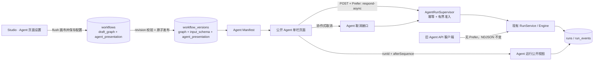
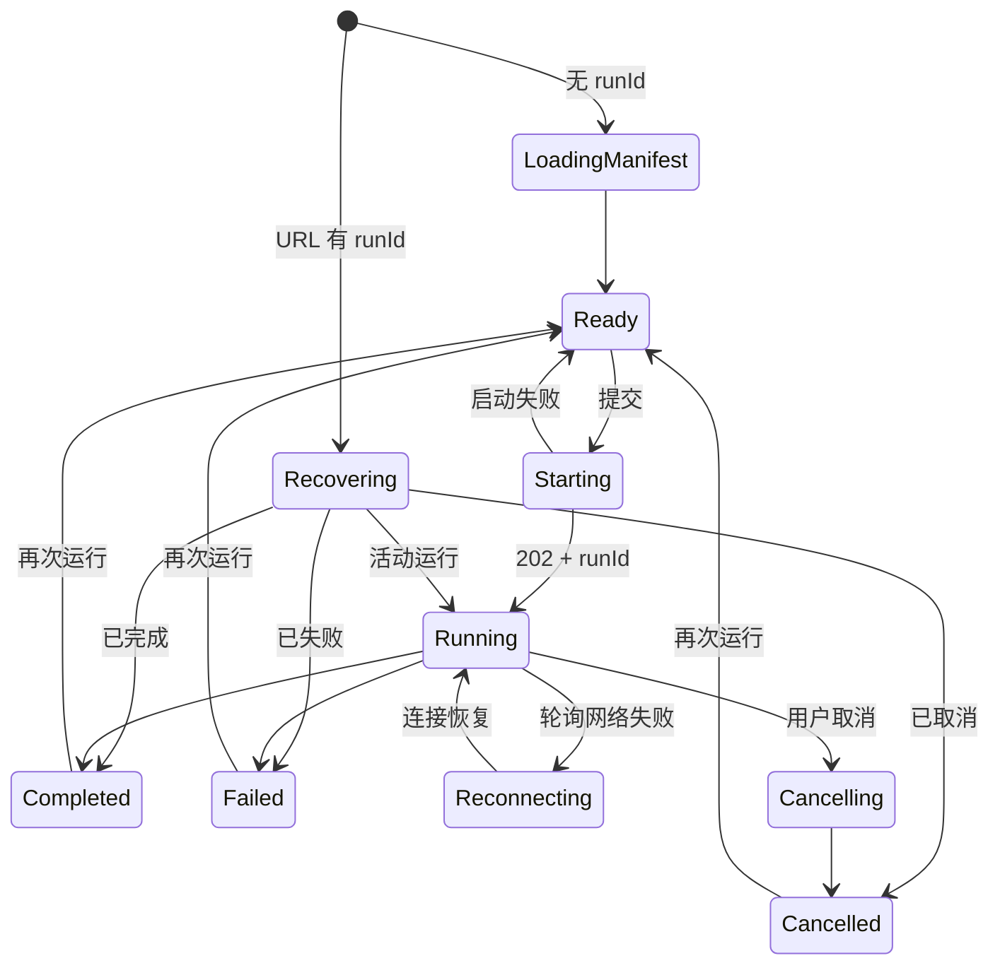

# Agent Studio v0.4 UI-C Agent 发布页体验设计

- **日期：** 2026-08-26
- **目标版本：** v0.4 UI-C
- **状态：** 已确认，待实施
- **主分支：** `main`
- **设计分支：** `codex/v0.4-ui-c-agent-page-design`

## 1. 背景

Agent Studio 当前已经具备画布优先的工作流编辑器、开始节点驱动的动态表单、不可变发布版本、Go 执行引擎、Docker PostgreSQL、运行事件持久化、协作式取消、心跳与陈旧运行收敛，以及公开 Agent 页面 `/agents/{slug}`。

现有 Agent 页面仍是最小演示形态：标题和说明直接读取可变的工作流元数据，页面样式不可配置；运行依附于浏览器 NDJSON 请求，刷新或关闭页面会取消执行；取消按钮只中断浏览器请求；恢复页面后无法找回原运行；运行进度还会直接展示节点 ID。它能够证明“从开始节点生成页面”，但尚未形成稳定、可发布、可恢复的使用体验。

本阶段建设 v0.4 UI-C“Agent 发布页体验”：在不引入认证、页面搭建器、分布式队列和本地 RAG 的前提下，为已发布工作流提供受约束、版本化、可恢复的聚焦式单栏页面。

## 2. 已确认的产品决策

- 优先升级公开 Agent 页面，不开发第二批官方节点、运维配额或本地 RAG 闭环。
- 继续保持本地单租户、无登录模式；本阶段不设计账号、权限和分享访问码。
- Agent 页面采用聚焦式单次表单，不增加对话会话和页面内历史运行列表。
- 页面外观使用受约束配置，不建设自由页面搭建器。
- 配置包含标题、说明、预置强调色、提交按钮文案和结果显示模式，并在发布时随工作流版本冻结。
- 运行启动后把 `runId` 写入 URL；刷新或重新打开页面时恢复对应运行状态和结果。
- 刷新页面不能取消通过新版页面启动的运行；运行继续在当前 API 进程内执行。
- 最终结果只支持安全纯文本和结构化 JSON，不支持 Markdown、HTML 或模板脚本。
- 恢复旧运行时使用该运行所属工作流版本的页面配置，不使用当前最新发布版本覆盖。
- 现有 Agent NDJSON 接口必须保持向后兼容。

## 3. 目标、成功标准与非目标

### 3.1 目标与成功标准

1. 用户可在 Studio 中编辑受约束的 Agent 页面配置，并通过同一草稿 revision 机制安全保存。
2. 发布创建不可变版本时同时快照输入 Schema 和页面配置；未发布修改不得影响公开页面。
3. 旧工作流和旧版本迁移后具有完整、合法的默认页面配置。
4. 新 Agent 页面使用聚焦式单栏完成输入、执行、取消、结果复制和再次运行。
5. 新版页面启动的运行不依赖浏览器请求生命周期；刷新、重新打开或短暂断网后可以恢复。
6. 页面恢复旧运行时展示其原版本号、原页面配置、进度和终态结果。
7. 同一异步启动幂等键最多创建并执行一个运行。
8. 取消、完成和失败竞态仍只产生一个服务端终态。
9. 公开运行查询不返回输入、节点输入、节点输出、内部错误或调试详情。
10. 不携带异步偏好的旧客户端继续得到原有 NDJSON 事件流。
11. 桌面和窄屏均可完成核心流程，状态变化可被键盘和屏幕阅读器用户感知。

### 3.2 明确不做

- 登录、用户、租户、RBAC、访问码、分享权限或审计日志。
- Agent 页面运行历史、搜索、筛选、收藏或会话列表。
- 对话式多轮 Session、消息表、记忆或线程恢复。
- 自由拖拽页面搭建、自定义 CSS、HTML、JavaScript、图片、视频或远程字体。
- Markdown 渲染、富文本模板、表达式求值或任意结果组件插件。
- 分布式任务队列、独立 Worker、跨进程调度、崩溃后继续原计算或 exactly-once 执行承诺。
- 重试失败运行、输入回填、密钥恢复或公开调试视图。
- 本地 RAG、向量库、知识库管理或第二批官方节点。
- 将页面配置加入工作流模板文件；模板契约在本阶段保持不变。

## 4. 方案比较

| 方案 | 优点 | 主要问题 | 结论 |
|---|---|---|---|
| 版本化页面清单 + Agent 专用运行视图 | 发布语义清晰；旧运行可按原版本恢复；管理数据与公开数据隔离；后续可安全增加受限字段 | 需要迁移、发布链路和异步运行编排 | **采用** |
| 把页面配置写入画布 Graph 并复用管理端运行接口 | 初始改动较少 | 页面部署信息与 DAG 耦合；暴露管理 DTO；版本和恢复边界不清晰 | 不采用 |
| 独立 Agent Page 实体与页面发布体系 | 扩展性最高 | 接近页面搭建器；引入额外 CRUD、版本和关联生命周期，超出当前目标 | 延后评估 |

采用方案把页面配置视为“工作流可发布草稿的一部分”，但不把它嵌入 DAG。它与 Graph 共用 `draftRevision` 的并发控制，并在发布事务中进入同一个不可变 `workflow_versions` 记录。

## 5. 总体架构



组件职责：

- `AgentPresentation`：页面配置领域模型、默认值、规范化和校验，不依赖 HTTP、数据库或 React。
- `workflow.Service`：保存页面配置、发布快照并生成版本化 Agent Manifest。
- `AgentRunService`：公开 Agent 运行的启动、归属校验、公开事件映射、状态读取和幂等取消。
- `AgentRunSupervisor`：进程内异步运行的并发准入、生命周期 Context、WaitGroup 和优雅关闭；不负责业务校验或数据库查询。
- PostgreSQL Store：保存版本化配置、异步启动幂等键，并提供按 Agent 归属读取运行和增量事件的原子查询能力。
- `useAgentRun`：浏览器端运行状态机、URL 恢复、增量轮询、退避和取消。
- Agent 展示组件：只消费公开 DTO，不依赖管理端 Run、NodeRun 或调试接口。

## 6. 页面配置模型

### 6.1 结构

```json
{
  "title": "客户咨询助手",
  "description": "填写信息后生成处理建议",
  "accent": "indigo",
  "submitLabel": "开始生成",
  "resultMode": "auto"
}
```

字段约束：

| 字段 | 约束 |
|---|---|
| `title` | 去除首尾空白后 1–80 个 Unicode 字符 |
| `description` | 去除首尾空白后最多 500 个 Unicode 字符，可为空 |
| `accent` | `indigo`、`blue`、`teal`、`amber`、`rose` 之一 |
| `submitLabel` | 去除首尾空白后 1–24 个 Unicode 字符 |
| `resultMode` | `auto`、`text`、`json` 之一 |

默认值：

- `title` 使用创建工作流时的名称。
- `description` 使用创建工作流时的说明。
- `accent=indigo`。
- `submitLabel=运行 Agent`。
- `resultMode=auto`。

工作流名称/说明与 Agent 页面标题/说明在创建后相互独立。修改管理元数据不会隐式修改页面草稿；设置对话框提供“使用工作流信息”操作供用户显式覆盖。

`resultMode` 语义：

- `auto`：字符串按纯文本展示；对象、数组、数字、布尔值和 `null` 按格式化 JSON 展示。
- `text`：字符串按纯文本展示；其他 JSON 值使用紧凑、稳定的文本表示，不调用对象的自定义执行逻辑。
- `json`：所有值都按格式化 JSON 展示，字符串包含 JSON 引号。

任何模式都只写入文本节点或 `<pre>`，不得使用 `dangerouslySetInnerHTML`，不得解析 Markdown。

### 6.2 草稿 revision

新增管理接口使用完整替换而不是局部 PATCH：

```http
PUT /api/workflows/{id}/agent-presentation
Content-Type: application/json

{
  "draftRevision": 12,
  "presentation": { ... }
}
```

服务端按以下顺序处理：

1. 严格解码并校验完整 `AgentPresentation`。
2. 对工作流行 `FOR UPDATE`，检查未归档且 `draft_revision` 等于请求值。
3. 更新 `agent_presentation`、令 `draft_revision=draft_revision+1` 并刷新 `updated_at`。
4. 返回包含新 revision 的完整 Workflow。

Studio 打开设置前先 `SaveQueue.flush()`；保存成功后通过新增的受控方法让 SaveQueue 接受服务端 revision。因为对话框为模态交互，flush 后不会同时产生新的画布保存。多标签页竞争返回 `409 WORKFLOW_REVISION_CONFLICT`，保留用户填写内容并提示重新加载，不自动覆盖。

### 6.3 创建、复制和模板行为

- 普通创建和模板导入使用工作流名称、说明生成默认页面配置。
- 复制工作流时复制源工作流的页面草稿配置，但新工作流仍为未发布状态且 revision 为 1。
- 工作流模板继续只描述可移植 Graph 和模板元数据，不携带 Agent 页面配置。
- 导入模板后用户可在 Studio 页面设置中调整呈现，再发布。

## 7. 数据库与迁移

新增 `apps/api/migrations/000005_agent_page.sql`：

1. `workflows` 增加 `agent_presentation jsonb`。
2. `workflow_versions` 增加 `agent_presentation jsonb`。
3. `runs` 增加 `agent_request_key uuid NULL`，仅用于异步公开 Agent 启动。
4. 增加部分唯一索引：同一工作流下非空 `agent_request_key` 唯一，且仅允许出现在 `mode='published'` 的运行上。
5. 为两个页面配置列增加 `jsonb_typeof(...)='object'` 检查。

迁移先以可空列加入并回填，再设置 `NOT NULL`：

- 每个现有 Workflow 使用其迁移时的名称和说明，加系统默认样式生成草稿配置。
- 每个现有 WorkflowVersion 使用所属 Workflow 在迁移时的名称和说明生成版本配置。
- 历史版本过去的名称无法从现有数据还原；迁移时快照是唯一确定、无猜测的兼容策略。迁移完成后的所有新版本均具备真实发布快照。

幂等索引建议为：

```sql
CREATE UNIQUE INDEX runs_agent_request_key_unique_idx
  ON runs(workflow_id, agent_request_key)
  WHERE agent_request_key IS NOT NULL AND mode = 'published';
```

同时增加约束，确保测试运行、局部重跑和管理重试不会误写该字段。迁移不重写 Graph、输入 Schema、运行输出或事件。

## 8. 发布与 Manifest

发布仍以 `draftRevision` 为唯一乐观锁令牌：

1. Service 读取同一 Workflow 的 Graph 和 `AgentPresentation`。
2. 校验工作流活动状态和 revision。
3. 编译 Graph 并派生输入 Schema。
4. Store 在事务中锁定 Workflow，再次比较 revision。
5. 插入包含 Graph、InputSchema 和 AgentPresentation 的 WorkflowVersion。
6. 更新 `published_version_id` 后提交。

如果页面配置在 Service 读取后被另一请求保存，它会递增 revision，发布事务必须返回冲突，不得发布 Graph 与页面配置的混合快照。

`GET /api/agents/{slug}` 返回：

```json
{
  "workflowVersionId": "uuid",
  "version": 4,
  "title": "客户咨询助手",
  "description": "填写信息后生成处理建议",
  "inputSchema": {"type": "object"},
  "presentation": {
    "title": "客户咨询助手",
    "description": "填写信息后生成处理建议",
    "accent": "indigo",
    "submitLabel": "开始生成",
    "resultMode": "auto"
  }
}
```

顶层 `title` 和 `description` 为兼容字段，值改为来自 WorkflowVersion 的页面配置；新前端使用 `presentation`。Manifest 不读取可变的 Workflow 名称和说明作为展示值。

## 9. 异步 Agent 运行

### 9.1 向后兼容的启动协议

现有接口路径和请求正文保持不变：

```http
POST /api/agents/{slug}/runs
```

两种行为由标准偏好请求头区分：

- 无 `Prefer: respond-async`：保持现有 `application/x-ndjson` 流式响应和请求级取消语义。
- 包含 `Prefer: respond-async`：要求合法的 UUID `Idempotency-Key`，返回 `202 application/json`，并设置 `Preference-Applied: respond-async`。

异步成功响应：

```json
{
  "runId": "uuid",
  "workflowVersionId": "uuid",
  "version": 4,
  "status": "running",
  "startedAt": "2026-08-26T09:00:00Z"
}
```

OpenAPI 同时声明 NDJSON `200` 与异步 JSON `202`。现有客户端无需修改；新版 Agent 页面显式发送两个请求头。

### 9.2 幂等与并发准入

异步启动顺序：

1. 规范化 slug、版本 ID 和幂等键。
2. 按 slug 与幂等键查询既有发布运行；存在时直接返回其摘要，不占用新槽位，也不重新执行。
3. Supervisor 尝试获取有界并发槽位；满载时返回 429，不创建运行。
4. Service 校验工作流、不可变版本、Graph 编译结果和输入 Schema。
5. Store 在数据库唯一约束保护下创建运行；若并发请求已使用同一键，则加载并返回既有运行。
6. 只有首次创建者在进程级 Context 下启动一个受 WaitGroup 管理的 goroutine。
7. 运行结束并完成终态持久化后释放并发槽位。

幂等键在同一工作流内代表一次提交。重复请求即使携带不同正文也返回原运行；前端为新的人工提交生成新键，只在同一次启动请求的网络重试中复用旧键。

新增 `MAX_ACTIVE_AGENT_RUNS` 配置，默认 8，允许范围 1–128。它限制并发公开 Agent 运行数量，不改变现有单个 DAG 的 `MAX_PARALLEL_NODES`。本阶段不排队：容量满时返回 `429 RUN_CAPACITY_EXCEEDED` 和短 `Retry-After`，页面明确提示稍后重试。

### 9.3 Supervisor 生命周期

`AgentRunSupervisor` 只依赖一个最小执行接口：

```text
Execute(context.Context, *PreparedRun, engine.Observer) (engine.RunResult, error)
```

它维护：

- 服务进程级可取消 Context；
- 原子“是否接受新任务”状态；
- 有界 semaphore；
- 活动异步 goroutine 的 WaitGroup。

浏览器请求 Context 只覆盖解析、校验、持久化和返回 `202`；后台 `Execute` 不继承浏览器断开信号。Runner 仍向现有 `RunCoordinator` 注册，所以心跳、管理端取消和终态规则保持一致。

进程关闭顺序：

1. Supervisor 停止接受新异步运行并取消进程级运行 Context。
2. RunCoordinator 执行 `BeginShutdown()`，取消所有本地活动运行。
3. HTTP Server 优雅关闭，等待旧 NDJSON 请求退出。
4. 在关闭 PostgreSQL Store 前等待 Supervisor goroutine 完成终态写入，受现有关闭超时限制。
5. 未在时限内完成的记录在下次启动后由心跳陈旧收敛为 `RUN_INTERRUPTED`。

本设计保证刷新页面后运行继续，但不把进程内 Supervisor 描述成持久队列。硬崩溃后不会继续原计算。

## 10. 公开运行查询与取消

### 10.1 状态与增量事件

```http
GET /api/agents/{slug}/runs/{runId}?afterSequence=12
```

响应示例：

```json
{
  "run": {
    "id": "uuid",
    "workflowVersionId": "uuid",
    "version": 4,
    "status": "running",
    "startedAt": "2026-08-26T09:00:00Z",
    "endedAt": null,
    "output": null,
    "error": null
  },
  "presentation": {
    "title": "客户咨询助手",
    "description": "填写信息后生成处理建议",
    "accent": "indigo",
    "submitLabel": "开始生成",
    "resultMode": "auto"
  },
  "events": [
    {"sequence": 13, "type": "node.completed", "status": "completed", "timestamp": "2026-08-26T09:00:02Z"}
  ],
  "nextSequence": 13,
  "hasMore": false
}
```

服务端必须校验：

- slug 对应工作流存在且未归档；
- run 属于该工作流；
- run 的 mode 为 `published`；
- run 的 WorkflowVersion 属于同一工作流。

任一归属不匹配都按不存在处理。响应中的 `presentation` 来自该 run 的 WorkflowVersion，因此重新发布不会改变旧运行页面。

`afterSequence` 默认为 0，必须是非负整数。每次最多返回 200 条公开事件；Store 查询 `limit+1` 计算 `hasMore`。若 `hasMore=true`，客户端立即请求下一页；追平后恢复常规轮询。

Store 使用一次只读、可重复读事务加载 Workflow、Run、WorkflowVersion、Run 摘要和增量事件，确保单个响应内部一致。现有终态事务会在同一次提交中更新 Run 并写入终态事件；如果终态提交发生在本次只读快照之后，响应保持活动状态，下一次轮询再完整看到终态，不会出现“终态 Run 缺少终态事件”的混合视图。

### 10.2 公开数据裁剪

公开 Run DTO 只包含：

- ID、版本 ID、版本号、状态、开始/结束时间；
- 终态脱敏输出；
- `PublicError` 中允许公开的 code、kind 和 message。

公开事件只包含 sequence、type、粗粒度 status 和 timestamp。它不包含 nodeId、nodeType、activePorts、input、output、error、redactedPaths、dataBytes 或管理端关联字段。前端分别汇总节点开始事件和节点终止事件，显示“已结束 X / 已开始 Y”；并行 DAG 下不尝试配对、编号或推断节点，不展示画布结构。

Store 仍保存完整的脱敏运行事件供管理端调试；`AgentRunService` 使用独立映射器生成公开 DTO，禁止直接序列化 `domain.Run`、`domain.RunEvent` 或 NodeRun。

### 10.3 取消

```http
POST /api/agents/{slug}/runs/{runId}/cancel
```

取消接口先执行同样的 Agent 归属校验，再复用现有数据库取消请求和 `RunCoordinator.CancelLocal`：

- `running` 原子变为 `cancelling`；
- `cancelling` 重复请求返回当前状态；
- 已完成、失败或取消的运行直接返回当前终态；
- 完成与取消竞争时沿用现有“取消请求优先”和单终态事务规则。

Agent 取消接口是幂等体验；管理端原有取消错误语义不需要改变。

## 11. Agent 页面状态机与交互

### 11.1 页面状态



URL 使用查询参数 `runId`。服务端接受运行后用 replace 导航写入，避免浏览器后退栈被每次状态变化污染。“再次运行”清除 `runId` 并重新加载当前 Manifest，因此可以自然获取最新发布版本。

### 11.2 聚焦式单栏

- 表单阶段展示版本标签、标题、说明、开始节点 Schema 表单和单一主按钮。
- Starting 阶段禁用重复提交，保留用户输入；启动失败后原地恢复表单和输入。
- Running 阶段折叠表单，展示通用进度、已运行时间和取消按钮。
- Cancelling 阶段按钮改为“正在取消…”，不可重复点击，但继续轮询至终态。
- Completed 阶段展示结果、“复制结果”和“再次运行”。
- Failed/Cancelled 阶段展示安全说明、runId 和“再次运行”，便于在管理端定位。
- Recovering 阶段展示稳定骨架和“正在恢复运行”，不短暂闪现最新版本表单。
- Reconnecting 不把服务端运行标记为失败；显示轻量连接提示并继续退避轮询。

当前浏览器会话内保留上一次输入，方便再次运行。页面刷新后不从服务端 Run 输入恢复字段，因为持久输入可能包含 `[REDACTED]`，而公开页面也不应读取运行输入。用户刷新后只能查看进度/结果或发起一次全新的运行。

### 11.3 轮询与退避

- 活动运行正常轮询间隔为 1 秒。
- `hasMore=true` 时不等待，立即继续拉取下一页。
- 网络或 5xx 失败按 1、2、4、8、10 秒退避，成功后恢复 1 秒。
- 4xx 归属或参数错误停止轮询并显示可操作错误。
- 收到任一终态立即停止计时器和请求。
- slug、runId 变化或组件卸载时取消旧轮询，防止旧响应覆盖新页面。

### 11.4 结果与可访问性

- 纯文本使用 `white-space: pre-wrap`，JSON 使用格式化 `<pre>`；两者都允许换行和长词折行。
- 视觉区可设置最大高度并滚动，但“复制结果”复制完整序列化内容。
- 复制成功使用非阻塞状态提示；Clipboard API 不可用时显示明确失败，不降级执行不安全 DOM 命令。
- 状态和连接变化通过 `aria-live` 通知；错误摘要可聚焦。
- 所有按钮支持键盘操作并有可见焦点；强调色组合满足正文和操作控件对比度。
- 支持窄屏和 `prefers-reduced-motion`；不以颜色作为唯一状态信号。

## 12. Studio 页面设置

Studio 工具栏在“发布”附近增加“Agent 页面设置”。对话框包含：

- 标题、说明、强调色、按钮文案、结果模式字段；
- “使用工作流信息”显式回填操作；
- 使用相同设计 token 的即时单栏缩略预览；
- 保存、取消和未保存内容保护。

打开对话框前先处理节点配置脏状态，再 flush 画布 SaveQueue。保存页面设置期间禁用重复提交。成功后更新顶层 Workflow 和 SaveQueue revision；冲突时保留表单内容并提示刷新，其他错误使用现有公开错误格式。

发布对话框继续说明发布会创建不可变版本并更新 Agent 页面。发布成功后的“打开 Agent 页面”沿用现有路由。

## 13. HTTP 错误语义

| 场景 | HTTP | code | 页面行为 |
|---|---:|---|---|
| 页面配置字段非法 | 400 | `REQUEST_INVALID` | 保留设置内容并定位错误摘要 |
| 草稿 revision 冲突 | 409 | `WORKFLOW_REVISION_CONFLICT` | 提示重新加载，不自动覆盖 |
| Agent 未发布或归属不匹配 | 404 | `AGENT_NOT_FOUND` | 显示统一不存在页面 |
| 工作流已归档 | 409 | `WORKFLOW_ARCHIVED` | 显示不可运行状态 |
| 异步幂等键缺失或非法 | 400 | `REQUEST_INVALID` | 启动失败并保留输入 |
| 输入不符合开始节点 Schema | 422 | `INPUT_VALIDATION_FAILED` | 回到表单并展示安全错误 |
| 异步运行容量已满 | 429 | `RUN_CAPACITY_EXCEEDED` | 提示稍后重试，保留同一提交键 |
| Supervisor 正在关闭 | 503 | `RUN_START_UNAVAILABLE` | 不创建运行，提示服务暂不可用 |
| 运行节点失败 | 轮询 200 + failed | `PublicError.code` | 终态失败视图，不暴露内部错误 |
| 轮询短暂网络/5xx 错误 | 原状态不变 | — | 显示重新连接并退避 |

公开 404 不区分 slug 不存在、run 不存在、运行属于其他工作流或 mode 不正确，避免通过错误差异枚举内部资源。

## 14. 安全与信任边界

- 系统仍是本地单租户产品，不将 UUID runId 描述为认证凭据。
- URL 中的 runId 便于恢复和本地分享，同时意味着获得 URL 的本地用户可查看该运行的公开结果；远程暴露前必须先建设认证与授权。
- CORS 继续限制为配置的 Web Origin，响应设置 `Cache-Control: no-store` 和 `X-Content-Type-Options: nosniff`。
- Manifest、运行视图和取消接口都执行工作流归属检查。
- 公开 DTO 不包含输入和节点级数据；最终输出仍经过现有密钥和值路径脱敏。
- 页面配置只接受枚举和文本字段，不加载外部 URL，不产生 HTML，不允许脚本和样式注入。
- 标题、说明、错误和结果均由 React 文本转义；测试覆盖 HTML/脚本样式输入。
- 异步运行数量有界；事件条数和数据大小继续受现有运行事件预算约束。

## 15. 前后端组件与文件影响

### 15.1 预计新增

- `apps/api/migrations/000005_agent_page.sql`
- `apps/api/internal/workflow/agent_presentation.go`
- `apps/api/internal/workflow/agent_runs.go`
- `apps/api/internal/workflow/agent_run_supervisor.go`
- 对应 Go 单元测试文件
- `apps/web/src/features/studio/AgentPageSettingsDialog.tsx`
- `apps/web/src/features/studio/AgentPageSettingsDialog.test.tsx`
- `apps/web/src/features/agent/useAgentRun.ts`
- `apps/web/src/features/agent/useAgentRun.test.tsx`
- `apps/web/src/features/agent/AgentRunView.tsx`
- `apps/web/src/features/agent/AgentResult.tsx`
- 对应 React 测试文件
- `docs/agent-page.md`

### 15.2 预计修改

- `apps/api/internal/config/config.go` 及测试：增加并发配置。
- `apps/api/cmd/server/main.go` 及测试：装配 Supervisor 并纳入优雅关闭。
- `apps/api/internal/domain/workflow.go`、`run.go`：增加页面配置和异步请求键。
- `apps/api/internal/workflow/service.go`、`ports.go`：保存、发布、Manifest 和 Store 接口。
- `apps/api/internal/store/postgres/workflows.go`、`versions.go`、`runs.go` 及集成测试：迁移字段、快照、幂等创建和公开查询。
- `apps/api/internal/httpapi/agents.go`、`router.go`、错误映射及测试：兼容流式/异步启动、恢复和取消。
- `contracts/openapi.yaml` 与生成的前端类型。
- `apps/web/src/lib/api/client.ts`：异步启动、公开轮询与取消方法。
- `apps/web/src/features/studio/StudioPage.tsx`、`saveQueue.ts`、`studio.css` 及测试。
- `apps/web/src/features/agent/AgentPage.tsx`、`AgentPage.test.tsx`、`agent.css`。
- `apps/web/e2e/agent-studio.spec.ts`：页面配置、恢复、取消和版本冻结场景。
- `.env.example`、`README.md`、运行与发布相关中文文档。

最终实现可以根据测试驱动拆分微调文件，但不得把公开 DTO 直接并回管理端 Run 组件，也不得把 Supervisor 生命周期塞入 HTTP Handler。

## 16. 测试策略

### 16.1 Go 单元测试

- `AgentPresentation` 默认值、Unicode 长度、空白规范化、枚举和未知字段。
- 页面配置保存成功、归档拒绝和 revision 冲突。
- 发布快照使用同一 revision，Manifest 读取版本配置而非可变 Workflow 元数据。
- Agent 运行归属检查和公开 DTO 裁剪。
- 幂等键首次创建、重复请求和并发竞争只启动一次。
- Supervisor 容量满、槽位释放、停止接受、Context 取消和 WaitGroup 收敛。
- 取消的 running、cancelling、terminal 和完成竞态。
- `Prefer` 请求头解析与旧 NDJSON 分支回归。

### 16.2 PostgreSQL 集成测试

- 000005 迁移对旧 Workflow、WorkflowVersion 和 Run 数据的回填与约束。
- 保存页面配置锁行、递增 revision，并拒绝并发旧 revision。
- 发布事务同时写入 Graph、InputSchema 和页面配置。
- `(workflow_id, agent_request_key)` 唯一索引在并发创建下只保留一条运行。
- 相同键在不同工作流可独立使用；测试运行不能携带该键。
- 按 slug/runId 查询只接受同工作流 published run。
- 增量事件分页顺序、`hasMore` 和公开裁剪。
- 关键幂等、发布和取消竞态测试额外执行 `-count=20`。

### 16.3 React 单元测试

- 设置对话框默认值、验证、预览、保存、取消和 revision 冲突保留。
- `useAgentRun` 的 Starting、Running、Reconnecting、Cancelling 和各终态。
- URL 有/无 runId 的加载顺序，防止先闪现当前 Manifest。
- `hasMore` 立即追页、正常 1 秒轮询、网络退避和卸载取消。
- 恢复旧运行使用响应中的旧版本配置。
- 再次运行清除 runId 并重新加载当前 Manifest。
- `AgentResult` 对纯文本、JSON、HTML 字符串、超长内容和复制失败的安全处理。
- 不渲染 nodeId、中间输入输出或内部错误。
- 键盘焦点、`aria-live` 和禁用状态。

### 16.4 产品 E2E

1. 创建工作流，配置开始节点字段和 Agent 页面，发布后验证公开页。
2. 修改页面草稿但不发布，确认公开页不变化；再次发布后确认更新。
3. 启动一个可控慢运行，拿到 runId 后刷新页面，确认运行继续并恢复完成。
4. 运行中取消，确认经过 cancelling 收敛到 cancelled，重复取消不报错。
5. 发布新版本后打开旧 runId，确认仍显示旧版本号和旧页面配置。
6. 使用错误 slug 或其他工作流 runId，确认返回统一不存在状态。
7. 验证公开页面不出现节点 ID、中间输出和敏感输入。
8. 发送不带 `Prefer` 的旧请求，确认 NDJSON 顺序和终态保持兼容。
9. 桌面和移动视口完成表单、运行、复制和再次运行。

### 16.5 回归门禁

实施完成后至少执行：

```bash
make verify
make test-e2e
make test-sdk-e2e
CGO_ENABLED=0 go test ./apps/api/internal/store/postgres -run 'Agent|Presentation|Idempot|Cancel|Publish' -count=20
```

并执行代码审查、生成文件差异检查、OpenAPI 兼容性检查和最终工作树清洁检查。Go 调试与测试统一使用 `CGO_ENABLED=0`。

## 17. 可行性审查与阻塞项收敛

| 风险或原阻塞项 | 修订与结论 |
|---|---|
| 直接把 Agent POST 改为 202 会破坏现有 NDJSON 客户端 | 使用 `Prefer: respond-async` 协议分支，旧行为保持不变；已解除 |
| 浏览器刷新会取消请求 Context 和运行 | 异步分支使用 Supervisor 进程 Context，公开页面只轮询；已解除 |
| 进程内异步可能产生无限 goroutine | 有界并发准入，满载 429，不建立无界队列；已解除 |
| 页面配置保存与画布自动保存可能互相覆盖 | 设置前 flush，配置保存复用 `draftRevision`，成功后同步 SaveQueue revision；已解除 |
| 重新发布后旧 runId 会套用新页面配置 | 恢复响应从 run 的 WorkflowVersion 读取配置；已解除 |
| 复用管理端 Run DTO 会泄露节点数据 | 建立 Agent 专用公开 DTO 和映射器；已解除 |
| 启动响应丢失可能造成用户重复运行 | 客户端 UUID 幂等键 + 数据库唯一索引；已解除 |
| 正常关闭时后台运行可能来不及写终态 | Supervisor WaitGroup、Coordinator 取消、关闭 Store 前等待；已解除 |
| 硬崩溃无法继续计算 | 明确为非目标，已有陈旧运行收敛并可恢复中断结果；不是阻塞项 |
| 旧版本历史标题无法还原 | 迁移时使用当前元数据做一次确定快照，后续版本严格冻结；已接受 |

当前方案仅依赖现有 Go 进程、React 前端和 Docker PostgreSQL，不需要新增基础设施、第三方服务或认证前置。所有已识别阻塞项均已有明确、可测试的解决方案。

## 18. 实施顺序

1. 数据模型、迁移、配置校验和 OpenAPI 契约。
2. 页面配置保存、复制行为、发布快照和 Manifest。
3. 幂等异步启动、Supervisor 生命周期、公开运行查询和取消。
4. Studio 页面设置与 SaveQueue revision 协调。
5. Agent 页面状态机、恢复、结果展示和响应式样式。
6. PostgreSQL 并发测试、产品 E2E、中文文档和完整回归。

每一步先补失败测试，再实现最小代码；后续详细任务拆分由独立实施计划给出。

## 19. 最终验收清单

- [ ] 页面草稿配置受服务端校验并由 revision 防止覆盖。
- [ ] 发布版本完整冻结 Graph、InputSchema 和 AgentPresentation。
- [ ] 未发布修改不影响公开页，旧运行不受新发布影响。
- [ ] 新页面异步运行可刷新恢复、可取消、可复制结果和再次运行。
- [ ] 幂等提交不会重复执行，容量限制不会留下孤立运行。
- [ ] 公开响应不暴露输入、节点身份、中间数据或内部错误。
- [ ] 纯文本和 JSON 结果不执行 Markdown、HTML 或脚本。
- [ ] 旧 NDJSON Agent 调用保持兼容。
- [ ] Supervisor 正常关闭可等待终态；硬崩溃由陈旧运行机制收敛。
- [ ] Go、PostgreSQL、React、E2E、SDK 和生成契约回归全部通过。
- [ ] README、环境变量和 Agent 页面中文使用文档完成更新。
