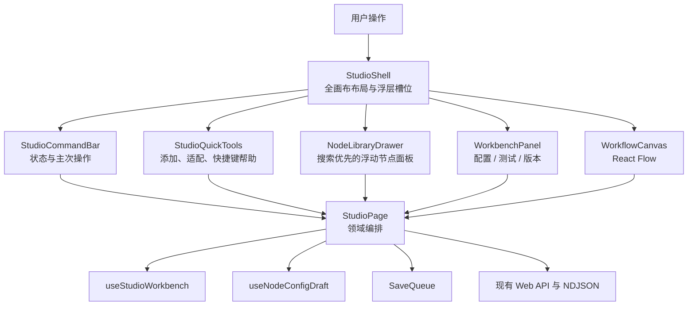

# Agent Studio 全画布 Studio 体验优化设计

**状态：** 已批准，待实施计划

**日期：** 2026-08-27

**基线：** `origin/main` @ `c0e5a04`（v0.4.0）

**设计分支：** `codex/studio-ux-design`

## 1. 背景

Agent Studio v0.4.0 已具备工作流画布、节点库、Schema 节点配置、本地配置草稿、动态端口预览、自动保存、测试运行、发布、版本治理和调试回放。核心能力已经形成闭环，但 Studio 仍存在三个体验问题：

1. 顶部工具栏承载过多同级操作，主路径不突出；
2. 节点库、画布和工作台虽然能够互斥运行，但视觉上仍像叠加的管理后台面板；
3. “添加节点 → 配置 → 试运行”需要多次切换和确认，未形成连续、明确的画布内任务流。

本阶段先优化 Studio，不同时改造工作流列表、运行记录、节点包目录和 Agent 使用页。整体视觉选择“专业创作台”，Studio 空间选择“全画布浮动面板”，交互面向新手与熟练用户之间的平衡型用户：核心操作保持可见，快捷键仅用于提速。

## 2. 目标与验收主线

首要目标是让用户在同一工作流路由内完成：

```text
添加节点 → 自动选中 → 配置 → 应用并试运行 → 查看流式结果
```

主线验收要求：

- 全程停留在 `/workflows/:id`，画布持续可见；
- 添加节点后自动打开其配置浮窗；
- 有效脏配置可通过“应用并试运行”一次完成应用、保存刷新和模式切换；
- 配置、保存、端口解析或运行失败时不丢草稿、不关闭浮层、不重置画布视口；
- 拖拽中只更新本地画布，拖拽结束后才提交最终位置；
- 鼠标用户不需要记忆快捷键，键盘用户可快速打开节点面板和关闭最上层浮窗。

## 3. 范围

### 3.1 本阶段交付

- 将 Studio 调整为全画布布局，顶部使用分级命令条，左侧保留可发现的快捷工具；
- 将节点库升级为搜索优先、可键盘选择的浮动节点面板；
- 将现有工作台调整为不挤压画布的浮动面板，并保持桌面、平板和手机响应式行为；
- 新节点放置到当前视口中心附近，添加后自动选中并打开配置；
- 增加“应用并试运行”连续动作；
- 统一连接无效、配置无效、端口解析失败、保存失败/冲突、运行失败/取消的原位反馈；
- 增加受输入焦点保护的快捷键和明确的焦点恢复；
- 优化节点拖拽持久化时机；
- 补齐单元、组件、页面集成和 E2E 回归。

### 3.2 明确不做

- 不修改 Go 后端、OpenAPI、数据库和工作流 JSON；
- 不引入新的全局状态库或大型 UI 组件库；
- 不重写 React Flow、`SaveQueue`、`useNodeConfigDraft` 或运行事件协议；
- 不在本阶段实现完整撤销/重做历史；
- 不改造工作流列表、运行记录、节点包目录和 Agent 使用页；
- 不承诺手机端复杂连线效率，手机端以查看和基础配置可用为目标。

## 4. 方案选择

### 4.1 选定方案：渐进式交互架构升级

保留现有领域状态和接口，在其上增加明确的 UI 编排层。该方案能够解决真实操作链路问题，同时把回归范围限制在前端 Studio。

### 4.2 未采用方案

- **仅做 CSS 和布局换皮：** 交付快，但无法解决操作状态分散、节点放置固定和连续试运行路径问题。
- **重写编辑器状态核心：** 可扩展性强，但会扩大保存、版本治理、草稿和运行链路的回归面，当前阶段收益不足。

## 5. 总体架构



边界约束：

- `StudioShell` 只负责布局、浮层层级、响应式和焦点恢复，不请求 API；
- `StudioPage` 继续拥有工作流、节点、连线、保存队列和运行请求，逐步减少直接布局 JSX；
- `useStudioWorkbench` 继续管理 `closed / config / test / versions` 及脏草稿切换保护；
- `useNodeConfigDraft` 继续管理单节点草稿、校验、端口预览和应用前状态；
- `SaveQueue` 仍是工作流持久化的唯一入口；
- React Flow 和现有 API 是稳定边界，不为本次视觉优化重新抽象。

## 6. 组件设计

### 6.1 `StudioShell`

提供画布、命令条、快捷工具、节点面板和工作台五个清晰槽位。桌面端所有工具悬浮在画布上方，不改变 React Flow 容器尺寸，也不触发 `fitView`。它负责：

- 判断并呈现最上层浮窗；
- Escape 只关闭最上层可关闭浮窗；
- 浮窗关闭后将焦点还给触发按钮或原画布节点；
- 桌面使用浮窗，平板使用底部面板，手机使用全屏面板；
- 归档和版本锁定状态只改变操作可用性，不改变组件结构。

### 6.2 `StudioCommandBar`

命令条将操作分为三层：

1. 工作流名称、返回入口和保存状态；
2. 高频主操作：试运行、发布；
3. 次级菜单：运行记录、Agent 页面设置、版本历史、导出模板。

错误或冲突状态在命令条持续可见。保存失败/冲突时暂停运行和发布，直到用户重试或刷新；成功提示不能覆盖未解决的错误。

### 6.3 `StudioQuickTools`

保持少而明确：

- 添加节点；
- 适配当前图；
- 快捷键帮助。

缩放继续使用 React Flow Controls，不重复建设。`Ctrl/Cmd + K` 打开节点面板；Escape 关闭最上层浮窗。快捷键监听在 `input`、`textarea`、`select`、可编辑元素或任何组合输入期间不得触发。

### 6.4 节点面板

保留 `NodeLibraryDrawer` 名称以降低迁移成本，但视觉和行为改为浮动节点面板：

- 打开后焦点进入搜索框；
- 搜索在已加载的 `definitions` 上本地执行；
- 上下键移动选项，回车添加，Escape 关闭；
- 分类和节点包摘要继续展示；
- 添加后关闭面板、放置节点、选中新节点并打开配置工作台。

### 6.5 浮动工作台

`WorkbenchPanel` 保持非模态 `dialog` 语义，不锁住焦点，以便用户在面板和画布间切换。桌面宽度仍允许 `320–480px` 调整并持久化偏好；平板为最高 `60vh` 的底部面板；手机占满可用区域。工作台复用现有配置、测试和版本内容，不创建第二套状态模型。

## 7. 核心操作与数据流

### 7.1 添加节点

1. 用户点击左侧“添加节点”或按 `Ctrl/Cmd + K`；
2. 节点面板打开并聚焦搜索框；
3. 用户点击或回车选择定义；
4. `WorkflowCanvas` 通过受限句柄返回当前可视区域中心的画布坐标；
5. `StudioPage` 使用该坐标创建节点并进入一次 `SaveQueue` 提交；
6. 节点面板关闭，新节点被选中，配置工作台打开并聚焦首个可配置字段。

若句柄暂不可用，使用确定性的画布中心回退坐标，不得继续采用随节点数量向下累加的位置。

### 7.2 配置与“应用并试运行”

字段仍写入 `useNodeConfigDraft` 本地草稿。用户发起试运行时：

- 草稿干净：直接 `flush()` 后切换测试工作台；
- 草稿有效且有改动：按钮明确显示“应用并试运行”，原子应用配置和端口，调用一次 `commit`，然后 `flush()` 并切换测试工作台；
- 草稿无效、解析中或解析失败：不切换模式，聚焦首个错误或失败区域；
- 应用或保存失败：保留配置工作台与草稿，不执行运行请求。

该连续动作只在用户明确点击试运行时发生，不把普通字段输入改为自动应用。

### 7.3 试运行

测试工作台继续使用开始节点 Schema 生成输入，并消费现有 NDJSON 事件。画布和工作台读取同一 `events` 数组：

- `node.started` 高亮当前节点；
- 完成、失败、跳过或取消使用文字和图形状态，不只依赖颜色；
- 运行完成后工作台显示输出和耗时；
- 失败保留失败节点、公开错误和重试入口；
- 取消请求不重置画布视口和已完成事件。

### 7.4 节点拖拽

React Flow 拖拽过程中的 `position` 变化只更新本地 `nodes`。只有 `dragging === false` 的最终位置变化才进入 `commit`，避免拖拽每一帧都向 `SaveQueue` 重复入队。添加、删除和替换仍按现有规则立即提交。

## 8. 错误、并发与焦点

| 场景 | 处理方式 |
|---|---|
| 连接类型或基数无效 | 不落图；在端口附近显示原因，并通过 `aria-live` 播报 |
| 配置无效 | 阻止应用和运行；显示摘要并聚焦首个错误；保留草稿 |
| 端口解析失败 | 工作台原位显示可重试状态；不关闭面板、不写入节点 |
| 保存失败或冲突 | 命令条持续展示错误；暂停运行和发布；提供重试或刷新入口 |
| 运行失败 | 测试工作台显示失败节点、公开错误和重试；保留视口与输入 |
| 运行取消 | 标记取消，保留已收到事件；AbortError 不显示为系统失败 |

异步端口解析和运行请求继续由各自拥有者管理 AbortController。延迟结果必须校验工作流、节点或请求身份，不能写入已经切换的上下文。

## 9. 响应式与视觉约束

- `>= 1024px`：全画布 + 右侧浮动工作台；
- `640–1023px`：全画布 + 底部工作台，最高 `60vh`；
- `< 640px`：工作台占满可用区域；关闭后恢复画布；
- 所有尺寸下禁止页面横向滚动；
- 视觉沿用现有暖色 Token，并将主操作统一为已有主色；
- 浮层层级、边界、阴影和焦点环使用语义 Token，不新增散落色值；
- `prefers-reduced-motion: reduce` 下关闭非必要位移和透明度过渡。

## 10. 文件影响

### 10.1 预计新增

| 文件 | 职责 |
|---|---|
| `apps/web/src/features/studio/StudioShell.tsx` | 全画布布局、浮层槽位、焦点恢复与响应式结构 |
| `apps/web/src/features/studio/StudioShell.test.tsx` | 壳层层级、Escape、焦点与响应式结构测试 |
| `apps/web/src/features/studio/StudioCommandBar.tsx` | 命令条主次操作和状态展示 |
| `apps/web/src/features/studio/StudioCommandBar.test.tsx` | 操作优先级、禁用和错误状态测试 |
| `apps/web/src/features/studio/StudioQuickTools.tsx` | 添加、适配、快捷键帮助 |
| `apps/web/src/features/studio/StudioQuickTools.test.tsx` | 工具行为与可访问名称测试 |
| `apps/web/src/features/studio/useStudioShortcuts.ts` | 输入焦点保护、命令快捷键和清理 |
| `apps/web/src/features/studio/useStudioShortcuts.test.ts` | 快捷键守卫与生命周期测试 |

### 10.2 预计修改

| 文件 | 变化 |
|---|---|
| `apps/web/src/features/studio/StudioPage.tsx` | 接入壳层，收敛工具栏 JSX，串联添加、应用并试运行和错误反馈 |
| `apps/web/src/features/studio/StudioPage.test.tsx` | 核心链路、异常状态与焦点集成回归 |
| `apps/web/src/features/studio/WorkflowCanvas.tsx` | 暴露视口中心与适配图能力；拖拽结束持久化接缝 |
| `apps/web/src/features/studio/WorkflowCanvas.test.tsx` | 视口坐标、最终拖拽提交和无效连接反馈 |
| `apps/web/src/features/studio/WorkbenchPanel.tsx` | 全画布浮窗、响应式面板与非模态焦点行为 |
| `apps/web/src/features/studio/WorkbenchPanel.test.tsx` | 调整宽度、Escape、焦点恢复和窄屏回归 |
| `apps/web/src/features/studio/NodeLibraryDrawer.tsx` | 搜索优先、键盘选择和浮动面板语义 |
| `apps/web/src/features/studio/NodeLibraryDrawer.test.tsx` | 搜索、键盘选择、关闭和添加回归 |
| `apps/web/src/features/studio/NodeConfigPanel.tsx` | 增加明确的“应用并试运行”动作入口 |
| `apps/web/src/features/studio/TestRunPanel.tsx` | 运行状态、失败/取消和重试反馈层级 |
| `apps/web/src/features/studio/useStudioWorkbench.ts` | 保持状态模型，补充连续动作和焦点返回意图 |
| `apps/web/src/features/studio/studio.css` | 全画布、命令条、浮动面板、响应式和 reduced-motion |
| `apps/web/e2e/agent-studio.spec.ts` | 画布内核心链路、脏草稿、失败和响应式 E2E |

实现时若某个新增组件没有形成独立职责或只有极薄的一次调用，应内联回最近的所有者，避免为文件拆分而拆分。

## 11. 测试策略

### 11.1 TDD 顺序

1. 先为壳层、命令条、快捷工具和快捷键写失败测试；
2. 再为节点视口放置和拖拽最终提交写失败测试；
3. 再为“应用并试运行”及失败保留上下文写页面测试；
4. 实现最小行为后补样式和响应式结构测试；
5. 最后扩展 E2E 主链路。

### 11.2 自动化验证

- `corepack pnpm@10.34.5 test`
- `corepack pnpm@10.34.5 lint`
- `corepack pnpm@10.34.5 typecheck`
- `corepack pnpm@10.34.5 build`
- `make verify`
- `make test-e2e`

`make verify` 和 `make test-e2e` 使用 Docker PostgreSQL；Go 相关命令必须保持 `CGO_ENABLED=0`。开发完成后先做代码审查，再执行全量回归并创建 PR。

### 11.3 E2E 场景

- 通过可见“添加节点”入口搜索并添加节点，配置浮窗自动打开；
- 修改配置后执行“应用并试运行”，确认没有中间确认弹窗且运行使用最新配置；
- 无效配置阻止运行并聚焦错误；
- 保存失败/冲突、端口解析失败和运行失败均保留当前上下文；
- 桌面、1024px 和 390px 宽度无页面横向滚动；
- 输入框聚焦时 `Ctrl/Cmd + K` 等全局快捷键不误触发；
- 现有发布、版本历史、导出、Agent 页面设置和调试回放回归全部通过。

## 12. 可行性与阻塞项审查

设计无阻塞性问题，依据如下：

- React Flow 实例已在 `WorkflowCanvas` 内保存，可通过窄接口暴露视口中心和适配图能力；
- `useNodeConfigDraft` 已提供 `normalized`、`preview`、`status` 和原子应用所需数据；
- `useStudioWorkbench` 已具备脏草稿延迟意图，可增量扩展而无需重写状态核心；
- `SaveQueue.flush()` 已用于试运行、发布和导出，可继续保证最新 revision；
- 测试运行已经消费 NDJSON 事件，可直接驱动画布节点状态；
- 现有 Playwright 已覆盖创建、配置、测试、发布和脏草稿保护，可在真实基线上扩展；
- 本阶段不依赖新增后端能力、数据库迁移或第三方组件。

需要在实现计划中控制的风险：

1. `StudioPage.tsx` 当前同时拥有较多领域处理器，拆分时必须保持行为等价，不能一次迁移全部状态；
2. 浮动面板不改变画布尺寸，因此需要单独验证遮挡、焦点和窄屏行为；
3. “应用并试运行”必须等待原子应用和 `SaveQueue.flush()` 成功，不能使用旧 revision；
4. 拖拽最终提交要区分 React Flow 的中间 `position` 变化与 `dragging === false` 结束事件。

上述风险均可通过现有接口和先测试后实现的分步计划控制，不需要扩大方案范围。
