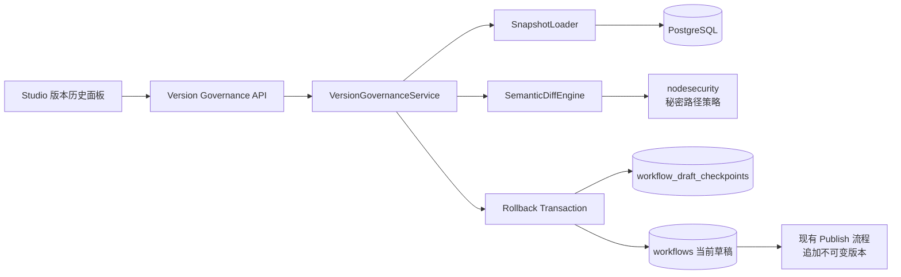

# Agent Studio v0.4-D 工作流版本治理设计

**日期：** 2026-08-27

**仓库：** `https://github.com/yyl1212/agent-studio`

**状态：** 设计已确认，等待实施计划

**目标版本：** v0.4-D

**设计分支：** `codex/v0.4-d-version-governance-api`

## 1. 背景

Agent Studio 已具备不可变发布版本、草稿修订号、调试回放、安全完整重试、运行管理和可恢复的 Agent 发布页。当前发布入口可以持续创建新版本，但 Studio 无法列出历史版本、比较版本差异，也不能把一个历史版本安全恢复为当前草稿。

这一缺口使发布闭环停在“只能向前发布”：用户无法在修改画布、开始参数或 Agent 页面配置后确认行为变化，也无法在不改写历史记录和线上 Agent 的前提下回到已知版本继续编辑。

本阶段建设工作流版本治理：统一加载草稿与发布版本快照，在服务端生成结构化语义差异，并将指定发布版本恢复为新的草稿修订。回滚前自动保存一个单级草稿检查点，允许用户在没有继续编辑时撤销回滚。

## 2. 目标与成功标准

### 2.1 目标

- 在 Studio 中分页查看一个工作流的历史发布版本。
- 支持当前草稿与任意发布版本比较，以及任意两个发布版本互比。
- 按节点、开始参数、连线、Agent 页面配置和画布布局展示结构化差异。
- 将指定发布版本的图和 Agent 页面配置恢复为当前工作流的新草稿修订。
- 回滚前保存当前草稿检查点，在草稿尚未继续修改时支持一次撤销。
- 保证秘密值、缺失节点定义和超大配置不会通过差异接口泄漏或放大响应。
- 保持发布版本、历史 Run 和线上 Agent 指针不可变。

### 2.2 成功标准

- 用户可完成 `v1 → v2 → 当前草稿` 三方选择与任意两方比较。
- 同一对快照多次比较产生顺序和内容一致的结果。
- 回滚只推进 `draft_revision`，不更新 `published_version_id`，也不修改 `workflow_versions`。
- 回滚与草稿保存、页面配置保存并发时，只有持有最新修订号的一方成功。
- 回滚成功后可以撤销；任意后续画布或 Agent 页面配置保存都会使撤销失效。
- 差异接口不会返回 Schema 标记、启发式识别或 HTTP 规则识别出的秘密值。
- 归档工作流允许查看版本和差异，但拒绝回滚与撤销。
- Docker PostgreSQL 集成测试、Go 全量测试、Web 单元测试、Playwright 黄金路径和发布门禁全部通过。

## 3. 明确不做

- 不直接切换 `published_version_id` 到历史版本。
- 不修改、删除或重写任何历史发布版本。
- 不创建新的工作流副本；复制仍使用现有复制功能。
- 不建设多级草稿历史、完整撤销栈或通用审计日志。
- 不比较运行输出、模型响应、节点执行耗时或历史 Run。
- 不提供原始 JSON diff 或下载差异补丁。
- 不实现版本分支、合并、协作评论或 Git 式提交模型。
- 不建设认证、多租户、独立 Worker、自动重试、本地 RAG 或第二批官方节点。
- 不在本规格中创建 `v0.4.0-rc.1` 标签或公开 Release；版本治理合并后另行设计发布收口。

## 4. 已确认的产品决策

| 议题 | 决策 |
|---|---|
| 回滚语义 | 恢复为当前工作流的新草稿修订，不自动发布 |
| 线上状态 | 不修改当前发布指针，不影响公开 Agent |
| 比较范围 | 草稿与任意版本、任意两个发布版本 |
| 展示形式 | 结构化语义差异，不提供原始 JSON 高级视图 |
| 秘密字段 | 只显示字段路径和“已变化”，不返回前后值 |
| 草稿保护 | 回滚前自动保存一个可恢复的单级检查点 |
| 交互形态 | 画布优先，复用 Studio 聚焦式单栏工作台 |
| 交付方式 | 后端 API 与 Studio UI 分成两个顺序 PR |

## 5. 总体架构



### 5.1 组件边界

`VersionGovernanceService` 是独立应用服务。它不执行节点、不调用模型，也不复用运行回放数据。现有 `workflow.Service` 继续负责创建、保存、校验、发布和 Agent manifest；版本治理服务只负责版本摘要、快照比较、回滚和撤销。

`SnapshotLoader` 把数据库中的草稿或发布版本转换为统一内部快照。`SemanticDiffEngine` 是不访问数据库的纯计算组件。PostgreSQL Store 负责列表查询和所有回滚事务一致性。`nodesecurity` 提供共享的秘密路径识别，供工作流模板安全检查和版本差异共同使用。

### 5.2 依赖装配

`apps/api/cmd/server/main.go` 使用现有 Store 和节点 Registry 创建版本治理服务，通过 `httpapi.Dependencies.VersionGovernance` 注入路由。HTTP 层定义独立的 `VersionGovernance` 接口，不扩大运行、调试或公开 Agent 接口。

## 6. 快照模型

### 6.1 快照引用

管理 API 使用两类快照引用：

```go
type WorkflowSnapshotKind string

const (
    WorkflowSnapshotDraft   WorkflowSnapshotKind = "draft"
    WorkflowSnapshotVersion WorkflowSnapshotKind = "version"
)

type WorkflowSnapshotRef struct {
    Kind          WorkflowSnapshotKind `json:"kind"`
    Version       *int                 `json:"version,omitempty"`
    DraftRevision *int64               `json:"draftRevision,omitempty"`
}
```

约束如下：

- `kind=draft` 时只能携带正整数 `draftRevision`。
- `kind=version` 时只能携带大于零的 `version`。
- 发布版本按 `(workflow_id, version)` 加载；其他工作流中的版本统一返回不存在。
- 草稿加载后必须与请求中的修订号完全一致，否则返回现有的修订冲突。

### 6.2 内部快照

内部 `WorkflowSnapshot` 包含：

- 描述符：工作流 ID、快照类型、版本号或草稿修订号、版本 ID、创建时间。
- `domain.Graph`。
- 发布版本持久化的 `input_schema`；草稿不持久化该字段。
- `domain.AgentPresentation`。

发布版本加载时执行下列一致性检查：

1. 图是单一合法 JSON 对象，`schemaVersion=1`。
2. 节点 ID 和连线 ID 不重复。
3. 图编码不超过现有 2 MiB JSON 请求预算，配置嵌套深度不超过 64。
4. 开始节点配置能够重新派生输入 Schema。
5. 重新派生的输入 Schema 与持久化 `input_schema` 规范化后相等。

输入 Schema 不一致的历史版本仍可出现在版本列表，但比较和回滚失败关闭为 `WORKFLOW_SNAPSHOT_UNSUPPORTED`。节点定义缺失的历史版本允许比较安全摘要；回滚还必须使用当前 Compiler 重新验证目标图，缺失或不兼容的节点类型会使回滚失败关闭。草稿允许暂时无法编译；只要图 JSON 能安全解析，仍可展示能够识别的差异。

## 7. 数据库与事务设计

### 7.1 新迁移

新增 `apps/api/migrations/000006_workflow_version_governance.sql`：

```sql
CREATE TABLE workflow_draft_checkpoints (
  workflow_id uuid PRIMARY KEY REFERENCES workflows(id) ON DELETE CASCADE,
  source_revision bigint NOT NULL CHECK (source_revision > 0),
  restored_revision bigint NOT NULL CHECK (restored_revision = source_revision + 1),
  graph jsonb NOT NULL CHECK (jsonb_typeof(graph) = 'object'),
  agent_presentation jsonb NOT NULL CHECK (jsonb_typeof(agent_presentation) = 'object'),
  restored_from_version_id uuid NOT NULL,
  created_at timestamptz NOT NULL DEFAULT now(),
  CONSTRAINT workflow_draft_checkpoints_version_fk
    FOREIGN KEY (workflow_id, restored_from_version_id)
    REFERENCES workflow_versions(workflow_id, id)
);
```

每个工作流最多保留一行。迁移只向前新增，不修改 `000001` 至 `000005`。

### 7.2 回滚事务

回滚请求携带目标版本号和 `expectedDraftRevision`。Store 在单个事务中：

1. `SELECT ... FROM workflows WHERE id=$1 FOR UPDATE`，先锁定工作流。
2. 校验工作流存在、未归档且修订号与请求一致。
3. 加载属于该工作流的目标发布版本，验证快照，并要求当前 Compiler 能完整编译目标图。
4. `INSERT ... ON CONFLICT (workflow_id) DO UPDATE`，用当前草稿图、页面配置和修订号替换旧检查点。
5. 将目标版本的 `graph` 和 `agent_presentation` 写入 `workflows`。
6. 把 `draft_revision` 精确增加一，保持 `published_version_id` 不变。
7. 提交后返回更新后的 `Workflow` 和检查点摘要。

锁顺序固定为工作流行后版本行读取。发布版本不可变，不需要对版本行加写锁。

### 7.3 检查点失效

下列操作必须在更新草稿的同一事务中删除检查点：

- `UpdateDraft` 成功保存画布图。
- `UpdateAgentPresentation` 成功保存 Agent 页面配置。

元数据重命名、查看、导出、测试运行和发布不会改变草稿内容，因此不删除检查点。归档暂时禁止撤销；恢复工作流后，只要修订号仍匹配，检查点仍可使用。

### 7.4 撤销事务

撤销请求携带 `expectedDraftRevision`。Store 在单个事务中：

1. 锁定工作流行。
2. 加载同一工作流的检查点。
3. 要求当前修订号同时等于请求值和检查点的 `restored_revision`。
4. 要求工作流未归档。
5. 恢复检查点保存的图和页面配置，将修订号再增加一。
6. 删除检查点并提交。

检查点不存在、已失效或修订号不匹配时返回 `ROLLBACK_UNDO_UNAVAILABLE`，不得猜测或覆盖当前草稿。

## 8. 版本列表与分页

`GET /api/workflows/{id}/versions` 返回：

```json
{
  "items": [
    {
      "id": "00000000-0000-4000-8000-000000000001",
      "version": 2,
      "current": true,
      "createdAt": "2026-08-27T10:00:00Z"
    }
  ],
  "nextCursor": null,
  "rollbackCheckpoint": {
    "sourceRevision": 18,
    "restoredRevision": 19,
    "restoredFromVersion": 1,
    "createdAt": "2026-08-27T10:05:00Z"
  }
}
```

- 默认 `limit=20`，允许范围为 1–100。
- 版本按 `version DESC` 排序。
- 游标是不透明、最大 512 字符的版本边界；非法游标返回 400。
- 摘要不返回图、输入 Schema 或页面配置。
- 只有当前修订号仍等于检查点 `restored_revision` 时才返回检查点摘要。
- 归档工作流允许读取列表。

## 9. 差异 API

### 9.1 请求

`POST /api/workflows/{id}/version-diffs`：

```json
{
  "base": {"kind": "version", "version": 1},
  "compare": {"kind": "draft", "draftRevision": 18}
}
```

请求使用严格 JSON 解码，不允许未知字段。两个引用可以相同；相同快照返回零差异。

### 9.2 响应

```json
{
  "base": {"kind": "version", "version": 1, "versionId": "00000000-0000-4000-8000-000000000001"},
  "compare": {"kind": "draft", "draftRevision": 18},
  "summary": {
    "total": 4,
    "nodes": 1,
    "startParameters": 1,
    "connections": 1,
    "agentPresentation": 1,
    "layout": 0
  },
  "truncated": false,
  "groups": {
    "nodes": [],
    "startParameters": [],
    "connections": [],
    "agentPresentation": [],
    "layout": []
  }
}
```

所有分组共享下列字段变化语义：

```json
{
  "path": "/config/token",
  "kind": "modified",
  "valueOmitted": "secret"
}
```

`kind` 只允许 `added`、`removed`、`modified`、`reordered`。`valueOmitted` 只允许 `secret`、`definition_unavailable`、`too_large`；省略值时 `before` 和 `after` 字段必须完全缺席，没有省略时不返回 `valueOmitted`。

### 9.3 响应预算

- 完整遍历后始终返回各分组和总变化数量。
- 详细差异按固定排序最多返回 500 条，超出时设置 `truncated=true`。
- 固定分组顺序为节点、开始参数、连线、Agent 页面、画布布局。
- 单个 `before` 或 `after` 规范 JSON 编码超过 4 KiB 时省略两侧值并标记 `too_large`。
- 差异接口设置 `Cache-Control: no-store`。

## 10. 语义比较规则

### 10.1 JSON 规范化

- 对象键顺序忽略。
- 缺失字段与显式 `null` 不相等。
- 普通数组顺序有意义。
- JSON 数字按数值比较，`1` 与 `1.0` 相等；编码时保留安全的规范十进制表示。
- 非法 JSON、超过深度预算的配置或多值 JSON 使对应快照失败关闭。

### 10.2 节点

- 顶层节点数组顺序忽略，按节点 ID 建立索引。
- 新增或删除节点产生一条节点级差异。
- 同一 ID 的类型或类型版本变化单独报告。
- 普通节点配置递归到叶子字段，路径使用 RFC 6901 JSON Pointer。
- 开始节点的 `fields` 从普通配置差异中排除，交给开始参数分组。
- 节点标题优先使用当前 Registry 中对应定义的标题；不可用时使用节点类型字符串。
- 节点定义缺失不阻止安全摘要比较，但阻止把该版本回滚为当前草稿。

### 10.3 开始参数

- 按字段 `key` 比较，不因数组位置改变误报删除和新增。
- 比较 `label`、`description`、`type`、`required`、`default`、`placeholder` 和 `options`。
- 字段顺序变化单独产生 `reordered` 差异。
- 重复或无效字段标识使草稿对应部分退化为安全摘要，不猜测字段对应关系。

### 10.4 连线

- 连线 ID 不参与语义比较。
- 使用 `(source, sourcePort, target, targetPort)` 作为稳定语义键。
- 重复语义连线按多重集合计数，避免静默合并异常历史数据。
- 新增和删除分别报告，不提供连线“修改”猜测。

### 10.5 Agent 页面配置

按固定字段比较：

- `title`
- `description`
- `accent`
- `submitLabel`
- `resultMode`

工作流名称、slug 和管理说明不属于发布版本快照，不进入差异或回滚。

### 10.6 画布布局

- 位置变化与运行逻辑变化分组展示。
- X/Y 坐标先四舍五入到 0.1 CSS 像素，再进行比较，过滤无意义的浮点抖动。
- 被新增或删除的节点不再重复产生布局差异。

## 11. 秘密与安全边界

### 11.1 共享秘密识别

新增 `apps/api/internal/nodesecurity`，从现有模板安全检查中抽取并复用：

- Schema `writeOnly`。
- `x-agent-studio-secret`。
- 本地 `$ref`，并检测引用环。
- `allOf`、`anyOf`、`oneOf`。
- 嵌套对象和数组 items。
- 敏感字段名启发式规则。
- HTTP Header 名和 URL 查询参数规则。

工作流模板继续生成原有稳定校验问题；重构不得改变已有错误码、路径和排序。

### 11.2 差异脱敏

- 两侧节点定义都可用时，取两侧秘密路径的并集。
- 任一路径位于秘密祖先下时，前后值均不返回。
- 任一侧节点定义不可用时，不返回该节点任何配置叶子值，只返回节点级配置变化并标记 `definition_unavailable`。
- 敏感路径名称可以展示，但值、默认值和包含秘密的父对象不得进入响应。
- 差异正文不持久化，不进入 slog 字段或访问日志。
- 管理接口不复用到 `/api/agents` 公开路由。

## 12. 回滚与发布语义

回滚只恢复：

- 发布版本的 `graph` 到 `workflows.draft_graph`。
- 发布版本的 `agent_presentation` 到 `workflows.agent_presentation`。

不恢复工作流名称、slug、管理说明、归档状态或当前发布指针。开始参数来自恢复图中的开始节点；下一次正常发布时重新派生 `input_schema` 并创建新的递增发布版本。

例如当前线上为 v2、草稿修订为 r18：

1. 用户选择恢复 v1。
2. 服务端保存 r18 内容为检查点。
3. v1 内容成为 r19 草稿。
4. 线上仍为 v2，已有运行仍绑定原版本。
5. 用户若发布 r19，产生 v3；不会重新使用版本号 v1。
6. 用户若撤销且没有编辑，检查点内容成为 r20 草稿，线上仍为 v2。

## 13. 稳定错误语义

| 场景 | HTTP | 错误码 | 客户端行为 |
|---|---:|---|---|
| 工作流不存在 | 404 | `NOT_FOUND` | 返回列表 |
| 版本不存在或属于其他工作流 | 404 | `WORKFLOW_VERSION_NOT_FOUND` | 保留面板并刷新版本列表 |
| 草稿修订号已变化 | 409 | `WORKFLOW_REVISION_CONFLICT` | 重新加载工作流和差异 |
| 归档工作流执行回滚或撤销 | 409 | `WORKFLOW_ARCHIVED` | 提示先恢复工作流 |
| 检查点不存在或已失效 | 409 | `ROLLBACK_UNDO_UNAVAILABLE` | 隐藏撤销入口并刷新 |
| 历史快照损坏或不受支持 | 422 | `WORKFLOW_SNAPSHOT_UNSUPPORTED` | 允许查看版本摘要，禁止比较和回滚 |
| 引用组合、游标或请求 JSON 非法 | 400 | `REQUEST_INVALID` | 显示安全通用消息 |

任何数据库、JSON、节点定义或 Schema 内部错误都不得原样返回。请求 ID 继续使用现有中间件生成和展示。

## 14. Studio 交互设计

### 14.1 入口和工作台

Studio 顶部新增“版本历史”按钮。`useStudioWorkbench` 新增 `versions` 模式和 `version-history` 意图，继续保证右侧只有一个聚焦工作台。

打开版本面板前：

1. 若节点配置有未应用内容，复用“应用、放弃、取消”保护。
2. 取消仍在运行的测试面板请求。
3. 等待 `SaveQueue.flush()` 完成。
4. 使用保存队列最新修订号加载版本和默认差异。

归档工作流仍可打开版本面板。

### 14.2 面板布局

- 版本按时间倒序排列，当前线上版本显示明确标记。
- 默认比较“当前发布版本 → 当前草稿”；未发布工作流只显示空版本状态，不允许构造无效比较。
- 选择历史版本后默认比较“所选版本 → 当前草稿”。
- 用户可把任一侧切换为另一个发布版本。
- 五个差异分组使用可折叠单栏，每组标题显示变化数量。
- 秘密、缺失定义、值过大和响应截断都有明确中文说明。
- “加载更多”使用版本游标，不替换已经加载的选择。

### 14.3 回滚确认

`RollbackDialog` 展示：

- 目标版本。
- 当前草稿修订号。
- 五组差异计数。
- “将自动保存一个回滚前检查点”的说明。
- “不会改变线上 Agent、历史版本和历史运行”的说明。

提交期间禁止重复提交、切换目标和关闭确认框。

### 14.4 应用回滚结果

成功后 Studio：

1. 采用服务端返回的 `Workflow`。
2. 在保存队列空闲状态调用 `adoptRevision` 接纳新修订号。
3. 使用现有节点定义重新解析历史图端口；不可用定义使用静态安全回退。
4. 一次性替换 React Flow 节点和连线。
5. 清除节点选择、配置草稿、旧校验问题、端口解析请求和运行事件。
6. 重新适配画布视口。
7. 保持版本面板打开，显示成功提示和“撤销回滚”。

网络响应丢失时客户端不自动重放。客户端重新加载工作流和版本列表；若修订号已经推进且检查点目标一致，显示“回滚已完成，状态已刷新”。

### 14.5 撤销与失效

- 撤销按钮仅在服务端返回有效检查点且当前修订号匹配时显示。
- 回滚后的首次画布或 Agent 页面本地修改会立即隐藏撤销按钮。
- 保存成功时服务端在同一事务删除检查点。
- 撤销成功后按回滚成功相同流程重新装载画布，并移除撤销入口。
- 撤销失败不会改变当前画布。

### 14.6 可访问性与响应式

- 复用 `WorkbenchPanel` 的 dialog 语义、键盘宽度调整和移动端全屏样式。
- 打开后焦点进入面板标题或首个版本选项。
- Escape 关闭后焦点返回“版本历史”按钮。
- 提交期间 Escape 不关闭确认框。
- 折叠分组使用原生 button 和 `aria-expanded`。
- 状态变化使用 `role=status`，错误使用 `role=alert`。
- 320–480 px 工作台宽度和 768/1024/1440 三档页面不得产生页面级横向滚动。

## 15. 文件变更地图

### 15.1 PR 1：后端与契约

| 文件 | 动作 | 职责 |
|---|---|---|
| `apps/api/migrations/000006_workflow_version_governance.sql` | 新增 | 单级草稿检查点表与约束 |
| `apps/api/internal/domain/version_governance.go` | 新增 | 版本摘要、快照引用、差异与检查点领域类型 |
| `apps/api/internal/domain/errors.go` | 修改 | 版本不存在、快照不支持与撤销不可用错误 |
| `apps/api/internal/nodesecurity/paths.go` | 新增 | 共享秘密路径识别 |
| `apps/api/internal/nodesecurity/paths_test.go` | 新增 | Schema、启发式和 HTTP 秘密规则 |
| `apps/api/internal/workflowtemplate/security.go` | 修改 | 复用 nodesecurity 并保持既有问题语义 |
| `apps/api/internal/workflow/version_governance.go` | 新增 | Store 端口及列表、比较、回滚和撤销应用服务 |
| `apps/api/internal/workflow/version_diff.go` | 新增 | 纯语义差异引擎 |
| `apps/api/internal/store/postgres/version_governance.go` | 新增 | 版本查询、快照加载和检查点事务 |
| `apps/api/internal/store/postgres/workflows.go` | 修改 | 普通草稿保存原子失效检查点 |
| `apps/api/internal/httpapi/version_governance.go` | 新增 | 严格管理 API Handler |
| `apps/api/internal/httpapi/router.go` | 修改 | 版本治理接口、依赖和路由 |
| `apps/api/internal/httpapi/errors.go` | 修改 | 稳定错误映射 |
| `apps/api/cmd/server/main.go` | 修改 | 服务装配 |
| `contracts/openapi.yaml` | 修改 | 四组接口和 Schema |
| `apps/web/src/lib/api/generated.ts` | 生成 | 与 OpenAPI 同步的前端类型，满足生成文件零漂移门禁 |
| `docs/workflow-versions.md` | 新增 | 中文版本比较、回滚和安全边界 |

### 15.2 PR 2：Studio UI

| 文件 | 动作 | 职责 |
|---|---|---|
| `apps/web/src/lib/api/client.ts` | 修改 | 版本列表、比较、回滚和撤销客户端 |
| `apps/web/src/features/studio/useVersionGovernance.ts` | 新增 | 版本列表、差异、回滚、撤销和请求取消状态机 |
| `apps/web/src/features/studio/VersionGovernancePanel.tsx` | 新增 | 版本选择、分页和操作状态 |
| `apps/web/src/features/studio/VersionDiffView.tsx` | 新增 | 五组结构化差异展示 |
| `apps/web/src/features/studio/RollbackDialog.tsx` | 新增 | 回滚确认和提交保护 |
| `apps/web/src/features/studio/hydrateWorkflowGraph.ts` | 新增 | 初始加载与回滚共用的动态图装载 |
| `apps/web/src/features/studio/useStudioWorkbench.ts` | 修改 | versions 模式和外部意图 |
| `apps/web/src/features/studio/WorkbenchPanel.tsx` | 修改 | 回滚模态期间禁止关闭 |
| `apps/web/src/features/studio/WorkflowCanvas.tsx` | 修改 | 回滚后重新适配画布视口 |
| `apps/web/src/features/studio/StudioPage.tsx` | 修改 | 入口、保存保护、画布替换和撤销失效 |
| `apps/web/src/features/studio/studio.css` | 修改 | 单栏差异、截断和响应式样式 |
| `apps/web/e2e/agent-studio.spec.ts` | 修改 | 版本治理黄金路径 |
| `README.md` | 修改 | 版本治理入口和使用边界 |

每个新增组件和服务都配套同目录单元测试；实施计划列出精确测试文件和步骤。

## 16. 测试设计

### 16.1 Go 单元测试

差异引擎覆盖：

- 对象键顺序、数组顺序、数值等价、缺失与 null。
- 节点新增、删除、类型和版本变化。
- 节点配置叶子路径与确定排序。
- 开始参数内容和字段顺序。
- 连线 ID 噪音、语义新增删除和重复连线。
- 页面配置和布局变化。
- Schema 秘密、敏感字段名、HTTP Header 和查询参数。
- 两侧 Schema 联合脱敏、缺失节点定义失败关闭。
- 4 KiB 单值省略、500 条详细差异截断和完整计数。
- 发布输入 Schema 不一致时拒绝快照。

### 16.2 PostgreSQL 集成测试

使用 Docker 中的 PostgreSQL：

- `000001` 至 `000006` 全量迁移和重复迁移。
- 版本倒序分页、当前发布标记和跨工作流隔离。
- 回滚事务同时保存检查点、替换图和页面配置、推进一次修订号。
- `published_version_id` 和历史版本保持不变。
- 同一旧修订号并发回滚只有一个成功。
- 回滚与普通草稿保存并发只有一个成功。
- 再次回滚覆盖为最新单级检查点。
- 普通画布或页面配置保存删除检查点。
- 撤销恢复原草稿、推进修订号并消费检查点。
- 编辑后、归档后、错误修订号和缺失检查点拒绝撤销。

### 16.3 HTTP 契约测试

- 四组路由、方法和成功响应。
- 严格 JSON、未知字段、非法 kind、非法版本、非法修订号和非法游标。
- 404、409、422 稳定错误映射。
- 差异响应无秘密字面值。
- 归档只读边界。
- `Cache-Control: no-store`。

### 16.4 Web 单元测试

- 默认比较、版本切换、分页和过期请求取消。
- 五组展示、截断、秘密和缺失定义提示。
- 脏节点配置保护和保存队列 flush。
- 回滚确认文案、提交禁用和失败保留画布。
- 回滚成功接纳修订号、替换画布和显示撤销。
- 本地编辑立即隐藏撤销。
- 归档工作流只读。
- Escape、焦点返回、折叠区域和 aria 状态。

### 16.5 Playwright 黄金路径

1. 创建工作流并发布 v1。
2. 修改节点、开始参数和 Agent 页面配置，发布 v2。
3. 再修改当前草稿。
4. 比较 v1、v2 和当前草稿。
5. 恢复 v1 为新草稿。
6. 验证公开 Agent 仍使用 v2。
7. 验证既有 Run 仍绑定原发布版本。
8. 撤销回滚并恢复回滚前草稿。
9. 再次回滚后编辑画布，验证撤销立即失效。
10. 在 1440、1024、768 三档宽度验证无页面级横向溢出和焦点行为。

### 16.6 全量门禁

所有 Go 命令显式使用 `CGO_ENABLED=0`：

```bash
make verify
make test-e2e
make verify-release
```

创建 PR 前还要检查生成文件无漂移、工作树干净，并完成 Critical/Important 代码审查。

## 17. 交付顺序

### 17.1 PR 1：版本治理后端

分支：`codex/v0.4-d-version-governance-api`

包含迁移、领域类型、共享秘密识别、差异引擎、Store、应用服务、HTTP API、OpenAPI、同步生成的前端类型和后端中文文档。该 PR 合并前不加入 Studio 入口。

### 17.2 PR 2：Studio 版本面板

PR 1 合并后，从最新 `main` 创建 `codex/v0.4-d-version-governance-ui`。包含生成客户端、Studio 交互、单元测试、Playwright 和 README。

### 17.3 v0.4 RC

两个版本治理 PR 合并并通过回归后，单独设计 `v0.4.0-rc.1` 发布收口。该阶段验证版本号、Release Notes、`000001` 至 `000006` 升级、备份恢复、四平台制品、校验和、SBOM 和公开 Pre-release。创建远端标签和公开 Release 必须再次获得用户明确授权。

## 18. 可行性与阻塞项审查

| 风险 | 设计内关闭方式 | 残余限制 |
|---|---|---|
| 回滚覆盖未发布草稿 | 原子保存单级检查点，确认后回滚；无编辑时可撤销 | 只保留最近一次检查点，不提供多级历史 |
| 回滚与自动保存并发 | 工作流行锁 + `expectedDraftRevision` | 失败方必须刷新后重试 |
| 线上 Agent 被历史回滚影响 | 回滚永不修改 `published_version_id` | 用户重新发布后才改变线上版本 |
| 历史 Run 语义漂移 | Run 继续绑定不可变版本 ID | 草稿测试 Run 本身仍绑定其原图快照 |
| 差异泄漏秘密 | 共享秘密路径识别、两侧路径并集、缺失定义失败关闭 | 非秘密业务文本仍按管理端权限展示 |
| 历史节点定义已删除 | 允许摘要，配置值全部省略 | 无法提供该节点的字段级配置差异 |
| 大配置导致响应膨胀 | 2 MiB 快照预算、4 KiB 单值预算、500 条详情上限 | 截断后需按摘要判断是否继续回滚 |
| 连线或节点数组重排产生噪音 | 节点按 ID、连线按语义键比较 | 节点 ID 被重新生成仍视为删除和新增 |
| 网络响应丢失导致重复回滚 | 修订号提供至多一次效果；客户端刷新检查点 | 不建设通用操作幂等日志 |
| 旧版本输入 Schema 与图不一致 | 加载时规范化复核，失败关闭 | 异常版本只能看摘要，不能比较或回滚 |
| 撤销覆盖回滚后的新编辑 | 普通草稿保存同事务删除检查点 | 本地尚未保存的编辑也会立即隐藏入口 |

复核结论：现有 `workflow_versions` 已保存完整图、输入 Schema 和 Agent 页面配置；草稿图与页面配置共用修订号；PostgreSQL 行锁、前向迁移和现有保存队列足以支持本设计。数据一致性、并发覆盖、秘密传播、响应预算、缺失节点定义和历史版本不可变性都有可测试的失败关闭边界，当前没有未缓解的 Critical 或 Important 阻塞项。
