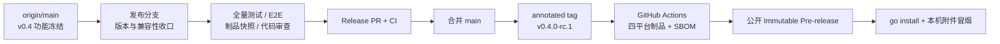

# Agent Studio v0.4.0-rc.1 发布收口设计

- **日期：** 2026-08-27
- **目标版本：** `v0.4.0-rc.1`
- **基线：** `origin/main` 提交 `79a7ab93ef83424a48272d49e46d9511608b114c`
- **发布形态：** GitHub Immutable Pre-release，附带 Linux/macOS amd64、arm64 CLI 归档、SHA-256 校验和逐归档 SPDX JSON SBOM

## 1. 背景与决策

`v0.3.1` 之后，`main` 已合入 v0.4 调试回放、Studio 聚焦工作台、工作流/运行管理、运行恢复、Agent 页面与工作流版本治理。Go SDK 同时新增公开的 `ExecutionSafety` 类型与 `Definition.ExecutionSafety` 可选字段，因此本次不能只更改 Runtime 标签：Go SDK 必须按 v1.0 前的 minor 规则升级到 `0.4.0`。

采用“协调式 v0.4 次版本发布”：

- Runtime 开发版本为 `0.4.0-dev`，Tag 构建显示精确的 `v0.4.0-rc.1`。
- Go SDK 为 `0.4.0`，Node API 保持 `agent-studio.dev/v1alpha1`。
- `ExecutionSafety` 是同一 Node API 内的可选、向后兼容字段；缺失或未知值保守视为 `side_effect`。
- 仓库自带扩展节点 manifest 的 Runtime 区间扩展为 `[v0.2.0, v0.5.0)`，使 v0.4 Runtime 不会拒绝自带 Echo、Retriever 和 Webhook。
- 第三方节点包仍按自身 manifest 判定兼容性；不会自动改写、下载或安装。

## 2. 目标与非目标

### 2.1 目标

1. 冻结当前 `main` 的 v0.4 产品与公共 SDK 契约。
2. 让版本常量、SDK 兼容说明、快照制品名称和 Release Notes 一致指向 `0.4.0` / `v0.4.0-rc.1`。
3. 在发布前通过 Go、Web、PostgreSQL 集成、Playwright E2E、GoReleaser 快照和 GitHub workflow 门禁。
4. 通过 annotated Tag 触发现有 Release workflow，自动公开不可变 Pre-release。
5. 公开后验证 Go Module 安装、当前 macOS 架构附件、checksum、版本输出、9 个远程附件和 immutable 状态。

### 2.2 非目标

- 不新增产品功能、节点类型、本地 RAG、用户与权限系统。
- 不改变 Node API Version，不删除公开 Go SDK 符号。
- 不提供 Windows 制品、容器镜像、安装器、代码签名或 macOS 公证。
- 不把 RC 描述为生产稳定版，不承诺 v1 兼容性。
- 不创建 `v0.4.0` GA Tag；GA 需要 RC 验证后的独立授权。

## 3. 架构与发布流

发布工作流继续使用现有三阶段：

1. **Build：** 确认 Tag 是指向 `main` HEAD 的 annotated Tag，执行 `make verify-quick`，构建四平台归档、SBOM 和 checksum。
2. **Smoke：** 在 Linux/macOS 的 amd64/arm64 runner 上下载同一批受测制品，验证归档、版本和提交号。
3. **Publish：** 先创建 Draft，上传并逐字节复核 9 个附件，再转为 `draft=false` / `prerelease=true`，最后确认 GitHub Immutable Release。

## 4. v0.4 RC 功能边界

Release Notes 必须覆盖以下累计能力：

- **调试回放与局部重跑：** 持久化事件时间线、历史冻结边、秘密脱敏、副作用分级和 fork/join 安全边界。
- **Studio 聚焦工作台：** 单栏上下文面板、节点配置本地草稿、显式应用、脏配置保护和响应式画布。
- **工作流与运行管理：** 分页、搜索、归档/恢复、运行详情、失败重试和安全错误展示。
- **运行恢复与协作取消：** 活动运行恢复、NDJSON 断线后继续、服务端终态收敛和跨请求取消。
- **Agent 页面：** 开始节点参数生成表单、发布版本固定、活动运行继续与无障碍结果展示。
- **工作流版本治理：** 版本分页、五组语义差异、恢复为草稿、撤销检查点、稳定快照与线上 Agent/历史运行隔离。

## 5. 数据库与升级边界

v0.4 相对 `v0.3.1` 增加 `000002_run_debug.sql` 至 `000006_workflow_version_governance.sql` 的迁移链。API 服务启动时使用现有 migration 机制顺序执行，就绪检查必须覆盖最新 migration。

升级前必须备份 PostgreSQL 数据库、`.env` 与本地模板/节点索引缓存。如需回退，必须停止写入，部署之前已验证的程序并恢复与该程序匹配的数据库备份；不声称 migration 可原地逆转。

## 6. 文件边界

| 文件 | 动作 | 责任 |
| --- | --- | --- |
| `sdk/go/agentnode/node.go` | 修改 | SDK 版本升级到 `0.4.0` |
| `sdk/go/agentnode/node_test.go` | 修改 | 固定 SDK 版本契约 |
| `internal/buildinfo/buildinfo.go` | 修改 | 源码开发版本升级到 `0.4.0-dev` |
| `internal/buildinfo/buildinfo_test.go` | 修改 | 固定 Runtime/SDK/API 三元版本 |
| `internal/releaseartifact/check.go` | 修改 | 制品版本冒烟从 `agentnode.Version` 读取 SDK 期望值，消除重复常量 |
| `internal/releaseartifact/check_test.go` | 修改 | 用当前 SDK 版本生成受测制品 fixture |
| `internal/generatedtest/golden_path_test.go` | 修改 | 将当前 Runtime 必须成功的 SDK 黄金路径 fixture 上限扩展到 `v0.5.0` |
| `internal/generatedtest/repository_release_contract_test.go` | 新增 | 验证仓库官方 manifest 与 v0.4 Runtime/SDK 的真实兼容性 |
| `agent-studio.node-package.json` | 修改 | 官方扩展 Runtime 上限扩展到 `v0.5.0` |
| `apps/web/e2e/fixtures/node-index/index.json` | 修改 | 将节点目录 E2E 的兼容包样例推进到 v0.4，并保留一个未来 Runtime 不兼容样例 |
| `.goreleaser.yaml` | 修改 | 快照版本升级到 `0.4.0-snapshot` |
| `.github/workflows/release.yml` | 修改 | workflow dispatch 快照制品升级到 `v0.4.0-snapshot` |
| `Makefile` | 修改 | 本地快照制品集合检查升级到 `v0.4.0-snapshot`，并将快照版本一致性脚本接入 `verify-workflows` |
| `scripts/check-release-version_test.sh` | 修改 | 锁定三处快照版本一致性 |
| `README.md` | 修改 | RC 安装、附件、主要能力和 SDK 版本入口 |
| `docs/sdk/compatibility.md` | 修改 | v0.4 SDK 增量、Node API 不变与节点包迁移说明 |
| `docs/releases/v0.4.0-rc.1.md` | 新增 | 中文 RC Release Notes，包含安装、升级、回滚、制品和限制 |
| `docs/superpowers/specs/2026-08-27-v0.4.0-rc.1-release-design.md` | 新增 | 本设计与发布治理边界 |
| `docs/superpowers/plans/2026-08-27-v0.4.0-rc.1-release.md` | 新增 | TDD、门禁、PR、Tag 和冒烟的逐步计划 |

不修改产品业务代码、OpenAPI、migration、依赖版本或 Release workflow 的发布语义。若门禁暴露与发布收口无关的产品缺陷，停止本分支发布，先以独立修复 PR 解决。

## 7. 验证矩阵

### 7.1 发布 PR 前

1. `CGO_ENABLED=0 make verify-quick`
2. `COMPOSE_PROJECT_NAME=agent_improve CGO_ENABLED=0 make verify`
3. `COMPOSE_PROJECT_NAME=agent_improve CGO_ENABLED=0 make test-e2e`
4. `COMPOSE_PROJECT_NAME=agent_improve CGO_ENABLED=0 make verify-release`
5. `CGO_ENABLED=0 go run ./cmd/agent-studio version` 必须显示 `0.4.0-dev` / SDK `0.4.0` / API `agent-studio.dev/v1alpha1`
6. `sh scripts/check-release-version_test.sh` 必须验证 GoReleaser、workflow 和 Makefile 的 `v0.4.0-snapshot` 一致性，且该脚本由 `verify-workflows` 自动执行。
7. 对版本、兼容范围、Release Notes 与 workflow 执行独立代码审查，Critical 和 Important 必须为 0。

### 7.2 PR 合并后、Tag 前

1. 拉取并确认 `main == origin/main == 已验证的合并提交`。
2. 确认工作树干净，本地/远程均不存在 `v0.4.0-rc.1` Tag，GitHub 不存在同名 Release。
3. `make release-preflight TAG=v0.4.0-rc.1` 必须通过，包括 SDK 版本、Release Notes、`origin/main` 一致性与 Immutable Releases 预检。
4. 创建指向该合并提交的 annotated Tag，Tag message 为 `Agent Studio v0.4.0-rc.1`，只推送该 Tag。

### 7.3 公开后

1. Release workflow 的 Build、4 个 Smoke 与 Publish 全部成功。
2. Release 为 `draft=false`、`prerelease=true`、`immutable=true`，且不得成为 Latest。
3. 远程附件精确为 4 份 CLI 归档、4 份 SPDX JSON SBOM 和 `checksums.txt`，共 9 份且字节非空。
4. 使用临时 `GOBIN` 执行 `CGO_ENABLED=0 go install github.com/yyl1212/agent-studio/cmd/agent-studio@v0.4.0-rc.1`，版本输出必须匹配 Tag。
5. 下载当前 macOS 架构归档和 `checksums.txt`，校验 SHA-256，解压后运行 `agent-studio version`，版本与提交必须匹配。

## 8. 风险、失败语义与无阻塞审查

| 风险 | 结果 | 防护 |
| --- | --- | --- |
| SDK 仍为 `0.3.1` | `check-version.sh` 拒绝 `v0.4.0-rc.1` | 在发布分支升级 SDK 及专项测试 |
| 官方 manifest 上限仍为 `v0.4.0` | v0.4 Runtime 拒绝自带扩展 | 扩展到 `v0.5.0`，并在 Release Notes 说明第三方包需独立声明 |
| 节点目录 E2E 缓存样例上限仍为 `v0.4.0` | v0.4 Runtime 下筛选结果变为 0，目录黄金路径失败 | 将可用样例扩展到 `v0.5.0`，未来样例推进到 `[v0.5.0, v0.6.0)`，保持一正一反语义 |
| 三处 snapshot 版本不一致 | 本地与 CI 制品名错乱 | `check-release-version_test.sh` 同时锁定 GoReleaser、workflow 和 Makefile |
| Tag 不指向 `main` HEAD | workflow 发布未审核提交 | 本地 preflight 和 workflow 双重拒绝 |
| Tag 已推送后 workflow 失败 | 不可修改原 RC | 保留 Tag 和失败记录，修复后使用 `v0.4.0-rc.2` |
| Draft 附件不完整 | 不安全的部分发布 | 公开前校验 9 份附件、远程重下载和逐字节比对 |
| migration 后直接降级 | 旧程序可能不理解新 schema | 必须先备份，回退时恢复匹配备份 |
| 当前 `main` 在 Tag 前变化 | RC 证据不再覆盖 Tag | 重新执行全部本地门禁和 preflight |

审查结论：远程不存在 `v0.4.0-rc.1` Tag/Release，Immutable Releases 已启用，现有 Release workflow 已在 `v0.3.1` 验证成功。当前硬阻塞仅为版本常量、snapshot 标识、Release Notes 和官方 manifest 兼容上限尚未收口，本设计均有明确文件、测试和门禁覆盖，无未解决的发布阻塞。

## 9. 授权边界

用户已明确要求“立即设计并执行 `v0.4.0-rc.1` 发布收口”，并批准本方案。本次授权覆盖发布 PR、通过门禁后合并到 `main`、创建并推送 annotated Tag `v0.4.0-rc.1`，以及允许现有 workflow 自动公开 Pre-release。不覆盖 `v0.4.0` GA Tag，也不允许移动、删除或覆盖任何已推送的 Tag/Release。
