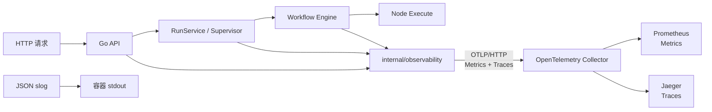
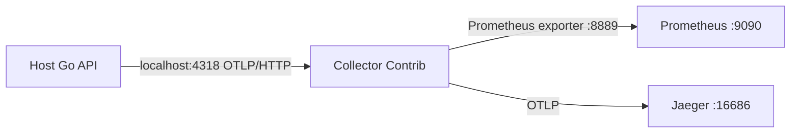

# Agent Studio v0.5-A 可观测性基线设计

**状态：** 已批准，实施计划已编制

**日期：** 2026-08-27

**基线：** `origin/main` @ `7923410`（节点库添加体验优化已合并）

**设计分支：** `codex/v0.5-a-observability-design`

## 1. 背景

Agent Studio 已具备低代码工作流画布、节点扩展 SDK、草稿测试、Agent 页面、运行管理、调试重放、版本治理和 PostgreSQL 运行恢复能力。随着系统从功能建设进入生产可靠性阶段，当前仅有 JSON stdout 日志，缺少统一的请求、运行和节点耗时指标，也无法跨 HTTP、RunService、Engine 和节点执行定位延迟与故障。

本阶段建立 `v0.5-A` 可观测性基线。选定方案为官方 Go OpenTelemetry SDK 加可选 OpenTelemetry Collector，通过 OTLP/HTTP 输出 Metrics 和 Traces；JSON 日志继续输出到容器 stdout。开发者可使用 Docker Compose 的 `observability` Profile 启动 Collector、Prometheus 和 Jaeger，但产品不新增内置监控页面。

设计坚持“无业务载荷遥测”：工作流输入输出、Prompt、节点配置、密钥、任意错误正文和 HTTP 查询参数均不得进入日志、指标或链路。可观测性是可选能力，未配置 OTLP Endpoint 时系统行为、性能路径和部署依赖保持兼容。

## 2. 目标与验收主线

核心数据链路为：

```text
HTTP 请求
  → 标准化 HTTP Span / Metrics
  → 同步 Run 子 Span，或异步 Run 根 Span + 请求 Span Link
  → Node 子 Span / Metrics
  → OTLP/HTTP → Collector → Prometheus / Jaeger

JSON 结构化日志 → stdout，并使用 requestId / traceId / spanId / runId / nodeId 关联
```

目标：

- 建立 HTTP、Workflow Run、Node、Agent 并发准入和 PostgreSQL 连接池的基础指标；
- 建立 HTTP、Run 和 Node 三层 Trace，并正确表达异步 Agent Run 与请求之间的 Link；
- 保留 JSON stdout 日志，并增加安全的 Trace 关联字段；
- 未配置 OTLP Endpoint 时使用 No-op Provider，不连接网络、不启动导出协程；
- Collector 临时不可达时不影响 HTTP 请求和工作流执行；
- 可选 Docker Profile 可快速启动外部观测栈，并能完成真实冒烟查询；
- 不修改节点 SDK、工作流图契约、HTTP API、数据库结构或前端页面。

## 3. 范围

### 3.1 本阶段交付

- Go OpenTelemetry Runtime 的初始化、资源属性、Provider、Exporter 和有界关闭；
- OTLP/HTTP Protobuf 的 Metrics 和 Traces 导出；
- HTTP、Run、Node、Agent Supervisor 和 PostgreSQL Pool 的埋点；
- 标准 JSON 日志关联与既有高风险日志字段治理；
- 配置解析、敏感配置保护和启动/运行时错误策略；
- Collector Contrib、Prometheus、Jaeger 的可选 Docker Compose Profile；
- Makefile 验证入口、中文运行手册和 README 快速入口；
- 单元测试、Collector 配置验证、端到端冒烟和完整回归。

### 3.2 明确不做

- 不建设 Agent Studio 内部监控、仪表盘或告警页面；
- 不通过 OTLP 输出日志；
- 不开发生产级 Prometheus、Jaeger 的高可用、长期存储、备份或认证；
- 不新增数据库表、迁移或遥测落库；
- 不记录 SQL、HTTP Body、工作流输入输出、Prompt、节点配置或任意错误正文；
- 不修改公开 Node SDK、节点包清单、工作流 JSON 或 OpenAPI；
- 不在首批实现复杂的应用侧动态采样和远程采样；
- 不同时开发本地 RAG 闭环。

## 4. 方案选择

### 4.1 选定方案：标准分层架构

使用官方 OpenTelemetry Go API/SDK，在 API 进程中创建 TraceProvider 和 MeterProvider，通过 OTLP/HTTP 发送到可选 Collector。Collector 负责后端适配：Metrics 由 Prometheus 抓取，Traces 发送给 Jaeger。

该方案的优点：

- 应用仅依赖开放标准和官方 SDK，不绑定具体观测厂商；
- Collector 可在开发、验收和生产环境承担协议转换、批处理和后端路由；
- 未启用时可彻底 No-op，符合轻量化要求；
- 未来接入 Grafana、Tempo、云厂商或企业平台时不需要改业务埋点。

### 4.2 未采用方案

- **第三方单容器全家桶：** 本地体验集中，但会把数据模型、存储和部署绑定到单一项目，升级边界较重。
- **自研 Metric/Span 抽象再做适配：** 可以减少业务包对 OTel API 的直接认识，但会重复实现上下文传播、Provider 生命周期和语义规范，首阶段复杂度过高。
- **应用直接向 Prometheus 暴露 `/metrics` 并直连 Jaeger：** 组件更少，但应用需要维护多个导出协议，生产后端切换和认证边界更差。

## 5. 总体架构



边界约束：

- `internal/observability` 只负责 OTel Runtime、Provider、资源属性、安全错误处理和关闭，不引用 workflow、engine 或 httpapi；
- HTTP、Workflow、Engine 和 PostgreSQL 在各自包内定义领域埋点，使用注入的 Provider，不依赖具体 Exporter；
- `main` 是初始化和关闭顺序的唯一装配点；
- 业务包接受 No-op Provider，测试和未启用环境不需要 Collector；
- 节点执行仍只接收现有 `context.Context` 和 `domain.NodeRequest`，不把遥测类型加入公开 Node SDK；
- Docker Profile 只用于本地开发、验收和故障排查，不声明为生产监控平台。

## 6. Runtime 与依赖边界

### 6.1 `internal/observability`

Runtime 对外提供：

- `TracerProvider()`；
- `MeterProvider()`；
- `Propagator()`，只返回 W3C Trace Context Propagator；
- 可选的上下文日志字段提取辅助函数，以及与 HTTP 框架解耦的 requestId Context 读写辅助；
- 幂等且受超时控制的 `Shutdown(context.Context)`。

启用模式创建：

- OTel Resource，包含 `service.name`、构建版本和允许的部署属性；
- OTLP/HTTP Trace Exporter 与 BatchSpanProcessor；
- OTLP/HTTP Metric Exporter 与 PeriodicReader；
- W3C Trace Context Propagator；不启用可携带任意字段的 Baggage；
- 有界、限频且不输出原始错误内容的 SDK ErrorHandler。

禁用模式返回官方 No-op Provider，不能创建 Exporter、网络连接或后台导出任务。业务包不通过全局变量判断是否启用。

### 6.2 Provider 注入

`main` 初始化 Runtime 后，把抽象 Provider 注入以下组件：

- `httpapi.Dependencies`：HTTP middleware；
- `workflow.RunService`：Run Span 和 Run Metrics；
- `workflow.AgentRunSupervisor`：准入、活跃运行、panic 和异步 Link；
- `engine.Options`：Node Span 和 Node Metrics；
- PostgreSQL Store：基于 `pgxpool.Stat()` 的异步 Observable Gauge。

注入值为 OTel API 接口，不传递 Exporter、Collector 地址或 SDK 配置。nil 或 No-op Provider 必须安全。

## 7. Trace 设计

### 7.1 HTTP Span

每个请求创建 Server Span：

- 名称：`HTTP <method> <route-template>`；
- 标准属性：HTTP method、Chi route pattern、response status code；
- 状态：5xx 或 panic 标记为 Error，描述只使用有限类别；
- 不记录原始 URL、Query、Header、Body、客户端 IP 或 User-Agent。

中间件顺序调整为：

```text
RequestID → Telemetry → Recover → AccessLog → CORS → Router
```

这样 recover 和 access log 均收到带 Span 的 Context。路由模板在下游处理完成后从 Chi RouteContext 读取；未匹配路由统一使用 `unmatched`，不得回退到原始 path。

### 7.2 Run Span

Run Span 名称固定为 `workflow.run`，属性包括：

- `agent_studio.run.id`；
- `agent_studio.run.mode`；
- 最终状态；
- 安全错误类别；
- 对重试或局部重跑记录来源 run/node ID，但不伪造成 Trace Parent。

同步草稿测试和同步管理操作直接以请求 Span 为 Parent。异步 Agent Run 可能比 HTTP 请求存活更久，因此必须：

1. 在启动 goroutine 前只复制有效 SpanContext 和 requestId；
2. 丢弃 HTTP Request Context、业务值和取消信号；
3. 从 Supervisor 的进程级 Context 启动新的 Run 根 Span；
4. 使用 `trace.Link` 关联原请求 Span；
5. Supervisor 关闭继续通过现有进程 Context 取消运行。

这个瞬态 Origin 不持久化到数据库，也不进入工作流图或公开 API。

### 7.3 Node Span

Node Span 在 `engine.executeNode` 的唯一执行入口创建，名称固定为 `workflow.node`，Parent 为 Run Span。属性包括：

- node ID；
- 注册表中的 node type；
- node type version；
- execution safety；
- 最终状态。

节点 goroutine 继续使用引擎传入的 `runContext`，因此上下文传播不需要修改节点接口。节点错误不得调用会写入原始 exception message 的 `RecordError(err)`；只设置安全状态码和有限错误类别。

### 7.4 Trace 状态和错误类别

允许的错误类别为有限集合，例如：

```text
validation | conflict | capacity | cancelled | timeout |
node_execution | persistence | panic | internal
```

不得把 `err.Error()`、第三方响应正文、SQL、节点错误 Details 或 panic value 写入 Span Event、Status Description 或 Attribute。

## 8. Metric 设计

所有 Duration 使用秒 `s`，Count 使用无单位整数。具体 Bucket 在实施计划中根据现有 HTTP 和 Workflow Timeout 选择固定边界。

| Metric | 类型 | 允许标签 |
|---|---|---|
| `agent_studio.http.server.requests` | Counter | method、route、status_class |
| `agent_studio.http.server.duration` | Histogram | method、route、status_class |
| `agent_studio.http.server.active_requests` | UpDownCounter | method |
| `agent_studio.workflow.runs` | Counter | mode、status |
| `agent_studio.workflow.run.duration` | Histogram | mode、status |
| `agent_studio.workflow.run.active` | UpDownCounter | mode |
| `agent_studio.workflow.node.executions` | Counter | node_type、status、execution_safety |
| `agent_studio.workflow.node.duration` | Histogram | node_type、status、execution_safety |
| `agent_studio.workflow.node.failures` | Counter | node_type、execution_safety、error_category |
| `agent_studio.agent_run.admissions` | Counter | result |
| `agent_studio.agent_run.active` | UpDownCounter | 无 |
| `agent_studio.postgres.pool.connections` | ObservableGauge | state |
| `agent_studio.runtime.events` | Counter | component、reason |

标签约束：

- `route` 只使用注册路由模板；
- `status_class` 只允许 `2xx`、`3xx`、`4xx`、`5xx`；
- `mode`、`status`、`execution_safety`、`result` 和 `reason` 使用代码内有限枚举；
- `node_type` 只来自当前进程注册表，禁止附加版本；
- PostgreSQL `state` 只允许 `max`、`acquired`、`idle`；
- requestId、runId、nodeId、workflowId、slug、错误码和错误正文禁止成为 Metric Label。

所有计数和活跃值必须通过 defer 或统一完成路径保持平衡，panic、取消和超时路径纳入测试。

## 9. JSON 日志关联与治理

JSON 日志继续由 `slog.JSONHandler(os.Stdout)` 输出，不送入 OTLP。带 Context 的调用在值存在时追加：

- `requestId`；
- `traceId`；
- `spanId`；
- `run_id`；
- `node_id`。

空字段必须省略，避免产生误导性的全零 ID。ID 只用于关联，不进入消息正文。

本阶段同时整改核对中发现的既有高风险字段：

- HTTP access log 的原始 `path` 改为 `route` 模板；
- Node execution log 移除 `error_details` 和原始错误链，仅保留安全类别；
- Supervisor panic log 移除 panic value，只记录 `panic` 类别；
- 新增 OTel 初始化和导出错误不得回显 Endpoint、Header、证书路径或底层错误正文。

数据库协调器和启动路径的日志调用同步做字段审计。若底层错误可能包含连接串、SQL 或外部响应内容，则只输出有限类别；完整诊断仍通过内部错误传播和测试完成，不以牺牲数据边界换取日志细节。

## 10. 配置设计

### 10.1 基础环境变量

```dotenv
# 留空表示完全禁用遥测导出
OTEL_EXPORTER_OTLP_ENDPOINT=
OTEL_SERVICE_NAME=agent-studio-api
OTEL_RESOURCE_ATTRIBUTES=deployment.environment=local
OTEL_EXPORTER_OTLP_TIMEOUT=5000
OTEL_EXPORTER_OTLP_COMPRESSION=gzip
OTEL_METRIC_EXPORT_INTERVAL=10000
```

高级 TLS/认证继续使用标准 OTel 环境变量，例如 Headers 和 Certificate；只能通过环境变量注入，不进入配置文件、命令参数或日志。

不新增 `OBSERVABILITY_ENABLED`。`OTEL_EXPORTER_OTLP_ENDPOINT` 是唯一启用开关：

- 未设置或空字符串：No-op；
- 非空且语法合法：启用 Metrics 和 Traces；
- scheme、host、compression、timeout 或 interval 非法：启动失败；
- endpoint 带 userinfo、query 或 fragment：拒绝，避免凭据混入地址；
- endpoint 语法合法但目标暂时不可达：允许启动，运行时异步重试且不影响业务。

`OTEL_RESOURCE_ATTRIBUTES` 只用于部署和服务资源属性，不从业务数据动态构造。实现必须限制单项长度和总数量，文档明确禁止放入租户、用户、工作流或密钥信息。

### 10.2 协议

- 只支持 OTLP/HTTP Protobuf；
- 通用 Endpoint 由 SDK 按 Signal 追加标准路径；
- Compression 只允许 `gzip` 或 `none`；
- 首阶段启用后使用全量应用侧采集，但 Batch Processor 和 Metric Reader 队列有界；
- 生产环境可在 Collector 中配置 Tail Sampling，但不能依赖它降低应用到 Collector 的出口流量。

如生产流量证明全量应用侧 Trace 不可接受，后续阶段再引入标准 `OTEL_TRACES_SAMPLER` 治理，不在本阶段自研动态采样。

## 11. 启动、故障和关闭语义

### 11.1 启动顺序

```text
加载 Config
  → 校验 OTel 配置
  → 创建 Observability Runtime 或 No-op Runtime
  → 打开并迁移 PostgreSQL
  → 构造 Registry / Engine / Services / Router
  → 启动 Coordinator 和 HTTP Server
```

配置语法和本地 SDK 初始化错误阻止启动。远端 Collector 可达性不在启动时同步探测，避免把可选观测后端变成业务可用性的硬依赖。

### 11.2 运行时导出失败

- Batch Exporter 在后台执行，不占用请求和节点执行返回路径；
- 队列有界，满载时允许丢弃遥测，不允许无限增长内存；
- SDK 错误通过限频处理器输出安全类别，禁止每次失败刷屏；
- 导出失败不得改变 HTTP 状态、Run 状态、节点结果或数据库提交；
- 提供 drop/export failure 的进程内安全计数或限频日志，但不能递归经同一失败 Exporter 导出。

### 11.3 关闭顺序

现有业务关闭顺序保持：停止接收 Agent Run、停止 Coordinator、关闭 HTTP、等待活跃 Agent Run。完成后使用独立的最长 5 秒 Context 调用 Observability Runtime Shutdown：

- 关闭调用幂等，最多执行一次；
- Flush 超时记录安全类别后退出，不无限等待；
- 启动中途失败也通过 defer 关闭已经创建的 Provider；
- No-op Runtime 立即返回。

## 12. Docker Compose `observability` Profile



新增服务全部声明：

```yaml
profiles: [observability]
```

端口只绑定到 localhost：

| 端口 | 用途 |
|---|---|
| `127.0.0.1:4318` | Collector OTLP/HTTP Receiver |
| `127.0.0.1:13133` | Collector Health Check |
| `127.0.0.1:9090` | Prometheus UI/API |
| `127.0.0.1:16686` | Jaeger UI/API |

Collector 使用 Contrib Distribution 并锁定不可漂移的版本，配置包含：

- OTLP HTTP Receiver；
- `memory_limiter` → `batch` Processor 顺序；
- Prometheus Metric Exporter；
- Jaeger OTLP Trace Exporter；
- Health Check Extension；
- 不配置 Logs Pipeline；
- 不挂载 Docker Socket、宿主机根目录或 PostgreSQL 数据卷。

Prometheus 只抓取 Collector 的 `:8889`，Jaeger 只接收 Collector 转发的 Trace。Profile 启停不能隐式启动、停止或删除 `db` 服务和 `agent_pg_data`。

Makefile 新增：

- `observability-up`：只启动并等待 Collector、Prometheus、Jaeger；
- `observability-down`：只停止这三个服务，不执行全局 `docker compose down`；
- `observability-verify`：验证 Compose 展开、Collector 配置、健康状态和最小查询。

生产部署应把 API 的 OTLP Endpoint 指向企业自有 Collector，并由部署平台负责 TLS、认证、保留周期、HA 和告警。

## 13. 数据安全与基数预算

### 13.1 禁止字段

下列数据不得进入任何日志、Span、Span Event、Metric、Resource Attribute 或 Collector Label：

- workflow input/output；
- prompt、LLM message 和模型返回正文；
- node config、HTTP node body/header 和第三方响应；
- secret、token、API key、数据库连接串和 OTLP header；
- SQL、原始 URL/query、任意 `err.Error()` 和 panic value；
- 用户提供的自由文本或第三方 NodeError details。

### 13.2 允许的标识符

requestId、traceId、spanId、runId、nodeId、workflowId 和来源重跑 ID 只允许出现在 Trace/Log 的关联字段。Metric 中全部禁止。

### 13.3 自动化防线

测试构造唯一哨兵字符串并注入：工作流输入、节点配置、错误 details、HTTP query、OTLP header 和 panic value。完成请求、同步运行、异步运行、失败和关闭后，断言：

- JSON 日志不包含哨兵；
- In-memory Span 不包含哨兵；
- Metric Attribute 不包含哨兵；
- Collector/Prometheus/Jaeger 冒烟查询结果不包含哨兵。

同时为每个 Metric 建立允许标签白名单测试，新增未知 Label 必须显式修改测试和设计。

## 14. 测试与验收

### 14.1 单元测试

- Config 默认值、合法值和非法值；
- Endpoint 为空时不创建网络导出组件；
- Endpoint/headers/certificate 不进入错误或日志；
- In-memory Trace Exporter 验证 HTTP → 同步 Run → Node 父子关系；
- 异步 Agent Run 是新 Root，并且包含且只包含原请求 Span Link；
- Retry、局部重跑只记录来源属性，不伪造 Parent；
- Metric 名称、类型、单位和标签白名单；
- active 指标在成功、失败、取消、超时和 panic 后回到零；
- PostgreSQL pool callback 正确映射 max/acquired/idle；
- Exporter 运行时失败不改变 RunResult；
- Shutdown 幂等、只调用一次且受 5 秒边界控制；
- 日志关联字段和敏感哨兵缺失断言。

### 14.2 配置与集成测试

- `docker compose --profile observability config`；
- 使用锁定 Collector 镜像执行 `otelcol validate`；
- 验证 Collector 实际包含所需 receiver、processor、exporter 和 extension；
- 启动 Profile 后检查三个服务健康状态；
- 启动本地 API，执行一次成功 Run 和一次失败 Run；
- Prometheus 查询目标 Metric，Jaeger 查询 HTTP/Run/Node Trace；
- 停止 Collector 后再次运行工作流，确认业务结果不受影响；
- Profile stop 后确认 PostgreSQL 仍在运行且数据卷保留。

### 14.3 回归门禁

```bash
CGO_ENABLED=0 make verify
CGO_ENABLED=0 make test-sdk-e2e
make test-e2e
make observability-verify
```

代码完成后必须进行独立代码审查，Critical 和 Important 问题清零后才能创建或批准 PR。

## 15. 文件影响

### 15.1 预计新增

| 文件 | 职责 |
|---|---|
| `apps/api/internal/observability/runtime.go` | Runtime、Provider、Exporter 和关闭生命周期 |
| `apps/api/internal/observability/logging.go` | Context 关联字段与安全错误类别辅助 |
| `apps/api/internal/observability/runtime_test.go` | No-op、导出、失败和关闭测试 |
| `apps/api/internal/observability/logging_test.go` | 日志关联与哨兵数据测试 |
| `apps/api/internal/httpapi/telemetry.go` | HTTP Span、Metric 和路由模板语义 |
| `apps/api/internal/workflow/telemetry.go` | Run、Supervisor 和协调器领域埋点 |
| `apps/api/internal/engine/telemetry.go` | Node Span、Metric 和安全状态映射 |
| `apps/api/internal/store/postgres/metrics.go` | `pgxpool.Stat()` Observable Gauge |
| `apps/api/internal/store/postgres/metrics_test.go` | 连接池 Metric 映射测试 |
| `deploy/observability/otel-collector.yaml` | Collector Pipeline |
| `deploy/observability/prometheus.yaml` | Prometheus 抓取配置 |
| `scripts/check-observability-compose.sh` | Compose 和 Collector 静态配置契约检查 |
| `scripts/wait-observability.sh` | 从宿主机等待 Collector、Prometheus、Jaeger 就绪 |
| `scripts/verify-observability.sh` | API、Prometheus、Jaeger 的本地端到端冒烟 |
| `docs/observability.md` | 中文启用、查询、排障和生产边界文档 |

### 15.2 预计修改

| 文件 | 变更 |
|---|---|
| `go.mod`、`go.sum` | 固定 OTel API、SDK 和 OTLP/HTTP Exporter 依赖 |
| `apps/api/internal/config/config.go` | OTel 配置解析和验证 |
| `apps/api/internal/config/config_test.go` | 配置边界测试 |
| `apps/api/cmd/server/main.go` | Runtime 装配和关闭 |
| `apps/api/cmd/server/main_test.go` | 初始化和关闭顺序测试 |
| `apps/api/internal/httpapi/middleware.go` | 接入 HTTP Telemetry 和路由模板日志 |
| `apps/api/internal/httpapi/router.go` | Provider 注入和 middleware 顺序 |
| `apps/api/internal/httpapi/router_test.go` | HTTP 遥测和无载荷测试 |
| `apps/api/internal/workflow/run_service.go` | 接入 Run Telemetry、错误日志治理 |
| `apps/api/internal/workflow/run_service_test.go` | Run 遥测测试 |
| `apps/api/internal/workflow/agent_run_supervisor.go` | 异步 Origin、Span Link、准入和 panic Metric |
| `apps/api/internal/workflow/agent_run_supervisor_test.go` | 异步和容量测试 |
| `apps/api/internal/workflow/run_management.go`、`run_management_test.go` | 把 retry 来源 ID 放入瞬态 PreparedRun |
| `apps/api/internal/workflow/debug_rerun.go`、`debug_rerun_test.go` | 把局部重跑来源 ID 放入瞬态 PreparedRun |
| `apps/api/internal/workflow/run_coordinator.go` | 协调器日志字段审计 |
| `apps/api/internal/workflow/run_coordinator_test.go` | 安全日志测试 |
| `apps/api/internal/engine/engine.go` | Provider 注入和 Run Context 传播 |
| `apps/api/internal/engine/plan.go`、`compiler.go` | 在编译计划中缓存低基数 execution safety |
| `apps/api/internal/engine/scheduler.go` | 在唯一执行入口接入 Node Telemetry |
| `apps/api/internal/engine/engine_test.go`、`scheduler_test.go` | Node 遥测和并发平衡测试 |
| `compose.yaml` | 可选 observability Profile 和 localhost 端口 |
| `Makefile` | Profile 启停和验证命令 |
| `.env.example` | OTel 示例配置，默认禁用 |
| `README.md` | 可观测性快速入口 |
| `.github/workflows/ci.yml` | Compose/Collector 配置验证门禁 |

文件列表是实施边界。实施计划可在同一职责内拆分测试文件，但不得借机修改前端、OpenAPI、SDK、迁移或工作流业务契约。

## 16. 实施阶段

### A1：Runtime 与配置

先以测试驱动完成 Config、No-op Runtime、OTLP/HTTP Provider、资源属性、SDK ErrorHandler 和幂等 Shutdown。此阶段不埋业务 Span。

### A2：HTTP 与日志

增加 HTTP middleware、路由模板和日志关联；完成所有既有日志调用点的数据边界审计。

### A3：Run、Node、Supervisor 与 PostgreSQL

按 Context 传播顺序实现同步 Parent、异步 Link、Node 子 Span、低基数 Metric 和 pool gauge。每个组件单独提交并验证。

### A4：Docker、文档与 CI

锁定镜像、配置 Collector Pipeline，补齐 Makefile、中文手册和 CI 配置验证。

### A5：全量回归与 PR

运行完整门禁和真实 Docker 冒烟，执行独立代码审查，修订 Critical/Important 问题，再推送分支并创建 PR。

## 17. 可行性与阻塞项审查

| 审查项 | 现状证据 | 处理结论 | 状态 |
|---|---|---|---|
| HTTP Context | Chi middleware 已统一接入 Router | 在 RequestID 后注入 Telemetry | 无阻塞 |
| Run Context | `RunService.Execute` 已接收 `context.Context` | 同步 Parent 可直接传播 | 无阻塞 |
| 异步生命周期 | Supervisor 使用进程级 Context，当前不保留 Request Context | 启动前复制 SpanContext，以新 Root + Link 表达 | 无阻塞 |
| Node Context | `executeNode` 是唯一 Executor 入口并接收 runContext | 不改 Node SDK 即可创建子 Span | 无阻塞 |
| PostgreSQL 统计 | Store 基于 pgxpool | 使用 `pgxpool.Stat()` Observable Gauge | 无阻塞 |
| 路由基数 | 当前 access log 使用原始 path | 下游完成后读取 Chi RoutePattern，禁止回退 path | 无阻塞 |
| 数据安全 | Node log 存在 `error_details`，panic log 存在原值 | 本阶段显式删除并以哨兵测试守护 | 无阻塞 |
| 可选依赖 | 当前启动路径无 OTel | Endpoint 为空创建 No-op，Collector 不成为 readiness 依赖 | 无阻塞 |
| Collector 组件 | 需要 memory limiter、Prometheus 和 OTLP exporter | 使用并锁定 Collector Contrib，CI 执行 validate/components 验证 | 无阻塞 |
| 关闭预算 | 业务关闭已有 10 秒 Context | 业务关闭后单独提供最长 5 秒遥测 Flush | 无阻塞 |
| 应用侧采样 | 首阶段启用后全量采集可能增加出口流量 | Endpoint 默认关闭、队列有界、生产容量责任写入文档，采样治理列入后续 | 已接受风险 |
| 前端基线 | 首次全量测试出现 1 次既有画布渲染时序失败 | 单测、整文件和 281 项全量复跑均通过；不纳入本功能修改 | 已记录非阻塞 |

最终审查结论：设计不存在未解决的架构、接口、数据、安全或部署阻塞项，可以进入详细实施计划。开发必须从本设计边界出发；若实施发现需要修改公开契约、数据库或前端，必须暂停并重新审查方案。

## 18. 参考资料

- [OpenTelemetry Go Exporters](https://opentelemetry.io/docs/languages/go/exporters/)
- [OpenTelemetry Collector Configuration](https://opentelemetry.io/docs/collector/configuration/)
- [OpenTelemetry Collector Docker Installation](https://opentelemetry.io/docs/collector/install/docker/)

官方资料确认 Go 支持 OTLP/HTTP Trace 和 Metric Exporter；Go Logs Exporter 仍为实验能力，因此本阶段继续使用 JSON stdout 日志。Collector 的 receiver、processor、exporter、connector 和 service pipeline 模型与本设计一致。
