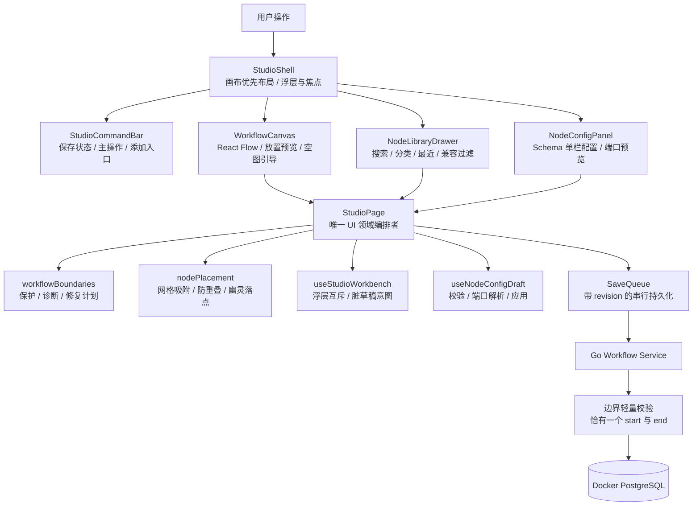

# Agent Studio v0.5-B 画布核心体验设计

**状态：** 已批准，实施计划已编制

**日期：** 2026-08-28

**基线：** `origin/main` @ `c888c43`（v0.5-A 可观测性已合并）

**设计分支：** `codex/v0.5-b-canvas-ux-design`

## 1. 背景

Agent Studio 已具备 React Flow 工作流画布、节点库、Schema 驱动配置、动态端口预览、自动保存、试运行、发布、版本治理和调试回放。当前主要问题已经从“功能缺失”转为“核心编辑体验不够可信、清晰和顺滑”：

1. 开始、结束节点在前端仍可能被普通删除操作移除，后端草稿保存也未阻止缺失或重复边界；
2. 节点添加虽然已有搜索、分类、最近使用、点击与拖放，但入口和落点反馈仍显简陋；
3. 画布缺少明确的编辑层级、空图引导和专业节点视觉；
4. 节点配置虽然已具备 Schema 表单与端口预览，但信息层级、状态表达和高风险变更确认不足。

本阶段选择“渐进式完整体验纵切”：保留现有领域状态、React Flow、SchemaForm、工作台和保存队列，在稳定边界上补齐工作流不变量与画布体验，不重写编辑器内核。

## 2. 目标与成功标准

核心操作链路为：

```text
创建工作流
  → 自动拥有唯一开始/结束节点
  → 从统一节点库发现节点
  → 预览落点并放置
  → 在聚焦式单栏配置中完成设置
  → 连接、保存并试运行
```

成功标准：

- 新建工作流始终包含且仅包含一个开始节点和一个结束节点；
- 普通 UI 操作不能删除、剪切、复制或重复创建边界节点，边界节点仍可移动和配置；
- 旧草稿缺失或重复边界时不静默改图，用户可预览并明确确认修复；
- 添加按钮、`Ctrl/Cmd + K`、卡片点击、卡片拖放和连线末端添加复用同一节点目录与创建逻辑；
- 节点卡片、空画布、选中态、错误态和运行态具有清晰且一致的视觉语言；
- 配置面板优先展示必填项，高级可选项按需展开，并能明确表达校验、端口解析和保存状态；
- 可能使连线失效的端口变更必须二次确认，不能静默删除连线；
- 桌面、平板和手机均无页面级横向滚动，键盘和触摸用户存在完整操作退路；
- 不引入数据库迁移、新 API、新全局状态库或新拖拽依赖。

## 3. 范围

### 3.1 本阶段交付

- 工作流边界节点的不变量、前端操作保护和旧草稿修复；
- 画布命令条、空图引导、节点视觉及选择/错误/运行反馈；
- 统一节点库、放置预览和连线末端兼容节点选择；
- 聚焦式单栏节点配置、渐进披露、状态栏和高风险端口变更确认；
- 响应式、键盘、焦点、触摸目标和 reduced-motion 适配；
- Go 单元测试、前端纯逻辑/组件/集成测试和 Playwright 主链路回归；
- 中文使用文档和画布编辑说明。

### 3.2 明确不做

- 不开发本地 RAG 闭环；
- 不修改工作流 JSON、节点定义、节点包清单和 OpenAPI 契约；
- 不增加数据库表或迁移；
- 不重写 React Flow、`SaveQueue`、`useStudioWorkbench` 或 `useNodeConfigDraft`；
- 不引入新的全局状态库、拖拽框架或大型 UI 组件库；
- 不实现多人协作、RBAC、自动布局、无限撤销历史或编辑器插件系统；
- 不在本阶段重做版本治理、调试回放、运行记录和 Agent 使用页；
- 备份/恢复顺延到画布体验阶段之后。

## 4. 方案选择与架构

### 4.1 选定方案

采用现有架构上的渐进式纵向改造：后端只在草稿保存边界增加轻量不变量校验；前端以纯函数统一保护、诊断和修复边界节点；画布、节点库和配置面板继续由 `StudioPage` 编排，并通过现有保存队列持久化。

未采用以下方案：

- **只改 CSS：** 无法解决可删除边界、旧草稿损坏和端口破坏性变更问题；
- **重写画布编辑器：** 会扩大保存、版本、运行和调试链路回归面，当前收益不足；
- **让后端完整编译每次草稿：** 会使尚未连完或暂时无效的普通草稿无法保存，破坏低代码编辑过程；
- **加载时自动补齐边界：** 会产生未经用户确认的图变更，并掩盖历史数据问题。

### 4.2 总体架构



架构边界：

- Go 服务只保证持久化草稿具有唯一开始/结束节点，不要求草稿已经连通或可发布；
- `workflowBoundaries` 只做可测试的节点分类、操作过滤、诊断和修复计划计算，不渲染 UI；
- `WorkflowCanvas` 只表达画布交互并上报意图，不直接保存数据；
- `NodeLibraryDrawer` 只负责发现和选择定义，不直接创建节点；
- `NodeConfigPanel` 只管理当前节点的配置交互，不直接改写全图；
- `StudioPage` 是创建、删除、修复、配置应用和提交保存的唯一编排者；
- `SaveQueue` 继续是前端草稿持久化的唯一入口。

## 5. 工作流边界节点不变量

### 5.1 新建与后端保存

现有 `workflow.Service.Create` 已生成一个 `start@1` 和一个 `end@1`，默认坐标分别为 `(120, 180)` 与 `(520, 180)`，两者初始不连线。本阶段保留该行为并增加回归测试。

`SaveDraft` 在写入 PostgreSQL 前执行独立的轻量校验：

- `start` 数量不等于 1 时返回 `ValidationError`，issue code 为 `WORKFLOW_START_COUNT`；
- `end` 数量不等于 1 时返回 `ValidationError`，issue code 为 `WORKFLOW_END_COUNT`；
- issue 的 `path` 统一为 `nodes`，不绑定某个 node ID 或 edge ID；两项同时不满足时按 start、end 的稳定顺序一次返回两条 issue；
- 沿用 HTTP 422、`WORKFLOW_INVALID` 和现有 `issues` 响应结构；
- 不调用完整 compiler，不阻止未连线、缺少普通节点配置或暂时存在其他编译问题的草稿保存。

这道后端防线覆盖旧前端、并发请求和手工 API 调用；前端保护负责让正常操作不会先进入失败状态。

### 5.2 前端操作保护

边界节点的判定以节点数据中的领域类型 `start` / `end` 为准，不依赖显示名称、节点 ID 或画布组件类型。正常编辑时：

- 可选择、移动、查看和配置；
- 不可删除、剪切、复制、粘贴生成副本或重复创建；
- 不出现在节点库、搜索结果、最近使用和连线末端添加目录中；
- 单选边界节点时隐藏或禁用删除类操作，并展示“工作流唯一节点，不可删除”；
- 混合选择执行删除或剪切时，仅作用于普通节点和显式选中的连线，并通过一次非阻塞提示说明已跳过边界节点；
- 键盘 `Delete` / `Backspace`、画布 `onDelete`、批量操作和未来的菜单入口都经过同一个纯函数过滤器；
- 删除普通节点时仍删除其关联连线，既有行为保持不变。

边界保护不依赖 CSS 或按钮禁用作为唯一防线；`StudioPage` 在写入图状态和进入保存队列前再次过滤。

### 5.3 旧草稿诊断与修复

加载草稿后先计算边界诊断：`healthy`、`missing-start`、`missing-end`、`missing-both`、`duplicate-start`、`duplicate-end` 或组合问题。只要不是 `healthy`：

- 画布进入受保护只读状态，但仍可平移、缩放和检查节点；
- 顶部持续展示修复横幅，不用短暂 toast 代替；
- 禁止测试、发布和普通保存，避免覆盖历史证据；
- 不在加载、渲染或刷新时自动修改图。

修复分为两类：

1. **缺失边界：** 展示将新增的类型和安全坐标预览；确认后添加不连线的边界节点。安全坐标从现有边界的相对方向或当前图包围盒外侧计算，并复用防重叠网格算法。
2. **重复边界：** 对每一类重复节点列出 ID、当前位置和关联连线数量，用户必须明确选择保留哪一个。确认页列出将移除的其他边界节点及其关联连线；不自动重连。只有用户二次确认后才执行删除。

缺失与重复可在一次修复事务中组合处理。前端先生成不可变的 repair plan 和完整目标图，将目标图一次送入 `SaveQueue` 并立即 `flush()`；修复属于非乐观写入，只有保存成功后才一次替换页面中的 nodes/edges 并解除只读。失败或 revision 冲突时页面继续显示原始图和修复对话框，提供重试或刷新，不显示虚假成功。取消修复不改变任何图数据。

## 6. 画布与节点添加体验

### 6.1 画布优先布局

Studio 延续聚焦式单栏：画布占据主视区，顶部为紧凑命令条，左侧节点库仅在需要时展开，右侧配置面板只聚焦当前节点。浮层打开和关闭不能改变 React Flow 容器尺寸、触发隐式 `fitView` 或重置用户视口。

命令条分为三层信息：

- 工作流名称、返回入口和持久可见的保存状态；
- 高频主操作：添加节点、试运行、发布；
- 次级操作：适配画布、运行记录、版本、Agent 页面和更多设置。

新建工作流只显示未连接的开始/结束节点。两者之间展示虚线空图引导“在这里添加第一个节点”，点击后打开节点库；添加首个普通节点或存在任意普通节点后引导消失。虚线仅是交互提示，不写入 workflow edges。

### 6.2 统一节点库

顶部“添加节点”、`Ctrl/Cmd + K`、空图引导、拖拽和连线末端添加共享同一目录模型：

- 搜索覆盖标题、描述、类型、分类、包名和包显示名；
- 支持全部、最近和现有分类；
- 最近使用继续存放浏览器 `localStorage`，读取或写入失败不阻止添加；
- 卡片展示自制类别图标、标题、两行用途说明、类型/版本、包信息和端口摘要；
- 开始/结束节点在模型层被过滤，而不是只在界面层隐藏；
- 空结果提供清除搜索或切换分类动作。

连线从输出端口拖到空白处时，节点库以该连接作为上下文打开，只显示至少存在一个兼容输入端口的节点。选择后在释放点附近创建节点，并把连线连接到确定的兼容端口；若候选节点存在多个同优先级兼容端口，则先让用户选择端口，不猜测。取消、定义失效或没有兼容端口时不改变图。

### 6.3 放置预览

点击节点卡片不立即写图，而是进入轻量幽灵节点预览：

- 默认落点为当前视口中心附近的最近空闲网格；
- 鼠标移动时预览吸附到 20px 网格并避开完全覆盖已有节点的位置；
- 点击确认放置，`Escape` 取消；
- 卡片拖放直接使用释放点，但复用相同的坐标转换、吸附、防重叠和创建函数；
- 连线末端添加以释放点为首选落点并自动建立已确认的连线；
- 归档、版本锁定或边界异常时不进入预览状态；
- 预览、取消或无效释放均不更新最近使用、不写图、不触发保存。

创建成功后只更新一次图、只入队一次保存、更新一次最近使用，随后选中新节点并打开配置面板。保存失败时节点保留为本地待保存状态，命令条持续显示错误；用户可重试或刷新，不把失败伪装成完成。

## 7. 节点视觉系统

节点卡片采用“结构化专业卡片”，不以大面积分类色区分：

- 中性卡片主体，类别色只用于顶部细条或自制图标；
- 头部显示图标、标题和 `type@version`；
- 中部显示简短用途或关键配置摘要；
- 底部显示输入/输出端口摘要及健康、运行或只读状态；
- 端口在悬停、键盘聚焦或连线时显示名称与数据类型；
- 开始/结束节点展示锁标记和“工作流唯一”说明；
- 选中、配置错误、运行中、成功、失败和只读状态同时使用边框、图标与文字，不只依赖颜色；
- 节点错误可直接打开对应配置错误，运行状态可进入现有调试入口；
- 视觉素材使用 CSS 和项目内自制 SVG/图标原语，不引入外部图片或有版权风险的素材。

节点尺寸保持稳定，长标题和摘要使用省略与可访问名称，状态变化不得造成明显布局跳动。连接柄的可点击/触摸区域至少 44px，但视觉圆点可保持紧凑。

## 8. 聚焦式单栏节点配置

### 8.1 信息层级

右侧配置面板保持单栏，不为 LLM、Webhook 等节点编写专用 React 表单。内容从上到下为：

1. 固定头部：图标、标题、类型、版本、节点 ID、关闭按钮和状态；
2. 错误摘要：出现校验错误时集中展示，并可聚焦首个错误字段；
3. 必填配置：直接展开；
4. 可选/高级配置：默认折叠，存在值或错误时自动展开相应分组；
5. 端口变化预览：新增、移除和受影响连线；
6. 固定底部操作：重置、应用、应用并试运行。

继续使用节点定义 Schema 中已有的 `title`、`description`、`required`、`x-ui-order`、`x-ui-widget` 和 `x-ui-placeholder`。没有配置字段的节点展示“此节点无需配置”，而不是空白面板。

### 8.2 配置状态

配置头部统一表达以下状态：

- `idle`：与已应用配置一致；
- `dirty`：存在尚未应用的本地修改；
- `resolving`：正在解析动态端口；
- `ready`：配置有效且端口预览已就绪；
- `error`：字段校验或端口解析失败。

状态变化通过文字、图标和 `aria-live` 表达。端口解析采用现有请求身份与取消机制，延迟响应不得覆盖已经切换的节点。

### 8.3 应用与高风险确认

- 字段无效时阻止应用，错误摘要聚焦首个字段并保留草稿；
- 端口解析失败时保留草稿和面板，提供重试；
- 如果配置变化只新增端口或不影响现有连线，可正常应用；
- 如果移除端口会使现有连线失效，第一次点击应用只打开二次确认；
- 确认框列出受影响端口、连线和节点，不静默删除连线；
- 用户确认后应用新配置，并将失效连线保留为红色虚线和明确错误，直至用户手工修复；
- 存在失效连线时禁止试运行和发布，但允许继续编辑与保存草稿；
- 取消确认回到原配置草稿，不改变节点或连线；
- “应用并试运行”必须先完成配置应用、修复失效连线并成功 `flush()`，否则保持配置面板打开且不发起运行。

用户切换节点、关闭面板或打开其他工作台时，继续沿用现有“应用 / 放弃 / 取消”脏草稿意图，避免静默丢失输入。

## 9. 持久化、并发与异常语义

| 场景 | 行为 |
|---|---|
| 正常拖动节点 | 拖动过程中只更新本地位置，结束时提交一次 |
| 删除包含边界的混合选择 | 跳过边界，仅删除普通节点/显式连线，并提示一次 |
| 旧客户端删除或复制边界 | 后端以 422 `WORKFLOW_INVALID` 拒绝，返回 count issue |
| 边界修复保存失败 | 保留修复前图和确认上下文，提供重试/刷新 |
| revision 冲突 | 暂停后续保存、测试和发布，要求刷新或按现有冲突流程处理 |
| 最近使用存储失败 | 降级为空最近列表，不阻塞节点添加 |
| 节点定义在选择后失效 | 不创建节点，保留节点库并提示重新选择 |
| 配置解析失败 | 保留草稿，原位显示重试，不更新图 |
| 端口变化使连线失效 | 明确确认后保留失效连线，不静默删除；阻止运行/发布 |
| 工作流归档或版本锁定 | 保持只读浏览，不开放添加、修复或配置写入 |

`SaveQueue` 继续按 revision 串行提交。所有创建、删除、边界修复和配置应用都必须先生成完整的下一图，再进行一次本地状态更新和一次 enqueue，不能分别保存 nodes 与 edges。后端边界校验发生在数据库更新前，校验失败不增加 revision。

## 10. 响应式、键盘与可访问性

- `>= 1024px`：画布为主，左侧临时节点库，右侧宽度受控的配置面板；
- `640–1023px`：节点库与配置使用底部面板，画布保持可见；
- `< 640px`：节点库全宽单列，配置使用全屏单栏，关闭后恢复画布；
- 在 390px、768px 和 1440px 视口下不得出现页面级横向滚动；
- `Ctrl/Cmd + K` 打开节点库，且在输入框、可编辑元素和输入法组合期间不误触发；
- `Delete` / `Backspace` 删除普通选择并跳过边界节点；
- `Escape` 按“确认框 → 放置预览 → 节点库/配置面板”的顶层顺序关闭；
- 浮层关闭后焦点返回触发按钮或原画布节点；
- 画布节点、卡片、按钮、端口和折叠标题具有可见焦点环与稳定 Tab 顺序；
- 主要交互目标至少 44×44px；
- 拖放永远有点击放置退路，颜色永远不是唯一状态信号；
- `prefers-reduced-motion: reduce` 下关闭非必要动画和位移过渡。

## 11. 文件影响

### 11.1 预计新增

| 文件 | 职责 |
|---|---|
| `apps/api/internal/workflow/boundaries.go` | 草稿边界数量的轻量校验 |
| `apps/api/internal/workflow/boundaries_test.go` | 缺失、重复、组合问题和合法草稿测试 |
| `apps/web/src/features/studio/workflowBoundaries.ts` | 边界判定、操作过滤、诊断与 repair plan 纯逻辑 |
| `apps/web/src/features/studio/workflowBoundaries.test.ts` | 保护、缺失/重复诊断和确定性修复测试 |
| `apps/web/src/features/studio/BoundaryRepairBanner.tsx` | 旧草稿修复入口、预览与确认 UI |
| `apps/web/src/features/studio/BoundaryRepairBanner.test.tsx` | 缺失、重复、取消、确认和焦点测试 |
| `apps/web/src/features/studio/CanvasEmptyGuide.tsx` | 开始/结束之间的非持久化空图引导 |
| `apps/web/src/features/studio/CanvasEmptyGuide.test.tsx` | 显示条件与添加入口测试 |
| `apps/web/src/features/studio/NodeIcon.tsx` | 项目内自制的节点类别图标原语 |
| `apps/web/src/features/studio/PortChangeConfirmation.tsx` | 破坏性端口变化的二次确认 |

实现时允许把仅在单一组件中使用的简单视图留在原文件，避免为了文件数量机械拆分；领域纯逻辑必须保持独立可测。

### 11.2 预计修改

| 文件 | 变化 |
|---|---|
| `apps/api/internal/workflow/service.go` | `SaveDraft` 写库前调用边界轻量校验 |
| `apps/api/internal/workflow/service_test.go` | 新建边界与草稿保存 422 领域错误回归 |
| `apps/api/internal/httpapi/router_test.go` | 验证现有 `WORKFLOW_INVALID` 映射承载边界 issues |
| `apps/web/src/features/studio/StudioPage.tsx` | 统一删除保护、修复、放置预览、连接末端添加和配置应用编排 |
| `apps/web/src/features/studio/StudioPage.test.tsx` | 边界、单次保存、异常、工作台和集成回归 |
| `apps/web/src/features/studio/WorkflowCanvas.tsx` | 受保护删除、幽灵节点、空图引导与连接末端意图 |
| `apps/web/src/features/studio/WorkflowCanvas.test.tsx` | 键盘/批量删除、预览、只读和连接末端测试 |
| `apps/web/src/features/studio/GenericNode.tsx` | 结构化卡片、状态、锁标记和端口标签 |
| `apps/web/src/features/studio/GenericNode.test.tsx` | 视觉语义与可访问状态测试 |
| `apps/web/src/features/studio/NodeLibraryDrawer.tsx` | 丰富卡片、上下文过滤与选择模式 |
| `apps/web/src/features/studio/NodeLibraryDrawer.test.tsx` | 搜索、最近、过滤、键盘、拖放与降级测试 |
| `apps/web/src/features/studio/nodeLibraryModel.ts` | 统一入口模型、边界过滤和端口兼容筛选 |
| `apps/web/src/features/studio/nodeLibraryModel.test.ts` | 目录和兼容性纯逻辑回归 |
| `apps/web/src/features/studio/nodePlacement.ts` | 放置预览、连接释放点和安全边界坐标 |
| `apps/web/src/features/studio/nodePlacement.test.ts` | 网格、碰撞、预览取消和修复位置测试 |
| `apps/web/src/features/studio/NodeConfigPanel.tsx` | 固定头尾、状态、渐进披露、空配置和确认入口 |
| `apps/web/src/features/studio/NodeConfigPanel.test.tsx` | 状态、错误、空配置、端口确认和操作测试 |
| `apps/web/src/features/studio/configDraft.ts` | 高风险端口变化分类和失效边标记 |
| `apps/web/src/features/studio/configDraft.test.ts` | 端口增删和受影响连线测试 |
| `apps/web/src/components/schema-form/SchemaForm.tsx` | 必填/可选分组、错误展开与聚焦细化 |
| `apps/web/src/components/schema-form/Field.tsx` | 字段描述、必填语义和可访问关联 |
| `apps/web/src/features/studio/StudioCommandBar.tsx` | 紧凑层级、修复/保存状态和主要添加入口 |
| `apps/web/src/features/studio/StudioShell.tsx` | 桌面/平板/手机浮层形态和焦点恢复 |
| `apps/web/src/features/studio/studio.css` | 画布、卡片、面板、状态、触摸目标和响应式样式 |
| `apps/web/e2e/agent-studio.spec.ts` | 新建、添加、配置、边界保护、修复和响应式主链路 |
| `docs/frontend-workbench.md` | 中文画布编辑、快捷键与异常恢复说明 |

不修改 `contracts/openapi.yaml`、数据库迁移、节点 SDK、节点包协议或本地 RAG 相关代码。

## 12. 测试与交付策略

### 12.1 TDD 顺序

1. 先为 Go 边界校验写失败测试，再接入 `SaveDraft`；
2. 为 `workflowBoundaries` 写边界保护、诊断和修复计划失败测试；
3. 扩展画布与页面测试，证明所有删除入口都跳过边界且只保存一次；
4. 为节点库兼容过滤和放置预览写纯逻辑与组件测试；
5. 为结构化节点卡片写状态与可访问性测试；
6. 为配置渐进披露和端口二次确认写测试，再修改 SchemaForm 与面板；
7. 最后实现样式，并用 Playwright 覆盖桌面、键盘和窄屏主链路。

### 12.2 分批 PR

**PR 1：不变量与画布骨架**

- 后端草稿边界校验；
- 前端边界操作保护、异常诊断与显式修复；
- 空图引导、紧凑命令条和画布优先布局；
- 对应单元、组件和 E2E 回归。

**PR 2：节点发现与呈现**

- 统一节点库上下文；
- 幽灵落点预览和连线末端兼容添加；
- 结构化节点卡片、端口标签与状态视觉；
- 对应纯逻辑、组件和 E2E 回归。

**PR 3：配置体验与收口**

- 聚焦式单栏配置与渐进披露；
- 高风险端口变化确认；
- 响应式、键盘、可访问性和中文文档；
- 全量回归、代码审查和发布准备。

仓库当前默认分支为 `main`。每个 PR 都先拉取最新 `origin/main`，再新建 `codex/` 分支，以测试先行方式开发。代码完成后先进行代码审查并修复问题，再运行回归、通过 git 创建 PR；不在产品开发分支直接推送主分支。

### 12.3 验证命令

```bash
CGO_ENABLED=0 go test ./apps/api/internal/workflow/... ./apps/api/internal/httpapi/...
corepack pnpm@10.34.5 --filter @agent-studio/web test
corepack pnpm@10.34.5 --filter @agent-studio/web typecheck
corepack pnpm@10.34.5 --filter @agent-studio/web build
CGO_ENABLED=0 make verify
CGO_ENABLED=0 make test-e2e
```

涉及 PostgreSQL 的集成与 E2E 回归使用项目 Docker PostgreSQL，不切换为本地裸 PostgreSQL。

## 13. 可行性审查

### 13.1 已确认条件

- 新建工作流已经由后端生成开始/结束节点，不需要迁移或新 API；
- HTTP 层已将 `workflow.ValidationError` 映射为 422 `WORKFLOW_INVALID` 并透传 issues；
- compiler 已使用 `WORKFLOW_START_COUNT` 与 `WORKFLOW_END_COUNT`，轻量校验可复用同一错误语义；
- `SchemaForm` 已支持 required/optional、错误摘要、顺序和控件提示，可增量改善；
- `configDraft` 已能计算新增/移除端口和失效连线，确认流程可建立在现有预览上；
- `NodeLibraryDrawer`、`nodeLibraryModel`、`nodePlacement`、`StudioShell`、`StudioCommandBar`、`WorkbenchPanel` 和保存队列均已存在，不需要重复建设；
- 基线 `CGO_ENABLED=0 make verify-quick` 已通过：Go 测试/vet、49 个前端测试文件的 281 个测试和生产构建均成功；现有 Vite 大包告警不阻塞本阶段，且本方案不增加依赖。

### 13.2 风险与消解

| 风险 | 消解措施 |
|---|---|
| 完整编译阻止半成品草稿保存 | `SaveDraft` 只校验 start/end 数量，不调用 compiler |
| 前后端边界规则漂移 | 复用相同类型判定和 issue code，并分别做契约回归 |
| 重复边界修复误删数据 | 用户选择保留节点；明确预览节点和关联边；二次确认；不自动重连 |
| 混合删除误伤边界 | 所有入口汇聚到纯函数过滤器，状态提交前再次保护 |
| 放置预览与现有拖放逻辑分叉 | 点击、拖放、连线末端统一调用一个创建和位置计算路径 |
| 配置确认造成草稿丢失 | 确认前不改图；失败保留草稿、面板和受影响清单 |
| 响应式面板改变画布视口 | 浮层不改变 React Flow 容器尺寸，不隐式 fitView |
| 功能面过大导致单 PR 难审 | 拆成 3 个可独立回归的纵向 PR，每批都保持主链路可用 |

审查结论：方案不需要数据库、API 契约或编辑器内核重写；所有关键能力都有现有扩展点。重复边界、保存并发、破坏性端口变化、旧草稿和移动端降级均已有明确处理，因此当前不存在阻塞性技术问题。

## 14. 最终验收清单

- [ ] 新建工作流天然包含唯一的开始和结束节点，初始无持久化连线；
- [ ] 所有普通删除、剪切、复制和批量入口都不能改变边界节点数量；
- [ ] 后端拒绝缺失或重复边界的草稿，同时允许其他未完成草稿保存；
- [ ] 旧草稿修复不会静默发生，重复节点和关联连线的删除必须显式确认；
- [ ] 空图引导、添加按钮、快捷键、点击、拖放和连线末端添加形成一致体验；
- [ ] 无效或取消的添加行为不改图、不保存、不更新最近使用；
- [ ] 节点卡片能清楚表达类型、用途、端口、唯一性和健康/运行状态；
- [ ] 节点配置按必填优先、可选折叠呈现，无配置节点有明确空状态；
- [ ] 端口破坏性变化二次确认且不静默删除失效连线；
- [ ] 保存、冲突、解析和运行失败均保留用户上下文并提供恢复路径；
- [ ] 390px、768px、1440px 下无页面横向滚动，键盘与触摸退路完整；
- [ ] Go 调试与测试使用 `CGO_ENABLED=0`，集成环境使用 Docker PostgreSQL；
- [ ] 三批代码均完成代码审查、回归验证并通过 PR 合入。
