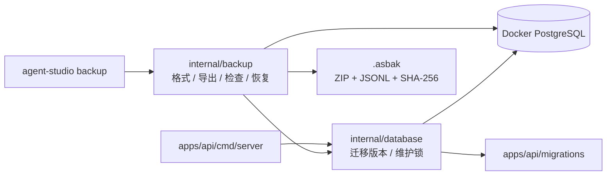
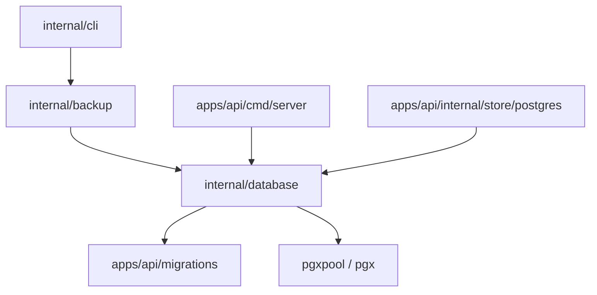
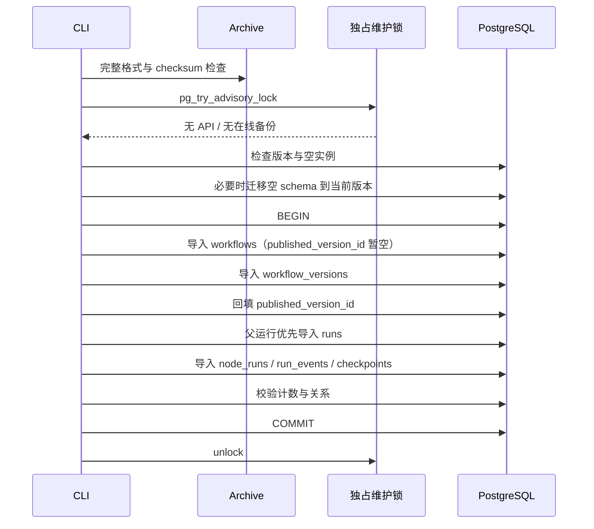

# Agent Studio v0.5-C 实例备份与恢复设计

**状态：** 已批准，待实施

**日期：** 2026-08-29

**基线：** `origin/main` @ `f08659d`（v0.5-B 画布核心体验已合并）

**设计分支：** `codex/v0.5-c-backup-restore-design`

## 1. 背景

Agent Studio 已具备低代码画布、聚焦式 Agent 页面、可扩展节点 SDK、工作流版本治理、运行管理、调试回放和可观测性基线。权威业务数据集中在 Docker PostgreSQL，但当前只有“升级前手工备份数据库”的提示，没有由产品定义、可检查、可验证和可回归的实例备份协议。

本阶段建设 `v0.5-C` 实例备份与恢复闭环。首版选择应用原生逻辑备份，而不是包装 `pg_dump` 或增加在线管理 API：CLI 直接读取 PostgreSQL 一致性快照，生成版本化 `.asbak` 归档；恢复前完成格式、校验和、兼容性、维护锁、引用关系和空实例检查，再在单个业务事务内导入。

该能力优先解决本地实例的数据可恢复性，不同时开发本地 RAG、运行跨重启续跑、Web 备份管理、定时任务或备份合并。

## 2. 已确认产品决策

1. 采用应用原生逻辑备份，不以 `pg_dump` 文件作为公开备份契约。
2. 首版备份包为权限 `0600` 的明文文件，不内置加密；用户负责将其放入加密磁盘或使用外部加密工具。
3. 允许 API 运行期间在线备份；恢复必须确认没有 API 或备份进程占用实例。
4. 备份覆盖全部 PostgreSQL 业务数据，包括运行输入、输出、节点执行结果和调试事件。
5. 备份包记录格式版本和数据库迁移版本；允许同版本恢复和较新 Runtime 向前恢复，禁止降级恢复。
6. 首版只提供 CLI、Makefile 快捷命令和中文文档，不提供 Web 管理页、定时备份和保留策略。
7. 恢复只允许写入空实例，不支持与已有实例合并、覆盖或选择性导入。
8. PostgreSQL 继续使用项目 Docker Compose 服务；Go 调试和测试使用 `CGO_ENABLED=0`。

## 3. 目标与验收主线

核心操作链路为：

```text
在线实例
  → 创建一致性备份
  → 离线检查备份包
  → 对空目标实例执行 dry-run
  → 停止 API 并确认独占维护权
  → 原子恢复
  → 启动 API 并验证领域数据
```

成功标准：

- 在线写入期间创建的备份来自一个 PostgreSQL 一致性快照；
- `.asbak` 文件具有稳定格式版本、迁移版本、表计数、字节数和 SHA-256；
- 创建过程失败、取消或进程中断时不留下可被误认为有效的最终文件；
- `inspect` 无需数据库即可识别格式、版本、范围、计数和损坏；
- `restore --dry-run` 不写业务数据，但验证真实目标的维护锁、版本、空库和引用关系；
- API 或其他备份进程仍在运行时，恢复立即拒绝且不终止对方连接；
- 非空目标、未来迁移版本、未知格式、校验损坏或非法引用均在写入前拒绝；
- 恢复的业务数据在一个事务中提交，失败不留下半份业务数据；
- 当前 Runtime 能恢复仓库固定的 `v1alpha1` 黄金备份；
- 日志和 CLI 输出不泄露数据库连接串、运行输入输出或归档正文。

## 4. 范围

### 4.1 本阶段交付

- `agent-studio backup create`、`inspect` 和 `restore` 命令；
- `agent-studio.dev/backup/v1alpha1` 归档格式；
- PostgreSQL 一致性导出、空实例检查和事务化导入；
- API/备份共享锁与恢复独占锁；
- 历史格式兼容策略和黄金备份 fixture；
- 格式安全、CLI、PostgreSQL 集成、故障注入和 Docker 跨实例回归；
- Makefile 快捷入口、README 和中文备份恢复手册。

### 4.2 明确不做

- 不开发本地 RAG 闭环；
- 不实现运行跨 API 重启续跑，恢复后的活动运行仍由既有逻辑安全收敛；
- 不提供 Web 上传、下载、恢复或备份历史页面；
- 不提供定时任务、轮转、远端对象存储、保留策略或增量备份；
- 不内置口令加密、KMS、签名、远端证明或密钥托管；
- 不支持恢复到非空实例、跨实例合并、按工作流选择恢复或覆盖同 ID 数据；
- 不备份节点索引缓存、环境变量、`.env`、模型密钥、遥测后端或容器镜像；
- 不修改前端、OpenAPI、数据库表结构、数据库迁移或节点 SDK；
- 不把 `.asbak` 声明为 v1 稳定协议；`v1alpha1` 仍允许在发布前根据 RC 反馈修订。

## 5. 方案选择

### 5.1 选定方案：应用原生逻辑备份



优势：

- 备份格式由 Agent Studio 版本治理，可以离线检查和做精确兼容判断；
- 只导出应用拥有的领域数据，不包含 PostgreSQL 角色、权限、扩展或宿主配置；
- 可以对引用关系、空目标、敏感输出和恢复语义做产品级约束；
- 通过固定黄金备份在 CI 中持续证明向前恢复能力。

代价是每次持久化模型演进都必须维护导出/导入适配器和兼容 fixture。该成本属于公开恢复能力的必要维护面。

### 5.2 未采用方案

**`pg_dump` 包装：** 实现快，但公开格式被 PostgreSQL 工具版本、schema DDL 和恢复参数绑定；难以提供应用级 `inspect`、引用预检和稳定错误语义。

**在线管理 API：** 浏览器使用方便，但会新增高权限下载/恢复端点、上传限制、鉴权和 CSRF/权限边界。当前项目没有多用户鉴权基础，不应扩大攻击面。

**只导出工作流模板：** 现有模板已覆盖单工作流迁移，但不会保存运行、事件、归档状态、版本历史和恢复检查点，不能替代实例恢复。

## 6. Go 包边界

根目录 `internal/cli` 不能直接导入 `apps/api/internal/store/postgres`，否则违反 Go `internal` 可见性规则。实施时抽取只包含数据库基础设施的根级共享包：



边界固定为：

- `internal/database` 负责迁移文件装载、当前/最新迁移版本、迁移执行和维护锁，不包含工作流或运行领域 SQL；
- `internal/backup` 负责公开备份格式、表模型、一致性导出、离线检查、预检和恢复 SQL；
- `apps/api/internal/store/postgres` 保留在线 API 的领域持久化方法，其 `Migrate` 改为委托共享迁移组件；
- `internal/cli` 只解析参数、读取 `DATABASE_URL`、组织输出和映射退出码；
- `apps/api/cmd/server` 在开始迁移和对外服务前取得共享维护锁，并在进程关闭时释放。

不为复用而公开新的 Go SDK 包；这些能力继续位于仓库根 `internal` 边界内。

## 7. 备份归档格式

### 7.1 容器与固定条目

`.asbak` 使用 Go 标准库 `archive/zip` 生成的 ZIP 容器，各条目使用 Deflate。ZIP 支持在不知道最终条目大小时流式写入，并允许检查阶段按条目读取；`.asbak` 是产品格式标识，不要求用户把它当作普通 ZIP 操作。

`v1alpha1` 只允许以下固定条目：

```text
manifest.json
checksums.txt
data/workflows.jsonl
data/workflow_versions.jsonl
data/runs.jsonl
data/node_runs.jsonl
data/run_events.jsonl
data/workflow_draft_checkpoints.jsonl
```

缺少条目、重复条目、清单外条目、目录条目、绝对路径、包含 `..` 的路径、反斜杠路径、符号链接或其他非普通文件模式均返回 `BACKUP_ARCHIVE_INVALID`。

读取器在交给 Go `archive/zip` 解析前先从 `io.ReaderAt` 读取 EOCD/ZIP64 目录元数据：必须是单磁盘、条目数恰好为 8、中央目录不超过 1 MiB，且目录偏移和长度位于物理文件范围内。这样恶意文件不能先诱导标准库为海量中央目录条目分配内存，再被固定条目检查拒绝。

### 7.2 Manifest

`manifest.json` 使用 UTF-8 JSON 对象，最大 1 MiB，字段固定为：

```json
{
  "apiVersion": "agent-studio.dev/backup/v1alpha1",
  "createdAt": "2026-08-29T00:00:00Z",
  "runtimeVersion": "0.5.0-dev",
  "databaseMigrationVersion": 6,
  "includesRuns": true,
  "datasetDigest": "sha256:<64 lowercase hex>",
  "tables": [
    {
      "name": "workflows",
      "path": "data/workflows.jsonl",
      "records": 1,
      "uncompressedBytes": 1024,
      "digest": "sha256:<64 lowercase hex>"
    }
  ]
}
```

约束：

- `createdAt` 取一致性事务中的 PostgreSQL `transaction_timestamp()`，统一为 UTC RFC 3339 Nano，表示数据快照时间而不是文件关闭时间；
- `runtimeVersion` 使用当前 `buildinfo` 版本；
- `databaseMigrationVersion` 必须是大于零的已应用迁移版本；
- `includesRuns` 在 `v1alpha1` 必须为 `true`；
- `tables` 按本节固定表顺序出现，每张表恰好一次；
- 不记录数据库 URL、数据库名、主机名、用户名、容器名、绝对路径或环境变量；
- 未知字段在 `v1alpha1` 检查中拒绝，避免错误拼写被静默忽略。

### 7.3 JSONL 数据

每行是一个完整领域记录，使用显式 Go struct 编解码：

- UUID 和节点 ID 使用字符串；
- 时间使用 UTC RFC 3339 Nano；
- PostgreSQL `jsonb` 使用 `json.RawMessage`，保持 JSON 值而不是二次字符串编码；
- `text[]` 使用 JSON 字符串数组；
- 可空字段使用 JSON `null`；
- 每行以 `\n` 结束；
- 单条记录解码上限为 16 MiB；
- 整个归档声明和实际未压缩数据上限为 64 GiB；
- 输出顺序稳定，表内使用领域主键和依赖关系的确定性顺序。

归档总量超过 `v1alpha1` 上限时，创建返回 `BACKUP_SIZE_LIMIT_EXCEEDED`，不产生最终文件。该上限面向当前轻量本地实例，后续只有在保持有界资源消耗的前提下才能调整。

### 7.4 校验和

创建时流式计算每个数据条目的 SHA-256、记录数和未压缩字节数。`datasetDigest` 是按固定表顺序拼接各数据条目标准 checksum 行后计算的 SHA-256。

`checksums.txt` 最大 1 MiB，按路径字典序包含 `manifest.json` 和六个数据条目的标准行：

```text
<64 lowercase hex>  data/runs.jsonl
<64 lowercase hex>  manifest.json
```

检查顺序为：条目和大小边界 → Manifest 结构 → `checksums.txt` 结构 → Manifest 自身摘要 → 数据条目摘要/计数/字节数 → `datasetDigest`。任一步不一致都返回 `BACKUP_CHECKSUM_MISMATCH` 或更具体的结构错误，且不继续恢复。

归档在 dry-run 和正式恢复完成前保持同一个打开的普通文件描述符；每次重新读取表条目仍流式复核 SHA-256、字节数和 ZIP CRC。路径被替换不会改变已选归档，同一 inode 被就地修改则在导入事务内触发校验失败并回滚全部业务数据。

### 7.5 原子创建

创建流程：

1. 要求 `--output` 指向尚不存在的最终路径，父目录必须存在；
2. 以 `0600` 在同目录创建随机临时文件；
3. 在 PostgreSQL 一致性事务中把六张表流式写入 ZIP 条目；
4. 写入 Manifest 和 checksums，关闭 ZIP writer；
5. `fsync` 临时文件；
6. 使用同目录硬链接把完整临时 inode 原子发布为最终路径，目标已存在时链接失败而不覆盖；
7. 删除临时名称并同步父目录。

取消、错误或 panic 清理临时文件。若文件系统不支持同目录原子硬链接，创建明确失败，不降级为可能覆盖目标的检查后 `rename`。

## 8. 在线一致性与维护锁

### 8.1 一致性快照

备份持有 PostgreSQL `REPEATABLE READ READ ONLY` 事务。第一次领域查询建立快照，随后六张表全部从该快照读取。数据按以下顺序导出：

```text
workflows
workflow_versions
runs（source_run_id / retry_of_run_id 的父运行优先）
node_runs
run_events
workflow_draft_checkpoints
```

`backup create` 只支持数据库已经处于当前 Runtime 最新迁移版本的实例；它不会在在线备份命令中隐式执行迁移。版本较旧或 migration 记录与实际 schema 不一致时返回 `BACKUP_SCHEMA_NOT_CURRENT`，要求用户先按正常升级流程停止旧 API、使用当前 API 完成迁移并验证，再重新创建备份。

长事务可能延迟 PostgreSQL 清理旧版本，因此 CLI 在开始和结束时输出安全的记录数/耗时摘要，文档要求大型实例在低写入时段执行；首版不引入后台快照服务。

### 8.2 维护锁协议

使用固定、文档化的 PostgreSQL session advisory lock key：

- 已完成迁移并进入运行期的 API 进程、`backup create` 取得共享锁；
- API 需要执行迁移时先取得独占锁，迁移完成后在释放独占锁前取得运行期共享锁；
- `backup restore --dry-run` 和正式恢复尝试取得独占锁；
- 所有取得操作使用 `pg_try_advisory_lock[_shared]`，失败立即返回，不等待；
- 锁由专用 `pgxpool.Conn` 持有，不能放回连接池后继续声明已持锁；
- Context 取消或进程关闭时显式 unlock 并释放专用连接；连接异常断开时 PostgreSQL 自动释放 session lock。

API 启动先读取迁移版本：若已经是当前版本，则取得共享锁后再次读取版本，二次检查仍一致才开始 supervisor 和 HTTP 服务；若需要迁移，则在同一个专用 PostgreSQL session 中取得独占锁、再次检查并执行迁移，然后由同一 session 取得共享锁并释放独占锁，完成无窗口的锁降级。这样可以关闭“读版本 → 取得锁”之间的竞争窗口，同时允许多个已处于相同当前 schema 的 API 实例共享运行锁。若恢复正在进行、旧 API 阻止迁移或迁移进程正在运行，新的 API 启动立即失败并输出安全错误。

本设计已在项目 Docker PostgreSQL 中验证同一 session 可以依次取得 exclusive、shared，释放 exclusive 后仍保留 `ShareLock`；集成测试必须固化该语义，不能只用 mock 证明锁降级。

在线备份取得共享锁后读取并固定迁移版本，因此不会与 schema 迁移重叠。在线备份与多个当前版本 API 可同时持有共享锁，但恢复必须等所有共享持有者退出后由用户重新执行。

该锁只协调实现本协议的 Agent Studio 新版本进程，不能识别尚未实现维护锁的旧 Runtime，也不能阻止使用其他 SQL 客户端直接写数据库。升级和恢复文档必须要求先人工停止全部旧版本 API，并禁止恢复期间使用其他 SQL 客户端修改目标库。

## 9. 离线检查与恢复预检

### 9.1 `inspect`

`agent-studio backup inspect <archive>` 不读取 `DATABASE_URL`，完成：

- 普通文件和非符号链接检查；
- ZIP 条目、压缩/未压缩大小和路径检查；
- Manifest 与 checksum 完整验证；
- JSONL 逐行结构解码和记录计数验证；
- 人类可读或 `--json` 安全摘要输出。

`inspect` 不把全量主键和引用集合装入内存，也不声明目标数据库可恢复。全局主键唯一性、表间引用、数据库版本、维护锁和空库由 restore dry-run 使用 PostgreSQL 临时表验证。

### 9.2 `restore --dry-run`

dry-run 执行与正式恢复相同的只读前置步骤：

1. 完整检查归档；
2. 读取 `DATABASE_URL` 并连接目标；
3. 尝试取得独占维护锁；
4. 读取目标和当前 Runtime 的迁移版本；
5. 判断归档能否由当前 Runtime 向前恢复；
6. 在回滚事务中创建临时引用表，流式装载最小 ID/引用列并执行关系验证；
7. 判断目标业务表为空；若目标尚无 schema，则只计算迁移计划，不在 dry-run 中执行迁移；
8. 输出将执行的迁移范围、表计数、总字节数和恢复顺序；
9. 回滚临时事务并释放独占锁。

dry-run 不创建持久表、不写 `schema_migrations`、不写业务数据。

### 9.3 引用验证

至少验证：

- `workflow_versions.workflow_id` 指向存在的 workflow；
- `workflows.published_version_id` 指向同 workflow 的 version；
- `runs.workflow_id`、`workflow_version_id` 符合 mode/source 语义；
- `runs.source_run_id` 和 `retry_of_run_id` 指向同 workflow 的父运行；
- 运行父引用无环，归档顺序为父运行优先；
- `node_runs.run_id`、`run_events.run_id` 指向存在的 run；
- `workflow_draft_checkpoints` 指向存在的 workflow 和同 workflow version；
- Manifest 计数与临时引用表计数一致。

临时表只保存 ID、引用和顺序列，不保存运行输入输出，避免把完整实例装入 Go 内存。

## 10. 版本兼容策略

### 10.1 决策矩阵

| 场景 | 行为 |
|---|---|
| 归档格式由当前 Runtime 支持，归档迁移版本等于当前版本 | 允许 |
| 归档格式受支持，归档迁移版本低于当前版本 | 通过对应 importer 向当前 schema 恢复 |
| 归档迁移版本高于当前 Runtime 最新版本 | `BACKUP_RUNTIME_TOO_OLD` |
| 归档格式未知或已停止支持 | `BACKUP_FORMAT_UNSUPPORTED` |
| 目标 schema 版本高于当前 Runtime | `BACKUP_RUNTIME_TOO_OLD` |
| 目标已有任意业务数据 | `BACKUP_TARGET_NOT_EMPTY` |

### 10.2 向前恢复责任

从 `v0.5-C` 起，每个改变持久化结构的迁移必须同时：

- 更新当前备份格式或新增格式版本；
- 更新旧格式到当前领域结构的 importer；
- 保留至少一个仓库内历史 `.asbak` 黄金 fixture；
- 增加“旧备份 → 当前空库 → 当前领域查询”的集成测试；
- 在 Release Notes 说明备份兼容范围。

当前 major 版本内不得无说明删除已发布格式 importer。禁止使用“忽略未知字段并尽量恢复”的宽松策略；缺少明确适配器时宁可拒绝，也不产生语义不完整的数据。

## 11. 恢复事务

正式恢复固定执行：



规则：

- 正式恢复必须同时提供 `--confirm-empty-instance`；缺失属于参数错误，退出码 `2`；
- 迁移只发生在取得独占锁并再次确认目标无业务数据之后；
- 完整归档检查先于独占锁；检查后的同一打开文件描述符一直保留到恢复结束，导入不得按路径重新打开文件；
- 迁移可能提交空 schema 和 `schema_migrations`，但业务导入全部位于一个事务；
- 导入失败时回滚全部业务数据，最多留下已迁移的空表；
- `workflows` 先以 `published_version_id = NULL` 导入，版本存在后再回填，消除双向外键顺序；
- `runs` 必须按预检确认的父运行优先顺序导入，不能临时禁用外键或 CHECK 约束；
- 不使用 `session_replication_role=replica`，不跳过触发器、外键或领域约束；
- 导入完成后在事务内重新核对六张表计数、发布版本引用、运行父链和 checkpoint 引用；
- `SIGINT`、超时或连接断开取消 Context，回滚事务并释放 session lock。

## 12. 活动运行语义

在线快照可能包含 `running` 或 `cancelling` 运行。备份和恢复保留它们在快照时的状态、heartbeat、事件和节点结果，不伪造结束事件，也不在导入阶段重写为 cancelled。

恢复后的 API 首次启动继续使用既有 supervisor 恢复语义：没有对应执行进程的活动运行最终安全收敛，不自动重放可能具有模型费用、Webhook 或其他外部副作用的节点。真正的持久化领取、租约和跨重启续跑属于后续 `v0.5-D`。

## 13. CLI 契约

### 13.1 命令

```bash
# 创建完整备份
DATABASE_URL=postgres://... \
  agent-studio backup create --output ./backups/studio-20260829.asbak

# 离线检查
agent-studio backup inspect ./backups/studio-20260829.asbak
agent-studio backup inspect --json ./backups/studio-20260829.asbak

# 真实目标 dry-run
DATABASE_URL=postgres://... \
  agent-studio backup restore --dry-run ./backups/studio-20260829.asbak

# 正式恢复
DATABASE_URL=postgres://... \
  agent-studio backup restore --confirm-empty-instance \
  ./backups/studio-20260829.asbak
```

### 13.2 参数与环境

- `create` 只接受必填 `--output <path>`；首版不接受包含范围、压缩级别或覆盖选项；
- `inspect` 接受可选 `--json` 和一个归档路径；
- `restore` 接受互斥的 `--dry-run` 或 `--confirm-empty-instance`，以及一个归档路径；
- `create`、`restore` 必须从环境读取非空 `DATABASE_URL`，不提供 URL flag；
- `inspect` 忽略 `DATABASE_URL`；
- CLI 备份命令不复用 API 的隐式默认数据库 URL，缺失环境变量立即失败，避免恢复到误选实例；
- 退出码 `0` 表示成功，`2` 表示用法错误，`1` 表示格式、兼容性、连接、锁或运行时失败。

### 13.3 输出

人类输出只允许：

- 归档路径；
- API/Runtime 和迁移版本；
- 创建时间、耗时、总记录数、每表记录数、压缩/未压缩字节数；
- checksum 摘要；
- dry-run 的迁移范围和“目标为空”结论；
- 稳定错误码和安全处理建议。

不得输出：数据库 URL、用户名、密码、运行输入输出、工作流配置正文、节点错误详情、归档 JSONL 行或环境变量值。`inspect --json` 使用固定对象结构，不把 error 的底层连接字符串序列化。

### 13.4 稳定错误码

至少定义：

| 错误码 | 含义 |
|---|---|
| `BACKUP_ARCHIVE_INVALID` | 容器、条目、路径、JSONL 或计数结构非法 |
| `BACKUP_CHECKSUM_MISMATCH` | Manifest、数据或 dataset digest 不一致 |
| `BACKUP_FORMAT_UNSUPPORTED` | 当前 Runtime 不支持归档格式 |
| `BACKUP_RUNTIME_TOO_OLD` | 归档或目标迁移版本高于当前 Runtime |
| `BACKUP_SCHEMA_NOT_CURRENT` | create 的来源数据库未处于当前 Runtime 最新迁移版本 |
| `BACKUP_SIZE_LIMIT_EXCEEDED` | 记录、条目或总未压缩大小超过 v1alpha1 限制 |
| `BACKUP_API_RUNNING` | 无法取得恢复独占锁 |
| `BACKUP_TARGET_NOT_EMPTY` | 任意业务表已有记录 |
| `BACKUP_REFERENCE_INVALID` | 主键重复、引用缺失、跨 workflow 或运行父链有环 |
| `BACKUP_CREATE_FAILED` | 一致性读取、归档写入或原子发布失败 |
| `BACKUP_RESTORE_FAILED` | 迁移、导入、约束、计数或提交失败 |

## 14. Makefile 与本地 Docker

新增：

```text
make backup-create OUTPUT=./backups/dev.asbak
make backup-inspect BACKUP=./backups/dev.asbak
make backup-restore-dry-run BACKUP=./backups/dev.asbak
make backup-restore BACKUP=./backups/dev.asbak CONFIRM=empty-instance
make test-backup-e2e
```

规则：

- 本地快捷目标复用 `TEST_DATABASE_URL` 的 Docker PostgreSQL 默认值；
- `backup-create`、dry-run 和正式恢复依赖 `db-up`；
- `backup-restore` 在 `CONFIRM` 不精确等于 `empty-instance` 时拒绝；
- 文档要求正式恢复前停止 API，但不停止 PostgreSQL；
- Makefile 不自动删除数据库 volume、不执行 `docker compose down -v`，也不替用户清空目标库。

`test-backup-e2e` 在同一个 Docker PostgreSQL 中创建隔离 source/target schema 或测试数据库，测试完成只删除自己创建的命名空间，不接触开发者默认业务数据。

## 15. 测试策略

### 15.1 单元测试

`internal/backup`：

- Manifest 严格字段、时间、版本、表顺序和 digest；
- ZIP 缺失、重复、额外、绝对、`..`、反斜杠、目录和符号链接条目；
- Manifest/checksums 大小、单记录 16 MiB 和总量 64 GiB 边界；
- JSONL null、数组、jsonb、时间和最后换行；
- checksum、记录数、字节数和 dataset digest；
- 临时文件、`0600`、目标已存在、取消和原子发布失败；
- 运行父链拓扑顺序、循环、缺失引用和跨 workflow 引用；
- 错误包装后仍保留稳定 code 且不包含敏感 fixture。

`internal/database`：

- 当前/最新迁移版本和空 schema；
- shared/shared 成功、shared/exclusive 冲突、连接释放后自动解锁；
- 同一真实 PostgreSQL session 从 exclusive 无窗口降级到 shared；
- Context 取消和专用连接异常；
- 从 API store 委托后迁移行为和既有测试不变。

`internal/cli`：

- help、未知子命令、缺失参数和互斥 flag；
- create/restore 缺少 `DATABASE_URL`；
- inspect 不读取数据库配置；
- `--json` 稳定输出；
- 每类错误码映射到退出码 `1`；
- stdout/stderr 不包含 fixture 中的密码、输入和输出。

### 15.2 PostgreSQL 集成测试

完整 fixture 必须包含：

- 未发布和已发布 workflow；
- 多个 workflow version 与 `published_version_id`；
- archive 状态和 `agent_presentation`；
- test、published、debug 运行；
- `source_run_id` 调试链和 `retry_of_run_id` 重试链；
- running、cancelling、completed、failed、cancelled 状态；
- node_runs、run_events、redacted paths、active ports 和错误对象；
- workflow_draft_checkpoint。

验证：

- 在线事务写入发生在备份快照建立后时，归档仍保持单一快照；
- API/shared lock 不阻止 create，但阻止 restore；
- 目标任意业务表非空均拒绝；
- 导入中故障、Context 取消和约束失败后六张表都为空；
- 正常恢复后以领域查询比较 source 快照与 target，而不是只比较行数。

### 15.3 黄金兼容与端到端

仓库提交不含真实用户数据的最小 `v1alpha1` `.asbak` fixture。CI 使用当前 Runtime：

1. `inspect` fixture；
2. 对当前空 schema 执行 dry-run；
3. 正式恢复；
4. 通过 API store/领域服务读取并断言工作流、版本、运行和事件；
5. 再创建一份当前备份，验证当前 create/inspect/restore 往返。

Docker E2E 固定执行“完整 source → 在线备份 → target dry-run → target 恢复 → 领域对比”。不依赖 Web UI，因为本阶段没有前端入口。

### 15.4 回归门禁

```bash
CGO_ENABLED=0 go test ./internal/database ./internal/backup ./internal/cli -count=1
COMPOSE_PROJECT_NAME=agent_improve CGO_ENABLED=0 make test-backup-e2e
COMPOSE_PROJECT_NAME=agent_improve CGO_ENABLED=0 make verify
COMPOSE_PROJECT_NAME=agent_improve CGO_ENABLED=0 make verify-release
```

完整实现完成后必须进行独立代码审查；Critical 和 Important 问题归零后才能创建 PR。

## 16. 文件影响

### 16.1 预计新增

| 文件 | 职责 |
|---|---|
| `internal/database/migrate.go` | 共享迁移装载、执行和版本读取 |
| `internal/database/migrate_test.go` | 迁移委托、版本和错误测试 |
| `internal/database/maintenance.go` | session advisory shared/exclusive lock |
| `internal/database/maintenance_test.go` | 锁冲突、释放、取消和连接异常测试 |
| `internal/backup/model.go` | v1alpha1 Manifest、表和公开摘要类型 |
| `internal/backup/errors.go` | 稳定错误码与安全错误包装 |
| `internal/backup/archive.go` | ZIP 条目、JSONL、checksum 和资源边界 |
| `internal/backup/create.go` | 一致性导出与原子发布 |
| `internal/backup/inspect.go` | 离线检查与安全摘要 |
| `internal/backup/restore.go` | 目标预检、临时引用验证和事务恢复 |
| `internal/backup/postgres.go` | 六张业务表的 pgx 导出/导入实现 |
| `internal/backup/*_test.go` | 格式、安全、引用、取消和恢复测试 |
| `internal/backup/testdata/v1alpha1-minimal.asbak` | 无真实数据的历史兼容黄金备份 |
| `internal/cli/backup.go` | backup 子命令、参数、环境和输出 |
| `internal/cli/backup_test.go` | CLI 契约和敏感输出测试 |
| `scripts/test-backup-e2e.sh` | Docker source/target 恢复黄金路径 |
| `docs/backup-restore.md` | 中文创建、检查、恢复和故障处理手册 |

实现时可以在保持单一职责的前提下调整 `internal/backup` 内部文件拆分，但格式模型、数据库基础设施和 CLI 解析不能重新耦合成一个大文件。

### 16.2 预计修改

| 文件 | 变化 |
|---|---|
| `internal/cli/app.go` | 注册 `backup` 命令和依赖注入入口 |
| `internal/cli/app_test.go` | help、路由和退出码回归 |
| `apps/api/internal/store/postgres/migrate.go` | 委托 `internal/database` |
| `apps/api/internal/store/postgres/migrate_test.go` | 保留既有迁移升级覆盖 |
| `apps/api/cmd/server/main.go` | 启动前取得 shared maintenance lock，关闭时释放 |
| `apps/api/cmd/server/main_test.go` | 锁失败、启动顺序和关闭释放测试 |
| `Makefile` | CLI 快捷目标和 `test-backup-e2e` |
| `README.md` | 备份恢复入口、敏感数据和范围说明 |
| `.github/workflows/ci.yml` | 增加备份黄金路径或独立 quick gate |

不修改 `contracts/openapi.yaml`、`apps/web`、`apps/api/migrations/*.sql`、节点 manifest 或 Go Node SDK。

## 17. 实施拆分

建议拆成三个可独立审查的 PR：

### PR 1：数据库基础设施与归档只读链路

- 抽取共享迁移组件；
- 建立维护锁；
- 实现 v1alpha1 模型、ZIP/JSONL、安全检查；
- 完成 `create` 和 `inspect`；
- 单元、CLI 和一致性快照测试。

验收结果：可以在线创建并离线验证备份，但不开放 restore。

### PR 2：恢复预检与原子导入

- 实现 dry-run、临时引用表和兼容矩阵；
- 实现空实例检查、迁移和事务恢复；
- 建立黄金备份与 PostgreSQL 集成测试；
- 覆盖锁冲突、非空目标、损坏和回滚。

验收结果：CLI 能安全地把受支持备份恢复到空实例。

### PR 3：Docker E2E、文档与交付收口

- Makefile 和 `test-backup-e2e`；
- README 与中文操作/故障文档；
- CI 门禁和 Release 兼容检查；
- 全量回归、独立代码审查和 PR 收口。

每个 PR 开发前均从最新 `origin/main` 新建 `codex/` 分支，测试先行，小提交开发；代码审查和回归通过后通过 git/GitHub PR 合入，不直接推送主分支。

## 18. 可行性与阻塞项审查

| 项目 | 现状/风险 | 设计处理 | 结论 |
|---|---|---|---|
| 权威数据位置 | 六张业务表位于 PostgreSQL | 明确全量逻辑导出范围 | 无阻塞 |
| CLI 包可见性 | 根 CLI 不能导入 API internal store | 抽取 `internal/database`，备份领域 SQL留在根 `internal/backup` | 无阻塞 |
| 在线一致性 | API 可持续写 workflow/run/event | `REPEATABLE READ READ ONLY` 单快照 | 无阻塞 |
| workflow/version 循环外键 | published version 与 workflow 双向引用 | workflow 暂空引用、version 导入后回填 | 无阻塞 |
| run 自引用 | debug/retry 依赖父运行 | 临时表预检无环、归档父优先 | 无阻塞 |
| 大实例内存 | 运行输入输出可能较大 | JSONL 流式处理；临时表仅存 ID/引用 | 无阻塞 |
| 压缩归档安全 | 路径穿越、ZIP bomb、额外条目 | 固定条目、普通文件、16 MiB 行和 64 GiB 总上限 | 无阻塞 |
| 不覆盖原子发布 | 检查后 rename 存在竞争 | 同目录硬链接原子发布，目标存在即失败 | 无阻塞 |
| API/迁移/恢复并发 | 文档约定不足以保证 API 已停，shared 锁也不能覆盖 schema 迁移 | 运行/备份持 shared；迁移/恢复持 exclusive；启动二次版本检查关闭竞争窗口 | 无阻塞 |
| 旧 Runtime 不持维护锁 | 新锁无法识别升级前仍运行的旧 API | 升级/恢复手册要求人工停止全部旧 API；新版本起由协议自动守护 | 已接受迁移边界 |
| schema 演进 | 新字段可能使旧归档无法直接插入 | importer 适配器 + 历史黄金 fixture + 每迁移门禁 | 无阻塞 |
| 恢复原子性 | 迁移和数据导入无法共用既有单事务 | 允许保留已迁移空 schema；业务数据单事务 | 已接受边界 |
| 活动运行 | 快照没有原执行进程 | 保留证据，由既有 supervisor 安全收敛，不自动续跑 | 已接受边界 |
| 敏感数据 | 明文包含完整运行内容 | `0600`、输出脱敏、文档要求外部加密 | 已接受风险 |
| 直接 SQL 客户端 | advisory lock 不能阻止人工写入 | 恢复窗口禁止其他 SQL 客户端，明确运维责任 | 已接受风险 |
| 前端/API 契约 | 首版无 Web 入口 | 不改前端和 OpenAPI | 无阻塞 |

最终审查结论：应用原生逻辑备份可建立在现有 PostgreSQL、迁移文件、CLI 和 pgx 基础上。Go `internal` 包边界、循环外键、run 自引用、在线一致性、恢复并发、旧格式兼容和失败回滚均有明确实现路径；当前不存在未解决的架构、数据、安全或部署阻塞项。

## 19. 最终验收清单

- [ ] `backup create` 在线生成权限 `0600`、不覆盖目标的完整 `.asbak`；
- [ ] 所有业务表来自一个 PostgreSQL 一致性快照；
- [ ] Manifest、checksums、表计数、字节数和 dataset digest 全部可离线验证；
- [ ] 非法 ZIP 条目、路径穿越、符号链接、重复/额外条目和资源超限均被拒绝；
- [ ] `inspect` 不连接数据库且不泄露业务正文；
- [ ] dry-run 验证真实目标的锁、版本、空库、引用和迁移计划但不持久写入；
- [ ] API 或在线备份持有 shared lock 时正式恢复被拒绝；
- [ ] 未来迁移、未知格式、非空目标、checksum 损坏和引用异常均在业务写入前拒绝；
- [ ] workflow/version 循环引用和 run 父链按明确顺序恢复；
- [ ] 业务导入失败后六张业务表均无残留数据；
- [ ] 当前 Runtime 能恢复固定 `v1alpha1` 黄金备份；
- [ ] Docker source/target E2E 比较完整领域数据而非只比较行数；
- [ ] CLI、日志和测试失败输出不包含连接串、密码、输入或输出；
- [ ] README 与中文手册说明明文敏感边界、API 停止要求、外部加密和故障恢复；
- [ ] `CGO_ENABLED=0 make verify`、`make test-backup-e2e` 和 Release 门禁通过；
- [ ] 三批代码均完成独立代码审查、回归验证并通过 PR 合入。
