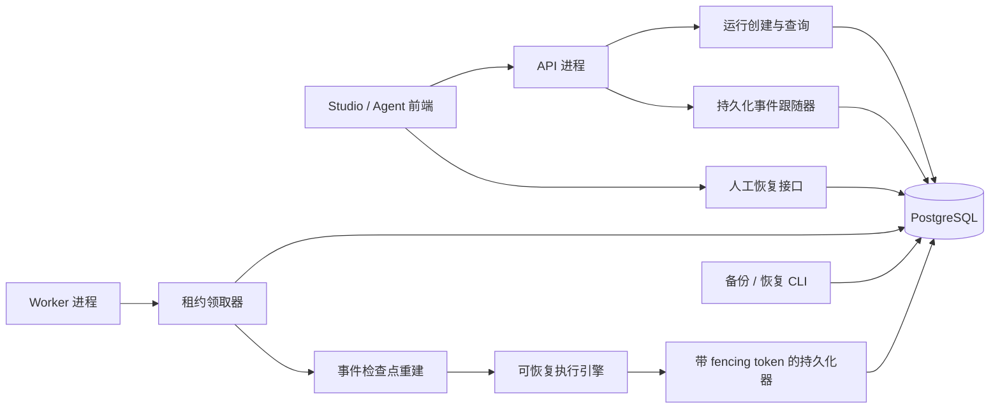
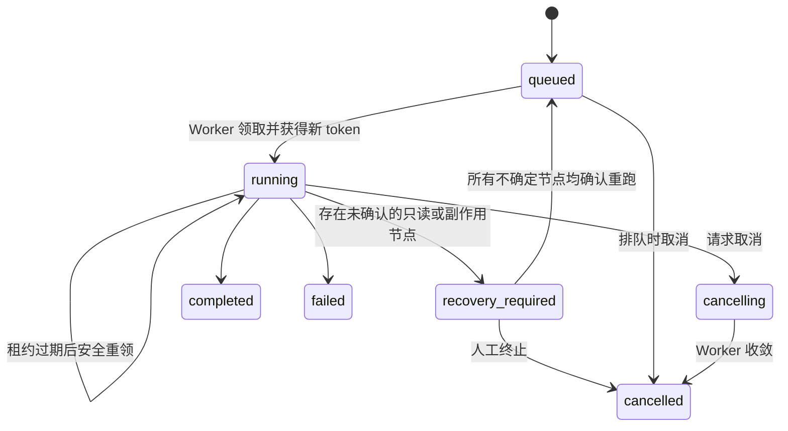

# v0.5-D 持久化运行与跨重启恢复设计

状态：已确认，待实施计划

日期：2026-09-01

## 1. 背景

Agent Studio 当前由 API 进程直接执行工作流。运行状态、节点记录和事件虽然已经写入 PostgreSQL，但执行上下文、未脱敏输入及中间值只存在于 API 内存中。API 或宿主机重启后，既有 `RunCoordinator` 会把失去心跳的运行安全收敛为取消，不会跨重启继续。

现有基础包括：

- PostgreSQL 中的 `runs`、`node_runs`、`run_events`；
- 节点级顺序事件、激活端口和节点输出；
- `pure`、`read_only`、`side_effect` 执行安全分级；
- 从完整事件历史构造调试回放和冻结边的能力；
- v0.5-C 实例备份、恢复和历史格式 importer；
- 运行管理页、取消、整次重试和局部调试重跑。

v0.5-D 将执行生命周期从 API 进程中拆出，在不引入 Redis、Kafka 等额外中间件的前提下，使用 PostgreSQL 完成持久化排队、租约领取、节点边界恢复和人工恢复。

## 2. 目标

本阶段必须实现：

1. API 与 Worker 使用同一 Go 代码库和同一 Docker 镜像，但作为两个独立进程角色运行；
2. API 只负责创建运行、查询、事件跟随和人工恢复，不直接执行节点；
3. Worker 使用 PostgreSQL 租约和 fencing token 安全领取运行；
4. 已完成节点在进程重启后不重复执行；
5. 不确定 `pure` 节点可自动重跑；
6. 不确定 `read_only`、`side_effect` 节点必须经人工确认；
7. 完整执行输入和节点检查点以应用层密文保存，公开字段继续脱敏；
8. 支持多个 Worker 的正确性，默认 Worker 运行并发为 1；
9. 备份、恢复、管理页面、Agent 页面和 NDJSON 运行流覆盖新语义；
10. 通过故障注入证明 API 重启、Worker 重启、租约过期和迟到写入均可安全收敛。

## 3. 非目标

本阶段不实现：

- 外部副作用的 exactly-once、事务补偿或回滚；
- 节点内部的细粒度检查点；
- Redis、Kafka 或其他外部任务队列；
- Worker 自动扩缩容和跨区域调度；
- 定时触发器、人工审批通用节点；
- 在线密钥轮换或完整凭据中心；
- 本地 RAG；
- 节点市场扩展；
- v0.5.0 正式发布收口。

## 4. 已确认的产品决策

- 运行语义为至少一次执行，不承诺外部副作用 exactly-once；
- 只有 `pure` 不确定节点自动重跑；
- `read_only` 和 `side_effect` 不确定节点都进入人工恢复，避免重复模型费用或外部写入；
- 人工恢复只允许“确认重跑当前节点”和“终止本次运行”，不允许跳过或手动标记成功；
- 同一运行存在多个并行不确定节点时逐个处理，全部解除阻塞后才继续；
- 协议从首版支持多 Worker 安全领取，但默认 Worker 运行并发为 1；
- 升级前遗留的活动运行不自动续跑；
- API 与 Worker 共享必填的 `RUN_PAYLOAD_ENCRYPTION_KEY`；
- PostgreSQL 是唯一协调存储，不引入消息队列。

## 5. 方案比较

### 5.1 采用方案：事件日志检查点 + PostgreSQL 租约

复用现有运行事件作为公开审计日志，在旁路私有表中保存与事件序号关联的加密执行载荷。Worker 从公开事件和私有载荷重建节点边界状态。租约字段直接附着于 `runs`，避免新增独立队列服务。

优点：

- 复用现有运行、事件、调试回放和安全分级；
- 部署仍只有 PostgreSQL、API、Worker；
- 事件日志保持唯一的执行顺序事实源；
- 便于审计每次恢复尝试。

代价：

- 引擎需要支持从节点边界快照继续；
- 事件需要尝试号；
- 恢复必须读取并归约有界事件历史。

### 5.2 未采用：完整 JSONB 调度器快照

每个节点结束后保存调度器完整快照。恢复读取简单，但快照与事件形成双重事实源，存在漂移、格式演进和备份膨胀风险。

### 5.3 未采用：外部消息队列

Redis 或 Kafka 便于大规模分发，但增加部署、运维和一致性边界，不符合当前轻量化目标。

## 6. 总体架构



### 6.1 API 进程

API 负责：

- 校验工作流、版本、输入和幂等键；
- 在事务中创建排队运行、公开排队事件和加密原始输入；
- 从 PostgreSQL 跟随已持久化公开事件并输出 NDJSON；
- 查询运行、节点最新投影和恢复详情；
- 处理取消、确认重跑和人工终止；
- 提供节点类型、画布、版本治理和其他既有 HTTP 能力。

API 不再构造执行引擎的运行监督器，也不持有活动运行上下文。

### 6.2 Worker 进程

Worker 负责：

- 使用 `FOR UPDATE SKIP LOCKED` 领取可运行记录；
- 获得并续期运行租约；
- 编译运行对应的不可变图快照；
- 解密私有载荷，归约事件历史并构造引擎检查点；
- 执行新运行或从节点边界继续；
- 以租约所有者和 fencing token 校验所有写入；
- 发现不确定节点并按安全等级自动恢复或进入人工恢复；
- 处理取消和优雅关闭。

### 6.3 PostgreSQL

PostgreSQL 同时承担：

- 运行队列；
- 租约与数据库时钟；
- fencing token；
- 公开事件日志；
- 加密私有执行载荷；
- 节点最新状态投影；
- 恢复决策审计；
- 备份和恢复事实源。

## 7. 主要文件范围

### 7.1 新增文件

- `apps/api/cmd/worker/main.go`：Worker 进程入口；
- `apps/api/cmd/worker/main_test.go`：启动、关闭和配置测试；
- `apps/api/internal/worker/worker.go`：领取循环和运行并发；
- `apps/api/internal/worker/claimer.go`：租约生命周期；
- `apps/api/internal/worker/rehydrator.go`：事件与密文检查点重建；
- `apps/api/internal/worker/telemetry.go`：Worker 指标；
- `apps/api/internal/bootstrap/components.go`：API 与 Worker 共享的节点注册、模型提供者和编译器装配；
- `apps/api/internal/runpayload/cipher.go`：AES-256-GCM 密文封装；
- `apps/api/internal/engine/checkpoint.go`：引擎恢复输入；
- `apps/api/internal/workflow/run_submission.go`：统一排队创建事务；
- `apps/api/internal/workflow/run_event_follower.go`：数据库事件跟随；
- `apps/api/internal/workflow/run_recovery.go`：人工恢复领域服务；
- `apps/api/internal/store/postgres/durable_runs.go`：领取、续租、fencing 和恢复事务；
- `apps/api/migrations/000007_durable_runs.sql`：持久化运行迁移；
- `apps/web/src/features/management/RunRecoveryDialog.tsx`：人工恢复界面；
- `scripts/test-durable-runs-e2e.sh`：故障注入 E2E；
- `Dockerfile`：构建 API、Worker 和 CLI 的多阶段镜像。

测试文件按现有包结构与对应实现同目录新增。

### 7.2 修改文件

- `apps/api/internal/domain/run.go`：运行状态、事件尝试号和节点尝试号；
- `apps/api/internal/engine/engine.go`、`scheduler.go`：检查点恢复与续接序号；
- `apps/api/internal/workflow/run_service.go`、`ports.go`：排队、事件跟随和带 token 持久化端口；
- `apps/api/internal/workflow/agent_runs.go`、`run_management.go`：异步运行和恢复操作；
- `apps/api/internal/workflow/debug_history.go`、`debug_rerun.go`：支持排队、恢复控制事件和多次节点尝试；
- `apps/api/internal/workflow/run_coordinator.go`、`agent_run_supervisor.go`：移除 API 进程内生命周期职责；
- `apps/api/internal/store/postgres/runs.go`、`run_coordination.go`：新状态、尝试号和旧扫尾逻辑替换；
- `apps/api/internal/httpapi/runs.go`、`agents.go`、`management_runs.go`、`router.go`、`errors.go`：事件跟随和恢复 API；
- `apps/api/internal/config/config.go`：Worker、租约和密钥配置；
- `apps/api/cmd/server/main.go`：移除本地执行器，保留 API 能力；
- `contracts/openapi.yaml` 与生成客户端：状态、事件、恢复契约；
- `apps/web/src/features/management/RunDetailPanel.tsx`、`RunManagementView.tsx`、查询与样式文件：恢复体验；
- `apps/web/src/features/agent/AgentRunView.tsx`、`useAgentRun.ts` 及相关测试：排队和人工恢复状态；
- `internal/backup/`：v1alpha2 格式、当前 importer、历史 importer 和密文记录；
- `compose.yaml`、`Makefile`、`README.md`、`docs/backup-restore.md`：部署、密钥和升级说明；
- CI 工作流：PostgreSQL 集成与故障注入门禁。

计划阶段可以把大文件进一步拆分，但不得改变上述组件边界。

## 8. 运行状态机



公开 `RunStatus` 增加：

- `queued`：已持久化，等待 Worker；
- `recovery_required`：运行暂停，等待人工处理。

现有 `running`、`cancelling`、`completed`、`failed`、`cancelled` 保留。

`started_at` 继续表示运行生命周期开始时间，包含排队等待时间，避免破坏现有非空契约。队列等待通过 `run.queued` 与 `run.started` 事件时间差计算。

## 9. 数据模型

### 9.1 `runs`

迁移新增：

- `execution_protocol smallint NOT NULL DEFAULT 0`；
- `lease_owner text NULL`；
- `lease_token bigint NOT NULL DEFAULT 0`；
- `lease_expires_at timestamptz NULL`；
- `recovery_reason text NULL`；
- `recovery_requested_at timestamptz NULL`。

约束：

- `lease_token >= 0`；
- `lease_owner` 与 `lease_expires_at` 同时为空或同时非空；
- 只有 `running`、`cancelling` 可以持有租约；
- `recovery_reason` 只在 `recovery_required` 下非空；
- `execution_protocol=1` 表示 v0.5-D 可恢复运行；
- `execution_protocol=0` 的遗留非终态运行不得自动续跑。

数据库索引覆盖：

- `queued` 的创建顺序；
- 无租约或已过期的 `running`、`cancelling`；
- `recovery_required` 的管理查询；
- 当前 lease owner 的活动运行。

### 9.2 `run_events`

新增 `node_attempt integer NULL`：

- 运行级事件必须为 `NULL`；
- 节点级事件必须大于零；
- 旧节点事件回填为尝试 1；
- 事件序号在整个运行内始终连续递增，不因恢复重新从 1 开始。

新增事件类型：

- `run.queued`；
- `run.recovery_required`；
- `node.retry_confirmed`。

恢复后的新 `node.started` 使用递增后的 `node_attempt`。未确认尝试的历史事件保持不可变。

### 9.3 `node_runs`

新增 `attempt integer NOT NULL DEFAULT 1`。`node_runs` 继续保持 `(run_id, node_id)` 唯一，是每个节点的最新状态投影；完整尝试历史由 `run_events` 提供。

### 9.4 `run_payloads`

新增私有表：

```text
run_id           uuid        not null
sequence         bigint      not null
kind             text        not null
node_id          text        null
node_attempt     integer     null
cipher_version   smallint    not null
ciphertext       bytea       not null
created_at       timestamptz not null
primary key (run_id, sequence, kind)
foreign key (run_id) references runs(id)
```

`kind` 首版只允许：

- `run_input`：`sequence=0`，没有节点和尝试号；
- `node_input`：关联节点事件序号；
- `node_output`：关联节点终态事件序号。

HTTP 层、管理查询和公开领域对象不得读取或返回该表。只有运行创建、Worker 重建、带 token 的事件事务和备份模块可以访问。

## 10. 私有载荷加密

### 10.1 密钥

`RUN_PAYLOAD_ENCRYPTION_KEY` 必须为 Base64 编码的 32 字节随机密钥。API 与 Worker 在缺失或格式错误时启动失败。密钥不得写入数据库、备份、日志、指标或错误响应。

首版只接受单一活动密钥，不实现在线轮换。

### 10.2 算法

- 使用 Go 标准库 AES-256-GCM；
- 每条载荷使用加密安全随机 nonce；
- `ciphertext` 保存版本化 envelope、nonce 和认证密文；
- AAD 使用无歧义长度前缀编码，包含 `run_id`、`sequence`、`kind`、`node_id`、`node_attempt` 和 `execution_protocol`；
- 解密失败只返回稳定分类，不记录底层密文或明文。

AAD 防止同一数据库内的密文被复制到其他运行、序号、字段或节点后继续解密。

### 10.3 公开与私有数据

现有 `runs.input/output`、`run_events.input/output` 和 `node_runs.input/output` 继续保存脱敏值，供页面、调试和 API 使用。加密私有载荷只用于执行恢复，不扩大调试接口对秘密值的访问权限。

运行创建事务必须同时提交公开脱敏输入和 `run_input` 密文。节点事件事务必须同时提交公开事件、必要的私有载荷和节点最新投影；任一写入失败则全部回滚。

所有非空运行输入、节点输入和节点输出都必须写入私有密文，不能根据“当前看起来没有秘密值”选择性省略。这样恢复逻辑不依赖脱敏规则的未来变化，也不会把公开投影误当作可执行事实源。

## 11. 租约与 fencing

### 11.1 默认参数

- 租约有效期：30 秒；
- 续租间隔：10 秒；
- 领取轮询：约 500 毫秒并加入抖动；
- Worker 运行并发：默认 1，允许配置固定上限；
- 单节点最大尝试数：3；
- Worker 优雅关闭等待：30 秒。

配置必须设定安全范围，禁止续租间隔接近或超过租约有效期。

配置名固定为：

- `WORKER_MAX_ACTIVE_RUNS`：默认 1，范围 1 到 32；
- `WORKER_LEASE_DURATION`：默认 30 秒，范围 15 秒到 5 分钟；
- `WORKER_HEARTBEAT_INTERVAL`：默认 10 秒，必须不超过租约时长的三分之一；
- `WORKER_CLAIM_INTERVAL`：默认 500 毫秒，范围 100 毫秒到 5 秒；
- `WORKER_SHUTDOWN_TIMEOUT`：默认 30 秒，范围 1 秒到 5 分钟；
- `RUN_EVENT_POLL_INTERVAL`：默认 250 毫秒，范围 100 毫秒到 2 秒。

单节点最大尝试数 3 在 v0.5-D 固定，不开放环境变量，确保事件预算和恢复行为跨实例一致。旧 `MAX_ACTIVE_AGENT_RUNS` 随 API 内执行器移除，不再控制运行并发。

### 11.2 领取

Worker 启动时生成随机实例 ID。领取事务：

1. 使用 PostgreSQL `clock_timestamp()`；
2. 选择最早的 `queued`，或租约为空/过期的 `running`、`cancelling`；
3. 使用 `FOR UPDATE SKIP LOCKED`；
4. 将 `lease_token` 原子递增；
5. 写入 owner、到期时间和 `running` 状态；
6. 返回运行和新 token。

`recovery_required` 不参与自动领取。

### 11.3 写入

续租、公开事件、私有载荷、节点投影、恢复状态和运行终结都在事务内锁定运行行，并校验：

- `lease_owner` 等于当前 Worker；
- `lease_token` 等于领取 token；
- 租约未过期；
- 运行状态允许本次转换。

失败返回内部 `ErrRunLeaseLost`，立即取消本地执行上下文。旧 Worker 的外部调用可能仍完成，但不能再改变 Agent Studio 的持久化状态。

租约句柄一旦续租失败就在本地不可逆地失效；即使数据库连接随后恢复，当前执行也不能继续写入，必须等待其他 Worker 在租约过期后重新判断。

### 11.4 续租失败与关闭

续租失败时 Worker 立即停止领取并取消对应本地运行，不提前释放租约。其他 Worker 只能在数据库时间确认租约过期后领取。

优雅关闭顺序：

1. 停止领取新运行；
2. 活动运行继续续租并等待结束；
3. 30 秒超时后取消本地执行；
4. 仍在退出的调用由租约自然过期隔离。

## 12. 检查点重建

### 12.1 重建输入

Worker 领取后加载：

- 运行记录；
- 对应不可变图快照或发布版本；
- 全部有界公开事件；
- 运行输入和需要恢复的节点私有载荷；
- 节点定义及安全等级。

### 12.2 归约算法

1. 校验事件序号从 1 连续递增；
2. 校验节点尝试号、事件类型和私有载荷引用一致；
3. 编译运行图；
4. 按事件顺序恢复节点状态、激活边和边值；
5. 已完成或已跳过节点冻结，不再执行；
6. 已明确失败节点使运行收敛为失败；
7. `node.started` 没有同尝试终态事件时标记为不确定；
8. 已完成 End 节点但缺失运行终态时只补写运行终态，不重复执行；
9. 构造初始节点状态、边状态、边值、下一事件序号和节点尝试号；
10. 交给引擎从检查点继续。

并行分支可以产生多个不确定节点。每个节点独立判定，不允许用其中一个节点的决定隐式覆盖其他节点。

`run.started` 在一次运行内只写入一次。恢复和人工确认后的重新排队不会创建第二个 `run.started`；它们通过新的 `run.queued`、恢复控制事件和递增的节点尝试号表达。

### 12.3 不确定节点规则

- `pure`：若未超过尝试上限，增加尝试号并自动重跑；
- `read_only`：进入人工恢复；
- `side_effect`：进入人工恢复；
- 超过尝试上限：进入人工恢复，重跑按钮禁用，只能终止；
- 私有载荷无法解密、事件缺口或节点版本不可用：进入人工恢复，重跑按钮禁用。

恢复判断只处理进程中断造成的执行结果不确定。普通节点返回的业务错误不自动重试。

Worker 转入 `recovery_required` 时，必须在同一事务内写入 `run.recovery_required`、填写恢复原因并清空 lease owner/到期时间，使运行不会再次被自动领取。

### 12.4 调试与回放兼容

完整历史校验更新为允许：

- 首个事件为 `run.queued`，之后出现唯一的 `run.started`；
- 恢复过程中出现重复 `run.queued`；
- `run.recovery_required` 和 `node.retry_confirmed` 控制事件；
- 同一节点存在多个按尝试号配对的开始和终态事件。

调试时间线展示全部尝试，`node_runs` 仍展示最新尝试。局部重跑构造冻结边时使用上游节点最后一个已完成尝试；存在未解决的不确定尝试时禁用局部重跑，不猜测输出。

## 13. 运行创建与 NDJSON 事件流

### 13.1 创建事务

草稿测试、公开 Agent、整次重试和局部调试重跑统一改为：

1. 校验输入并生成运行 ID；
2. 生成脱敏公开输入和加密原始输入；
3. 插入 `queued` 运行；
4. 插入序号 1 的 `run.queued`；
5. 插入序号 0 的 `run_input` 密文；
6. 提交后启动事件跟随响应。

Agent 请求幂等键继续复用现有唯一约束。重复请求附着到同一运行，不创建第二个执行。

### 13.2 事件跟随

现有 `application/x-ndjson` 契约保留。API 不再把 HTTP 请求 Context 传给执行引擎，而是以有界短轮询读取数据库事件：

- 从调用方尚未收到的序号开始；
- 每页最多 200 条；
- 按 `RUN_EVENT_POLL_INTERVAL` 轮询；
- 每条事件刷新响应；
- 运行终态或 `recovery_required` 后关闭；
- 客户端断开只停止跟随，不取消运行；
- 显式取消仍使用取消接口。

首版不引入 PostgreSQL `LISTEN/NOTIFY`。默认并发规模下短轮询可接受，队列规模扩大后再评估通知机制。

## 14. 人工恢复 API

### 14.1 查询

`GET /api/runs/{runId}/recovery`

仅对 `recovery_required` 返回恢复详情，包含：

- 运行 ID、原因和当前事件序号；
- 不确定节点 ID、类型、标题；
- 安全等级；
- 当前尝试号和开始时间；
- 是否允许重跑；
- 禁止重跑原因；
- 面向用户的风险说明。

响应不得包含私有输入、输出或密文。

### 14.2 确认重跑

`POST /api/runs/{runId}/recovery/nodes/{nodeId}/retry`

请求包含 `nodeAttempt` 和 `expectedSequence`。事务锁定运行并校验：

- 状态仍为 `recovery_required`；
- 节点和尝试仍是不确定状态；
- 事件序号未变化；
- 节点仍允许重跑；
- 尚未存在对应确认事件。

成功后写入 `node.retry_confirmed`。全部不确定节点都已确认时，清除恢复字段、写入新的 `run.queued` 并转换为 `queued`。

### 14.3 人工终止

`POST /api/runs/{runId}/recovery/terminate`

请求包含 `expectedSequence`。成功后原子写入 `run.cancelled`，公开错误码为 `RUN_RECOVERY_TERMINATED`。

### 14.4 稳定错误码

至少包括：

- `RUN_RECOVERY_NOT_REQUIRED`；
- `RUN_RECOVERY_CONFLICT`；
- `RUN_RECOVERY_NODE_NOT_FOUND`；
- `RUN_RECOVERY_RETRY_UNAVAILABLE`；
- `RUN_RECOVERY_RETRY_EXHAUSTED`；
- `RUN_RECOVERY_PAYLOAD_UNAVAILABLE`。

并发冲突使用 HTTP 409。客户端必须刷新恢复详情，不得盲目重放旧请求。

## 15. 页面体验

### 15.1 运行管理

- 状态筛选增加“排队中”和“等待人工恢复”；
- 运行详情顶部显示恢复原因和风险提示；
- 不确定节点按安全等级显示标签；
- 每个节点独立提供“确认重跑”；
- 只读节点提示可能重复产生模型费用；
- 副作用节点提示可能重复写入外部系统；
- 全部节点确认后展示“已重新排队”；
- 人工终止必须二次确认；
- 不提供跳过和手动标记成功；
- 409 后刷新详情并保留可理解的提示；
- 对话框关闭后恢复触发按钮焦点。

### 15.2 Agent 页面

- 支持 `queued` 状态；
- NDJSON 收到 `run.recovery_required` 后停止等待；
- 显示运行 ID 和“需要管理员处理”；
- 不向公开 Agent 用户暴露节点私有输入或恢复按钮；
- 管理员完成恢复后，用户可重新查询同一运行。

### 15.3 遗留活动运行

升级前的历史活动运行没有私有密文检查点。管理页明确显示“无法原地恢复，请终止后重新运行”。现有整次重试流程继续负责重新收集被脱敏的秘密参数。

## 16. 取消语义

- `queued` 运行可由 API 直接原子取消；
- `running` 转为 `cancelling`，Worker 通过续租结果或状态检查取消本地上下文；
- 租约过期的 `cancelling` 可被其他 Worker 领取，但只完成取消，不恢复节点；
- 已发出的外部副作用仍可能完成，页面继续显示既有警告；
- 取消终态写入继续保持幂等。

## 17. 事件与载荷预算

单节点最多 3 次尝试。事件数量预算从固定 `2*N+2` 调整为覆盖：

- 初始排队、首次启动和运行终态；
- 每个节点每次尝试的开始与终态；
- 每轮人工恢复状态、节点确认和重新排队事件。

实现使用基于节点数和最大尝试数的确定上界，不允许无限恢复事件。公开事件与私有载荷合计默认最多 32 MiB；单个明文输入或输出继续受现有单事件大小约束。预算超限使运行安全失败，不丢弃既有事件。

## 18. 备份与恢复

### 18.1 当前格式

当前备份格式升级为 `agent-studio.dev/backup/v1alpha2`。固定表顺序为 `workflows`、`workflow_versions`、`runs`、`node_runs`、`run_events`、`run_payloads`、`workflow_draft_checkpoints`。归档包含密文 envelope，但不包含加密密钥。

v1alpha2 的运行记录保留：

- `execution_protocol`；
- `recovery_reason`；
- `recovery_requested_at`；
- 新运行状态和尝试号。

归档不包含：

- `lease_owner`；
- `lease_expires_at`；
- 当前 Worker 身份。

恢复时 `lease_token` 重置为 0。`queued`、`running`、`recovery_required` 状态保留；没有租约的 `running` 可被新 Worker 领取。

### 18.2 历史兼容

保留 v1alpha1/migration-6 importer 和仓库内历史黄金 fixture。导入当前 migration 7 时：

- 终态运行按原语义恢复；
- v1alpha1 `running` 恢复为 `recovery_required/legacy_active_run`；
- v1alpha1 `cancelling` 保持取消意图，由新 Worker 收敛；
- 不伪造历史私有载荷；
- 遗留活动运行不能原地重跑。

新增 v1alpha2 当前格式 fixture 和完整往返测试。

### 18.3 密钥语义

`backup inspect` 不解密密文。恢复活动运行必须继续使用原密钥。密钥错误时，对应运行进入 `recovery_required/payload_unavailable`，不能确认重跑，只能终止后重新提交。

API 与 Worker 都持有数据库共享维护锁；正式恢复的独占锁要求两个进程都已停止。

## 19. 升级与部署

v0.5-D 不支持旧 API 与新 Worker 混合运行。升级固定使用维护窗口：

1. 停止旧 API；
2. 创建 v0.5-C 兼容备份；
3. 配置并安全保存 `RUN_PAYLOAD_ENCRYPTION_KEY`；
4. 启动新 API 与 Worker；
5. 串行执行 migration 7；
6. 校验 readiness、Worker 心跳和队列指标；
7. 检查遗留活动运行的人工恢复提示。

migration 7 对原数据库：

- 所有旧 `running` 转为 `recovery_required/legacy_active_run`；
- 旧 `cancelling` 保留取消意图；
- 旧节点事件尝试号回填为 1；
- 终态运行不改变业务状态。

根目录 `Dockerfile` 构建 API、Worker 和 CLI。`compose.yaml` 默认包含 PostgreSQL、API、Worker；API 和 Worker 使用同一镜像、相同数据库 URL 和相同加密密钥，启动命令不同。

## 20. 可观测性

新增指标至少包括：

- 队列深度；
- 最老排队时间；
- Worker 活动运行数；
- 领取成功、空领取和领取失败；
- 续租成功和失败；
- 租约过期重领；
- fencing 拒绝；
- 自动恢复节点；
- 人工恢复运行数；
- 按安全等级统计的恢复阻塞；
- 私有载荷解密失败分类。

日志只记录稳定错误分类、run ID、node ID、尝试号和 Worker ID，不记录数据库 URL、密钥、密文、原始输入输出或节点配置正文。

## 21. 测试策略

所有 Go 调试和测试命令使用 `CGO_ENABLED=0`。

### 21.1 Go 单元测试

- AES-GCM 往返、随机 nonce、错误密钥、篡改和 AAD 交换；
- 事件归约、连续序号和尝试号校验；
- 已完成节点和冻结边重建；
- 并行不确定节点；
- 三种安全等级策略；
- 尝试上限和事件预算；
- 状态机和恢复乐观并发；
- Worker 优雅关闭。

### 21.2 PostgreSQL 集成测试

- 两个 Worker 只产生一个有效领取；
- 租约过期后 token 单调递增；
- 旧 token 无法续租、写事件或终结；
- 公开事件、私有载荷和节点投影原子提交；
- 恢复确认并发冲突；
- migration 6 到 migration 7；
- 管理查询命中新增索引；
- 共享维护锁覆盖 API 与 Worker。

### 21.3 故障注入 E2E

- API 执行期间重启，Worker 不受影响；
- Worker 在 `node.started` 后强杀，`pure` 自动重跑；
- Worker 在只读节点中强杀，进入人工恢复；
- Worker 在副作用节点中强杀，进入人工恢复；
- 两个并行不确定节点逐个确认；
- 确认后继续到终态；
- 人工终止收敛为取消；
- 客户端断开后运行继续；
- 双 Worker 竞争；
- 错误密钥和密文篡改不泄密；
- `cancelling` 在 Worker 重启后收敛。

测试节点使用仓库内 mock 或自制慢节点，不访问真实模型和第三方外部系统。

### 21.4 备份 E2E

- v1alpha2 创建、检查、恢复和领域查询；
- v1alpha1 黄金 fixture 恢复到 migration 7；
- 恢复时租约身份清理；
- 使用原密钥恢复活动运行；
- 错误密钥进入不可重跑恢复状态；
- 归档不包含明文秘密。

### 21.5 Web 与契约测试

- 新状态筛选、标签和空状态；
- 恢复对话框风险文案；
- 单节点确认、全部确认和终止；
- 409 刷新；
- 焦点恢复和辅助技术提示；
- Agent 页面排队与恢复提示；
- OpenAPI 生成结果无漂移。

### 21.6 回归

全量回归覆盖：

- 画布编辑、节点配置和发布；
- Agent 页面运行；
- 调试回放和局部重跑；
- 整次重试与秘密值重新输入；
- 运行管理、取消和筛选；
- 节点扩展与索引；
- v0.5-C 备份恢复；
- 可观测性门禁。

## 22. 验收标准

1. API 重启不取消或重复执行 Worker 中的运行；
2. Worker 重启后已完成节点不重复执行；
3. 不确定 `pure` 自动重跑；
4. 不确定 `read_only`、`side_effect` 未经确认绝不重跑；
5. 并行不确定节点全部独立决策；
6. 多 Worker 下同一时刻只有一个 token 可以写入；
7. 迟到 Worker 的续租、事件和终态写入全部被拒绝；
8. 客户端断开不等于取消；
9. 数据库、日志、API 和归档检查输出均不暴露明文秘密；
10. v1alpha2 备份可完整恢复，v1alpha1 历史 fixture 继续兼容；
11. 旧活动运行不会被自动重放；
12. 现有画布、Agent、调试、管理和节点扩展回归通过。

## 23. 可行性与阻塞项复审

| 原阻塞项 | 处理方式 | 结论 |
|---|---|---|
| API/Worker 分离后秘密输入丢失 | `run_payloads` + AES-256-GCM | 已解除 |
| 脱敏节点输出无法恢复下游边值 | 与事件序号关联的加密节点输出 | 已解除 |
| 租约过期后的迟到写入 | 单调 fencing token，所有写入事务校验 | 已解除 |
| 并行执行产生多个不确定节点 | 节点级尝试与逐节点人工决策 | 已解除 |
| 恢复造成事件数量无界 | 单节点最多 3 次尝试和确定预算 | 已解除 |
| 事件日志与节点投影不一致 | 公开事件、密文载荷、投影同事务 | 已解除 |
| API 请求断开会取消运行 | 持久化事件跟随器与执行 Context 解耦 | 已解除 |
| 备份格式缺少新表和状态 | v1alpha2 + v1alpha1 importer + fixture | 已解除 |
| 旧活动运行缺少可恢复载荷 | `legacy_active_run`，禁止自动续跑 | 已解除 |
| 旧 API 与新 Worker 双重执行 | 明确维护窗口，禁止混合版本 | 已解除 |
| 外部副作用结果无法确定 | 只允许显式确认重跑或终止 | 已接受限制 |
| 错误密钥或密文损坏 | 不自动执行，进入不可重跑恢复状态 | 已解除 |

方案没有占位内容、双重事实源或阻塞性依赖。下一步应在用户审阅本规格后，单独编写可执行实施计划，再按计划分阶段开发、代码审查和回归。
