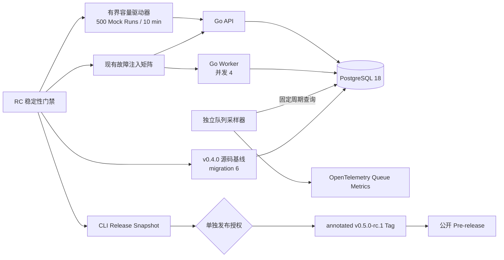

# Agent Studio v0.5.0-rc.1 发布收口设计

## 1. 背景

`v0.5-D` 已将运行从 API 进程内执行升级为 PostgreSQL 持久队列与独立 Worker，并交付租约、fencing、检查点恢复、人工恢复、加密私有载荷、v1alpha2 备份及对应管理体验。PR #35 已合并到 `main`，合并提交 `168488c57476c8ef98a630df2d46d6ab9fdf9967` 的六项 CI 全绿。

下一阶段不继续增加产品功能，而是以 `v0.5.0-rc.1` 收口现有能力。首要问题有三项：

1. Worker 满负载时不会进入下一次 claim 周期，队列 Gauge 刷新会延后；
2. 当前没有可重复的轻量容量基线，也没有从公开 `v0.4.0` 到 migration 7 再恢复旧环境的自动演练；
3. Runtime、SDK、官方节点包兼容区间和 Release 元数据仍停留在 v0.4，且 Release 工作流没有校验精确 `main` 提交的 push CI 结果。

本设计采用两个 PR：先完成稳定性加固，再完成 RC 发布准备。两个 PR 均需独立审查、回归并合并到最新 `main`；创建 Tag 和公开 Pre-release 属于第二次外部授权，不由计划获批或 PR 合并自动触发。

## 2. 目标

1. 队列深度与最老排队时间按独立固定周期采样，不受 Worker 执行槽占满影响；
2. 建立单 API、单 Worker、并发 4、500 次 Mock 运行的 10 分钟轻量容量上限；
3. 自动验证公开 `v0.4.0` 数据库升级到 migration 7，以及通过升级前数据库 dump 恢复旧版本环境；
4. 保持现有崩溃接管、错误密钥、备份恢复和浏览器回归门禁；
5. 将 Runtime 与 Go Node SDK 推进到 `0.5.0`，Node API 保持 `agent-studio.dev/v1alpha1`；
6. 继续发布四平台 CLI 归档、逐归档 SPDX SBOM 和 checksums，不增加容器制品；
7. Release 工作流在发布前验证 Tag、`origin/main` HEAD 和同一提交的成功 push CI；
8. 产出可执行的中文 RC Release Notes、升级、回滚和容量基线说明。

## 3. 非目标

- 不开发本地 RAG、Embedding、向量数据库、文件摄取或知识库页面；
- 不增加工具调用、调用循环、联网搜索或第二批官方节点；
- 不增加自动业务重试、指数退避、配额、限流、计费或 SLA；
- 不引入 Redis、Kafka、跨区域调度或 Worker 自动扩缩容；
- 不增加登录、RBAC、多租户或审计后台；
- 不发布 GHCR/Docker 镜像，不增加 Windows、安装器、代码签名或 macOS 公证；
- 不支持数据库逆迁移，不让 v0.4 二进制连接 migration 7 数据库；
- 不因 PR2 合并自动创建 `v0.5.0-rc.1` Tag 或 GitHub Release；
- 不承诺固定吞吐、P95 或生产容量，测量值仅作为本地轻量 RC 基线。

## 4. 已确认决策

| 决策 | 结果 |
|---|---|
| 下一阶段目标 | `v0.5.0-rc.1` 发布收口 |
| 变更范围 | 发布收口 + 必要稳定性加固 |
| 容量场景 | 1 API、1 Worker、Worker 并发 4、500 次 Mock 运行 |
| 时间边界 | 单次容量命令最长 10 分钟，不设置额外日历观察期 |
| 发布制品 | 沿用现有 CLI 制品，不发布容器镜像 |
| 集成方式 | PR1 稳定性加固，PR2 RC 发布准备 |
| 外部授权 | PR2 合并后再单独授权 Tag 与公开 Pre-release |

## 5. 方案选择

### 5.1 采用：稳定性 PR 与发布 PR 分离

PR1 只改变 Worker 采样与稳定性门禁；PR2 才改变版本、兼容区间、Release Notes 和发布工作流。这样运行时代码可以独立回滚和审查，发布提交不会混入尚未验证的行为变化。

### 5.2 未采用：单 PR 完成全部收口

单 PR 流程较短，但会把运行时并发、容量脚本、旧版本升级演练、SDK 版本和 Release 外部状态耦合在一起。任一稳定性问题都会迫使版本元数据反复变更，审查边界不清晰。

### 5.3 未采用：容量测试仅作为人工脚本

人工脚本不能防止后续 Worker 或 Store 变更破坏轻量容量基线。RC 的目标是建立可重复证据，因此容量场景必须进入仓库和 CI，但不把测量值升级为 SLA。

## 6. 总体架构



运行时仍只有 PostgreSQL 一个协调依赖。采样器属于 Worker 内部协程，不引入新进程、表、迁移或外部时序系统。容量和升级脚本只操作由本次命令创建的临时 Compose project、数据库和进程。

## 7. PR1：独立队列指标采样

### 7.1 配置

新增 `WORKER_QUEUE_SAMPLE_INTERVAL`：

- 默认值：`5s`；
- 允许范围：`1s` 到 `1m`，包含边界；
- 缺失时使用默认值；
- 格式错误、零值、负值或越界时 Worker 启动失败，并返回不含环境变量值的安全配置错误。

`worker.Config` 增加 `QueueSampleInterval time.Duration`。API 不读取该配置；Compose 只把同一环境变量传给 Worker。

### 7.2 生命周期

新增内部 `queueSampler`，依赖窄接口：

```go
type queueStatsSource interface {
    RunQueueStats(context.Context) (int64, time.Duration, error)
}

type queueSampleRecorder interface {
    queue(context.Context, int64, time.Duration)
    queueSample(context.Context, string)
}
```

Worker `Run` 启动后立即采样一次，再按 `QueueSampleInterval` 周期采样。采样器使用 Worker 根 Context；Context 取消后停止 ticker 并退出，`Run` 返回前等待采样协程退出。采样器不持有 Worker 的 active/cancel mutex，不参与 claim、lease、heartbeat 或 shutdown 计数。

现有 claim 成功、空队列和 claim 错误路径不再同步调用 `sampleQueue`。只有独立采样器写入 Gauge，避免两个事实来源和重复查询。

### 7.3 指标与错误

保留：

- `agent_studio.worker.queue_depth`；
- `agent_studio.worker.oldest_queued_age`。

新增：

- `agent_studio.worker.queue_sample_total{outcome="success|error"}`。

属性集合固定为 `success`、`error`，未知值归一化为 `error`。采样成功时对负数防御性归零并更新两个 Gauge；失败时不把 Gauge 写为 0，保留上次有效值并增加错误 Counter。采样错误不终止 Worker、不改变 readiness、不写 run ID、SQL、连接串或租约 owner。为避免数据库故障时每 5 秒刷屏，普通采样错误不额外写日志，告警以 Counter 和 PostgreSQL/claim 健康信号为准。

## 8. PR1：轻量容量门禁

### 8.1 隔离与依赖

`scripts/test-rc-capacity-e2e.sh` 必须：

- 要求 Docker、Docker Compose、curl、jq 和 Go；
- 要求显式非空 `RUN_PAYLOAD_ENCRYPTION_KEY`；
- 创建 `mktemp -d` 工作目录和唯一 `COMPOSE_PROJECT_NAME`；
- 使用 PostgreSQL 18 tmpfs，不声明或删除命名 volume；
- 使用可覆盖且按进程号派生的 localhost 端口；
- 仅删除本脚本创建的容器、网络、临时文件和镜像标签；
- 使用 trap 在成功、失败、中断和超时时收集/清理；
- 不连接默认 `DATABASE_URL` 或已有开发数据库。

### 8.2 工作负载

1. 构建带当前 API 与 Worker 的同一测试镜像；
2. 启动 1 个 API、1 个 Worker，设置 `WORKER_MAX_ACTIVE_RUNS=4`、Mock Provider 和固定测试密钥；
3. 创建并发布一个 `开始 → 提示词模板 → LLM(Mock) → 结束` 工作流；
4. 从提交第一条运行开始计时，提交 500 个带唯一 Idempotency-Key 的异步 Agent 运行；
5. 轮询有界数据库聚合与 API readiness，直到所有运行终态或达到内部 9 分 30 秒截止；
6. 在剩余 30 秒预算内生成摘要、失败日志并清理，使单条测试命令不超过 10 分钟。

本场景不主动重启进程；崩溃、接管、断连、错误密钥和备份恢复继续由现有 `test-durable-runs-e2e.sh` 覆盖，避免在容量结果中混入故障恢复等待时间。

### 8.3 成功条件

必须同时满足：

- `submitted = 500`；
- 500 个 run ID 唯一；
- `completed = 500`；
- `failed = cancelled = recovery_required = queued = running = cancelling = 0`；
- 每个运行恰好一个 terminal run event；
- terminal event sequence 连续且投影终态一致；
- `remainingLeases = 0`；
- `remainingQueueDepth = 0`；
- API `/readyz` 和 Worker 容器保持健康；
- 日志与摘要中没有密钥、密文、Authorization 或原始运行输入输出。

脚本生成 `artifacts/rc-capacity/summary.json`：

```json
{
  "submitted": 500,
  "completed": 500,
  "nonCompleted": 0,
  "duplicateTerminalEvents": 0,
  "remainingLeases": 0,
  "remainingQueueDepth": 0,
  "elapsedMs": 0,
  "throughputPerSecond": 0,
  "queueWaitP95Ms": 0
}
```

`throughputPerSecond` 和 `queueWaitP95Ms` 从数据库时间戳计算，只记录本次环境基线，不设置通过阈值。`elapsedMs` 必须小于 600000。摘要在 CI 成功或失败时均上传，保留 7 天；compose 日志只在失败时上传。

## 9. PR1：v0.4.0 升级与回滚演练

### 9.1 旧版本来源

演练只接受 annotated `v0.4.0` Tag，先验证：

- `git cat-file -t v0.4.0` 返回 `tag`；
- Tag 最终剥离对象是 commit；
- Tag 源码包含 `apps/api/cmd/server` 和 migration 6；
- 当前工作区干净。

`v0.4.0` 源码没有 Dockerfile，因此脚本使用 `git archive v0.4.0` 解压到权限受控的临时目录，再以 `CGO_ENABLED=0` 构建旧 API。不得从网络下载未知二进制，不修改 Tag 工作树，也不把旧源码生成物写回仓库。

### 9.2 升级路径

1. 启动隔离 PostgreSQL 18，创建 `upgrade_source` 数据库；
2. 启动旧 API，使数据库迁移到 migration 6；
3. 通过旧 API 创建工作流、发布版本并完成一个运行；
4. 依据 migration 6 约束，在事务中创建一个 `running` 和一个带取消意图的 `cancelling` 遗留运行夹具；
5. 停止旧 API，确认无连接继续写入；
6. 使用容器内 `pg_dump --format=custom` 创建升级前 dump，并执行 `pg_restore --list` 校验；
7. 使用同一非生产测试密钥启动当前 API，执行 migration 7，再启动当前 Worker；
8. 在启动 Worker 前验证 schema 版本为 7、旧 terminal 不变、旧 `running` 为 `recovery_required/legacy_active_run`、旧 `cancelling` 仍保留取消意图；
9. 启动当前 Worker 后验证遗留 `running` 不被领取，遗留 `cancelling` 不执行节点并安全收敛为 `cancelled`；
10. 使用当前 API 创建并完成新的 Mock 运行，验证 API/Worker 版本组合可用；
11. 停止全部当前进程。

### 9.3 回滚路径

1. 创建独立空数据库 `rollback_target`；
2. 把升级前 custom dump 恢复到 `rollback_target`；
3. 只让先前构建的 v0.4.0 API 连接 `rollback_target`；
4. 验证 migration 版本仍为 6、`/readyz` 成功、升级前工作流/版本/完成运行数量一致；
5. 验证 `rollback_target` 不包含 migration 7 新表；
6. 停止旧 API 并清理隔离 PostgreSQL。

脚本绝不执行 migration 7 逆迁移，绝不让 v0.4.0 API 连接已升级的 `upgrade_source`，也不宣称升级后产生的新运行会出现在升级前 dump 中。

### 9.4 失败证据

失败时保存：

- 旧/新 API 与 Worker 的脱敏日志；
- migration 版本、run 状态计数和表名清单；
- `pg_restore --list` 输出；
- 不包含行正文的断言摘要。

dump 本身包含业务数据，不上传 GitHub Actions artifact；清理时删除临时 dump。日志扫描禁止密钥、连接串密码、密文和运行正文。

## 10. PR1：CI 布局

现有 `Durable run recovery` Job 保留。新增两个独立 Job：

- `RC capacity baseline`：Job timeout 12 分钟；容量测试 step timeout 10 分钟；成功/失败均上传 summary；
- `v0.4 upgrade rollback`：Job timeout 10 分钟；checkout 使用 `fetch-depth: 0` 以获得 annotated Tag；失败时上传安全日志。

所有 Go 命令显式设置 `CGO_ENABLED=0`。Actions 固定到完整 commit SHA，权限保持 `contents: read`。两个 Job 在 pull request 和 `main` push 上运行；任一失败都阻止 PR1 或 PR2 合并。不得使用 `pull_request_target`、仓库 Secret、外部模型或公网服务。

## 11. PR2：版本与兼容性

### 11.1 版本矩阵

| 组件 | RC 值 |
|---|---|
| Release Tag | `v0.5.0-rc.1` |
| 开发构建 | `0.5.0-dev` |
| Go Node SDK | `0.5.0` |
| Node API | `agent-studio.dev/v1alpha1` |
| 官方扩展 Runtime 范围 | `[v0.2.0, v0.6.0)` |
| 备份格式 | v1alpha2，继续导入 v1alpha1 |
| 数据库 | migration 7 |

Go SDK 只推进发布版本，不改变 Node API 标识或公开接口行为。根官方扩展 manifest 扩大 Runtime 上限；生成式黄金路径、仓库 Release 契约和 Web 节点索引 fixture 同步验证 v0.5 兼容与 v0.6 排除语义。

### 11.2 快照源

以下来源必须一致：

- `internal/buildinfo` 开发版本；
- `sdk/go/agentnode` SDK 版本；
- `.goreleaser.yaml` snapshot 版本；
- `scripts/check-version.sh` 对应测试 fixture；
- README、SDK 兼容文档与 Release Notes；
- 官方扩展 manifest 和生成/索引契约测试。

Release Tag 保留 `-rc.1`，SDK 使用基础版本 `0.5.0`。`check-version.sh` 必须拒绝 SDK 不匹配、Release Notes 缺失、工作树不干净、HEAD 不是 `origin/main` 或非法 Tag。

## 12. PR2：CLI 制品与 Release 工作流

### 12.1 制品集合

继续生成且只生成：

- `agent-studio_v0.5.0-rc.1_linux_amd64.tar.gz`；
- `agent-studio_v0.5.0-rc.1_linux_arm64.tar.gz`；
- `agent-studio_v0.5.0-rc.1_darwin_amd64.tar.gz`；
- `agent-studio_v0.5.0-rc.1_darwin_arm64.tar.gz`；
- 每个归档对应一个 `.spdx.json`；
- 一个 `checksums.txt`。

归档继续包含 `README.md` 和 `LICENSE`。不上传 Docker 镜像、源代码包、自定义许可证清单、Windows 二进制或额外附件。四个平台各自在原生 Runner 上执行版本、架构、提交 SHA、checksum 和 SBOM 冒烟验证。

### 12.2 精确 main CI 验证

Release workflow 顶层保持 `contents: read`，build Job 增加 `actions: read`。在构建前：

1. fetch `origin/main`；
2. 断言 Tag/dispatch HEAD 等于 `origin/main` HEAD；
3. 通过 GitHub Actions API 查询 workflow `CI`；
4. 只接受 `event=push`、`head_sha=HEAD`、`status=completed`、`conclusion=success` 的 run；
5. 找不到精确成功 run 时失败关闭，不接受 PR run、旧提交 run、正在运行或被取消 run。

`workflow_dispatch` 只产生 snapshot，不发布。Tag push 才创建 draft、上传并逐字节复核 9 个资产，然后按 `-rc.*` 规则公开为 `draft=false`、`prerelease=true`；不得设置 Latest。

### 12.3 不可变失败语义

- Tag 必须是 annotated tag，不允许 lightweight tag；
- Release 已存在时失败，不覆盖或 `--clobber`；
- 构建或原生 smoke 失败时不创建 Release；
- draft 创建后验证失败时保留可审计失败状态，不伪装成功；
- 已公开 RC 不移动 Tag、不替换资产；阻塞缺陷通过 `v0.5.0-rc.2` 修复；
- 发布动作必须由用户在 PR2 合并、`main` CI 全绿后单独授权。

## 13. Release Notes 内容

`docs/releases/v0.5.0-rc.1.md` 使用中文，至少说明：

- RC 身份、非生产稳定版和不提供 v1 兼容承诺；
- v0.5-A 可观测性、v0.5-B 画布体验、v0.5-C 备份恢复、v0.5-D 持久运行；
- API 与 Worker 同版本、同数据库、同密钥和固定维护窗口；
- migration 7、v1alpha2/v1alpha1、错误密钥与人工恢复语义；
- 10 分钟/500 运行轻量容量基线及“不是 SLA”；
- CLI 安装、checksum、SBOM 验证；
- 已知限制：单租户、本地优先、无容器制品、无本地 RAG、无自动业务重试、无签名/公证；
- 回滚必须恢复升级前备份和旧制品，禁止逆迁移或旧/新进程混跑。

README 的开发者预览、安装命令、版本显示、制品示例和首版边界同步到 v0.5 RC，但在 Tag 实际公开前不得声称远端 Release 已存在。

## 14. 文件边界

### 14.1 PR1 新增

- `apps/api/internal/worker/queue_sampler.go`：独立周期采样生命周期；
- `apps/api/internal/worker/queue_sampler_test.go`：满载、错误、取消和周期行为；
- `scripts/test-rc-capacity-e2e.sh`：隔离容量场景；
- `scripts/test-rc-capacity-e2e_test.sh`：脚本安全、时限、隔离和断言契约；
- `scripts/test-v05-upgrade-rollback-e2e.sh`：v0.4 升级/回滚演练；
- `scripts/test-v05-upgrade-rollback-e2e_test.sh`：Tag、数据库隔离、无逆迁移和日志边界契约。

### 14.2 PR1 修改

- `apps/api/internal/worker/worker.go`、`worker_test.go`；
- `apps/api/internal/worker/telemetry.go`、`telemetry_test.go`；
- `apps/api/internal/config/config.go`、`config_test.go`；
- `apps/api/internal/bootstrap/components.go`、`components_test.go`；
- `.env.example`、`compose.yaml`；
- `Makefile`；
- `.github/workflows/ci.yml`；
- `docs/observability.md`；
- `docs/upgrades/v0.5-d.md`。

### 14.3 PR2 新增

- `docs/releases/v0.5.0-rc.1.md`。

### 14.4 PR2 修改

- `internal/buildinfo/buildinfo.go`、`buildinfo_test.go`；
- `sdk/go/agentnode/node.go` 及版本断言测试；
- `.goreleaser.yaml`；
- `Makefile`；
- `agent-studio.node-package.json`；
- `internal/generatedtest/golden_path_test.go`；
- `internal/generatedtest/repository_release_contract_test.go`；
- `apps/web/e2e/fixtures/node-index/index.json` 及节点索引浏览器测试；
- `scripts/check-version_test.sh`；
- `scripts/check-release-artifacts_test.sh`；
- `scripts/check-release-version_test.sh`；
- `scripts/check-release-workflow_test.sh`；
- `scripts/check-durable-run-docs_test.sh`；
- `.github/workflows/release.yml`；
- `README.md`；
- `docs/sdk/compatibility.md`；
- `docs/upgrades/v0.5-d.md`。

不修改 OpenAPI、数据库 migration、工作流图结构、运行状态机、节点定义契约或前端产品交互。

## 15. 测试矩阵

### 15.1 PR1 focused tests

- config 默认值、边界值和安全错误；
- queue sampler 立即采样、周期采样、满载独立性、Store 错误、负值归零、Context 取消；
- telemetry outcome 有界性与 Gauge/Counter 名称；
- 两个 shell contract test；
- 容量 E2E；
- v0.4 升级/回滚 E2E；
- 现有 durable runs E2E 与 backup E2E。

### 15.2 PR2 focused tests

- buildinfo、SDK、manifest 和生成式仓库版本契约；
- release version、artifact collection、workflow 静态契约；
- workflow `actions: read` 最小权限、精确 main push CI 查询、annotated tag、Pre-release 和 9 个附件；
- Release snapshot 四平台集合检查。

### 15.3 每个 PR 的完整回归

```bash
CGO_ENABLED=0 make verify
make test-e2e
make test-sdk-e2e
make test-durable-runs-e2e
make test-backup-e2e
make verify-workflows
make release-snapshot
```

所有单次测试命令设置不超过 10 分钟的上限；Release snapshot 构建不是测试命令，沿用现有 30 分钟 Job 上限。失败后先定位根因，禁止仅通过扩大等待掩盖竞态。

## 16. 安全与隐私

- 容量与升级场景只使用固定非生产测试密钥，真实 Secret 不进入 PR CI；
- 不打印环境变量值、数据库密码、Authorization、密文、输入输出或 lease owner；
- 容量 summary 仅包含聚合计数和时延；
- 升级 dump 含业务夹具，只保存在权限受控临时目录且不上传；
- 旧 Tag 源码只构建可信仓库的 annotated `v0.4.0`；
- PR workflow 权限为只读，发布写权限只存在于 tag publish Job；
- 不使用 `pull_request_target`，不执行 PR 提供的外部二进制；
- 清理仅按本次精确 Compose project、容器和临时路径执行，不删除命名 volume、开发数据库或其他工作树。

## 17. 可行性与阻塞项复审

| 风险 | 处理 | 结论 |
|---|---|---|
| Worker 满载不再 claim，Gauge 过期 | 独立 ticker 采样器，移除 claim 路径采样 | 已解除 |
| 采样失败误报 queue=0 | 保留上次 Gauge，增加有界错误 Counter | 已解除 |
| 采样协程泄漏 | 使用 Worker 根 Context，Run 返回前等待退出 | 已解除 |
| 500 运行污染开发库 | 唯一 Compose project + PostgreSQL tmpfs + 派生端口 | 已解除 |
| 10 分钟截止后无清理时间 | 内部 9 分 30 秒截止，剩余预算收证据和清理 | 已解除 |
| v0.4.0 无 Dockerfile | 从 annotated Tag 源码归档以 `CGO_ENABLED=0` 构建旧 API | 已解除 |
| 旧二进制误连 migration 7 | 两个数据库名、显式连接断言、脚本契约禁止混用 | 已解除 |
| 逆迁移损坏数据 | 只恢复升级前 dump 到空库，不执行逆 SQL | 已解除 |
| main 无分支保护 | Release workflow 校验精确 SHA 的成功 push CI | 已解除 |
| 官方 manifest 排除 v0.5 | PR2 推进上限至 `< v0.6.0` 并更新契约 | 已解除 |
| SDK 与 Release Tag 不匹配 | SDK 推进 0.5.0，preflight 强校验基础版本 | 已解除 |
| 发布错误覆盖远端状态 | annotated tag、已存在失败、不可变 RC、rc.2 修复 | 已解除 |
| 容量测量被误解为 SLA | Release Notes 和 summary 明确只记录本地 RC 基线 | 已解除 |

复审确认没有未决外部服务、占位需求或 Critical/Important 级阻塞。唯一外部状态动作是创建 Tag 和公开 GitHub Pre-release，必须在 PR2 合并及 `main` CI 全绿后单独授权。

## 18. 验收标准

### 18.1 PR1

1. Worker 四个槽位持续占满时，queue Gauge 仍按配置周期更新；
2. 采样错误不阻塞运行、claim、lease 或 shutdown；
3. 500 个 Mock 运行在 10 分钟命令上限内全部完成，终态、事件、租约和队列一致；
4. v0.4.0 migration 6 数据可升级到 migration 7，遗留活动运行不自动重放；
5. 升级前 dump 可恢复到空库，并由 v0.4.0 API 正常读取；
6. durable、backup、Go、Web、Playwright 和 workflow 门禁通过；
7. 日志、指标、summary 和 artifact 无秘密泄漏；
8. 代码审查无 P0/P1 后才允许合并。

### 18.2 PR2

1. Runtime/SDK/manifest/README/Release Notes/snapshot 版本一致；
2. Node API、备份格式和 migration 版本边界准确；
3. snapshot 只有 4 个 CLI、4 个 SBOM 和 checksums；
4. Release workflow 只接受精确 main HEAD 的成功 push CI；
5. RC Tag 必须 annotated，公开状态必须 Pre-release 且非 Latest；
6. 完整本地和远端 CI 全绿、代码审查无 P0/P1 后才允许合并；
7. 合并不自动创建 Tag/Release，等待用户第二次明确授权。

## 19. 实施顺序

1. 从最新 `main` 创建 PR1 分支；
2. TDD 实现 queue sampler、配置与 telemetry；
3. TDD 实现容量脚本和 CI；
4. TDD 实现 v0.4 升级/回滚脚本和 CI；
5. 更新运维文档、完成全量回归、代码审查、PR1 合并；
6. 再从最新 `main` 创建 PR2 分支；
7. 更新版本矩阵、官方 manifest、Release Notes 和 Release workflow；
8. 完成 snapshot、全量回归、代码审查、PR2 合并；
9. 验证合并后 main CI；
10. 向用户单独请求创建 `v0.5.0-rc.1` annotated Tag 与自动公开 Pre-release 的授权。
