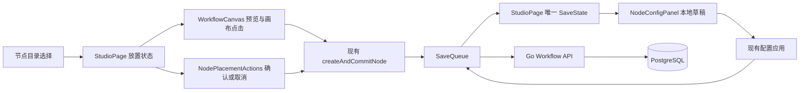

# Agent Studio v0.5.0 GA 稳定化与画布体验收口设计

**状态：** 设计已批准；两份实施计划待审

**日期：** 2026-09-28

**基线：** `origin/main` @ `4fee1799d917cb5599f2f5f5d54d37dd6f9ebab8`，与 `v0.5.0-rc.1` 指向同一提交
**设计分支：** `codex/v0.5.0-ga-design`

## 1. 目的与已确认选择

用户选择立即准备 `v0.5.0` GA，并同时选择严格稳定化与不改变 API、数据结构的前端体验修订。此前反复指出的体验重点是画布中的节点添加、节点配置和操作顺滑度。因此本设计把体验修订限制在现有节点放置与配置保存反馈两处，不引入新业务功能。

本版本仍是本地优先的**正式开发者预览版**，不宣称生产稳定性或 v1 兼容承诺。用户选择立即准备 GA，故不设置额外的日历观察期；是否发布取决于缺陷、代码审查、完整回归和发布门禁的实际证据。没有开放 Issue 仅说明当前仓库没有已登记的公开问题，不能代替验证。

冻结的版本与数据边界：

| 项目 | GA 值 |
| --- | --- |
| Runtime 源码开发构建 | `0.5.0-dev` |
| 正式标签 | `v0.5.0` |
| Go Node SDK | `0.5.0` |
| Node API | `agent-studio.dev/v1alpha1` |
| 官方 manifest Runtime 范围 | `[v0.2.0, v0.6.0)` |
| 备份格式 | `agent-studio.dev/backup/v1alpha2`，继续导入受支持的 `v1alpha1` |
| 数据库 | migration 7 |

## 2. 方案比较与选择

| 方案 | 做法 | 利弊 |
| --- | --- | --- |
| A：两个 PR，推荐 | PR1 只做节点放置与配置反馈；合并后 PR2 做 GA 文档和发布验证 | 审查范围清楚；可以单独回退体验修订；需要两次 CI |
| B：单个 PR | 将 UX、Release Notes 和发布检查放在一起 | 提交较少，但发布证据与产品交互变更相互干扰，问题定位困难 |
| C：先发布 rc.2 | UX 改动进入新的 RC，再准备 GA | 提供新增候选版本观察机会，但与本次“立即准备 GA”的选择不符 |

选用 A。PR1 只复用已有交互与状态源；PR2 不主动改运行引擎、SDK 或数据迁移。若 PR1 发现需要改变工作流 JSON、公共接口或关键编辑语义，停止本设计的 GA 路径，单独审查兼容性并修订为后续 RC 方案。

## 3. 总体架构

`StudioPage` 继续编排节点创建、配置应用与保存；`WorkflowCanvas` 仍只上报画布意图。新放置操作条调用已有 `confirmPlacement`/取消路径，不另建保存通道。配置面板分别展示本地草稿状态和**整个工作流**的保存状态，不能把全局 `SaveState` 说成某个节点已单独持久化。

交付依赖为：PR1 体验与回归 → PR2 GA 文档与发布检查 → 合并后的 `main` 门禁 → 正式标签与 Release。两个 PR 各自从当时最新的 `origin/main` 创建 `codex/` 分支。

## 4. PR1：低风险画布体验收口

### 4.1 节点放置

从节点目录点击卡片后，现有实现进入预览状态，默认位置取当前视野中的可用位置，用户可点击画布确认或按 Escape 取消。本阶段增加画布上可聚焦的操作条：显示选中节点名称、当前步骤，提供“确认放置”和“取消”两个明确按钮。键盘和触屏用户无需依赖画布空白处点击；指针移动预览、画布点击确认和拖放创建保持原语义。

确认按钮调用当前 `confirmPlacement`，仍只创建一个节点并触发一次保存；取消不创建节点、不更新“最近使用”。目录定义已失效、只读工作流、边界修复、配置草稿保护等既有门禁继续生效。操作条在预览退出后消失，焦点回到触发入口或新节点配置；窄屏不能产生页面级横向滚动。

### 4.2 节点配置与保存反馈

现有 `NodeConfigPanel` 将 `useNodeConfigDraft` 的 `idle` 状态称为“已应用”，而 `SaveQueue` 可能仍为 `pending`、`saving`、`error` 或 `conflict`。保留“已应用到画布”这一局部含义，同时在配置区独立显示全局保存状态：待保存、正在保存、已保存、保存失败、版本冲突。失败和冲突应明确指向现有命令条的“重试保存”或“刷新工作流”操作；面板不创建第二套保存或重试逻辑。

有未应用的表单草稿时，草稿状态与工作流保存状态仍分别呈现；例如“有未应用更改”与“工作流已保存”可以同时成立。状态使用文字与 `aria-live` 表达，不只依赖颜色。原有端口解析、破坏性端口确认、失效连线门禁以及“应用并试运行”等待保存完成的语义不变。

### 4.3 文件边界

| 文件 | 动作 | 职责 |
| --- | --- | --- |
| `apps/web/src/features/studio/NodePlacementActions.tsx` | 新增 | 放置预览中的确认、取消和步骤提示 |
| `apps/web/src/features/studio/StudioPage.tsx` | 修改 | 接入操作条，向配置面板传递现有 `SaveState` |
| `apps/web/src/features/studio/NodePlacementPreview.tsx` | 修改 | 使画布预览提示与显式操作一致 |
| `apps/web/src/features/studio/NodeConfigPanel.tsx` | 修改 | 分开展示草稿状态与工作流保存状态 |
| `apps/web/src/features/studio/studio.css` | 修改 | 操作条和状态信息的桌面、窄屏样式 |
| `apps/web/src/features/studio/NodePlacementActions.test.tsx` | 新增 | 确认、取消、焦点和可访问名称 |
| `apps/web/src/features/studio/StudioNodeCreation.test.tsx` | 修改 | 显式确认只保存一次、取消零保存、键盘退路 |
| `apps/web/src/features/studio/NodeConfigPanel.test.tsx` | 修改 | 草稿与五种保存状态组合的语义 |
| `apps/web/e2e/helpers.ts`、`apps/web/e2e/agent-studio.spec.ts` | 修改 | 更新放置提示断言并覆盖显式确认、窄屏与保存失败 |
| `docs/frontend-workbench.md` | 修改 | 节点放置和配置保存反馈的操作说明；修正过时的 Worker 阶段描述 |

不修改 `contracts/openapi.yaml`、Go API、数据库 migration、SDK、节点 manifest 或工作流 Graph 格式。若实现证明必须触及这些文件，先做兼容性审查和方案修订。

## 5. PR2：GA 发布收口

PR1 合并且回归通过后，从最新 `main` 建立发布分支。PR2 提供 `docs/releases/v0.5.0.md`，把 README 的当前版本入口和 `docs/upgrades/v0.5-d.md` 的发布引用更新为正式版；保留 RC 文档作为历史记录。文档准确描述 v0.5-A 可观测性、v0.5-B 画布、v0.5-C 备份恢复、v0.5-D 持久运行及 PR1 的有限 UX 改动，并继续说明单租户、无本地 RAG、无自动业务重试、无签名/公证等限制。

现有 SDK 已是 `0.5.0`，Node API 已是 `agent-studio.dev/v1alpha1`，`check-version.sh` 和 Release 工作流已覆盖正式 `v0.5.0` 标签。PR2 默认不修改这些实现或快照版本；用专项测试确认它们仍一致。正式标签构建继续使用同一份四平台归档、四份 SPDX SBOM 和 `checksums.txt`，共 9 个附件。公开结果须为非 Draft、非 Pre-release、Latest 且 Immutable。

| 文件 | 动作 | 职责 |
| --- | --- | --- |
| `docs/releases/v0.5.0.md` | 新增 | 中文 GA Release Notes、安装、升级回滚、验证证据与限制 |
| `README.md` | 修改 | 当前正式开发者预览版、安装和制品入口 |
| `docs/upgrades/v0.5-d.md` | 修改 | 正式版引用及版本矩阵；保留 migration 7 回滚语义 |
| `docs/sdk/compatibility.md` | 审核，必要时仅修正文案 | 确认 SDK 0.5.0、Node API v1alpha1 和官方 Runtime 区间表述 |
| `scripts/check-durable-run-docs_test.sh` | 修改 | 保留 RC 历史说明校验，新增 GA Notes 契约，并把 README/升级手册的当前版本断言切到 `v0.5.0` |
| `scripts/check-version_test.sh`、`scripts/check-release-version_test.sh` | 运行现有测试 | 已包含 `v0.5.0` 正式标签及正式 Release 语义，预计无需修改 |

发布前再次确认远端没有 `v0.5.0` Tag/Release、工作树干净、HEAD 等于最新 `origin/main`、对应 SHA 的 `main` push CI 成功、Immutable Releases 已启用，且 `CGO_ENABLED=0 make release-preflight TAG=v0.5.0` 通过。标签必须为 annotated Tag，且只指向上述提交；推送后由现有工作流构建、四平台冒烟、验证 Draft 附件并公开正式 Release。不得移动、覆盖已推送标签或替换不可变资产。

## 6. 验证与兼容性审查

PR1 的组件测试覆盖两种放置确认入口、取消、节点定义失效、只读门禁、焦点恢复、配置草稿与五种保存状态；浏览器 E2E 覆盖从节点库添加、配置、保存、试运行的桌面与窄屏主链路，以及网络保存失败/冲突恢复。代码审查重点核对单一保存源、无额外创建、错误状态不误报成功、键盘与触屏可用。

PR2 在隔离环境分别执行 Go/前端快速验证、完整 `make verify`、产品 E2E、SDK E2E、持久运行、备份恢复、500-run 容量、v0.4 升级与回滚、工作流静态校验、Release snapshot 和四平台原生 dry-run。每条**测试**命令设置不超过 600 秒的上限；制品构建单独按构建任务上限管理。Go 调试与测试显式设置 `CGO_ENABLED=0`。任一门禁失败时先定位并修复，再复跑相关专项与受影响的完整门禁。

文档静态门禁现将 README 和升级手册的当前版本锁定为 `v0.5.0-rc.1`，且只验证 RC Notes。PR2 必须先修改该脚本：继续验证 RC Notes 的历史契约，另对 GA Notes 验证版本、部署、回滚、容量、附件和限制；README 与升级手册只把当前入口推进为 `v0.5.0`。GA Tag 公开前仍禁止把远端状态写成已发生，脚本对无条件“已发布/已公开/Latest”的拒绝规则继续有效。

兼容性审查以 `v0.5.0-rc.1` 为基线，逐项检查 `contracts/openapi.yaml`、`sdk/go/agentnode`、`sdk/go/agenttest`、官方 manifest、数据库 migration、备份格式以及已发布节点的端口/错误语义。预期差异为零。任何非零差异都需单独说明影响、迁移与回归证据，完成专项审核后才能继续。

PR1 和 PR2 均需代码审查无未解决的 Critical/Important 问题，并在合并后核对 `main` CI。GA Tag 工作流成功后，再从公开 Release 下载并复核 9 个附件、校验和、版本、标签目标、Latest 与 Immutable 状态，并在可用时从公开 Go Proxy 安装精确版本。

## 7. 可行性与阻塞项复审

| 风险 | 证据与处理 | 结论 |
| --- | --- | --- |
| 当前工作树在旧设计分支 | 已从远端 `main` 创建独立 `codex/v0.5.0-ga-design`；实施 PR 各自再从最新 `main` 建分支 | 设计无阻塞 |
| 节点放置需要新状态通道 | `StudioPage` 已有初始可用位置、`confirmPlacement` 和取消路径；复用这些回调 | 无架构阻塞 |
| 配置面板误报保存完成 | `SaveQueue` 已提供 `saved/pending/saving/error/conflict`，由 `StudioPage` 统一持有；只需显示状态 | 无数据契约阻塞 |
| GA 代码较 RC 有 UX 差异 | PR1 独立审查与完整回归，PR2 再做四平台 dry-run；若产生兼容或关键语义变化，改走后续 RC | 发布前门禁 |
| 没有公开 Issue | 不能视为真实用户验收；以安装、回滚、容量、备份、浏览器和制品证据补足 | 发布前门禁 |
| 文档门禁锁定 `rc.1` | PR2 同步扩展静态测试，RC 历史断言保留，GA 当前版本与条件语气另行断言 | 已有明确改动路径 |
| 正式标签不可重用 | preflight 查重；只在最终提交通过全部门禁后创建；失败后不移动标签 | 发布前门禁 |

截至本设计编写时，`origin/main` 与 `v0.5.0-rc.1` 同为 `4fee1799`，公开 RC Release 和主线 CI 均成功，远端尚无 `v0.5.0` 标签，也无开放 Issue/PR。方案没有未解决的实现性阻塞；完整回归、代码审查和正式发布前检查仍是必须满足的执行门禁。

## 8. 完成定义

1. PR1 的节点放置可通过画布点击或显式确认完成；取消不保存；配置区准确区分本地草稿和服务端保存状态。
2. PR1 没有公共契约或数据迁移差异，并通过代码审查、前端主链路和完整回归。
3. PR2 的中文文档、版本与发布脚本一致；升级、回滚、安全和已知限制表述准确。
4. 所有单次测试在 10 分钟内完成，容量和升级回滚门禁通过，四平台制品及 9 件附件得到验证。
5. 合并后 `main` CI 成功；正式 `v0.5.0` Tag 与 Release 仅在独立发布前检查通过后创建，并完成公开面复核。
